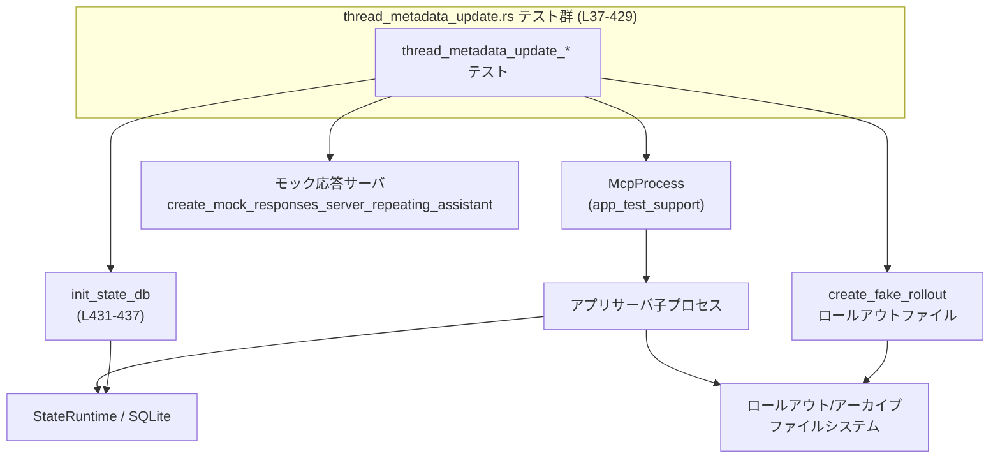
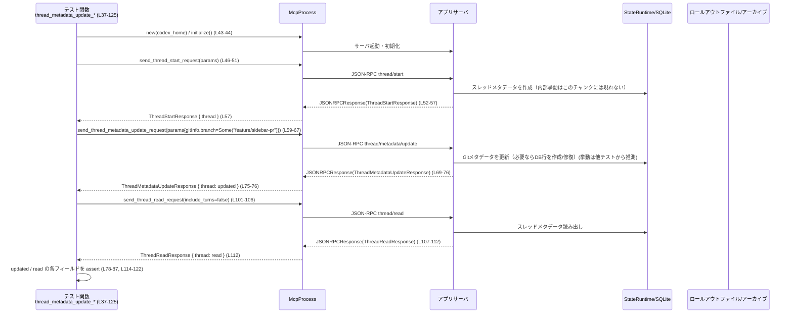

# app-server/tests/suite/v2/thread_metadata_update.rs

## 0. ざっくり一言

`thread/metadata/update` JSON-RPC API が、スレッドの Git メタデータを正しくパッチ／クリアしつつ、欠損した SQLite 状態を自己修復できることを、エンドツーエンドで検証する Tokio 非同期テスト群です（`app-server/tests/suite/v2/thread_metadata_update.rs:L37-L429`）。

---

## 1. このモジュールの役割

### 1.1 概要

- このモジュールは、アプリサーバの `thread/metadata/update` エンドポイントの **振る舞い契約** を検証する統合テストを提供します。
- 主に Git メタデータ（`sha` / `branch` / `origin_url`）の
  - パッチ更新
  - クリア（削除）
  - 不正入力（空パッチ）の拒否
を確認します（`L37-L171`, `L369-L429`）。
- さらに、SQLite の状態 DB にスレッド行が欠けている場合でも、ロールアウトファイルやアーカイブから **自己修復** できることを確認します（`L173-L367`）。

### 1.2 アーキテクチャ内での位置づけ

このテストは、以下のコンポーネントを実際に動かして相互作用を検証します。

- モック HTTP レスポンスサーバ（`create_mock_responses_server_repeating_assistant`、`L39`, `L129` など）
- アプリサーバを子プロセスとして管理する `McpProcess`（`L43`, `L133` など）
- 状態 DB ランタイム `StateRuntime` / SQLite（`L178`, `L231`, `L311`, `L387`, `L431-L437`）
- ロールアウトファイルを作成する `create_fake_rollout` とアーカイブディレクトリ（`L181-L188`, `L314-L321`, `L323-L331`, `L375-L386`）

Mermaid 依存関係図（このファイル全体の関係を簡略化）:



> App サーバ内部実装（`thread/metadata/update` など）はこのファイルには現れず、モジュール名から推測されるのみです。

### 1.3 設計上のポイント

- **エンドツーエンド志向**  
  - すべてのテストは、実際に `McpProcess` でアプリサーバを起動し、JSON-RPC リクエストを送信します（例: `L43-L51`, `L190-L203`, `L392-L400`）。
- **非同期 & タイムアウトによる安全性**  
  - `#[tokio::test]` により各テストは非同期で実行されます（`L37`, `L127`, `L173`, `L226`, `L306`, `L369`）。
  - `tokio::time::timeout` によってレスポンス待ちに上限 10 秒を設け、ハングを防ぎます（`L52-L56`, `L69-L73` など）。
- **ファイルシステムと DB を含むシナリオ**  
  - `TempDir` による一時ディレクトリでテストを隔離し（`L40`, `L130`, `L176`, `L229`, `L309`, `L372`）、ロールアウトファイルやアーカイブディレクトリを操作します（`L181-L188`, `L323-L331`）。
  - `StateRuntime` を初期化し、Backfill 完了マークを付けてから利用することで（`L431-L437`）、状態 DB の前提条件を満たしています。
- **プロトコル型を用いた型安全な JSON-RPC**  
  - 送受信は `ThreadStartParams` / `ThreadMetadataUpdateParams` / `ThreadReadParams` などの型を通じて行われ、レスポンスは `to_response::<...>` で型付きにデシリアライズされます（`L47-L51`, `L60-L67`, `L112`, `L208-209` など）。
- **Git メタデータパッチの契約の明示**  
  - 「空の `gitInfo` パッチはエラー」「`Some(Some(...))` で設定」「`Some(None)` でクリア」といった契約をテスト名と入力値から確認できます（`L150-L168`, `L196-L200`, `L395-L399`）。

---

## 2. 主要な機能一覧（コンポーネントインベントリー）

### 2.1 本ファイル内の関数一覧

| 名前 | 種別 | 役割 / 用途 | 定義位置 |
|------|------|------------|----------|
| `thread_metadata_update_patches_git_branch_and_returns_updated_thread` | `#[tokio::test] async fn` | 新規スレッドに対し、`gitInfo.branch` のパッチ適用と、その結果がレスポンスおよび `thread/read` 結果に反映されることを検証する | `thread_metadata_update.rs:L37-L125` |
| `thread_metadata_update_rejects_empty_git_info_patch` | `#[tokio::test] async fn` | `gitInfo` オブジェクトが空（全フィールド `None`）の場合に、JSON-RPC エラーとなることを検証する | `L127-L171` |
| `thread_metadata_update_repairs_missing_sqlite_row_for_stored_thread` | `#[tokio::test] async fn` | ロールアウトファイルのみ存在し、SQLite 行がない「保存済みスレッド」に対して `thread/metadata/update` が行われた際、DB 行が修復されることを検証する | `L173-L224` |
| `thread_metadata_update_repairs_loaded_thread_without_resetting_summary` | `#[tokio::test] async fn` | 一度ロードされたスレッドの SQLite 行を削除した後でも、`thread/metadata/update` によりメタデータが修復されることを検証する（テスト名は summary を言及するが、コード上は preview と created_at を検証） | `L226-L304` |
| `thread_metadata_update_repairs_missing_sqlite_row_for_archived_thread` | `#[tokio::test] async fn` | アーカイブディレクトリ配下にのみロールアウトファイルが存在するスレッドについて、`thread/metadata/update` が正しく機能することを検証する | `L306-L367` |
| `thread_metadata_update_can_clear_stored_git_fields` | `#[tokio::test] async fn` | 既存の Git メタデータを `gitInfo` パッチで **クリア（削除）** できることと、その結果が `thread/read` にも反映されることを検証する | `L369-L429` |
| `init_state_db` | `async fn` | 指定ホームディレクトリ配下に `StateRuntime` を初期化し、Backfill 完了フラグを付与した上で `Arc` で返すヘルパー | `L431-L437` |
| `create_config_toml` | `fn` | テスト用の `config.toml` を生成し、モックプロバイダや SQLite 有効化などの設定を書くヘルパー | `L439-L464` |

### 2.2 このファイルが依存する主な外部コンポーネント

（ファイルパスはこのチャンクからは不明なため、モジュールパスのみ記載します）

| モジュール / 型 | 役割 / 用途 | 使用箇所 |
|----------------|------------|----------|
| `app_test_support::McpProcess` | アプリサーバ子プロセスとの JSON-RPC 通信を管理するクライアント | `L43`, `L133`, `L190`, `L255`, `L333`, `L389` など |
| `app_test_support::create_mock_responses_server_repeating_assistant` | 「Done」と応答し続けるモック HTTP サーバを立ち上げる | `L39`, `L129`, `L175`, `L228`, `L308`, `L371` |
| `app_test_support::create_fake_rollout` | ロールアウトファイルと対応する thread_id を生成する | `L181-L188`, `L234-L241`, `L314-L321`, `L375-L386` |
| `codex_app_server_protocol::*` | JSON-RPC リクエスト／レスポンス型、`GitInfo`、`ThreadStatus` などのプロトコル定義 | 全テストで使用（例: `L47-L51`, `L60-L67`, `L101-L106`, `L112`, `L208-209`, `L393-400`） |
| `codex_state::StateRuntime` | SQLite ベースの状態 DB ランタイム | `L178`, `L231`, `L311`, `L387`, `L431-L437` |
| `codex_rollout::state_db::reconcile_rollout` | ロールアウトファイルと DB を突き合わせて状態を整合させる | `L244-L253` |
| `codex_core::ARCHIVED_SESSIONS_SUBDIR` | アーカイブされたセッションを格納するサブディレクトリ名 | `L323-L331` |
| `tokio::time::timeout` | 非同期処理にタイムアウトを設定する | レスポンス待ち全般（`L52-L56`, `L69-L73`, `L107-L111`, `L142-L146`, `L159-L163`, `L203-L207`, `L264-L268`, `L283-L287`, `L346-L350`, `L402-L406`, `L419-L423`） |

---

## 3. 公開 API と詳細解説

このファイル自体はテスト用モジュールのため、外部に再利用される「公開 API」はありません。ただし、**アプリサーバの外部 API 利用例**として重要なテスト関数を 6 個、およびヘルパーを 1 個、テンプレートに沿って説明します。

### 3.1 型一覧（このファイルで直接定義される主な型）

このファイル内には構造体・列挙体などの新規定義はありません。すべて外部クレートの型（`ThreadStartParams` や `GitInfo` など）を利用しています。

### 3.2 関数詳細（7 件）

#### `thread_metadata_update_patches_git_branch_and_returns_updated_thread() -> Result<()>`

**概要**

- 新規スレッドを生成し、そのスレッドの Git メタデータ `branch` を `thread/metadata/update` で更新できることを検証します。
- 更新後の `thread.git_info` が
  - JSON-RPC レスポンスの型付きオブジェクト
  - `result.thread.gitInfo` の JSON 表現
  - `thread/read` の応答
 すべてで期待どおりであることを確認します（`L37-L125`）。

**引数**

- テスト関数のため引数はありません。

**戻り値**

- `anyhow::Result<()>`  
  - 内部で発生した I/O エラーや JSON デシリアライズエラーなどはすべて `Err` として伝播し、テスト失敗になります（`L39-L44`, `L52-L56`, `L57` における `?` / `??` から確認できます）。

**内部処理の流れ**

1. モック応答サーバと一時ディレクトリを用意し、`config.toml` を生成  
   - `create_mock_responses_server_repeating_assistant("Done")` でモックサーバ起動（`L39`）。  
   - `TempDir::new()` と `create_config_toml` でテスト用ホームディレクトリと設定を準備（`L40-L41`）。
2. `McpProcess` を初期化  
   - `McpProcess::new(codex_home.path()).await?`（`L43`）。  
   - `mcp.initialize()` を `timeout` 付きで実行し、サーバ準備完了を待機（`L44`）。
3. `thread/start` で新規スレッドを作成  
   - `send_thread_start_request(ThreadStartParams { model: Some("mock-model".into()), ..Default::default() })`（`L46-L51`）。  
   - `read_stream_until_response_message(RequestId::Integer(start_id))` でレスポンスを待ち、`to_response::<ThreadStartResponse>` で型付きに変換（`L52-L57`）。
4. `thread/metadata/update` で `gitInfo.branch` をパッチ  
   - `ThreadMetadataUpdateParams` で `thread_id` を指定し、`git_info` に `ThreadMetadataGitInfoUpdateParams` を与える（`L59-L67`）。  
   - ここで `branch: Some(Some("feature/sidebar-pr".to_string()))` として、**「branch をこの値に設定するパッチ」** を表現しています（`L62-L65`）。  
   - レスポンスを `ThreadMetadataUpdateResponse` にデシリアライズし、`updated` スレッドを取り出す（`L69-L76`）。
5. 型付きオブジェクトレベルでの検証  
   - `updated.id` が元の `thread.id` と一致すること（`L78`）。  
   - `updated.git_info` が `Some(GitInfo { sha: None, branch: Some("feature/sidebar-pr"), origin_url: None })` であること（`L79-L86`）。  
   - `updated.status` が `ThreadStatus::Idle` であること（`L87`）。
6. JSON レベルでのフィールドシリアライズ検証  
   - `update_resp.result["thread"]["gitInfo"]` を `serde_json::Value` として取り出し（`L74`, `L88-L95`）、  
   - `gitInfo.branch` キーが `"feature/sidebar-pr"` という文字列であることを検証（`L96-L99`）。
7. `thread/read` で永続化結果を検証  
   - `send_thread_read_request(ThreadReadParams { thread_id: thread.id, include_turns: false })`（`L101-L106`）。  
   - レスポンスを `ThreadReadResponse` にデシリアライズし（`L107-L112`）、`read.git_info` と `read.status` が期待どおりであることを検証（`L114-L122`）。

**Examples（使用例）**

- このテスト関数自体が、`thread/start` → `thread/metadata/update` → `thread/read` の **典型的な使用例** になっています（`L46-L122`）。
- より簡略化した例は §5.1 に示します。

**Errors / Panics**

- `timeout(...).await??` により、  
  - タイムアウト発生時（`tokio::time::error::Elapsed`）  
  - 内部 I/O やプロトコルエラー  
  のいずれも `Err` としてテストに伝播します（`L52-L56`, `L69-L73`, `L107-L111`）。
- JSON 構造が期待と違う場合は `expect(...)` により panic します（`L88-L91`, `L92-L95`）。

**Edge cases（エッジケース）**

- `git_info` に `sha` と `origin_url` を指定していない場合、既存値が保持されるかどうかはこのテストからは分かりません（常に `None` が期待値になっているため、`L81-L85`, `L116-L120`）。
- `include_turns: false` で `thread/read` しているため、ターン情報の取り扱いはこのテストではカバーされていません（`L103-L105`）。

**使用上の注意点**

- Git メタデータのパッチでは、各フィールドに対して
  - `None`：そのフィールドを変更しない
  - `Some(Some(value))`：その値に設定
  - `Some(None)`：そのフィールドをクリア  
  という 3 段階の意味づけが使われていると解釈できますが、型定義はこのチャンクには現れないため、詳細は外部定義を参照する必要があります（挙動は他テストと合わせて §5.2 で整理します）。

---

#### `thread_metadata_update_rejects_empty_git_info_patch() -> Result<()>`

**概要**

- `git_info` オブジェクトがすべてのフィールド `None` の場合、`thread/metadata/update` が JSON-RPC エラーを返すことを検証します（`L127-L171`）。

**内部処理の流れ（要点）**

- `thread/start` までは最初のテストと同様（`L129-L147`）。
- `ThreadMetadataUpdateParams` の `git_info` に、すべて `None` の `ThreadMetadataGitInfoUpdateParams` を渡す（`L149-L157`）。
- レスポンスを `JSONRPCError` 型として受け取り（`L159-L163`）、エラーメッセージが `"gitInfo must include at least one field"` であることを検証（`L165-L168`）。

**契約上のポイント**

- 「`gitInfo` を含める場合は、少なくとも `sha` / `branch` / `origin_url` のいずれか 1 つには値を指定すること」という API 契約が、このテストから読み取れます。

**使用上の注意点**

- すべて `None` のパッチを送ると必ずエラーになるため、**「何も変えないために空パッチを送る」** という使い方は許容されません（`L149-L168`）。

---

#### `thread_metadata_update_repairs_missing_sqlite_row_for_stored_thread() -> Result<()>`

**概要**

- ロールアウトファイルのみ存在し、SQLite 状態 DB にスレッド行がない「保存済みスレッド」に対して、`thread/metadata/update` を行うと **DB 行が自動的に補完される** ことを検証します（`L173-L224`）。

**内部処理の流れ**

1. 通常どおりモックサーバ・`config.toml` を用意（`L175-L177`）。
2. `init_state_db` で状態 DB を初期化し、Backfill 完了をマーク（`L178`、`L431-L437`）。
3. `create_fake_rollout` でロールアウトファイルを作成し、`thread_id` を取得（`L180-L188`）。  
   - 引数 `git_info` は `None` で、初期状態では Git メタデータがないことを表しています（`L187`）。
4. `McpProcess` を初期化（`L190-L191`）。
5. `thread/metadata/update` により `gitInfo.branch` をパッチ（`L193-L201`）。
6. レスポンスから `updated` スレッドを取り出し、以下を検証（`L208-L221`）。  
   - `id` が `thread_id` と一致（`L211`）。  
   - `preview` がロールアウト作成時の `Stored thread preview` であること（`L180`, `L212`）。  
   - `created_at` が `2025-01-05T12:00:00Z` 相当の Unix 時刻 `1736078400` であること（`L183-L184`, `L213`）。  
   - `git_info.branch` が `"feature/stored-thread"` に更新されていること（`L214-L221`）。

**Edge cases**

- SQLite 行が存在しないにもかかわらず、`preview` や `created_at` が正しく返ってくることから、サーバ側はロールアウトファイルからメタデータを再構成していると考えられますが、内部実装はこのチャンクには現れません。
- `git_info` の初期値が `None` であっても、パッチ後には `Some(GitInfo { branch: Some(...), ... })` に変わることを確認しています（`L214-L221`）。

**使用上の注意点**

- テスト名にある「missing sqlite row」は、テストコード側で明示的に DB 行を削除しているわけではなく、**最初から行を作っていない** 状態で再現している点に注意が必要です（DB 行の有無はこのファイルからは直接確認できません）。

---

#### `thread_metadata_update_repairs_loaded_thread_without_resetting_summary() -> Result<()>`

**概要**

- 一度ロールアウトを `reconcile_rollout` でロードし、さらに `thread/resume` を通じて処理した後、そのスレッドの SQLite 行を削除してから `thread/metadata/update` を行うシナリオをテストします（`L226-L304`）。
- この操作により、DB 行が削除されていても、`thread/metadata/update` でメタデータが復元されることを検証します。

**内部処理の流れ**

1. セットアップ（モックサーバ、config、`init_state_db`）はこれまでと同様（`L228-L232`）。
2. `create_fake_rollout` でロールアウトファイル作成（`L233-L241`）。
3. `ThreadId::from_string` により `thread_id` を型安全な `ThreadId` に変換（`L242`）。
4. `rollout_path` でロールアウトファイルのパスを求め（`L243`）、`reconcile_rollout` を実行してロールアウトと状態 DB を整合（`L244-L253`）。
5. `McpProcess` 初期化後、`thread/resume` を実行し（`L255-L269`）、スレッドがアクティブに使われた状況を作ります。
6. `state_db.delete_thread(thread_uuid).await?` で SQLite から当該スレッド行を削除し、その削除件数が 1 件であることを確認（`L271`）。
7. その後、`thread/metadata/update` により `gitInfo.branch` を `"feature/loaded-thread"` に更新（`L273-L281`）。
8. レスポンスで `id`、`preview`、`created_at`、`git_info` が期待どおりであることを検証（`L288-L301`）。

**テスト名とアサーションの関係**

- テスト名は「without resetting summary」となっていますが、コード上で検証しているのは `preview` と `created_at` と `git_info` のみです（`L291-L301`）。
- `summary` というフィールドがどこかに存在すると想定されますが、このテストではその値を直接アサートしていません。  
  → 「summary がリセットされていない」ことについては、このチャンクだけからは断定できません。

**使用上の注意点**

- 状態 DB から行を削除したあとでも、`thread/metadata/update` を呼ぶことでスレッドのメタデータが復元されうる、という前提をテストしています。アプリケーションコード側でこの挙動に依存する場合は、サーバ実装側の契約を確認する必要があります。

---

#### `thread_metadata_update_repairs_missing_sqlite_row_for_archived_thread() -> Result<()>`

**概要**

- ロールアウトファイルをアーカイブディレクトリ (`ARCHIVED_SESSIONS_SUBDIR`) に移動させた状態で、`thread/metadata/update` がスレッド情報を正しく返すことを検証します（`L306-L367`）。

**内部処理の流れ**

1. 通常どおりモックサーバ・`config.toml`・状態 DB を準備（`L308-L311`）。
2. `create_fake_rollout` でロールアウトファイル作成（`L313-L321`）。
3. `ARCHIVED_SESSIONS_SUBDIR` 配下にアーカイブディレクトリを作成し（`L323-L325`）、`fs::rename` により元のロールアウトファイルをそこへ移動（`L326-L331`）。
4. `McpProcess` を初期化し（`L333-L334`）、`thread/metadata/update` で `gitInfo.branch` を `"feature/archived-thread"` に更新（`L336-L343`）。
5. レスポンスで `id`、`preview`、`created_at`、`git_info` を検証（`L351-L364`）。`created_at` は `1736152200` で、前テストの `Loaded` ケースと同じ値です（`L355-L356`）。

**Edge cases**

- スレッドのロールアウトが **アーカイブにのみ存在** している状態でも、サーバ側はそれを見つけてメタデータを返せることがこのテストから分かります。
- SQLite 行の有無は明示的には操作していませんが、`init_state_db` を呼んでいるだけで `thread_id` 用の行は作っていないため、「missing sqlite row for archived thread」という状況を再現していると解釈できます（`L311`, `L313-L321`）。

---

#### `thread_metadata_update_can_clear_stored_git_fields() -> Result<()>`

**概要**

- ロールアウト作成時に保存された Git メタデータ（`commit_hash` / `branch` / `repository_url`）を、`thread/metadata/update` の `gitInfo` パッチで **すべてクリアできる** ことを検証します（`L369-L429`）。

**内部処理の流れ**

1. モックサーバ・`config.toml` を準備（`L371-L373`）。
2. `create_fake_rollout` を `git_info: Some(RolloutGitInfo { ... })` 付きで実行し、Git 情報を持つロールアウトを作成（`L375-L386`）。
   - `commit_hash: Some(GitSha::new("abc123"))`（`L381-L382`）
   - `branch: Some("feature/sidebar-pr".to_string())`（`L383`）
   - `repository_url: Some("git@example.com:openai/codex.git".to_string())`（`L384`）
3. 状態 DB を初期化（`L387`）。
4. `McpProcess` 初期化後、`thread/metadata/update` を呼び出し（`L389-L400`）、`git_info` に以下のパッチを指定：  
   - `sha: Some(None)`  
   - `branch: Some(None)`  
   - `origin_url: Some(None)`  
   → それぞれのフィールドを **クリア（削除）** する意図のパッチであると読み取れます（`L395-L399`）。
5. レスポンスで `updated.id` が `thread_id` に一致し、`updated.git_info` が `None` になっていることを検証（`L407-L411`）。
6. 続いて `thread/read` を呼び、DB などの永続層でも `read.git_info` が `None` であることを確認（`L413-L426`）。

**Edge cases**

- 既に Git 情報を持つスレッドに対して `git_info` を `Some(None)` でパッチすると、「フィールドを削除する」挙動が得られることが確認できます（`L395-L399`, `L410-L411`, `L426`）。
- パッチ後の `thread/read` でも `None` であるため、これは単にレスポンスだけが書き換わったのではなく、永続化層に対しても反映されていると考えられます（`L413-L426`）。

**使用上の注意点**

- 任意のフィールドをクリアしたいときは、そのフィールドに `Some(None)` を指定する必要があります。単に `None` を指定した場合は「変更なし」と解釈される可能性があります（明示的な挙動は型定義に依存）。

---

#### `init_state_db(codex_home: &Path) -> Result<Arc<StateRuntime>>`

**概要**

- 指定した `codex_home` ディレクトリをもとに `StateRuntime`（状態 DB ランタイム）を初期化し、Backfill 完了フラグを付与した上で `Arc` で返すヘルパー関数です（`L431-L437`）。

**引数**

| 引数名 | 型 | 説明 |
|--------|----|------|
| `codex_home` | `&Path` | SQLite 状態 DB を置くホームディレクトリ。テストではすべて `TempDir` 配下が渡されています（`L178`, `L231`, `L311`, `L387`）。 |

**戻り値**

- `Result<Arc<StateRuntime>>`  
  - 初期化と Backfill マークが成功すれば、`Arc` でラップされた `StateRuntime` を返します（`L432-L437`）。

**内部処理の流れ**

1. `StateRuntime::init(codex_home.to_path_buf(), "mock_provider".into()).await?` により、指定ディレクトリとプロバイダ名 `"mock_provider"` で状態 DB を初期化（`L432`）。
2. `mark_backfill_complete(None).await?` を呼び出して Backfill 処理が完了している状態にし（`L433-L435`）、  
3. 最後に `Ok(state_db)` として `Arc<StateRuntime>` を返します（`L436`）。

**Errors**

- DB 初期化に失敗した場合や、`mark_backfill_complete` がエラーを返した場合は `Err` として呼び出し元のテストに伝播します（`L432-L435`）。

**使用上の注意点**

- この関数は `"mock_provider"` 固定で `StateRuntime` を初期化するため、他のプロバイダ名を用いたテストには流用しにくい設計です。  
- 非同期関数であり、`await` が必要です（`L178`, `L231`, `L311`, `L387`）。

---

### 3.3 その他の関数

| 関数名 | 役割（1 行） | 定義位置 |
|--------|--------------|----------|
| `create_config_toml(codex_home: &Path, server_uri: &str) -> std::io::Result<()>` | テスト用の `config.toml` を書き出し、モデル／プロバイダ設定、SQLite 有効化、`sandbox_mode = "read-only"` などを設定する | `L439-L464` |

`create_config_toml` の内容から、テスト時には常に SQLite 機能が有効 (`[features] sqlite = true`、`L452-L453`) であり、サンドボックスモードは読み取り専用 (`sandbox_mode = "read-only"`、`L447`) に設定されていることが分かります。

---

## 4. データフロー

ここでは、最初のテスト  
`thread_metadata_update_patches_git_branch_and_returns_updated_thread`（`L37-L125`）を例に、`thread/start` → `thread/metadata/update` → `thread/read` の典型的なフローを整理します。

### 4.1 処理の要点

1. テストコードが `McpProcess` を通じてアプリサーバを起動し、JSON-RPC で `thread/start` を呼ぶ（`L43-L57`）。
2. 返された `thread.id` を使って、`thread/metadata/update` で Git ブランチ情報をパッチする（`L59-L76`）。
3. 更新後のスレッドを即座にレスポンスから検証し、さらに `thread/read` で永続化層から読み出して検証する（`L78-L122`）。

### 4.2 シーケンス図



> App サーバが DB や FS に対してどのようなクエリを打っているかは、このファイルからは直接は分かりませんが、テストの期待値から挙動が間接的に検証されています。

---

## 5. 使い方（How to Use）

このファイルはテストコードですが、`thread/metadata/update` API の典型的な使い方を知る上で有用なサンプルになっています。

### 5.1 基本的な使用方法（ブランチを更新する）

以下は、ブランチ名だけを設定するシンプルなフローを抜き出した例です。  
実際にはテストのように `create_config_toml` や `init_state_db` などの準備が必要です。

```rust
use app_test_support::McpProcess;                                 // アプリサーバ子プロセスとの通信ラッパー
use codex_app_server_protocol::{
    ThreadStartParams, ThreadMetadataUpdateParams,
    ThreadMetadataGitInfoUpdateParams, ThreadReadParams,
    ThreadStartResponse, ThreadMetadataUpdateResponse, ThreadReadResponse,
    JSONRPCResponse, RequestId,
};
use tokio::time::timeout;

async fn update_branch_example(mcp: &mut McpProcess, thread_id: String) -> anyhow::Result<()> {
    // 1. thread/metadata/update でブランチを変更する                        // Git ブランチだけを更新する
    let update_id = mcp
        .send_thread_metadata_update_request(ThreadMetadataUpdateParams {
            thread_id: thread_id.clone(),                               // 更新対象のスレッドID
            git_info: Some(ThreadMetadataGitInfoUpdateParams {
                sha: None,                                              // sha は変更しない
                branch: Some(Some("feature/sidebar-pr".to_string())),   // ブランチをこの値に設定
                origin_url: None,                                       // origin_url は変更しない
            }),
        })
        .await?;                                                        // JSON-RPC リクエスト送信

    // 2. タイムアウト付きでレスポンスを待つ                                 // ハングを防ぐため timeout でラップ
    let update_resp: JSONRPCResponse = timeout(
        std::time::Duration::from_secs(10),
        mcp.read_stream_until_response_message(RequestId::Integer(update_id)),
    )
    .await??;                                                           // timeout と I/O の二重 Result を ? で展開

    let ThreadMetadataUpdateResponse { thread: updated } =
        app_test_support::to_response::<ThreadMetadataUpdateResponse>(update_resp)?; // 型付きにデコード

    // 3. 必要に応じて thread/read で永続化結果を確認                        // DB に反映されているか確認したい場合
    let read_id = mcp
        .send_thread_read_request(ThreadReadParams {
            thread_id,
            include_turns: false,                                       // メタデータだけ欲しいのでターンは不要
        })
        .await?;

    let read_resp: JSONRPCResponse = timeout(
        std::time::Duration::from_secs(10),
        mcp.read_stream_until_response_message(RequestId::Integer(read_id)),
    )
    .await??;

    let ThreadReadResponse { thread: read } =
        app_test_support::to_response::<ThreadReadResponse>(read_resp)?;

    assert_eq!(updated.git_info, read.git_info);                        // レスポンスと read の整合性を確認

    Ok(())
}
```

この例は、`thread_metadata_update_patches_git_branch_and_returns_updated_thread` の一部（`L59-L76`, `L101-L112`）を整理したものです。

### 5.2 よくある使用パターン

このファイルから読み取れる `gitInfo` パッチのパターンを整理します。

1. **特定フィールドだけを設定する**

   ```rust
   // ブランチだけ設定する例（L60-L67, L196-L200）
   git_info: Some(ThreadMetadataGitInfoUpdateParams {
       sha: None,                                          // 変更なし
       branch: Some(Some("feature/my-branch".to_string())),// この値に設定
       origin_url: None,                                   // 変更なし
   })
   ```

2. **既存フィールドをクリア（削除）する**

   ```rust
   // すべての Git 情報を削除する例（L395-L399）
   git_info: Some(ThreadMetadataGitInfoUpdateParams {
       sha: Some(None),        // sha をクリア
       branch: Some(None),     // branch をクリア
       origin_url: Some(None), // origin_url をクリア
   })
   ```

3. **パッチを送らない（変更しない）**

   - このファイルには「`git_info: None` を指定して thread/metadata/update を呼ぶ」例はありませんが、
   - `ThreadMetadataUpdateParams` の型から `git_info` が `Option` であることが分かるため（`L60-L67`, `L150-L157`）、`None` は「gitInfo を変更しない」意味であると推測できます。ただし、これは実装側のドキュメントで確認が必要です。

### 5.3 よくある間違い

**誤り例：空の `gitInfo` パッチを送る**

```rust
// 間違い: すべて None の gitInfo を送ってしまう（L150-L157）
git_info: Some(ThreadMetadataGitInfoUpdateParams {
    sha: None,
    branch: None,
    origin_url: None,
})
// → JSONRPCError.message == "gitInfo must include at least one field" となる（L165-L168）
```

**正しい例：変更したいフィールドを明示する**

```rust
// 正: 少なくとも1つのフィールドには Some(...) or Some(None) を指定する
git_info: Some(ThreadMetadataGitInfoUpdateParams {
    sha: None,                                        // 変更しない
    branch: Some(Some("feature/sidebar-pr".into())),  // 設定したい値
    origin_url: None,
})
```

### 5.4 使用上の注意点（まとめ）

- `git_info` を含める場合は、**少なくとも 1 つのフィールドを Some(...) か Some(None) で指定する必要があります**（空オブジェクトはエラー、`L150-L168`）。
- フィールドの 3 値性（変更なし／設定／削除）を区別するために `Option<Option<T>>` のような型が使われていると見られ、誤用しやすい点です（具体的な型はこのチャンクには現れませんが、`L196-L200`, `L395-L399` の使い分けから推測できます）。
- 非同期呼び出しでは `timeout` を利用し、レスポンス待ちが無制限にならないよう設計されています（`L52-L56` など）。実運用コードでも同様のパターンが有用です。
- `TempDir` や一時的なホームディレクトリを用いることで、テスト間の状態衝突を避けている点は、並行テスト実行時の安全性に寄与しています（`L40`, `L130`, `L176`, `L229`, `L309`, `L372`）。

---

## 6. 変更の仕方（How to Modify）

### 6.1 新しいシナリオを追加する場合

新たな `thread/metadata/update` の仕様やフィールドをテストしたい場合、以下の手順が自然です。

1. **新しいテスト関数を追加**

   - このファイルの既存テストと同じく `#[tokio::test] async fn` で定義します（`L37`, `L127`, `L173` などを参照）。

2. **共通のセットアップを流用**

   - `create_mock_responses_server_repeating_assistant` と `TempDir`、`create_config_toml` により、ホームディレクトリと設定ファイルを用意します（`L39-L41`）。
   - 状態 DB が必要なシナリオなら `init_state_db` を利用します（`L178`, `L231`, `L311`, `L387`）。

3. **ロールアウトの初期状態を構成**

   - `create_fake_rollout` を用いて、Git 情報の有無やプレビューなどを構成します（`L181-L188`, `L234-L241`, `L314-L321`, `L375-L386`）。
   - アーカイブや削除済み状態など、パスや DB を操作したい場合は、`L323-L331`, `L271` のようなパターンを参考にします。

4. **期待する JSON-RPC 呼び出しとアサーションを記述**

   - 新しい `ThreadMetadataUpdateParams` の使い方に合わせてリクエストを組み立て、`to_response::<...>` で型付きに検証します（`L59-L76`, `L193-L201`, `L273-L281`, `L392-L400`）。
   - 必要に応じて JSON 生データへの検証（`serde_json::Value`、`L88-L99`）を追加すると、シリアライズ形式の仕様もテストできます。

### 6.2 既存のテストを変更する場合の注意点

- **契約（Contract）との整合性確認**

  - エラーメッセージ文字列（`"gitInfo must include at least one field"` のようなもの）は、サーバの外部契約の一部になりうるため、変更する場合はクライアント側への影響も検討する必要があります（`L165-L168`）。
  - `created_at` のような Unix 時刻は、ロールアウト時刻の仕様（タイムゾーン、丸め方など）と密接に結びついているため、値を変える場合はロールアウト生成ロジックの変更が前提になります（`L183-L184`, `L213`, `L293`, `L356`）。

- **Edge ケースのカバレッジ**

  - `thread_metadata_update_repairs_loaded_thread_without_resetting_summary` は summary をテストしているような名前ですが、コード上では preview と created_at しか確認していません（`L291-L301`）。summary を仕様の一部として扱うなら、明示的なアサーションを追加する余地があります。
  - アーカイブケース（`L323-L331`）や DB 行削除ケース（`L271`）は、「壊れた状態からの復旧」をテストしている重要なシナリオなので、削除や大幅な変更の際には他のテストで代替されているか確認が必要です。

- **並行実行に関する注意**

  - 各テストはそれぞれ独立した `TempDir` を使っているため、同じディレクトリを共有しない前提で設計されています。新しいテストでも同じパターンを守ることで、テストを並行実行しても安全になります。

---

## 7. 関連ファイル

このモジュールと密接に関係するコンポーネント（モジュールパスベース）の一覧です。実際のファイルパスはこのチャンクには現れません。

| パス / モジュール | 役割 / 関係 |
|-------------------|------------|
| `app_test_support::McpProcess` | アプリサーバ子プロセスとの JSON-RPC 通信を抽象化するクライアント。すべてのテストで利用されます（`L43`, `L133`, `L190`, `L255`, `L333`, `L389`）。 |
| `app_test_support::create_mock_responses_server_repeating_assistant` | 決まったレスポンスを返すモック HTTP サーバを立ち上げ、`base_url` 設定を介してモデルプロバイダとして利用します（`L39`, `L129`, `L175`, `L228`, `L308`, `L371`）。 |
| `app_test_support::create_fake_rollout` | ロールアウトファイルと対応する `thread_id` を生成し、本テストで「保存済み」「ロード済み」「アーカイブ済み」などの状態を構成するために使用されます（`L181-L188`, `L234-L241`, `L314-L321`, `L375-L386`）。 |
| `codex_app_server_protocol::*` | `Thread*Params` / `Thread*Response` / `GitInfo` / `ThreadStatus` など、アプリサーバとクライアント間の JSON-RPC プロトコル型を提供します（全テストで使用）。 |
| `codex_state::StateRuntime` | SQLite ベースの状態 DB ランタイム。本テストでは `init_state_db` を通じて初期化し、DB 行の欠損シナリオを構成するために利用します（`L178`, `L231`, `L311`, `L387`, `L431-L437`）。 |
| `codex_rollout::state_db::reconcile_rollout` | ロールアウトファイルと DB を突き合わせて状態を整合させる関数で、「loaded thread」シナリオの準備に使われます（`L244-L253`）。 |
| `codex_core::ARCHIVED_SESSIONS_SUBDIR` | アーカイブされたセッションのディレクトリ名を表す定数で、「archived thread」シナリオで使用されています（`L323-L331`）。 |

このテストファイルは、上記コンポーネントを組み合わせて、`thread/metadata/update` API の挙動（特に Git メタデータと状態 DB の自己修復性）を包括的に検証する役割を持っています。
