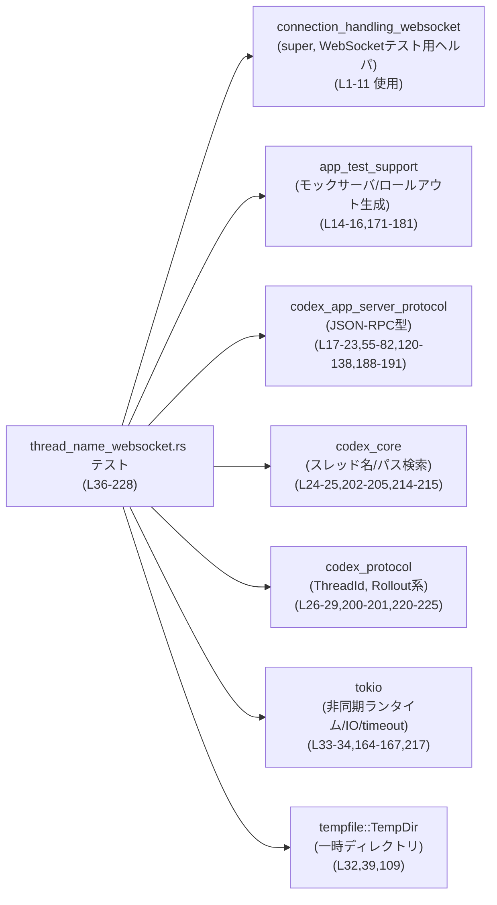
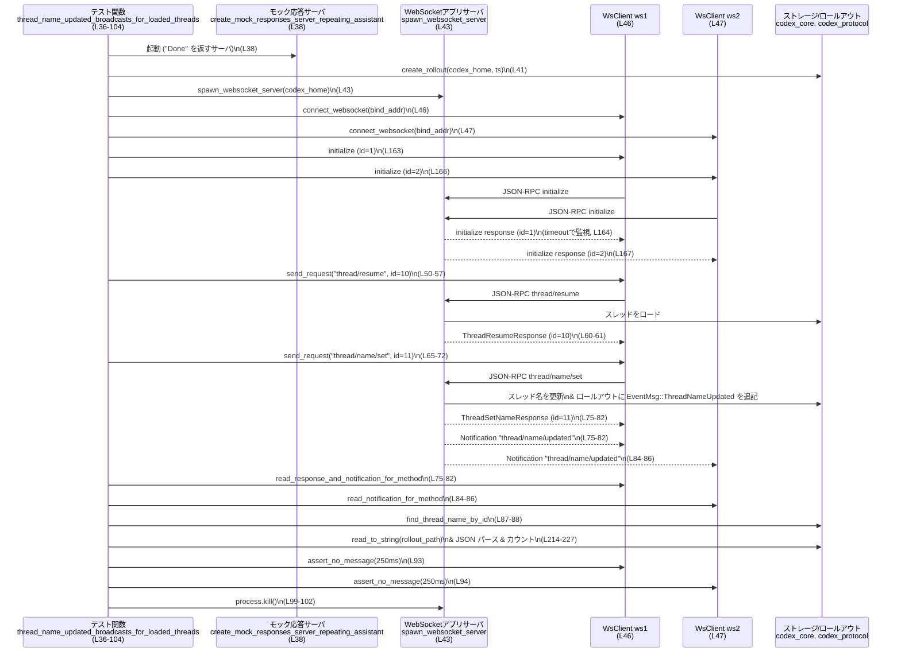

# app-server/tests/suite/v2/thread_name_websocket.rs コード解説

## 0. ざっくり一言

WebSocket 経由の JSON-RPC を使って「スレッド名変更 (`thread/name/set`)」を行ったときに、  
`thread/name/updated` 通知が複数クライアントへブロードキャストされ、かつロールアウトログ・スレッドメタデータに正しく反映されることを検証するテストモジュールです。

---

## 1. このモジュールの役割

### 1.1 概要

- このモジュールは、アプリケーションサーバの WebSocket API に対して **統合テスト** を行うために存在します。
- 特に、スレッド名変更に関する次の点を検証します（`thread_name_websocket.rs:L36-160`）:
  - 対象スレッドが「ロード済み」の場合も「未ロード」の場合も、**全接続クライアントが通知を受け取る**こと
  - スレッド名が **永続ストレージ（レガシーなスレッド名管理）に反映される**こと
  - ロールアウトファイル中の `ThreadNameUpdated` イベントが **1 回だけ記録される**こと
  - 余分な WebSocket メッセージが送られないこと

### 1.2 アーキテクチャ内での位置づけ

このファイルはテストコードであり、さまざまなヘルパーモジュール・プロトコル型に依存しています。



- WebSocket 接続や JSON-RPC の送受信は、`super::connection_handling_websocket` のヘルパ関数群に委譲されています（`thread_name_websocket.rs:L1-11`）。
- テスト用のロールアウトファイル生成やモック応答サーバは `app_test_support` に委譲されています（`thread_name_websocket.rs:L14-16,171-181`）。
- スレッド名・スレッドパスの永続化まわりは `codex_core`・`codex_protocol` を利用しています（`thread_name_websocket.rs:L24-29,200-205,214-225`）。

### 1.3 設計上のポイント

- **責務分割**
  - テストシナリオ本体（2 つの `#[tokio::test]`）と、共通処理ヘルパ（`initialize_both_clients`, `create_rollout`, `assert_*`, `thread_name_update_rollout_count`）が分離されています（`thread_name_websocket.rs:L36-160,162-228`）。
- **非同期・並行性**
  - すべての I/O は Tokio ベースの `async` 関数で実行されます（`#[tokio::test]`、`tokio::time::timeout`、`tokio::fs::read_to_string` 等, `thread_name_websocket.rs:L36,106,164,167,217`）。
  - WebSocket クライアントは 2 つ (`ws1`, `ws2`) を開き、サーバ側のブロードキャスト動作を検証します（`thread_name_websocket.rs:L46-47,116-117`）。
- **エラーハンドリング**
  - 戻り値型は `anyhow::Result<()>` とし、`?` 演算子で I/O や JSON 変換のエラーをテスト失敗として伝播します（`thread_name_websocket.rs:L36,106,162,171,183,195,210`）。
  - 一部のエラーには `Context` を付与し、失敗箇所を特定しやすくしています（例: rollout パス取得時, `thread_name_websocket.rs:L214-216`）。
- **リソースクリーンアップ**
  - WebSocket サーバプロセスはテスト本体の `async` ブロック完了後に必ず `kill` される構造になっています（`thread_name_websocket.rs:L43-45,99-103,113-115,155-159`）。
  - 作業ディレクトリには `TempDir` を使い、テストごとに隔離された一時ディレクトリを利用します（`thread_name_websocket.rs:L39,109`）。

---

## 2. 主要な機能一覧 & コンポーネントインベントリー

### 2.1 機能の一覧

- `thread_name_updated_broadcasts_for_loaded_threads`:  
  ロード済みスレッドの名前変更が、全クライアントへの通知・永続化・イベントログ 1 回だけ、という条件を満たすかを検証する統合テストです（`thread_name_websocket.rs:L36-104`）。
- `thread_name_updated_broadcasts_for_not_loaded_threads`:  
  未ロード状態のスレッドの名前変更でも、同様に通知・永続化・イベントログが正しく行われるかを検証します（`thread_name_websocket.rs:L106-160`）。
- `initialize_both_clients`:  
  2 つの WebSocket クライアントを JSON-RPC `initialize` 相当のメッセージで初期化し、応答を待つヘルパです（`thread_name_websocket.rs:L162-169`）。
- `create_rollout`:  
  テスト用のロールアウトファイルを作成し、そのスレッド ID 文字列を返すヘルパです（`thread_name_websocket.rs:L171-181`）。
- `assert_thread_name_updated`:  
  `JSONRPCNotification` を `ThreadNameUpdatedNotification` にデコードし、スレッド ID・スレッド名を検証するアサート関数です（`thread_name_websocket.rs:L183-193`）。
- `assert_legacy_thread_name`:  
  旧来のスレッド名保存メカニズムに期待どおりの名前が保存されているかを確認します（`thread_name_websocket.rs:L195-208`）。
- `thread_name_update_rollout_count`:  
  対象スレッドのロールアウトファイルを読み出し、`ThreadNameUpdated` イベント行の数をカウントします（`thread_name_websocket.rs:L210-228`）。

### 2.2 関数インベントリー表

| 名前 | 種別 | 位置 | 役割 / 用途 |
|------|------|------|-------------|
| `thread_name_updated_broadcasts_for_loaded_threads` | テスト関数 (`#[tokio::test]`) | `thread_name_websocket.rs:L36-104` | ロード済みスレッドに対して `thread/resume`→`thread/name/set` を行い、通知・永続化・イベント記録・余分なメッセージの有無を検証 |
| `thread_name_updated_broadcasts_for_not_loaded_threads` | テスト関数 (`#[tokio::test]`) | `thread_name_websocket.rs:L106-160` | スレッドをロードせずに `thread/name/set` を行い、同様の条件を検証 |
| `initialize_both_clients` | 非公開 async ヘルパ関数 | `thread_name_websocket.rs:L162-169` | 2 クライアントに対して JSON-RPC `initialize` 要求を送り、タイムアウト付きで応答を待つ |
| `create_rollout` | 非公開ヘルパ関数 | `thread_name_websocket.rs:L171-181` | テスト用ロールアウトファイルを作成し、そのスレッド ID 文字列を返す |
| `assert_thread_name_updated` | 非公開ヘルパ関数 | `thread_name_websocket.rs:L183-193` | 通知の JSON パラメータを `ThreadNameUpdatedNotification` としてパースし、ID と名前の整合性を検証 |
| `assert_legacy_thread_name` | 非公開 async ヘルパ関数 | `thread_name_websocket.rs:L195-208` | `ThreadId` と `find_thread_name_by_id` を用いて、永続化されたスレッド名を検証 |
| `thread_name_update_rollout_count` | 非公開 async ヘルパ関数 | `thread_name_websocket.rs:L210-228` | ロールアウトファイルを読み出して JSON 行をパースし、`EventMsg::ThreadNameUpdated` イベントの件数を数える |

---

## 3. 公開 API と詳細解説

### 3.1 型一覧（このファイルで新規定義はなし）

このファイル内で新たな構造体・列挙体は定義されていません。主に他クレートからインポートされた型を利用しています。

代表的な外部型:

| 名前 | 種別 | 出典 / 位置 | 役割 / 用途 |
|------|------|-------------|-------------|
| `WsClient` | 型（詳細不明） | `super::connection_handling_websocket` からインポート（`thread_name_websocket.rs:L2`） | WebSocket クライアントを表す型。`connect_websocket` の戻り値として使用されます（`thread_name_websocket.rs:L46-47,116-117`）。 |
| `JSONRPCNotification` | 構造体 | `codex_app_server_protocol`（`thread_name_websocket.rs:L17`） | 受信した JSON-RPC 通知メッセージの表現。`assert_thread_name_updated` の引数として使用（`thread_name_websocket.rs:L183-187`）。 |
| `JSONRPCResponse` | 構造体 | `codex_app_server_protocol`（`thread_name_websocket.rs:L18`） | JSON-RPC レスポンスメッセージ。`read_response_for_id` の戻り値として利用（`thread_name_websocket.rs:L60`）。 |
| `ThreadResumeParams` / `ThreadResumeResponse` | 構造体 | `codex_app_server_protocol`（`thread_name_websocket.rs:L20-21,55-57,61-62`） | `thread/resume` メソッドのリクエスト/レスポンス型。 |
| `ThreadSetNameParams` / `ThreadSetNameResponse` | 構造体 | `codex_app_server_protocol`（`thread_name_websocket.rs:L22-23,69-72,81-82,125-128,137-138`） | `thread/name/set` メソッドのリクエスト/レスポンス型。 |
| `ThreadNameUpdatedNotification` | 構造体 | `codex_app_server_protocol`（`thread_name_websocket.rs:L19,188-191`） | `thread/name/updated` 通知のペイロード型。 |
| `ThreadId` | 構造体 | `codex_protocol`（`thread_name_websocket.rs:L26,200-201`） | スレッド ID を型として扱うためのラッパ。文字列から生成されます。 |
| `RolloutLine`, `RolloutItem`, `EventMsg` | 列挙体/構造体 | `codex_protocol::protocol`（`thread_name_websocket.rs:L27-29,220-225`） | ロールアウトファイル1行を表す型と、その中のイベント種別。`ThreadNameUpdated` イベント検出に使用。 |

> これらの型の具体的な定義は本チャンクには現れませんが、呼び出し箇所やフィールドアクセスから用途を読み取っています。

---

### 3.2 関数詳細（7 件）

#### `thread_name_updated_broadcasts_for_loaded_threads() -> Result<()>`  

（`thread_name_websocket.rs:L36-104`）

**概要**

- ロード済みスレッドに対して `thread/resume`→`thread/name/set` を行い、
  - `ws1`・`ws2` 両クライアントが `thread/name/updated` 通知を受け取ること
  - スレッド名が永続ストレージに反映されること
  - ロールアウトファイル内の `ThreadNameUpdated` イベントが 1 回だけ記録されること
  - 追加のメッセージが送られないこと  
  を検証する Tokio ベースの統合テストです。

**引数**

- なし（`#[tokio::test]` によりテストランナーから呼び出されます）。

**戻り値**

- `anyhow::Result<()>`  
  - すべてのステップが成功すれば `Ok(())` を返します。
  - I/O や JSON 変換、ヘルパ関数内のエラーがあれば `Err` を返し、テストは失敗します。

**内部処理の流れ**

1. **テスト環境の準備**（`thread_name_websocket.rs:L38-41`）
   - `create_mock_responses_server_repeating_assistant("Done").await` でモックサーバを起動。
   - `TempDir::new()?` で一時ディレクトリ `codex_home` を作成。
   - `create_config_toml` で WebSocket サーバ用設定ファイルを生成。
   - `create_rollout` でロールアウトファイルを作成し、`conversation_id`（スレッド ID 文字列）を取得。

2. **WebSocket サーバ起動**（`thread_name_websocket.rs:L43`）
   - `spawn_websocket_server(codex_home.path()).await?` でアプリサーバプロセスとバインドアドレス `bind_addr` を取得。

3. **テスト本体の async ブロック**（`thread_name_websocket.rs:L45-97`）
   1. クライアント接続と初期化（`thread_name_websocket.rs:L46-48`）
      - `ws1`, `ws2` を `connect_websocket(bind_addr).await?` で接続。
      - `initialize_both_clients(&mut ws1, &mut ws2).await?` で双方の `initialize` を完了。
   2. スレッドの resume（`thread_name_websocket.rs:L50-62`）
      - `send_request` で `thread/resume` メソッドを ID 10 で呼び出し。
      - `read_response_for_id` で ID 10 のレスポンスを読み取り、`ThreadResumeResponse` にデコード。
      - `assert_eq!(resume.thread.id, conversation_id);` でスレッド ID が期待通りであることを検証。
   3. スレッド名の変更と ws1 の通知検証（`thread_name_websocket.rs:L64-83`）
      - `renamed` を `"Loaded rename"` として設定。
      - `send_request` で `thread/name/set`（ID 11）を送信。
      - `read_response_and_notification_for_method` でレスポンスと `thread/name/updated` 通知を同時に受信。
      - レスポンスを `ThreadSetNameResponse` にパースし、`assert_thread_name_updated` で通知内容を検証。
   4. ws2 の通知検証と永続化確認（`thread_name_websocket.rs:L84-91`）
      - `read_notification_for_method` で `ws2` 側の `thread/name/updated` 通知を取得し、同じく `assert_thread_name_updated` で検証。
      - `assert_legacy_thread_name` で `find_thread_name_by_id` を通じて永続化されたスレッド名を確認。
      - `thread_name_update_rollout_count` を用いてロールアウトファイル内の `ThreadNameUpdated` イベント件数が 1 であることを `assert_eq!` で検証。
   5. 追加メッセージがないことの確認（`thread_name_websocket.rs:L93-94`）
      - `assert_no_message(&mut ws1, Duration::from_millis(250)).await?;`
      - `assert_no_message(&mut ws2, Duration::from_millis(250)).await?;`

4. **サーバプロセスの終了と結果の返却**（`thread_name_websocket.rs:L97-103`）
   - `result` に async ブロックの `Result<()>` を格納。
   - `process.kill().await.context("failed to stop websocket app-server process")?;` でサーバプロセスを停止。
   - 最後に `result` を返却。

**Examples（使用例）**

この関数自体は `#[tokio::test]` によってテストランナーから自動的に実行されるため、明示的に呼び出すことはありません。  
同様のテストを追加する場合は、この関数の構造（モックサーバ → `TempDir` → WebSocket サーバ → 2 クライアント → 検証）をテンプレートとして利用できます。

**Errors / Panics**

- `?` により伝播する主なエラー（いずれもテスト失敗になります）:
  - モックサーバ起動失敗（`create_mock_responses_server_repeating_assistant`, `thread_name_websocket.rs:L38`）
  - 一時ディレクトリ作成失敗（`TempDir::new`, `thread_name_websocket.rs:L39`）
  - 設定ファイル生成失敗（`create_config_toml`, `thread_name_websocket.rs:L40`）
  - ロールアウト作成失敗（`create_rollout`, `thread_name_websocket.rs:L41`）
  - WebSocket サーバ起動失敗（`spawn_websocket_server`, `thread_name_websocket.rs:L43`）
  - WebSocket 接続失敗（`connect_websocket`, `thread_name_websocket.rs:L46-47`）
  - クライアント初期化失敗（`initialize_both_clients`, `thread_name_websocket.rs:L48`）
  - JSON シリアライズ/デシリアライズ失敗（`serde_json::to_value`, `to_response`, `thread_name_websocket.rs:L54-57,61,70-72,81`）
  - 通知・レスポンス読み取り失敗（`read_response_for_id`, `read_response_and_notification_for_method`, `read_notification_for_method`, `thread_name_websocket.rs:L60,75-80,84-85`）
  - 永続化確認ヘルパのエラー（`assert_legacy_thread_name`, `thread_name_update_rollout_count`, `thread_name_websocket.rs:L87-90`）
  - 追加メッセージ検証のエラー（`assert_no_message`, `thread_name_websocket.rs:L93-94`）
  - サーバプロセス停止失敗（`process.kill`, `thread_name_websocket.rs:L99-102`）
- `panic!` となる可能性のある箇所:
  - `assert_eq!` マクロ（`thread_name_websocket.rs:L62,88-90`）
  - ヘルパ関数 `assert_thread_name_updated`, `assert_legacy_thread_name` 内の `assert_eq!`（`thread_name_websocket.rs:L190-191,202-205`）。

**Edge cases（エッジケース）**

- サーバが `thread/resume` のレスポンスを返さない場合:
  - 本関数単体ではタイムアウトは使用していませんが、`initialize_both_clients` 内で `timeout` を使用しているため（`thread_name_websocket.rs:L164-167`）、初期化時にハングすることは避けられています。
  - その後のレスポンス読み取り (`read_response_for_id` など) が応答を返さない場合の挙動は、このチャンクには現れないため不明です。
- `assert_no_message` のエラー条件:
  - 実装は `super::connection_handling_websocket` にあるため、このチャンクからは詳細は分かりません。ただし `Result` を `?` で伝播しているため、追加メッセージがある場合には `Err` を返すような設計が想定されます（`thread_name_websocket.rs:L93-94`）。

**使用上の注意点**

- 非同期テストであるため、Tokio のテストランタイム（`#[tokio::test]`）の下でのみ意味があります。
- テストは実際に WebSocket サーバプロセスを起動するため、**並列実行時のポート競合** の可能性に注意が必要です（ポート選択ロジックは本チャンクには現れません）。
- 追加のクライアントや異なるメソッドをテストするときも、`process.kill()` のようにプロセスのクリーンアップは必ず行う必要があります。

---

#### `thread_name_updated_broadcasts_for_not_loaded_threads() -> Result<()>`  

（`thread_name_websocket.rs:L106-160`）

**概要**

- スレッドを `thread/resume` でロードせず、直接 `thread/name/set` を行った場合でも、
  - 全クライアントへの `thread/name/updated` 通知
  - 永続化されたスレッド名の更新
  - ロールアウトファイル中の `ThreadNameUpdated` イベント 1 件  
  が保証されることを検証します。

**引数 / 戻り値**

- 引数: なし
- 戻り値: `anyhow::Result<()>`（失敗時は `Err`）。

**内部処理の流れ**

1. ローカル環境とモックサーバの準備（`thread_name_websocket.rs:L108-111`）。
2. WebSocket サーバ起動（`thread_name_websocket.rs:L113`）。
3. async ブロックでクライアント接続・初期化（`thread_name_websocket.rs:L115-119`）。
4. `thread/name/set` の送信と ws1 でのレスポンス・通知検証（`thread_name_websocket.rs:L120-138`）。
5. ws2 での通知検証、永続化されたスレッド名の検証、イベント件数の検証（`thread_name_websocket.rs:L140-147`）。
6. 追加メッセージがないことの確認（`thread_name_websocket.rs:L149-150`）。
7. サーバプロセスを kill し、async ブロックの結果を返す（`thread_name_websocket.rs:L155-159`）。

**違い**

- ロード済みテストとの主な違いは、`thread/resume` 呼び出しが存在しないことだけです（`thread_name_websocket.rs:L120-129`）。  
  それ以外の検証は同一です。

**Errors / Panics, Edge cases, 使用上の注意点**

- 構造と失敗パターンは、前述の `thread_name_updated_broadcasts_for_loaded_threads` と同様です。
- スレッド非ロード状態での処理経路をテストしているため、サーバ側実装が「スレッドを lazy にロードしてから名前変更する」ような場合、このテストがその経路をカバーします（実際の実装はこのチャンクには現れません）。

---

#### `initialize_both_clients(ws1: &mut WsClient, ws2: &mut WsClient) -> Result<()>`  

（`thread_name_websocket.rs:L162-169`）

**概要**

- 2 つの WebSocket クライアントに対して JSON-RPC 初期化リクエストを送り、レスポンスをタイムアウト付きで受信する共通ヘルパです。

**引数**

| 引数名 | 型 | 説明 |
|--------|----|------|
| `ws1` | `&mut WsClient` | 1 つ目の WebSocket クライアント。可変参照として渡されます。 |
| `ws2` | `&mut WsClient` | 2 つ目の WebSocket クライアント。 |

**戻り値**

- `anyhow::Result<()>`  
  - 双方の `initialize` が成功し、所定の ID のレスポンスを受信できた場合に `Ok(())` を返します。
  - タイムアウト、I/O エラー、JSON エラー等があれば `Err` を返します。

**内部処理の流れ**

1. `ws1` に対する初期化（`thread_name_websocket.rs:L163-164`）
   - `send_initialize_request(ws1, /*id*/ 1, "ws_client_one").await?;`
   - `timeout(DEFAULT_READ_TIMEOUT, read_response_for_id(ws1, /*id*/ 1)).await??;`
     - `timeout` によるタイムアウト制御（`tokio::time::timeout`）。
     - 内側の `read_response_for_id` の `Result` と、外側の `timeout` の `Result` それぞれに `?` を適用 (`await??`)。
2. `ws2` に対する初期化（`thread_name_websocket.rs:L166-167`）
   - `id` を 2 に変えた同等処理。

**Examples（使用例）**

テスト内での利用例（`thread_name_websocket.rs:L48,118`）:

```rust
// 2 つの WebSocket クライアントを接続したあとで、共通の初期化を行う
let mut ws1 = connect_websocket(bind_addr).await?;     // 1つ目のクライアントを接続
let mut ws2 = connect_websocket(bind_addr).await?;     // 2つ目のクライアントを接続
initialize_both_clients(&mut ws1, &mut ws2).await?;    // JSON-RPC initialize を両方に送信し、応答を検証
```

**Errors / Panics**

- `send_initialize_request` がエラーを返した場合 → `?` により即座に `Err` として返却（`thread_name_websocket.rs:L163,166`）。
- `timeout`:
  - タイムアウト (`Elapsed` 型) が発生した場合 → 最初の `?` により `Err` となります（`thread_name_websocket.rs:L164,167`）。
  - 内側の `read_response_for_id` が `Err` を返した場合 → 2 回目の `?` により `Err` となります。
- 本関数内に `panic!` を発生させるコードはありません。

**Edge cases**

- サーバが初期化リクエストに対するレスポンスを返さない場合:
  - `DEFAULT_READ_TIMEOUT` 経過後にタイムアウトし、テストは `Err` で終了します。
- 間違った ID のレスポンスが返ってくる場合:
  - `read_response_for_id` の仕様次第ですが、ID が一致しない場合にどう扱うかは、このチャンクには現れません。

**使用上の注意点**

- `DEFAULT_READ_TIMEOUT` は `super::connection_handling_websocket` からインポートされており（`thread_name_websocket.rs:L1`）、値はこのチャンクには現れません。テストの実行時間に影響するため、適切な値に設定されている前提です。
- `WsClient` を `&mut` で受け取っているため、呼び出し側ではクライアントの所有権は維持され、初期化後も引き続き同じインスタンスを利用できます（所有権・借用の観点）。

---

#### `create_rollout(codex_home: &Path, filename_ts: &str) -> Result<String>`  

（`thread_name_websocket.rs:L171-181`）

**概要**

- テスト用にロールアウトファイルを生成し、そのスレッド ID を表す文字列を返すヘルパです。
- 具体的なロールアウト内容は `create_fake_rollout_with_text_elements` に委譲されます。

**引数**

| 引数名 | 型 | 説明 |
|--------|----|------|
| `codex_home` | `&std::path::Path` | Codex のホームディレクトリ（一時ディレクトリ）。 |
| `filename_ts` | `&str` | ロールアウトファイル名に使われるタイムスタンプ文字列。 |

**戻り値**

- `Result<String>`  
  - 正常時: 作成されたロールアウトに対応するスレッド ID 文字列。
  - エラー時: ファイル作成や書き込み失敗などのエラーを含む `Err`。

**内部処理の流れ**

1. `create_fake_rollout_with_text_elements` を呼び出し、引数をそのまま渡します（`thread_name_websocket.rs:L172-180`）。
   - `filename_ts` をファイル名に利用。
   - 開始時刻 `"2025-01-05T12:00:00Z"`、ユーザメッセージ `"Saved user message"` など、固定のテスト用値を使用。
2. `create_fake_rollout_with_text_elements` の戻り値 `Result<String>` をそのまま返します。

**Examples（使用例）**

テスト内での利用例（`thread_name_websocket.rs:L41,111`）:

```rust
let codex_home = TempDir::new()?;                                  // 一時ディレクトリを作成
let conversation_id = create_rollout(codex_home.path(),            // ロールアウトを作成し
                                     "2025-01-05T12-00-00")?;      // スレッドID文字列を取得
```

**Errors / Panics**

- `create_fake_rollout_with_text_elements` 内でのファイル I/O エラーやシリアライズエラーが `Err` として返され、テストは失敗します。
- 本関数内には `panic!` を起こす処理はありません。

**Edge cases**

- `codex_home` が存在しない、または書き込み不可なディレクトリを指している場合、`create_fake_rollout_with_text_elements` が `Err` を返すと予想されますが、詳細はこのチャンクには現れません。
- `filename_ts` のフォーマットが異なる場合の挙動も、このチャンクからは分かりません。

**使用上の注意点**

- テスト用に特化した関数であり、本番コードから直接利用することは想定されていません。
- 返却される文字列は後続の `ThreadId::from_string` で利用可能である必要があります（`thread_name_websocket.rs:L200-201`）。

---

#### `assert_thread_name_updated(notification: JSONRPCNotification, thread_id: &str, thread_name: &str) -> Result<()>`  

（`thread_name_websocket.rs:L183-193`）

**概要**

- `JSONRPCNotification` の `params` を `ThreadNameUpdatedNotification` としてデコードし、スレッド ID とスレッド名が期待値と一致することを検証するヘルパです。

**引数**

| 引数名 | 型 | 説明 |
|--------|----|------|
| `notification` | `JSONRPCNotification` | 受信した JSON-RPC 通知メッセージ。 |
| `thread_id` | `&str` | 期待されるスレッド ID。 |
| `thread_name` | `&str` | 期待されるスレッド名。 |

**戻り値**

- `anyhow::Result<()>`  
  - パラメータのデコードに成功し、すべてのアサーションが通過すれば `Ok(())`。
  - デコード失敗時には `Err`（`serde_json::from_value` または `Context` 由来）。
  - `assert_eq!` 失敗時には `panic!`。

**内部処理の流れ**

1. `notification.params` を `ThreadNameUpdatedNotification` にデコード（`thread_name_websocket.rs:L188-189`）。
   - `notification.params.context("thread/name/updated params")?` で `Option` を `Result` に変換しつつ、エラーメッセージを付与。
   - `serde_json::from_value(...)` で JSON を構造体に変換。
2. スレッド ID の検証（`thread_name_websocket.rs:L190`）。
   - `assert_eq!(notification.thread_id, thread_id);`
3. スレッド名の検証（`thread_name_websocket.rs:L191`）。
   - `assert_eq!(notification.thread_name.as_deref(), Some(thread_name));`

**Examples（使用例）**

テスト内での利用例（`thread_name_websocket.rs:L82-83,138-139`）:

```rust
let (rename_resp, ws1_notification) = read_response_and_notification_for_method(
    &mut ws1, /*id*/ 11, "thread/name/updated"
).await?;
let _: ThreadSetNameResponse = to_response::<ThreadSetNameResponse>(rename_resp)?;
assert_thread_name_updated(ws1_notification, &conversation_id, renamed)?;  // 通知内容を検証
```

**Errors / Panics**

- `notification.params` が `None` の場合:
  - `.context("thread/name/updated params")?` により `Err` となり、テストが失敗します（`thread_name_websocket.rs:L188-189`）。
- `params` が `ThreadNameUpdatedNotification` としてパースできない JSON の場合:
  - `serde_json::from_value` が `Err` を返し、そのまま伝播します。
- `thread_id` または `thread_name` が一致しない場合:
  - `assert_eq!` により `panic!` が発生し、テストが失敗します。

**Edge cases**

- 通知の `thread_name` が `null` である場合:
  - `.as_deref()` により `None` となり、`Some(thread_name)` とは一致しないため `assert_eq!` が失敗します。
- `thread_name` が空文字列の場合:
  - `Some("")` として評価されるため、期待値も空文字列であればパスします。

**使用上の注意点**

- この関数は `ThreadNameUpdatedNotification` 用に特化しており、他の通知に対して使うと必ずデコードエラーになります。
- エラー時に `anyhow::Context` で付与したメッセージ (`"thread/name/updated params"`) がログやテスト出力に含まれるため、デバッグしやすくなっています。

---

#### `assert_legacy_thread_name(codex_home: &Path, conversation_id: &str, expected_name: &str) -> Result<()>`  

（`thread_name_websocket.rs:L195-208`）

**概要**

- 永続化された「レガシー」なスレッド名（`find_thread_name_by_id` が返す値）が、期待される名前と一致していることを検証する async ヘルパです。

**引数**

| 引数名 | 型 | 説明 |
|--------|----|------|
| `codex_home` | `&Path` | Codex ホームディレクトリ。 |
| `conversation_id` | `&str` | スレッド ID 文字列。 |
| `expected_name` | `&str` | 期待されるスレッド名。 |

**戻り値**

- `anyhow::Result<()>`  
  - スレッド名の取得と `assert_eq!` が成功すれば `Ok(())`。

**内部処理の流れ**

1. `ThreadId::from_string(conversation_id)?` でスレッド ID 文字列を `ThreadId` 型に変換（`thread_name_websocket.rs:L200-201`）。
2. `find_thread_name_by_id(codex_home, &thread_id).await?` でスレッド名（`Option<String>`）を取得し、`.as_deref()` で `Option<&str>` に変換（`thread_name_websocket.rs:L202-205`）。
3. `assert_eq!(..., Some(expected_name));` でスレッド名が期待どおりであることを検証（`thread_name_websocket.rs:L202-205`）。

**Errors / Panics**

- `ThreadId::from_string` がエラーを返す場合（不正な ID 文字列など）→ `Err`。
- `find_thread_name_by_id` が I/O エラーなどで失敗する場合 → `Err`。
- 対象スレッド名が `None` あるいは異なる文字列だった場合 → `assert_eq!` により `panic!`。

**Edge cases**

- スレッド名がまだ保存されていない場合（`find_thread_name_by_id` が `Ok(None)` を返すケース）:
  - `as_deref()` により `None` となり、`Some(expected_name)` とは一致しないため `assert_eq!` が失敗します。
- `expected_name` が実際の永続化データと異なる場合:
  - `assert_eq!` が失敗し、どちら側が想定と違うのかが出力メッセージで分かります。

**使用上の注意点**

- この関数はテスト内でのみ使用されており、本番コードから呼び出す設計ではありません。
- `codex_home` と `conversation_id` は対応するロールアウト・メタデータが存在するものを渡す必要があります。

---

#### `thread_name_update_rollout_count(codex_home: &Path, conversation_id: &str) -> Result<usize>`  

（`thread_name_websocket.rs:L210-228`）

**概要**

- 指定スレッドのロールアウトファイルを読み出し、
  - 各行を `RolloutLine` として JSON パース
  - `RolloutItem::EventMsg(EventMsg::ThreadNameUpdated(_))` である行だけを抽出  
  し、その件数をカウントして返します。

**引数**

| 引数名 | 型 | 説明 |
|--------|----|------|
| `codex_home` | `&Path` | Codex ホームディレクトリ。 |
| `conversation_id` | `&str` | スレッド ID 文字列。 |

**戻り値**

- `anyhow::Result<usize>`  
  - 正常時: 該当する `ThreadNameUpdated` イベント行の件数。
  - エラー時: パス解決、ファイル読み取りなどのエラーを含む `Err`。

**内部処理の流れ**

1. ロールアウトファイルパスの取得（`thread_name_websocket.rs:L214-216`）
   - `find_thread_path_by_id_str(codex_home, conversation_id).await?` でパス（`Option<PathBuf>`）を取得。
   - `.context("rollout path")?` で `None` の場合にエラーを出しつつメッセージを付与。
2. ファイル内容の読み込み（`thread_name_websocket.rs:L217`）
   - `tokio::fs::read_to_string(rollout_path).await?` でファイル全体を文字列として取得。
3. 行ごとの JSON パースとフィルタリング（`thread_name_websocket.rs:L218-227`）
   - `contents.lines()` で 1 行ずつ処理。
   - `serde_json::from_str::<RolloutLine>(line).ok()` で JSON パースを試み、失敗した行は `None` として無視。
   - `matches!(line.item, RolloutItem::EventMsg(EventMsg::ThreadNameUpdated(_)))` で対象イベントだけを抽出。
   - `.count()` で件数を `usize` として返却。

**Examples（使用例）**

テスト内での利用例（`thread_name_websocket.rs:L88-90,145-146`）:

```rust
assert_eq!(
    thread_name_update_rollout_count(codex_home.path(), &conversation_id).await?,
    1  // ThreadNameUpdated イベントは 1 件だけであることを期待
);
```

**Errors / Panics**

- `find_thread_path_by_id_str` の失敗（`await?`）や `None` の場合（`.context("rollout path")?`） → `Err`。
- `tokio::fs::read_to_string` の失敗（ファイル不存在・権限など） → `Err`。
- JSON パース失敗は `.ok()` によって無視されるため、直接のエラーにはなりません（`thread_name_websocket.rs:L220`）。
- 本関数内で `panic!` を起こすコードはありません。

**Edge cases**

- ロールアウトファイルに `ThreadNameUpdated` イベントが 0 件の場合:
  - 戻り値は `Ok(0)` となり、テスト側の `assert_eq!(..., 1)` が失敗します。
- ファイルに異常な行（非 JSON テキスト）が含まれていても:
  - `from_str::<RolloutLine>(line).ok()` により失敗行はスキップされます。
  - ただし、本来必要なイベント行がパース不能なフォーマットで保存されている場合、カウントから漏れる可能性があります。

**使用上の注意点**

- ファイル全体を一度にメモリへ読み込む実装のため、ロールアウトファイルが非常に大きい場合にはメモリ使用量が増加しますが、本ファイルはテスト用途であり、想定されるデータサイズは小さいと考えられます。
- JSON パース失敗を静かに無視する設計のため、「不正な行が含まれている」こと自体をテストしたい場合には別の検証手段が必要になります。

---

### 3.3 その他の関数

- このファイルには、上記以外の補助的な関数は存在しません。

---

## 4. データフロー

ここでは、`thread_name_updated_broadcasts_for_loaded_threads` テストにおける代表的なデータフローを示します。

### 4.1 処理の要点（概要）

1. テストコードがモックサーバ・WebSocket サーバを起動し、2 つの WebSocket クライアント (`ws1`, `ws2`) を接続・初期化します。
2. `ws1` から `thread/resume` → `thread/name/set` の JSON-RPC リクエストを送信します。
3. WebSocket サーバは:
   - レスポンス (`ThreadResumeResponse`, `ThreadSetNameResponse`) を `ws1` に返し、
   - `thread/name/updated` 通知を `ws1` と `ws2` の両方に送信し、
   - 永続ストレージ（スレッド名）とロールアウトファイルを更新します。
4. テストは、通知内容・永続化されたスレッド名・ロールアウトイベント件数を検証し、追加のメッセージがないことを確認します。

### 4.2 シーケンス図（Loaded スレッドケース, L36-104）



- 非同期処理 (`async/await`) を通じて、テストコードはネットワーク I/O とファイル I/O を逐次的に実行しています。
- クライアント側は 2 つ存在しますが、このテストでは `await` により処理が順次進むため、テストコード自体の並行実行は行っていません（並行性はサーバ内に存在すると考えられますが、このチャンクには現れません）。

---

## 5. 使い方（How to Use）

このファイルはテストモジュールであり、「使い方」は主に **新しいテストシナリオを追加する際のパターン** という意味になります。

### 5.1 基本的な使用方法（テスト追加の流れ）

新しい WebSocket 統合テストを追加する場合、おおむね次の流れになります。

```rust
#[tokio::test]                                          // Tokio ランタイム上で動作する非同期テストを宣言
async fn new_scenario_test() -> Result<()> {            // anyhow::Result<()> を返す
    let server = create_mock_responses_server_repeating_assistant("Done").await; // モックサーバ起動
    let codex_home = TempDir::new()?;                   // 一時ディレクトリを作成
    create_config_toml(codex_home.path(), &server.uri(), "never")?; // 設定ファイル生成
    let conversation_id = create_rollout(codex_home.path(), "2025-01-05T12-10-00")?; // ロールアウト生成

    let (mut process, bind_addr) = spawn_websocket_server(codex_home.path()).await?; // WebSocketサーバ起動

    let result = async {                                // サーバ終了を保証するため、結果は一旦変数に格納
        let mut ws1 = connect_websocket(bind_addr).await?; // 1つ目のクライアント接続
        let mut ws2 = connect_websocket(bind_addr).await?; // 2つ目のクライアント接続
        initialize_both_clients(&mut ws1, &mut ws2).await?; // 共通初期化

        // ... ここで任意の JSON-RPC リクエストとレスポンス検証を行う ...

        Ok(())                                          // async ブロックの戻り値
    }
    .await;

    process.kill().await.context("failed to stop websocket app-server process")?; // サーバを停止
    result                                              // テストの結果を返却
}
```

- 既存の 2 つのテスト関数（`thread_name_updated_broadcasts_for_*`）がこのパターンに従っています（`thread_name_websocket.rs:L36-104,106-160`）。

### 5.2 よくある使用パターン

- **2 クライアントを使ったブロードキャスト検証**
  - `ws1` から送ったリクエストに対して、`ws1` と `ws2` の両方が同一の通知を受け取ることを検証する。
  - `assert_thread_name_updated` のように、通知データを構造体にパースするヘルパを用意するとテストが読みやすくなります。

- **永続ストレージ・ログとの突き合わせ**
  - `assert_legacy_thread_name` のように、API から見える状態（通知・レスポンス）とストレージの状態を両方検証することで、実装全体の一貫性をテストできます。
  - `thread_name_update_rollout_count` のように、ログファイル（ロールアウト）に記録されたイベントの件数を確認することも、回数や順序を保証する上で有用です。

### 5.3 よくある間違い

```rust
// 間違い例: クライアントを初期化せずにリクエストを送る
let mut ws1 = connect_websocket(bind_addr).await?;
let mut ws2 = connect_websocket(bind_addr).await?;
// initialize_both_clients を呼んでいないため、サーバがリクエストを受け付けない可能性がある
send_request(&mut ws1, "thread/name/set", 1, /*...*/).await?;

// 正しい例: 先に initialize を完了させる
let mut ws1 = connect_websocket(bind_addr).await?;
let mut ws2 = connect_websocket(bind_addr).await?;
initialize_both_clients(&mut ws1, &mut ws2).await?;     // サーバ側とプロトコルの前提を満たしてから
send_request(&mut ws1, "thread/name/set", 1, /*...*/).await?;
```

- プロトコルの前提条件（initialize 済みであること）を満たさないままリクエストを送ると、サーバ実装によってはエラーや無視の原因となります。

### 5.4 使用上の注意点（まとめ）

- **非同期コンテキスト前提**  
  すべてのテスト・ヘルパは `async` 関数であり、Tokio ランタイム上での実行が前提です。
- **ポート競合・並列実行**  
  WebSocket サーバを実プロセスとして起動するため、テストの並列実行設定によってはポート競合に注意が必要です（ポート決定ロジックは他ファイル）。
- **タイムアウト設定**  
  `initialize_both_clients` 内で `DEFAULT_READ_TIMEOUT` に依存しているため、これが不適切に短い/長いとテストが不安定になる可能性があります。
- **ファイルサイズ**  
  `thread_name_update_rollout_count` はロールアウトファイル全体をメモリに読み込む設計であり、大きなファイルに対しては注意が必要ですが、本ファイルではテスト用に小さなロールアウトが生成される前提です。

---

## 6. 変更の仕方（How to Modify）

### 6.1 新しい機能（テストケース）を追加する場合

1. **テストシナリオの設計**
   - 例: 「スレッド名を複数回変更した場合、`ThreadNameUpdated` イベントがその回数だけ記録される」など。
2. **テスト関数の追加**
   - 本ファイルの 2 つのテスト関数（`thread_name_updated_broadcasts_for_*`）をコピーし、シナリオに合わせてリクエスト内容・アサーションを変更します。
3. **既存ヘルパの再利用**
   - `initialize_both_clients`、`create_rollout`、`assert_thread_name_updated`、`assert_legacy_thread_name`、`thread_name_update_rollout_count` を活用すると、同じパターンを短く書けます。
4. **新規ヘルパ関数が必要な場合**
   - たとえば、別種の通知を検証するための `assert_*` 関数などは、`assert_thread_name_updated` と同様のスタイルで追加すると一貫性が保てます（`thread_name_websocket.rs:L183-193` を参考）。

### 6.2 既存の機能（テスト）を変更する場合

- **影響範囲の確認**
  - 変更対象がヘルパ関数であれば、それを呼ぶ全テストを検索する必要があります（例: `assert_thread_name_updated` を別の型にも対応させる場合）。
- **契約（前提条件・返り値）の維持**
  - たとえば `thread_name_update_rollout_count` の戻り値が「イベント件数」であることを前提にテストが書かれているため、意味を変える場合はテスト全体の見直しが必要です。
- **エラーメッセージ・Context**
  - `Context("rollout path")` や `"thread/name/updated params"` のような文言を変更すると、テスト失敗時のログが変わるため、既存のデバッグ手順や他のテストとの整合性に注意します。
- **非同期 API のシグネチャ変更**
  - 戻り値型（`Result` のエラー型など）を変えると、`?` を使っている全箇所に影響が出るため慎重な変更が必要です。

---

## 7. 関連ファイル

| パス / モジュール | 役割 / 関係 |
|-------------------|------------|
| `app-server/tests/suite/v2/connection_handling_websocket.rs`（推定） | `super::connection_handling_websocket` としてインポートされています（`thread_name_websocket.rs:L1-11`）。WebSocket サーバ起動・クライアント接続・JSON-RPC の送受信・初期化などのテスト用ヘルパを提供していると考えられます。 |
| `app_test_support` クレート | `create_fake_rollout_with_text_elements`, `create_mock_responses_server_repeating_assistant`, `to_response` などを提供し、モック応答サーバやロールアウト生成といったテスト用ユーティリティを担います（`thread_name_websocket.rs:L14-16,171-181`）。 |
| `codex_app_server_protocol` クレート | JSON-RPC レスポンス・通知の型 (`JSONRPCResponse`, `JSONRPCNotification`)、および `ThreadResume*`, `ThreadSetName*`, `ThreadNameUpdatedNotification` など、アプリケーションサーバのプロトコル型定義を提供します（`thread_name_websocket.rs:L17-23`）。 |
| `codex_core` クレート | スレッド名検索 (`find_thread_name_by_id`) やスレッドパス検索 (`find_thread_path_by_id_str`) など、永続ストレージ周りの処理を提供します（`thread_name_websocket.rs:L24-25,202-205,214-215`）。 |
| `codex_protocol::protocol` モジュール | `ThreadId`, `RolloutLine`, `RolloutItem`, `EventMsg` など、ロールアウトファイルの内容やスレッド ID を表現する型を提供します（`thread_name_websocket.rs:L26-29,200-201,220-225`）。 |

> これらの関連ファイル・モジュールの具体的な実装はこのチャンクには現れないため、役割はインポートと使用箇所の情報からのみ説明しています。
