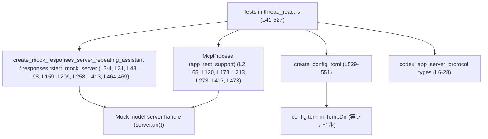
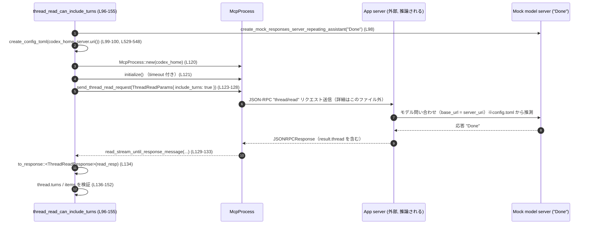

# app-server/tests/suite/v2/thread_read.rs コード解説

## 0. ざっくり一言

`thread_read.rs` は、アプリケーションサーバの JSON-RPC エンドポイント（特に `thread/read` を中心に、`thread/list`・`thread/resume` など）について、**スレッドの読み取り・フォーク・名前変更・エラー状態**の振る舞いをエンドツーエンドで検証する非同期統合テスト群です。  
モックのモデルサーバと一時ディレクトリを用いて、実際に `config.toml` を書き出した上で `McpProcess` を起動しています（`thread_read.rs:L41-527`, `thread_read.rs:L529-551`）。

---

## 1. このモジュールの役割

### 1.1 概要

このテストモジュールは、次の問題を検証対象としています。

- **問題**  
  - スレッドをファイルベースで保存・復元する CLI / サーバが、JSON-RPC プロトコル仕様どおりに `thread/read`・`thread/list`・`thread/resume` を実装しているか。
  - スレッドの状態（フォーク元 ID、ロード状態、エラー状態、名前など）が一貫して扱われているか。

- **提供する検証**（主な観点）
  - 保存済みロールアウトの **サマリだけ** を読む場合の `thread/read` の結果（ターン非含有）`thread_read.rs:L41-94`
  - `include_turns` による **ターン情報の取得** とメッセージ内容の整合性 `thread_read.rs:L96-155`
  - フォークされたスレッドの `forked_from_id` の反映 `thread_read.rs:L157-205`
  - 未マテリアライズなロード済みスレッドのパス・ステータスの扱い `thread_read.rs:L207-254`
  - スレッド名の設定が `thread/read`・`thread/list`・`thread/resume` すべてに反映されること `thread_read.rs:L256-409`
  - 未マテリアライズなスレッドに対する `include_turns: true` の拒否（エラー契約）`thread_read.rs:L411-460`
  - モデルサーバ側の失敗後に `thread.status` が `SystemError` になること `thread_read.rs:L462-527`

### 1.2 アーキテクチャ内での位置づけ

このテストは、次のコンポーネントを結びつけて実行されます。

- テスト関数（このファイル内の `#[tokio::test]`）`thread_read.rs:L41-527`
- テスト用 MCP クライアント兼プロセス管理ラッパ `McpProcess`（`app_test_support`）`thread_read.rs:L2,L65,L120,L173,L213,L273,L417,L473`
- JSON-RPC 型群（`codex_app_server_protocol`）`thread_read.rs:L6-28`
- ユーザ入力表現型（`TextElement`, `ByteRange`, `UserInput`）`thread_read.rs:L29-30,L28`
- モックモデルサーバ（`create_mock_responses_server_repeating_assistant`, `core_test_support::responses`）`thread_read.rs:L3-L4,L31,L43,L98,L159,L209,L258,L413,L464-L469`
- 設定ファイル書き出しヘルパ `create_config_toml` `thread_read.rs:L529-551`

これらの関係を簡略に示すと、次のようになります。



`McpProcess` が内部でどのようにプロセスや接続を管理しているかは、このファイルからは分かりませんが、`config.toml` の `base_url` にモックサーバの URI を埋め込んでいるため（`thread_read.rs:L529-548`）、MCP 側がこの URL を用いてモックサーバと通信している前提でテストが組まれています。

### 1.3 設計上のポイント

コードから読み取れる設計上の特徴は次のとおりです。

- **エンドツーエンド指向のテスト**  
  - JSON-RPC の **wire 形式（シリアライズ結果）** まで検証しています。例として、`thread.name` や `thread.ephemeral` がレスポンス JSON に含まれることを `serde_json::Value` から直接確認しています（`thread_read.rs:L300-329,L331-373,L375-406`）。
- **非同期 + タイムアウトによる安全性**  
  - すべてのテストは `#[tokio::test]` で非同期に実行され、ネットワーク・プロセス待ちなどの操作には `tokio::time::timeout` が適用されています（`thread_read.rs:L37,L65-L66,L74-L78,L121,L129-L133,L174-L175, ...`）。  
    これにより、サーバが応答しない場合でもテストが無限にハングしないようになっています。
- **一時ディレクトリでのテスト分離**  
  - 各テストは `TempDir::new()` で専用の作業ディレクトリを生成し（`thread_read.rs:L44,L99,L160,L210,L259,L414,L470`）、そこに `config.toml` を書き出します（`thread_read.rs:L45,L100,L161,L211,L260,L415,L471`）。  
    これによりテスト間のファイル状態が分離され、並行実行にも耐えられる構造です。
- **「契約」としてのテスト**  
  - `include_turns` の扱い、`ThreadStatus` の変化、`forked_from_id` の設定、名前変更の伝播など、**サーバ API のふるまいを契約として定義**しており、その契約変更があるとテストが検知する構造になっています（各テストの `assert_*` 群、例: `thread_read.rs:L81-91,L136-152,L202,L247-251,L314-328,L351-372,L391-405,L450-457,L524`）。

---

## 2. 主要な機能一覧

このファイル内で定義されている主な機能（すべてテストまたはテスト用ヘルパ）を列挙します。

- `thread_read_returns_summary_without_turns`: `include_turns = false` の `thread/read` がスレッドサマリのみを返すこと、およびメタ情報の整合性を検証します（`thread_read.rs:L41-94`）。
- `thread_read_can_include_turns`: `include_turns = true` の `thread/read` が、保存済みロールアウトからユーザメッセージのターンを復元できることを検証します（`thread_read.rs:L96-155`）。
- `thread_read_returns_forked_from_id_for_forked_threads`: フォークしたスレッドの `forked_from_id` フィールドが元スレッド ID を指すことを検証します（`thread_read.rs:L157-205`）。
- `thread_read_loaded_thread_returns_precomputed_path_before_materialization`: 未マテリアライズだがロード済みのスレッドに対する `thread/read` が、既に決定済みの `path` を返し、内容は空で `status = Idle` であることを検証します（`thread_read.rs:L207-254`）。
- `thread_name_set_is_reflected_in_read_list_and_resume`: `thread/setName` 後の名前が `thread/read`・`thread/list`・`thread/resume` のすべてに反映され、wire 形式にも含まれることを検証します（`thread_read.rs:L256-409`）。
- `thread_read_include_turns_rejects_unmaterialized_loaded_thread`: 未マテリアライズなロード済みスレッドに `include_turns = true` で `thread/read` を呼ぶとエラーになる契約を検証します（`thread_read.rs:L411-460`）。
- `thread_read_reports_system_error_idle_flag_after_failed_turn`: モデルサーバ側でターンが失敗した後に、`thread/status` が `SystemError` になることを検証します（`thread_read.rs:L462-527`）。
- `create_config_toml`: モックモデルサーバに向けた `config.toml` を一時ディレクトリに生成するヘルパです（`thread_read.rs:L529-551`）。

---

## 3. 公開 API と詳細解説

このファイル自体には `pub` な API はありませんが、**テストを通じて外部 API の契約を記述している**ため、ここでは「このファイル内で定義された関数」と「テストが依存している外部型」をインベントリーとして整理します。

### 3.1 型・関数インベントリー

#### このファイル内で定義されている関数

| 名前 | 種別 | 非同期 | 役割 / 用途 | 根拠 |
|------|------|--------|------------|------|
| `thread_read_returns_summary_without_turns` | テスト関数 (`#[tokio::test]`) | はい | 保存済みスレッドのサマリ（ターン無し）を `thread/read` で取得したときのフィールド値を検証する | `thread_read.rs:L41-94` |
| `thread_read_can_include_turns` | テスト関数 | はい | `include_turns = true` の `thread/read` がターン情報とユーザメッセージを正しく返すことを検証する | `thread_read.rs:L96-155` |
| `thread_read_returns_forked_from_id_for_forked_threads` | テスト関数 | はい | `thread/fork` で生成したスレッドに対して `thread/read` したとき `forked_from_id` が元スレッド ID になることを検証する | `thread_read.rs:L157-205` |
| `thread_read_loaded_thread_returns_precomputed_path_before_materialization` | テスト関数 | はい | ロード直後（まだファイル未生成）のスレッドに対する `thread/read` の `path`・`status`・内容の契約を検証する | `thread_read.rs:L207-254` |
| `thread_name_set_is_reflected_in_read_list_and_resume` | テスト関数 | はい | `thread/setName` で設定したスレッド名が `thread/read`・`thread/list`・`thread/resume` の API とその JSON に一貫して現れることを検証する | `thread_read.rs:L256-409` |
| `thread_read_include_turns_rejects_unmaterialized_loaded_thread` | テスト関数 | はい | 未マテリアライズスレッドに `include_turns = true` で `thread/read` した場合のエラー内容を検証する | `thread_read.rs:L411-460` |
| `thread_read_reports_system_error_idle_flag_after_failed_turn` | テスト関数 | はい | モデル応答の失敗後に `thread.status` が `SystemError` となることを検証する | `thread_read.rs:L462-527` |
| `create_config_toml` | 補助関数 | いいえ | モックモデルサーバの URL を埋め込んだ `config.toml` を一時ディレクトリに生成する | `thread_read.rs:L529-551` |

#### このファイルから利用している主な外部型

> それぞれの詳細な定義は他モジュールにありますが、**このファイルから見える用途**だけを整理します。

| 型名 | 定義元 | 役割 / 用途（このファイルから読み取れる範囲） | 根拠 |
|------|--------|----------------------------------------------|------|
| `McpProcess` | `app_test_support` | MCP ベースのアプリケーションサーバをテストから制御するためのラッパ。`new`・`initialize`・各種 `send_*_request` や `read_stream_until_*` を持つ。 | `thread_read.rs:L2,L65-L66,L120-L121,L173-L175,L213-L215,L273-L275,L417-L418,L473-L475` |
| `JSONRPCResponse` | `codex_app_server_protocol` | JSON-RPC 成功レスポンスを表す型。`result` フィールドを介して実データを取り出している。 | `thread_read.rs:L7,L74-L79,L129-L135,L182-L187,L195-L201,L222-L227,L285-L289,L345-L350,L382-L390,L483-L487,L499-L504,L517-L522` |
| `JSONRPCError` | 同上 | JSON-RPC エラーレスポンスを表す型。`error.message` を文字列として検査している。 | `thread_read.rs:L6,L444-L457` |
| `ThreadReadParams` / `ThreadReadResponse` | 同上 | `thread/read` メソッドのリクエスト・レスポンス型。`thread_id`・`include_turns` パラメータと、返却される `thread` 情報を扱う。 | `thread_read.rs:L16-17,L68-L72,L79-L91,L123-L127,L134-L152,L189-L193,L200-L203,L234-L238,L245-L251,L301-L305,L313-L328,L438-L442,L511-L515,L522-L525` |
| `ThreadStartParams` / `ThreadStartResponse` | 同上 | 新規スレッド開始 API (`thread/start`) の入出力。`model` を指定してスレッドを生成し、`thread.id` および `thread.path` などを取得する。 | `thread_read.rs:L22-23,L216-L221,L227-L232,L420-L425,L431-L436,L476-L481,L486-L488` |
| `ThreadForkParams` / `ThreadForkResponse` | 同上 | スレッドのフォーク API (`thread/fork`) の入出力。`thread_id` を指定してフォークし、新しいスレッドの `id` と `forked_from_id` を検証している。 | `thread_read.rs:L10-11,L176-L181,L187-L203` |
| `ThreadListParams` / `ThreadListResponse` | 同上 | スレッド一覧 API (`thread/list`) の入出力。フィルタ条件を与えて一覧を取得し、特定 ID のスレッドの `name`・`ephemeral` を検証している。 | `thread_read.rs:L13-14,L332-L342,L350-L373` |
| `ThreadResumeParams` / `ThreadResumeResponse` | 同上 | 既存スレッドの再開 API (`thread/resume`) の入出力。`thread.id` と `thread.name`・`ephemeral` を検証している。 | `thread_read.rs:L18-19,L376-L380,L387-L405` |
| `ThreadSetNameParams` / `ThreadSetNameResponse` | 同上 | スレッド名設定 API (`thread/setName`) の入出力。`thread_id` と新しい `name` を送り、成功後に通知と状態を検証する。 | `thread_read.rs:L20-21,L278-L283,L289` |
| `ThreadNameUpdatedNotification` | 同上 | `thread/name/updated` 通知のペイロード型。`thread_id` と `thread_name` を持ち、それが期待どおりであることを検証する。 | `thread_read.rs:L15,L290-L298` |
| `ThreadStatus` | 同上 | スレッドの状態を表す列挙体。`NotLoaded`・`Idle`・`SystemError` などの値を比較している。 | `thread_read.rs:L24,L91,L152,L251,L524` |
| `TurnStartParams` / `TurnStartResponse` | 同上 | `turn/start` API の入出力。スレッド ID と `input`（`UserInput`）を指定し、ターン開始後の通知やエラー挙動をテストする。 | `thread_read.rs:L25-26,L489-L498,L503-L504` |
| `TurnStatus` | 同上 | ターンの状態を表す列挙体。ここでは `Completed` であることを検証している。 | `thread_read.rs:L27,L136-L139` |
| `ThreadItem` | 同上 | ターン内のアイテム（ユーザメッセージなど）を表す列挙体。`UserMessage` バリアントをパターンマッチしている。 | `thread_read.rs:L12,L140-L151` |
| `UserInput` | 同上 | モデルへのユーザ入力を表現する列挙体。テキストと添付のテキスト要素を持つ `Text` バリアントを利用している。 | `thread_read.rs:L28,L141-L148,L492-L495` |
| `TextElement` / `ByteRange` | `codex_protocol::user_input` | ユーザテキスト中のハイライトや注釈を表す要素。ここでは `<note>` タグとバイト範囲を持つテスト用要素を生成している。 | `thread_read.rs:L29-30,L48-L51,L103-L106` |

### 3.2 関数詳細（7件）

#### 3.2.1 `thread_read_returns_summary_without_turns() -> Result<()>`

**概要**

保存済みロールアウト（1 メッセージのみ）に対して `thread/read` を `include_turns = false` で呼び出した場合に、**ターン情報を含まずにサマリ情報だけを返す**こと、かつ主要フィールドが期待どおりであることを検証します（`thread_read.rs:L41-94`）。

**引数**

引数はありません。`#[tokio::test]` によりテストランナーから呼び出されます。

**戻り値**

- `Result<()>` (`anyhow::Result`)  
  - `Ok(())`: テストが成功した場合。  
  - `Err(_)`: 初期化・通信・ファイル書き込みなどいずれかのステップでエラーが発生した場合。テストは失敗扱いになります。

**内部処理の流れ**

1. モックモデルサーバを起動し、`server.uri()` を取得する（`thread_read.rs:L43`）。
2. `TempDir::new()` で一時ディレクトリ (`codex_home`) を作成し、`create_config_toml` でその直下に `config.toml` を書き出す（`thread_read.rs:L44-L45`）。
3. テキスト要素付きのロールアウトをファイルに作成し、その会話 ID (`conversation_id`) を取得する（`create_fake_rollout_with_text_elements` の呼び出し、`thread_read.rs:L47-L63`）。
4. `McpProcess::new(codex_home.path())` で MCP プロセスラッパを生成し、`initialize` をタイムアウト付きで完了させる（`thread_read.rs:L65-L66`）。
5. `ThreadReadParams { thread_id: conversation_id.clone(), include_turns: false }` を指定して `send_thread_read_request` を送り、リクエスト ID (`read_id`) を受け取る（`thread_read.rs:L68-L73`）。
6. `read_stream_until_response_message(RequestId::Integer(read_id))` をタイムアウト付きで待ち、`JSONRPCResponse` を受信する（`thread_read.rs:L74-L78`）。
7. `to_response::<ThreadReadResponse>` で JSON-RPC レスポンスの `result` をデシリアライズし、`thread` オブジェクトを取り出す（`thread_read.rs:L79`）。
8. `thread.id`・`preview`・`model_provider`・`ephemeral`・`path`・`cwd`・`cli_version`・`source`・`git_info`・`turns.len()`・`status` を一つずつ検証する（`thread_read.rs:L81-L91`）。

**Examples（使用例）**

この関数自体が使用例ですが、要点だけを抜き出すと次のような流れになります。

```rust
// モックサーバと一時ディレクトリを準備する
let server = create_mock_responses_server_repeating_assistant("Done").await?;
let codex_home = TempDir::new()?;
create_config_toml(codex_home.path(), &server.uri())?;

// 既存ロールアウトの ID を用意する（詳細は別ヘルパ）
let conversation_id = /* create_fake_rollout_with_text_elements(...) */;

// MCP プロセスを起動し初期化する
let mut mcp = McpProcess::new(codex_home.path()).await?;
timeout(DEFAULT_READ_TIMEOUT, mcp.initialize()).await??;

// include_turns = false で thread/read を呼ぶ
let read_id = mcp
    .send_thread_read_request(ThreadReadParams {
        thread_id: conversation_id.clone(),
        include_turns: false,
    })
    .await?;
let read_resp: JSONRPCResponse = timeout(
    DEFAULT_READ_TIMEOUT,
    mcp.read_stream_until_response_message(RequestId::Integer(read_id)),
).await??;
let ThreadReadResponse { thread } = to_response::<ThreadReadResponse>(read_resp)?;

// サマリのみが返ることを検証する
assert_eq!(thread.turns.len(), 0);
```

**Errors / Panics**

- `?` によって伝播する可能性のあるエラー
  - 一時ディレクトリ生成 (`TempDir::new`) の失敗（`thread_read.rs:L44`）
  - `config.toml` 書き込み (`create_config_toml`) の失敗（`thread_read.rs:L45`）
  - `McpProcess::new` の失敗（`thread_read.rs:L65`）
  - `mcp.initialize`・`send_thread_read_request`・`read_stream_until_response_message` 内部のエラー（`thread_read.rs:L66,L73,L78`）
  - タイムアウト発生 (`tokio::time::timeout`) による `Elapsed` エラー（各 `timeout` 呼び出し）
  - `to_response::<ThreadReadResponse>` 内部のデシリアライズエラーなど（`thread_read.rs:L79`）
- `assert_*` によるパニック
  - 取得した `thread` のフィールドが期待と異なる場合、テストはパニックします（`thread_read.rs:L81-L91`）。
  - 特に、`thread.path` が `Some` でない場合に `expect("thread path")` がパニックします（`thread_read.rs:L85`）。

**Edge cases（エッジケース）**

- `include_turns = false` の場合、`thread.turns.len()` は 0 であることを前提にしています（`thread_read.rs:L90`）。
- ロールアウトに `git_info` を与えていないため、`thread.git_info` は `None` であるべき、としています（`thread_read.rs:L89`）。
- `thread.cwd` が常に `PathBuf::from("/")` であることを期待しており（`thread_read.rs:L86`）、これは UNIX 系の CWD 表現に依存した前提です。Windows など他 OS で CLI が異なる形式のパスを返す場合、この前提は成り立たない可能性があります。

**使用上の注意点**

- このテストパターンを他のテストで再利用する場合、
  - `config.toml` を必ず書き出してから `McpProcess::new` すること（`thread_read.rs:L44-L45,L65`）。
  - `mcp.initialize` をタイムアウト付きで実行しておくこと（`thread_read.rs:L66`）。
  - `RequestId` の扱いを間違えないよう、`send_*_request` が返す ID と同じ値で `read_stream_until_*` を呼ぶこと（`thread_read.rs:L68-L78`）。
- `thread.cwd` や `thread.cli_version` のような値は **環境やビルド設定に依存しうる** ため、将来的に変化した場合はテストの期待値も合わせて見直す必要があります。

---

#### 3.2.2 `thread_read_can_include_turns() -> Result<()>`

**概要**

保存済みロールアウトに対して `include_turns = true` で `thread/read` を呼び、**ターン情報（特にユーザメッセージの内容と `TextElement`）が正しく復元される**ことを検証します（`thread_read.rs:L96-155`）。

**内部処理の流れ（要点のみ）**

1. モックサーバと一時ディレクトリ、`config.toml` を準備する（`thread_read.rs:L98-L100`）。
2. `TextElement` を 1 つ含むロールアウトを作成する（`thread_read.rs:L102-L118`）。
3. `McpProcess` を起動・初期化する（`thread_read.rs:L120-L121`）。
4. `include_turns = true` で `thread/read` を呼び出し、レスポンスを `ThreadReadResponse` にパースする（`thread_read.rs:L123-L135`）。
5. `thread.turns.len() == 1`・`turn.status == Completed`・`turn.items.len() == 1` を検証する（`thread_read.rs:L136-L139`）。
6. `match &turn.items[0]` で `ThreadItem::UserMessage { content, .. }` であることと、`content` が期待どおりの `UserInput::Text` 配列になることを検証する（`thread_read.rs:L140-L148`）。
7. `thread.status == ThreadStatus::NotLoaded` であることを確認する（`thread_read.rs:L152`）。

**エッジケース / 契約**

- 最初のロールアウトには **ユーザメッセージ 1 件のみ** を保存しており、`thread.turns.len() == 1` であることを前提としています（`thread_read.rs:L136`）。
- `turn.items[0]` は必ず `ThreadItem::UserMessage` であるという前提をテストしています。もしサーバ側が別種のアイテムを返した場合、`panic!("expected user message item, got {other:?}")` でテスト失敗となります（`thread_read.rs:L140-L151`）。
- `thread.status` は `NotLoaded` のままであり、`include_turns` の有無がロードステータスに影響しない契約になっていると読み取れます（`thread_read.rs:L152`）。

**使用上の注意点**

- `TextElement` の配列を JSON に直列化してロールアウトファイルに保存しているため（`thread_read.rs:L112-L115`）、サーバ側がこの JSON 形式と `UserInput` の相互変換を正しく実装している必要があります。
- 同じ `text_elements` を `UserInput::Text` 側にも `Into::into` で変換して渡している点から、**テストはシリアライズ・デシリアライズ双方の互換性を前提としている** と分かります（`thread_read.rs:L145-L147`）。

---

#### 3.2.3 `thread_read_returns_forked_from_id_for_forked_threads() -> Result<()>`

**概要**

`thread/fork` によって生成されたスレッドに対して `thread/read` を行うと、**新しいスレッドの `forked_from_id` フィールドが元のスレッド ID を指す**ことを検証します（`thread_read.rs:L157-205`）。

**内部処理の流れ**

1. モックサーバ、一時ディレクトリ、`config.toml` を準備する（`thread_read.rs:L159-L161`）。
2. 元のロールアウトを作成し、その ID (`conversation_id`) を得る（`thread_read.rs:L163-L171`）。
3. `McpProcess` を起動・初期化する（`thread_read.rs:L173-L175`）。
4. `ThreadForkParams { thread_id: conversation_id.clone(), ..Default::default() }` を使って `send_thread_fork_request` を呼び、フォークされたスレッドを取得する（`thread_read.rs:L176-L187`）。
5. フォークされたスレッド ID を用いて `ThreadReadParams { include_turns: false }` で `thread/read` を行う（`thread_read.rs:L189-L199`）。
6. レスポンスから `thread` を取り出し、`thread.forked_from_id == Some(conversation_id)` を確認する（`thread_read.rs:L200-L203`）。

**エッジケース / 契約**

- `forked_from_id` が `Some` であること自体をテストしているため、**フォークされたスレッドには必ずフォーク元 ID が付与される**という契約を前提としています（`thread_read.rs:L202`）。
- 元スレッドのターン内容やステータスには触れていないため、**フォーク時に内容がどうコピーされるか**はこのテストからは分かりません。

---

#### 3.2.4 `thread_read_loaded_thread_returns_precomputed_path_before_materialization() -> Result<()>`

**概要**

`thread/start` 直後のスレッド（まだロールアウトファイルが生成されていない状態）に対して `thread/read` を行ったときに、**事前に予約された `path` が返却されること、およびステータスなどの挙動**を検証します（`thread_read.rs:L207-254`）。

**内部処理の流れ**

1. モックサーバ・一時ディレクトリ・`config.toml` を準備する（`thread_read.rs:L209-L211`）。
2. `McpProcess` を起動・初期化する（`thread_read.rs:L213-L215`）。
3. `ThreadStartParams { model: Some("mock-model".to_string()), ..Default::default() }` で `thread/start` を呼ぶ（`thread_read.rs:L216-L221`）。
4. `ThreadStartResponse` から `thread` と `thread.path` を取得し、そのパスがまだ存在しない（ファイル未マテリアライズ）ことを確認する（`thread_read.rs:L227-L232`）。
5. その `thread.id` に対して `include_turns = false` で `thread/read` を行う（`thread_read.rs:L234-L244`）。
6. レスポンスから取得した `read` スレッドの `id` と `path` が `thread` と一致し、`preview` が空、`turns.len() == 0`、`status == Idle` であることを検証する（`thread_read.rs:L247-L251`）。

**エッジケース / 契約**

- **未マテリアライズ状態の意味**  
  - `thread_path.exists() == false` でありながら（`thread_read.rs:L229-L231`）、`read.path` はそのパスを返すため、サーバは **将来作成されるロールアウトファイルのパスを事前に決めている** ことが分かります。
- **ステータス契約**  
  - 未マテリアライズ・未使用のスレッドの `status` は `Idle` であるという契約がテストされています（`thread_read.rs:L251`）。
- **内容契約**  
  - この時点ではまだユーザメッセージが存在しないため、`preview` は空文字列・`turns.len() == 0` であることを期待しています（`thread_read.rs:L249-L250`）。

---

#### 3.2.5 `thread_name_set_is_reflected_in_read_list_and_resume() -> Result<()>`

**概要**

`thread/setName` によるスレッド名の変更が、**通知 (`thread/name/updated`)・`thread/read`・`thread/list`・`thread/resume` のすべての API と、その JSON シリアライズ結果に反映される**ことを検証します（`thread_read.rs:L256-409`）。

**内部処理の流れ（概要）**

1. モックサーバ・一時ディレクトリ・`config.toml` を準備し、保存済みロールアウトを 1 つ作成して `conversation_id` を得る（`thread_read.rs:L258-L271`）。
2. `McpProcess` を起動・初期化する（`thread_read.rs:L273-L275`）。
3. `ThreadSetNameParams { thread_id: conversation_id.clone(), name: new_name }` で `thread/setName` を呼び、成功レスポンスを捨てる（`thread_read.rs:L278-L289`）。
4. `thread/name/updated` 通知を待ち、`ThreadNameUpdatedNotification` としてデシリアライズし、`thread_id` と `thread_name` を検証する（`thread_read.rs:L290-L298`）。
5. `thread/read` を `include_turns = false` で呼び、`ThreadReadResponse.thread.name` が `new_name` であること、および `result.thread.name` と `result.thread.ephemeral` が JSON レベルで存在することを検証する（`thread_read.rs:L300-L329`）。
6. `thread/list` を呼び、`ThreadListResponse.data` から対象スレッドを見つけ、`name` と `ephemeral` を Rust レベルと JSON レベルの両方で検証する（`thread_read.rs:L331-L373`）。
7. `thread/resume` を呼び、`ThreadResumeResponse.thread.name` と、JSON 内の `thread.name`・`thread.ephemeral` を検証する（`thread_read.rs:L375-L406`）。

**Errors / Panics**

- `thread/name/updated` 通知が届かなかった場合、`timeout` によりエラーとなり `?` を通じて `Err` が返ります（`thread_read.rs:L290-L294`）。
- 期待する JSON フィールドが存在しない場合、`expect("... must be an object")` や `expect("... must be an array")` がパニックします（`thread_read.rs:L318-L319,L358-L363,L395-L396`）。
- `name` または `ephemeral` の値が期待と異なる場合は `assert_eq!` によりパニックします（`thread_read.rs:L321-L323,L325-L328,L365-L367,L369-L372,L398-L400,L402-L405`）。

**エッジケース / 契約**

- `ephemeral` は常に `false` であることを期待しており、**永続スレッドはワイヤで `ephemeral: false` としてシリアライズされる契約**をテストしています（`thread_read.rs:L325-L328,L369-L372,L402-L405`）。
- 名前が設定された後は、`thread/read`・`thread/list`・`thread/resume` のどの API を通じても同じ `name` が得られることが暗黙の契約です（`thread_read.rs:L315,L355,L391`）。

---

#### 3.2.6 `thread_read_include_turns_rejects_unmaterialized_loaded_thread() -> Result<()>`

**概要**

`thread/start` 直後の、まだロールアウトファイルが存在しないスレッドに対して `thread/read` を `include_turns = true` で呼ぶと、**特定メッセージを含むエラーになる**ことを検証します（`thread_read.rs:L411-460`）。

**内部処理の流れ**

1. モックサーバ・一時ディレクトリ・`config.toml` を準備する（`thread_read.rs:L413-L415`）。
2. `McpProcess` を起動・初期化し、`thread/start` で新しいスレッドを生成する（`thread_read.rs:L417-L425`）。
3. `thread.path` がまだ存在しないことを検証し、未マテリアライズ状態であると確認する（`thread_read.rs:L431-L436`）。
4. `ThreadReadParams { include_turns: true }` で `thread/read` を呼び、`read_stream_until_error_message` でエラーレスポンスを取得する（`thread_read.rs:L438-L448`）。
5. `JSONRPCError.error.message` に `"includeTurns is unavailable before first user message"` が含まれることを検証する（`thread_read.rs:L450-L457`）。

**契約（Contracts）**

- サーバは、**最初のユーザメッセージが存在しない状態では `include_turns` を許容しない**という契約を持つことが、このテストから読み取れます（`thread_read.rs:L451-L454`）。
- エラーメッセージは部分一致（`contains`) で検証しており、完全一致ではないため、メッセージの前後を変える程度の文言変更には耐えますが、キーフレーズが変わるとテストが失敗します（`thread_read.rs:L451-L454`）。

---

#### 3.2.7 `thread_read_reports_system_error_idle_flag_after_failed_turn() -> Result<()>`

**概要**

モックモデルサーバを使って意図的にターンを失敗させた後、**`thread/read` の `thread.status` が `ThreadStatus::SystemError` になる**ことを検証します（`thread_read.rs:L462-527`）。

**内部処理の流れ**

1. `responses::start_mock_server` でモック HTTP サーバを起動し、`responses::mount_sse_once` で 1 回だけ失敗する SSE 応答を設定する（`thread_read.rs:L464-L469`）。
2. 一時ディレクトリと `config.toml` を準備する（`thread_read.rs:L470-L471`）。
3. `McpProcess` を起動・初期化し、`thread/start` でスレッドを開始する（`thread_read.rs:L473-L488`）。
4. `TurnStartParams` でユーザ入力 `"fail this turn"` を送って `turn/start` を呼び、レスポンスを受信する（`thread_read.rs:L489-L504`）。
5. `"error"` 通知が届くまで待機する（`thread_read.rs:L505-L509`）。
6. その後 `thread/read`（`include_turns = false`）を呼び、`thread.status == ThreadStatus::SystemError` であることを確認する（`thread_read.rs:L511-L525`）。

**エッジケース / 契約**

- **サーバエラーの扱い**  
  - モデルサーバとの通信が「サーバエラー」で失敗した場合、スレッドのステータス全体が `SystemError` に遷移する契約を前提にしています（`thread_read.rs:L464-L468,L524`）。
- **通知との整合性**  
  - `"error"` 通知を待った後に `thread/read` を呼んでいるため、通知処理が完了した後の状態が `SystemError` であることを確認する流れになっています（`thread_read.rs:L505-L509`）。

---

### 3.3 その他の関数

| 関数名 | 役割（1 行） | 根拠 |
|--------|--------------|------|
| `create_config_toml(codex_home: &Path, server_uri: &str) -> std::io::Result<()>` | 一時ディレクトリ配下に `config.toml` を生成し、`model = "mock-model"` や `model_providers.mock_provider.base_url = "{server_uri}/v1"` などの設定を書き込むヘルパです | `thread_read.rs:L529-551` |

---

## 4. データフロー

ここでは `thread_read_can_include_turns (L96-155)` を例に、テストからモックサーバまでのデータフローを示します。

1. テスト関数が `create_mock_responses_server_repeating_assistant("Done")` を呼んでモックモデルサーバを起動し、その URI を `config.toml` に書き込みます（`thread_read.rs:L98-L100,L529-L548`）。
2. `McpProcess::new` と `initialize` によって、`config.toml` を参照するアプリケーションサーバ（詳細は外部）への接続が確立されます（`thread_read.rs:L120-L121`）。
3. テストは `send_thread_read_request(ThreadReadParams { include_turns: true, ... })` を呼び、JSON-RPC リクエスト ID を受け取ります（`thread_read.rs:L123-L128`）。
4. `read_stream_until_response_message(RequestId::Integer(read_id))` を通じて、MCP 経由でサーバから `JSONRPCResponse` を受信します（`thread_read.rs:L129-L133`）。
5. `to_response::<ThreadReadResponse>` により `result` が `ThreadReadResponse` にデシリアライズされ、`thread.turns[0].items[0]` を通じて実際のユーザ入力内容が検証されます（`thread_read.rs:L134-L148`）。

これをシーケンス図として表すと、次のようになります。



> サーバ内部の挙動（`Server` ノード）は、`config.toml` の `base_url` 設定とメソッド名から推測したものであり、**このファイルだけからは実装詳細は分かりません**。  
> ただし、「JSON-RPC を介してモックモデルサーバと連携している」という関係性自体はコードから読み取れます（`thread_read.rs:L529-L548`）。

---

## 5. 使い方（How to Use）

このファイルはテストモジュールですが、**McpProcess を使ったエンドツーエンドテストの書き方**としても参考になります。

### 5.1 基本的な使用方法

`thread/read` の挙動をテストしたい場合の典型的なフローは、各テストで共通です（`thread_read.rs:L41-94,L96-155` など）。

```rust
// 1. モックモデルサーバを起動し URI を得る
let server = create_mock_responses_server_repeating_assistant("Done").await?; // L43, L98

// 2. 一時ディレクトリに config.toml を作成する
let codex_home = TempDir::new()?;                                            // L44, L99
create_config_toml(codex_home.path(), &server.uri())?;                       // L45, L100

// 3. MCP プロセスを起動して初期化する
let mut mcp = McpProcess::new(codex_home.path()).await?;                     // L65, L120
timeout(DEFAULT_READ_TIMEOUT, mcp.initialize()).await??;                     // L66, L121

// 4. テスト対象の API を呼び出す（ここでは thread/read）
let read_id = mcp
    .send_thread_read_request(ThreadReadParams {
        thread_id: some_thread_id.clone(),
        include_turns: true,
    })
    .await?;                                                                  // L68-73, L123-128

let read_resp: JSONRPCResponse = timeout(
    DEFAULT_READ_TIMEOUT,
    mcp.read_stream_until_response_message(RequestId::Integer(read_id)),
).await??;                                                                    // L74-78, L129-133

let ThreadReadResponse { thread } = to_response::<ThreadReadResponse>(read_resp)?; // L79, L134

// 5. thread のフィールドを検証する
assert_eq!(thread.status, ThreadStatus::NotLoaded);                          // 例: L91, L152
```

### 5.2 よくある使用パターン

このファイルから読み取れる「パターン」は主に次の 3 つです。

1. **保存済みロールアウトに対する `thread/read`**
   - ロールアウトファイルを先に作成（`create_fake_rollout_with_text_elements`）し、その ID を使用するパターン（`thread_read.rs:L52-L63,L107-L118,L163-L171,L262-L271`）。
2. **`thread/start` 直後のスレッドに対する `thread/read`**
   - ファイル未生成だが ID だけ存在するスレッドを扱うパターン（`thread_read.rs:L216-L232,L420-L436,L476-L488`）。
3. **名前変更・フォーク・エラー通知など複数 API を組み合わせるパターン**
   - `thread/setName` → `thread/name/updated` → `thread/read` → `thread/list` → `thread/resume` という連鎖（`thread_read.rs:L278-L406`）。
   - `turn/start` → `"error"` 通知 → `thread/read` というエラーパス（`thread_read.rs:L489-L509,L511-L525`）。

### 5.3 よくある間違い（推測される誤用）

コード上から起こりえそうな誤用と、その正しいパターンを対比します。

```rust
// 誤り例: config.toml を作成せずに MCP を初期化する
let codex_home = TempDir::new()?;
// let mut mcp = McpProcess::new(codex_home.path()).await?;
// timeout(DEFAULT_READ_TIMEOUT, mcp.initialize()).await??;
// → サーバが設定ファイルを読み込めず、初期化に失敗する可能性がある

// 正しい例: 先に config.toml を作成する
let codex_home = TempDir::new()?;
create_config_toml(codex_home.path(), &server.uri())?;      // L44-L45, L99-L100
let mut mcp = McpProcess::new(codex_home.path()).await?;
timeout(DEFAULT_READ_TIMEOUT, mcp.initialize()).await??;
```

```rust
// 誤り例: include_turns = true を未マテリアライズスレッドに対して使う
let start_resp: JSONRPCResponse = /* thread/start 呼び出し */;
let ThreadStartResponse { thread, .. } = to_response::<ThreadStartResponse>(start_resp)?;
// thread.path はまだ存在しない (L431-L436)
let read_id = mcp
    .send_thread_read_request(ThreadReadParams {
        thread_id: thread.id.clone(),
        include_turns: true,               // ← この状態ではエラー契約
    })
    .await?;

// 正しい例: 最初のユーザメッセージを送るか、include_turns = false を使う
let read_id = mcp
    .send_thread_read_request(ThreadReadParams {
        thread_id: thread.id.clone(),
        include_turns: false,              // L235-L238
    })
    .await?;
```

### 5.4 使用上の注意点（まとめ）

- **タイムアウトの設定**
  - すべてのネットワーク / プロセス待ちに `DEFAULT_READ_TIMEOUT`（10 秒）が設定されています（`thread_read.rs:L39,L65-L66,L74-L78,L121,L129-L133, ...`）。
  - 非常に遅い CI 環境では 10 秒が不足し、`timeout` による `Elapsed` エラーが起こる可能性があります。必要に応じて値を調整する必要があります。
- **プラットフォーム依存の期待値**
  - `thread.cwd == PathBuf::from("/")` を期待しているテストがあります（`thread_read.rs:L86`）。これは UNIX 系のルートパスを前提とした期待値であり、Windows で CLI が異なる形式の CWD を返す場合にはテストが失敗する可能性があります。
- **バージョン依存の期待値**
  - `thread.cli_version == "0.0.0"` という固定値を想定しています（`thread_read.rs:L87`）。CLI のビルドバージョンが変更されると、このテストは更新が必要です。
- **文字列メッセージに依存したテスト**
  - `includeTurns is unavailable before first user message` というエラーメッセージ断片に依存したテストがあります（`thread_read.rs:L451-L454`）。文言が変更されるとテストが失敗するため、エラーコードなどより安定した指標がある場合はそちらに寄せることも検討対象になります（ただし、このファイルからはその有無は分かりません）。

---

## 6. 変更の仕方（How to Modify）

### 6.1 新しい機能を追加する場合（新しいテストケース）

このモジュールに新しいテストを追加する場合、既存テストの構造に沿うと分かりやすくなります。

1. **テストシナリオの決定**
   - 例: `thread/read` に新しいフィールドが追加された場合、そのフィールドのシリアライズ/デシリアライズを検証する。
2. **必要な前提状態の構築**
   - 保存済みロールアウトが必要なら `create_fake_rollout_with_text_elements` を利用する（`thread_read.rs:L52-L63,L107-L118,L163-L171,L262-L271`）。
   - 新規スレッドが必要なら `thread/start` を使う（`thread_read.rs:L216-L221,L420-L425,L476-L481`）。
3. **`McpProcess` と `config.toml` の準備**
   - 既存のテストと同様に、`TempDir` → `create_config_toml` → `McpProcess::new` → `initialize` の順で初期化する（`thread_read.rs:L43-L66` など）。
4. **対象 API の呼び出しとレスポンス検証**
   - 適切な `send_*_request` を用いてリクエストし、`read_stream_until_response_message` または `read_stream_until_error_message` でレスポンスを取得する（`thread_read.rs:L68-L79,L176-L187,L332-L350,L376-L390` など）。
   - `to_response::<型>` で型安全にパースし、必要なフィールドを `assert_*` する。

### 6.2 既存の機能を変更する場合（テスト修正時の注意点）

- **API 契約の確認**
  - 各テストは JSON-RPC API の「契約」を暗黙的にドキュメント化しています。  
    例: `include_turns` のエラー条件（`thread_read.rs:L451-L454`）、`ThreadStatus` の値（`thread_read.rs:L91,L152,L251,L524`）。  
    API 仕様の変更を行う際は、どのテストがその契約に依存しているかを明確にし、必要最小限の修正にとどめる必要があります。
- **JSON フィールド検証の影響範囲**
  - `serde_json::Value` から直接フィールドを検証している箇所は、**シリアライズされたフィールド名や存在有無**の変更に敏感です（`thread_read.rs:L316-L327,L349-L372,L387-L405`）。  
    wire 形式を変更する場合、対応する検証コードを更新する必要があります。
- **タイムアウト値の変更**
  - `DEFAULT_READ_TIMEOUT` を変更する場合は、すべての `timeout` 呼び出しに影響します（`thread_read.rs:L39,` 以下の各テスト）。  
    値を短くしすぎると CI 環境での不安定さの原因となり、長くしすぎるとハング時の検出が遅くなります。
- **潜在的な移植性の問題**
  - CWD や CLI バージョンなどの固定文字列に依存するテスト（`thread_read.rs:L86-L87`）は、環境依存の挙動を変更した際に真っ先に壊れるポイントになります。  
    振る舞いを変える場合には、テストの期待値かテスト自体の意図（何を本当に検証したいのか）を見直す必要があります。

---

## 7. 関連ファイル

このモジュールと密接に関係すると思われるファイル・モジュール（import から推測できる範囲）を整理します。

| パス / モジュール | 役割 / 関係（このファイルから読み取れる範囲） |
|-------------------|----------------------------------------------|
| `app_test_support::McpProcess` | アプリケーションサーバとの JSON-RPC 通信やプロセス管理を行うテスト用ラッパ。各テストでサーバを起動・操作するために使用されています（`thread_read.rs:L2,L65,L120,L173,L213,L273,L417,L473`）。 |
| `app_test_support::create_fake_rollout_with_text_elements` | 一時ディレクトリ内にロールアウトファイルを作成し、会話 ID を返すヘルパ。保存済みスレッドを用いたテストの前提状態を構築します（`thread_read.rs:L3,L52-L63,L107-L118,L163-L171,L262-L271`）。 |
| `app_test_support::create_mock_responses_server_repeating_assistant` | 単純なモックモデルサーバを起動し、`server.uri()` を提供するヘルパ。`config.toml` の `base_url` に埋め込まれます（`thread_read.rs:L4,L43,L98,L159,L209,L258,L413`）。 |
| `app_test_support::to_response` | `JSONRPCResponse` の `result` フィールドを特定のレスポンス型（`ThreadReadResponse` など）にデシリアライズするヘルパ（`thread_read.rs:L5,L79,L134,L187,L200,L227,L245,L289,L313,L350,L390,L504,L522`）。 |
| `codex_app_server_protocol` | JSON-RPC のリクエスト/レスポンス型（`ThreadReadParams/Response` など）や `ThreadStatus`・`TurnStatus` などのドメイン型を提供するクレート。テストはこれらの値を直接検証しています（`thread_read.rs:L6-L28`）。 |
| `codex_protocol::user_input` | `TextElement`・`ByteRange` など、ユーザ入力テキストの構造を表す型を提供します（`thread_read.rs:L29-30,L48-L51,L103-L106`）。 |
| `core_test_support::responses` | SSE ベースのモックモデルサーバを構築するためのユーティリティ群。ここでは失敗応答を 1 回流すサーバを構成しています（`thread_read.rs:L31,L464-L469`）。 |
| `tempfile::TempDir` | 一時ディレクトリを生成・破棄するための標準的なユーティリティ。テストごとのファイル分離に利用されています（`thread_read.rs:L36,L44,L99,L160,L210,L259,L414,L470`）。 |

> これらのモジュールの具体的な実装はこのチャンクには含まれていないため、詳細な挙動は **「不明」** です。ただし、関数名や利用方法から上記の役割が想定されます。
