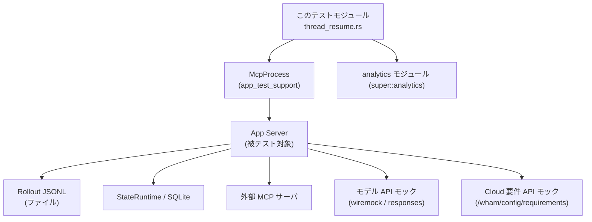
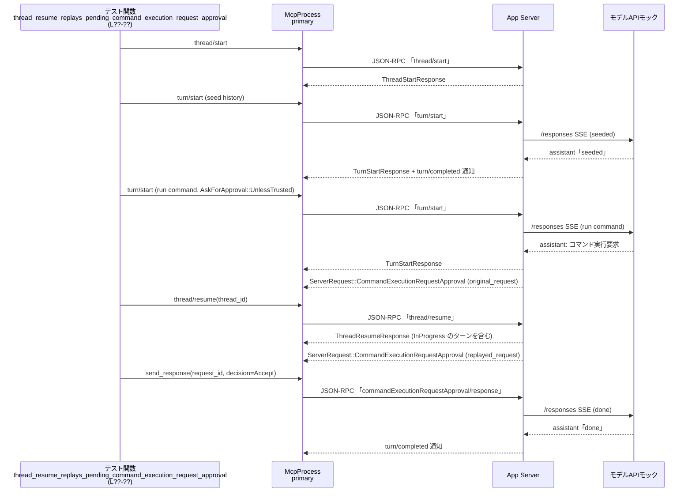

# app-server/tests/suite/v2/thread_resume.rs コード解説

## 0. ざっくり一言

`thread_resume.rs` は、スレッド再開 API（`thread/resume`）の振る舞いをエンドツーエンドで検証する非同期統合テスト群です。  
ローカルのロールアウトファイル（会話ログ）・MCP サーバ・クラウド要件・承認フローなど、周辺コンポーネントとの連携も含めて網羅的にテストしています。

---

## 1. このモジュールの役割

### 1.1 概要

このテストモジュールは、次のような「スレッド再開 (`thread/resume`)」に関する仕様を検証するために存在します。

- 未 materialize（ロールアウト未作成）のスレッドは再開できないこと
- 既存ロールアウトからスレッド情報・履歴を正しく復元できること
- 実行中スレッドに対する履歴・パスの上書きが禁止／制限されていること
- コマンド実行／ファイル変更の承認リクエストが再接続時にリプレイされること
- Git メタデータ、更新時刻、MCP サーバ、クラウド要件、パーソナリティなどの周辺機能との統合

### 1.2 アーキテクチャ内での位置づけ

`thread_resume.rs` 自体はテストコードであり、アプリケーションサーバ本体の API を黒箱として利用します。主な依存関係は以下の通りです。

- `McpProcess`（`app_test_support`）  
  テストから JSON-RPC 経由で app-server を操作するラッパー
- 各種プロトコル型（`codex_app_server_protocol`, `codex_protocol`）  
  Thread/Turn/Item/エラーなどの型定義
- `wiremock` / `core_test_support::responses`  
  モデル API や Cloud 要件 API を模倣する HTTP/SSE モックサーバ
- ファイルシステム／Git／SQLite（`rollout_path`, `StateRuntime` など）  
  ロールアウト JSONL ファイルと状態 DB を経由した永続化

概略の依存関係は以下のようになります。



> 図はこのチャンクのコード全体（`thread_resume.rs:L??-??`）を対象にした概略図です。行番号はこの環境から正確に取得できないため `L??-??` と表記しています。

### 1.3 設計上のポイント

コードから読み取れる特徴をまとめます。

- **非同期テスト（Tokio）**
  - すべてのテスト関数は `#[tokio::test] async fn ... -> Result<()>` で定義され、非同期 I/O とタイムアウトを明示的に扱います（例: `thread_resume_rejects_unmaterialized_thread`）。
- **JSON-RPC を介したブラックボックステスト**
  - `McpProcess` 経由で `thread/start`, `turn/start`, `thread/read`, `thread/resume` 等を送信し、レスポンスや通知をプロトコル型で検証します。
- **ロールアウトファイルを直接編集**
  - 一部テストではロールアウト JSONL ファイルやその `mtime` を直接書き換え、異常な状態（不完全なターン等）を再現しています（`thread_resume_and_read_interrupt_incomplete_rollout_turn_when_thread_is_idle` など）。
- **エラー伝播とメッセージの検証**
  - `JSONRPCError` の `message` および `data` を詳細に検証し、Cloud 要件や MCP 初期化エラーなどがユーザーにどのように見えるかを確認しています。
- **並行性の検証**
  - 複数の `McpProcess` インスタンス（primary / secondary）や、実行中ターンに対する再接続など、同一スレッドに対する並行操作をテストしています。

---

## 2. 主要な機能一覧（テスト観点）

このモジュールが検証している主な仕様を機能別に整理します。

- **基本的な再開可否**
  - 未 materialize スレッドの再開拒否  
    → `thread_resume_rejects_unmaterialized_thread`
  - パス指定と thread_id の優先順位  
    → `thread_resume_prefers_path_over_thread_id`
- **履歴・ロールアウト関連**
  - ロールアウト履歴からの Thread/Turn/Item 復元  
    → `thread_resume_returns_rollout_history`
  - 不完全な最後のターンを `Interrupted` として扱う  
    → `thread_resume_and_read_interrupt_incomplete_rollout_turn_when_thread_is_idle`
  - 履歴上書き（history override）のサポート  
    → `thread_resume_supports_history_and_overrides`
  - 実行中スレッドへの history override の拒否  
    → `thread_resume_rejects_history_when_thread_is_running`
- **Git / メタデータ / 時刻**
  - ローカルスレッドの Git メタデータは、ライブ HEAD ではなく永続化済みメタデータを優先  
    → `thread_resume_prefers_persisted_git_metadata_for_local_threads`
  - `updated_at` とロールアウトファイルの mtime の関係  
    → `thread_resume_without_overrides_does_not_change_updated_at_or_mtime`  
      `thread_resume_with_overrides_defers_updated_at_until_turn_start`
- **実行中スレッドとの関係（並行性）**
  - 実行中ターン中に別クライアントから `thread/resume` してもストリーミングが継続する  
    → `thread_resume_keeps_in_flight_turn_streaming`
  - 実行中スレッドで `path` が食い違う resume を拒否  
    → `thread_resume_rejects_mismatched_path_when_thread_is_running`
  - 実行中スレッドではモデルや cwd の override は無視しつつ「再参加」できる  
    → `thread_resume_rejoins_running_thread_even_with_override_mismatch`
- **承認フローのリプレイ**
  - 保留中のコマンド実行承認リクエストを再接続時にリプレイ  
    → `thread_resume_replays_pending_command_execution_request_approval`
  - 保留中のファイル変更承認リクエストを再接続時にリプレイ  
    → `thread_resume_replays_pending_file_change_request_approval`
- **外部要件・エラー伝播**
  - 必須 MCP サーバが起動に失敗した場合の resume 失敗  
    → `thread_resume_fails_when_required_mcp_server_fails_to_initialize`
  - Cloud 要件ロード失敗（認証エラー）の詳細なエラー surfacing  
    → `thread_resume_surfaces_cloud_requirements_load_errors`
- **アナリティクス・パーソナリティ**
  - `thread/resume` 時に thread_initialized analytics が送信される  
    → `thread_resume_tracks_thread_initialized_analytics`
  - Personality override による developer メッセージの追加と、既定 base instructions の維持  
    → `thread_resume_accepts_personality_override`

---

## 3. 公開 API と詳細解説（テスト観点）

このファイルは外部に公開されるライブラリ API は持ちませんが、テストから見た「使用するコンポーネント」を整理します。

### 3.1 型一覧（構造体）

| 名前 | 種別 | 役割 / 用途 | 根拠 |
|------|------|-------------|------|
| `RestartedThreadFixture` | 構造体 | 一度 materialize したスレッドを、プロセス再起動後に再利用するためのフィクスチャ。`mcp`（再起動後の `McpProcess`）、`thread_id`、`rollout_file_path` をまとめて保持します。 | `thread_resume.rs:L??-??` |
| `RolloutFixture` | 構造体 | ロールアウトファイルとその mtime を使ったテスト用フィクスチャ。`conversation_id`・ファイルパス・`before_modified`・期待される `updated_at` を保持します。 | `thread_resume.rs:L??-??` |

> 行番号はこのチャンクから正確な値を取得できないため、`L??-??` としています。

### 3.2 コンポーネントインベントリー（関数一覧）

テスト関数とヘルパー関数を一覧にします。

| 名前 | 種別 | 役割 / 説明 | 根拠 |
|------|------|-------------|------|
| `DEFAULT_READ_TIMEOUT` | 定数 | テストでの RPC 待ちタイムアウト（10秒）を一元管理します。 | `thread_resume.rs:L??-??` |
| `CODEX_5_2_INSTRUCTIONS_TEMPLATE_DEFAULT` | 定数 | GPT-5.2 Codex 用の既定ベースインストラクション文字列。パーソナリティテストで期待値として使用。 | `thread_resume.rs:L??-??` |
| `wait_for_responses_request_count` | 非公開 async 関数 | wiremock モックサーバに対する `/responses` POST リクエスト数が指定値に達するまでポーリングします。 | `thread_resume.rs:L??-??` |
| `thread_resume_rejects_unmaterialized_thread` | Tokio テスト | スレッド開始直後（ロールアウト未作成）の `thread/resume` が「no rollout found for thread id」で失敗することを検証します。 | `thread_resume.rs:L??-??` |
| `thread_resume_tracks_thread_initialized_analytics` | Tokio テスト | 既存ロールアウトを `thread/resume` した際に、analytics の「thread_initialized」イベントが送信されることを検証します。 | `thread_resume.rs:L??-??` |
| `thread_resume_returns_rollout_history` | Tokio テスト | 偽のロールアウトから `Thread` と `Turn` / `ThreadItem::UserMessage` が正しく復元されることを検証します。 | `thread_resume.rs:L??-??` |
| `thread_resume_prefers_persisted_git_metadata_for_local_threads` | Tokio テスト | ローカル Git リポジトリ上のスレッドで、ライブ HEAD ではなく永続化済み Git メタデータ（branch）が優先されることを検証します。 | `thread_resume.rs:L??-??` |
| `thread_resume_and_read_interrupt_incomplete_rollout_turn_when_thread_is_idle` | Tokio テスト | ロールアウトに不完全なターンがあるが実行中でない場合、そのターンが `Interrupted` として扱われ、`thread/resume` および `thread/read` で一貫してそう見えることを検証します。 | `thread_resume.rs:L??-??` |
| `thread_resume_without_overrides_does_not_change_updated_at_or_mtime` | Tokio テスト | `thread/resume` をオーバーライド無しで呼んでも `updated_at` とファイルの mtime が変化しないことを検証します。 | `thread_resume.rs:L??-??` |
| `thread_resume_keeps_in_flight_turn_streaming` | Tokio テスト | あるクライアントでターンが実行中のスレッドに、別のクライアントから `thread/resume` してもストリーミングが継続することを検証します。 | `thread_resume.rs:L??-??` |
| `thread_resume_rejects_history_when_thread_is_running` | Tokio テスト | 実行中スレッドに対して履歴上書き（`history`）付きで `thread/resume` を呼ぶと、エラーになることを検証します。 | `thread_resume.rs:L??-??` |
| `thread_resume_rejects_mismatched_path_when_thread_is_running` | Tokio テスト | 実行中スレッドに対して、現在のロールアウトファイルと異なる `path` で `thread/resume` するとエラーになることを検証します。 | `thread_resume.rs:L??-??` |
| `thread_resume_rejoins_running_thread_even_with_override_mismatch` | Tokio テスト | 実行中スレッドに対して `model` や `cwd` が食い違う `thread/resume` を呼んでも、エラーではなく「再参加」として扱われ、実際のモデルが優先されることを検証します。 | `thread_resume.rs:L??-??` |
| `thread_resume_replays_pending_command_execution_request_approval` | Tokio テスト | コマンド実行承認リクエストが保留中の状態で `thread/resume` した際、承認リクエストが再度クライアントに送られる（リプレイされる）ことを検証します。 | `thread_resume.rs:L??-??` |
| `thread_resume_replays_pending_file_change_request_approval` | Tokio テスト | ファイル変更承認リクエストが保留中の状態で `thread/resume` した際、承認リクエストがリプレイされることを検証します。 | `thread_resume.rs:L??-??` |
| `thread_resume_with_overrides_defers_updated_at_until_turn_start` | Tokio テスト | モデル等のオーバーライド付きで `thread/resume` しても `updated_at` はロールアウト mtime に基づき、実際に新ターンが開始されるまではファイル mtime が更新されないことを検証します。 | `thread_resume.rs:L??-??` |
| `thread_resume_fails_when_required_mcp_server_fails_to_initialize` | Tokio テスト | 必須 (`required = true`) MCP サーバが起動に失敗した場合、`thread/resume` がエラーになることを検証します。 | `thread_resume.rs:L??-??` |
| `thread_resume_surfaces_cloud_requirements_load_errors` | Tokio テスト | Cloud 要件 API のロード時に認証エラーが発生した場合、その詳細な理由が `JSONRPCError.data` に含まれてクライアントに返されることを検証します。 | `thread_resume.rs:L??-??` |
| `thread_resume_prefers_path_over_thread_id` | Tokio テスト | `thread/resume` 引数で `path` と不正な `thread_id` が同時に与えられた場合、`path` が優先されて正しいスレッドが再開されることを検証します。 | `thread_resume.rs:L??-??` |
| `thread_resume_supports_history_and_overrides` | Tokio テスト | 明示的な `history` と `model` / `model_provider` のオーバーライド付きで `thread/resume` でき、`preview` が history に基づいて更新されることを検証します。 | `thread_resume.rs:L??-??` |
| `start_materialized_thread_and_restart` | 非公開 async 関数 | スレッドを開始・materialize した後、一旦プロセスを落としてから新しい `McpProcess` を立ち上げ、同じロールアウトファイルを再利用するフィクスチャを構築します。 | `thread_resume.rs:L??-??` |
| `thread_resume_accepts_personality_override` | Tokio テスト | `personality` オーバーライド付きで `thread/resume` した場合、モデルへの developer メッセージに `<personality_spec>` が含まれ、既定 instructions が保持されることを検証します。 | `thread_resume.rs:L??-??` |
| `create_config_toml` | ヘルパ関数 | モックモデルサーバに接続するための最小限な `config.toml` を書き出します。 | `thread_resume.rs:L??-??` |
| `create_config_toml_with_chatgpt_base_url` | ヘルパ関数 | ChatGPT base URL と analytics 設定付きの `config.toml` を書き出します。Cloud 要件テストで使用。 | `thread_resume.rs:L??-??` |
| `create_config_toml_with_required_broken_mcp` | ヘルパ関数 | 存在しないバイナリを指す必須 MCP サーバ設定を含む `config.toml` を作成します。 | `thread_resume.rs:L??-??` |
| `set_rollout_mtime` | ヘルパ関数 | ロールアウトファイルの `mtime` を RFC3339 文字列から設定します。`FileTimes::set_modified` を使用。 | `thread_resume.rs:L??-??` |
| `setup_rollout_fixture` | ヘルパ関数 | ロールアウトファイルを作成し、その `mtime` と期待される `updated_at` を含む `RolloutFixture` を構築します。 | `thread_resume.rs:L??-??` |

### 3.3 重要関数の詳細解説（抜粋）

以下では特に仕様理解に重要な関数を 7 件取り上げ、テンプレートに沿って説明します。

#### 3.3.1 `thread_resume_rejects_unmaterialized_thread() -> Result<()>`

**概要**

- スレッドを `thread/start` 直後の状態で `thread/resume` すると、「ロールアウトが存在しない」というエラーになることを確認するテストです。

**引数**

- なし

**戻り値**

- `Result<()>` (`anyhow::Result<()>`)  
  - テストが成功すれば `Ok(())`、途中の I/O やアサーションで失敗すれば `Err` になります。

**内部処理の流れ**

1. モックモデルサーバを `create_mock_responses_server_repeating_assistant("Done")` で起動（`thread_resume.rs:L??-??`）。
2. 一時ディレクトリ `codex_home` を作成し、`create_config_toml` で `config.toml` を生成。
3. `McpProcess::new` で app-server を起動し `initialize` を完了。
4. `send_thread_start_request` でスレッドを開始し、`ThreadStartResponse` を受信。
5. まだユーザーターンを送っていない状態で `send_thread_resume_request` を発行。
6. `read_stream_until_error_message` でエラーレスポンスを待ち、メッセージに `"no rollout found for thread id"` が含まれることを `assert!` で検証。

**Examples（使用例）**

テストコードそのものが使用例です。未 materialize 状態を再現するには:

```rust
// スレッドを開始するが、ユーザーメッセージはまだ送らない
let start_id = mcp
    .send_thread_start_request(ThreadStartParams {
        model: Some("gpt-5.1-codex-max".to_string()),
        ..Default::default()
    })
    .await?;

// すぐに resume を投げると、ロールアウトが無いためエラーになる想定
let resume_id = mcp
    .send_thread_resume_request(ThreadResumeParams {
        thread_id: thread.id.clone(),
        ..Default::default()
    })
    .await?;
let resume_err: JSONRPCError = mcp
    .read_stream_until_error_message(RequestId::Integer(resume_id))
    .await??;
```

**Errors / Panics**

- `JSONRPCError` の `error.message` に `"no rollout found for thread id"` が含まれることが想定されています（`thread_resume.rs:L??-??`）。
- テスト側ではこの条件を満たさない場合に `assert!` がパニックします。

**Edge cases（エッジケース）**

- ユーザーターンを 1 回でも送ってロールアウトを materialize した後であれば、このエラーにはならないことが別テスト（`thread_resume_returns_rollout_history` など）から読み取れます。

**使用上の注意点**

- 実サービス利用時も、`thread/resume` を呼ぶ前に少なくとも 1 回ユーザーメッセージを送ってロールアウトを作成しておく必要があります。

---

#### 3.3.2 `thread_resume_returns_rollout_history() -> Result<()>`

**概要**

- ファイルベースのロールアウトから、スレッドのメタ情報・ターン・ユーザーメッセージが正しく復元されることを検証するテストです。

**内部処理の流れ**

1. `create_fake_rollout_with_text_elements` を使って、指定の `preview` と `TextElement` リストを含むロールアウトファイルを作成（`thread_resume.rs:L??-??`）。
2. `McpProcess` を起動して `initialize`。
3. `ThreadResumeParams { thread_id: conversation_id, .. }` で `thread/resume` を呼び、`ThreadResumeResponse` を受信。
4. 以下をアサート:
   - `thread.id == conversation_id`
   - `thread.preview`・`thread.model_provider`・`thread.path`（絶対パス）・`thread.cwd`・`thread.cli_version`・`thread.source`・`thread.git_info`・`thread.status == Idle`
   - `thread.turns.len() == 1` かつ 1 件目の `turn.status == Completed`
   - そのターンの items[0] が `ThreadItem::UserMessage` であり、content の `UserInput::Text` が preview と text_elements を正しく反映している。

**Edge cases**

- Git 情報は `git_info: None` で生成しているため、復元時にも None であることを求めています。
- `cwd` は `/` に固定されています。このテストからは `thread/resume` がプロセスの cwd ではなくロールアウト中の情報を使うことが分かります。

**使用上の注意点**

- `TextElement` は JSON 経由でシリアライズされているため、ロールアウトを手で編集する場合は JSON 形式を崩さない必要があります。
- `thread.path` が必ずしも存在するとは限らない設計ですが、このテストでは `Some` であることを前提にしています。

---

#### 3.3.3 `thread_resume_keeps_in_flight_turn_streaming() -> Result<()>`

**概要**

- 一つのクライアント（primary）がターンを実行中に、別のクライアント（secondary）から同じスレッドを `thread/resume` しても、実行中ターンが中断されずに完了することを検証します。

**内部処理の流れ**

1. primary クライアントでスレッドを開始し、`seed history` というテキストで 1 ターン実行して履歴を作成（`thread_resume.rs:L??-??`）。
2. secondary クライアントを起動して `initialize`。
3. primary で再度 `turn/start` を行い、`"respond with docs"` というテキストを送信。
4. `turn/started` 通知を受け取った時点で、secondary から `thread/resume` を実行。
5. `ThreadResumeResponse` の `thread.status` が `NotLoaded` 以外であることを確認（実行中スレッドに正常に join できている）。
6. primary 側で `turn/completed` 通知が来るまで待機し、完了を確認。

**並行性（Rust/async 観点）**

- 2 つの `McpProcess` を同じ `codex_home` で起動し、それぞれ独立した非同期タスクとして JSON-RPC ストリームを扱います。
- 各操作は `tokio::time::timeout(DEFAULT_READ_TIMEOUT, ...)` でラップされており、ハングを防いでいます。

**使用上の注意点**

- 実サービス中でも、複数クライアントから同一スレッドに接続できることを前提とした設計であることが伺えます。その際、`thread/resume` は実行中ターンを壊さずに状態を共有するべきという契約になります。

---

#### 3.3.4 `thread_resume_replays_pending_command_execution_request_approval() -> Result<()>`

**概要**

- コマンド実行要求に対するユーザー承認が必要な状態で `thread/resume` すると、承認リクエスト (`ServerRequest::CommandExecutionRequestApproval`) が再度クライアントに送られることを検証します。

**内部処理の流れ**

1. モックモデルサーバを、  
   - 1 回目: 「seeded」と返す  
   - 2 回目: `shell_command_sse_response` でコマンド実行要求を含む応答  
   - 3 回目: 「done」と返す  
   というシーケンスで構成（`create_mock_responses_server_sequence_unchecked`）。
2. スレッドを開始し、`"seed history"` で 1 ターン実行して履歴を作成。
3. `"run command"` という入力で新たなターンを `approval_policy: Some(AskForApproval::UnlessTrusted)` 付きで開始。
4. 最初の `ServerRequest::CommandExecutionRequestApproval` を `primary.read_stream_until_request_message()` で受信し、`original_request` として保存。
5. 同じクライアントから `thread/resume` を呼び、レスポンス中のスレッドに `TurnStatus::InProgress` のターンが含まれていることを確認。
6. 再度 `read_stream_until_request_message()` を呼び、`replayed_request` を取得。
7. `pretty_assertions::assert_eq!(replayed_request, original_request)` で完全一致を確認。
8. `ServerRequest::CommandExecutionRequestApproval { request_id, .. }` をパターンマッチし、`CommandExecutionRequestApprovalResponse { decision: Accept }` を送信。
9. `turn/completed` 通知と、`wait_for_responses_request_count(&server, 3)` により 3 回のモデルリクエストが行われたことを検証。

**Errors / Panics**

- 期待される `ServerRequest` の種類が異なる場合には `panic!` でテストが失敗します。
- `wait_for_responses_request_count` 内で、`/responses` リクエスト数が期待値を超えた場合にも `anyhow::bail!` によるエラーが発生します。

**エッジケース・契約**

- `thread/resume` 前に承認リクエストをすでに消費していた場合、このテストのようなリプレイは起こらないと考えられますが、このファイルからは断定できません。
- 重要な契約として、「保留中のユーザーアクション（承認）は、`thread/resume` を跨いでも失われない」ことを確認しています。

---

#### 3.3.5 `thread_resume_replays_pending_file_change_request_approval() -> Result<()>`

**概要**

- ファイル変更（パッチ適用）に対する承認リクエストが保留中の状態で `thread/resume` した場合、`ServerRequest::FileChangeRequestApproval` がリプレイされることを検証します。

**内部処理の流れ（要約）**

1. 一時ディレクトリ内に `codex_home` と `workspace` を作成し、パッチ内容（README の追加）を準備。
2. モックモデルサーバを、「seeded」→「apply patch」→「done」のシーケンスで構成。
3. スレッドを開始し、`cwd` を `workspace` として `seed history` ターンを実行。
4. `"apply patch"` と `AskForApproval::UnlessTrusted` 付きでターンを開始。
5. `item/started` 通知をループで受け取り、`ThreadItem::FileChange` が現れるまで待機。期待される `FileChange` 内容と一致することを検証。
6. `ServerRequest::FileChangeRequestApproval` を `original_request` として取得。
7. `thread/resume` を呼び、レスポンス内に `TurnStatus::InProgress` のターンがあることを確認。
8. 再度 `FileChangeRequestApproval` を `replayed_request` として受信し、`original_request` と等しいことを検証。
9. 承認レスポンスを返し、ターン完了と `/responses` リクエスト数を確認。

**使用上の注意点**

- ファイルパスは absolute ではなく、`cwd` を基準に構成されます（テストでは `workspace.join("README.md")`）。
- `ThreadItem::FileChange` の `status` が `PatchApplyStatus::InProgress` であることを前提としています。

---

#### 3.3.6 `thread_resume_supports_history_and_overrides() -> Result<()>`

**概要**

- 一度 materialize 済みのスレッドに対して、明示的な `history` と `model` / `model_provider` のオーバーライドを与えて `thread/resume` できることを検証します。

**内部処理の流れ**

1. `start_materialized_thread_and_restart` で、`"seed history"` というテキストで materialize 済みスレッドと、それを扱う新しい `McpProcess` を取得。
2. `history_text = "Hello from history"` を用いて、`ResponseItem::Message` からなる `history` ベクタを構築。
3. `thread_id`, `history: Some(history)`, `model: Some("mock-model")`, `model_provider: Some("mock_provider")` を指定して `thread/resume` を実行。
4. `ThreadResumeResponse` をパースし、以下を検証:
   - `resumed.id` が空でない。
   - `model_provider == "mock_provider"`.
   - `resumed.preview == history_text`.
   - `resumed.status == ThreadStatus::Idle`.

**契約・エッジケース**

- 既存ロールアウトの履歴は、このテストケースでは上書きされる前提です（preview が history から決まる）。ただし、ロールアウトファイル自体がどう書き換えられるかはこのテストからは分かりません。
- 実行中スレッドに対する history override は別テストで明示的に拒否されるため、「スレッドが idle であること」が `history` 指定の前提条件となります（`thread_resume_rejects_history_when_thread_is_running` 参照）。

---

#### 3.3.7 `start_materialized_thread_and_restart(codex_home: &Path, seed_text: &str) -> Result<RestartedThreadFixture>`

**概要**

- 一度スレッドを materialize（少なくとも 1 ターン分の会話をロールアウトに書き出し）した後、その `rollout_file_path` を使って新しい `McpProcess` で再開するためのフィクスチャを構築するヘルパーです。

**引数**

| 引数名 | 型 | 説明 |
|--------|----|------|
| `codex_home` | `&Path` | `config.toml` やロールアウトファイルを格納するディレクトリパス。 |
| `seed_text` | `&str` | materialize 用に最初のターンで送るユーザー入力文字列。 |

**戻り値**

- `Result<RestartedThreadFixture>`  
  - `mcp`: materialize 後に再起動した `McpProcess`  
  - `thread_id`: 生成されたスレッド ID  
  - `rollout_file_path`: そのスレッドのロールアウト JSONL ファイルパス

**内部処理の流れ**

1. `McpProcess::new(codex_home)` で最初のクライアントを起動し、`initialize` を完了。
2. `thread/start` により新しいスレッドを開始し、`ThreadStartResponse` から `thread.id` と `thread.path` を取得。
3. `turn/start` で `seed_text` を送信し、レスポンスと `turn/completed` 通知を待つ。
4. `thread.path` が `Some` であることを確認し、`rollout_file_path` として保持。
5. 最初の `McpProcess` を `drop` してプロセスを終了。
6. 新たに `McpProcess::new(codex_home)` を起動し、`initialize` を完了。
7. これらをまとめて `RestartedThreadFixture` として返す。

**使用上の注意点**

- `thread.path` が `None` の場合には `anyhow::anyhow!` でエラーになります。テストで使用する前提として、`thread/start` が常にロールアウトパスを含むことが暗黙の契約になっています。

---

### 3.4 その他の関数

重要度が比較的低いが仕様把握に役立つ関数は、前述のインベントリー表を参照してください（`thread_resume.rs:L??-??`）。

---

## 4. データフロー（代表シナリオ）

ここでは「承認リクエストのリプレイ」という代表的なシナリオ（`thread_resume_replays_pending_command_execution_request_approval`）を例に、データの流れを示します。

### 4.1 承認リクエストリプレイのシーケンス



このフローから分かるポイント:

- `thread/resume` は、進行中のターンを中断せずに状態を再構築し、保留中のユーザー承認リクエストを再送信します。
- クライアント側は `thread/resume` 後にも `read_stream_until_request_message()` を継続して呼び出し、再送されたリクエストを処理する必要があります。

---

## 5. 使い方（How to Use）

このファイル自体はテストコードですが、`McpProcess` を使った `thread/resume` の呼び出し方や、並行性／エラー処理のパターンとして有用なサンプルになっています。

### 5.1 基本的な使用方法（thread/resume の呼び出し）

典型的な `thread/resume` 呼び出しの流れは、次のようになります。

```rust
use app_test_support::McpProcess;
use codex_app_server_protocol::{
    ThreadResumeParams, ThreadResumeResponse, ThreadStartParams, ThreadStartResponse,
    JSONRPCResponse, RequestId,
};
use anyhow::Result;
use tokio::time::timeout;

async fn basic_resume_example(codex_home: &std::path::Path) -> Result<()> {
    // app-server を起動するプロセスを作成
    let mut mcp = McpProcess::new(codex_home).await?;
    timeout(DEFAULT_READ_TIMEOUT, mcp.initialize()).await??;

    // まず thread/start でスレッドを作成
    let start_id = mcp
        .send_thread_start_request(ThreadStartParams {
            model: Some("gpt-5.2-codex".to_string()),
            ..Default::default()
        })
        .await?;
    let start_resp: JSONRPCResponse = timeout(
        DEFAULT_READ_TIMEOUT,
        mcp.read_stream_until_response_message(RequestId::Integer(start_id)),
    )
    .await??;
    let ThreadStartResponse { thread, .. } = to_response::<ThreadStartResponse>(start_resp)?;

    // （ここで少なくとも 1 回 turn/start を行い、ロールアウトを materialize しておく）

    // thread/resume を呼び出す
    let resume_id = mcp
        .send_thread_resume_request(ThreadResumeParams {
            thread_id: thread.id.clone(),
            ..Default::default()
        })
        .await?;
    let resume_resp: JSONRPCResponse = timeout(
        DEFAULT_READ_TIMEOUT,
        mcp.read_stream_until_response_message(RequestId::Integer(resume_id)),
    )
    .await??;
    let ThreadResumeResponse { thread: resumed, .. } =
        to_response::<ThreadResumeResponse>(resume_resp)?;

    // 再開されたスレッドの情報を利用
    println!("resumed thread id: {}", resumed.id);
    println!("status: {:?}", resumed.status);

    Ok(())
}
```

ポイント:

- `thread/resume` の前にスレッドを materialize しておく（少なくとも 1 回 `turn/start`）。
- JSON-RPC 呼び出しは `McpProcess` にカプセル化されており、`send_*_request` + `read_stream_until_response_message` の組み合わせが基本パターンです。

### 5.2 よくある使用パターン

#### 5.2.1 パス優先での再開

`thread_id` が不明（あるいは壊れている）でも、ロールアウトファイルのパスから再開できることがテストされています（`thread_resume_prefers_path_over_thread_id`）。

```rust
let resume_id = mcp
    .send_thread_resume_request(ThreadResumeParams {
        thread_id: "invalid-id".to_string(),        // 無効な ID
        path: Some(existing_thread_path.clone()),   // 正しいロールアウトパス
        ..Default::default()
    })
    .await?;
```

この場合、`path` が優先され、正しいスレッドが再開されます。

#### 5.2.2 履歴・モデルのオーバーライド

`thread_resume_supports_history_and_overrides` では、履歴とモデル／プロバイダを差し替えてスレッドを再開しています。

```rust
let history = vec![ResponseItem::Message {
    id: None,
    role: "user".to_string(),
    content: vec![ContentItem::InputText { text: "Hello".into() }],
    end_turn: None,
    phase: None,
}];

let resume_id = mcp
    .send_thread_resume_request(ThreadResumeParams {
        thread_id,
        history: Some(history),
        model: Some("mock-model".to_string()),
        model_provider: Some("mock_provider".to_string()),
        ..Default::default()
    })
    .await?;
```

### 5.3 よくある間違いと本モジュールのテスト

#### 誤用例: 実行中ターンに対する history/path override

```rust
// 実行中のスレッドに対して history を上書きしようとする（誤用）
let resume_id = mcp
    .send_thread_resume_request(ThreadResumeParams {
        thread_id: running_thread_id.clone(),
        history: Some(custom_history),
        ..Default::default()
    })
    .await?;

// -> thread_resume_rejects_history_when_thread_is_running でエラーになることを検証
```

テストの期待通り、エラーメッセージには「cannot resume thread」「with history」「running」などが含まれます。

#### 正しい例: idle 状態での history override

```rust
// idle なスレッドに対して history を与え、履歴を差し替える（正しい）
let resume_id = mcp
    .send_thread_resume_request(ThreadResumeParams {
        thread_id,
        history: Some(custom_history),
        ..Default::default()
    })
    .await?;
```

### 5.4 モジュール全体の注意点（スレッド再開の契約）

このテスト群から読み取れる `thread/resume` 周りの共通前提をまとめます。

- **前提条件**
  - スレッド再開にはロールアウトファイルが必要 (`thread_resume_rejects_unmaterialized_thread`)。
  - 履歴上書き (`history`) はスレッドが idle のときのみ許可 (`thread_resume_supports_history_and_overrides`)。
- **禁止事項・制約**
  - 実行中スレッドに対して `history` を与えるとエラー（`thread_resume_rejects_history_when_thread_is_running`）。
  - 実行中スレッドに対して、現在のロールアウトと異なる `path` を指定するとエラー（`thread_resume_rejects_mismatched_path_when_thread_is_running`）。
- **許容される例外**
  - 実行中スレッドに対して `model` や `cwd` などが食い違う `thread/resume` は、エラーではなく「再参加」として扱われる（`thread_resume_rejoins_running_thread_even_with_override_mismatch`）。
- **エラー伝播**
  - 必須 MCP サーバが起動に失敗した場合、`thread/resume` は「required MCP servers failed to initialize」を含むエラーを返す。
  - Cloud 要件 API の認証失敗時には、`error.data` に `reason`, `errorCode`, `action`, `statusCode`, `detail` などの詳細情報が含まれる。

---

## 6. 変更の仕方（How to Modify）

### 6.1 新しいテストシナリオを追加する場合

`thread/resume` の仕様を拡張したい場合、このファイルにテストを追加するのが自然です。

1. **フィクスチャの選択**
   - 既存のヘルパーを活用する:
     - ロールアウトファイルベース → `create_fake_rollout_with_text_elements`, `setup_rollout_fixture`
     - materialize & 再起動 → `start_materialized_thread_and_restart`
     - MCP 構成 → `create_config_toml_*`
2. **シナリオ構築**
   - `McpProcess` を使って `thread/start` → `turn/start` → `thread/resume` の順に操作。
   - 必要に応じてロールアウトファイルを直接編集して、境界状態（不完全ターンなど）を再現。
3. **検証**
   - `ThreadResumeResponse` や `JSONRPCError` のフィールド（`status`, `preview`, `git_info`, `error.data` など）を `assert_eq!` や `assert!` で検証。
   - 並行性シナリオでは複数の `McpProcess` を使い、通知 (`turn/started`, `turn/completed`) を適切に待ち合わせます。

### 6.2 既存テストの変更時の注意点

- **影響範囲**
  - 各テストは比較的独立していますが、`DEFAULT_READ_TIMEOUT` や共通ヘルパーを変更すると多くのテストに影響します。
- **契約の確認**
  - 特定のエラーメッセージやステータス（`ThreadStatus::Idle`, `TurnStatus::Interrupted` など）に依存しているため、API 仕様を変更する場合は該当テストを更新する必要があります。
- **外部依存**
  - `skip_if_no_network!` を使うテスト（`thread_resume_accepts_personality_override`）など、CI 環境でのネットワーク有無にも注意が必要です。

---

## 7. 関連ファイル・コンポーネント

このモジュールから参照されている主な外部コンポーネントをまとめます（ファイルパスはこのチャンクからは不明なものもあります）。

| パス / 名称 | 役割 / 関係 |
|-------------|------------|
| `app_test_support::McpProcess` | app-server をサブプロセスとして起動し、JSON-RPC 経由で `thread/*` や `turn/*` を操作するテスト用ラッパー。多くのテスト関数で使用されています。 |
| `app_test_support::{create_fake_rollout_with_text_elements, rollout_path}` | ロールアウト JSONL ファイルのパス構築とテスト用ロールアウト生成に利用。 |
| `super::analytics::{enable_analytics_capture, thread_initialized_event, assert_basic_thread_initialized_event, wait_for_analytics_payload}` | `thread_resume_tracks_thread_initialized_analytics` で、`thread/resume` 時の analytics イベントを検証。 |
| `core_test_support::responses` | SSE モデルサーバモックの組み立てとリクエスト検査に使用。承認リクエストや personality オーバーライドのテストで重要。 |
| `codex_app_server_protocol::*` | Thread/Turn/Item/エラー等の JSON-RPC プロトコル型を提供。テストでレスポンスを厳密に検証。 |
| `codex_protocol::*` | ロールアウト（`SessionMeta`, `EventMsg`, `TurnStartedEvent` 等）や `ThreadId` 型を提供し、ロールアウトファイルの構築に利用。 |
| `codex_state::StateRuntime` | ロールアウトのバックフィル完了状態を管理。`thread_resume_prefers_persisted_git_metadata_for_local_threads` で使用。 |
| `wiremock::MockServer` および `ResponseTemplate` | Cloud 要件 API モックや ChatGPT トークンリフレッシュ API モックに使用。`thread_resume_surfaces_cloud_requirements_load_errors` で重要。 |

---

### 補足: 安全性・エラー・並行性に関する観察

- **安全性（所有権 / 借用）**
  - テストコードはほぼすべて `async` コンテキスト内で `McpProcess` やパスを所有権移動または参照で扱っており、Rust の所有権規則に従って明確にライフタイムが管理されています。
- **エラー処理**
  - すべてのテストは `anyhow::Result<()>` を返し、`?` 演算子で I/O や JSON パースエラーを早期リターンしています。
  - サーバからのロジックエラーは `JSONRPCError` として受け取り、`message` と `data` の内容を検証することで仕様を固定化しています。
- **並行性**
  - 複数の `McpProcess` インスタンスや、SSE モックサーバ上の遅延 (`set_delay`) を使い、実行中ターンと `thread/resume` の相互作用を検証しています。
  - すべての待機処理は `tokio::time::timeout(DEFAULT_READ_TIMEOUT, ...)` で保護されており、テストがハングしないように設計されています。

このように、このファイルは `thread/resume` に関する契約（いつ成功し、いつ失敗し、どの状態をどう復元するか）を高い粒度でカバーする統合テスト群として機能しています。
