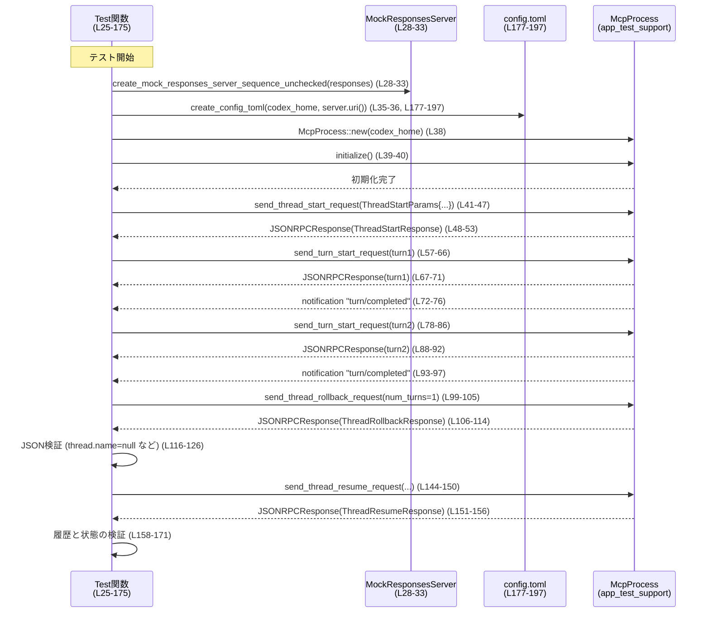

# app-server/tests/suite/v2/thread_rollback.rs コード解説

## 0. ざっくり一言

v2 API の「スレッドロールバック」機能について、  
最後のターンだけが削除され、その状態が永続化（再開後も維持）されることと、`thread.name` が未設定のとき JSON で `null` としてシリアライズされる「ワイヤフォーマット契約」を検証する統合テストです（`thread_rollback.rs:L25-175`）。

---

## 1. このモジュールの役割

### 1.1 概要

- このテストモジュールは **「スレッドの開始 → 2 ターン実行 → 1 ターンロールバック → 再開」** という一連の操作を行い、サーバの状態遷移とレスポンスの JSON 形式を検証します（`thread_rollback.rs:L25-175`）。
- モックのモデル応答サーバと、一時ディレクトリに生成する `config.toml` を使って、アプリケーションサーバの外部依存をテスト用に差し替えています（`thread_rollback.rs:L28-37`, `thread_rollback.rs:L177-197`）。
- すべての非同期 I/O は `tokio::time::timeout` でタイムアウトを設定し、テストがハングしないようにしています（`thread_rollback.rs:L23`, `thread_rollback.rs:L39-40`, `thread_rollback.rs:L48-52`, `thread_rollback.rs:L67-76`, `thread_rollback.rs:L88-97`, `thread_rollback.rs:L106-110`, `thread_rollback.rs:L151-155`）。

### 1.2 アーキテクチャ内での位置づけ

このテストは、以下のコンポーネントを組み合わせて v2 スレッド API の振る舞いを検証しています。

- **テスト関数** `thread_rollback_drops_last_turns_and_persists_to_rollout`（`thread_rollback.rs:L25-175`）
- **McpProcess**: アプリケーションサーバに対して JSON-RPC 形式で `thread/start`, `turn/start`, `thread/rollback`, `thread/resume` などのリクエストを送るためのテスト用プロセスラッパ（定義は別クレート、`thread_rollback.rs:L2`, `thread_rollback.rs:L38-39`, `thread_rollback.rs:L42-47` など）。
- **モック応答サーバ**: `create_mock_responses_server_sequence_unchecked` で立ち上げる、決め打ちの SSE 応答を返すサーバ（`thread_rollback.rs:L28-33`）。
- **config.toml**: テスト専用設定。一時ディレクトリに書き出し、モックサーバの `base_url` やモデル名などを指定します（`thread_rollback.rs:L177-197`）。
- **プロトコル型**: `ThreadStartParams`, `ThreadRollbackParams`, `ThreadResumeParams` など v2 プロトコル定義（`thread_rollback.rs:L13-17`, `thread_rollback.rs:L41-47`, `thread_rollback.rs:L57-66`, `thread_rollback.rs:L79-86`, `thread_rollback.rs:L101-104`, `thread_rollback.rs:L146-149`）。

依存関係の概略は次のとおりです。

```mermaid
graph TD
    %% チャンク: thread_rollback.rs (L1-198)
    Test["tokio test: thread_rollback_drops_last_turns_and_persists_to_rollout (L25-175)"]
    Mcp["McpProcess (app_test_support)"]
    MockServer["Mock responses server<br/>create_mock_responses_server_sequence_unchecked (L28-33)"]
    Config["config.toml<br/>create_config_toml (L177-197)"]
    Proto["codex_app_server_protocol 型群<br/>(Thread*, Turn*, UserInput)"]

    Test --> MockServer
    Test --> Config
    Test --> Mcp
    Test --> Proto
    Mcp -.uses config.-> Config
    Mcp --> Proto
    Mcp -.sends RPC via-> MockServer
```

> 注: McpProcess が実際にどのように `config.toml` を読み込み、モックサーバにアクセスするかの詳細は、このファイルには現れていません。`McpProcess::new(codex_home.path())` と `base_url = "{server_uri}/v1"` の組合せから、そのような利用が意図されていると推測できますが、実装は別ファイルです（`thread_rollback.rs:L35-38`, `thread_rollback.rs:L177-197`）。

### 1.3 設計上のポイント

- **統合テスト志向**  
  - 実プロセスに近い `McpProcess` と設定ファイルを使い、外部 API（スレッド/ターン操作）を end-to-end で検証しています（`thread_rollback.rs:L35-40`, `thread_rollback.rs:L41-53`, `thread_rollback.rs:L57-76`, `thread_rollback.rs:L79-97`, `thread_rollback.rs:L101-115`, `thread_rollback.rs:L145-157`）。
- **ロールバック契約の検証**  
  - `num_turns: 1` を指定した `thread/rollback` によって最後のターンだけが削除されること（ターン数・アイテム数）と、`status` が `Idle` になることを検証します（`thread_rollback.rs:L101-104`, `thread_rollback.rs:L128-130`）。
- **ワイヤフォーマット契約の検証**  
  - `thread.name` が unset のとき、Rust の構造体では `None`、JSON レスポンスでは `null` としてシリアライズされることを同時に検証しています（`thread_rollback.rs:L116-126`）。
- **タイムアウトによる安全性確保**  
  - すべてのストリーム読み取り・レスポンス待機を `timeout(DEFAULT_READ_TIMEOUT, ...)` でラップし、サーバやプロセスが応答しない場合にテストがハングしないようにしています（`thread_rollback.rs:L23`, `thread_rollback.rs:L39-40`, `thread_rollback.rs:L48-52`, `thread_rollback.rs:L67-76`, `thread_rollback.rs:L88-97`, `thread_rollback.rs:L106-110`, `thread_rollback.rs:L151-155`）。
- **エラーハンドリングの簡略化**  
  - テスト関数の戻り値に `anyhow::Result<()>` を使い、`?`/`??` 演算子でエラーを早期リターンさせています（`thread_rollback.rs:L1`, `thread_rollback.rs:L26`, `thread_rollback.rs:L29-31`, `thread_rollback.rs:L35-40` など）。

---

## 2. 主要な機能一覧

このモジュールで提供される主な機能は以下の 2 点です。

- **スレッドロールバック動作の統合テスト**  
  - `thread_rollback_drops_last_turns_and_persists_to_rollout`:  
    1. スレッド開始 (`thread/start`)  
    2. 2 つのターン開始 (`turn/start`)  
    3. 1 ターンロールバック (`thread/rollback` with `num_turns = 1`)  
    4. スレッド再開 (`thread/resume`)  
    を行い、ロールバック結果と再開後の履歴が期待どおりであることを検証します（`thread_rollback.rs:L25-175`）。
- **テスト用設定ファイルの生成**  
  - `create_config_toml`: 指定されたディレクトリ配下に `config.toml` を生成し、モックプロバイダへの接続設定を記述します（`thread_rollback.rs:L177-197`）。

### 2.1 ローカルコンポーネントインベントリー

| 名前 | 種別 | 役割 / 用途 | 行範囲 |
|------|------|------------|--------|
| `DEFAULT_READ_TIMEOUT` | `const std::time::Duration` | 全ての `timeout` 呼び出しで利用する読み取りタイムアウト（10 秒） | `thread_rollback.rs:L23` |
| `thread_rollback_drops_last_turns_and_persists_to_rollout` | 非公開 `async fn`（`#[tokio::test]`） | スレッドロールバックの統合テスト本体 | `thread_rollback.rs:L25-175` |
| `create_config_toml` | 非公開 `fn` | テスト用の `config.toml` を一時ディレクトリに書き出す | `thread_rollback.rs:L177-197` |

---

## 3. 公開 API と詳細解説

このファイル自体はテストモジュールであり、外部クレートに公開される API はありません。ただし、テストの観点から重要な型と関数を整理します。

### 3.1 型一覧（構造体・列挙体など）

#### ローカル定義

ローカルに定義された構造体・列挙体はありません。

#### 使用している主な外部型（コンポーネントインベントリー）

| 名前 | 種別 | 定義元 | 役割 / 用途 | 根拠行 |
|------|------|--------|-------------|--------|
| `McpProcess` | 構造体 | `app_test_support` | アプリケーションサーバとの対話（JSON-RPC 送受信、初期化）のためのテスト用プロセスラッパ | `thread_rollback.rs:L2`, `thread_rollback.rs:L38-39`, `thread_rollback.rs:L42-47`, `thread_rollback.rs:L57-76`, `thread_rollback.rs:L79-97`, `thread_rollback.rs:L101-110`, `thread_rollback.rs:L145-155` |
| `JSONRPCResponse` | 構造体または型エイリアス | `codex_app_server_protocol` | JSON-RPC レスポンス全体（`result` フィールドを含む）を表現 | `thread_rollback.rs:L6`, `thread_rollback.rs:L48-52`, `thread_rollback.rs:L67-71`, `thread_rollback.rs:L88-92`, `thread_rollback.rs:L106-110`, `thread_rollback.rs:L151-155` |
| `RequestId` | 列挙体など | 同上 | JSON-RPC の `id` を整数などで表現 | `thread_rollback.rs:L7`, `thread_rollback.rs:L50`, `thread_rollback.rs:L69`, `thread_rollback.rs:L90`, `thread_rollback.rs:L108`, `thread_rollback.rs:L153` |
| `ThreadStartParams` | 構造体 | 同上 | `thread/start` リクエストのパラメータ。モデル名や追加オプションを含む | `thread_rollback.rs:L13`, `thread_rollback.rs:L42-47` |
| `ThreadStartResponse` | 構造体 | 同上 | `thread/start` レスポンス。`thread` オブジェクトを含む | `thread_rollback.rs:L14`, `thread_rollback.rs:L53` |
| `TurnStartParams` | 構造体 | 同上 | `turn/start` リクエストのパラメータ。`thread_id` と `input` などを含む | `thread_rollback.rs:L16`, `thread_rollback.rs:L57-66`, `thread_rollback.rs:L79-86` |
| `ThreadRollbackParams` | 構造体 | 同上 | `thread/rollback` リクエスト。`thread_id` と `num_turns` を持つ | `thread_rollback.rs:L11`, `thread_rollback.rs:L101-104` |
| `ThreadRollbackResponse` | 構造体 | 同上 | ロールバック後の `thread` を含むレスポンス | `thread_rollback.rs:L12`, `thread_rollback.rs:L112-114` |
| `ThreadResumeParams` | 構造体 | 同上 | `thread/resume` リクエストパラメータ | `thread_rollback.rs:L9`, `thread_rollback.rs:L146-149` |
| `ThreadResumeResponse` | 構造体 | 同上 | 再開後の `thread` を含むレスポンス | `thread_rollback.rs:L10`, `thread_rollback.rs:L156` |
| `ThreadItem` | 列挙体 | 同上 | スレッド内のアイテム（ユーザメッセージなど）を表す | `thread_rollback.rs:L8`, `thread_rollback.rs:L131-141`, `thread_rollback.rs:L161-171` |
| `ThreadStatus` | 列挙体 | 同上 | スレッドの状態（`Idle` など）を表す | `thread_rollback.rs:L15`, `thread_rollback.rs:L129`, `thread_rollback.rs:L159` |
| `UserInput as V2UserInput` | 列挙体 | 同上 | ユーザ入力（テキストなど）を表す。ここでは `Text { text, text_elements }` バリアントを使用 | `thread_rollback.rs:L17`, `thread_rollback.rs:L60-63`, `thread_rollback.rs:L81-84`, `thread_rollback.rs:L133-138`, `thread_rollback.rs:L165-168` |
| `TempDir` | 構造体 | `tempfile` | 一時ディレクトリを表し、スコープ終了時に自動削除される | `thread_rollback.rs:L20`, `thread_rollback.rs:L35` |
| `Value` | 列挙体 | `serde_json` | 動的な JSON 値を表す。`Value::Null` など | `thread_rollback.rs:L19`, `thread_rollback.rs:L116-125` |

### 3.2 関数詳細

#### `thread_rollback_drops_last_turns_and_persists_to_rollout() -> Result<()>`

**概要**

- v2 スレッド API のロールバック機能について、  
  - 最後のターンが削除されること、  
  - `thread.name` が unset のとき JSON で `null` になること、  
  - ロールバックされた履歴が `thread/resume` 後も維持されること  
  を検証する非同期テスト関数です（`thread_rollback.rs:L25-175`）。

**属性・非同期実行**

- `#[tokio::test]` アトリビュートにより、Tokio ランタイム上で非同期テストとして実行されます（`thread_rollback.rs:L25`）。
- 戻り値は `anyhow::Result<()>` で、`?` / `??` 演算子によりエラーがそのままテスト失敗として伝播します（`thread_rollback.rs:L1`, `thread_rollback.rs:L26`, `thread_rollback.rs:L29-31`, `thread_rollback.rs:L35-40` など）。

**引数**

- 引数はありません。テストランナーから直接呼び出されます。

**戻り値**

- `Result<()>` (`anyhow::Result<()>`)  
  - 成功: `Ok(())`。すべてのアサーションに成功し、エラーが発生しなかったことを意味します（`thread_rollback.rs:L174`）。  
  - 失敗: 途中の `?`／`??` で発生したエラー、または `assert_eq!` / `panic!` によるパニックがテスト失敗になります。

**内部処理の流れ（アルゴリズム）**

1. **モック応答サーバの起動**
   - `create_final_assistant_message_sse_response("Done")?` を 3 回呼び出し、3 つの SSE 応答を持つベクタ `responses` を作成します（`thread_rollback.rs:L27-32`）。
   - `create_mock_responses_server_sequence_unchecked(responses).await` でモック応答サーバ `server` を起動します（`thread_rollback.rs:L33`）。

2. **テスト用設定ディレクトリの準備**
   - `TempDir::new()?` で一時ディレクトリ `codex_home` を作成します（`thread_rollback.rs:L35`）。
   - `create_config_toml(codex_home.path(), &server.uri())?` でこのディレクトリに `config.toml` を書き出し、モックサーバの URL を組み込んだ設定を保存します（`thread_rollback.rs:L36`）。

3. **McpProcess の初期化**
   - `McpProcess::new(codex_home.path()).await?` でサーバプロセスをラップする `mcp` を生成します（`thread_rollback.rs:L38`）。
   - `timeout(DEFAULT_READ_TIMEOUT, mcp.initialize()).await??;` で初期化が一定時間内に完了することを確認します（`thread_rollback.rs:L39-40`）。  
     - `timeout` → `Result<F::Output, Elapsed>` を返す  
     - `F::Output` が `Result<_, _>` であるため、`.await??` で `Elapsed` と `内部のエラー` の両方を伝播しています。

4. **スレッド開始 (`thread/start`)**
   - `send_thread_start_request(ThreadStartParams { model: Some("mock-model".to_string()), ..Default::default() })` でスレッド開始リクエストを送信し、リクエスト ID `start_id` を受け取ります（`thread_rollback.rs:L41-47`）。
   - `timeout(..., mcp.read_stream_until_response_message(RequestId::Integer(start_id)))` で対応する `JSONRPCResponse` を待ちます（`thread_rollback.rs:L48-52`）。
   - `to_response::<ThreadStartResponse>(start_resp)?` で `result` 部分を型付きの `ThreadStartResponse` にデシリアライズし、`thread` オブジェクトを取得します（`thread_rollback.rs:L53`）。

5. **2 つのターンを開始 (`turn/start`)**
   - **1 つ目のターン**  
     - `first_text = "First"` として、ユーザテキストを定義（`thread_rollback.rs:L56`）。  
     - `send_turn_start_request(TurnStartParams { thread_id: thread.id.clone(), input: vec![V2UserInput::Text { text: first_text.to_string(), text_elements: Vec::new() }], ..Default::default() })` で 1 つ目のターンを開始し、`turn1_id` を取得（`thread_rollback.rs:L57-66`）。  
     - `read_stream_until_response_message(RequestId::Integer(turn1_id))` でレスポンスを待機（`thread_rollback.rs:L67-71`）。  
     - `read_stream_until_notification_message("turn/completed")` でターン完了通知を待機（`thread_rollback.rs:L72-76`）。
   - **2 つ目のターン**  
     - 同様に、テキスト `"Second"` を使って 2 つ目のターンを開始し、レスポンスと `"turn/completed"` 通知を待機します（`thread_rollback.rs:L78-87`, `thread_rollback.rs:L88-97`）。

6. **ロールバック (`thread/rollback`) の実行と検証**
   - `send_thread_rollback_request(ThreadRollbackParams { thread_id: thread.id.clone(), num_turns: 1 })` で最後の 1 ターンをロールバックするリクエストを送信し、`rollback_id` を取得します（`thread_rollback.rs:L99-105`）。
   - そのレスポンス `rollback_resp` を `timeout` 経由で受信し（`thread_rollback.rs:L106-110`）、  
     - `rollback_result = rollback_resp.result.clone()` として生 JSON を保持（`thread_rollback.rs:L111`）、  
     - `to_response::<ThreadRollbackResponse>(rollback_resp)?` で型付きレスポンスに変換し、`rolled_back_thread` を取得します（`thread_rollback.rs:L112-114`）。
   - **ワイヤ契約の検証**  
     - `rollback_result.get("thread").and_then(Value::as_object).expect(...)` で JSON オブジェクト `thread_json` を取り出し（`thread_rollback.rs:L116-120`）、  
     - `rolled_back_thread.name` が `None` であること（`thread_rollback.rs:L121`）、  
     - 同時に `thread_json.get("name") == Some(&Value::Null)` で、未設定の `name` が JSON で `null` として出力されていることを確認します（`thread_rollback.rs:L122-125`）。
   - **ロールバック後のスレッド状態の検証**  
     - `rolled_back_thread.turns.len() == 1`（ターンが 1 つ残る）（`thread_rollback.rs:L128`）。  
     - `rolled_back_thread.status == ThreadStatus::Idle`（スレッド状態が Idle）（`thread_rollback.rs:L129`）。  
     - `rolled_back_thread.turns[0].items.len() == 2`（1 ターン内のアイテムが 2 つ）（`thread_rollback.rs:L130`）。  
     - 先頭アイテムが `ThreadItem::UserMessage` であり、その `content` が最初のユーザ入力 (`first_text`) と一致することを確認します（`thread_rollback.rs:L131-141`）。

7. **再開 (`thread/resume`) 後の状態検証**
   - `send_thread_resume_request(ThreadResumeParams { thread_id: thread.id, ..Default::default() })` でロールバックしたスレッドを再開し、`resume_id` を取得します（`thread_rollback.rs:L144-150`）。
   - `read_stream_until_response_message(RequestId::Integer(resume_id))` でレスポンスを待ち（`thread_rollback.rs:L151-155`）、`to_response::<ThreadResumeResponse>(resume_resp)?` で `thread` を取り出します（`thread_rollback.rs:L156`）。
   - 再度、以下を検証します（`thread_rollback.rs:L158-171`）。
     - `thread.turns.len() == 1`  
     - `thread.status == ThreadStatus::Idle`  
     - `thread.turns[0].items.len() == 2`  
     - 先頭アイテムが `ThreadItem::UserMessage` で、`content` が `first_text` と一致  

8. **テスト完了**
   - すべてのアサーションが通過した場合に `Ok(())` を返し、テストが成功します（`thread_rollback.rs:L174`）。

**Examples（使用例）**

この関数はテストハーネスから実行されることを前提としており、通常コードから直接呼び出すことはありません。概念的には次のように実行されます。

```rust
// テストランナーが内部的に行うイメージ
#[tokio::main]
async fn main() -> anyhow::Result<()> {
    // thread_rollback.rs で定義されたテスト関数を実行
    app_server::tests::suite::v2::thread_rollback::thread_rollback_drops_last_turns_and_persists_to_rollout().await
}
```

**Errors / Panics**

- `anyhow::Result` によるエラー
  - モックレスポンス生成時のエラー（`create_final_assistant_message_sse_response("Done")?`、`thread_rollback.rs:L29-31`）。
  - 一時ディレクトリ生成 (`TempDir::new()?`) のエラー（`thread_rollback.rs:L35`）。
  - `create_config_toml(...)` 内部、もしくはその他 I/O のエラー（`thread_rollback.rs:L36`）。
  - `McpProcess::new(...)` や `mcp.initialize()` など、Mcp 関連処理でのエラー（`thread_rollback.rs:L38-40`）。
  - `timeout(...).await??` で発生しうる  
    - タイムアウト (`tokio::time::error::Elapsed`)  
    - 内部の RPC 呼び出しやストリーム読み取りエラー  
    （`thread_rollback.rs:L39-40`, `thread_rollback.rs:L48-52`, `thread_rollback.rs:L67-76`, `thread_rollback.rs:L88-97`, `thread_rollback.rs:L106-110`, `thread_rollback.rs:L151-155`）。
  - `to_response::<...>(...)` でのデシリアライズエラー（`thread_rollback.rs:L53`, `thread_rollback.rs:L112-114`, `thread_rollback.rs:L156`）。
- パニック条件
  - `expect("thread/rollback result.thread must be an object")` により `result.thread` がオブジェクトでない場合にパニックします（`thread_rollback.rs:L116-120`）。
  - `panic!("expected user message item, got {other:?}")` による列挙体バリアントの不一致時のパニック（`thread_rollback.rs:L141`, `thread_rollback.rs:L171`）。
  - `assert_eq!` の不一致も内部的にはパニックとして扱われます（`thread_rollback.rs:L121-125`, `thread_rollback.rs:L128-130`, `thread_rollback.rs:L134-139`, `thread_rollback.rs:L158-160`, `thread_rollback.rs:L163-168`）。

**Edge cases（エッジケース）**

このテストがカバーしている／していない主なケースは次のとおりです。

- **カバーされているエッジケース**
  - `thread.name` が未設定 (`None`) の場合、JSON の `thread.name` が `null` としてシリアライズされるケース（`thread_rollback.rs:L116-126`）。
  - ターンが 2 つある状態で `num_turns = 1` のロールバックを行った場合の状態遷移（`thread_rollback.rs:L99-105`, `thread_rollback.rs:L128-130`）。
  - ロールバック直後と `thread/resume` 後でスレッド内容が一致していること（履歴の永続化）（`thread_rollback.rs:L128-141`, `thread_rollback.rs:L158-171`）。
- **このテストではカバーされていないケース（コードから分かる範囲）**
  - ターンが 1 つ未満の状態で `num_turns = 1` を指定した場合の挙動。
  - `num_turns > 1` や `num_turns = 0` など、他のロールバック数の挙動。
  - `thread.name` が明示的に設定されている場合のシリアライズ形式。
  - タイムアウト発生時のサーバ側状態の保証。

**使用上の注意点**

- **非同期コンテキスト必須**  
  - `#[tokio::test]` によって非同期コンテキストはテストフレームワークが用意しますが、同様のコードを再利用する場合は Tokio ランタイムが必要です（`thread_rollback.rs:L25`）。
- **タイムアウトの設定**  
  - すべての読み取りが `DEFAULT_READ_TIMEOUT`（10 秒）で制限されています（`thread_rollback.rs:L23`, `thread_rollback.rs:L39-40`, ほか）。これを外すと、サーバが応答しない場合にテストが終了しない可能性があります。
- **`??` の意味**  
  - `timeout(...).await??` のような二重の `?` は、  
    1. `timeout` 自体のエラー（タイムアウト）、  
    2. 内部 Future のエラー  
    の両方を `anyhow::Error` に変換しつつ伝播させています（`thread_rollback.rs:L39-40`, `thread_rollback.rs:L48-52` など）。  
    このパターンを別のコードに適用するときも、`F::Output` が `Result` であることを前提とします。
- **アサーションの前提**  
  - `ThreadItem::UserMessage` の他のバリアントが存在する前提で `match` を行っており、異なるバリアントが返るとパニックになります（`thread_rollback.rs:L131-141`, `thread_rollback.rs:L161-171`）。  
    プロトコルの変更時にはこのテストも更新が必要です。

---

#### `create_config_toml(codex_home: &Path, server_uri: &str) -> std::io::Result<()>`

**概要**

- 一時ディレクトリ（`codex_home`）配下に `config.toml` を作成し、テスト用モデル設定とモックモデルプロバイダの情報を書き込むヘルパ関数です（`thread_rollback.rs:L177-197`）。

**引数**

| 引数名 | 型 | 説明 |
|--------|----|------|
| `codex_home` | `&std::path::Path` | `config.toml` を配置するディレクトリ。テストでは `TempDir` のパスが渡されています（`thread_rollback.rs:L35-36`, `thread_rollback.rs:L177`）。 |
| `server_uri` | `&str` | モック応答サーバのベース URI。`base_url = "{server_uri}/v1"` の形で設定ファイルに書き込まれます（`thread_rollback.rs:L178-179`, `thread_rollback.rs:L191`）。 |

**戻り値**

- `std::io::Result<()>`
  - `Ok(())`: ファイル書き込みに成功。
  - `Err(e)`: ファイル作成・書き込み中に OS レベルの I/O エラーが発生した場合。

**内部処理の流れ**

1. `codex_home.join("config.toml")` で設定ファイルのパス `config_toml` を組み立てます（`thread_rollback.rs:L178`）。
2. `format!(r#"...{server_uri}/v1..."#)` で TOML 形式の設定文字列を組み立てます（`thread_rollback.rs:L181-195`）。
   - モデル名、承認ポリシー、サンドボックスモード、モデルプロバイダ名、ベース URL、ワイヤ API 種別、リトライ回数などを設定します。
3. `std::fs::write(config_toml, formatted_string)` でファイルに書き込みます（`thread_rollback.rs:L179-197`）。

**Examples（使用例）**

テストコードでの実際の使用例は次のとおりです。

```rust
let codex_home = TempDir::new()?;                         // 一時ディレクトリ作成
let server = create_mock_responses_server_sequence_unchecked(responses).await?;
create_config_toml(codex_home.path(), &server.uri())?;    // モックサーバ URI を埋め込んだ config.toml を生成
```

**Errors / Panics**

- `std::fs::write` が失敗した場合（パスが存在しない、権限不足、ディスクフルなど）、`Err(std::io::Error)` を返します（`thread_rollback.rs:L179-197`）。
- この関数内で `panic!` は発生しません。

**Edge cases（エッジケース）**

- `codex_home` が存在しないディレクトリを指している場合、`std::fs::write` が失敗します（一般的な OS の挙動）。
- `server_uri` が空文字列や不正な URL であっても、この関数は単に文字列を埋め込むだけで検証しません（`thread_rollback.rs:L181-195`）。  
  その結果として、後続のプロセスが誤った URL で接続しようとする可能性がありますが、このファイルからはその挙動は確認できません。

**使用上の注意点**

- `codex_home` は事前に作成されている必要があります。テストでは `TempDir::new()` で確実に存在するパスを渡しています（`thread_rollback.rs:L35-36`）。
- 他のテストと同じディレクトリを共有する場合、`config.toml` を上書きすることになるため、テスト間でディレクトリを分けることが望ましいです（このファイルでは一時ディレクトリを使って分離しています）。

### 3.3 その他の関数

- このチャンクには、上記 2 つ以外のローカル関数はありません。

---

## 4. データフロー

このテストにおける代表的なデータフローは、「スレッドの作成からロールバックと再開まで」です。

1. テストがモック応答サーバを起動し、その `uri` を含む `config.toml` を一時ディレクトリに書き込みます（`thread_rollback.rs:L28-37`, `thread_rollback.rs:L177-197`）。
2. `McpProcess` が `codex_home` を基にアプリケーションサーバを初期化します（`thread_rollback.rs:L38-40`）。
3. テストが `thread/start` → `turn/start`（2 回）→ `thread/rollback` → `thread/resume` の順に JSON-RPC リクエストを送り、そのレスポンスと通知を `timeout` 付きで読み取ります（`thread_rollback.rs:L41-53`, `thread_rollback.rs:L57-76`, `thread_rollback.rs:L78-97`, `thread_rollback.rs:L99-115`, `thread_rollback.rs:L144-156`）。
4. レスポンスの `thread` フィールドを構造体 (`Thread*Response`) と JSON (`serde_json::Value`) の両方から検証し、履歴とワイヤフォーマット契約をチェックします（`thread_rollback.rs:L111-141`, `thread_rollback.rs:L156-171`）。



---

## 5. 使い方（How to Use）

### 5.1 基本的な使用方法

このファイルのパターンは、他の統合テストを書く際のテンプレートとして利用できます。基本フローは次のとおりです。

```rust
use tempfile::TempDir;
use tokio::time::timeout;
use app_test_support::{McpProcess, create_mock_responses_server_sequence_unchecked};
use codex_app_server_protocol::{ThreadStartParams, TurnStartParams};

// 1. モックサーバと一時ディレクトリを準備
let responses = vec![
    create_final_assistant_message_sse_response("Done")?, // モデル応答1
];
let server = create_mock_responses_server_sequence_unchecked(responses).await?;
let codex_home = TempDir::new()?;

// 2. config.toml を出力
create_config_toml(codex_home.path(), &server.uri())?;

// 3. McpProcess を起動して初期化
let mut mcp = McpProcess::new(codex_home.path()).await?;
timeout(DEFAULT_READ_TIMEOUT, mcp.initialize()).await??;

// 4. スレッド操作 (例: thread/start → turn/start)
let start_id = mcp
    .send_thread_start_request(ThreadStartParams {
        model: Some("mock-model".to_string()),
        ..Default::default()
    })
    .await?;
let start_resp = timeout(
    DEFAULT_READ_TIMEOUT,
    mcp.read_stream_until_response_message(RequestId::Integer(start_id)),
)
.await??;
// to_response::<ThreadStartResponse>(start_resp)? などで検証
```

このパターンに従い、API の別エンドポイントや別パラメータを検証するテストを組み立てることができます。

### 5.2 よくある使用パターン

- **レスポンスシーケンスの変更**  
  - `responses` ベクタに異なる種類のモック応答（エラー応答など）を追加することで、エラーケースの挙動を検証することができます（`thread_rollback.rs:L27-32`）。
- **設定の変更テスト**  
  - `create_config_toml` のフォーマット文字列を変更する、または別のヘルパを用意して、  
    - `approval_policy` や  
    - `sandbox_mode`  
    の変更による挙動をテストすることも可能です（`thread_rollback.rs:L181-195`）。

### 5.3 よくある間違い

コードから推測できる「注意したいポイント」は以下のとおりです。

```rust
// (誤りの例) McpProcess を初期化する前に config.toml を書いていない
let codex_home = TempDir::new()?;
let mut mcp = McpProcess::new(codex_home.path()).await?;
// create_config_toml を後から呼んでいる
create_config_toml(codex_home.path(), &server.uri())?;
// 期待した設定が読み込まれない可能性がある
```

```rust
// 正しいパターン: config.toml を先に作成してから McpProcess::new を呼ぶ
let codex_home = TempDir::new()?;
create_config_toml(codex_home.path(), &server.uri())?;
let mut mcp = McpProcess::new(codex_home.path()).await?;
```

また、`timeout` を使わないと以下のような問題が起きる可能性があります。

```rust
// (誤りの例) timeout を使わずにストリームを読み続ける
let resp = mcp.read_stream_until_response_message(RequestId::Integer(start_id)).await?;
// サーバが応答しない場合、テストが終了しない可能性がある
```

```rust
// 正しい例: timeout を利用
let resp = tokio::time::timeout(
    DEFAULT_READ_TIMEOUT,
    mcp.read_stream_until_response_message(RequestId::Integer(start_id)),
).await??;
```

### 5.4 使用上の注意点（まとめ）

- **非同期 I/O とタイムアウト**
  - すべてのネットワーク／プロセス I/O を `timeout` でラップするパターンに統一されており、テストのハングを防ぐことに寄与しています（`thread_rollback.rs:L39-40`, `thread_rollback.rs:L48-52`, `thread_rollback.rs:L67-76`, ほか）。
- **テスト間の隔離**
  - `TempDir` により、各テストが独立した設定ディレクトリを持つため、`config.toml` の競合を避けています（`thread_rollback.rs:L35-36`）。
- **プロトコル変更時の影響**
  - `ThreadItem::UserMessage` バリアント前提のマッチや、`name: null` という JSON フォーマットの前提は、プロトコル仕様の変更に敏感です（`thread_rollback.rs:L116-126`, `thread_rollback.rs:L131-141`, `thread_rollback.rs:L161-171`）。

---

## 6. 変更の仕方（How to Modify）

### 6.1 新しい機能を追加する場合

このテストをベースに、新しいロールバック関連機能やスレッド操作のテストを追加する場合の一般的な手順です。

1. **新しいテスト関数を追加**
   - `#[tokio::test]` 付きの `async fn` を、このファイルか同ディレクトリ内の別ファイルに追加します。
   - `thread_rollback_drops_last_turns_and_persists_to_rollout` をコピーし、シナリオに応じてステップを調整します（`thread_rollback.rs:L25-175`）。

2. **モック応答シーケンスの設計**
   - モデルとの対話回数に応じて `responses` ベクタの長さを変えます（`thread_rollback.rs:L27-32`）。
   - 別のヘルパ（例えばエラーを返すレスポンスなど）があれば、それを組み込むこともできます（定義はこのチャンクにはありません）。

3. **リクエストシーケンスの拡張**
   - 追加したい API 呼び出し（例: `thread/delete`）に対応する `send_*_request` メソッドと `*Params` / `*Response` 型を導入し、送信・受信・検証のステップを組み立てます。

4. **契約（Contracts）の明示**
   - このファイルと同様に、「ワイヤフォーマット契約」や「状態遷移」の前提をコメントとアサーションで明確にします（`thread_rollback.rs:L27`, `thread_rollback.rs:L116`）。

### 6.2 既存の機能を変更する場合

`thread_rollback_drops_last_turns_and_persists_to_rollout` のシナリオや前提を変更する際の注意点です。

- **影響範囲の確認**
  - このテストは v2 API のロールバック契約を明示的に検証しているため、仕様変更（例: `name` を省略するようにする、ロールバック後のステータスを変えるなど）があれば、テスト内容を仕様に合わせて更新する必要があります（`thread_rollback.rs:L116-126`, `thread_rollback.rs:L128-130`, `thread_rollback.rs:L158-160`）。
- **Contracts の維持**
  - `num_turns = 1` のロールバックで「最後のターンのみが削除される」ことを前提にしているため、この前提を変える場合は、新しい契約をコメントに明文化し、アサーションを変更します（`thread_rollback.rs:L99-105`, `thread_rollback.rs:L128-130`）。
- **テストの安定性**
  - `DEFAULT_READ_TIMEOUT` を変更する場合、CI 環境や実行環境の速度に応じて適切な値を選択する必要があります（`thread_rollback.rs:L23`）。短すぎると誤検知、中長すぎると本当にハングした際の検出が遅くなります。
- **関連する型・関数の検索**
  - プロトコル型や `McpProcess` のメソッドは他のテストでも利用されている可能性が高いため、IDE や `rg` 等で `ThreadRollbackParams` や `send_thread_rollback_request` などを検索し、他のテストへの影響を確認することが望ましいです（このファイルにはその定義はありませんが、呼び出し箇所は `thread_rollback.rs:L99-105` にあります）。

---

## 7. 関連ファイル

このモジュールと密接に関係すると思われるファイル・コンポーネント（このチャンクに現れる範囲で）を列挙します。

| パス / クレート | 役割 / 関係 |
|----------------|------------|
| `app_test_support::McpProcess` | アプリケーションサーバとの JSON-RPC 通信を抽象化するテストユーティリティ。スレッド操作 API を呼び出すインタフェースとして使用しています（`thread_rollback.rs:L2`, `thread_rollback.rs:L38-40`, `thread_rollback.rs:L42-47`, `thread_rollback.rs:L57-76`, `thread_rollback.rs:L79-97`, `thread_rollback.rs:L99-110`, `thread_rollback.rs:L145-155`）。 |
| `app_test_support::create_mock_responses_server_sequence_unchecked` | 決め打ちの SSE 応答を返すモックサーバを起動するヘルパ。`server.uri()` を `config.toml` の `base_url` に利用しています（`thread_rollback.rs:L3`, `thread_rollback.rs:L28-33`, `thread_rollback.rs:L36`）。 |
| `app_test_support::create_final_assistant_message_sse_response` | SSE 形式のアシスタント応答を生成するヘルパ。ここでは "Done" 応答を 3 回生成しています（`thread_rollback.rs:L3`, `thread_rollback.rs:L27-32`）。 |
| `app_test_support::to_response` | `JSONRPCResponse` から型付きレスポンス (`Thread*Response`) を取り出すユーティリティ（`thread_rollback.rs:L5`, `thread_rollback.rs:L53`, `thread_rollback.rs:L112-114`, `thread_rollback.rs:L156`）。 |
| `codex_app_server_protocol::*` | v2 API のリクエスト／レスポンスおよび関連型の定義を提供するプロトコルクレート。スレッドやターン操作の型安全な表現に利用されています（`thread_rollback.rs:L6-17`）。 |
| `tempfile::TempDir` | テストごとに独立した一時ディレクトリを提供し、`config.toml` などの一時ファイルを安全に管理します（`thread_rollback.rs:L20`, `thread_rollback.rs:L35`）。 |
| `tokio::time::timeout` | 非同期 I/O にタイムアウトを設定するために使用されます（`thread_rollback.rs:L21`, `thread_rollback.rs:L23`, `thread_rollback.rs:L39-40`, `thread_rollback.rs:L48-52`, `thread_rollback.rs:L67-76`, `thread_rollback.rs:L88-97`, `thread_rollback.rs:L106-110`, `thread_rollback.rs:L151-155`）。 |

---

### Bugs / Security / Performance などの補足（このファイルから読み取れる範囲）

- **潜在的なバグリスク**
  - プロトコル仕様が変わり、`thread.name` のシリアライズ形式や `ThreadItem` の構造が変わった場合、このテストは失敗します（`thread_rollback.rs:L116-126`, `thread_rollback.rs:L131-141`, `thread_rollback.rs:L161-171`）。これは仕様との乖離を検出するための目的に合致しています。
- **セキュリティ面**
  - このファイルはテストコードであり、外部からの入力を直接処理する箇所はありません。`config.toml` の内容も固定文字列と `server_uri` から生成されており、入力検証の問題は見られません（`thread_rollback.rs:L181-195`）。
- **パフォーマンス / スケーラビリティ**
  - テスト自体は I/O 中心で、CPU 負荷は高くありません。`timeout` を 10 秒に設定しているため、多数の類似テストが並列実行されると、最悪ケースでテストスイート全体の実行時間がタイムアウト値に比例して長くなる可能性があります（`thread_rollback.rs:L23`）。
