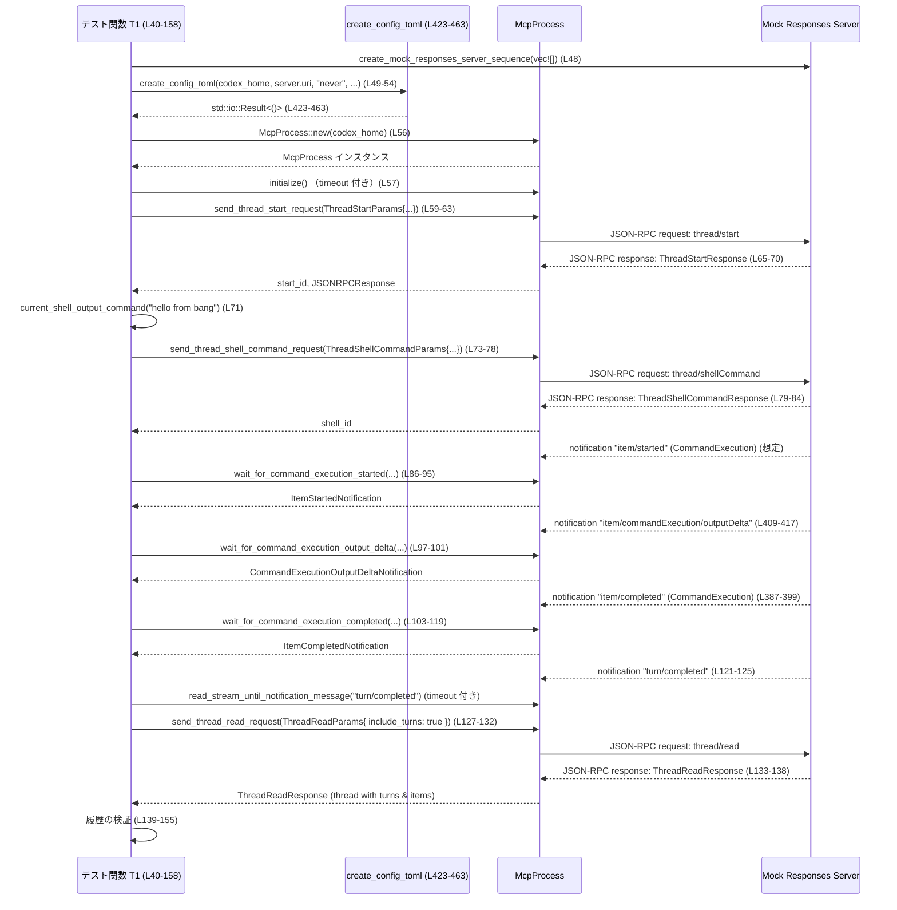

# app-server/tests/suite/v2/thread_shell_command.rs コード解説

## 0. ざっくり一言

Codex アプリサーバの「スレッド V2 + シェルコマンド」機能について、

- ユーザーのシェルコマンドがどのターンにぶら下がるか  
- 実行結果と履歴が正しく保存されるか  

を検証する統合テストと、そのためのユーティリティ関数をまとめたファイルです（thread_shell_command.rs:L38-463）。

---

## 1. このモジュールの役割

### 1.1 概要

このテストモジュールは次の問題を検証します。

- **問題**  
  - ユーザーが `threadShellCommand` を呼び出したとき、  
    - スレッドにアクティブなターンがない場合は「独立したターン」が作成されるか  
    - 既にアクティブなターンがある場合は「既存のターン」を再利用するか  
  - コマンド実行の開始・出力・完了イベントが正しく通知され、スレッド履歴に永続化されるか  
- **提供する機能**  
  - 上記振る舞いを検証する 2 つの非同期テスト（tokio ベース）（thread_shell_command.rs:L40-158, L160-325）
  - テスト用の補助ユーティリティ（通知待ちループ・設定ファイル生成など）（thread_shell_command.rs:L327-463）

### 1.2 アーキテクチャ内での位置づけ

このファイルは「テストコード」であり、本体ロジックではなく以下のコンポーネントを組み合わせて振る舞いを検証します。

- `McpProcess`（app_test_support）を通してアプリサーバプロセスと JSON-RPC/SSE で通信（thread_shell_command.rs:L56-57, L189-190）
- `codex_app_server_protocol` の型を使ってリクエスト・レスポンス・通知を表現
- `create_mock_responses_server_sequence` でモックのモデルサーバを起動（thread_shell_command.rs:L48, L181）
- `create_config_toml` でテスト用設定ファイルを生成（thread_shell_command.rs:L49-54, L182-187, L423-463）

依存関係を簡単に図示すると次のようになります。

```mermaid
graph TD
    subgraph Tests[本ファイルのテスト群 (L40-325)]
        T1["thread_shell_command_runs_as_standalone_turn... (L40-158)"]
        T2["thread_shell_command_uses_existing_active_turn (L160-325)"]
    end

    subgraph Support[テスト用ユーティリティ (L327-463)]
        C["current_shell_output_command (L327-343)"]
        W1["wait_for_command_execution_started (L345-365)"]
        W2["wait_for_command_execution_completed (L382-401)"]
        W3["wait_for_command_execution_output_delta (L404-421)"]
        CFG["create_config_toml (L423-463)"]
    end

    APP["McpProcess (app_test_support)"]
    PROTO["codex_app_server_protocol 型群"]
    SHELL["default_user_shell (codex_core::shell)"]
    FEAT["FEATURES (codex_features)"]
    MOCKS["create_mock_responses_server_sequence 他 (app_test_support)"]

    T1 --> APP
    T2 --> APP
    T1 --> C
    T2 --> C
    T1 --> W1 & W2 & W3
    T2 --> W1 & W2 & W3
    T1 --> CFG
    T2 --> CFG

    CFG --> FEAT
    C --> SHELL

    T1 --> MOCKS
    T2 --> MOCKS
    T1 & T2 --> PROTO
```

### 1.3 設計上のポイント

コードから読み取れる特徴を箇条書きで整理します。

- **非同期テスト構造**  
  - `#[tokio::test]` + `async fn` により、テスト自体が Tokio ランタイム上で非同期実行されます（thread_shell_command.rs:L40, L160）。
  - I/O 待ち（プロセスとの通信・モックサーバとの通信）は `await` を通じて実行されます。
- **タイムアウト管理**  
  - JSON-RPC レスポンスや一部の通知待ちには `tokio::time::timeout` で明示的な 10 秒タイムアウトを設定（thread_shell_command.rs:L38, L57, L65-69, L79-83, L121-125, L133-137, L190, L198-202, L217-221, L237-241, L252-256, L288-292, L303-307）。
  - 一方、`wait_for_command_execution_*` 系の通知待ちループには明示的なタイムアウトがなく、対象の通知が来るまで待ち続ける構造です（thread_shell_command.rs:L349-364, L371-379, L386-401, L408-420）。
- **エラー処理方針**  
  - テスト関数・多くのユーティリティは `anyhow::Result` を返し、`?` 演算子で I/O や JSON パースのエラーを伝播します（thread_shell_command.rs:L41, L161, L327, L345, L367, L382, L404）。
  - JSON-RPC 通知の `params` 欄が欠けている場合などは `anyhow::anyhow!` で明示的なエラーを生成しています（thread_shell_command.rs:L356-357, L393-394, L415-416）。
- **状態と履歴の検証**  
  - `ThreadStartResponse` / `ThreadReadResponse` / `ItemStartedNotification` / `ItemCompletedNotification` などプロトコル型を利用して、スレッド内のターン・アイテムの状態を詳細に検証します（thread_shell_command.rs:L70-71, L138-155, L203-204, L308-321）。
- **プラットフォーム依存のシェル挙動への配慮**  
  - `default_user_shell().name()` を基に Windows PowerShell / cmd / POSIX 系シェルで異なるコマンド文字列と期待出力を生成することで、テストをクロスプラットフォーム化しています（thread_shell_command.rs:L327-340）。
- **設定ファイル生成の共通化**  
  - `create_config_toml` がテスト毎に異なる `approval_policy` やモックサーバ URL を埋め込んだ `config.toml` を生成し、テストの前提環境を統一的に構築します（thread_shell_command.rs:L49-54, L182-187, L423-463）。

---

## 2. 主要な機能一覧

このファイルが提供する主要な「機能」（テストシナリオ + ユーティリティ）です。

- `thread_shell_command_runs_as_standalone_turn_and_persists_history`  
  : スレッドにアクティブなターンがない状態で `threadShellCommand` を実行したときの挙動と履歴永続化の検証（thread_shell_command.rs:L40-158）。
- `thread_shell_command_uses_existing_active_turn`  
  : 既にアクティブなターンが存在する状態でユーザーのシェルコマンドを送った場合、同じターン内で実行・永続化されることの検証（thread_shell_command.rs:L160-325）。
- `current_shell_output_command`  
  : 現在のユーザーシェルに応じて、テキストを 1 行出力するコマンドと期待される出力文字列を生成するユーティリティ（thread_shell_command.rs:L327-343）。
- `wait_for_command_execution_started`  
  : `item/started` 通知ストリームから、特定 ID の `CommandExecution` 開始通知を待ち受けるユーティリティ（thread_shell_command.rs:L345-365）。
- `wait_for_command_execution_started_by_source`  
  : 特定の `CommandExecutionSource`（Agent / UserShell 等）を持つ開始通知を待ち受けるユーティリティ（thread_shell_command.rs:L367-379）。
- `wait_for_command_execution_completed`  
  : `item/completed` 通知から、特定 ID の `CommandExecution` 完了通知を待ち受けるユーティリティ（thread_shell_command.rs:L382-401）。
- `wait_for_command_execution_output_delta`  
  : 特定 `item_id` の出力差分通知 (`item/commandExecution/outputDelta`) を待ち受けるユーティリティ（thread_shell_command.rs:L404-421）。
- `create_config_toml`  
  : 指定された Codex ホームディレクトリにテスト用 `config.toml` を生成するユーティリティ（thread_shell_command.rs:L423-463）。

---

## 3. 公開 API と詳細解説

このファイルはテスト用モジュールのため、外部クレートに公開される型や関数はありませんが、将来的に他のテストからも再利用されうるユーティリティ関数群として整理します。

### 3.1 型一覧（構造体・列挙体など）

本ファイル内で新たに定義されている型はありません。利用している主な外部型は次の通りです（いずれも `codex_app_server_protocol` 等からの import です）。

| 名前 | 種別 | 役割 / 用途 | 出現箇所 |
|------|------|-------------|----------|
| `ThreadStartResponse` | 構造体 | スレッド開始リクエストのレスポンス。`thread` 情報を含む | thread_shell_command.rs:L70, L203 |
| `ThreadReadResponse` | 構造体 | スレッド読み取りレスポンス。ターンとアイテムの履歴を含む | thread_shell_command.rs:L138, L308 |
| `ItemStartedNotification` | 構造体 | アイテム開始時の通知ペイロード | thread_shell_command.rs:L86, L224, L349-364 |
| `ItemCompletedNotification` | 構造体 | アイテム完了時の通知ペイロード | thread_shell_command.rs:L103, L267, L386-401 |
| `CommandExecutionOutputDeltaNotification` | 構造体 | コマンド実行の出力差分通知 | thread_shell_command.rs:L97, L404-420 |
| `ThreadItem` | 列挙体 | スレッド内のアイテム種別（CommandExecution 等） | thread_shell_command.rs:L87-92, L104-114, L140-152, L225-230, L263-276, L358-360, L373-375, L395-397 |
| `CommandExecutionSource` | 列挙体 | コマンド実行の発火元（Agent / UserShell） | thread_shell_command.rs:L94-95, L116-117, L153-154, L231, L259-261, L275-278 |
| `CommandExecutionStatus` | 列挙体 | コマンド実行の状態（InProgress / Completed 等） | thread_shell_command.rs:L95, L117-118, L142-143 |
| `ThreadStartParams` / `ThreadReadParams` / `ThreadShellCommandParams` / `TurnStartParams` | 構造体 | JSON-RPC リクエストのパラメータ | thread_shell_command.rs:L59-63, L127-131, L73-77, L206-215 |
| `JSONRPCResponse` / `ServerRequest` / `RequestId` | 列挙体/構造体 | JSON-RPC ベースのメッセージ表現 | thread_shell_command.rs:L65-69, L79-83, L133-137, L198-202, L217-221, L252-256, L237-244 |
| `McpProcess` | 構造体 | テストからアプリサーバプロセスと通信するためのラッパー | thread_shell_command.rs:L2, L56-57, L189-190, L345-347, L371-372, L382-384, L404-406, L280-286 |

### 3.2 関数詳細（最大 7 件）

ここでは重要度の高い 7 関数を詳細に解説します。

---

#### `thread_shell_command_runs_as_standalone_turn_and_persists_history() -> Result<()>`

**定義位置**: thread_shell_command.rs:L40-158  

**概要**

- スレッド開始直後（アクティブなターンが存在しない状態）に `threadShellCommand` を呼び、  
  - コマンド実行が `UserShell` ソースで開始・完了すること  
  - 結果がスレッドの単一ターンとして永続化されること  
を検証する非同期テストです（thread_shell_command.rs:L40-158）。

**引数**

- なし（テスト関数のため）。

**戻り値**

- `Result<()>` (`anyhow::Result`)  
  - 正常に全てのアサーションを通過すれば `Ok(())` を返し、  
  - I/O や JSON パースなどいずれかの処理が失敗した場合は `Err(anyhow::Error)` を返します（thread_shell_command.rs:L41, L157）。

**内部処理の流れ（アルゴリズム）**

1. **一時ディレクトリとワークスペースの用意**  
   - `TempDir::new()` で一時ディレクトリを作成し、その下に `codex_home` ディレクトリと `workspace` ディレクトリを作成します（thread_shell_command.rs:L42-46）。
2. **モックサーバと設定ファイルの準備**  
   - 応答シーケンス無しのモックサーバを起動（`create_mock_responses_server_sequence(vec![])`）（thread_shell_command.rs:L48）。  
   - `approval_policy = "never"`・空の feature フラグを持つ `config.toml` を `create_config_toml` で `codex_home` に生成します（thread_shell_command.rs:L49-54）。
3. **McpProcess の初期化**  
   - `McpProcess::new(codex_home.as_path()).await?` で Codex プロセスを起動し（thread_shell_command.rs:L56）、  
   - `timeout(DEFAULT_READ_TIMEOUT, mcp.initialize()).await??;` で初期化完了を 10 秒以内に待機します（thread_shell_command.rs:L57）。
4. **スレッド開始とシェルコマンドの準備**  
   - `ThreadStartParams { persist_extended_history: true, ..Default::default() }` でスレッドを開始し、レスポンスから `thread` を取得します（thread_shell_command.rs:L59-70）。  
   - `current_shell_output_command("hello from bang")?` で、現在のユーザーシェルに対応した「テキストを 1 行出力するコマンド」と期待出力を得ます（thread_shell_command.rs:L71）。
5. **threadShellCommand の送信とレスポンス待ち**  
   - `mcp.send_thread_shell_command_request(ThreadShellCommandParams { ... })` で、上記スレッドに対してシェルコマンドを送信し（thread_shell_command.rs:L73-77）、`ThreadShellCommandResponse` を受信・検証します（thread_shell_command.rs:L79-84）。
6. **実行開始・出力・完了の検証**  
   - `wait_for_command_execution_started(&mut mcp, None)` で `CommandExecutionSource::UserShell` かつ `CommandExecutionStatus::InProgress` な開始通知を取得し検証します（thread_shell_command.rs:L86-95）。  
   - `wait_for_command_execution_output_delta(&mut mcp, &command_id)` で出力差分を取得し、改行コードを吸収した上で期待出力と一致することを検証します（thread_shell_command.rs:L97-101）。  
   - `wait_for_command_execution_completed(&mut mcp, Some(&command_id))` で完了通知を待ち、`status == Completed`・`exit_code == Some(0)`・`aggregated_output == expected_output` を検証します（thread_shell_command.rs:L103-119）。
7. **ターン完了通知と履歴永続化の検証**  
   - `"turn/completed"` 通知を 10 秒以内に受信してターン完了を確認します（thread_shell_command.rs:L121-125）。  
   - `ThreadReadParams { include_turns: true }` でスレッド全体を読み出し、  
     - ターンが 1 つだけであること  
     - そのターン内に `CommandExecution` アイテムが 1 件存在し、`source == UserShell`・`status == Completed`・`aggregated_output == expected_output` であること  
     を検証します（thread_shell_command.rs:L127-155）。

**Examples（使用例）**

この関数自体はテストとして自動実行されますが、新しいテストから流れを真似る場合の最小例は次のようになります。

```rust
// スレッドを新規作成し、直後に threadShellCommand を送って結果を検証するテスト
#[tokio::test]
async fn my_shell_command_test() -> anyhow::Result<()> {
    // 一時環境の構築（thread_shell_command.rs:L42-46 相当）
    let tmp = TempDir::new()?;
    let codex_home = tmp.path().join("codex_home");
    std::fs::create_dir(&codex_home)?;
    let workspace = tmp.path().join("workspace");
    std::fs::create_dir(&workspace)?;

    // モックサーバと設定ファイルの準備（thread_shell_command.rs:L48-54 相当）
    let server = create_mock_responses_server_sequence(vec![]).await;
    create_config_toml(codex_home.as_path(), &server.uri(), "never", &BTreeMap::default())?;

    // MCP プロセス初期化
    let mut mcp = McpProcess::new(codex_home.as_path()).await?;
    timeout(DEFAULT_READ_TIMEOUT, mcp.initialize()).await??;

    // 以降、thread_shell_command_runs_as_standalone_turn... と同じ流れで検証
    // ...
    Ok(())
}
```

**Errors / Panics**

- `TempDir::new`, `std::fs::create_dir`, `create_config_toml`, `McpProcess::new`, `mcp.initialize` などの各ステップが失敗した場合、それぞれのエラーが `anyhow::Error` として上位に伝播します（thread_shell_command.rs:L42-57, L49-54）。
- JSON-RPC のレスポンス/通知がパースできない場合、`serde_json::from_value` がエラーとなり `?` によってテストが失敗します（thread_shell_command.rs:L70, L84, L138）。
- `wait_for_command_execution_*` 系のヘルパーは内部で `loop` を用いているため、期待する通知が永遠に届かない場合にはテストがタイムアウトせずにハングし続ける可能性があります（詳細は該当関数の節を参照してください）。

**Edge cases（エッジケース）**

- モックサーバが `item/started` / `outputDelta` / `item/completed` / `turn/completed` を送信しない場合  
  → テストは `timeout` を使用している箇所（レスポンス待ち・`turn/completed` など）で 10 秒後に失敗します（thread_shell_command.rs:L65-69, L79-83, L121-125, L133-137）。  
  → `wait_for_command_execution_*` は `timeout` なしのため、そこではハングの可能性があります。
- `current_shell_output_command` が `shlex::try_quote` で失敗した場合（非常に稀ですが）  
  → `current_shell_output_command("hello from bang")?` の `?` によりテストが即座に失敗します（thread_shell_command.rs:L71）。

**使用上の注意点**

- 各ステップで `?` により早期リターンするため、どのステップで失敗したのかを把握するにはテストランナーのエラーメッセージを参照する必要があります。
- 新しいテストを追加する場合も、`timeout(DEFAULT_READ_TIMEOUT, ...)` で外部との I/O を必ずラップすることで、テストハングを避けることが推奨されます。

---

#### `thread_shell_command_uses_existing_active_turn() -> Result<()>`

**定義位置**: thread_shell_command.rs:L160-325  

**概要**

- 既に「エージェントによるコマンド提案」が進行中のアクティブターンが存在する状況で、ユーザーが `threadShellCommand` を実行した場合に、  
  - ユーザーシェルコマンドが既存のターン (`turn.id`) 内で実行されること  
  - その結果が同じターンの履歴として永続化されること  
を検証するテストです（thread_shell_command.rs:L160-325）。

**引数**

- なし（テスト関数）。

**戻り値**

- `Result<()>` (`anyhow::Result`)

**内部処理の流れ**

1. **一時ディレクトリとモックサーバのセットアップ**  
   - Test1 と同様に `TempDir` で `codex_home`・`workspace` を作成（thread_shell_command.rs:L162-166）。  
   - `create_shell_command_sse_response(...)` と `create_final_assistant_message_sse_response("done")` を用いて、  
     - Python コマンド提案 (`"python3 -c 'print(42)'"`)  
     - 最終アシスタントメッセージ `"done"`  
     の 2 つからなる SSE レスポンスシーケンスを定義します（thread_shell_command.rs:L168-180）。  
   - `approval_policy = "untrusted"` で `config.toml` を生成します（thread_shell_command.rs:L182-187）。
2. **スレッドとアクティブターンの開始**  
   - `persist_extended_history: true` でスレッドを開始し `thread` を取得（thread_shell_command.rs:L192-203）。  
   - `current_shell_output_command("active turn bang")?` でテスト用ユーザーシェルコマンドと期待出力を生成（thread_shell_command.rs:L204）。  
   - `send_turn_start_request` で、テキスト `"run python"` と `cwd: Some(workspace.clone())` を指定してターンを開始し、`TurnStartResponse { turn }` を取得します（thread_shell_command.rs:L206-222）。
3. **エージェントによるコマンド提案の検証**  
   - `wait_for_command_execution_started(&mut mcp, Some("call-approve"))` で、事前に指定した ID `"call-approve"` の `CommandExecution` が開始されるまで待ちます（thread_shell_command.rs:L224）。  
   - その通知に含まれる `command` が `format_with_current_shell_display("python3 -c 'print(42)'")` と一致すること、`source == Agent` であることを検証します（thread_shell_command.rs:L225-235）。
4. **サーバからの承認リクエストを捕捉**  
   - `read_stream_until_request_message()` を 10 秒以内に待ち、`ServerRequest::CommandExecutionRequestApproval { request_id, .. }` であることを検証します（thread_shell_command.rs:L237-244）。  
   - この `request_id` は後で Decline 応答を返すために保持します（thread_shell_command.rs:L280-284）。
5. **ユーザーシェルコマンドの送信とターン再利用の確認**  
   - `send_thread_shell_command_request(ThreadShellCommandParams { thread_id: thread.id.clone(), command: shell_command })` でユーザーシェルコマンドを送信し、そのレスポンスを確認します（thread_shell_command.rs:L246-257）。  
   - `wait_for_command_execution_started_by_source(&mut mcp, CommandExecutionSource::UserShell)` でユーザーからのコマンド実行開始通知を待ち（thread_shell_command.rs:L259-261）、  
     - その `turn_id` が既存ターン `turn.id` と一致することを検証します（thread_shell_command.rs:L262）。  
   - 完了通知についても `wait_for_command_execution_completed` で待ち、やはり `turn_id == turn.id` であることと、`aggregated_output == expected_output` であることを確認します（thread_shell_command.rs:L267-278）。
6. **エージェント提案の Decline とターン完了**  
   - 保持しておいた `request_id` に対し、`CommandExecutionApprovalDecision::Decline` を返すレスポンスを `mcp.send_response` で送信します（thread_shell_command.rs:L280-286）。  
   - `"turn/completed"` 通知を受け取り、`TurnCompletedNotification` としてパースすることでターンの完了を確認します（thread_shell_command.rs:L287-295）。
7. **履歴永続化の確認**  
   - `ThreadReadParams { include_turns: true }` でスレッド全体を読み出し、  
     - ターンが 1 つしかないこと  
     - その中に `source == UserShell` かつ `aggregated_output == expected_output` な `CommandExecution` アイテムが存在すること  
     を `matches!` によるパターンマッチで検証します（thread_shell_command.rs:L297-321）。

**Examples（使用例）**

このテストの流れは、「アクティブターンの中でユーザーシェルコマンドを実行したい」場面の典型的な検証パターンです。新しいテストを追加する際には、次の部分を差し替えることで応用できます。

```rust
// 1. モック SSE レスポンスシーケンスの定義部分（thread_shell_command.rs:L168-180 を参考）
let responses = vec![
    create_shell_command_sse_response(
        vec!["node".into(), "-e".into(), "console.log('hi')".into()],
        None,
        Some(5000),
        "node-call",
    )?,
    create_final_assistant_message_sse_response("done")?,
];

// 2. wait_for_command_execution_started(...) で "node-call" の開始を待つ
let agent_started = wait_for_command_execution_started(&mut mcp, Some("node-call")).await?;
```

**Errors / Panics**

- Test1 と同様に、I/O や JSON パースに関するエラーは `anyhow::Result` を通じてテスト失敗として扱われます（thread_shell_command.rs:L162-190, L198-203 など）。
- `ServerRequest` が `CommandExecutionRequestApproval` 以外のバリアントであった場合、`panic!("expected approval request")` が発火します（thread_shell_command.rs:L242-244）。
- 最後に `thread.turns[0]` を参照しているため、もしスレッドがターンを一つも持っていない場合にはインデックスアクセスによりパニックします（thread_shell_command.rs:L309-321）。

**Edge cases（エッジケース）**

- エージェント提案が一切行われない（モックレスポンスの設定ミスなど）場合、`wait_for_command_execution_started(..., Some("call-approve"))` が永遠に待ち続けます（thread_shell_command.rs:L224）。
- サーバ側が `CommandExecutionRequestApproval` ではなく別のリクエストを送る場合、`panic!` が発生します（thread_shell_command.rs:L242-244）。
- `thread.turns.len() != 1` の場合（ターンが複数生成された、または 0 の場合）、`assert_eq!(thread.turns.len(), 1);` によりテストが失敗します（thread_shell_command.rs:L309）。

**使用上の注意点**

- 「ユーザーのシェルコマンドは既存ターンを再利用する」という仕様を前提にしているため、仕様変更（例えば常に新規ターンを切る）を行った場合、このテストは意図的に失敗するようになります。
- `wait_for_command_execution_started_by_source` は内部でさらに `wait_for_command_execution_started` を呼び出すため、通知順序や同時実行のテストを行う場合には「どの source の通知を先に消費するか」に注意が必要です（thread_shell_command.rs:L371-379）。

---

#### `current_shell_output_command(text: &str) -> Result<(String, String)>`

**定義位置**: thread_shell_command.rs:L327-343  

**概要**

- 現在のユーザーシェル（PowerShell / cmd / POSIX 系シェルなど）に応じて、  
  - 引数 `text` を標準出力に 1 行出力するシェルコマンド文字列  
  - 実行時に期待される出力文字列（改行コード込み）  
を返すユーティリティ関数です（thread_shell_command.rs:L327-343）。

**引数**

| 引数名 | 型 | 説明 |
|--------|----|------|
| `text` | `&str` | シェル上で 1 行出力させたい生テキスト |

**戻り値**

- `Result<(String, String)>` (`anyhow::Result`)  
  - `Ok((command, expected_output))`  
    - `command`: そのプラットフォームで `text` を 1 行出力するシェルコマンド（例: `"printf '%s\\n' 'hello'"`）  
    - `expected_output`: 実行時に得られる想定出力（改行込み）  
  - `Err(anyhow::Error)`  
    - 主に POSIX 系シェル向けの `shlex::try_quote` が失敗した場合に発生します（thread_shell_command.rs:L338）。

**内部処理の流れ**

1. `default_user_shell().name()` を呼び、現在のユーザーシェル名を取得します（thread_shell_command.rs:L328）。
2. シェル名に応じたパターンマッチを行います（thread_shell_command.rs:L329-340）。
   - `"powershell"` の場合  
     - `text` 中の `'` を `''` に置換して PowerShell の単一引用符文字列として安全にエスケープし（thread_shell_command.rs:L330），  
     - コマンド `Write-Output '{escaped_text}'` と期待出力 `{text}\r\n` を生成します（thread_shell_command.rs:L331-334）。
   - `"cmd"` の場合  
     - コマンド `echo {text}` と期待出力 `{text}\r\n` を生成します（thread_shell_command.rs:L336）。
   - それ以外（POSIX 系シェル想定）の場合  
     - `shlex::try_quote(text)?` でシェル安全な引用付き引数を生成し（thread_shell_command.rs:L338）、  
     - コマンド `printf '%s\n' {quoted_text}` と期待出力 `{text}\n` を生成します（thread_shell_command.rs:L339-340）。
3. 上記で得た `(command, expected_output)` を `Ok` で返します（thread_shell_command.rs:L342）。

**Examples（使用例）**

```rust
// text をユニットテスト中で安全にシェルに渡し、その出力を期待値と照合する例
let (cmd, expected) = current_shell_output_command("hello world")?;

// 生成されたコマンドを threadShellCommand などに渡す
let shell_id = mcp
    .send_thread_shell_command_request(ThreadShellCommandParams {
        thread_id: thread.id.clone(),
        command: cmd.clone(), // ここでは OS に応じた正しいコマンドになっている
    })
    .await?;
```

**Errors / Panics**

- POSIX 系シェルで `shlex::try_quote(text)` が失敗した場合、`?` により `current_shell_output_command` は `Err(anyhow::Error)` を返します（thread_shell_command.rs:L338）。
- その他の分岐ではパニックを発生させるコードは含まれていません。

**Edge cases**

- `text` に `'` が含まれる場合  
  - `"powershell"` ブランチでは `text.replace('\'', "''")` により安全にエスケープされます（thread_shell_command.rs:L330）。
  - POSIX ブランチでは `shlex::try_quote` が適切に処理すると想定されます。
- `text` が空文字列の場合  
  - `"powershell"` / `"cmd"` ブランチでは `Write-Output ''` や `echo` となり、空行 + 改行が出力されることが期待されます。  
  - POSIX ブランチでは `printf '%s\n' ''` のような形になり、やはり改行付きの空行が出力されます。

**使用上の注意点**

- 戻り値の `expected_output` は末尾に `\r\n` または `\n` を含むため、比較時には `trim_end_matches(['\r', '\n'])` で改行を落として比較するのが実装と整合します（thread_shell_command.rs:L98-101）。
- 実コマンドの出力と `expected_output` の改行コードが一致することがテストの前提となるため、ターゲットプラットフォームのシェル組み合わせを増やした場合は、この関数への分岐追加が必要になります。

---

#### `wait_for_command_execution_started(mcp: &mut McpProcess, expected_id: Option<&str>) -> Result<ItemStartedNotification>`

**定義位置**: thread_shell_command.rs:L345-365  

**概要**

- `McpProcess` が受信する `"item/started"` 通知ストリームから、  
  - `ThreadItem::CommandExecution` であり  
  - `expected_id` が `None` なら最初に現れたもの、`Some(id)` ならその ID に一致するもの  
を見つけるまで非同期に待ち続けるヘルパー関数です（thread_shell_command.rs:L345-365）。

**引数**

| 引数名 | 型 | 説明 |
|--------|----|------|
| `mcp` | `&mut McpProcess` | JSON-RPC 通信を行うプロセスラッパーへの可変参照 |
| `expected_id` | `Option<&str>` | 期待する `CommandExecution` ID。`None` の場合は最初に見つかったものを返す |

**戻り値**

- `Result<ItemStartedNotification>` (`anyhow::Result`)  
  - 条件を満たす `ItemStartedNotification` を見つけた場合に `Ok` で返します。  
  - JSON パースや `params` 欄欠如などにより処理が失敗した場合は `Err(anyhow::Error)` を返します。

**内部処理の流れ**

1. `loop` で無限ループを開始します（thread_shell_command.rs:L349）。
2. 毎回 `mcp.read_stream_until_notification_message("item/started").await?` を呼び出し、`"item/started"` メソッド名の通知を待ちます（thread_shell_command.rs:L350-352）。
3. 得られた通知の `params` を取り出し、存在しなければ `anyhow!("missing item/started params")` エラーとします（thread_shell_command.rs:L353-357）。
4. `serde_json::from_value` で `ItemStartedNotification` にパースします（thread_shell_command.rs:L353-357）。
5. `started.item` が `ThreadItem::CommandExecution { id, .. }` の場合だけ `id` を取り出し、それ以外のアイテムであれば `continue` して次の通知を待ちます（thread_shell_command.rs:L358-360）。
6. `expected_id` が `None` または `Some(id.as_str())` に一致する場合、現在の `started` を `Ok` で返します（thread_shell_command.rs:L361-362）。

**Examples（使用例）**

```rust
// 特定 ID の CommandExecution が開始されるまで待つ例（thread_shell_command.rs:L224 に類似）
let started = wait_for_command_execution_started(&mut mcp, Some("call-approve")).await?;
let ThreadItem::CommandExecution { id, source, .. } = &started.item else {
    unreachable!("helper returns command execution item");
};
assert_eq!(id, "call-approve");
```

**Errors / Panics**

- `notif.params` が `None` の場合  
  → `ok_or_else(|| anyhow::anyhow!("missing item/started params"))?` により `Err(anyhow::Error)` が返されます（thread_shell_command.rs:L355-357）。
- `serde_json::from_value` が失敗した場合  
  → `?` により `Err(anyhow::Error)` を返します（thread_shell_command.rs:L353-357）。
- パニックを明示的に起こすコードはこの関数内にはありません（`unreachable!` 等は呼び出し側のテストに存在）。

**Edge cases**

- `item/started` 通知のうち、`ThreadItem::CommandExecution` 以外のアイテム（例: もし他のアイテム種別が追加されるなど）が混在する場合、それらは `continue` で無視されます（thread_shell_command.rs:L358-360）。
- `expected_id` に一致する ID の通知が永遠に送られてこない場合  
  → 関数は終了せず、呼び出し元のテストはハングし続けます（thread_shell_command.rs:L349-364）。

**使用上の注意点**

- 「必ずいつか条件を満たす通知が来る」ことを前提としているため、テストケース設計の段階でモックサーバの挙動を十分に確認する必要があります。
- テストハングを防ぐためには、呼び出し元で `tokio::time::timeout` を使用してこの関数の実行時間を制限することが有用です（本ファイルではそうしていませんが、採用可能なパターンです）。

---

#### `wait_for_command_execution_completed(mcp: &mut McpProcess, expected_id: Option<&str>) -> Result<ItemCompletedNotification>`

**定義位置**: thread_shell_command.rs:L382-401  

**概要**

- `wait_for_command_execution_started` の完了版であり、`"item/completed"` 通知から  
  - `ThreadItem::CommandExecution`  
  - ID が `expected_id` に一致（または指定なしなら最初のもの）  
となる完了通知を待ち受けます（thread_shell_command.rs:L382-401）。

**引数**

| 引数名 | 型 | 説明 |
|--------|----|------|
| `mcp` | `&mut McpProcess` | 通知を受信するプロセスラッパー |
| `expected_id` | `Option<&str>` | 期待する `CommandExecution` ID |

**戻り値**

- `Result<ItemCompletedNotification>` (`anyhow::Result`)

**内部処理の流れ**

- 構造は `wait_for_command_execution_started` と同じで、メソッド名と型が異なるだけです。

1. `loop` で `"item/completed"` 通知を待つ（thread_shell_command.rs:L387-389）。
2. `params` を `ItemCompletedNotification` としてパース（thread_shell_command.rs:L390-394）。
3. `completed.item` が `ThreadItem::CommandExecution { id, .. }` でなければスキップ（thread_shell_command.rs:L395-397）。
4. `expected_id` 条件を満たす場合に `Ok(completed)` を返す（thread_shell_command.rs:L398-399）。

**Examples（使用例）**

```rust
// コマンド完了を待ち、その exit_code を検証する例（thread_shell_command.rs:L103-119 より簡略）
let completed =
    wait_for_command_execution_completed(&mut mcp, Some(&command_id)).await?;
let ThreadItem::CommandExecution { exit_code, .. } = &completed.item else {
    unreachable!("helper returns command execution item");
};
assert_eq!(*exit_code, Some(0));
```

**Errors / Panics**

- `params` 欄欠如 → `"missing item/completed params"` のメッセージで `Err(anyhow::Error)`（thread_shell_command.rs:L393-394）。
- JSON パース失敗 → `Err(anyhow::Error)`。

**Edge cases**

- `CommandExecution` 以外のアイテム完了通知が混在しても処理対象外となります（thread_shell_command.rs:L395-397）。
- 対象 ID のコマンドが永遠に完了しない場合、この関数は戻りません。

**使用上の注意点**

- 非同期完了を前提としているため、テスト設計上「確実に完了通知が来る」シナリオだけで使用するのが前提です。
- 完了通知だけでなく、補助情報（出力・exit_code・status など）も合わせて検証することで、仕様の変化を検知しやすくなります（thread_shell_command.rs:L104-119, L269-278）。

---

#### `wait_for_command_execution_output_delta(mcp: &mut McpProcess, item_id: &str) -> Result<CommandExecutionOutputDeltaNotification>`

**定義位置**: thread_shell_command.rs:L404-421  

**概要**

- `"item/commandExecution/outputDelta"` 通知から、指定した `item_id` の出力差分を持つ通知が現れるまで待ち続けるヘルパーです（thread_shell_command.rs:L404-421）。

**引数**

| 引数名 | 型 | 説明 |
|--------|----|------|
| `mcp` | `&mut McpProcess` | 通知を受信するプロセスラッパー |
| `item_id` | `&str` | 出力を監視したい `CommandExecution` の ID |

**戻り値**

- `Result<CommandExecutionOutputDeltaNotification>` (`anyhow::Result`)

**内部処理の流れ**

1. `loop` で `"item/commandExecution/outputDelta"` 通知を待つ（thread_shell_command.rs:L408-411）。
2. `params` 欄を `CommandExecutionOutputDeltaNotification` としてパース（thread_shell_command.rs:L412-416）。
3. `delta.item_id == item_id` の場合、`Ok(delta)` で返却（thread_shell_command.rs:L417-418）。  
   それ以外は次の通知待ちへ。

**Examples（使用例）**

```rust
// あるコマンドの最初の出力差分を取得し、期待出力と比較する例（thread_shell_command.rs:L97-101）
let delta = wait_for_command_execution_output_delta(&mut mcp, &command_id).await?;
assert_eq!(
    delta.delta.trim_end_matches(['\r', '\n']),
    expected_output.trim_end_matches(['\r', '\n']),
);
```

**Errors / Panics**

- `params` 欄が欠如している場合 → `"missing output delta params"` というメッセージでエラー（thread_shell_command.rs:L415-416）。
- JSON パースエラー → `Err(anyhow::Error)`。

**Edge cases**

- 同じ `item_id` の出力差分が複数回送信される場合、この関数は「最初に一致したもの」を返します。  
  追加の差分が必要な場合は複数回呼ぶか、より高度なループが必要です。
- 他の `item_id` の出力差分が多数送信されても、それらは無視されます。

**使用上の注意点**

- 出力を全量検証したい場合は、`aggregated_output` と組み合わせて使うと効率的です（thread_shell_command.rs:L104-119, L269-278）。
- ログが大量に出るコマンドに対して多数の outputDelta を発行するケースでは、テストの実行時間やログサイズに注意が必要です。

---

#### `create_config_toml(codex_home: &Path, server_uri: &str, approval_policy: &str, feature_flags: &BTreeMap<Feature, bool>) -> std::io::Result<()>`

**定義位置**: thread_shell_command.rs:L423-463  

**概要**

- テスト用の Codex 設定ファイル `config.toml` を `codex_home` 直下に生成するユーティリティです（thread_shell_command.rs:L423-463）。
- モデルプロバイダ情報や feature フラグ、シェルコマンド承認ポリシー（`approval_policy`）などを一括して書き込みます。

**引数**

| 引数名 | 型 | 説明 |
|--------|----|------|
| `codex_home` | `&Path` | `config.toml` を作成する Codex ホームディレクトリパス |
| `server_uri` | `&str` | モックモデルプロバイダのベース URL（`/v1` が付与される） |
| `approval_policy` | `&str` | シェルコマンド承認ポリシーを表す文字列（例: `"never"`, `"untrusted"`） |
| `feature_flags` | `&BTreeMap<Feature, bool>` | 有効/無効とする機能フラグのマップ |

**戻り値**

- `std::io::Result<()>`  
  - ファイル書き込みに成功すれば `Ok(())`。  
  - ディスク書き込みエラー等があれば `Err(std::io::Error)`。

**内部処理の流れ**

1. **feature フラグの TOML エントリ生成**  
   - `feature_flags.iter()` を `map` し、  
     - 各 `(feature, enabled)` について `FEATURES` 配列から `spec.id == *feature` を満たす要素を探します（thread_shell_command.rs:L429-435）。  
     - 対応する `spec.key` を取り出し、`"{key} = {enabled}"` という 1 行の TOML 設定に変換します（thread_shell_command.rs:L437）。  
     - 見つからない場合は `panic!("missing feature key for {feature:?}")` でパニックとなります（thread_shell_command.rs:L432-436）。  
   - 最終的にこれらを `\n` で結合した `feature_entries` 文字列を作成します（thread_shell_command.rs:L439-440）。
2. **`config.toml` の書き込み**  
   - `std::fs::write` により、`codex_home.join("config.toml")` に対し次のような内容を出力します（thread_shell_command.rs:L441-462）。
     - `model = "mock-model"`  
     - `approval_policy = "{approval_policy}"`  
     - `sandbox_mode = "read-only"`  
     - `model_provider = "mock_provider"`  
     - `[features]` セクションに `feature_entries` を展開  
     - `[model_providers.mock_provider]` セクションに `name` や `base_url = "{server_uri}/v1"` などを記述

**Examples（使用例）**

```rust
// テスト前に最小限の設定で config.toml を生成する例（thread_shell_command.rs:L49-54 相当）
let features = BTreeMap::new(); // 全機能をデフォルトのままにする
create_config_toml(
    codex_home.as_path(),
    &server.uri(),
    "never",    // シェルコマンドを自動承認しないポリシー
    &features,
)?;
```

**Errors / Panics**

- `feature_flags` に含まれる `Feature` が `FEATURES` 配列内に存在しない場合、`unwrap_or_else(|| panic!(...))` によりパニックが発生します（thread_shell_command.rs:L432-436）。
- `std::fs::write` が失敗した場合（パーミッション不足など）、`Err(std::io::Error)` が返されます（thread_shell_command.rs:L441-462）。

**Edge cases**

- `feature_flags` が空の場合  
  → `[features]` セクションは残りますが、その中身は空行になる可能性があります（thread_shell_command.rs:L429-440, L451-452）。  
  テストでは `BTreeMap::default()` を与えているためこのケースに該当します（thread_shell_command.rs:L53-54, L186-187）。
- `server_uri` に末尾スラッシュが含まれている場合  
  → `"{server_uri}/v1"` として追加されるため、二重スラッシュになる可能性がありますが、ここからは判断できません（thread_shell_command.rs:L456）。

**使用上の注意点**

- `codex_home` ディレクトリは事前に作成しておく必要があります（テストでは `std::fs::create_dir(&codex_home)?;` を呼んでいます: thread_shell_command.rs:L44, L164）。
- 新しい `Feature` を追加した場合は、`FEATURES` に対応するエントリを忘れずに追加しないと、この関数がパニックする可能性があります。

---

### 3.3 その他の関数

上記で詳細を説明しなかった補助関数を一覧にします。

| 関数名 | 役割（1 行） | 定義位置 |
|--------|--------------|----------|
| `wait_for_command_execution_started_by_source(mcp: &mut McpProcess, expected_source: CommandExecutionSource) -> Result<ItemStartedNotification>` | `CommandExecutionSource` でフィルタした `CommandExecution` の開始通知を待ち受けるヘルパー。内部で `wait_for_command_execution_started` を利用 | thread_shell_command.rs:L367-379 |

---

## 4. データフロー

ここでは、最初のテスト  
`thread_shell_command_runs_as_standalone_turn_and_persists_history`（L40-158）  
における代表的な処理シナリオのデータフローを示します。

### 4.1 スレッド開始〜シェルコマンド実行〜履歴永続化



このシーケンスから分かるポイント:

- **テストコード → MCP → モックサーバ** という階層で JSON-RPC メッセージが流れます。
- 実行状態変化はすべて通知 (`item/started`, `outputDelta`, `item/completed`, `turn/completed`) として MCP を経由してテストに届きます。
- テストは `wait_for_*` ヘルパーを用いて「正しい種類・条件の通知のみ」を抽出し、その内容を `ThreadItem::CommandExecution` 経由で検証しています（thread_shell_command.rs:L86-101, L103-119, L345-364, L404-418）。

---

## 5. 使い方（How to Use）

このファイルはテストコードですが、新たなテストを追加したり既存のテストを理解して変更するための「利用方法」を整理します。

### 5.1 基本的な使用方法

新しいシェルコマンド関連のテストを書く際の基本フローは、両テストに共通して次のようになります。

```rust
// 1. テスト環境の構築（thread_shell_command.rs:L42-46, L162-166）
let tmp = TempDir::new()?;
let codex_home = tmp.path().join("codex_home");
std::fs::create_dir(&codex_home)?;
let workspace = tmp.path().join("workspace");
std::fs::create_dir(&workspace)?;

// 2. モックサーバと config.toml の準備（L48-54, L168-187）
let responses = vec![/* 必要に応じて SSE モック応答を用意 */];
let server = create_mock_responses_server_sequence(responses).await;
let feature_flags = BTreeMap::new();
create_config_toml(codex_home.as_path(), &server.uri(), "untrusted", &feature_flags)?;

// 3. MCP プロセスの起動と初期化（L56-57, L189-190）
let mut mcp = McpProcess::new(codex_home.as_path()).await?;
timeout(DEFAULT_READ_TIMEOUT, mcp.initialize()).await??;

// 4. スレッド / ターン / シェルコマンドの送信（L59-63, L73-77, L206-215 など）
// 5. wait_for_* ヘルパーで通知を待ち、assert_eq! で期待結果を検証
```

### 5.2 よくある使用パターン

1. **スタンドアロンターンでのシェルコマンド実行**  
   - Test1 のように、`ThreadStartParams` でスレッドのみ開始し、まだターンが存在しない状態で `threadShellCommand` を送るパターンです（thread_shell_command.rs:L59-78）。  
   - この場合、コマンド実行とターン完了通知が「1 つのターン」として記録されることを検証しています（thread_shell_command.rs:L121-155）。

2. **アクティブターンの再利用**  
   - Test2 のように、`TurnStartParams` により明示的にターンを開始し、そのターンの中でエージェント提案とユーザーシェルコマンドを混在させるパターンです（thread_shell_command.rs:L206-215, L246-251）。  
   - `wait_for_command_execution_started_by_source` で `Agent` と `UserShell` の通知を区別して扱います（thread_shell_command.rs:L224-235, L259-262）。

3. **承認フローとの連携**  
   - `ServerRequest::CommandExecutionRequestApproval` を受信し、`CommandExecutionApprovalDecision::Decline` や今後追加されうる `Approve` を返すことにより、コマンド承認フローをテストに組み込むパターンです（thread_shell_command.rs:L237-244, L280-285）。

### 5.3 よくある間違い

```rust
// 間違い例: config.toml を用意せずに MCP プロセスを起動する
let mut mcp = McpProcess::new(codex_home.as_path()).await?; // config がないため初期化に失敗する可能性
timeout(DEFAULT_READ_TIMEOUT, mcp.initialize()).await??;

// 正しい例: 先に create_config_toml で設定ファイルを作成してから起動する
create_config_toml(
    codex_home.as_path(),
    &server.uri(),
    "never",
    &BTreeMap::default(),
)?;
let mut mcp = McpProcess::new(codex_home.as_path()).await?;
timeout(DEFAULT_READ_TIMEOUT, mcp.initialize()).await??;
```

```rust
// 間違い例: wait_for_command_execution_started を直接呼ぶが、
// モックサーバが item/started 通知を全く送らない設定になっている
let started = wait_for_command_execution_started(&mut mcp, None).await?;
// → テストがハングする可能性

// 正しい例: create_mock_responses_server_sequence で必ず item/started が送られるよう設定するか、
// もしくは tokio::time::timeout(...) で wait_for_* をラップしてタイムアウトを設ける
let started = timeout(
    DEFAULT_READ_TIMEOUT,
    wait_for_command_execution_started(&mut mcp, None),
)
.await??;
```

### 5.4 使用上の注意点（まとめ）

- **スレッド安全性**  
  - `McpProcess` は `&mut` 参照で利用されていることから、同一インスタンスを複数タスクで同時に操作する前提ではありません（thread_shell_command.rs:L56-57, L189-190, L345-347 など）。1 テスト内でシリアルに操作する設計です。
- **非同期テストのタイムアウト**  
  - 一部の通知待ち (`wait_for_*`) は `timeout` で保護されていないため、モックサーバの設定やネットワークエラーによってテストがハングするリスクがあります（thread_shell_command.rs:L349-364, L371-379, L386-401, L408-420）。
- **プラットフォーム依存の動作**  
  - `current_shell_output_command` は PowerShell / cmd / POSIX の 3 パターンのみを考慮しています（thread_shell_command.rs:L329-340）。  
    新しいシェルが `default_user_shell().name()` に追加された場合、期待出力との不整合が起きる可能性があります。
- **パニックの可能性**  
  - `create_config_toml` の `FEATURES` 検索に失敗するとパニックします（thread_shell_command.rs:L432-436）。  
  - テスト本体でも `unreachable!` や `panic!` による前提チェックがあり、プロトコル仕様の変更などでこれらが発火する可能性があります（thread_shell_command.rs:L91-92, L113-114, L151-152, L229-230, L265-266, L275-276, L243-244）。

---

## 6. 変更の仕方（How to Modify）

### 6.1 新しい機能を追加する場合（新テストの追加）

新たなシナリオ（例: 別種のシェルコマンド、異なる `approval_policy`、複数コマンド連続実行など）をテストに追加したい場合、次のステップが自然です。

1. **テスト関数の追加**  
   - 本ファイルと同様に `#[tokio::test] async fn ...() -> Result<()>` 形式でテストを定義します（thread_shell_command.rs:L40, L160 を参照）。
2. **テスト環境の初期化**  
   - `TempDir` と `create_config_toml` を用いて Codex ホーム / ワークスペース / モックサーバ設定を行います（thread_shell_command.rs:L42-54, L162-187）。
3. **MCP プロセスの起動**  
   - `McpProcess::new` と `mcp.initialize` を使用します（thread_shell_command.rs:L56-57, L189-190）。
4. **スレッド / ターン / シェルコマンドのシナリオ構築**  
   - 必要に応じて `send_thread_start_request`, `send_turn_start_request`, `send_thread_shell_command_request` を組み合わせ、シナリオを構築します（thread_shell_command.rs:L59-63, L73-77, L206-215, L246-250）。
5. **通知・レスポンス検証にヘルパーを利用**  
   - `wait_for_command_execution_*` や `wait_for_command_execution_started_by_source` を用いて通知の順序や内容を検証します（thread_shell_command.rs:L86-101, L103-119, L224-235, L259-278）。

### 6.2 既存の機能を変更する場合

- **プロトコル変更（型名・フィールド変更など）**  
  - `ThreadItem::CommandExecution` のフィールド名や `CommandExecutionSource` のバリアントが変わる場合、  
    - パターンマッチしている箇所をすべて確認・修正する必要があります（thread_shell_command.rs:L87-92, L104-114, L140-152, L225-230, L263-276, L358-360, L373-375, L395-397）。
- **シェル判定ロジックの変更**  
  - `default_user_shell().name()` の返す文字列が増える/変わる場合、`current_shell_output_command` の `match` 分岐を更新しないと、期待出力がずれる可能性があります（thread_shell_command.rs:L327-340）。
- **Feature フラグ仕様の変更**  
  - 新たな `Feature` を追加した場合、`FEATURES` に対応エントリを追加しないと `create_config_toml` でパニックが発生します（thread_shell_command.rs:L432-436）。  
  - テストで特定の機能を有効/無効にしたい場合は、`feature_flags` に値を追加する変更が必要です（本ファイルでは常に空マップ）。

変更時のチェックポイント:

- 関連する `use` 文が不要になっていないか（コンパイルエラーで検知可能）。
- ヘルパー関数のシグネチャを変更した場合、両テストおよび将来のテスト全体の呼び出し箇所を検索して影響範囲を洗い出すことが重要です。
- 非同期処理の流れ（シーケンス図で示した部分）が変化しないかどうかを意識しながら修正することで、意図しない挙動の変化を防ぎやすくなります。

---

## 7. 関連ファイル

このモジュールと密接に関係する外部ファイル・モジュールを一覧にします（ファイルパスは import から読み取れる範囲に限ります）。

| パス / モジュール | 役割 / 関係 |
|-------------------|------------|
| `app_test_support::McpProcess` | Codex アプリサーバプロセスとの JSON-RPC/SSE 通信を抽象化するテスト用ラッパー。スレッド/ターン/シェルコマンドの送信や通知受信に使用（thread_shell_command.rs:L2, L56-57, L189-190, L345-347 など）。 |
| `app_test_support::create_mock_responses_server_sequence` | モックのモデルプロバイダ HTTP サーバを起動し、事前定義した SSE 応答シーケンスを返すユーティリティ（thread_shell_command.rs:L4, L48, L181）。 |
| `app_test_support::create_shell_command_sse_response` | エージェントによるシェルコマンド提案を表す SSE レスポンスを生成するユーティリティ。Test2 のモックレスポンス作成に使用（thread_shell_command.rs:L5, L168-178）。 |
| `app_test_support::create_final_assistant_message_sse_response` | 最終アシスタントメッセージを返す SSE レスポンス生成ユーティリティ。Test2 で使用（thread_shell_command.rs:L3, L179）。 |
| `app_test_support::format_with_current_shell_display` | シェルコマンドを現在のシェルに応じて表示用文字列に整形するユーティリティ。エージェント提案コマンドの検証に使用（thread_shell_command.rs:L6, L232-235）。 |
| `app_test_support::to_response` | JSONRPCResponse を型付きレスポンス (`ThreadStartResponse`, `ThreadReadResponse` 等) に変換するヘルパー（thread_shell_command.rs:L7, L70, L84, L138, L203, L222, L257, L308）。 |
| `codex_app_server_protocol` | 各種プロトコル型（Thread/Turn/Item/Notification/Request/Response など）を提供し、本テストでのメッセージ構造の定義元となる（thread_shell_command.rs:L8-27, L13-15 など）。 |
| `codex_core::shell::default_user_shell` | デフォルトユーザーシェル情報を取得する関数。`current_shell_output_command` で使用（thread_shell_command.rs:L29, L328）。 |
| `codex_features::{FEATURES, Feature}` | 利用可能な機能とそのメタ情報を保持する定義。`create_config_toml` で TOML の `[features]` セクションを生成するために使用（thread_shell_command.rs:L30-31, L432-437）。 |

以上が、このテストモジュールの構造・振る舞い・利用方法の整理です。
