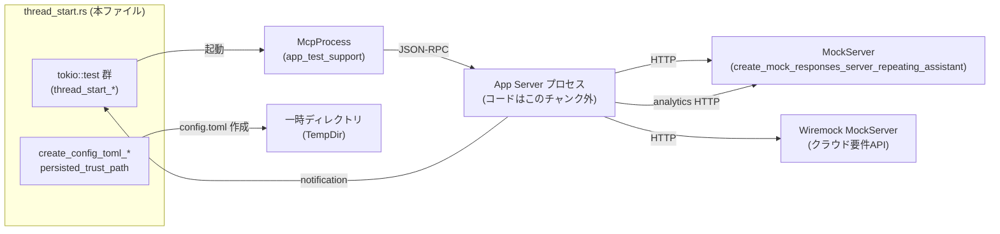
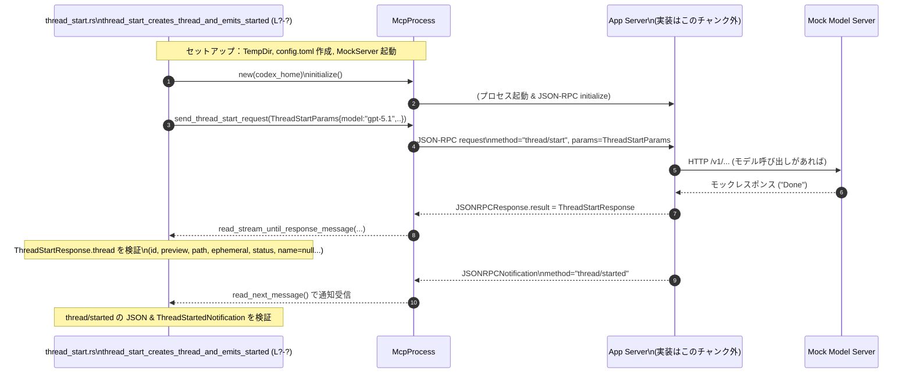

# app-server/tests/suite/v2/thread_start.rs

## 0. ざっくり一言

`v2/thread_start` JSON-RPC API の振る舞い（スレッド作成・エラー・MCP ステータス・クラウド要件・サンドボックス／信頼プロジェクト・アナリティクス等）を、統合テストとして検証するモジュールです。

---

## 1. このモジュールの役割

### 1.1 概要

- このモジュールは **アプリケーションサーバーの v2 thread/start エンドポイント**が、
  - スレッド情報を正しく返すこと
  - 必要な通知・アナリティクス・エラー情報を送ること
  - 設定ファイル・プロジェクト設定・サンドボックス／信頼設定に従うこと
- を保証するための **統合テスト群**を提供します。

### 1.2 アーキテクチャ内での位置づけ

`McpProcess`（テスト用クライアント）を通じてアプリケーションサーバープロセスに JSON-RPC で接続し、HTTP モックサーバー（モデルバックエンド・クラウド要件 API）と連携して動作を検証しています。



※ APP（アプリケーションサーバー）の実装はこのチャンクには現れないため、不明です。McpProcess の内部実装も不明ですが、JSON-RPC クライアントとして振る舞うことがインターフェースから分かります（`send_thread_start_request`, `read_stream_until_response_message` など）。

### 1.3 設計上のポイント

- **責務の分離**
  - 各 `#[tokio::test]` は 1 つの契約（Contract）/シナリオに対応しており、挙動を細かく分割して検証しています（スレッド作成、アナリティクス、MCP エラー、クラウド設定エラー、信頼書き込みなど）。
  - 共通のセットアップ（`config.toml` の生成、MCP サーバー設定）は複数のヘルパー関数に切り出されています（`create_config_toml_*` 系・`persisted_trust_path`）。
- **状態管理**
  - テストごとに `TempDir` を使い、`codex_home` やワークスペース／リポジトリを分離しており、テスト間で状態が干渉しない構造になっています。
  - プロジェクトの「信頼」状態は `config.toml` に書き込まれ、その内容をテストで直接検証しています。
- **エラーハンドリング**
  - 各テスト関数は `anyhow::Result<()>` を返し、`?` 演算子で I/O や JSON-RPC 呼び出しの失敗をテスト失敗として扱います。
  - JSON-RPC エラーについては `JSONRPCError` を明示的に受け取り、`message` や `data` の内容まで検証しています。
- **非同期・並行性**
  - すべてのテストは `#[tokio::test]` の非同期テストとして実行され、`tokio::time::timeout` を多用して **ハング防止（タイムアウト）** を行っています。
  - JSON-RPC 通知を受け取るループでは、タイムアウト＋条件付きフィルタで期待する通知だけを待つようにしています。

---

## 2. 主要な機能一覧

このモジュールの「機能」は主に「何をテストしているか」に対応します。

- スレッド作成と通知:
  - 新規スレッド作成 (`thread/start`) による `ThreadStartResponse` の内容と `thread/started` 通知の検証
- アナリティクス:
  - `thread_start_tracks_thread_initialized_analytics`: スレッド初期化イベントの送信
  - `thread_start_does_not_track_thread_initialized_analytics_without_feature`: feature フラグ無効時にイベントを送らない
- プロジェクト設定と推論モード:
  - `thread_start_respects_project_config_from_cwd`: `cwd` から `.codex/config.toml` を読み、`model_reasoning_effort` を反映
- サービスティア／メトリクス:
  - `thread_start_accepts_flex_service_tier`: `ServiceTier::Flex` を受け取り、そのまま返す
  - `thread_start_accepts_metrics_service_name`: `service_name` を受け取り、スレッドが正常に作成される
- エフェメラルスレッド:
  - `thread_start_ephemeral_remains_pathless`: `ephemeral: true` なスレッドは `path` を持たない
- MCP サーバーの初期化エラー:
  - `thread_start_fails_when_required_mcp_server_fails_to_initialize`: 必須 MCP サーバーが壊れている場合にエラーを返す
  - `thread_start_emits_mcp_server_status_updated_notifications`: 任意 MCP サーバーの起動状態通知 (`McpServerStatusUpdatedNotification`) の検証
- クラウド要件読み込みエラー:
  - `thread_start_surfaces_cloud_requirements_load_errors`: 401 と `refresh_token_invalidated` を、JSON-RPC エラー `data` にマッピング
- サンドボックス・プロジェクト信頼:
  - `thread_start_with_elevated_sandbox_trusts_project_and_followup_loads_project_config`:
    - `SandboxMode::WorkspaceWrite` でスレッドを開始するとプロジェクトを信頼し、
    - 追って `cwd` を指定したスレッド開始で `.codex/config.toml` が適用される
  - `thread_start_with_nested_git_cwd_trusts_repo_root`:
    - `cwd` が Git リポジトリ配下の場合、信頼はリポジトリ root 単位で保存される
  - `thread_start_with_read_only_sandbox_does_not_persist_project_trust`:
    - Read-only サンドボックスでは信頼情報を書き込まない
  - `thread_start_skips_trust_write_when_project_is_already_trusted`:
    - 既に信頼済みのプロジェクトでは信頼設定を書き換えず、既存 `config.toml` を維持
- Config ヘルパー:
  - `create_config_toml_*`: テスト用 `config.toml` を生成
  - `persisted_trust_path`: 信頼設定に保存するパスを OS ごとに正規化
  - `broken_mcp_transport_toml`: テスト用「失敗する MCP サーバー」起動コマンドを OS 別に生成

---

## 3. 公開 API と詳細解説

このファイル自身は公開 API を定義していませんが、「テストを通じて外部 API に課している契約」が実質的な公開 API となっています。

### 3.1 型一覧（構造体・列挙体など）

このモジュール内で定義はしていませんが、頻出の外部型とその利用目的を整理します。  
行番号情報はこのチャンクから取得できないため `L?-?` と表記します。

| 名前 | 種別 | 役割 / 用途 | 根拠 |
|------|------|-------------|------|
| `McpProcess` | 構造体（外部 crate） | アプリサーバーとの JSON-RPC 通信を抽象化したテスト用クライアント。`new`, `new_with_env`, `initialize`, `send_thread_start_request`, `read_stream_until_response_message` などを提供。 | thread_start.rs:L?-?（複数テストで使用） |
| `ThreadStartParams` | 構造体 | `thread/start` リクエストのパラメータ。`model`, `cwd`, `ephemeral`, `sandbox`, `service_tier`, `service_name` などを指定可能。 | thread_start.rs:L?-? |
| `ThreadStartResponse` | 構造体 | `thread/start` の JSON-RPC result を構造化した型。`thread`, `model_provider`, `reasoning_effort`, `approval_policy`, `service_tier` 等を含む。 | thread_start.rs:L?-? |
| `ThreadStatus` | 列挙体 | スレッドの状態（例: `Idle`）。`thread_start_creates_thread_and_emits_started` で新規スレッドが `Idle` であることを検証。 | thread_start.rs:L?-? |
| `ThreadStartedNotification` | 構造体 | `thread/started` 通知のペイロード。新規スレッド開始時の完全なスレッド情報を含む。 | thread_start.rs:L?-? |
| `ThreadStatusChangedNotification` | 構造体 | `thread/status/changed` 通知のペイロード。スレッド状態が変化したときに送られる。新規スレッドでは `thread/started` より前に来てはいけない、という契約を検証。 | thread_start.rs:L?-? |
| `JSONRPCResponse` | 構造体 | JSON-RPC レスポンス全体。`result` を `serde_json::Value` として持ち、`to_response::<ThreadStartResponse>` で型付けされたレスポンスに変換。 | thread_start.rs:L?-? |
| `JSONRPCError` | 構造体 | JSON-RPC エラー応答。`error.message` や `error.data` を検査して、サーバーが期待通りエラー情報を返しているか検証。 | thread_start.rs:L?-? |
| `ServerNotification` | 列挙体 | サーバーからの通知を総称する enum。ここでは `McpServerStatusUpdated` バリアントにパターンマッチして MCP ステータス更新を検証。 | thread_start.rs:L?-? |
| `McpServerStatusUpdatedNotification` | 構造体 | `mcpServer/startupStatus/updated` 通知のペイロード。`name`, `status`, `error` を持つ。 | thread_start.rs:L?-? |
| `McpServerStartupState` | 列挙体 | MCP サーバーの起動状態。テストでは `Starting` / `Failed` を検証。 | thread_start.rs:L?-? |
| `SandboxMode` | 列挙体 | サンドボックスモード。`WorkspaceWrite` や `"read-only"`（config.toml 内の文字列表記）など。プロジェクト信頼の扱いに影響。 | thread_start.rs:L?-? |
| `AskForApproval` | 列挙体 | アクションの承認ポリシー。ここでは `OnRequest` を期待値として検証し、プロジェクト設定の読み込み結果を見ています。 | thread_start.rs:L?-? |
| `ServiceTier` | 列挙体 | サービスティア。`Flex` を設定・検証。 | thread_start.rs:L?-? |
| `ReasoningEffort` | 列挙体 | モデルの推論負荷レベル。`High` が `.codex/config.toml` から反映されることを検証。 | thread_start.rs:L?-? |
| `TrustLevel` | 列挙体 | プロジェクトの信頼レベル。`TrustLevel::Trusted` を設定し、`set_project_trust_level` を通じて永続化。 | thread_start.rs:L?-? |

※ 各型の完全な定義や他バリアントはこのチャンクには現れないため不明です。

### 3.2 関数詳細（最大 7 件）

行番号は不明のため `L?-?` としています。

---

#### `thread_start_creates_thread_and_emits_started() -> Result<()>`

**概要**

- `thread/start` が新しいスレッドを作成し、
  - レスポンスで完全なスレッド情報を返すこと
  - その後 `thread/started` 通知を送ること
- さらに、スレッドの JSON シリアライズ形式（`name: null`, `ephemeral: false` など）と、通知順序に関する契約（`thread/status/changed` が先に来てはいけない）を検証するテストです。  
  根拠: thread_start.rs:L?-? （`thread_start_creates_thread_and_emits_started` 定義と中のアサーション）

**引数**

- 引数は取りません（`#[tokio::test]` で直接実行される）。

**戻り値**

- `anyhow::Result<()>`
  - 途中の I/O・JSON-RPC・デシリアライズ・アサーションに失敗した場合は `Err` を返し、テスト全体が失敗します。

**内部処理の流れ（アルゴリズム）**

1. モデルレスポンス用モックサーバーを起動  
   `create_mock_responses_server_repeating_assistant("Done").await` で Wiremock サーバーを構築。
2. テスト用 `codex_home` ディレクトリを `TempDir` で作成し、`create_config_toml_without_approval_policy` で最小限の `config.toml` を生成。
3. `McpProcess::new` でサーバープロセスを起動し、`mcp.initialize()` を `timeout(DEFAULT_READ_TIMEOUT, ...)` 付きで実行。
4. `ThreadStartParams { model: Some("gpt-5.1".to_string()), ..Default::default() }` を送信して `thread/start` リクエストを発行。
5. 対応する `JSONRPCResponse` を `read_stream_until_response_message` で待ち受け、`to_response::<ThreadStartResponse>` で型に変換。
6. `ThreadStartResponse` の `thread` フィールドについて以下を検証:
   - `id` が空でない
   - `preview` が空文字列
   - `model_provider == "mock_provider"`
   - `created_at > 0`
   - `ephemeral == false`
   - `status == ThreadStatus::Idle`
   - `path` は `Some` であり、絶対パスだがまだファイルは存在しない
7. 生の JSON (`resp.result`) から `thread` オブジェクトを取り出し、シリアライズ契約を検証:
   - `name == null`
   - `ephemeral == false`
   - Rust 側の `thread.name` は `None` である
8. 通知ループ:
   - `timeout` 付きで `mcp.read_next_message()` を繰り返し、`JSONRPCMessage::Notification` のみ処理。
   - もし `thread/status/changed` 通知が新しい `thread.id` に対して届いた場合は `anyhow::bail!` でテスト失敗（`thread/start` では `thread/started` より前に対応する `thread/status/changed` があってはならない、という契約）。
   - `thread/started` 通知が来たらループを抜ける。
9. `thread/started` 通知の JSON 表現についても
   - `name == null`
   - `ephemeral == false`
   を確認し、`ThreadStartedNotification` にデシリアライズして `started.thread == thread` を検証。

**Examples（使用例）**

このテストはそのまま「`thread/start` を正しく使うクライアント実装例」としても機能します。簡略版を示します。

```rust
// モデルサーバーと config を準備
let server = create_mock_responses_server_repeating_assistant("Done").await;
let codex_home = TempDir::new()?;
create_config_toml_without_approval_policy(codex_home.path(), &server.uri())?;

// MCP プロセスを起動して初期化
let mut mcp = McpProcess::new(codex_home.path()).await?;
timeout(DEFAULT_READ_TIMEOUT, mcp.initialize()).await??;

// thread/start を送信
let req_id = mcp
    .send_thread_start_request(ThreadStartParams {
        model: Some("gpt-5.1".to_string()),
        ..Default::default()
    })
    .await?;

// レスポンスを受信してスレッド情報を取得
let resp: JSONRPCResponse = timeout(
    DEFAULT_READ_TIMEOUT,
    mcp.read_stream_until_response_message(RequestId::Integer(req_id)),
)
.await??;
let ThreadStartResponse { thread, .. } = to_response::<ThreadStartResponse>(resp)?;

// thread/started 通知を待つ
let notif = timeout(
    DEFAULT_READ_TIMEOUT,
    mcp.read_stream_until_matching_notification("thread/started", |n| {
        n.method == "thread/started"
    }),
)
.await??;
```

**Errors / Panics**

- ネットワークやサーバー起動、JSON デシリアライズでエラーが発生すると `Err(anyhow::Error)` が返ります。
- 明示的な `panic!` 呼び出しはなく、テスト失敗時は `anyhow::bail!` により `Err` で終了します。
- `timeout` で期限切れになると `tokio::time::error::Elapsed` が返り、`?` によりテストが失敗します。

**Edge cases（エッジケース）**

- スレッド ID が空、`created_at <= 0`、`status != Idle` など、仕様に反するレスポンスは即座にテスト失敗となります。
- `thread/status/changed` が新スレッドに対して `thread/started` 前に届いた場合、通知順序違反として失敗します。
- 通知が全く届かない場合、`timeout` によるタイムアウトで失敗します。

**使用上の注意点**

- クライアント側で `thread/start` を実装する際も、**必ずレスポンスだけでなく `thread/started` 通知を待つ**必要があることを示しています。
- JSON を直接扱う場合でも、`name` が `null` で送られることを前提にクライアントを設計できます（このテストがその契約を守らせています）。

---

#### `thread_start_emits_mcp_server_status_updated_notifications() -> Result<()>`

**概要**

- 任意（optional）な MCP サーバーが壊れている構成で `thread/start` を呼んだ際に、
  - リクエスト自体は成功する
  - しかし MCP サーバーの起動状態について
    - `status = "starting"`
    - `status = "failed"`
  - の 2 種類の `mcpServer/startupStatus/updated` 通知が届き、内容が期待どおりであることを検証するテストです。  
  根拠: thread_start.rs:L?-?（`thread_start_emits_mcp_server_status_updated_notifications`）

**内部処理の流れ（要約）**

1. モックモデルサーバーと `codex_home` を準備。
2. `create_config_toml_with_optional_broken_mcp` で、`mcp_servers.optional_broken` を含む `config.toml` を生成。`broken_mcp_transport_toml` によって必ず `exit 1` で失敗するコマンドが設定されます。
3. `McpProcess` を起動して初期化し、`ThreadStartParams::default()` で `thread/start` を実行。
4. レスポンス (`ThreadStartResponse`) が正常に得られることを確認。
5. `mcp.read_stream_until_matching_notification` で
   - `name == "optional_broken"`
   - `status == "starting"`
   を満たす `mcpServer/startupStatus/updated` 通知を待ち受け、`ServerNotification::McpServerStatusUpdated` バリアントに変換して
   `McpServerStartupState::Starting` であることを確認。
6. 同様に
   - `name == "optional_broken"`
   - `status == "failed"`
   の通知を待ち受け、`status == Failed` かつ `error` に `"MCP client for`optional_broken`failed to start"` が含まれることを検証。

**Errors / Edge cases**

- MCP サーバーの起動が成功してしまう／通知が送られない場合は、`timeout` で失敗します。
- 通知の `name` / `status` / `error` が期待と異なる場合は `assert_eq!` / `assert!` が失敗します。

**使用上の注意点**

- クライアントは、thread/start 成功後も **別途 MCP サーバーの状態通知を監視する必要がある** ことが、このテストから読み取れます。
- optional MCP サーバーが失敗しても thread/start 自体は成功し得る、という仕様です。

---

#### `thread_start_surfaces_cloud_requirements_load_errors() -> Result<()>`

**概要**

- クラウド要件 API（`/backend-api/wham/config/requirements`）が 401 を返し、
- かつリフレッシュトークンの更新 API（`/oauth/token`）も 401 かつ `refresh_token_invalidated` になる場合に、
- サーバーが `thread/start` の `JSONRPCError` に詳細な `data` を埋め込むことを検証します。  
  根拠: thread_start.rs:L?-?

**内部処理の流れ**

1. Wiremock の `MockServer` を起動し、以下を設定:
   - `GET /backend-api/wham/config/requirements` → 401, HTML body
   - `POST /oauth/token` → 401, JSON body `{ "error": { "code": "refresh_token_invalidated" } }`
2. 別途、モデルレスポンス用のモックサーバーを起動。
3. `create_config_toml_with_chatgpt_base_url` で
   - `chatgpt_base_url = "{mockserver_uri}/backend-api"`
   - `general_analytics` は false
   の `config.toml` を生成。
4. `write_chatgpt_auth` で ChatGPT 用の認証情報（`refresh_token` が "stale-refresh-token"）を `AuthCredentialsStoreMode::File` で保存。
5. 環境変数に
   - `OPENAI_API_KEY = None`
   - `REFRESH_TOKEN_URL_OVERRIDE_ENV_VAR = "<mockserver>/oauth/token"`
   を設定した上で `McpProcess::new_with_env` でサーバーを起動し、`initialize`。
6. `thread_start` を呼び、`JSONRPCError` を受け取る。
7. `error.message` に `"failed to load configuration"` が含まれることを検証。
8. `error.data` が次の JSON と完全一致することを検証:

   ```json
   {
     "reason": "cloudRequirements",
     "errorCode": "Auth",
     "action": "relogin",
     "statusCode": 401,
     "detail": "Your access token could not be refreshed because your refresh token was revoked. Please log out and sign in again."
   }
   ```

**Errors / Edge cases**

- クラウド API が 401 以外を返した場合の扱いはこのチャンクには現れません。
- `error.data` が `None` または異なるキーを持つ場合、テストは失敗します。
- `OPENAI_API_KEY` を None にしている点から、クラウド側の認証に refresh token のみを使う経路を検証していると考えられますが、詳細なフローはこのチャンクからは分かりません。

**使用上の注意点**

- クライアントは `JSONRPCError.data` を見て、`action: "relogin"` のようなリカバリー手順をユーザーに提示できる設計が期待されています。
- 401 エラーを単に「失敗」とするのでなく、より具体的な理由 (`cloudRequirements` / `Auth` / `relogin`) にマッピングしていることが、このテストで保証されています。

---

#### `thread_start_with_elevated_sandbox_trusts_project_and_followup_loads_project_config() -> Result<()>`

**概要**

- 最初の `thread/start` で `sandbox: Some(SandboxMode::WorkspaceWrite)` と `cwd` を指定するとプロジェクトが「信頼済み」として永続化され、
- 2 回目以降の `thread/start`（`sandbox` 指定なし）では `.codex/config.toml` のプロジェクト設定が適用される、というフローを検証するテストです。  
  根拠: thread_start.rs:L?-?

**内部処理の流れ**

1. モデルモックサーバーと `codex_home` を作成し、`create_config_toml_without_approval_policy` で基礎 config を作成。
2. `workspace` 用の `TempDir` を作成し、その直下に `.codex/config.toml` を作成して

   ```toml
   model_reasoning_effort = "high"
   ```

   を書き込み。
3. `McpProcess` を起動して初期化。
4. 最初の `thread/start`:
   - `ThreadStartParams { cwd: Some(workspace_path), sandbox: Some(SandboxMode::WorkspaceWrite), .. }`
   - レスポンス内容は使用しないが、この呼び出しによってプロジェクト信頼が永続化される前提。
5. 2 回目の `thread/start`:
   - `ThreadStartParams { cwd: Some(workspace_path), .. }`（sandbox 指定なし）
   - レスポンスを `ThreadStartResponse` に変換し、
     - `approval_policy == AskForApproval::OnRequest`
     - `reasoning_effort == Some(ReasoningEffort::High)`
     を確認。
6. `codex_home/config.toml` を読み取り、`resolve_root_git_project_for_trust` で求めた `trusted_root` のパスを `persisted_trust_path`（後述）で正規化した文字列が含まれていること、および `trust_level = "trusted"` が含まれていることを検証。

**使用上の注意点**

- `SandboxMode::WorkspaceWrite` は副作用として **プロジェクトを信頼済みに書き込む** ことが期待されていることが、このテストから分かります。
- 信頼されたプロジェクトは、以降のスレッドで `approval_policy` や `.codex/config.toml` の設定（ここでは `model_reasoning_effort`）を反映して扱われます。

---

#### `thread_start_with_nested_git_cwd_trusts_repo_root() -> Result<()>`

**概要**

- `cwd` が Git リポジトリ配下（`<repo_root>/nested/project`）である場合の `SandboxMode::WorkspaceWrite` による信頼永続化が、
  - `nested` ディレクトリではなくリポジトリ root（`.git` ディレクトリのある場所）に対して行われることを確認するテストです。  
  根拠: thread_start.rs:L?-?

**内部処理の流れ**

1. `repo_root` を `TempDir` で作成し、`repo_root/.git` ディレクトリを作成。
2. `nested = repo_root/nested/project` ディレクトリを作成。
3. モデルモックサーバーと `codex_home` を準備し、`create_config_toml_without_approval_policy` で config を生成。
4. `McpProcess` を起動して初期化。
5. `thread/start` を

   ```rust
   ThreadStartParams {
       cwd: Some(nested.to_string_lossy().into_owned()),
       sandbox: Some(SandboxMode::WorkspaceWrite),
       ..Default::default()
   }
   ```

   で実行。
6. `codex_home/config.toml` を読み込み、
   - `resolve_root_git_project_for_trust(&nested)` で求めた `trusted_root` に対する `persisted_trust_path(&trusted_root)` が含まれていること
   - `persisted_trust_path(&nested)` は含まれていないこと
   を検証。

**使用上の注意点**

- 信頼のキーとして **リポジトリ root** を使うこと（サブディレクトリではない）が仕様として固定されていることが分かります。
- クライアント側でも「プロジェクト単位」ではなく「リポジトリ単位」で信頼を扱うべきである、という前提があると解釈できます（ただしクライアント実装はこのチャンクにはありません）。

---

#### `persisted_trust_path(project_path: &Path) -> String`

**概要**

- プロジェクト信頼を `config.toml` に文字列として保存する際に、OS ごとの特殊パス（特に Windows の `\\?\` プレフィックスや UNC パス）を正規化する関数です。  
  根拠: thread_start.rs:L?-?

**引数**

| 引数名 | 型 | 説明 |
|--------|----|------|
| `project_path` | `&Path` | 信頼対象プロジェクトのディレクトリパス |

**戻り値**

- `String`: `config.toml` に書き込むための正規化済みパス文字列。

**内部処理の流れ**

1. `std::fs::canonicalize(project_path)` を試みる。失敗した場合は元の `project_path` を使用。
2. 得られたパスを `display().to_string()` で文字列化。
3. 文字列が `r"\\?\UNC\"` で始まる場合:
   - プレフィックスを取り除き、先頭に `\\` を付けて `\\server\share\path` 形式にする。

   ```rust
   if let Some(project_path) = project_path.strip_prefix(r"\\?\UNC\") {
       return format!(r"\\{project_path}");
   }
   ```

4. それ以外の場合:
   - プレフィックス `r"\\?\"` を取り除く（Windows のデバイスパス）:

   ```rust
   project_path
       .strip_prefix(r"\\?\")
       .unwrap_or(&project_path)
       .to_string()
   ```

**Edge cases**

- `canonicalize` に失敗した場合でも `unwrap_or_else(|_| project_path.to_path_buf())` により元のパスで続行されるため、パス解決エラーでパニックしません。
- 非 Windows 環境では `r"\\?\..."` プレフィックスが現れないのが通常であり、その場合は文字列変換のみ行われます。

**使用上の注意点**

- この関数は Windows 固有のパス表記を扱うため、クロスプラットフォームに信頼設定を保存するのに利用されています。
- ここでの正規化仕様（`\\?\UNC\`→`\\` など）は、外部にとっても契約になります。信頼設定ファイルを直接編集するツールがある場合、この仕様に従う必要があります。

---

#### `create_config_toml_with_required_broken_mcp(codex_home: &Path, server_uri: &str) -> std::io::Result<()>`

**概要**

- `mcp_servers.required_broken` という必須 MCP サーバーが存在し、必ず起動に失敗する構成の `config.toml` を `codex_home` 直下に生成するヘルパーです。  
  根拠: thread_start.rs:L?-?

**引数**

| 引数名 | 型 | 説明 |
|--------|----|------|
| `codex_home` | `&Path` | `config.toml` を出力するディレクトリ |
| `server_uri` | `&str` | モデルモックサーバーのベース URI（`model_providers.mock_provider.base_url` に埋め込む） |

**戻り値**

- `std::io::Result<()>`: ファイル書き込みに失敗した場合は `Err`。

**内部処理の流れ**

1. `codex_home.join("config.toml")` に TOML 文字列を書き込み。
2. 書き込まれる主な設定:

   ```toml
   model = "mock-model"
   approval_policy = "never"
   sandbox_mode = "read-only"

   model_provider = "mock_provider"

   [model_providers.mock_provider]
   name = "Mock provider for test"
   base_url = "{server_uri}/v1"
   wire_api = "responses"
   request_max_retries = 0
   stream_max_retries = 0

   [mcp_servers.required_broken]
   {required_broken_transport}
   required = true
   ```

3. `{required_broken_transport}` は `broken_mcp_transport_toml()` の返すテキストで、OS に応じてコマンドが異なる:
   - Windows: `command = "cmd", args = ["/C", "exit 1"]`
   - 非 Windows: `command = "/bin/sh", args = ["-c", "exit 1"]`

**使用上の注意点**

- このヘルパーは **「必ず起動に失敗する MCP サーバー」** を意図しているため、他のテストで流用する際には注意が必要です。
- `thread_start_fails_when_required_mcp_server_fails_to_initialize` によって、この設定がある場合 `thread/start` がエラーを返すことが契約として固定されています。

---

#### `thread_start_fails_when_required_mcp_server_fails_to_initialize() -> Result<()>`

**概要**

- 上記 `create_config_toml_with_required_broken_mcp` を用いて、必須 MCP サーバーが起動に失敗した場合に `thread/start` が JSON-RPC エラーを返し、そのメッセージが具体的な内容を含むことを検証します。  
  根拠: thread_start.rs:L?-?

**内部処理の流れ（要点）**

1. モデルモックサーバーと `codex_home` を用意。
2. `create_config_toml_with_required_broken_mcp` で config を生成。
3. `McpProcess` を起動・初期化。
4. `thread/start` を `ThreadStartParams::default()` で送信。
5. `mcp.read_stream_until_error_message` で `JSONRPCError` を取得。
6. `err.error.message` が
   - `"required MCP servers failed to initialize"`
   - `"required_broken"`
   の両方を含むことを `assert!` で確認。

**使用上の注意点**

- サーバーは **必須 MCP サーバーの起動失敗を致命的エラーとし、thread/start を失敗させる** ことが、このテストで固定されています。
- エラーメッセージには失敗した MCP 名を含めることが期待されています。

---

### 3.3 その他の関数

ここまでで詳細説明していないテスト／ヘルパーを一覧でまとめます。

| 関数名 | 役割（1 行） | 根拠 |
|--------|--------------|------|
| `thread_start_tracks_thread_initialized_analytics` | `thread/start` 実行時に thread_initialized アナリティクスイベントが 1 件送信され、その内容が `assert_basic_thread_initialized_event` で検証される。 | thread_start.rs:L?-? |
| `thread_start_does_not_track_thread_initialized_analytics_without_feature` | feature フラグ `general_analytics` が false の場合、アナリティクスイベントが送信されないことを確認。 | thread_start.rs:L?-? |
| `thread_start_respects_project_config_from_cwd` | `cwd` から `.codex/config.toml` を読み込み、`model_reasoning_effort = "high"` が `ThreadStartResponse.reasoning_effort` に反映されることを検証。 | thread_start.rs:L?-? |
| `thread_start_accepts_flex_service_tier` | `ThreadStartParams.service_tier = Some(Some(ServiceTier::Flex))` を指定すると、レスポンス `service_tier` も `Some(Flex)` になることを確認。 | thread_start.rs:L?-? |
| `thread_start_accepts_metrics_service_name` | `ThreadStartParams.service_name` を与えてもスレッド作成が成功することを確認（具体的な反映先はこのチャンクからは不明）。 | thread_start.rs:L?-? |
| `thread_start_ephemeral_remains_pathless` | `ephemeral: Some(true)` で開始したスレッドでは `thread.ephemeral == true` かつ `thread.path == None` であり、JSON でも `ephemeral: true` とシリアライズされることを検証。 | thread_start.rs:L?-? |
| `thread_start_with_read_only_sandbox_does_not_persist_project_trust` | read-only サンドボックスで `cwd` を指定して `thread/start` しても `config.toml` に信頼情報が書き込まれないことを確認。 | thread_start.rs:L?-? |
| `thread_start_skips_trust_write_when_project_is_already_trusted` | 既に `set_project_trust_level` 済みのプロジェクトに対して `WorkspaceWrite` で `thread/start` しても `config.toml` が変更されないことを確認。 | thread_start.rs:L?-? |
| `create_config_toml_without_approval_policy` | `approval_policy` を省略した基本的な `config.toml` を生成するヘルパー。実装は `create_config_toml_with_optional_approval_policy` のラッパー。 | thread_start.rs:L?-? |
| `create_config_toml_with_optional_approval_policy` | `approval_policy` 有無を引数で制御しつつ `config.toml` を生成するヘルパー。 | thread_start.rs:L?-? |
| `create_config_toml_with_chatgpt_base_url` | `chatgpt_base_url`, `[features]` セクション, `general_analytics` フラグを含む `config.toml` を生成。 | thread_start.rs:L?-? |
| `create_config_toml_with_optional_broken_mcp` | `mcp_servers.optional_broken` エントリを含む `config.toml` を生成し、任意 MCP が失敗する構成を作る。 | thread_start.rs:L?-? |
| `broken_mcp_transport_toml` (cfg windows) | Windows 用の失敗コマンド (`cmd /C "exit 1"`) を TOML 文字列として返す。 | thread_start.rs:L?-? |
| `broken_mcp_transport_toml` (cfg not windows) | 非 Windows 用の失敗コマンド (`/bin/sh -c "exit 1"`) を返す。 | thread_start.rs:L?-? |

---

## 4. データフロー

代表的なシナリオとして、`thread_start_creates_thread_and_emits_started` におけるデータフローを示します。

### 概要

1. テストコードがモックサーバーと `config.toml` を準備し、`McpProcess` を初期化。
2. `ThreadStartParams` を JSON-RPC リクエストとしてサーバーに送信。
3. サーバーが `ThreadStartResponse` を JSON-RPC レスポンスとして返し、新スレッドを内部的に生成。
4. その後、サーバーから `thread/started` 通知がクライアントに送信される。
5. テストはレスポンスと通知の両方を検証し、仕様を固定します。



このシーケンス図から分かるように、**レスポンスと通知の両方が thread/start の契約の一部**であることが強調されています。

---

## 5. 使い方（How to Use）

このモジュールはテストですが、`McpProcess` と `ThreadStartParams` を使った **クライアントコードの実例**としても読めます。

### 5.1 基本的な使用方法

thread/start API の最小限の利用フローは以下のように整理できます。

```rust
use app_test_support::McpProcess;
use codex_app_server_protocol::{ThreadStartParams, RequestId, JSONRPCResponse, ThreadStartResponse};
use tokio::time::timeout;

// 設定やモックサーバーを準備する（実際のアプリでは本物の config.toml / URL を使用）
let codex_home = TempDir::new()?;
// ... config.toml を書く

// MCP クライアントを初期化
let mut mcp = McpProcess::new(codex_home.path()).await?;
timeout(DEFAULT_READ_TIMEOUT, mcp.initialize()).await??;

// thread/start を送信
let req_id = mcp
    .send_thread_start_request(ThreadStartParams::default())
    .await?;

// レスポンスを待つ
let resp: JSONRPCResponse = timeout(
    DEFAULT_READ_TIMEOUT,
    mcp.read_stream_until_response_message(RequestId::Integer(req_id)),
)
.await??;

// 型付きレスポンスに変換
let ThreadStartResponse { thread, .. } = to_response::<ThreadStartResponse>(resp)?;

// 必要に応じて thread/started 通知も待つ（テストでは通知順序も検証している）
```

### 5.2 よくある使用パターン

- **モデル／サービスティアのオーバーライド**

  ```rust
  let params = ThreadStartParams {
      model: Some("gpt-5.1".to_string()),
      service_tier: Some(Some(ServiceTier::Flex)),
      ..Default::default()
  };
  ```

  `thread_start_accepts_flex_service_tier` が、この指定がレスポンスにも反映されることを保証しています。

- **プロジェクトごとの設定適用**

  ```rust
  let params = ThreadStartParams {
      cwd: Some("/path/to/workspace".to_string()),
      ..Default::default()
  };
  ```

  `.codex/config.toml` の `model_reasoning_effort` などが `ThreadStartResponse.reasoning_effort` に反映されることが `thread_start_respects_project_config_from_cwd` で保証されています。

- **エフェメラルスレッド**

  ```rust
  let params = ThreadStartParams {
      ephemeral: Some(true),
      ..Default::default()
  };
  ```

  `thread_start_ephemeral_remains_pathless` により、この場合 `thread.path == None` であることが契約として固定されています。

### 5.3 よくある間違い

テストから推測できる「誤用と正しい使い方」の一例です。

```rust
// 誤り例: thread/start のレスポンスだけを使い、通知を無視する
let resp: JSONRPCResponse = mcp.read_stream_until_response_message(...).await??;
let ThreadStartResponse { thread, .. } = to_response::<ThreadStartResponse>(resp)?;
// ここで thread.id を使い始めるが、thread/started 通知を待たない

// 正しい例: レスポンスに加え、thread/started 通知を待つ
let resp: JSONRPCResponse = mcp.read_stream_until_response_message(...).await??;
let ThreadStartResponse { thread, .. } = to_response::<ThreadStartResponse>(resp)?;

// その後、thread/started 通知を待つ
let started_notif = timeout(
    DEFAULT_READ_TIMEOUT,
    mcp.read_stream_until_matching_notification("thread/started", |notification| {
        notification.method == "thread/started"
        // ここで notification.params から thread_id をチェックしてもよい
    }),
).await??;
```

`thread_start_creates_thread_and_emits_started` は「`thread/status/changed` が先に来てはならない」という条件まで検証しており、通知順序が重要であることを示しています。

### 5.4 使用上の注意点（まとめ）

- **エラー処理**
  - `JSONRPCError` を受け取った場合は `error.message` だけでなく `error.data` も確認することで、クラウド認証エラーなどの詳細な復旧指示を取得できます（`thread_start_surfaces_cloud_requirements_load_errors`）。
  - MCP サーバーに関するエラーは、必須 (`required = true`) の場合は `thread/start` 自体の失敗として扱われ、任意の場合は通知でのみ伝達されます。
- **非同期・タイムアウト**
  - `tokio::time::timeout` を活用し、サーバーやネットワークの問題で無限待ちにならないようにするのが前提になっています。
- **プロジェクト信頼とサンドボックス**
  - `WorkspaceWrite` サンドボックスは、副作用としてプロジェクト信頼の永続化を行います。
  - 既に信頼済みの場合、`thread_start_skips_trust_write_when_project_is_already_trusted` が示すように、不要な書き換えは行われない前提です。
  - Read-only サンドボックスでは信頼は書き込まれません。

---

## 6. 変更の仕方（How to Modify）

### 6.1 新しい機能を追加する場合

このモジュールに新しいテストを追加する典型的なステップは次のとおりです。

1. **シナリオの特定**
   - 例: thread/start に新しいパラメータが追加された、通知の形式が増えた、など。
2. **config／環境の準備**
   - 既存の `create_config_toml_*` を再利用して、必要な設定を持つ `config.toml` を生成する。
   - 必要であれば、新しいヘルパー（例: 新しい MCP サーバー設定）を追加する。
3. **テスト関数の追加**
   - `#[tokio::test] async fn thread_start_*() -> Result<()>` の形で定義し、既存テストと同様に:
     - `TempDir` で `codex_home` を準備
     - `McpProcess::new` / `initialize`
     - `send_thread_start_request` でリクエスト送信
     - JSON-RPC レスポンス／通知を検証
4. **契約の明文化**
   - 新しく保証したい仕様（例: フィールドの初期値、通知の順序、エラーコードなど）を `assert_*` で明示的に書き、テスト名にも表現する。

### 6.2 既存の機能を変更する場合

thread/start の仕様変更に伴いテストを修正する場合は、以下の点に注意します。

- **影響範囲の確認**
  - 同じ契約を検証している他のテストがないか確認（例: `approval_policy`, `reasoning_effort`, `ephemeral` などは複数テストで参照されます）。
  - MCP／クラウド要件／信頼設定など、複数テストにまたがる振る舞いを変更する場合は、関連テストの期待値をすべて見直す必要があります。
- **契約の再定義**
  - 例えば「新規スレッドの `name` を `null` ではなく空文字列にする」といった変更を行う場合、それを前提としているクライアントが壊れないかを検討し、このテストのアサーションを変更するか、新旧両方を許容するテストを用意するか検討が必要です。
- **config フォーマットの変更**
  - `config.toml` のキー名／構造を変更する場合、`create_config_toml_*` 系のヘルパーの出力と、それを読み取っているサーバー側実装の両方に影響するため注意が必要です。

---

## 7. 関連ファイル

このモジュールと密接に関係するファイル／コンポーネントを列挙します。実体はこのチャンクには現れないものも含みます。

| パス / モジュール | 役割 / 関係 |
|-------------------|------------|
| `app-server/tests/suite/v2/analytics.rs`（推定） | `super::analytics::*` としてインポートされているテスト用アナリティクスヘルパー。thread_initialized イベントの検証に使用。 |
| `app_test_support::McpProcess` | アプリサーバープロセスを起動し、JSON-RPC でやり取りするテスト用クライアント。 |
| `app_test_support::create_mock_responses_server_repeating_assistant` | モデルプロバイダ API を模倣する Wiremock サーバーを起動し、指定メッセージを返し続けるためのヘルパー。 |
| `codex_app_server_protocol::*` | thread/start に関するリクエスト／レスポンス／通知の型定義。`ThreadStartParams`, `ThreadStartResponse`, `ThreadStartedNotification` など。 |
| `codex_core::config::set_project_trust_level` | プロジェクト信頼レベルを `config.toml` に書き込む関数。テストでは事前に信頼済みにするために利用。 |
| `codex_git_utils::resolve_root_git_project_for_trust` | `cwd` から Git リポジトリ root を解決するユーティリティ。信頼のキーとしてどのパスが使われるかを決定。 |
| `codex_login::REFRESH_TOKEN_URL_OVERRIDE_ENV_VAR` | クラウド認証用の refresh token URL を環境変数経由で上書きするためのキー。 |
| `wiremock::MockServer` / `Mock` / `ResponseTemplate` | HTTP モックサーバー実装。モデルバックエンドやクラウド要件 API のレスポンスをテスト用に制御。 |

---

### Bugs / Security / Contracts / Edge Cases について

- **Bugs**:
  - このチャンクから明らかになるバグは特に見当たりません。テストは主に仕様を固定する役割を果たしています。
- **Security**:
  - クラウド認証エラーの扱い（`thread_start_surfaces_cloud_requirements_load_errors`）において、ユーザー向けに具体的かつ安全なメッセージ（再ログインを促す）を返す契約がテストで保証されています。
  - プロジェクト信頼は Git リポジトリ root 単位で扱われ、パス正規化（`persisted_trust_path`）も行われているため、パス表記揺れや Windows 特殊パスによる誤判定を抑制しています。
- **Contracts / Edge Cases**:
  - 新規スレッドの JSON 表現 (`name: null`, `ephemeral: false`, `status: "idle"`, path の存在条件) が一貫して検証されています。
  - `ephemeral` スレッドはファイルパスを持たないことが明示的な契約です。
  - 必須 MCP／任意 MCP／クラウド要件／サンドボックス／既存信頼など、多数のエッジケースに対する挙動がテストで固定されています。
- **Performance / Scalability**:
  - このモジュールはテストコードであり、パフォーマンスやスケーラビリティの観点はこのチャンクからは特に読み取れません（負荷テストではなく機能テストです）。
