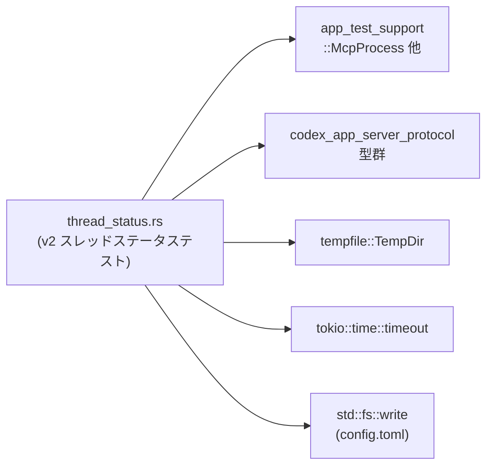
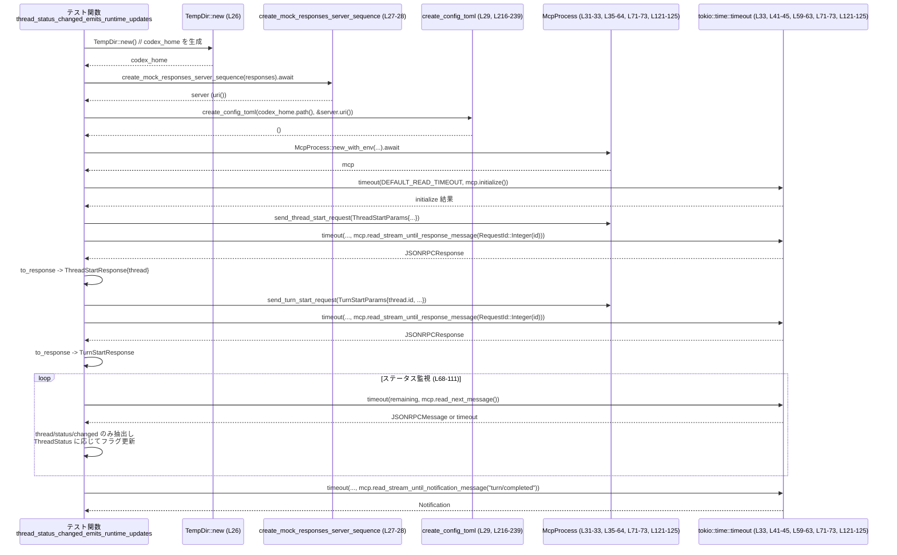

# app-server/tests/suite/v2/thread_status.rs

## 0. ざっくり一言

このファイルは、v2 プロトコルの `thread/status/changed` JSON‑RPC 通知の挙動を検証する統合テストと、そのための `config.toml` 生成ヘルパー関数を定義しています（app-server/tests/suite/v2/thread_status.rs:L24-214, L216-240）。

---

## 1. このモジュールの役割

### 1.1 概要

- このモジュールは **スレッド状態通知まわりの契約** を検証するためのテストを提供します。
  - ランタイムから `thread/status/changed` 通知が送られること、およびステータスの遷移パターンを検証するテスト（`thread_status_changed_emits_runtime_updates`）（L24-128）。
  - クライアントが `opt_out_notification_methods` で `thread/status/changed` を明示的に拒否した場合に、その通知が届かないことを検証するテスト（`thread_status_changed_can_be_opted_out`）（L130-214）。
- テスト実行用の一時ホームディレクトリと `config.toml` を `TempDir` と `create_config_toml` で構築し、`McpProcess` を介して JSON‑RPC ベースのサーバーとやり取りします（L26-33, L132-138, L216-239）。

### 1.2 アーキテクチャ内での位置づけ

このファイルは「テストコード」であり、本体サーバーの API に対する統合テストとして振る舞います。依存関係は以下の通りです（L1-20, L24-240）。



- `app_test_support`  
  - `McpProcess` や `create_mock_responses_server_sequence` など、テスト用ヘルパーを提供します（L2-5, L27-32, L137-138）。
- `codex_app_server_protocol`  
  - JSON‑RPC メッセージ (`JSONRPCMessage`, `JSONRPCNotification`, `JSONRPCResponse`) と、スレッド操作関連の型 (`ThreadStartParams`, `ThreadStartResponse`, `ThreadStatus`, `ThreadStatusChangedNotification`, `TurnStartParams`, `TurnStartResponse`, `ClientInfo`, `InitializeCapabilities`, `RequestId`, `UserInput`) を提供します（L6-18）。
- `tempfile::TempDir`  
  - テスト用ホームディレクトリ (`codex_home`) のライフサイクル管理に使われます（L26, L132）。
- `tokio::time::timeout`  
  - すべての非同期 I/O 操作をタイムアウト付きで実行し、テストのハングを防ぎます（L33, L41-45, L59-63, L71-73, L121-125, L138-152, L163-167, L181-185, L188-192, L194-198）。

### 1.3 設計上のポイント

- **一時ディレクトリと設定ファイルの分離**
  - 各テストは `TempDir::new()` で専用ディレクトリを作り、その中に `create_config_toml` で `config.toml` を生成します（L26-29, L132-135, L216-239）。  
    他のテストや実環境と設定が混ざらない設計です。
- **エラーハンドリングの方針**
  - テスト関数は `anyhow::Result<()>` を返し、`?` や `??` で I/O やタイムアウトのエラーをそのままテスト失敗として伝播します（L25, L33, L40-46, L58-64, L71-73, L121-125, L131, L152-153, L162-168, L180-187, L188-192, L198-211）。
- **非同期・並行性**
  - 1 つ目のテストは `#[tokio::test(flavor = "multi_thread", worker_threads = 4)]` でマルチスレッドランタイム上で動作し、JSON‑RPC 通知のストリームを監視します（L24, L68-73）。
  - 2 つ目のテストはデフォルトの `#[tokio::test]` で、同様に非同期 I/O を使います（L130-131）。
- **通知フィルタリングロジックの明示**
  - `thread/status/changed` 通知のみを `JSONRPCMessage` から抽出し、`thread_id` と `ThreadStatus` に基づいてフラグを更新するループが明示的に書かれています（L69-106）。
- **負のテスト（通知が来ないことの検証）**
  - `tokio::time::timeout` を短い 500ms に設定し、`thread/status/changed` が届かないことを逆の条件で検証するロジックが含まれます（L194-211）。

---

## 2. コンポーネント一覧（関数・定数）

このファイル内で定義されている主なコンポーネントです。

| 名前 | 種別 | 役割 / 用途 | 定義位置 |
|------|------|-------------|----------|
| `DEFAULT_READ_TIMEOUT` | 定数 (`std::time::Duration`) | 各種 read/initialize 操作の標準タイムアウト（10 秒） | app-server/tests/suite/v2/thread_status.rs:L22 |
| `thread_status_changed_emits_runtime_updates` | 非公開 async 関数（`#[tokio::test]` テスト） | ランタイムが `thread/status/changed` 通知を送り、`Active` → （`Idle` / `SystemError` / `NotLoaded`）へ遷移することを検証する | L24-128 |
| `thread_status_changed_can_be_opted_out` | 非公開 async 関数（`#[tokio::test]` テスト） | クライアントが `opt_out_notification_methods` に `thread/status/changed` を指定した場合、通知が届かないことを検証する | L130-214 |
| `create_config_toml` | 非公開関数 | テストで使用する `config.toml` を指定ディレクトリに書き出す | L216-240 |

※ このファイル自体には `pub` な型や関数はなく、実際の公開 API は `codex_app_server_protocol` や `app_test_support` 側に存在します（L1-20）。

---

## 3. 公開 API と詳細解説

### 3.1 型一覧（構造体・列挙体など）

このファイル内で新たな型定義はありませんが、テストで重要な外部型を整理します（すべて定義は別クレートにあります）。

| 名前 | 種別 | 役割 / 用途 | 参照位置 |
|------|------|-------------|----------|
| `McpProcess` | 構造体（推定・テストサポート用） | サーバーとの JSON‑RPC ベースの対話（initialize / request / notification 読み取り）を抽象化する | L2, L31-33, L35-41, L48-63, L71-73, L121-125, L137-138, L157-167, L170-185, L188-192, L194-198 |
| `JSONRPCMessage` | 列挙体 | JSON‑RPC メッセージ（Request / Response / Notification）を表現する | L8, L75-80, L153 |
| `JSONRPCNotification` | 構造体 | `JSONRPCMessage::Notification` のラッパー。`method` 名と `params` を保持する | L9, L76-79 |
| `JSONRPCResponse` | 構造体 | JSON‑RPC レスポンスメッセージ | L10, L41, L59, L163, L181 |
| `ThreadStartParams` / `ThreadStartResponse` | 構造体 | スレッド開始リクエストのパラメータと応答。応答からは `thread.id` を取得する | L12-13, L35-40, L46, L157-162, L168 |
| `TurnStartParams` / `TurnStartResponse` | 構造体 | ターン開始リクエストのパラメータと応答 | L16-17, L48-57, L64, L170-179, L186 |
| `ThreadStatus` | 列挙体 | スレッドの状態 (`Active`, `Idle`, `SystemError`, `NotLoaded` など) | L14, L84-103 |
| `ThreadStatusChangedNotification` | 構造体 | `thread/status/changed` 通知のペイロード（`thread_id`, `status` など） | L15, L80-82 |
| `ClientInfo`, `InitializeCapabilities` | 構造体 | `initialize_with_capabilities` 呼び出し時のクライアント情報と拡張機能 | L6-7, L140-149 |
| `V2UserInput` (`UserInput` の別名) | 列挙体 | ユーザー入力（ここでは Text 型のみ利用） | L18, L51-54, L173-176 |
| `RequestId` | 列挙体 | JSON‑RPC リクエスト ID。ここでは整数 ID を使用 | L11, L43, L61, L165, L183 |

> これらの型の内部定義はこのチャンクには存在しないため、詳細は不明です。

### 3.2 関数詳細

#### `thread_status_changed_emits_runtime_updates() -> anyhow::Result<()>`

**概要**

- v2 プロトコルのスレッドに対して 1 回のターンを実行し、その間に `thread/status/changed` 通知が
  - 少なくとも 1 回 `ThreadStatus::Active { .. }` を含み（`saw_active_running`）、  
  - その後 `ThreadStatus::Idle` / `SystemError` / `NotLoaded` のいずれかに遷移する（`saw_idle_after_turn`）
  ことを検証するテストです（L66-103, L113-120）。

**引数**

- なし（`#[tokio::test(flavor = "multi_thread", worker_threads = 4)]` によりテストとして実行されます）（L24-25）。

**戻り値**

- `anyhow::Result<()>`  
  - セットアップや JSON‑RPC 通信、アサーションが成功した場合は `Ok(())` を返し、いずれかでエラーが起きた場合は `Err` を返してテストを失敗にします（L25, L33, L40-46, L58-64, L71-73, L121-125, L127）。

**内部処理の流れ**

1. **テスト環境の構築**（L26-33）
   - 一時ディレクトリ `codex_home` を作成（`TempDir::new()?`）（L26）。
   - `create_final_assistant_message_sse_response("done")?` により 1 つだけレスポンスを返すモック用レスポンスリストを作成（L27）。
   - `create_mock_responses_server_sequence(responses).await` でモック応答サーバー（`server`）を起動し、URI を取得（L27-28）。
   - `create_config_toml(codex_home.path(), &server.uri())?` で `codex_home/config.toml` を書き出し、モックサーバーの `base_url` などを設定（L29, L216-239）。
   - `McpProcess::new_with_env(..., &[("RUST_LOG", Some("info"))])` で MCP プロセスを起動し、`RUST_LOG=info` を設定（L31-32）。
   - `timeout(DEFAULT_READ_TIMEOUT, mcp.initialize()).await??;` により、初期化をタイムアウト付きで待機し、失敗や遅延をエラーとして扱う（L33）。

2. **スレッド開始とレスポンス取得**（L35-46）
   - `send_thread_start_request(ThreadStartParams { model: Some("mock-model".to_string()), ..Default::default() })` を送信し、リクエスト ID を取得（L35-40）。
   - `timeout(DEFAULT_READ_TIMEOUT, mcp.read_stream_until_response_message(RequestId::Integer(thread_start_id)))` で該当レスポンスまでストリームを読み続ける（L41-44）。
   - `to_response` で `ThreadStartResponse` にデシリアライズし、`thread.id` を取り出す（L45-46）。

3. **ターン開始とレスポンス取得**（L48-64）
   - `send_turn_start_request` を用いて、同じ `thread_id` に対して Text 入力 `"collect status updates"` を送信（L48-57）。
   - `timeout(..., mcp.read_stream_until_response_message(RequestId::Integer(turn_start_id)))` でターン開始レスポンスを待機（L59-63）。
   - `to_response` により `TurnStartResponse` としてパースする（L64）。

4. **ステータス通知の監視ループ**（L66-111）
   - フラグ `saw_active_running` と `saw_idle_after_turn` を `false` で初期化（L66-67）。
   - `deadline = Instant::now() + DEFAULT_READ_TIMEOUT` を設定し、その時刻まで `while` ループでメッセージを読み続ける（L68-69）。
   - ループ内で、残り時間 `remaining` を計算しつつ `timeout(remaining, mcp.read_next_message())` を呼び出し、次の JSON‑RPC メッセージを取得（L70-73）。
   - メッセージが `JSONRPCMessage::Notification(JSONRPCNotification { method, params: Some(params) })` かつ `method == "thread/status/changed"` の場合（L75-79）:
     - `serde_json::from_value(params)?` で `ThreadStatusChangedNotification` にデシリアライズ（L80）。
     - `notification.thread_id != thread.id` の場合は別スレッド向けとみなし `continue` でスキップ（L81-82）。
     - `notification.status` に応じてマッチ（L84-103）:
       - `ThreadStatus::Active { .. }` の場合 `saw_active_running = true`（L85-87）。
       - `ThreadStatus::Idle` / `SystemError` / `NotLoaded` の場合、すでに `saw_active_running` が `true` なら `saw_idle_after_turn = true` にする（L88-101）。
   - 条件に一致しないメッセージ (`_`) は無視（L105）。
   - 各イテレーションの最後で `if saw_active_running && saw_idle_after_turn { break; }` により、両フラグが立ったら早期終了（L108-110）。

5. **アサーションとターン完了の確認**（L113-127）
   - `assert!(saw_active_running, "...")` で、少なくとも 1 通の Active ステータスを受信したことを検証（L113-116）。
   - `assert!(saw_idle_after_turn, "...")` で、Active の後に Idle／SystemError／NotLoaded のいずれかが来たことを検証（L117-120）。
   - 最後に `timeout(..., mcp.read_stream_until_notification_message("turn/completed"))` により `turn/completed` 通知を受信し、ターンが終わったことを確認（L121-125）。

**Examples（使用例）**

この関数自体はテストエントリポイントなので、直接呼び出すのではなく `cargo test` から実行されます。  
同様のパターンで通知を検証するテストを追加する場合のひな形は次のようになります（既存コードの簡略版です）。

```rust
#[tokio::test] // 実際には multi_thread など必要に応じて指定
async fn my_notification_test() -> anyhow::Result<()> {
    // 一時ホームディレクトリとモックサーバの構築（L26-29, L132-135 に対応）
    let codex_home = TempDir::new()?; // 一時ディレクトリを作成
    let responses = vec![create_final_assistant_message_sse_response("done")?]; // モック応答
    let server = create_mock_responses_server_sequence(responses).await; // モックサーバ起動
    create_config_toml(codex_home.path(), &server.uri())?; // config.toml を書き出し

    // MCP プロセスの起動と initialize（L31-33, L137-152 に対応）
    let mut mcp = McpProcess::new(codex_home.path()).await?; // プロセス起動
    timeout(DEFAULT_READ_TIMEOUT, mcp.initialize()).await??; // 初期化をタイムアウト付きで待機

    // ここから先は必要なリクエスト・通知の検証ロジックを書く
    // ...

    Ok(())
}
```

**Errors / Panics**

- `?` / `??` により、以下の条件で `Err` が返り、テストが失敗します。
  - 一時ディレクトリの作成失敗（`TempDir::new()`）（L26）。
  - モックサーバー作成関連のエラー（`create_final_assistant_message_sse_response`, `create_mock_responses_server_sequence`）（L27-28）。
  - `config.toml` 書き込み時の I/O エラー（`create_config_toml` 内の `std::fs::write`）（L29, L216-239）。
  - MCP プロセス起動や `initialize`、`send_*_request`、`read_*` 系メソッドのエラー（L31-33, L35-46, L48-64, L71-73, L121-125）。
  - `tokio::time::timeout` によるタイムアウト（外側の `Result` が `Err(Elapsed)` になり、1 回目の `?` で伝播）（L33, L41-45, L59-63, L71-73, L121-125）。
  - `serde_json::from_value` による JSON デシリアライズの失敗（L80）。
- `assert!` により条件が満たされない場合には標準のパニックが発生します（L113-120）。

**Edge cases（エッジケース）**

- **通知が一切届かない（または別スレッドのみ）場合**  
  - ループ終了時に `saw_active_running` と `saw_idle_after_turn` が `false` のままとなり、`assert!` によりテストは失敗します（L69-73, L113-120）。
- **`Active` 以外のステータスしか来ない場合**  
  - `ThreadStatus::Idle` / `SystemError` / `NotLoaded` を受け取っても、`saw_active_running` が `true` になる前であれば `saw_idle_after_turn` は更新されません（L84-101）。  
    結果として `saw_active_running` が `false` のままになり、テストは失敗します。
- **`Active` が複数回、`Idle` なども複数回来る場合**  
  - 最初の `Active` で `saw_active_running` が `true` になり、その後の `Idle` / `SystemError` / `NotLoaded` のいずれかで `saw_idle_after_turn` が `true` になります。両方が `true` になった時点でループを抜けます（L85-90, L93-101, L108-110）。
- **他のメソッドの通知やレスポンスが混在する場合**  
  - `method == "thread/status/changed"` 以外の通知、あるいはレスポンスなどは `match` の `_` パターンで無視されます（L75-79, L105）。

**使用上の注意点**

- このテストは `DEFAULT_READ_TIMEOUT`（10 秒）以内に期待する通知が届くことを前提にしています。長時間かかるシナリオには対応していません（L22, L68-73）。
- `ThreadStatus::SystemError` と `ThreadStatus::NotLoaded` も「アクティブ状態からの終端状態」として `saw_idle_after_turn` を `true` にします。そのため「正常終了のみを検証したい」ケースとは少し異なる振る舞いです（L93-101, L117-120）。
- `ThreadStatusChangedNotification` の `thread_id` が現在のスレッドと一致しない通知は無視されます（L81-82）。複数スレッドのテストを追加する場合、この前提を意識する必要があります。

---

#### `thread_status_changed_can_be_opted_out() -> anyhow::Result<()>`

**概要**

- クライアントが `initialize_with_capabilities` の `InitializeCapabilities.opt_out_notification_methods` に `"thread/status/changed"` を指定した場合に、その通知が届かない（少なくとも 500ms 以内には届かない）ことを検証するテストです（L138-152, L194-211）。

**引数**

- なし（`#[tokio::test]` によりテストとして実行されます）（L130-131）。

**戻り値**

- `anyhow::Result<()>`（L131, L213-214）。
  - セットアップ・通信・検証が成功した場合 `Ok(())`、いずれかでエラーが起きた場合 `Err` になります。

**内部処理の流れ**

1. **テスト環境の構築**（L132-138）
   - 1 つ目のテストと同様に `TempDir::new`、`create_final_assistant_message_sse_response`、`create_mock_responses_server_sequence`、`create_config_toml` でテスト環境を構築（L132-135）。
   - `McpProcess::new(codex_home.path()).await?` で MCP プロセスを起動（L137）。

2. **capabilities 付き initialize**（L138-155）
   - `timeout(DEFAULT_READ_TIMEOUT, mcp.initialize_with_capabilities(...))` を呼び出し、次の情報を送信（L138-151）。
     - `ClientInfo`（`name`, `title`, `version`）（L141-145）。
     - `InitializeCapabilities`（`experimental_api: true`, `opt_out_notification_methods: Some(vec!["thread/status/changed".to_string()])`）（L146-149）。
   - 得られた `JSONRPCMessage` が `JSONRPCMessage::Response(_)` であることをパターンマッチで確認し、それ以外なら `anyhow::bail!` でエラーにします（L152-155）。

3. **スレッドとターンの実行**（L157-187）
   - `send_thread_start_request` ～ `read_stream_until_response_message` ～ `to_response` の流れで `ThreadStartResponse` を取得し、`thread.id` を得る（L157-168）。
   - `send_turn_start_request` ～ `read_stream_until_response_message` ～ `to_response` の流れでターンを開始し、レスポンスを取得（L170-186）。
   - `timeout(..., mcp.read_stream_until_notification_message("turn/completed"))` でターン完了通知を受信する（L188-192）。

4. **スレッドステータス通知が「来ない」ことの検証**（L194-211）
   - `timeout(Duration::from_millis(500), mcp.read_stream_until_notification_message("thread/status/changed")).await` を実行し、`thread/status/changed` 通知を最大 500ms 待機（L194-198）。
   - 戻り値（`status_update`）は `Result< Result<JSONRPCMessage, _>, tokio::time::error::Elapsed>` 形式とみなされており、`match` で次のように分岐（L199-211）。
     - `Err(_)`（外側の `Result` が `Err`）: タイムアウトしたことを意味し、このテストにとっては「期待通り」なので何もしない（L200）。
     - `Ok(Ok(notification))`（通知を受信できた）:
       - `anyhow::bail!("thread/status/changed should be filtered ...")` で、「通知が届いてしまった」としてエラーにする（L201-205）。
     - `Ok(Err(err))`（通知読み取り処理が別のエラーで失敗した）:
       - `anyhow::bail!("expected timeout ... got: {err}")` で「タイムアウトではなく別のエラー」という理由でエラーにする（L206-210）。

**Examples（使用例）**

この関数もテストエントリポイントです。`opt_out_notification_methods` を使うパターンの参考として、initialize 呼び出し部分だけを抽出すると以下のようになります（L138-152）。

```rust
let message = timeout(
    DEFAULT_READ_TIMEOUT,
    mcp.initialize_with_capabilities(
        ClientInfo {
            name: "codex_vscode".to_string(),                   // クライアント名
            title: Some("Codex VS Code Extension".to_string()), // 表示名
            version: "0.1.0".to_string(),                       // バージョン
        },
        Some(InitializeCapabilities {
            experimental_api: true,                             // 実験的 API を有効化
            opt_out_notification_methods: Some(vec![
                "thread/status/changed".to_string(),            // この通知を受け取りたくないことを示す
            ]),
        }),
    ),
)
.await??; // タイムアウトや I/O エラーを伝播
```

**Errors / Panics**

- `?` / `??` により、1 つ目のテストと同様に I/O エラーやタイムアウトが `Err` として伝播します（L132-138, L138-152, L157-168, L170-187, L188-192）。
- `anyhow::bail!` によって、以下の状況は明示的にテスト失敗になります。
  - `initialize_with_capabilities` の応答が `JSONRPCMessage::Response` ではない場合（L153-155）。
  - 500ms の間に `thread/status/changed` 通知が届いてしまった場合（L201-205）。
  - `thread/status/changed` の待機中にタイムアウト以外のエラーが発生した場合（L206-210）。

**Edge cases（エッジケース）**

- **通知が 500ms 以内に届かないが、それ以降に届く場合**  
  - このテストでは 500ms の `timeout` しか行っていないため、500ms を超えて届く通知は検出されません。500ms 以内に届かなければ「通知がフィルタされている」とみなされます（L194-200）。
- **`thread/status/changed` 以外の通知のみが届く場合**  
  - ここでは `read_stream_until_notification_message("thread/status/changed")` を利用しているため、そのメソッドが内部で他の通知・レスポンスをどう扱うかはこのチャンクからは分かりません。ただし、`ThreadStatus` 関連の検証は行われません（L194-198）。
- **initialize 応答が Notification だった場合**  
  - `JSONRPCMessage::Response(_)` 以外のバリアントになった時点で `anyhow::bail!` が呼ばれ、テストは失敗します（L153-155）。

**使用上の注意点**

- `opt_out_notification_methods` にはメソッド名文字列をフルで指定しているため、メソッド名のスペルを変更した場合はこのテストも同様に更新する必要があります（L148）。
- このテストは「通知が 500ms 以内に来ないこと」を期待しており、それよりも長い時間後の通知は検証対象外です（L194-200）。

---

#### `create_config_toml(codex_home: &Path, server_uri: &str) -> std::io::Result<()>`

**概要**

- 渡されたディレクトリ `codex_home` に `config.toml` を生成し、モックモデルプロバイダや各種設定値を書き込むヘルパー関数です（L216-239）。
- テストはこの `config.toml` を通じてモックサーバー (`server_uri`) をモデルプロバイダの `base_url` として利用します（L29, L135, L232-233）。

**引数**

| 引数名 | 型 | 説明 |
|--------|----|------|
| `codex_home` | `&std::path::Path` | `config.toml` を作成するディレクトリのパス。通常は `TempDir` の `path()` です（L216, L26, L132）。 |
| `server_uri` | `&str` | モック応答サーバーのベース URI。`"{server_uri}/v1"` として `base_url` に埋め込まれます（L216, L232-233）。 |

**戻り値**

- `std::io::Result<()>`
  - `config.toml` の書き込みが成功すれば `Ok(())` を返し、パスの解決やファイル I/O に失敗した場合は `Err(std::io::Error)` を返します（L216-239）。

**内部処理の流れ**

1. `codex_home.join("config.toml")` により `config.toml` のフルパスを生成（L217）。
2. `format!(r#" ... "#, server_uri = server_uri)` で TOML 文字列を組み立てる（L220-237）。
   - 内容には以下の項目が含まれます（L221-237）。
     - `model = "mock-model"`
     - `approval_policy = "untrusted"`
     - `sandbox_mode = "read-only"`
     - `model_provider = "mock_provider"`
     - `[features] collaboration_modes = true`
     - `[model_providers.mock_provider]` テーブル:
       - `name = "Mock provider for test"`
       - `base_url = "{server_uri}/v1"`
       - `wire_api = "responses"`
       - `request_max_retries = 0`
       - `stream_max_retries = 0`
3. `std::fs::write(config_toml, formatted_string)` でファイルに書き出す（L218-239）。

**Examples（使用例）**

既存のテストでの呼び出し例（L29, L135）と同じパターンです。

```rust
let codex_home = TempDir::new()?;                     // 一時ディレクトリ作成
let server = create_mock_responses_server_sequence(
    vec![create_final_assistant_message_sse_response("done")?],
).await;                                              // モックサーバ起動
create_config_toml(codex_home.path(), &server.uri())?; // codex_home/config.toml を生成
```

**Errors / Panics**

- `std::fs::write` が失敗した場合（ディレクトリが存在しない／権限がないなど）には `Err(std::io::Error)` を返します（L218-239）。
- 呼び出し元（テスト関数）では `?` でこのエラーを伝播させるため、テストは失敗します（L29, L135）。

**Edge cases（エッジケース）**

- `codex_home` が存在しない／書き込み不可の場合、`std::fs::write` が失敗します（L217-218）。
- `server_uri` が空文字列や予期しない形式であっても、文字列連結 (`"{server_uri}/v1"`) はそのまま行われます。URI の妥当性チェックは行っていません（L220-233）。

**使用上の注意点**

- この関数はテスト専用であり、`sandbox_mode = "read-only"` など特定の前提に依存した設定を書き込みます（L224-225）。本番用設定とは異なる可能性があります。
- `server_uri` の整合性（スキームやホスト名の妥当性）は呼び出し元の責任となります（L216, L232-233）。

---

### 3.3 その他の関数

- このファイルには上記 3 関数以外の関数定義はありません（L24-240）。

---

## 4. データフロー

ここでは、`thread_status_changed_emits_runtime_updates` における代表的な処理シナリオのデータフローを示します（L24-128）。

1. テスト関数が一時ディレクトリとモック応答サーバーを準備し、`create_config_toml` で `config.toml` を生成します（L26-29, L216-239）。
2. `McpProcess` を起動し `initialize` を実行して接続を確立します（L31-33）。
3. `send_thread_start_request` / `send_turn_start_request` を通じてスレッドとターンを開始し、対応する JSON‑RPC レスポンスを `read_stream_until_response_message` で待ちます（L35-64）。
4. その後、`read_next_message` をループで呼び出し、`thread/status/changed` 通知のみを抽出して `ThreadStatus` の遷移を検証します（L68-106）。
5. 最後に `turn/completed` 通知を `read_stream_until_notification_message` で受け取り、ターン完了を確認します（L121-125）。



> `McpProcess` やモックサーバーの内部実装はこのチャンクには現れないため、この図は「テスト関数から見た」レベルのデータフローにとどまります。

---

## 5. 使い方（How to Use）

### 5.1 基本的な使用方法

このファイルはテスト専用です。Rust の標準的な手順で実行します。

```bash
# ファイル全体のテストを実行
cargo test --test thread_status

# 特定のテストだけを実行
cargo test --test thread_status thread_status_changed_emits_runtime_updates
cargo test --test thread_status thread_status_changed_can_be_opted_out
```

テストを追加／変更する際は、既存テストのパターンを踏襲します。

1. `TempDir` ＋ `create_config_toml` で isolated な環境を作る（L26-29, L132-135, L216-239）。
2. `McpProcess` を生成して `initialize`／`initialize_with_capabilities` を呼ぶ（L31-33, L137-152）。
3. `send_thread_start_request`／`send_turn_start_request` でシナリオを構成し、`read_stream_until_*` 系で期待するメッセージを待つ（L35-64, L157-187）。
4. JSON‑RPC のペイロードは `to_response` や `serde_json::from_value` を使って具体的な型に変換する（L46, L64, L80, L168, L186）。
5. 必要な通知や状態変化を `assert!` や `anyhow::bail!` で検証する（L113-120, L153-155, L201-210）。

### 5.2 よくある使用パターン

- **ポジティブケースの検証**（通知が送られることを確認）  
  - `thread_status_changed_emits_runtime_updates` は、通知ストリームから該当メソッドの通知をフィルタし、その内容を検証する典型例です（L69-106）。
- **ネガティブケースの検証**（通知が送られないことを確認）  
  - `thread_status_changed_can_be_opted_out` は、`tokio::time::timeout` を利用して「一定時間内に何も来ない」ことを検証するパターンです（L194-211）。

### 5.3 よくある間違い（このファイルから読み取れる範囲）

このファイルのロジックと整合的なテストを書く上で注意すべき点を挙げます。

```rust
// (誤) thread_id を無視して通知を処理する例
match notification.status {
    // ...
}

// (正) このファイルでは必ず thread_id をチェックしている（L80-82）
if notification.thread_id != thread.id {
    continue; // 他スレッド向け通知は無視
}
match notification.status {
    // ...
}
```

- `thread_id` を確認せずに通知を処理すると、複数スレッドを扱うシナリオで誤判定につながる可能性があります（L80-82）。
- すべての外部 I/O 呼び出しを `timeout` でラップしているため、新しい呼び出しを追加する場合も同様にタイムアウトを付与しないと、テストがハングするリスクが高まります（L33, L41-45, L59-63, L71-73, L121-125, L138-152, L163-167, L181-185, L188-192, L194-198）。

### 5.4 使用上の注意点（まとめ）

- **エラー処理**  
  - すべてのエラーは `anyhow::Result` で集約されており、`?`／`??` により即座にテスト失敗となります（L25, L33, L40-46, L58-64, L71-73, L121-125, L131, L152-153, L162-168, L180-187, L188-192, L198-211）。
- **並行性・タイムアウト**  
  - `thread_status_changed_emits_runtime_updates` はマルチスレッドランタイム上で実行され、JSON‑RPC メッセージを一定時間内に受け取ることを前提としています（L24, L68-73）。
  - タイムアウト値は `DEFAULT_READ_TIMEOUT`（10 秒）と 500ms の 2 種類で、特に 500ms の方は環境によっては短い可能性がある点に留意が必要です（L22, L194-200）。
- **「通知が来ないこと」の検証範囲**  
  - `thread_status_changed_can_be_opted_out` は 500ms 以内の通知のみを検出するため、それ以降に届く `thread/status/changed` 通知はこのテストでは検証されません（L194-200）。

---

## 6. 変更の仕方（How to Modify）

### 6.1 新しい機能（テストケース）を追加する場合

1. **ファイル内に新しい `#[tokio::test]` 関数を追加する**  
   - 既存テストと同様に `anyhow::Result<()>` を返す形にすると、`?` でエラーを扱いやすくなります（L24-25, L130-131）。
2. **共通セットアップの再利用**
   - `TempDir::new()` と `create_config_toml` を使って、他のテストと同じレイアウトの `config.toml` を用意します（L26-29, L132-135, L216-239）。
   - モックサーバーが必要な場合は `create_final_assistant_message_sse_response` と `create_mock_responses_server_sequence` を再利用します（L27-28, L133-134）。
3. **McpProcess の利用**
   - `McpProcess::new` / `new_with_env` を使ってプロセスを起動し、`initialize` または `initialize_with_capabilities` を呼びます（L31-33, L137-152）。
4. **JSON‑RPC メッセージの送受信**
   - スレッドやターン操作には、既存テストと同じ `send_thread_start_request`／`send_turn_start_request`／`read_stream_until_*` を使うと、動作が揃います（L35-64, L157-187）。
5. **検証ロジック**
   - 通知やレスポンスの検証には、`to_response` や `serde_json::from_value` を使い、型に基づく検査を行います（L46, L64, L80, L168, L186）。
   - 期待が満たされない場合は `assert!` や `anyhow::bail!` を用いてテストを失敗させます（L113-120, L153-155, L201-210）。

### 6.2 既存の機能（テスト）を変更する場合

- **影響範囲の確認**
  - このファイルは他のモジュールから参照されていないテストファイルなので、変更の直接的な影響はテスト結果に限られます（L24-214）。
  - ただし、プロトコル仕様（メソッド名・型構造）が変わった場合、`codex_app_server_protocol` や `app_test_support` 側の変更と同期する必要があります（L6-18, L2-5）。
- **契約の確認**
  - `thread_status_changed_emits_runtime_updates` は
    - 「少なくとも 1 回 Active を観測し、その後 Idle／SystemError／NotLoaded のいずれかを観測する」ことを前提にしています（L85-101, L113-120）。
  - `thread_status_changed_can_be_opted_out` は
    - `opt_out_notification_methods` に `"thread/status/changed"` を指定すれば、少なくとも 500ms はその通知が届かないという前提に立っています（L146-149, L194-200）。
  - これらの前提が仕様変更で変わる場合、テスト名やアサーションを合わせて更新する必要があります。
- **タイムアウト値の調整**
  - `DEFAULT_READ_TIMEOUT` を変更すると、すべての `timeout` 呼び出しの挙動に影響します（L22, L33, L41-45, L59-63, L71-73, L121-125, L138-152, L163-167, L181-185, L188-192）。
  - 500ms の短いタイムアウトは `thread_status_changed_can_be_opted_out` 固有のものなので、挙動を変更する場合はその箇所のみを調整できます（L194-198）。

---

## 7. 関連ファイル

このモジュールと密接に関係する外部コンポーネント（このチャンクから参照が確認できるもの）を挙げます。

| パス / クレート | 役割 / 関係 |
|-----------------|------------|
| `app_test_support` クレート | `McpProcess`, `create_final_assistant_message_sse_response`, `create_mock_responses_server_sequence`, `to_response` などのテスト用ヘルパーを提供し、本ファイルのすべてのテストから利用されています（L2-5, L27-32, L133-138, L163-167, L181-186）。実装はこのチャンクには現れません。 |
| `codex_app_server_protocol` クレート | JSON‑RPC 型と v2 スレッド関連のプロトコル型（`ClientInfo`, `InitializeCapabilities`, `JSONRPC*`, `Thread*`, `Turn*`, `UserInput` など）を定義し、本テストの検証対象プロトコルを表します（L6-18）。 |
| `tempfile` クレート | `TempDir` によりテスト用ディレクトリの自動削除を提供し、`codex_home` のライフサイクル管理に使われています（L19, L26, L132）。 |
| `tokio` クレート | 非同期ランタイム（`#[tokio::test]`）とタイムアウト機能（`tokio::time::timeout`）を提供し、すべての非同期 I/O がここに依存しています（L20, L24-25, L33, L41-45, L59-63, L71-73, L121-125, L130-131, L138-152, L163-167, L181-185, L188-192, L194-198）。 |

> 上記以外のテストや本体コードとの関係については、このチャンクには情報がないため不明です。
