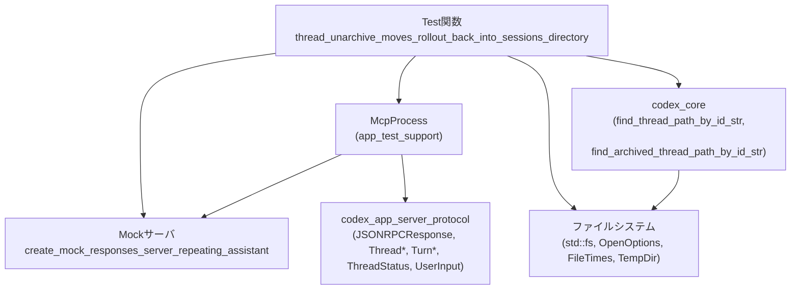
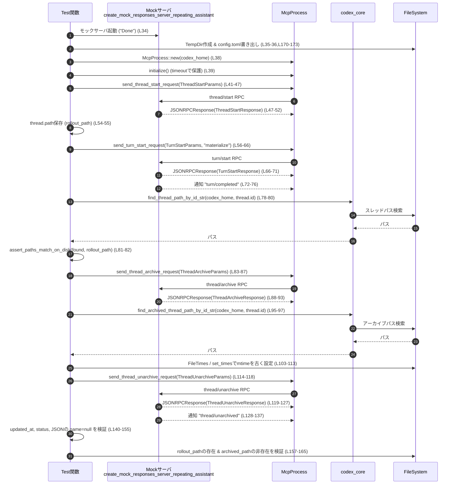

# app-server/tests/suite/v2/thread_unarchive.rs

## 0. ざっくり一言

`thread_unarchive` RPC がスレッドのロールアウトディレクトリを「アーカイブ → セッションディレクトリへ戻す」動作を正しく行い、タイムスタンプ・ステータス・通知・JSON ワイヤフォーマットの契約を満たしているかを検証する統合テストです（`thread_unarchive.rs:L32-168`）。

---

## 1. このモジュールの役割

### 1.1 概要

- このモジュールは、アプリケーションサーバの **thread start / turn start / archive / unarchive** 一連の JSON-RPC フローを実際に叩き、ディスク上のスレッドディレクトリの移動とメタデータ更新が仕様どおりかを検証します（`thread_unarchive.rs:L32-168`）。
- 特に、`thread/unarchive` が
  - アーカイブされたロールアウトパスを「セッションディレクトリ」に戻すこと
  - `updated_at` を現在時刻以降に更新すること
  - ステータスを `ThreadStatus::NotLoaded` にすること
  - `thread/unarchived` 通知を送ること
  - スレッドの `name` フィールドを「未設定なら JSON 上 `null` として送る」こと  
  を確認します（`thread_unarchive.rs:L95-165`）。

### 1.2 アーキテクチャ内での位置づけ

このテストは、次のコンポーネントを組み合わせて動作します。

- テスト本体（Tokio 非同期テスト）: `#[tokio::test]` 付き関数（`thread_unarchive.rs:L32-168`）
- モック応答サーバ: `create_mock_responses_server_repeating_assistant`（`thread_unarchive.rs:L3,L34`）
- クライアントプロセス: `McpProcess`（`thread_unarchive.rs:L2,L38-40,L41-47,L56-66,L83-93,L114-123,L128-132`）
- プロトコル型群: `Thread*` / `TurnStart*` / `JSONRPCResponse` / `ThreadStatus` 等（`thread_unarchive.rs:L5-17,L52,L71,L93,L125-127,L133-138,L143`）
- コアライブラリ: アーカイブ/非アーカイブスレッドのパス探索関数（`thread_unarchive.rs:L18-19,L78-81,L95-97`）
- ファイルシステム: `tempfile::TempDir`, `std::fs`, `OpenOptions`, `FileTimes`, `SystemTime` など（`thread_unarchive.rs:L22-27,L35-36,L95-113,L170-173,L193-197`）

依存関係のイメージです。



※ `McpProcess` や各プロトコル型の具体的な実装は、このファイルには現れません。

### 1.3 設計上のポイント

- **実ファイルシステムを使う統合テスト**  
  - `TempDir` で一時ディレクトリを作成し（`thread_unarchive.rs:L35`）、そこに `config.toml` を書き出してサーバを構成します（`thread_unarchive.rs:L170-173`）。
  - スレッドのディレクトリパスは `codex_core` の検索関数から取得します（`thread_unarchive.rs:L78-81,L95-97`）。
- **非同期 + タイムアウトによる安全な待機**  
  - すべての RPC 応答・通知の待機は `tokio::time::timeout` でラップされており（`thread_unarchive.rs:L39,L47-51,L66-70,L72-76,L88-92,L119-123,L128-132`）、テストが無限にハングしないようになっています。
- **エラーハンドリング**  
  - テスト関数の戻り値は `anyhow::Result<()>` で、外部呼び出しのエラーは `?` 演算子で伝播します（`thread_unarchive.rs:L1,L32-40,L47-52,L66-71,L72-81,L83-97,...`）。
  - 仕様違反は `assert!`, `assert_eq!`, `.expect(...)` によるパニックで検出します（`thread_unarchive.rs:L54,L80-81,L99-102,L106,L136-137,L138,L140-142,L143,L149,L150-155,L159-165`）。
- **ワイヤ契約の明示的な検証**  
  - コメントで「`name` フィールドが未設定の場合は JSON では `null` シリアライズ」と明記し（`thread_unarchive.rs:L145`）、それを JSON レベルで検証しています（`thread_unarchive.rs:L146-155`）。
- **タイムスタンプの検証**  
  - アーカイブ済みファイルの `mtime` を非常に古い時刻に設定し（`thread_unarchive.rs:L103-113`）、`unarchive` 実行後に `updated_at` がそれより新しくなっていることを確認することで、「更新が行われた」ことを間接的に検証しています（`thread_unarchive.rs:L140-142`）。

---

## 2. 主要な機能一覧（コンポーネントインベントリー含む）

### 2.1 機能の概要

- スレッド開始 (`thread/start`) → ターン開始 (`turn/start`) → 完了通知 (`turn/completed`) の正常フロー検証（`thread_unarchive.rs:L41-76`）
- セッションディレクトリ上のロールアウトパスが `ThreadStartResponse` の `thread.path` と一致することの検証（`thread_unarchive.rs:L52-55,L78-82`）
- スレッドのアーカイブ (`thread/archive`) によりロールアウトパスがアーカイブディレクトリ側に移動することの検証（`thread_unarchive.rs:L83-97,L99-102`）
- アーカイブ済みスレッドの `mtime` を古くし、その後の `thread/unarchive` で `updated_at` が更新されることの検証（`thread_unarchive.rs:L103-113,L140-142`）
- `thread/unarchive` 応答と `thread/unarchived` 通知の内容（`thread_id`, `status`, `name` フィールドの JSON 表現）の検証（`thread_unarchive.rs:L114-155`）
- アーカイブ解除後にロールアウトパスが元の場所に復元され、アーカイブ側パスが消えることの検証（`thread_unarchive.rs:L157-165`）
- テスト用 `config.toml` の生成と、パス比較ユーティリティの提供（`thread_unarchive.rs:L170-173,L175-191,L193-197`）

### 2.2 このファイル内の関数・テスト一覧（コンポーネントインベントリー）

| 名前 | 種別 | 役割 / 用途 | 定義位置 |
|------|------|-------------|----------|
| `thread_unarchive_moves_rollout_back_into_sessions_directory` | 非同期テスト関数 | Thread の start → turn → archive → unarchive 一連フローを通し、ディスク上のパス移動・メタデータ更新・通知・JSON 契約を検証するメインテスト | `thread_unarchive.rs:L32-168` |
| `create_config_toml` | 関数 | 一時ディレクトリ配下に `config.toml` を生成し、モックサーバ URI を埋め込んだ設定を書き出す | `thread_unarchive.rs:L170-173` |
| `config_contents` | 関数 | `config.toml` の内容文字列を生成する（モデル名やモックプロバイダ設定を含む TOML 文字列） | `thread_unarchive.rs:L175-191` |
| `assert_paths_match_on_disk` | 関数 | 2 つのパスを `canonicalize` した上で等しいことを `assert_eq!` で検証する | `thread_unarchive.rs:L193-197` |

### 2.3 主な外部コンポーネント（インポート）

| シンボル | 由来 | 用途 | 参照位置 |
|---------|------|------|----------|
| `McpProcess` | `app_test_support` | サーバと JSON-RPC で通信するクライアントプロセス。初期化、各種 `send_*_request`、`read_stream_until_*` を提供 | `thread_unarchive.rs:L2,L38-40,L41-47,L56-66,L83-93,L114-123,L128-132` |
| `create_mock_responses_server_repeating_assistant` | `app_test_support` | 一定の応答（ここでは `"Done"`）を返すモックサーバを生成し、URI を提供 | `thread_unarchive.rs:L3,L34,L36` |
| `to_response` | `app_test_support` | `JSONRPCResponse` から特定型（`ThreadStartResponse` 等）へのデコードを行うヘルパー | `thread_unarchive.rs:L4,L52,L71,L93,L125-127` |
| `JSONRPCResponse`, `RequestId` | `codex_app_server_protocol` | JSON-RPC レスポンスとリクエスト ID の型 | `thread_unarchive.rs:L5-6,L47-52,L66-71,L88-93,L119-127` |
| `ThreadStartParams`, `ThreadStartResponse` | 同上 | `thread/start` リクエスト/レスポンスの型 | `thread_unarchive.rs:L9-10,L41-46,L52-53` |
| `TurnStartParams`, `TurnStartResponse`, `UserInput` | 同上 | `turn/start` リクエスト/レスポンス・ユーザ入力の型 | `thread_unarchive.rs:L15-17,L56-63,L71` |
| `ThreadArchiveParams`, `ThreadArchiveResponse` | 同上 | `thread/archive` リクエスト/レスポンスの型 | `thread_unarchive.rs:L7-8,L83-87,L93` |
| `ThreadUnarchiveParams`, `ThreadUnarchiveResponse`, `ThreadUnarchivedNotification`, `ThreadStatus` | 同上 | `thread/unarchive` リクエスト/レスポンス・通知・スレッドステータス | `thread_unarchive.rs:L12-14,L114-118,L125-127,L133-138,L143` |
| `find_thread_path_by_id_str` | `codex_core` | セッションディレクトリ内のスレッドディレクトリパスの検索 | `thread_unarchive.rs:L18,L78-81` |
| `find_archived_thread_path_by_id_str` | `codex_core` | アーカイブディレクトリ内のスレッドディレクトリパスの検索 | `thread_unarchive.rs:L19,L95-97` |

---

## 3. 公開 API と詳細解説

### 3.1 型一覧（このファイル内で定義される型）

このファイル内で **新たに定義される構造体や列挙体はありません**。  
外部クレートから利用している主な型は次のとおりです（いずれも実体は他ファイルに定義されています）。

| 名前 | 種別 | 由来 | 役割 / 用途 | 根拠 |
|------|------|------|-------------|------|
| `ThreadStartResponse` | 構造体 | `codex_app_server_protocol` | `thread/start` の応答。少なくとも `thread` フィールドを持ち、その `thread` から `id` と `path` が参照されています | `thread_unarchive.rs:L10,L52-55` |
| `ThreadArchiveResponse` | 構造体 | 同上 | `thread/archive` の応答を表す。詳細フィールドはこのファイルからは不明です | `thread_unarchive.rs:L8,L93` |
| `ThreadUnarchiveResponse` | 構造体 | 同上 | `thread/unarchive` の応答。少なくとも `thread` フィールドを持ち、`updated_at`, `status`, `name` 等を含むスレッド情報を返します | `thread_unarchive.rs:L13,L125-127,L140-143,L150` |
| `ThreadUnarchivedNotification` | 構造体 | 同上 | `thread/unarchived` 通知のペイロード。少なくとも `thread_id` フィールドを持ちます | `thread_unarchive.rs:L14,L133-138` |
| `ThreadStatus` | 列挙体 | 同上 | スレッドの状態を表す。少なくとも `NotLoaded` 変種を持ちます | `thread_unarchive.rs:L11,L143` |

> 上記以外のフィールド構成や意味は、このファイル単体からは分かりません。

### 3.2 関数詳細

#### `thread_unarchive_moves_rollout_back_into_sessions_directory() -> Result<()>`

**概要**

- 非同期テスト関数です（`#[tokio::test]`、`thread_unarchive.rs:L32`）。
- スレッドの開始からアーカイブ・アンアーカイブまでを通しで実行し、ディスク上のパス移動とメタデータ、および通知・JSON フォーマットの契約を検証します（`thread_unarchive.rs:L34-165`）。

**引数**

引数はありません。テストハーネスから直接呼び出されます。

**戻り値**

- 型: `anyhow::Result<()>`（`thread_unarchive.rs:L1,L32`）
- 意味:  
  - `Ok(())` : すべての外部呼び出しが成功し、全ての `assert!` が通過した場合。  
  - `Err(e)` : ファイル操作、プロセス起動、タイムアウト等でエラーが発生した場合（`?` による早期リターン）。

**内部処理の流れ（アルゴリズム）**

1. **モックサーバと環境の準備**  
   - モック応答サーバを起動（`create_mock_responses_server_repeating_assistant("Done")`）（`thread_unarchive.rs:L34`）。
   - 一時ディレクトリ `codex_home` を作成（`TempDir::new`、`thread_unarchive.rs:L35`）。
   - `codex_home/config.toml` を書き出し（`create_config_toml`、`thread_unarchive.rs:L36`）。
2. **McpProcess の起動と初期化**  
   - `McpProcess::new(codex_home.path())` でクライアントプロセス生成（`thread_unarchive.rs:L38`）。
   - `timeout(DEFAULT_READ_TIMEOUT, mcp.initialize()).await??;` で初期化完了まで待機し、タイムアウトおよび内部エラーを検出（`thread_unarchive.rs:L39`）。
3. **スレッド開始 (`thread/start`)**  
   - `ThreadStartParams` で `model: Some("mock-model")` を指定しリクエスト送信（`thread_unarchive.rs:L41-46`）。
   - `read_stream_until_response_message` で該当 `RequestId` の `JSONRPCResponse` をタイムアウト付きで待機（`thread_unarchive.rs:L47-51`）。
   - `to_response::<ThreadStartResponse>` で型付きレスポンスにデコードし `thread` 情報を取得（`thread_unarchive.rs:L52-53`）。
   - `thread.path` を `rollout_path` として保存（`thread_unarchive.rs:L54-55`）。
4. **ターン開始 (`turn/start`) と完了通知待ち**  
   - `TurnStartParams` に `thread_id` と `UserInput::Text { text: "materialize" }` を設定しリクエスト送信（`thread_unarchive.rs:L56-63`）。
   - 同様にレスポンスを待機・デコードして `TurnStartResponse` を取得（`thread_unarchive.rs:L66-71`）。
   - `"turn/completed"` 通知が来るまで待機（`thread_unarchive.rs:L72-76`）。
5. **セッションディレクトリ上のロールアウトパス確認**  
   - `find_thread_path_by_id_str(codex_home.path(), &thread.id)` でパスを検索（`thread_unarchive.rs:L78-80`）。
   - 見つからなければ `expect` でパニック（`thread_unarchive.rs:L80-81`）。
   - `assert_paths_match_on_disk` で `rollout_path` と実際のパスが同一であることを `canonicalize` ベースで検証（`thread_unarchive.rs:L81-82`）。
6. **スレッドのアーカイブ (`thread/archive`)**  
   - `ThreadArchiveParams { thread_id: thread.id.clone() }` でリクエスト送信（`thread_unarchive.rs:L83-87`）。
   - 対応するレスポンスを型付き `ThreadArchiveResponse` にデコード（`thread_unarchive.rs:L88-93`）。
   - `find_archived_thread_path_by_id_str` でアーカイブされたパスを取得し存在確認（`thread_unarchive.rs:L95-102`）。
7. **アーカイブファイルの mtime を古くする**  
   - `old_time = UNIX_EPOCH + 1秒` を計算し（`thread_unarchive.rs:L103-107`）、`FileTimes::new().set_modified(old_time)` を作成（`thread_unarchive.rs:L108`）。
   - `OpenOptions::new().append(true).open(&archived_path)?.set_times(times)?;` でアーカイブファイルの更新時刻を古く設定（`thread_unarchive.rs:L109-112`）。
8. **スレッドのアンアーカイブ (`thread/unarchive`)**  
   - `ThreadUnarchiveParams { thread_id: thread.id.clone() }` でリクエスト送信（`thread_unarchive.rs:L114-118`）。
   - レスポンスを待機し、まずは raw な `result` をクローン（`thread_unarchive.rs:L119-124`）。
   - `to_response::<ThreadUnarchiveResponse>` で型付き応答を取得し `unarchived_thread` を得る（`thread_unarchive.rs:L125-127`）。
   - `"thread/unarchived"` 通知を待機し、`ThreadUnarchivedNotification` にデコード（`thread_unarchive.rs:L128-137`）。
9. **メタデータと JSON 契約の検証**  
   - 通知中の `thread_id` が元の `thread.id` と一致すること（`thread_unarchive.rs:L133-138`）。
   - `unarchived_thread.updated_at > old_timestamp` であること（`thread_unarchive.rs:L140-142`）。
   - `unarchived_thread.status == ThreadStatus::NotLoaded` であること（`thread_unarchive.rs:L143`）。
   - `unarchive_result["thread"]` がオブジェクトであることを確認し（`thread_unarchive.rs:L146-149`）、`unarchived_thread.name == None` かつ JSON 上 `name: null` とシリアライズされていることを確認（`thread_unarchive.rs:L150-155`）。
10. **パス復元の検証**  
    - 元の `rollout_path` が再び存在していること（`thread_unarchive.rs:L157-161`）。
    - アーカイブ側の `archived_path` が存在しないこと（`thread_unarchive.rs:L162-165`）。

**Examples（使用例）**

この関数自体はテストハーネスから自動的に呼ばれるため、直接呼び出すことはありませんが、同様のパターンで新しい統合テストを書く場合の雛形として利用できます。

```rust
// 同様のパターンで別の RPC を検証する統合テスト例
#[tokio::test]
async fn my_new_thread_test() -> anyhow::Result<()> {
    let server = create_mock_responses_server_repeating_assistant("Done").await; // モックサーバ起動
    let codex_home = TempDir::new()?;                                           // 一時ディレクトリ作成
    create_config_toml(codex_home.path(), &server.uri())?;                      // 設定を書き出し

    let mut mcp = McpProcess::new(codex_home.path()).await?;                    // クライアント作成
    timeout(DEFAULT_READ_TIMEOUT, mcp.initialize()).await??;                    // 初期化

    // ここで別の RPC を送って検証 …
    Ok(())
}
```

（構造は `thread_unarchive_moves_rollout_back_into_sessions_directory` と同じであることが分かるようにしています。）

**Errors / Panics**

- `?` によるエラー伝播:
  - `TempDir::new`, `create_config_toml`, `McpProcess::new`, `initialize`, 各種 `send_*_request`, `read_stream_until_*`, `find_*_path_by_id_str`, `OpenOptions::open`, `set_times`, `serde_json::from_value` などで発生した I/O エラー・タイムアウト・デコードエラーは `Err` としてテスト関数の呼び出し元（テストランナー）に伝播します（`thread_unarchive.rs:L35-40,L47-52,L66-71,L78-81,L83-93,L95-97,L109-112,L114-123,L128-137`）。
- `panic` を起こす可能性:
  - `expect(...)`: パスが見つからない、timestamp 計算に失敗、通知の params が `None` の場合など（`thread_unarchive.rs:L54,L80-81,L99-102,L106,L136-137`）。
  - `assert!`, `assert_eq!`: 仕様違反（パス不一致、通知の thread_id 不一致、updated_at が古い、status が `NotLoaded` 以外、`name` が `null` ではない等）の場合（`thread_unarchive.rs:L81,L99-102,L138,L140-143,L150-155,L159-165`）。

**Edge cases（エッジケース）**

- サーバまたは `McpProcess` が応答を返さない/通知を送らない場合:
  - `timeout` により `Elapsed` エラーとなりテストは `Err` で終了します（`thread_unarchive.rs:L39,L47-51,L66-70,L72-76,L88-92,L119-123,L128-132`）。
- スレッド ID に対応するパスが存在しない場合:
  - `find_thread_path_by_id_str` / `find_archived_thread_path_by_id_str` が `None` を返した時点で `expect` によりパニックします（`thread_unarchive.rs:L80-81,L95-97`）。
- `unarchive` 応答の JSON 形式が変わる場合:
  - `unarchive_result.get("thread")` がオブジェクトでない、`name` フィールドが存在しない、`null` 以外の値の場合、`expect` や `assert_eq!` でテスト失敗になります（`thread_unarchive.rs:L146-155`）。

**使用上の注意点**

- 非同期関数であり、`#[tokio::test]` 属性により Tokio ランタイム上で実行されます。通常の同期コンテキストから直接呼び出すことは想定されていません（`thread_unarchive.rs:L32`）。
- テストは実際にファイルシステムへ書き込みを行いますが、`TempDir` によりテスト終了時にクリーンアップされます（`thread_unarchive.rs:L35`）。
- 仕様（パスレイアウトや JSON 契約）に依存したテストであるため、サーバ側の仕様変更時にはこのテストを更新する必要があります。

---

#### `create_config_toml(codex_home: &Path, server_uri: &str) -> std::io::Result<()>`

**概要**

- 指定されたディレクトリ直下に `config.toml` を作成し、`server_uri` を埋め込んだ設定内容を書き出します（`thread_unarchive.rs:L170-173`）。

**引数**

| 引数名 | 型 | 説明 |
|--------|----|------|
| `codex_home` | `&Path` | 設定ファイルを書き出すルートディレクトリ（`config.toml` をこの直下に作成） |
| `server_uri` | `&str` | モックサーバのベース URL。`config_contents` 内で TOML に埋め込まれます |

**戻り値**

- 型: `std::io::Result<()>`（`thread_unarchive.rs:L170`）  
- 意味: ファイル書き込みが成功すれば `Ok(())`、パスの解決や書き込みに失敗した場合は `Err(std::io::Error)`。

**内部処理の流れ**

1. `codex_home.join("config.toml")` で書き出し先パスを構築（`thread_unarchive.rs:L171`）。
2. `config_contents(server_uri)` で TOML 文字列を生成（`thread_unarchive.rs:L172,L175-191`）。
3. `std::fs::write(config_toml, ...)` でファイルに書き出し（`thread_unarchive.rs:L172`）。

**Examples（使用例）**

```rust
let codex_home = TempDir::new()?;                           // 一時ディレクトリを作成
let server = create_mock_responses_server_repeating_assistant("Done").await;
create_config_toml(codex_home.path(), &server.uri())?;      // config.toml を生成
```

**Errors / Panics**

- `std::fs::write` が返す `std::io::Error` をそのまま返します（パスの権限問題、ディスクフルなど）（`thread_unarchive.rs:L171-172`）。
- この関数内では `panic` は発生しません。

**Edge cases**

- `server_uri` に不正な文字が含まれていても、この関数は文字列として埋め込むだけであり、検証は行いません（`thread_unarchive.rs:L175-191`）。
- `codex_home` が存在しないパスの場合、`std::fs::write` が失敗し `Err` を返します。

**使用上の注意点**

- 呼び出し側で `?` を使ってエラー処理を行うことが一般的です（`thread_unarchive.rs:L36`）。
- 複数回呼び出した場合、既存の `config.toml` は上書きされます。

---

#### `config_contents(server_uri: &str) -> String`

**概要**

- テスト用の `config.toml` 内容文字列を生成します。  
  モデル・承認ポリシー・サンドボックスモード・モックモデルプロバイダの設定を含みます（`thread_unarchive.rs:L175-191`）。

**引数**

| 引数名 | 型 | 説明 |
|--------|----|------|
| `server_uri` | `&str` | モックサーバのベース URL。`base_url = "{server_uri}/v1"` として埋め込まれます |

**戻り値**

- 型: `String`  
- 意味: テストで利用する TOML 形式の設定内容。

**内部処理の流れ**

1. `format!` マクロで TOML 文字列を構築し、`{server_uri}` プレースホルダに引数を挿入します（`thread_unarchive.rs:L175-191`）。
2. 文字列には以下の主な項目が含まれます（すべてリテラルのため、このファイルから直接読み取れます）:
   - `model = "mock-model"`（`thread_unarchive.rs:L177`）
   - `approval_policy = "never"`（`thread_unarchive.rs:L178`）
   - `sandbox_mode = "read-only"`（`thread_unarchive.rs:L179`）
   - `model_provider = "mock_provider"`（`thread_unarchive.rs:L181`）
   - `[model_providers.mock_provider]` セクション内で `base_url = "{server_uri}/v1"`, `wire_api = "responses"`, `request_max_retries = 0`, `stream_max_retries = 0`（`thread_unarchive.rs:L183-188`）

**Examples（使用例）**

```rust
let contents = config_contents("http://localhost:1234"); // TOML文字列を生成
println!("{}", contents);                               // base_url = "http://localhost:1234/v1" が含まれる
```

**Errors / Panics**

- `format!` はここではパニックしません（プレースホルダと引数の数が一致しているため）（`thread_unarchive.rs:L175-191`）。
- エラー型は返しません。

**Edge cases**

- `server_uri` が空文字列でも `"base_url = "/v1"` という文字列が生成されるだけで、この関数自体はエラーにしません。
- `server_uri` の妥当性チェックは行いません。

**使用上の注意点**

- 実運用向けではなく、テスト用の固定設定であることに留意する必要があります（特に `approval_policy = "never"` や `sandbox_mode = "read-only"` など）（`thread_unarchive.rs:L177-179`）。

---

#### `assert_paths_match_on_disk(actual: &Path, expected: &Path) -> std::io::Result<()>`

**概要**

- 2 つのパスを `canonicalize()` して実際に指している場所を解決した上で、同一のパスかどうかを `assert_eq!` で検証するヘルパー関数です（`thread_unarchive.rs:L193-197`）。

**引数**

| 引数名 | 型 | 説明 |
|--------|----|------|
| `actual` | `&Path` | 実際に得られたパス |
| `expected` | `&Path` | 期待されるパス |

**戻り値**

- 型: `std::io::Result<()>`  
- 意味: `canonicalize` が両方成功した場合は `Ok(())`。いずれかが失敗した場合は `Err(std::io::Error)`。

**内部処理の流れ**

1. `actual.canonicalize()?` で実際のパスを絶対パスに解決（`thread_unarchive.rs:L194`）。
2. `expected.canonicalize()?` で期待パスも同様に解決（`thread_unarchive.rs:L195`）。
3. `assert_eq!(actual, expected);` でパスが同一であることを検証（`thread_unarchive.rs:L196`）。
4. `Ok(())` を返す（`thread_unarchive.rs:L197`）。

**Examples（使用例）**

```rust
let path1 = Path::new("/tmp/foo");
let path2 = Path::new("/tmp/../tmp/foo");          // 論理的には同じ場所

assert_paths_match_on_disk(path1, path2)?;         // canonicalizeで同一と判定される
```

**Errors / Panics**

- `canonicalize` が失敗した場合（パスが存在しない、権限不足など）は `Err(std::io::Error)` を返します（`thread_unarchive.rs:L194-195`）。
- 2 つの canonicalized パスが異なる場合は `assert_eq!` により `panic` します（`thread_unarchive.rs:L196`）。

**Edge cases**

- シンボリックリンクが含まれている場合でも `canonicalize` によって解決されるため、リンクの有無に関わらず実体として同じ場所かを比較できます。
- パスが存在しない場合は比較まで到達せず、エラーとして扱われます。

**使用上の注意点**

- 「存在している前提」の比較ヘルパーであり、存在確認も兼ねている点に注意が必要です（`canonicalize` で存在しない場合は `Err`）。
- テストでは `?` によるエラー伝播と併用されており（`thread_unarchive.rs:L81-82`）、存在しない場合はテスト全体が `Err` で終了します。

### 3.3 その他の関数

上記 4 つ以外に、このファイル内で定義される関数はありません。

---

## 4. データフロー

### 4.1 代表的な処理シナリオ

唯一のテスト関数 `thread_unarchive_moves_rollout_back_into_sessions_directory` のシナリオを、クライアント/サーバ/ファイルシステム間のデータフローとして整理します（`thread_unarchive.rs:L32-168`）。

- テストがモックサーバと `McpProcess` を起動し、JSON-RPC でスレッドの start / turn / archive / unarchive を順に呼び出します。
- 返却されたスレッド情報からディスク上のロールアウトパスを追跡し、アーカイブ・アンアーカイブの度に `codex_core` とファイルシステムへ問い合わせを行います。
- 最終的に、通知ペイロードおよび JSON の `thread` オブジェクトのフィールドを検査し、期待する契約が満たされているかを確認します。



---

## 5. 使い方（How to Use）

このファイル自体はテストモジュールですが、`McpProcess` を用いた統合テストの書き方・`config.toml` の生成・パス検証ヘルパーの使い方を学ぶための参考になります。

### 5.1 基本的な使用方法

`McpProcess` を使った統合テストを新たに追加する際の典型的なフローです。

```rust
use anyhow::Result;
use app_test_support::{McpProcess, create_mock_responses_server_repeating_assistant};
use tempfile::TempDir;
use tokio::time::timeout;

const DEFAULT_READ_TIMEOUT: std::time::Duration = std::time::Duration::from_secs(30);

#[tokio::test]
async fn my_integration_test() -> Result<()> {
    // 1. モックサーバ起動
    let server = create_mock_responses_server_repeating_assistant("Done").await; // L34

    // 2. 一時ディレクトリ + config.toml 作成
    let codex_home = TempDir::new()?;                                           // L35
    create_config_toml(codex_home.path(), &server.uri())?;                      // L36,L170-173

    // 3. McpProcess の作成と初期化
    let mut mcp = McpProcess::new(codex_home.path()).await?;                    // L38
    timeout(DEFAULT_READ_TIMEOUT, mcp.initialize()).await??;                    // L39

    // 4. 必要な RPC を送って検証 …
    Ok(())
}
```

このパターンは本テスト関数が実際に行っている処理に対応しています（`thread_unarchive.rs:L34-40`）。

### 5.2 よくある使用パターン

- **レスポンス待機のパターン**

  ```rust
  let request_id = mcp.send_thread_start_request(params).await?;                 // リクエスト送信 (L41-47)
  let resp: JSONRPCResponse = timeout(
      DEFAULT_READ_TIMEOUT,
      mcp.read_stream_until_response_message(RequestId::Integer(request_id)),    // 指定IDのレスポンスを待機 (L47-51)
  )
  .await??;
  let typed: ThreadStartResponse = to_response::<ThreadStartResponse>(resp)?;    // 型付きレスポンスに変換 (L52)
  ```

- **通知待機のパターン**

  ```rust
  timeout(
      DEFAULT_READ_TIMEOUT,
      mcp.read_stream_until_notification_message("turn/completed"),             // 通知名で待機 (L72-76)
  )
  .await??;
  ```

これらのパターンは、本テストで一貫して使われている非同期 + タイムアウト付き I/O の基本形です。

### 5.3 よくある間違いとこのファイルから読み取れる前提

このファイルから読み取れる「守るべき前提」を外すと、テストが期待通り動かない可能性があります。

```rust
// (誤りになりうる例)
// config.toml を作らないまま McpProcess を起動している
let mut mcp = McpProcess::new(codex_home.path()).await?;

// 正しい例: 先に config.toml を作成してから起動している （このファイルのパターン）
create_config_toml(codex_home.path(), &server.uri())?;      // L36,L170-173
let mut mcp = McpProcess::new(codex_home.path()).await?;    // L38
```

```rust
// (誤りになりうる例)
// initialize を呼ばずに RPC を送っている
let start_id = mcp.send_thread_start_request(params).await?;

// このファイルでのパターン: 必ず initialize の後に他の RPC を送る
timeout(DEFAULT_READ_TIMEOUT, mcp.initialize()).await??;    // L39
let start_id = mcp.send_thread_start_request(params).await?; // L41-47
```

> `initialize` が必須かどうか自体はこのファイルだけでは断定できませんが、ここでは常に `McpProcess::new` の直後に呼ばれているため、同様の前提を置いていると考えられます（根拠: `thread_unarchive.rs:L38-41`）。

### 5.4 使用上の注意点（まとめ）

- **タイムアウトの設定**  
  - すべてのストリーム読み取りに 30 秒のタイムアウトを設けています（`DEFAULT_READ_TIMEOUT`、`thread_unarchive.rs:L30,L39,L47-51,L66-70,L72-76,L88-92,L119-123,L128-132`）。
  - 新しいテストでも同様のガードを設けると、サーバ側のバグで無限待機するリスクを下げられます。
- **ファイルシステム依存**  
  - テストは実際のファイルシステムにパスを作り、`canonicalize` や `set_times` を行います（`thread_unarchive.rs:L95-113,L193-197`）。
  - OS 間の挙動差（例えばタイムスタンプ精度）によってテスト結果が変わる可能性があるため、その点を考慮する必要があります。
- **契約テストであること**  
  - JSON フィールド名（`name`）や `ThreadStatus::NotLoaded` など、ワイヤフォーマット・プロトコルの具体的な契約に依存しています（`thread_unarchive.rs:L11,L143,L145-155`）。
  - サーバ側の仕様を変更した場合、このテストが壊れることは設計上意図された「仕様変更検知」と捉えられます。

---

## 6. 変更の仕方（How to Modify）

### 6.1 新しい機能を追加する場合

例: `thread/unarchive` に新しいフィールドが追加された場合、その検証を追加する手順のイメージです。

1. **検証追加の入口を特定**  
   - 応答オブジェクトを扱っている部分（`unarchived_thread` と `unarchive_result`）を探します（`thread_unarchive.rs:L124-127,L146-155`）。
2. **型付きオブジェクトの検証を追加**  
   - `unarchived_thread` に新フィールドがある場合は、`assert_eq!` などで期待値を検証します（`thread_unarchive.rs:L140-143,L150` と同様のパターン）。
3. **JSON レベルの検証を追加（必要なら）**  
   - ワイヤ契約を明示的にテストしたい場合は、`thread_json` オブジェクトから追加フィールドを取り出して検証します（`thread_unarchive.rs:L146-155` を参考）。
4. **パス／ファイルシステムに関する機能追加**  
   - 新たなパス移動やファイル操作を伴う場合は、`assert_paths_match_on_disk` のようなヘルパーを再利用するか、新しいヘルパー関数をこのファイル末尾に追加します（`thread_unarchive.rs:L193-197`）。

### 6.2 既存の機能を変更する場合

- **thread/unarchive の挙動変更**  
  - 例えば「アンアーカイブ時にステータスを `NotLoaded` 以外にする」仕様変更を行った場合、
    - ステータス検証部分（`thread_unarchive.rs:L143`）の `ThreadStatus::NotLoaded` を新しい期待値に更新する必要があります。
- **ディレクトリ構造やパスの変更**  
  - `find_thread_path_by_id_str` / `find_archived_thread_path_by_id_str` の挙動を変える場合、新しい構造に合わせてこのテストのパス比較／存在確認ロジック（`thread_unarchive.rs:L78-82,L95-102,L157-165`）を見直す必要があります。
- **config.toml の仕様変更**  
  - 設定キーやセクション構造を変えた場合、`config_contents` の TOML 文字列（`thread_unarchive.rs:L175-191`）を修正し、それによってサーバの起動方法が変わる場合はテスト全体に影響が及ぶ可能性があります。

変更時には、同様の RPC を扱う他のテストファイル（本チャンクには現れません）も合わせて確認することが望ましいです。

---

## 7. 関連ファイル

このモジュールと密接に関係する外部コンポーネント／モジュールです（実際のファイルパスはこのチャンクからは分からないため、モジュールパスで記載します）。

| パス / シンボル | 役割 / 関係 | 根拠 |
|-----------------|------------|------|
| `app_test_support::McpProcess` | アプリケーションサーバと JSON-RPC で通信するクライアント。スレッド・ターンの開始、アーカイブ／アンアーカイブのリクエスト送信とストリームからのレスポンス／通知読み取りを提供します | `thread_unarchive.rs:L2,L38-40,L41-47,L56-66,L83-93,L114-123,L128-132` |
| `app_test_support::create_mock_responses_server_repeating_assistant` | 応答内容を固定したモックサーバを立ち上げるテスト支援関数。`config.toml` 内の `base_url` に渡されます | `thread_unarchive.rs:L3,L34,L36,L175-191` |
| `app_test_support::to_response` | JSON-RPC レスポンス (`JSONRPCResponse`) を特定の型 (`ThreadStartResponse` など) に変換するユーティリティ | `thread_unarchive.rs:L4,L52,L71,L93,L125-127` |
| `codex_app_server_protocol::*` | Thread/Turn 関連の RPC パラメータ・レスポンス・通知型を定義するプロトコル層 | `thread_unarchive.rs:L5-17,L41-47,L52-53,L56-63,L71,L83-87,L93,L114-118,L125-127,L133-138,L143,L146-155` |
| `codex_core::find_thread_path_by_id_str` | セッションディレクトリ内でスレッド ID に対応するロールアウトパスを検索するヘルパー | `thread_unarchive.rs:L18,L78-81` |
| `codex_core::find_archived_thread_path_by_id_str` | アーカイブディレクトリ内でスレッド ID に対応するロールアウトパスを検索するヘルパー | `thread_unarchive.rs:L19,L95-97` |

> 上記コンポーネントの具体的な実装内容は、このファイルには含まれていません。そのため、ここでは「どのように使われているか」に限定して説明しています。
