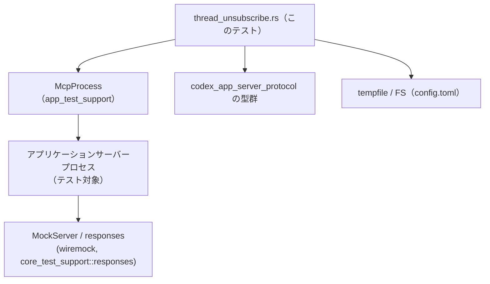
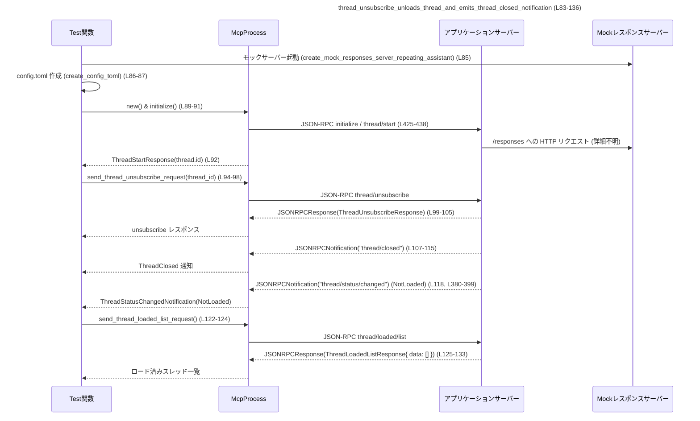

# app-server/tests/suite/v2/thread_unsubscribe.rs

## 0. ざっくり一言

v2 スレッドの `thread/unsubscribe` 振る舞いを検証する統合テスト群です。  
スレッドのアンロード、`thread/closed` 通知、ステータスキャッシュのクリア、進行中ターンの中断などを、モックのモデルサーバーと JSON-RPC クライアント (`McpProcess`) を通じて確認します。（根拠: `thread_unsubscribe.rs:L83-365`）

---

## 1. このモジュールの役割

### 1.1 概要

- このモジュールは **スレッド購読解除 API（thread/unsubscribe）周りの仕様を保証** するためのテストを提供します。
- 主に次の挙動を検証します。（根拠: テスト名とアサート）
  - 購読解除でスレッドがアンロードされ `thread/closed` 通知が出ること（`thread_unsubscribe_unloads_thread_and_emits_thread_closed_notification`、`L83-136`）
  - 実行中のターン中でも購読解除でターンが中断され、レスポンス HTTP リクエスト回数が制御されること（`L138-228`）
  - エラー状態のスレッドで購読解除後に再開すると、ステータスキャッシュがクリアされ Idle に戻ること（`L230-315`）
  - すでにアンロード済みスレッドに再度購読解除すると `NotLoaded` が返ること（`L317-365`）

### 1.2 アーキテクチャ内での位置づけ

このテストファイルは、以下のコンポーネントと連携します。

- JSON-RPC クライアントラッパー `McpProcess`（`app_test_support::McpProcess`）を用いて、テスト対象のアプリケーションサーバープロセスと対話します。（`L3`, `L89-92`, `L167-170` など）
- `codex_app_server_protocol` の型（`ThreadUnsubscribeParams` など）でリクエスト・レスポンスを型安全に扱います。（`L9-29`, 利用箇所 `L94-105`, `L200-207` など）
- HTTP レベルでは `wiremock::MockServer` や `core_test_support::responses` を使い、`/responses` エンドポイントをモックします。（`L38-41`, `L232-237`）
- テストごとに `tempfile::TempDir` で一時ディレクトリ・設定ファイルを作成し、テスト間の状態干渉を避けます。（`L86`, `L149-153`, `L238-239`）

依存関係を簡略化すると次のようになります。



### 1.3 設計上のポイント

- **非同期 & 並行性**
  - すべてのテストは `#[tokio::test]` で非同期に実行されます。（`L83`, `L138`, `L230`, `L317`）
  - JSON-RPC の読み取りは `tokio::time::timeout` でラップし、テストがハングしないようにしています。（例: `L90-91`, `L99-103`, `L184-187`）
- **状態待ちのヘルパー**
  - 通知が特定の条件（コマンド実行開始 / スレッドステータスが NotLoaded など）を満たすまでループするヘルパー関数を定義し、テスト本体を簡潔にしています。（`L367-378`, `L380-399`）
- **外部 HTTP モックの安定性チェック**
  - `/responses` への HTTP リクエスト数が一定値に落ち着くまで待つユーティリティを用意し、非同期処理の完了を間接的に検証します。（`wait_for_responses_request_count_to_stabilize`, `L38-81`）
- **設定の一元化**
  - `create_config_toml` で `config.toml` を生成し、モックサーバーの URL やリトライ設定を集中管理しています。（`L402-423`）

---

## 2. 主要な機能一覧（コンポーネントインベントリー）

このファイル内で定義されるすべての関数の一覧です。

| 名前 | 種別 | 行範囲 | 役割 / 用途 |
|------|------|--------|-------------|
| `DEFAULT_READ_TIMEOUT` | 定数 | `thread_unsubscribe.rs:L36` | JSON-RPC ストリーム読み取りや待機処理に共通で使う 10 秒タイムアウト |
| `wait_for_responses_request_count_to_stabilize` | `async fn` | `L38-81` | wiremock の `/responses` への POST リクエスト数が指定値で安定するまでポーリングする |
| `thread_unsubscribe_unloads_thread_and_emits_thread_closed_notification` | `#[tokio::test] async fn` | `L83-136` | 購読解除でスレッドがアンロードされ、`thread/closed` と `ThreadStatus::NotLoaded` が通知されることを検証 |
| `thread_unsubscribe_during_turn_interrupts_turn_and_emits_thread_closed` | `#[tokio::test] async fn` | `L138-228` | シェルコマンド実行中のターン中に購読解除した場合の中断と `thread/closed` 通知、および `/responses` リクエスト数を検証 |
| `thread_unsubscribe_clears_cached_status_before_resume` | `#[tokio::test] async fn` | `L230-315` | サーバーエラー状態のスレッドを一度購読解除してから `thread/resume` したときに、ステータスが Idle になることを検証 |
| `thread_unsubscribe_reports_not_loaded_after_thread_is_unloaded` | `#[tokio::test] async fn` | `L317-365` | すでにアンロードされたスレッドに対する再購読解除が `ThreadUnsubscribeStatus::NotLoaded` を返すことを検証 |
| `wait_for_command_execution_item_started` | `async fn` | `L367-378` | `item/started` 通知のうち、`ThreadItem::CommandExecution` が来るまでループして待機 |
| `wait_for_thread_status_not_loaded` | `async fn` | `L380-399` | `thread/status/changed` 通知から、対象スレッドのステータスが `NotLoaded` になるまで待機 |
| `create_config_toml` | `fn` | `L402-423` | 一時ディレクトリ直下に `config.toml` を書き出し、モックモデルや接続先 URL を設定 |
| `start_thread` | `async fn` | `L425-439` | `thread/start` リクエストを送り、新規スレッド ID を取得するテスト用ヘルパー |

---

## 3. 公開 API と詳細解説

### 3.1 型一覧（構造体・列挙体など）

このファイル内で新しく定義される構造体や列挙体はありません。

ただし、テスト対象 API と密接に関わる外部型を多用しているため、主なものを整理します（すべて `codex_app_server_protocol` からのインポートであり、このファイルでは定義されていません）。

| 名前 | 種別 | 行範囲（利用の一例） | 役割 / 用途 |
|------|------|----------------------|-------------|
| `ThreadUnsubscribeParams` | 構造体 | 利用例: `L94-97`, `L197-199`, `L283-285`, `L329-331`, `L351` | `thread/unsubscribe` リクエストのパラメータ（`thread_id` を含む） |
| `ThreadUnsubscribeResponse` | 構造体 | 利用例: `L104-105`, `L206-207`, `L292-293`, `L338-342`, `L358-362` | 購読解除結果（`status` フィールド）を表すレスポンス |
| `ThreadUnsubscribeStatus` | 列挙体 | 利用例: `L105`, `L207`, `L293`, `L340-342`, `L360-362` | `Unsubscribed` / `NotLoaded` など購読状態を表すステータス |
| `ThreadStatus` | 列挙体 | 利用例: `L120`, `L280`, `L395-396`, `L312` | スレッド全体の状態（`Idle` / `SystemError` / `NotLoaded` 等） |
| `ThreadStartParams` / `ThreadStartResponse` | 構造体 | 利用例: `L427-430`, `L437-438` | 新規スレッド作成リクエストとレスポンス |
| `ThreadResumeParams` / `ThreadResumeResponse` | 構造体 | 利用例: `L300-304`, `L311-312` | スレッド再開リクエストとレスポンス |
| `TurnStartParams` / `TurnStartResponse` | 構造体 | 利用例: `L173-181`, `L188`, `L247-254`, `L261` | スレッド上でのターン開始（ユーザー入力など）を表す |
| `JSONRPCResponse` / `JSONRPCNotification` | 構造体 | 利用例: `L99-103`, `L107-111`, `L183-187`, `L190-194` 等 | 汎用 JSON-RPC メッセージ（レスポンス / 通知） |
| `ThreadStatusChangedNotification` | 構造体 | 利用例: `L380-399` | `thread/status/changed` 通知のペイロード |

> これらの型のフィールド構造や詳細な仕様は、このチャンクには現れないため不明です。用途は命名と利用箇所から読み取ったものです。

---

### 3.2 関数詳細（主要 7 件）

#### `wait_for_responses_request_count_to_stabilize(server: &wiremock::MockServer, expected_count: usize, settle_duration: std::time::Duration) -> Result<()>`

**概要**

モック HTTP サーバーに対して `/responses` パスへの POST リクエストが `expected_count` 回送られた状態で、一定時間変化しなくなるまでポーリングして待機する非同期ヘルパーです。（根拠: `thread_unsubscribe.rs:L38-81`）

**引数**

| 引数名 | 型 | 説明 |
|--------|----|------|
| `server` | `&wiremock::MockServer` | `received_requests()` でリクエスト履歴を取得可能な wiremock サーバーインスタンス |
| `expected_count` | `usize` | 期待する `/responses` POST リクエストの総数 |
| `settle_duration` | `std::time::Duration` | リクエスト数が `expected_count` で安定していると見なすために必要な経過時間 |

**戻り値**

- `Result<()>` (`anyhow::Result` のエイリアス): 正常終了時は `Ok(())`、エラーやタイムアウト時は `Err` を返します。

**内部処理の流れ**

1. `tokio::time::timeout(DEFAULT_READ_TIMEOUT, async { ... })` で全体の待機時間を 10 秒に制限します。（`L43`, `L78`）
2. `stable_since: Option<Instant>` を使い、「期待値を満たしてからどれくらい経ったか」を追跡します。（`L44`）
3. ループ内で `server.received_requests().await` を呼び出し、すべてのリクエストを取得します。（`L46-49`）
4. その中から、`method == "POST"` かつ `url.path().ends_with("/responses")` のものだけをカウントします。（`L50-55`）
5. カウントが `expected_count` を超えた場合は、`anyhow::bail!` でエラー終了します。（`L57-60`）
6. カウントが `expected_count` の場合:
   - まだ `stable_since` が設定されていなければ現在時刻を記録（`L68`）
   - すでに設定されていて、`settle_duration` 経過していれば `Ok(())` を返します（`L64-67`）
7. カウントが期待値未満の場合は `stable_since` を `None` に戻し、10ms スリープして再試行します。（`L71-73`, `L75`）

**Examples（使用例）**

`thread_unsubscribe_during_turn_interrupts_turn_and_emits_thread_closed` テスト内で、購読解除後に `/responses` 呼び出しが 1 回で安定したことを確認する用途で使われています。（`L220-225`）

```rust
// /responses への POST が 1 回だけ行われ、その後 200ms 以上増えなくなるのを待つ
wait_for_responses_request_count_to_stabilize(
    &server,                              // wiremock::MockServer
    1,                                    // expected_count
    std::time::Duration::from_millis(200) // settle_duration
).await?;
```

**Errors / Panics**

- `server.received_requests().await` が失敗した場合、`context("failed to fetch received requests")` を付与した `Err` を返します。（`L46-49`）
- `/responses` のリクエスト数が `expected_count` を超えた場合、`anyhow::bail!` で `Err` を返します。（`L57-60`）
- `timeout` の外側で `await??` しているため、`tokio::time::error::Elapsed`（タイムアウト）も `Err` として返されます。（`L78`）
- この関数内では `panic!` は使用されていません。

**Edge cases（エッジケース）**

- `expected_count == 0` の場合:
  - `/responses` が 1 回も呼ばれていない状態が `settle_duration` 続くまで待機します。`> 0` になった瞬間に `bail!` します。（仕様はコードから直接読み取れる挙動、`L57-60`）
- モックサーバーへのリクエストが一切来ない場合:
  - `responses_request_count` は常に 0 のままなので、`settle_duration` 経過後に `Ok(())` となります。（`L63-69`）
- 期待値に達しても、すぐにさらにリクエストが飛ぶような不安定な状態では `stable_since` がリセットされ続け、最終的には `DEFAULT_READ_TIMEOUT` 超過でタイムアウトエラーになります。

**使用上の注意点**

- 高頻度のポーリング（10ms 間隔）を行うため、テストでのみ使用する前提の設計と考えられます。（`L75`）
- タイムアウトや `bail!` により `Err` になるケースがあるため、呼び出し元は `?` で伝播するか、エラーメッセージをログに出すなどの扱いが必要です。
- 並行テストで同じ `MockServer` を共有するとリクエスト数が混ざる可能性があるため、テストごとに独立したモックサーバーを使う前提になっています（少なくともこのファイルではテストごとに別インスタンスを使っています。`L85`, `L155-164` など）。

---

#### `thread_unsubscribe_unloads_thread_and_emits_thread_closed_notification() -> Result<()>`

**概要**

`thread/unsubscribe` リクエストを送ると、スレッドがアンロードされて `thread/closed` 通知と `ThreadStatus::NotLoaded` が発行され、`thread/loaded/list` にもスレッドが含まれなくなる、という一連の仕様を検証するテストです。（`L83-136`）

**引数**

- テスト関数のため引数はありません。

**戻り値**

- `Result<()>`: すべてのアサーションが成功し、エラーなく最後まで到達した場合に `Ok(())` を返します。
- アサート失敗や JSON パースエラーなどがあれば `Err` を返し、テストは失敗します。

**内部処理の流れ**

1. モックレスポンスサーバーの起動と設定ファイルの生成（`L85-87`）。
2. `McpProcess::new` と `initialize` により、テスト対象サーバーとの JSON-RPC セッションを確立（`L89-91`）。
3. `start_thread` を呼び、新しいスレッド ID を取得（`L92`）。
4. `thread/unsubscribe` リクエスト送信と `ThreadUnsubscribeResponse` の検証：
   - `send_thread_unsubscribe_request` でリクエスト ID を取得（`L94-98`）。
   - 対応する JSON-RPC レスポンスを `timeout` 付きで待ち（`L99-103`）、`to_response` で型変換（`L104`）。
   - `status == Unsubscribed` をアサート（`L105`）。
5. `thread/closed` 通知の検証：
   - `"thread/closed"` 通知を `timeout` 付きで待機（`L107-111`）。
   - `ServerNotification` に変換し（`L112`）、`ThreadClosed` であることと `thread_id` の一致を確認（`L113-116`）。
6. ステータス変更通知の検証：
   - `wait_for_thread_status_not_loaded` で対象スレッドのステータスが `NotLoaded` になるまで待機し、ID とステータスを確認（`L118-120`）。
7. `thread/loaded/list` で、現在ロードされているスレッドが空であることとカーソルが `None` であることを確認（`L122-133`）。

**Examples（使用例）**

この関数自体が使用例ですが、同様のテストを追加する場合のテンプレートになります。

```rust
#[tokio::test]
async fn my_thread_unsubscribe_test() -> Result<()> {
    let server = create_mock_responses_server_repeating_assistant("Done").await;
    let codex_home = TempDir::new()?;
    create_config_toml(codex_home.path(), &server.uri())?;

    let mut mcp = McpProcess::new(codex_home.path()).await?;
    timeout(DEFAULT_READ_TIMEOUT, mcp.initialize()).await??;

    let thread_id = start_thread(&mut mcp).await?;

    // ここに追加の検証ロジックを記述
    // ...

    Ok(())
}
```

**Errors / Panics**

- ファイル I/O や `McpProcess` の初期化、JSON パースなど、多くの箇所で `?` により `Err` が伝播します。
- `assert_eq!` 失敗時はテストフレームワークによる `panic!` でテスト失敗となります（`L105`, `L116`, `L119-120`, `L132-133`）。
- `timeout` により JSON-RPC 応答が 10 秒以内に届かない場合、`Err`（`Elapsed` を内包）が返ってテストは失敗します。

**Edge cases（エッジケース）**

- サーバー側が `thread/closed` 通知を送らない、またはステータス更新通知を送らない場合、`timeout` 経由でテストが失敗します。（`L107-111`, `L118-120`）
- `thread/loaded/list` の `next_cursor` が `Some` になった場合も `assert_eq!(next_cursor, None)` によりテスト失敗です。（`L133`）

**使用上の注意点**

- `wait_for_thread_status_not_loaded` は通知が来るまでループするため、`timeout` でラップされていることが前提の安全装置です（`L118` と `L380-399` を合わせて確認）。
- `ThreadLoadedListResponse` に対する期待値が非常に厳密（ロード済みスレッドが 0）であるため、将来仕様が変わった場合はこのテストが壊れる可能性があります。

---

#### `thread_unsubscribe_during_turn_interrupts_turn_and_emits_thread_closed() -> Result<()>`

**概要**

シェルコマンド実行を含むターンが実行中の状態で `thread/unsubscribe` を呼んだ場合に、ターンが中断されることと、`thread/closed` 通知発行、さらにバックエンド `/responses` 呼び出しが 1 回で打ち切られることを検証します。（`L138-228`）

**内部処理の流れ（要点のみ）**

1. OS ごとに `sleep` 相当のコマンドを準備（Windows: `powershell Start-Sleep`、その他: `sleep 10`）（`L140-147`）。
2. 一時ディレクトリ配下に `codex_home` と `workdir` を作成（`L149-153`）。
3. モックサーバーに対し、以下 2 つの SSE レスポンスをシーケンスとして設定（`L155-163`）。
   - 長時間実行するシェルコマンドの実行レスポンス（`create_shell_command_sse_response`）
   - 最終的なアシスタントメッセージ
4. `create_config_toml` で設定ファイル作成（`L165`）、`McpProcess` 初期化（`L167-168`）、`start_thread`（`L170`）。
5. `"run sleep"` 入力で `TurnStartParams` を送信し、`TurnStartResponse` を受信（`L172-189`）。
6. `wait_for_command_execution_item_started` で `item/started` 通知のうちコマンド実行開始を検出（`L190-194`, `L367-378`）。
7. そのタイミングで `thread/unsubscribe` を送り、`Unsubscribed` ステータスと `thread/closed` 通知を検証（`L196-219`）。
8. 最後に `wait_for_responses_request_count_to_stabilize(&server, 1, ...)` で `/responses` 呼び出しが 1 回で安定していることを確認（`L220-225`）。

**Errors / Edge cases / 注意点**

- シェルコマンドは固定文字列から構成されており、外部入力は使われていません（`L140-147`, セキュリティ的にコマンドインジェクションの心配はこのファイル内の範囲ではありません）。
- OS 依存のコマンドであるため、将来的に CI や実行環境が変わると失敗する可能性があります。
- 長時間ブロックするコマンドをテストに使うため、必ず `thread/unsubscribe` による中断が行われる前提です。万一中断が行われないと、`DEFAULT_READ_TIMEOUT` 超過でテストが失敗します。

---

#### `thread_unsubscribe_clears_cached_status_before_resume() -> Result<()>`

**概要**

サーバーがターン中にエラーを返してスレッドが `SystemError` 状態になった後、`thread/unsubscribe` → `thread/resume` を行うと、キャッシュされていたエラー状態がクリアされ、ステータスが `Idle` に戻ることを検証します。（`L230-315`）

**内部処理の流れ（概要）**

1. `core_test_support::responses` を使って、SSE で `server_error` を返すモックサーバーを準備（`L232-237`）。
2. 設定ファイル作成・`McpProcess` 初期化・`start_thread` までは他テストと同様（`L238-245`）。
3. `"fail this turn"` 入力で `TurnStartParams` を送信し、`TurnStartResponse` を受信後、`"error"` 通知を待つ（`L246-266`）。
4. `thread/read` により現在のスレッド状態を取得し、`ThreadStatus::SystemError` であることを確認（`L268-280`）。
5. `thread/unsubscribe` を行い `Unsubscribed` ステータスと `thread/closed` 通知を検証（`L282-298`）。
6. `thread/resume` を呼び、返却された `ThreadResumeResponse` の `thread.status` が `ThreadStatus::Idle` であることを確認（`L300-312`）。

**重要な契約（Contracts）**

- `thread/read` の直後に `ThreadStatus::SystemError` が返ってくること（サーバー側がこのステータスを使う契約）（`L279-280`）。
- `thread/unsubscribe` がエラー状態のスレッドにも成功し、`thread/closed` 通知を発行すること（`L282-298`）。
- `thread/resume` の実行時には、エラー状態がリセットされていること（`L311-312`）。

---

#### `thread_unsubscribe_reports_not_loaded_after_thread_is_unloaded() -> Result<()>`

**概要**

すでに購読解除されアンロード済みのスレッドに対して再度 `thread/unsubscribe` を呼ぶと、`ThreadUnsubscribeStatus::NotLoaded` が返ることを検証します。（`L317-365`）

**内部処理の流れ（概要）**

1. モックサーバー・設定・`McpProcess` 初期化・`start_thread` まで通常通り（`L319-327`）。
2. 最初の `thread/unsubscribe` で `Unsubscribed` ステータスを確認し（`L328-342`）、`thread/closed` 通知を待つ（`L344-348`）。
3. 同じ `thread_id` に対して 2 回目の `thread/unsubscribe` を行い、レスポンスのステータスが `NotLoaded` となることを検証（`L350-362`）。

---

#### `wait_for_thread_status_not_loaded(mcp: &mut McpProcess, thread_id: &str) -> Result<ThreadStatusChangedNotification>`

**概要**

`thread/status/changed` 通知ストリームを監視し、指定スレッドのステータスが `NotLoaded` になる通知が届くまでループして待つヘルパーです。（`L380-399`）

**引数**

| 引数名 | 型 | 説明 |
|--------|----|------|
| `mcp` | `&mut McpProcess` | JSON-RPC 通知ストリームを読み取るクライアント。ミュータブル参照で渡されるため、内部で読み取り位置が進みます。 |
| `thread_id` | `&str` | 対象とするスレッド ID。通知の `thread_id` と一致するまでフィルタリングします。 |

**戻り値**

- `Result<ThreadStatusChangedNotification>`: 見つかった `ThreadStatus::NotLoaded` 通知のペイロード。タイムアウトなどのエラー時は `Err`。

**内部処理の流れ**

1. 無限ループで `timeout(DEFAULT_READ_TIMEOUT, mcp.read_stream_until_notification_message("thread/status/changed"))` を呼び、該当トピックの通知が来るまで待つ。（`L384-389`）
2. 通知の `params` を取り出し（`context` 付き）（`L390-392`）、`serde_json::from_value` で `ThreadStatusChangedNotification` にデシリアライズ（`L393-394`）。
3. `status_changed.thread_id == thread_id` かつ `status_changed.status == ThreadStatus::NotLoaded` であれば、その値を `Ok` で返す（`L395-397`）。
4. 条件に合致しない通知の場合は無視し、ループを継続（`L395-399`）。

**Examples（使用例）**

`thread_unsubscribe_unloads_thread_and_emits_thread_closed_notification` の中で、購読解除後に `NotLoaded` ステータスが届くまで待つ用途で使用されています。（`L118-120`）

```rust
let status_changed =
    wait_for_thread_status_not_loaded(&mut mcp, &payload.thread_id).await?;
assert_eq!(status_changed.status, ThreadStatus::NotLoaded);
```

**Errors / Panics**

- `read_stream_until_notification_message` がエラーまたは `timeout` した場合に `Err` が返ります。（`L384-389`）
- `params` が `None` の場合、`context("thread/status/changed params must be present")` により `Err` になります。（`L390-392`）
- JSON 形式が期待と異なりデシリアライズに失敗した場合も `Err` です。（`L393-394`）

**Edge cases（エッジケース）**

- 対象スレッド以外の `thread/status/changed` 通知や、別ステータス（e.g. `Idle`）の通知はすべて無視されます。（`L395-396`）
- 条件を満たす通知が一切来ない場合、最終的には `timeout` の `DEFAULT_READ_TIMEOUT` を超えて `Err` になります。

**使用上の注意点**

- 無限ループに見えますが、`timeout` で外側から制限しているテストコード（`L118` など）とセットで使用することが前提です。
- `mcp` のストリーム読み取り位置を前に進めるため、このヘルパーを呼んだ後に同じ通知を再度読むことはできません。

---

#### `start_thread(mcp: &mut McpProcess) -> Result<String>`

**概要**

`thread/start` JSON-RPC リクエストを送り、新規スレッドの ID を返すシンプルなヘルパーです。多くのテストで共通して使用されます。（`L425-439`）

**引数**

| 引数名 | 型 | 説明 |
|--------|----|------|
| `mcp` | `&mut McpProcess` | JSON-RPC クライアント。スレッド開始リクエスト送信とレスポンス受信に利用します。 |

**戻り値**

- `Result<String>`: 成功時には新しく生成されたスレッド ID（`thread.id`）を返します。

**内部処理の流れ**

1. `send_thread_start_request` に `ThreadStartParams { model: Some("mock-model".to_string()), ..Default::default() }` を渡してリクエスト ID を取得（`L426-431`）。
2. `timeout(DEFAULT_READ_TIMEOUT, mcp.read_stream_until_response_message(RequestId::Integer(req_id)))` で対応するレスポンスを待機し、`JSONRPCResponse` を受け取る（`L432-436`）。
3. `to_response::<ThreadStartResponse>(resp)?` で型変換し、`ThreadStartResponse { thread, .. }` の `thread.id` を `Ok` で返す（`L437-438`）。

**Examples（使用例）**

ほぼ全テストで使用されています。

```rust
let mut mcp = McpProcess::new(codex_home.path()).await?;
timeout(DEFAULT_READ_TIMEOUT, mcp.initialize()).await??;

let thread_id = start_thread(&mut mcp).await?; // 新規スレッド ID を取得
```

**Errors / Panics**

- JSON-RPC レスポンスの受信失敗・タイムアウト・パース失敗などが `Err` として伝播します。
- この関数自体はパニックを行いません。

**Edge cases / 注意点**

- モデル名 `"mock-model"` は設定ファイル `config.toml` と一致させる必要があります（`create_config_toml` の `model = "mock-model"`、`L408` と整合）。

---

### 3.3 その他の関数

| 関数名 | 行範囲 | 役割（1 行） |
|--------|--------|--------------|
| `wait_for_command_execution_item_started(mcp: &mut McpProcess) -> Result<()>` | `L367-378` | `"item/started"` 通知を読み続け、`ThreadItem::CommandExecution` が現れたら終了するヘルパー |
| `create_config_toml(codex_home: &Path, server_uri: &str) -> std::io::Result<()>` | `L402-423` | 指定ディレクトリにモックプロバイダ用の `config.toml` を書き出す |
| 各 `#[tokio::test]` 関数 | `L83-365` | 上記で詳述した購読解除まわりのシナリオテスト |

---

## 4. データフロー

ここでは代表的なシナリオとして、  
`thread_unsubscribe_unloads_thread_and_emits_thread_closed_notification (L83-136)` のデータフローを示します。

### 4.1 処理の要点（テキスト）

1. テストコードがモック HTTP サーバーと `McpProcess` をセットアップし、`thread/start` で新しいスレッドを作成します。（`L85-92`）
2. `McpProcess` は JSON-RPC 経由でテスト対象サーバーに `thread/unsubscribe` を送信します。（`L94-98`）
3. サーバーは内部状態を更新し、JSON-RPC レスポンス（`ThreadUnsubscribeResponse`）と `thread/closed` 通知をクライアントに送ります。（レスポンス受信 `L99-105`、通知受信 `L107-115`）
4. さらにサーバーは `thread/status/changed` 通知でステータスを `NotLoaded` に変更します。（`L118-120`, `L380-399`）
5. 最後に `thread/loaded/list` を呼び、ロード済みスレッド一覧が空であることを確認します。（`L122-133`）

### 4.2 シーケンス図



> アプリケーションサーバー内部の詳細実装や `Mock` とのやり取りの正確な回数などは、このファイルには現れないため不明です。

---

## 5. 使い方（How to Use）

このファイルはテストコードですが、新しい購読解除シナリオのテストを追加したい場合などに再利用できるパターンがあります。

### 5.1 基本的な使用方法

新しいスレッドに対して操作を行うテストの典型的な流れは次の通りです。

```rust
#[tokio::test]
async fn my_new_thread_unsubscribe_scenario() -> Result<()> {
    // 1. モックサーバーと一時ディレクトリを用意
    let server = create_mock_responses_server_repeating_assistant("Done").await;
    let codex_home = TempDir::new()?;
    create_config_toml(codex_home.path(), &server.uri())?;

    // 2. MCP プロセスの起動と初期化
    let mut mcp = McpProcess::new(codex_home.path()).await?;
    timeout(DEFAULT_READ_TIMEOUT, mcp.initialize()).await??;

    // 3. テスト対象スレッドの作成
    let thread_id = start_thread(&mut mcp).await?;

    // 4. ここで thread/unsubscribe などの操作と検証を行う
    // ...

    Ok(())
}
```

上記は既存テスト `thread_unsubscribe_unloads_thread_and_emits_thread_closed_notification` と同様の構造です。（`L83-92`）

### 5.2 よくある使用パターン

- **通知待ちパターン**
  - 特定の通知が来るまで待つ処理には、`McpProcess::read_stream_until_notification_message(topic)` を直接叩く方式と、それをラップしたヘルパー（`wait_for_command_execution_item_started`, `wait_for_thread_status_not_loaded`）を使う方式があります。（`L190-194`, `L367-378`, `L380-399`）

- **HTTP モックの検証パターン**
  - バックエンド HTTP 呼び出し回数を確認したい場合は `wait_for_responses_request_count_to_stabilize` を利用します。（`L220-225`）

### 5.3 よくある間違い

推測される誤用例と正しい例を対比します。

```rust
// 誤り例: timeout を使わずに無限待ちになりうる
let resp: JSONRPCResponse =
    mcp.read_stream_until_response_message(RequestId::Integer(req_id)).await?;

// 正しい例: DEFAULT_READ_TIMEOUT でバインドする
let resp: JSONRPCResponse = timeout(
    DEFAULT_READ_TIMEOUT,
    mcp.read_stream_until_response_message(RequestId::Integer(req_id)),
).await??;
```

（根拠: すべてのテストで `timeout` を用いている実装パターン `L90-91`, `L99-103`, `L184-187` など）

```rust
// 誤り例: config.toml を作成せず MCP を初期化
let mut mcp = McpProcess::new(codex_home.path()).await?;
// create_config_toml を呼んでいない

// 正しい例: 必ず config.toml を作成した後に MCP を起動
create_config_toml(codex_home.path(), &server.uri())?;
let mut mcp = McpProcess::new(codex_home.path()).await?;
```

（根拠: すべてのテストで必ず `create_config_toml` → `McpProcess::new` の順に呼んでいる `L85-90`, `L165-168`, `L238-242`, `L319-324`）

### 5.4 使用上の注意点（まとめ）

- **非同期 & タイムアウト**
  - `read_stream_until_*` 系は通知が来ないと待ち続ける可能性があるため、必ず `tokio::time::timeout` でラップするパターンに倣うことが安全です。（`L90-91`, `L99-103`, `L185-187`, `L385-389`）
- **McpProcess のライフサイクル**
  - `McpProcess` はミュータブル参照で渡され、ストリームの読み取り状態を内部に持つと思われます（コードからは詳細不明）。複数の async タスクから同じ `&mut McpProcess` を同時に使うと競合が起こる可能性があるため、このファイルでは常に単一タスクから同期的に扱っています。
- **シェルコマンド実行**
  - `thread_unsubscribe_during_turn_interrupts_turn_and_emits_thread_closed` では OS コマンドを実行するため、実行環境に `sleep` や `powershell` が存在しないとテストが失敗します。（`L140-147`）

---

## 6. 変更の仕方（How to Modify）

### 6.1 新しい機能を追加する場合（新テストシナリオ）

1. **ベース構造をコピー**
   - 既存の `#[tokio::test]` の一つをコピーし、テスト名とシナリオに応じたコメント・アサートに置き換えます。
2. **共通セットアップの利用**
   - `create_config_toml`, `start_thread`, `wait_for_*` ヘルパーを積極的に利用することで、重複コードを減らします。（`L402-423`, `L425-439`, `L367-399`）
3. **プロトコル型の利用**
   - リクエスト・レスポンスには `codex_app_server_protocol` の型（`ThreadUnsubscribeParams`, `ThreadResumeParams` など）を使用し、`to_response` でデシリアライズします。（`L94-105`, `L300-312`）
4. **エッジケースの検証**
   - ステータスが特定状態になってから購読解除する、など前提条件を明示し、必ずアサートで期待値を確認します。

### 6.2 既存の機能を変更する場合

- **影響範囲の確認**
  - たとえば `ThreadUnsubscribeStatus` の振る舞いや `thread/closed` 通知の仕様を変更する場合、このファイル内の 4 つのテストがすべて影響を受けます。（`L83-365`）
- **契約（前提・返り値）の維持**
  - `start_thread` が返す ID が常に有効なスレッドである前提や、`thread/read` で `SystemError` を返す契約など、他モジュールとの「暗黙の契約」が多数あります。仕様を変える際は対応するアサートの修正が必要です。（例: `L279-280`, `L312`）
- **JSON-RPC トピック名**
  - 通知トピック文字列（`"thread/closed"`, `"thread/status/changed"`, `"item/started"`, `"error"`）を変更すると、`read_stream_until_notification_message` の引数もすべて合わせて変更する必要があります。（`L109`, `L190-193`, `L263-265`, `L386-388`）

---

## 7. 関連ファイル

このモジュールと密接に関係する外部モジュール・クレートです。ファイルパスそのものはこのチャンクには現れないため不明ですが、`use` から分かる範囲で列挙します。

| パス / モジュール | 役割 / 関係 |
|-------------------|------------|
| `app_test_support::McpProcess` および関連ヘルパー | テストからテスト対象サーバーへの JSON-RPC クライアントラッパーとレスポンス変換ユーティリティ（`L3-8`） |
| `codex_app_server_protocol` | JSON-RPC プロトコル上の型定義（リクエストパラメータ、レスポンス、通知ペイロードなど）（`L9-29`） |
| `core_test_support::responses` | SSE ベースのモックレスポンスサーバー構築ユーティリティ（`L31`, `L232-237`） |
| `wiremock::MockServer` | HTTP モックサーバー。`wait_for_responses_request_count_to_stabilize` で使用（`L38-41`） |
| `tempfile::TempDir` | テスト用一時ディレクトリ生成（`L33`, `L86`, `L149`, `L238`, `L320`） |
| `tokio` | 非同期ランタイムと `timeout` 機能の提供。すべてのテストの実行基盤（`L34`, `L43`, `L75`, `L83`, `L138` など） |

> これら外部モジュールの内部実装や詳細 API は、このチャンクには現れないため不明です。ただし、関数名と使われ方から、おおよその役割を上記のように解釈できます。

---
