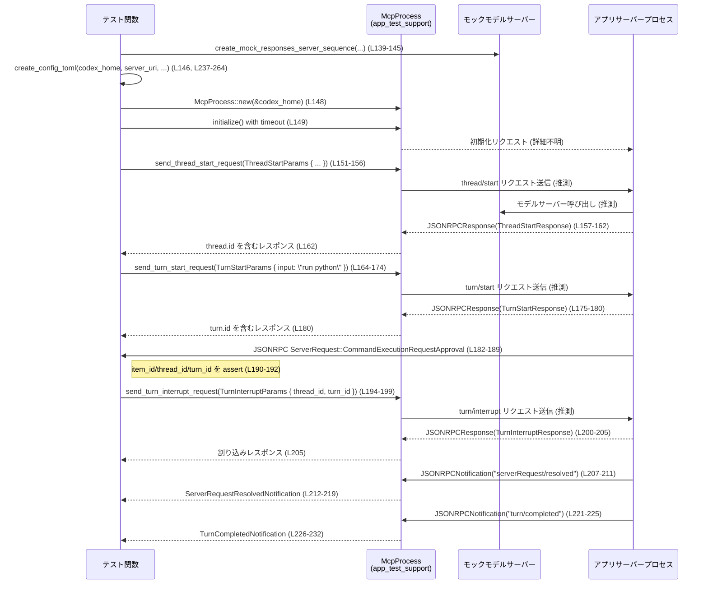

app-server/tests/suite/v2/turn_interrupt.rs

---

## 0. ざっくり一言

このテストファイルは、v2 API における「turn interrupt（ターン中断）」の挙動を検証するための統合テスト群です。  
実際に `McpProcess` を立ち上げ、モックのモデルサーバーと対話しながら、長時間実行中のターンや承認待ちコマンドが割り込みによって正しく処理終了・解決されることを確認します（L27-235）。

---

## 1. このモジュールの役割

### 1.1 概要

- このモジュールは **v2 の turn interrupt 機能が正しく動作するか** を確認するために存在し、  
  **(1) 実行中のターンが割り込みで中断されること**（L27-123）と  
  **(2) コマンド承認待ちのサーバーリクエストが割り込みで解決されること**（L125-235）  
  をテストします。
- 実際のアプリケーションサーバーを `McpProcess` 経由で操作し、JSON-RPC ベースのプロトコルメッセージを往復させる「エンドツーエンド寄りのテスト」です（L3-23, L55-57, L148-149）。

### 1.2 アーキテクチャ内での位置づけ

- このファイルは **Unix 環境限定の統合テスト** です（`#![cfg(unix)]`, L1）。
- 主な依存先:
  - `app_test_support::McpProcess`: アプリサーバープロセスとのやり取りを抽象化するテスト用ユーティリティ（L4, L55, L148）。
  - `app_test_support::create_mock_responses_server_sequence` / `create_shell_command_sse_response`: モデルサーバーのモックを立ち上げるヘルパ（L5-6, L45-52, L139-145）。
  - `codex_app_server_protocol` の各種型（`ThreadStartParams`, `TurnStartParams`, `TurnInterruptParams` など）: JSON-RPC メッセージの型定義（L8-21）。
  - `tokio::time::timeout`: 非同期処理のタイムアウト制御（L23, L56, L65-69, L84-88 ほか）。
  - 標準ライブラリのファイル I/O を使う `create_config_toml` ヘルパ（L237-264）。

依存関係の概略を Mermaid で示します。

```mermaid
graph TD
    %% app-server/tests/suite/v2/turn_interrupt.rs 全体 (L1-264)
    T[turn_interrupt.rs<br/>(テストモジュール)] --> MCP[McpProcess<br/>(app_test_support)]
    T --> MockSrvHelpers[create_mock_responses_server_sequence<br/>create_shell_command_sse_response<br/>(app_test_support)]
    T --> Proto[codex_app_server_protocol<br/>各種メッセージ型]
    T --> TokioTimeout[tokio::time::timeout]
    T --> TempDir[tempfile::TempDir]
    T --> FS[std::fs<br/>/ create_config_toml]
    MCP --> "App Server プロセス"(外部プロセス)
    MockSrvHelpers --> "モックモデルサーバー"(HTTPサーバー)
```

※ `McpProcess` やモックサーバーヘルパの中身はこのチャンクには現れないため、内部実装は不明です。

### 1.3 設計上のポイント

- **非同期テスト**  
  - すべてのテストは `#[tokio::test]` でマークされており、`async fn` として定義されています（L27, L125）。  
  - `tokio::time::timeout` を併用し、ハングしないようにしています（L56, L65-69, L84-88 ほか）。
- **一時ディレクトリと独立した環境**  
  - `tempfile::TempDir` を使ってテストごとに専用の `codex_home` と `workdir` を作成し（L39-43, L133-137）、  
    `create_config_toml` でその中に `config.toml` を生成します（L53, L146, L237-264）。
- **プロトコルレベルでの検証**  
  - スレッド開始・ターン開始・ターン中断の各リクエストに対して、  
    JSON-RPC レスポンス・通知を待ち受け、型安全にデシリアライズしてアサートします（L58-120, L151-163, L164-180, L182-232）。
- **タイムアウトによる安全性**  
  - デフォルトの読み取りタイムアウトを定数 `DEFAULT_READ_TIMEOUT = 10秒` として定義し（L25）、  
    すべての読み取り操作に適用することで、テストが無期限にブロックしないようにしています（L56, L65-69, L84-88 ほか）。
- **プラットフォーム依存コードの制御**  
  - ファイル全体が `cfg(unix)` でガードされている一方、Windows 用のシェルコマンド定義も条件付きで用意されています（L1, L30-37）。  
    実際には Unix ビルドでのみコンパイルされるため、Windows 分岐はこのファイル単体では到達しません。

---

## 2. 主要な機能一覧

このモジュールが提供する「機能」（＝テストシナリオ・ヘルパ）を列挙します。

- `turn_interrupt_aborts_running_turn`:  
  長時間実行中のターンに対して turn interrupt を送信すると、ターンが `TurnStatus::Interrupted` として完了通知されることを検証します（L27-123）。
- `turn_interrupt_resolves_pending_command_approval_request`:  
  コマンド実行承認リクエストが保留中の状態で turn interrupt を送信すると、そのサーバーリクエストが `serverRequest/resolved` 通知で解決され、同時にターンが中断として完了することを検証します（L125-235）。
- `create_config_toml`:  
  テスト用の `config.toml` を指定した `codex_home` 配下に生成し、モックモデルサーバーの URL や承認ポリシー・サンドボックスモードを設定します（L237-264）。

---

## 3. 公開 API と詳細解説

### 3.1 型一覧（構造体・列挙体など）

このファイル内で **新しく定義されている型（構造体・列挙体など）はありません**。  
利用している主な外部型のみ参考として挙げます。

| 名前 | 種別 | 定義元 | 役割 / 用途 | 根拠 |
|------|------|--------|-------------|------|
| `JSONRPCNotification` | 構造体 | `codex_app_server_protocol` | JSON-RPC 通知メッセージを表現 | L8 |
| `JSONRPCResponse` | 構造体 | 同上 | JSON-RPC レスポンスメッセージを表現 | L9 |
| `ServerRequest` | 列挙体 | 同上 | サーバー側からクライアントへのリクエスト種別を表現 | L11, L187 |
| `ThreadStartParams` | 構造体 | 同上 | スレッド開始リクエストのパラメータ | L13, L60-63, L152-155 |
| `ThreadStartResponse` | 構造体 | 同上 | スレッド開始レスポンス（thread ID 含む） | L14, L70, L162 |
| `TurnStartParams` | 構造体 | 同上 | ターン開始リクエストのパラメータ | L18, L74-82, L165-173 |
| `TurnStartResponse` | 構造体 | 同上 | ターン開始レスポンス（turn ID 含む） | L19, L89, L180 |
| `TurnInterruptParams` | 構造体 | 同上 | ターン中断リクエストのパラメータ | L16, L97-100, L195-198 |
| `TurnInterruptResponse` | 構造体 | 同上 | ターン中断レスポンス | L17, L107, L205 |
| `TurnCompletedNotification` | 構造体 | 同上 | ターン完了通知の内容（status 等） | L15, L114-120, L226-232 |
| `TurnStatus` | 列挙体 | 同上 | ターン状態（Interrupted など） | L20, L120, L232 |
| `V2UserInput` | 別名 | 同上 | v2 のユーザー入力種別（Text など） | L21, L76-79, L167-170 |
| `ServerRequestResolvedNotification` | 構造体 | 同上 | サーバーリクエストの解決通知 | L12, L212-219 |

※ これらの型の内部フィールドの詳細は、このチャンクには現れないため不明です。

### 3.2 関数詳細

#### `turn_interrupt_aborts_running_turn() -> Result<()>`

```rust
#[tokio::test]
async fn turn_interrupt_aborts_running_turn() -> Result<()> { /* ... */ }
```

**概要**

- 長時間実行するシェルコマンド（`sleep 10` 相当）を呼び出すターンを開始し、その途中で `turn/interrupt` リクエストを送信します。
- その結果として、`turn/completed` 通知が届き、`TurnStatus::Interrupted` になっていることを検証します（L27-123）。

**引数**

- なし（テスト関数のため、外部からの引数は取りません）。

**戻り値**

- `anyhow::Result<()>`（L27）  
  - 正常にテストが完了した場合は `Ok(())` を返します（L122）。  
  - 設備構築・通信・シリアライズなどでエラーが発生した場合は `Err` になり、テストとしては失敗になります（`?` 演算子による伝播、L39, L41, L43, L45-52, L53, L55-57, L64, L69-70, L83-89, L101, L106-107, L113-118）。

**内部処理の流れ**

1. **シェルコマンドの選択**  
   - Unix では `["sleep", "10"]`、Windows では PowerShell の `Start-Sleep` を使うベクタを定義します（L30-37）。  
   - ファイル全体が `cfg(unix)` のため、実際には Unix 分岐が有効です（L1, L36-37）。
2. **一時ディレクトリと作業ディレクトリの準備**  
   - `TempDir::new()` で一時ディレクトリを作成し（L39）、  
     その配下に `codex_home` と `workdir` ディレクトリを作成します（L40-43）。
3. **モックサーバーと config.toml の設定**  
   - `create_shell_command_sse_response` を使い、指定シェルコマンドを実行するモック SSE レスポンスを構築し（L45-51）、  
     それを `create_mock_responses_server_sequence` に渡して HTTP モックサーバーを起動します（L45-52）。  
   - `create_config_toml` で `codex_home/config.toml` を書き出し、  
     モデルとしてこのモックサーバーを指すように設定します（approval_policy="never", sandbox_mode="danger-full-access", L53, L237-264）。
4. **McpProcess の初期化**  
   - `McpProcess::new(&codex_home)` でアプリサーバープロセスを表現するインスタンスを生成し（L55）、  
     `timeout(DEFAULT_READ_TIMEOUT, mcp.initialize()).await??;` で初期化処理をタイムアウト付きで完了させます（L56）。
     - ここで `??` は二重の `Result`（timeout の `Result` と `initialize` の `Result`）をアンラップします。
5. **スレッド開始リクエスト・レスポンス処理**  
   - `send_thread_start_request(ThreadStartParams { ... })` でスレッド開始リクエストを送り（L58-64）、  
     対応する `JSONRPCResponse` を `read_stream_until_response_message(RequestId::Integer(thread_req))` で待ち受けます（L65-69）。  
   - 受信したレスポンスを `to_response::<ThreadStartResponse>` で型変換し、`thread.id` を取得します（L70）。
6. **長時間実行コマンドをトリガーするターン開始**  
   - `send_turn_start_request` で `"run sleep"` というユーザー入力を持つターンを開始し（L73-82）、  
     同様にレスポンスを待ち受けて `turn.id` を取得します（L84-89）。
7. **少し待機してコマンド開始を保証**  
   - `tokio::time::sleep(Duration::from_secs(1)).await;` で 1 秒待機し、`sleep` コマンドが実行中である可能性を高めます（L91-92）。
8. **ターンの中断リクエストとレスポンス処理**  
   - `TurnInterruptParams { thread_id, turn_id }` を指定して `send_turn_interrupt_request` を発行し（L96-101）、  
     対応するレスポンスを `TurnInterruptResponse` として受信します（L102-107）。
9. **ターン完了通知の検証**  
   - `"turn/completed"` メソッドの通知が届くまで待ち（L109-113）、  
     `TurnCompletedNotification` にデシリアライズして（L114-118）、  
     - `completed.thread_id == thread_id`（L119）  
     - `completed.turn.status == TurnStatus::Interrupted`（L120）  
     を `assert_eq!` で検証します。

**Examples（使用例）**

この関数自体は `#[tokio::test]` によってテストランナーから自動的に呼び出されます。  
同様のパターンで、別の長時間コマンドをテストしたい場合の簡略化例を示します。

```rust
// 別のコマンドで「中断されること」を確認するテストのイメージ例
#[tokio::test]
async fn interrupt_long_running_custom_command() -> anyhow::Result<()> {
    // 一時ディレクトリや config.toml を準備する（turn_interrupt.rs:L39-53 を参照）
    let tmp = tempfile::TempDir::new()?;                       // 一時ディレクトリ作成
    let codex_home = tmp.path().join("codex_home");            // codex_home パス
    std::fs::create_dir(&codex_home)?;                         // codex_home ディレクトリ作成

    // モックサーバー・McpProcess をセットアップ（詳細は本ファイルの実装と同様）
    // ...

    // thread を開始 → turn を開始 → interrupt → "turn/completed" を検証
    // という流れは turn_interrupt_aborts_running_turn と同様です。
    Ok(())
}
```

**Errors / Panics**

- **`?` によるエラー伝播**（テスト失敗扱い）
  - ファイル・ディレクトリ作成 (`TempDir::new`, `std::fs::create_dir`) が失敗した場合（L39-43）。
  - モックサーバー関連ヘルパの呼び出し（L45-52）、`create_config_toml`（L53）。
  - `McpProcess::new` や `initialize` が失敗した場合（L55-56）。
  - JSON-RPC レスポンス／通知の受信および変換（`to_response`, `serde_json::from_value` など）が失敗した場合（L70, L89, L114-118）。
- **`timeout` によるタイムアウト**
  - `timeout(DEFAULT_READ_TIMEOUT, ...)` が `Elapsed` を返した場合、最初の `?` でエラーになりテスト失敗となります（L56, L65-69, L84-88, L102-106, L109-113）。
- **panic の可能性**
  - `expect("turn/completed params must be present")` が失敗した場合（`params` が `None` の場合）、`panic!` が発生します（L115-117）。
  - `assert_eq!` が失敗した場合（thread_id や status が想定と異なる場合）も `panic!` となりテスト失敗になります（L119-120）。

**Edge cases（エッジケース）**

- モックサーバーが応答しない / 違うメッセージを返す:
  - `read_stream_until_*` がタイムアウトするか、`to_response` / `serde_json::from_value` が失敗し、テストは Err または panic になります（L65-69, L84-88, L102-107, L109-118）。
- `turn/completed` 通知が複数回来る場合:
  - このテストでは最初の 1 件のみ検証し、それ以降の通知は無視されます（L109-120）。
- 割り込みが間に合わず、コマンドが先に終了した場合:
  - その場合でも、実装が `TurnStatus::Completed` など別ステータスを返すなら `assert_eq!` が失敗し、テストがバグを検出します（L119-120）。

**使用上の注意点**

- すべての I/O を `timeout` で囲んでいるため、環境が極端に遅い場合にはテストがタイムアウトとして失敗する可能性があります（L25, L56 ほか）。
- 実際に `sleep 10` 相当のコマンドを起動するため、**割り込みが動作しない場合はテスト全体の実行時間が長くなる**可能性があります（L31-37, L45-51）。  
  ただし、各待ち受けは 10 秒でタイムアウトするため、無限にハングすることはありません（L25）。

---

#### `turn_interrupt_resolves_pending_command_approval_request() -> Result<()>`

```rust
#[tokio::test]
async fn turn_interrupt_resolves_pending_command_approval_request() -> Result<()> { /* ... */ }
```

**概要**

- 外部コマンド実行に対する「承認リクエスト」がクライアントに届いている状態で、  
  `turn/interrupt` を送信するとどうなるかを検証するテストです。
- 期待する挙動は:
  1. サーバーから `ServerRequest::CommandExecutionRequestApproval` が届く（承認待ち状態）（L182-189）。
  2. 割り込み後に `serverRequest/resolved` 通知が届き、承認リクエストが解決される（L207-219）。
  3. さらに `turn/completed` 通知が `TurnStatus::Interrupted` で届く（L221-232）。

**引数**

- なし。

**戻り値**

- `anyhow::Result<()>`（L125）。  
  正常完了時は `Ok(())`（L234）、エラー時は `Err` となります（`?` による伝播、L133-137, L139-145, L146, L148-149, L156-162, L174-180, L186-187, L199-205, L211-217, L225-230）。

**内部処理の流れ**

1. **Python コマンドの設定**  
   - `["python3", "-c", "print(42)"]` という簡単なコマンドを定義します（L127-131）。  
     これはコマンド実行承認フローをトリガーする用途と思われますが、詳細はモックサーバー側実装に依存します（コード上のコメントや定義はこのチャンクにはありません）。
2. **一時ディレクトリと config.toml**  
   - 前のテストと同様に `TempDir`、`codex_home`、`workdir` を作成し（L133-137）、  
     `create_shell_command_sse_response` と `create_mock_responses_server_sequence` によりモックサーバーを起動します（L139-145）。  
   - 今回は `approval_policy="untrusted"`、`sandbox_mode="read-only"` を指定して `config.toml` を生成します（L146, L237-264）。
3. **McpProcess の初期化・スレッド開始**  
   - `McpProcess::new` と `initialize`（タイムアウト付き）でプロセスを準備し（L148-149）、  
     `send_thread_start_request` / レスポンスの待ち受けとパースで `thread.id` を得ます（L151-162）。
4. **ターン開始（Python 実行）**  
   - `"run python"` というテキスト入力を持つターンを開始し（L164-173）、  
     対応するレスポンスから `turn.id` を取得します（L175-180）。
5. **承認リクエストの受信**  
   - `mcp.read_stream_until_request_message()` でサーバーからのリクエストを待ち受け（L182-186）、  
     `ServerRequest::CommandExecutionRequestApproval { request_id, params }` パターンでマッチさせます（L187-189）。  
   - `params.item_id == "call_python_approval"`、`params.thread_id == thread.id`、`params.turn_id == turn.id` を確認し、  
     正しいターンに対する承認リクエストであることをアサートします（L190-192）。
6. **ターン中断とレスポンス確認**  
   - 先ほど取得した `thread.id` と `turn.id` を使って `send_turn_interrupt_request` を送り（L194-199）、  
     レスポンスを `TurnInterruptResponse` として受信します（L200-205）。
7. **承認リクエストの解決通知**  
   - `"serverRequest/resolved"` 通知を待ち受け（L207-211）、  
     `ServerRequestResolvedNotification` にデシリアライズして（L212-217）、  
     `resolved.thread_id == thread.id` と `resolved.request_id == request_id` をアサートします（L218-219）。
8. **ターン完了通知の検証**  
   - 続いて `"turn/completed"` 通知を待ち（L221-225）、  
     これを `TurnCompletedNotification` に変換し（L226-230）、  
     `thread_id` と `TurnStatus::Interrupted` を確認します（L231-232）。

**Examples（使用例）**

同様の承認待ち → 割り込み → 解決通知 のフローを新しいコマンド種別でテストしたい場合のイメージです。

```rust
// 新しい承認種別に対して同様の挙動を確認するテストのイメージ
#[tokio::test]
async fn interrupt_resolves_custom_approval() -> anyhow::Result<()> {
    // McpProcess や thread/turn 開始までのセットアップは
    // turn_interrupt_resolves_pending_command_approval_request と同様です。

    // 1. server からの ServerRequest を待つ
    let request = tokio::time::timeout(DEFAULT_READ_TIMEOUT, mcp.read_stream_until_request_message()).await??;

    // 2. 期待する approval リクエストであることを match & assert する
    if let ServerRequest::CommandExecutionRequestApproval { request_id, params } = request {
        // params.item_id や thread_id/turn_id を確認
        // ...
        // 3. turn interrupt を送って resolved/turn.completed を検証
    } else {
        panic!("unexpected server request variant");
    }

    Ok(())
}
```

**Errors / Panics**

- **`?` によるエラー伝播**
  - ファイル・ディレクトリ作成、モックサーバー作成、config 書き込みなど（L133-137, L139-146）。
  - `McpProcess` の生成・初期化（L148-149）。
  - JSON-RPC のレスポンス／リクエスト／通知の受信および変換（L156-162, L174-180, L186-187, L199-205, L211-217, L225-230）。
- **`timeout` によるタイムアウト**
  - いずれかのリクエスト／通知が所定時間内に届かない場合、`Elapsed` エラーとしてテスト失敗になります（L148-149, L157-161, L175-179, L182-186, L200-204, L207-211, L221-225）。
- **panic**
  - `let ServerRequest::CommandExecutionRequestApproval { ... } = request else { panic!(...) };` （L187-189）で、  
    期待していない種類の `ServerRequest` が来た場合に panic します。
  - `expect("serverRequest/resolved params must be present")`（L216-217）や `expect("turn/completed params must be present")`（L229-230）が失敗した場合。
  - `assert_eq!` で `item_id` / `thread_id` / `turn_id` / `status` などが一致しない場合（L190-192, L218-219, L231-232）。

**Edge cases（エッジケース）**

- サーバーが `CommandExecutionRequestApproval` 以外の `ServerRequest` を送ってくる場合:
  - `panic!("expected CommandExecutionRequestApproval request")`（L188）で即座にテスト失敗となり、プロトコルの変化や実装バグを検出できます。
- `serverRequest/resolved` が届かずに `turn/completed` のみ届く場合:
  - `serverRequest/resolved` の待ち受けでタイムアウトまたは `params` 欠如によるエラーとなり、テストが失敗します（L207-217）。
- 解決された `request_id` が一致しない場合:
  - `assert_eq!(resolved.request_id, request_id)` が失敗し、テストが失敗します（L219）。

**使用上の注意点**

- このテストは **承認リクエストが必ず 1 回だけ来る** ことを前提としています（L182-189）。  
  実装が複数回リトライを行う場合などは、`read_stream_until_request_message()` の挙動に依存します。
- `approval_policy="untrusted"` と `sandbox_mode="read-only"` という設定を前提にしているため（L146, L237-261）、  
  設定値の意味が変わるとテストの前提も変わる可能性があります（詳細は設定の仕様に依存し、このチャンクからは分かりません）。

---

#### `create_config_toml(codex_home, server_uri, approval_policy, sandbox_mode) -> std::io::Result<()>`

```rust
fn create_config_toml(
    codex_home: &std::path::Path,
    server_uri: &str,
    approval_policy: &str,
    sandbox_mode: &str,
) -> std::io::Result<()> { /* ... */ }
```

**概要**

- 渡された `codex_home` ディレクトリ配下に `config.toml` を生成し、  
  モデル設定やモックモデルプロバイダの接続先 URL を記述するヘルパ関数です（L237-264）。

**引数**

| 引数名 | 型 | 説明 | 根拠 |
|--------|----|------|------|
| `codex_home` | `&std::path::Path` | `config.toml` を配置するベースディレクトリ | L238-240 |
| `server_uri` | `&str` | モックモデルサーバーのベース URI（例: `"http://127.0.0.1:12345"`） | L240, L255-257 |
| `approval_policy` | `&str` | 承認ポリシーを示す文字列（例: `"never"`, `"untrusted"`） | L241, L250 |
| `sandbox_mode` | `&str` | サンドボックスモードを示す文字列（例: `"danger-full-access"`, `"read-only"`） | L242, L251 |

**戻り値**

- `std::io::Result<()>`（L243）  
  - ファイル書き込みが成功すれば `Ok(())`。  
  - 書き込み途中で I/O エラーが発生した場合は `Err(std::io::Error)` が返ります（L245-263）。

**内部処理の流れ**

1. `codex_home.join("config.toml")` で設定ファイルのパスを組み立てます（L244）。
2. `std::fs::write` で TOML 形式の文字列をファイルに書き込みます（L245-263）。
   - `format!` マクロで埋め込まれる内容は以下です（L248-261）。
     - `model = "mock-model"`（L249）
     - `approval_policy = "{approval_policy}"`（L250）
     - `sandbox_mode = "{sandbox_mode}"`（L251）
     - `model_provider = "mock_provider"`（L253）
     - `[model_providers.mock_provider]` セクションで
       - `name = "Mock provider for test"`（L256）
       - `base_url = "{server_uri}/v1"`（L257）
       - `wire_api = "responses"`（L258）
       - `request_max_retries = 0`（L259）
       - `stream_max_retries = 0`（L260）

**Examples（使用例）**

```rust
// テストセットアップでの利用例（turn_interrupt.rs:L53, L146 と同様）
let codex_home = tmp.path().join("codex_home");             // codex_home ディレクトリ
std::fs::create_dir(&codex_home)?;                          // ディレクトリ作成

let server = create_mock_responses_server_sequence(/* ... */).await; // モックサーバー
create_config_toml(
    &codex_home,
    &server.uri(),
    "untrusted",                                            // approval_policy
    "read-only",                                            // sandbox_mode
)?;                                                         // I/O エラー時は ? で伝播
```

**Errors / Panics**

- `std::fs::write` がエラーになった場合（ディレクトリが存在しない、権限がない等）、`Err(std::io::Error)` を返します（L245-263）。
- この関数内では `panic!` を発生させるコードはありません。

**Edge cases（エッジケース）**

- `codex_home` が存在しない場合:
  - `codex_home.join("config.toml")` 自体は成功しますが、`std::fs::write` がディレクトリ未存在により失敗する可能性があります（L244-245）。
- `server_uri`・`approval_policy`・`sandbox_mode` に不正な文字列を渡した場合:
  - この関数内では検証を行わず、そのまま TOML に書き込みます（L248-261）。  
    実際の意味づけはアプリケーション側の設定読み込みロジックに依存します。

**使用上の注意点**

- 呼び出し前に `codex_home` ディレクトリが存在している必要があります（本ファイル内では `std::fs::create_dir` を先に呼んでいます、L41, L136）。
- テストではモック専用の設定であることを前提としているため、**本番環境の設定生成には流用しない方が安全**です（この点は命名と内容からの推測であり、コード上に直接の明示はありません）。

---

### 3.3 その他の関数

このファイルで定義されている関数は上記 3 つのみです。  
補助的な関数や単純なラッパー関数は他に存在しません（L27-123, L125-235, L237-264）。

---

## 4. データフロー

ここでは、より複雑な 2 つ目のテスト  
`turn_interrupt_resolves_pending_command_approval_request`（L125-235）を例に、データフローを説明します。

### 処理の要点（文章）

1. テストコードが `TempDir` と `create_config_toml` を使って、モックモデルサーバーに接続する設定を持つ `codex_home` を用意します（L133-137, L146, L237-264）。
2. `McpProcess` を初期化し、`ThreadStartParams` を送信してスレッドを開始します（L148-149, L151-162）。
3. `"run python"` 入力を含む `TurnStartParams` を送ってターンを開始し、`turn.id` を取得します（L164-173, L175-180）。
4. サーバーから `ServerRequest::CommandExecutionRequestApproval` が届くまで待機し、`thread.id` / `turn.id` との整合性を確認します（L182-192）。
5. 同じ `thread.id` / `turn.id` を指定して `TurnInterruptParams` を送信し、割り込みを要求します（L194-199）。
6. 割り込みの結果として:
   - まず `serverRequest/resolved` 通知が届き、元の `request_id` が解決されたことを確認します（L207-219）。
   - 次に `turn/completed` 通知が届き、その `status` が `TurnStatus::Interrupted` であることを確認します（L221-232）。

### シーケンス図（Mermaid）



※ AppSrv や MockSrv に対する呼び出し内容は、関数名とコメントからの推測であり、このチャンクには直接の実装は現れません。

---

## 5. 使い方（How to Use）

このファイルはテスト専用ですが、`McpProcess` を用いた v2 プロトコルテストの典型的な書き方として参考になります。

### 5.1 基本的な使用方法

1 つのターンを開始してから割り込みを送るまでの、最小限のフロー例を示します。

```rust
// 設定や依存オブジェクトを用意する（turn_interrupt.rs:L133-137, L237-264 を簡略化）
let tmp = tempfile::TempDir::new()?;                          // 一時ディレクトリ作成
let codex_home = tmp.path().join("codex_home");               // codex_home パス
std::fs::create_dir(&codex_home)?;                            // codex_home ディレクトリ作成

// モックモデルサーバーを起動（turn_interrupt.rs:L139-145 相当）
let server = create_mock_responses_server_sequence(/* ... */).await;

// config.toml を作成
create_config_toml(&codex_home, &server.uri(), "untrusted", "read-only")?;

// McpProcess を初期化（turn_interrupt.rs:L148-149 と同様）
let mut mcp = McpProcess::new(&codex_home).await?;
tokio::time::timeout(DEFAULT_READ_TIMEOUT, mcp.initialize()).await??;

// スレッドを開始して ID を取得（L151-162）
let thread_req = mcp.send_thread_start_request(ThreadStartParams::default()).await?;
let thread_resp = tokio::time::timeout(
    DEFAULT_READ_TIMEOUT,
    mcp.read_stream_until_response_message(RequestId::Integer(thread_req)),
).await??;
let ThreadStartResponse { thread, .. } = to_response::<ThreadStartResponse>(thread_resp)?;

// ターンを開始して ID を取得（L164-180 と同様）
let turn_req = mcp.send_turn_start_request(TurnStartParams {
    thread_id: thread.id.clone(),
    input: vec![V2UserInput::Text { text: "run something".into(), text_elements: vec![] }],
    ..Default::default()
}).await?;
let turn_resp = tokio::time::timeout(
    DEFAULT_READ_TIMEOUT,
    mcp.read_stream_until_response_message(RequestId::Integer(turn_req)),
).await??;
let TurnStartResponse { turn } = to_response::<TurnStartResponse>(turn_resp)?;

// 割り込みを送信して turn/completed を検証（L194-205, L221-232 のパターン）
let interrupt_id = mcp.send_turn_interrupt_request(TurnInterruptParams {
    thread_id: thread.id.clone(),
    turn_id: turn.id.clone(),
}).await?;
let interrupt_resp = tokio::time::timeout(
    DEFAULT_READ_TIMEOUT,
    mcp.read_stream_until_response_message(RequestId::Integer(interrupt_id)),
).await??;
let _ = to_response::<TurnInterruptResponse>(interrupt_resp)?;
```

この例と実際のテストとの差分は、通知や承認リクエストに対するアサートの有無です。

### 5.2 よくある使用パターン

- **長時間実行タスクの中断テスト**（L27-123）
  - 実際に長時間実行するコマンドを走らせ、途中で `turn/interrupt` を送信して `TurnStatus::Interrupted` を確認するパターン。
- **ユーザー承認フロー＋中断**（L125-235）
  - `ServerRequest::CommandExecutionRequestApproval` を待ち受け、承認前に割り込みを送信し、  
    `serverRequest/resolved` および `turn/completed` の整合性を検証するパターン。

両者とも、

1. thread start → response で `thread.id` を取得
2. turn start → response で `turn.id` を取得
3. 必要なら server request / notification を待つ
4. turn interrupt → response
5. 通知（`serverRequest/resolved` や `turn/completed`）を検証

という共通パターンに従います。

### 5.3 よくある間違い

このファイルから推測される、誤用しやすそうな点を挙げます。

```rust
// 間違い例: config.toml を作成せずに McpProcess を初期化している
let mut mcp = McpProcess::new(&codex_home).await?;
mcp.initialize().await?; // ← 設定不足で失敗する可能性が高い

// 正しい例: config.toml を作成してから初期化する
create_config_toml(&codex_home, &server.uri(), "untrusted", "read-only")?;
let mut mcp = McpProcess::new(&codex_home).await?;
tokio::time::timeout(DEFAULT_READ_TIMEOUT, mcp.initialize()).await??;
```

```rust
// 間違い例: タイムアウトをかけずに長時間ブロックする読み取りを行っている
let resp = mcp.read_stream_until_response_message(RequestId::Integer(req_id)).await?;

// 正しい例: timeout で包み、ハングを防ぐ
let resp = tokio::time::timeout(
    DEFAULT_READ_TIMEOUT,
    mcp.read_stream_until_response_message(RequestId::Integer(req_id)),
).await??;
```

```rust
// 間違い例: 間違った thread_id/turn_id で interrupt を送ってしまう
let interrupt_id = mcp.send_turn_interrupt_request(TurnInterruptParams {
    thread_id: another_thread_id,  // 別スレッドのID
    turn_id: turn.id.clone(),
}).await?;

// 正しい例: 対応する thread.id / turn.id を使う
let interrupt_id = mcp.send_turn_interrupt_request(TurnInterruptParams {
    thread_id: thread.id.clone(),
    turn_id: turn.id.clone(),
}).await?;
```

### 5.4 使用上の注意点（まとめ）

- **非同期・並行性**
  - すべて `async` + `#[tokio::test]` で動作しており、`await` のたびにタスクスケジューリングが発生します（L27, L56, L65-69 ほか）。
  - `timeout` によるキャンセルは「アプリレベルのタイムアウト」であり、必ずしも基盤プロセスを中断するわけではない点に注意が必要です（L23, L56 ほか）。
- **エラーハンドリング**
  - `anyhow::Result` と `?` を用いることで、I/O やシリアライズの失敗を簡潔に伝播しています（L3, L39-43, L45-53, L55-57 ほか）。
  - `??` パターンにより、「タイムアウトエラー」と「内部の Result エラー」がともに呼び出し元に返ります（L56, L65-69 など）。
- **安全性・セキュリティ観点**
  - `sandbox_mode` に `"danger-full-access"` と `"read-only"` の 2 パターンを明示的にテストしており（L53, L146, L250-251）、  
    サンドボックス境界条件での挙動確認に利用できます。
  - 実際のコマンドとして `sleep` や `python3` を起動しますが、これはテスト用のモックサーバーが発行するコマンドであり、  
    `shell_command` の起源はテストコード内に限定されています（L31-37, L127-131, L45-51, L139-145）。
- **潜在的なバグ検出ポイント**
  - turn interrupt がターンに紐付くすべてのサーバーリクエスト（承認リクエストなど）を確実に解決しているかを、このテストで検証しています（L187-192, L207-219）。  
    もし実装に漏れがあれば、`serverRequest/resolved` が来ない、または `request_id` が一致しないことでテストが失敗します。

---

## 6. 変更の仕方（How to Modify）

### 6.1 新しい機能を追加する場合（例: 別種の割り込みシナリオ）

このファイルのパターンに従って、新しい turn interrupt 関連のテストを追加する場合の流れです。

1. **ベースとなるテストを選ぶ**
   - 単純な「長時間実行コマンドの中断」なら `turn_interrupt_aborts_running_turn`（L27-123）。
   - 承認フローやサーバーリクエストとの連携を含めるなら `turn_interrupt_resolves_pending_command_approval_request`（L125-235）。

2. **モックサーバーシナリオを追加／変更する**
   - `create_mock_responses_server_sequence` と `create_shell_command_sse_response` の呼び出し部分（L45-52, L139-145）を複製し、  
     別の `item_id` やコマンドを使ったシナリオを構成します。

3. **config 設定を調整する**
   - `approval_policy` や `sandbox_mode` を新しいシナリオに合わせて指定します（L53, L146, L250-251）。

4. **thread / turn 開始と ID 取得**
   - 既存テストの `send_thread_start_request` / `send_turn_start_request` パターン（L58-70, L73-89, L151-162, L164-180）を再利用します。

5. **通知・リクエストの期待値をアサート**
   - 新しいシナリオに応じた通知名や `TurnStatus`、`ServerRequest` バリアントを `assert_eq!` や `match` で検証します。

### 6.2 既存の機能を変更する場合

このファイルのテストを変更する際に注意すべき点です。

- **プロトコル契約（Contracts）の確認**
  - `TurnStatus::Interrupted`（L120, L232）やメソッド名 `"turn/completed"`, `"serverRequest/resolved"`（L111, L209, L223）が、  
    プロトコル仕様上の契約になっています。  
    仕様変更に伴いこれらを変更する場合、**サーバー実装・クライアント実装・プロトコル定義**との整合性を確認する必要があります。
- **影響範囲**
  - このテストが落ちる＝ turn interrupt の挙動が変わった可能性が高いため、  
    同じ動作を前提とする他のテストファイル（v2 の他のテストスイート）も確認する必要があります（当該ファイル名はこのチャンクには現れません）。
- **タイムアウト値の変更**
  - `DEFAULT_READ_TIMEOUT`（L25）を変更する場合、  
    ネットワークの遅い環境での安定性とテスト全体の実行時間のトレードオフがあります。  
    あまり短くすると誤検知的なタイムアウトが増え、長くすると失敗検知までの時間が延びます。
- **エラーメッセージ・panic 文言の変更**
  - `expect(...)` や `panic!(...)` のメッセージ（L117, L188, L217, L230）は、  
    テスト失敗時のデバッグに重要です。変更する場合は、失敗原因が分かりやすい文言を維持するのが実務上有用です。

---

## 7. 関連ファイル

このテストモジュールと密接に関係すると思われるファイル・クレートを整理します。

| パス / クレート | 役割 / 関係 | 根拠 |
|-----------------|------------|------|
| `app_test_support::McpProcess` | アプリサーバープロセスとの JSON-RPC 通信や、プロセス管理を行うテスト用ユーティリティ | `use app_test_support::McpProcess;`（L4）, `McpProcess::new`, `initialize`, `send_*` などの使用（L55-57, L148-149 ほか） |
| `app_test_support::create_mock_responses_server_sequence` | モックモデルサーバーを起動し、決められたレスポンスシーケンスを返す HTTP サーバーを生成するヘルパ | `use app_test_support::create_mock_responses_server_sequence;`（L5）, 使用箇所（L45-52, L139-145） |
| `app_test_support::create_shell_command_sse_response` | シェルコマンド実行を表す SSE レスポンスモックを作成するヘルパ | `use app_test_support::create_shell_command_sse_response;`（L6）, 使用箇所（L45-51, L139-144） |
| `app_test_support::to_response` | `JSONRPCResponse` から型付きレスポンス構造体へ変換するユーティリティ | `use app_test_support::to_response;`（L7）, 使用箇所（L70, L89, L107, L162, L180, L205） |
| `codex_app_server_protocol`（各種型） | v2 API の JSON-RPC メッセージフォーマット（リクエスト・レスポンス・通知）を定義するクレート | `use codex_app_server_protocol::*;`（L8-21） |
| `tempfile::TempDir` | テスト用の一時ディレクトリを生成し、自動削除を行う型 | `use tempfile::TempDir;`（L22）, 使用箇所（L39, L133） |
| `tokio::time::timeout` | 非同期処理にタイムアウトを設定するユーティリティ関数 | `use tokio::time::timeout;`（L23）, 使用箇所（L56, L65-69, L84-88, L102-106, L109-113, L149, L157-161, L175-179, L182-186, L200-204, L207-211, L221-225） |

これらのコンポーネントの実装はこのチャンクには含まれていないため、詳細な挙動はそれぞれのモジュールを参照する必要があります。
