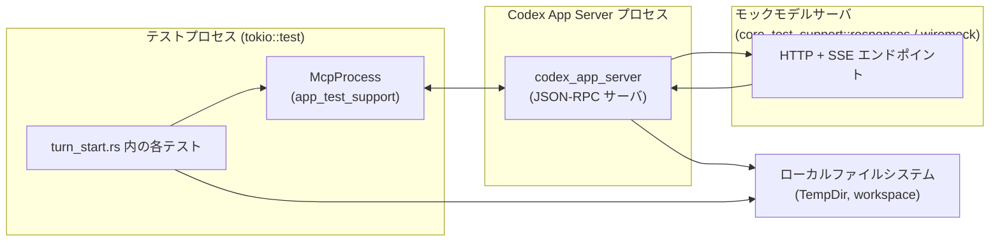
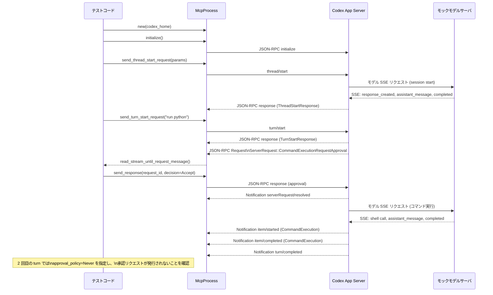

# app-server/tests/suite/v2/turn_start.rs

## 0. ざっくり一言

Codex App Server の v2 `turn/start` JSON-RPC エンドポイント（および関連する `thread/start` やツール呼び出し）の振る舞いを、エンドツーエンドで検証する非同期テスト群です。  
ユーザー入力サイズ制限、コラボレーションモード、パーソナリティ、コマンド実行・ファイル変更の承認フロー、サンドボックス、Collab Agent などの仕様を網羅的に確認します。

---

## 1. このモジュールの役割

### 1.1 概要

このテストモジュールは、Codex App Server の v2 プロトコルにおける **1ターンの開始 (`turn/start`) 処理**の外部仕様を検証します。

- JSON-RPC 経由で `thread/start` → `turn/start` を呼び出すクライアント（`McpProcess`）と、
- モデルプロバイダ用のモック HTTP サーバ（SSE ベース）を用意し、
- その間をつなぐ Codex App Server プロセスの挙動が仕様どおりであることを確認します。

### 1.2 アーキテクチャ内での位置づけ

このファイルのテストが依存する主要コンポーネントと関係は、おおまかに次のようになります。



- テストコードは `McpProcess` を通じて Codex App Server と JSON-RPC で通信します。
- App Server は `config.toml` などを読み込み、`model_provider` としてモックモデルサーバ（SSE）に HTTP リクエストを送信します。
- Workspace や `codex_home` は一時ディレクトリを使い、ファイル変更やコマンド実行時のサンドボックス対象になります。

### 1.3 設計上のポイント

コードから読み取れる設計上の特徴は次のとおりです。

- **責務の分離**
  - モデルサーバのモック（`core_test_support::responses` や `create_mock_responses_server_sequence*`）と、
  - JSON-RPC クライアント兼テストハーネス（`McpProcess`）、
  - コンフィグ生成（`create_config_toml*`）  
  が明確に分割されています。
- **非同期・タイムアウト**
  - すべてのテストは `#[tokio::test]` の `async fn` で記述され、I/O は非同期です。
  - `tokio::time::timeout` で各 RPC/通知の待機にタイムアウトを設定し、テストがハングしないようにしています。
- **安全性と承認フロー**
  - コマンド実行・ファイル変更に対して「承認リクエスト → ユーザ応答 → serverRequest/resolved → 実行完了」というフローが検証されており、デフォルト「untrusted」ポリシーや per-turn の override の仕様を確認しています。
- **機能フラグによる挙動の切り替え**
  - `Feature::Personality`, `Feature::Collab`, `Feature::DefaultModeRequestUserInput`, `Feature::UnifiedExec` などを `config.toml` もしくは `ThreadStartParams::config` で切り替え、パーソナリティ・コラボレーション・統合実行などの機能の ON/OFF をテストしています。
- **入力検証**
  - ユーザ入力の文字数上限、テキスト要素の伝搬、LocalImage 入力など、`TurnStartParams` の入力仕様をエッジケースも含めて検証します。
- **状態の持続性**
  - パーソナリティ移行（Pragmatic へのマイグレーション）、ファイル変更の `AcceptForSession`、信頼レベル（trust_level）が不要に永続化されないことなど、「セッション内／永続設定」の境界をテストしています。

---

## 2. 主要な機能一覧

このモジュールのテストがカバーしている主な機能（＝App Server の外部仕様）は次の通りです。

- Originator ヘッダ:
  - `initialize_with_client_info` で渡した `ClientInfo.name` が、モデルプロバイダへの HTTP リクエストヘッダ `originator` に反映されること。
- ユーザメッセージのテキスト要素:
  - `TurnStartParams.input` に含めた `TextElement` が `ThreadItem::UserMessage` にそのまま反映されること。
- 空のインストラクション override の扱い:
  - `ThreadStartParams.base_instructions` / `developer_instructions` が空文字列の場合、モデルリクエストに無意味な空 instructions や空 developer input_text を含めないこと。
- ユーザ入力サイズ制限:
  - テキスト入力が上限ちょうどなら許可され、複数 `Text` の合計が上限を超えると `INVALID_PARAMS_ERROR_CODE` / `INPUT_TOO_LARGE_ERROR_CODE` で拒否され、`turn/started` が発行されないこと。
- Turn の開始・完了通知とモデル override:
  - `turn/start` が `TurnStartResponse` を返し、`turn/started` / `turn/completed` 通知を発行すること。
  - per-turn の `model` override が受理され、Turn ID が毎回ユニークであること。
- Collaboration mode / コラボ設定:
  - `TurnStartParams.collaboration_mode` で指定したモデル・reasoning_effort が有効になり、thread-level の feature override も含めて適切な instructions が作成されること。
- Personality:
  - per-turn の `personality` override による personality 更新メッセージの挿入、中途の personality 変更、Pragmatic への自動マイグレーションと、その結果としての instructions テキストを検証。
- 入力の種類:
  - `V2UserInput::LocalImage` など非テキスト入力が turn/start で受理されること。
- コマンド実行 approval フロー:
  - デフォルト `approval_policy=untrusted` 下で `CommandExecutionRequestApproval` が発行されること。
  - per-turn の `approval_policy=Never` override により 2 回目以降の turn でこの承認が省略されること。
  - Decline 時にはコマンドが実行されず、ステータスや exit_code が適切であること。
  - Unified Exec (`Feature::UnifiedExec`) で `process_id` が `item/started` および `item/completed` 両方の通知に含まれること。
- サンドボックスとカレントディレクトリ:
  - per-turn の `cwd` と `sandbox_policy` によって、実行コマンドの working directory やアクセス許可が turn ごとに変わること。
  - 危険な sandbox override を行なっても `config.toml` の trust_level や信頼済み workspace が永続化されないこと。
- ファイル変更 approval フロー:
  - `FileChangeRequestApproval` に対する Accept / Decline / AcceptForSession の挙動。
  - Patch 内容（追加/更新されたファイル、diff）が `ThreadItem::FileChange.changes` に表現されること。
  - OutputDelta 通知と completed 通知の順序（`serverRequest/resolved` が先に来ること）。
  - Decline 時にはファイルが作成されないこと。
- Collab Agent の spawn:
  - モデルの関数呼び出し `spawn_agent` に対応する `ThreadItem::CollabAgentToolCall` の `item/started` / `item/completed` を検証。
  - spawn 時に指定された model / reasoning_effort または agent role 設定に基づく「有効モデル」が metadata に反映されること。
  - 子エージェントの thread_id と `CollabAgentStatus` が agent state に含まれること。

---

## 3. 公開 API と詳細解説

このファイル自体はテストモジュールなので新たな公開型は定義していませんが、**外部コンポーネントの API をどう使っているか**が、本質的な仕様を表しています。

### 3.1 型一覧（主に外部から利用される重要型）

| 名前 | 種別 | 定義元 | 役割 / 用途 |
|------|------|--------|-------------|
| `McpProcess` | 構造体 | `app_test_support` | Codex App Server プロセスと JSON-RPC でやりとりするテスト用クライアント。`initialize`, `send_thread_start_request`, `send_turn_start_request` などを提供し、通知/リクエストを待ち受ける。 |
| `ThreadStartParams` | 構造体 | `codex_app_server_protocol` | `thread/start` RPC に渡すパラメータ。`model`, `cwd`, `config` (feature override など) を含む。 |
| `TurnStartParams` | 構造体 | 同上 | `turn/start` RPC のメイン入力。`thread_id`, `input`, `model`, `effort`, `summary`, `personality`, `collaboration_mode`, `approval_policy`, `sandbox_policy`, `cwd` など、多数の override/設定を持つ。 |
| `TurnStartResponse` | 構造体 | 同上 | `turn/start` のレスポンス。新しい turn の `id` と `status` などを含む。 |
| `ThreadItem` | 列挙体 | 同上 | `item/started` / `item/completed` 通知で使われるアイテム型。`UserMessage`, `CommandExecution`, `FileChange`, `CollabAgentToolCall` などのバリアントがある。 |
| `JSONRPCMessage` / `JSONRPCNotification` / `JSONRPCResponse` / `JSONRPCError` | 列挙体/構造体 | `codex_app_server_protocol` | App Server とクライアント間の JSON-RPC メッセージ表現。テストでは型安全にデシリアライズして内容を検査する。 |
| `ServerRequest` | 列挙体 | 同上 | App Server → クライアント方向の「サーバ要求」（承認リクエストなど）。`CommandExecutionRequestApproval` や `FileChangeRequestApproval` を含む。 |
| `FileChangeOutputDeltaNotification` | 構造体 | 同上 | ファイル変更の途中経過（差分）を通知するための型。 |
| `CollabAgentToolCall` / `CollabAgentStatus` | 列挙体 | 同上 | Collab Agent 関連のツール呼び出しとエージェント状態を表現する。 |
| `Feature` / `FEATURES` | 列挙体 / 定数 | `codex_features` | 機能フラグの列挙と、そのメタ情報テーブル。`create_config_toml_with_sandbox` で TOML のキー名に変換するために使用。 |
| `V2UserInput` | 列挙体 | `codex_app_server_protocol` | v2 ユーザー入力。`Text`, `Mention`, `LocalImage` などを表す。入力サイズ制限や LocalImage 入力テストで使用。 |
| `ReasoningEffort`, `ReasoningSummary`, `CollaborationMode`, `Settings`, `Personality` | 構造体/列挙体 | `codex_protocol::config_types` ほか | モデル設定、reasoning モード、サマリー、パーソナリティ、コラボモードなどの高レベル設定。 |

### 3.2 詳細解説（代表的な 7 関数）

#### `turn_start_rejects_combined_oversized_text_input() -> Result<()>`

**概要**

複数の `V2UserInput::Text` の合計文字数が `MAX_USER_INPUT_TEXT_CHARS` を超えた場合に、`turn/start` がエラーを返し、Turn が開始されないことを検証します。

**引数**

- テスト関数なので引数はありません。環境は内部で構築します。

**戻り値**

- `anyhow::Result<()>`  
  - テストが成功すると `Ok(())` を返します。
  - 失敗時は `Err` を返し、テストフレームワークによりテスト失敗となります。

**内部処理の流れ**

1. 一時ディレクトリに `config.toml` を作成し、`Feature::Personality` を有効にして App Server を設定します（`create_config_toml`）。
2. `McpProcess::new` で App Server プロセスを起動し、`initialize()` を `timeout` 付きで呼び出します。
3. `thread/start` を呼び出し、`ThreadStartResponse` から `thread.id` を取得します。
4. 文字列 `first` と `second` を生成し、それぞれの `chars().count()` の合計が `MAX_USER_INPUT_TEXT_CHARS + 1` となるように調整します。
5. 2つの `V2UserInput::Text` を `TurnStartParams.input` に入れて `turn/start` を送信します。
6. `read_stream_until_error_message` で `JSONRPCError` を受信し、以下を検証します。
   - `error.code == INVALID_PARAMS_ERROR_CODE`
   - `error.message == "Input exceeds the maximum length of {MAX_USER_INPUT_TEXT_CHARS} characters."`
   - `error.data` に `input_error_code == INPUT_TOO_LARGE_ERROR_CODE`, `max_chars`, `actual_chars` が含まれる。
7. その後、短いタイムアウト（250ms）付きで `turn/started` 通知を待ち、**通知が来ないこと**（タイムアウトになること）を確認します。

**Examples（使用例）**

このテストは、クライアント側で「入力サイズをサーバに任せる」場合の挙動仕様を示します。  
同等のチェックをクライアントで行いたい場合、次のようなロジックになります（疑似コード）:

```rust
fn validate_total_text_len(inputs: &[V2UserInput]) -> Result<(), String> {
    let total: usize = inputs.iter().filter_map(|input| {
        if let V2UserInput::Text { text, .. } = input {
            Some(text.chars().count())
        } else {
            None
        }
    }).sum();
    
    if total > MAX_USER_INPUT_TEXT_CHARS {
        Err(format!(
            "Input exceeds the maximum length of {MAX_USER_INPUT_TEXT_CHARS} characters."
        ))
    } else {
        Ok(())
    }
}
```

**Errors / Panics**

- App Server が期待どおり `JSONRPCError` を返さない場合、あるいは `turn/started` 通知が届いた場合、`assert_eq!` / `assert!` によりテストはパニックします。
- `timeout` が切れた場合は `Err` になり、テスト失敗として扱われます。

**Edge cases（エッジケース）**

- テキスト入力が 1 つだけで上限を超えるケースは別のテストでなく、このテストでは「複数 Text の合計」である点が特徴です。
- `Mention` などの非テキスト入力は文字数にカウントされていないことを、`turn_start_accepts_text_at_limit_with_mention_item` が補完的に検証しています。

**使用上の注意点**

- App Server 側の仕様として、「サーバはユーザー入力全体の文字数を集計し、上限を超える場合は RPC エラーを返して turn を開始しない」という契約が、このテストにより事実上ドキュメント化されています。
- クライアント実装で同等の検証を行う場合、サーバ側と同じカウント規則（`chars().count()` での Unicode スカラー値数）を採用する必要があります。

---

#### `turn_start_emits_notifications_and_accepts_model_override() -> Result<()>`

**概要**

`turn/start` が正しく `turn/started` と `turn/completed` 通知を発行すること、また per-turn の `model` override が働き、Turn ID が一意であることを検証します。

**内部処理の流れ**

1. モックモデルサーバに 3 つの SSE レスポンスを登録します（session start + 2 回の turn 用）。
2. `config.toml` を作成し、Personality 機能を有効にします。
3. `thread/start` を呼び出して `thread.id` を取得します。
4. **1 回目の turn**:
   - `TurnStartParams` に `thread_id` と簡単な Text 入力のみを指定して `turn/start` を送信。
   - `TurnStartResponse` から `turn.id` を取得し、非空であることを確認。
   - `turn/started` 通知を受信し、`thread_id`, `turn.status == InProgress`, `turn.id` を検証。
   - `turn/completed` 通知を受信し、`status == Completed` を検証。
5. **2 回目の turn**:
   - 同じ `thread_id` で `model: Some("mock-model-override".to_string())` を指定して `turn/start`。
   - 新しい `turn2.id` が返ること、かつ `turn.id != turn2.id` であることを検証。
   - 同様に `turn/started` / `turn/completed` 通知を検証。

**Examples（使用例）**

テストコードと同じパターンで、クライアントから 2 回目以降の turn に異なるモデルを指定する例:

```rust
// thread/start 済みで thread.id がある前提
let first_turn = mcp.send_turn_start_request(TurnStartParams {
    thread_id: thread.id.clone(),
    input: vec![V2UserInput::Text { text: "Hello".into(), text_elements: vec![] }],
    ..Default::default()
}).await?;

// 2 turn 目だけ別モデルを使う
let second_turn = mcp.send_turn_start_request(TurnStartParams {
    thread_id: thread.id.clone(),
    input: vec![V2UserInput::Text { text: "Second".into(), text_elements: vec![] }],
    model: Some("mock-model-override".into()),
    ..Default::default()
}).await?;
```

**Errors / Panics**

- 通知が届かない、あるいは status / id が一致しない場合は `assert_eq!` 等でテストがパニックします。
- モックモデルサーバのレスポンス順が期待と異なる場合にも、通知のパースに失敗してテストが失敗します。

**Edge cases**

- `model` override がない場合には thread-level のデフォルトモデルが使用されることも同時に確認しています。
- 複数 turn で同じ `thread_id` を共有しつつ、turn ID は毎回新規である前提を採用しています。

**使用上の注意点**

- クライアント実装においても、「`TurnStartResponse.turn.id` と `turn/started` / `turn/completed` の `turn.id` は同一」「`thread.id` と組み合わせて turn を識別する」という前提で状態管理するのが安全です。

---

#### `turn_start_exec_approval_toggle_v2() -> Result<()>`

**概要**

コマンド実行の承認ポリシーが、`config.toml` のデフォルト (`untrusted`) と per-turn override (`approval_policy=Never`) でどのように切り替わるかを検証します。

**内部処理の流れ**

1. 一時ディレクトリを `codex_home` として作成します。
2. モックモデルサーバに 4 つの SSE レスポンス（2 回分のコマンド呼び出し＋各 turn の完了）を設定します。
3. `approval_policy = "untrusted"` で `config.toml` を作り、App Server を起動します。
4. `thread/start` で `thread.id` を取得します。
5. **1 回目の turn**（デフォルト `untrusted`）:
   - `TurnStartParams` に `input: "run python"` のみ指定して `turn/start` を送信。
   - ack (`TurnStartResponse`) を受け取る。
   - その後 `read_stream_until_request_message()` で `ServerRequest::CommandExecutionRequestApproval` を待ち、`params.item_id == "call1"` を確認。
   - `decision: Accept` を含む `CommandExecutionRequestApprovalResponse` を送信。
   - 以降のメッセージを監視し、`serverRequest/resolved` が先に届き、その後 `turn/completed` が届くことを検証。
6. **2 回目の turn**（per-turn override）:
   - `approval_policy: Some(AskForApproval::Never)`, `sandbox_policy: DangerFullAccess` などを指定して `turn/start`。
   - ack を受け取る。
   - `read_stream_until_notification_message("turn/completed")` で turn 完了まで待機するが、その間に `CommandExecutionRequestApproval` が届かないことを暗黙的に確認（このヘルパーは Request を見つけるとエラーになる実装であることが他テストのコメントから読み取れます）。

**Examples（使用例）**

承認ダイアログを UI で出したいクライアントは、次のようなパターンになります。

```rust
// ServerRequest::CommandExecutionRequestApproval を受け取ったとき
if let ServerRequest::CommandExecutionRequestApproval { request_id, params } = server_req {
    // params.item_id, params.thread_id, params.turn_id からコンテキストを表示しユーザーに確認
    let user_decision = ask_user_for_approval(&params); // UI 側の処理

    mcp.send_response(
        request_id,
        serde_json::to_value(CommandExecutionRequestApprovalResponse {
            decision: user_decision,
        })?,
    ).await?;
}
```

**Errors / Panics**

- 1 回目の turn で承認リクエストが来ない場合、`let ServerRequest::CommandExecutionRequestApproval { .. } = server_req else { panic!(..) }` によりパニックします。
- 2 回目の turn で誤って承認リクエストが届いた場合、`read_stream_until_notification_message` 内部でエラーになりテストは失敗すると推測されます。

**Edge cases**

- `AskForApproval::Never` 以外の値（例: `Always` / `IfUntrusted` 等）が存在するかはこのファイルからは分かりませんが、このテストは「`Never` はデフォルトの `untrusted` より優先され、承認をスキップする」ことだけを確認しています。
- コマンドの exit_code や出力内容はこのテストでは検証していません（別テストで検証）。

**使用上の注意点**

- 開発者が `approval_policy=Never` を指定する場合、ユーザーの操作なしに任意コマンドが実行されるため、クライアント UI からは慎重に expose すべきオプションです。
- App Server 側では、「設定ファイルのポリシー」と「per-turn override」どちらを優先するかの仕様が、こうしたテストにより固定されていると考えられます。

---

#### `turn_start_file_change_approval_v2() -> Result<()>`

**概要**

ファイル変更アイテムに対する承認フロー（Accept）と、その結果としてのパッチ適用、通知順序、ファイル内容の更新を検証するテストです。

**内部処理の流れ**

1. `codex_home` と `workspace` ディレクトリを一時的に作成します。
2. README を追加する `patch` 文字列を定義します。
3. モックモデルサーバに、`create_apply_patch_sse_response(patch, "patch-call")` と完了メッセージを登録します。
4. `approval_policy = "untrusted"` で App Server を設定し、`cwd` を workspace にして `thread/start` → `turn/start` を行います。
5. `TurnStartResponse` から `turn.id` を取得します。
6. `item/started` 通知から `ThreadItem::FileChange` を見つけ、`id == "patch-call"`, `status == InProgress` であることを確認し、`changes` を控えます。
7. `ServerRequest::FileChangeRequestApproval` を受信し、`params.item_id`, `thread_id`, `turn_id` が期待どおりであることを確認した上で、
   `changes` が `README.md` の追加を表す `FileUpdateChange` ひとつだけであることを `pretty_assertions::assert_eq!` で検証します。
8. `decision: FileChangeApprovalDecision::Accept` を送信します。
9. `read_next_message()` をループし、通知を処理します。
   - `serverRequest/resolved` が先に届くこと (`resolved.request_id` が先ほどの `request_id`)。
   - その後 `item/fileChange/outputDelta` が届くこと。
   - 最後に `item/completed` で `ThreadItem::FileChange { status: Completed, .. }` になること。
10. workspace 内の `README.md` の内容をファイルシステムから読み取り、`"new line\n"` であることを確認します。
11. 最後に `turn/completed` 通知を確認します。

**Examples（使用例）**

クライアントが UI で diff を表示してから承認するイメージ:

```rust
if let ThreadItem::FileChange { id, changes, .. } = started.item {
    // changes を UI に表示
    show_file_changes_to_user(&changes);

    // ユーザーが Accept を押したら
    mcp.send_response(
        request_id,
        serde_json::to_value(FileChangeRequestApprovalResponse {
            decision: FileChangeApprovalDecision::Accept,
        })?,
    ).await?;
}
```

**Errors / Panics**

- 期待した `FileChangeRequestApproval` 以外のサーバリクエストが来た場合は `panic!("expected FileChangeRequestApproval request")` でパニックします。
- `started_changes` と期待される `FileUpdateChange` が一致しなければ `assert_eq!` がパニックします。
- パッチ適用後のファイル内容が一致しない場合もテストは失敗します。

**Edge cases**

- このテストは単一ファイル追加のみを扱いますが、`changes` はリストであるため複数ファイルの変更にも対応できる設計であることが分かります。
- `item/fileChange/outputDelta` の `delta` 内容は「空でないこと」だけを検証しており、フォーマットの詳細は別途仕様に依存します。

**使用上の注意点**

- App Server が `FileChangeRequestApproval` を送る前に `item/fileChange/outputDelta` や `item/completed` を送ってしまうと、このテストで順序違反として検出されます。
- クライアント側で同等の順序を期待している可能性があるため、サーバ側の実装変更時はこのテストの存在を考慮する必要があります。

---

#### `turn_start_emits_spawn_agent_item_with_model_metadata_v2() -> Result<()>`

**概要**

Collab Agent の `spawn_agent` ツール呼び出しが、`ThreadItem::CollabAgentToolCall` として正しく通知され、要求された model と reasoning_effort が metadata に格納されることを検証します。

**内部処理の流れ**

1. Collab 機能を ON にした `config.toml` を作成します。
2. モックモデルサーバに 3 種類の SSE ハンドラを登録:
   - 親 turn（`PARENT_PROMPT` を含むリクエスト）に対して `spawn_agent` 関数呼び出しを返す。
   - 子 turn（`CHILD_PROMPT` を含むが `SPAWN_CALL_ID` を含まないリクエスト）に対して通常の assistant メッセージを返す。
   - 親のフォローアップ（`SPAWN_CALL_ID` を含むリクエスト）に対して完了メッセージを返す。
3. `thread/start` で Collab 対応モデル `gpt-5.2-codex` を開始します。
4. 親 turn として `PARENT_PROMPT` を送信し、`TurnStartResponse` を受信します。
5. `item/started` 通知をループで監視し、`ThreadItem::CollabAgentToolCall { id: SPAWN_CALL_ID, .. }` を検出して、その内容が:
   - `tool == CollabAgentTool::SpawnAgent`
   - `status == InProgress`
   - `sender_thread_id == thread.id`
   - `receiver_thread_ids == []`（まだ子スレッド未確定）
   - `prompt == Some(CHILD_PROMPT)`
   - `model == Some(REQUESTED_MODEL)`
   - `reasoning_effort == Some(REQUESTED_REASONING_EFFORT)`
   - `agents_states.is_empty()`  
   であることを検証します。
6. その後、`item/completed` 通知で同じ `SPAWN_CALL_ID` の `CollabAgentToolCall` を検出し、今度は:
   - `status == Completed`
   - `receiver_thread_ids` に 1 つの子 `thread_id` が含まれる。
   - `agents_states` に子 `thread_id` のエントリがあり、`status` が `PendingInit` または `Running`、`message == None`  
   であることを検証します。
7. 最後に元の turn について `turn/completed` 通知を確認します。

**Examples（使用例）**

Collab Agent をサポートするクライアントで、「子エージェントの状態」を UI に表示したい場合の流れのイメージ:

```rust
match item {
    ThreadItem::CollabAgentToolCall { id, receiver_thread_ids, agents_states, .. } => {
        for thread_id in receiver_thread_ids {
            if let Some(agent_state) = agents_states.get(&thread_id) {
                // agent_state.status や agent_state.message を UI に表示
                show_agent_state(&thread_id, agent_state);
            }
        }
    }
    _ => {}
}
```

**Errors / Panics**

- 期待した `CollabAgentToolCall` アイテムが見つからない、もしくはフィールド値が異なる場合、`assert_eq!` / `assert!` によりテストは失敗します。
- 子エージェントの state が `PendingInit` / `Running` 以外である場合も失敗となります。

**Edge cases**

- 子エージェントが即座に終了するケースなど、`CollabAgentStatus` の他の値はこのテストからは分かりません。
- `receiver_thread_ids` が複数になるケース（複数エージェント生成）はこのテストでは扱われていません。

**使用上の注意点**

- クライアントは `CollabAgentToolCall` を長期的な「エージェント管理のアンカー」として扱うことを前提に設計されていると考えられます（id で識別）。
- モデル指定 (`model` / `reasoning_effort`) が「要求値」であるか「実際に使用された値」であるかは、このテストでは「要求値」として利用されているように見えますが、次のテストで role-based override を検証しています。

---

#### `command_execution_notifications_include_process_id() -> Result<()>`

**概要**

統合コマンド実行モード（Unified Exec）において、`ThreadItem::CommandExecution` の `item/started` と `item/completed` 両方で `process_id` が一貫して通知されることを検証します。

**内部処理の流れ**

1. UnifiedExec 機能と危険サンドボックス (`sandbox_mode = "danger-full-access"`) を有効にした `config.toml` を生成します。
2. モックモデルサーバに `create_exec_command_sse_response("uexec-1")` と完了メッセージを登録します。
3. `thread/start` でスレッドを開始した後、`turn/start` で `"run a command"` という入力とともに `SandboxPolicy::DangerFullAccess` を指定します。
4. `TurnStartResponse` を受信した後、`item/started` 通知をループで待ち、最初の `ThreadItem::CommandExecution` を取り出して:
   - `id == "uexec-1"`
   - `status == InProgress`
   - `process_id` が `Some` であること  
   を確認します。
5. 次に `item/completed` 通知を待ち、同じ `id` の `CommandExecution` について:
   - `status` が `Completed` または `Failed`
   - `exit_code` が `Completed` の場合は `Some(0)`, `Failed` の場合は `Some(≠0)` であること。
   - `completed_process_id == started_process_id` であること  
   を検証します。
6. 最後に `turn/completed` 通知を確認します。

**Errors / Panics**

- `process_id` が `None` の場合や、開始時と完了時で異なる ID が通知された場合、`assert_eq!` などでテストは失敗します。
- Windows ではプロセス ID レポート仕様が異なるため、このテストは `#[cfg_attr(windows, ignore)]` でスキップされます。

**Edge cases**

- コマンドが非常に短時間で終了した場合に、`item/started` と `item/completed` の間隔が極めて短くなる可能性がありますが、テストではそれも許容しています（どちらか一方が欠けることは許容していません）。
- プロセス ID の型は文字列（`String`）として扱われており、実際の OS の PID と単純に一致するかどうかは、このコードからは分かりません。

**使用上の注意点**

- クライアント実装では、この `process_id` を用いて OS 側のプロセスに対する「停止」操作などを行う場合、プラットフォーム依存の差異に注意が必要です（特に Windows）。

---

#### `create_config_toml_with_sandbox(codex_home: &Path, server_uri: &str, approval_policy: &str, feature_flags: &BTreeMap<Feature, bool>, sandbox_mode: &str) -> std::io::Result<()>`

**概要**

テスト用の `config.toml` を `codex_home` 直下に生成するヘルパーです。  
指定された approval_policy / sandbox_mode / feature_flags / model_provider を TOML として書き出します。

**引数**

| 引数名 | 型 | 説明 |
|--------|----|------|
| `codex_home` | `&Path` | 設定ファイルを出力するディレクトリ（テスト用の一時ディレクトリ）。 |
| `server_uri` | `&str` | モックモデルサーバのベース URI。`/v1` が付与され `base_url` に設定されます。 |
| `approval_policy` | `&str` | デフォルトのコマンド実行承認ポリシー（例: `"untrusted"`, `"never"`）。 |
| `feature_flags` | `&BTreeMap<Feature, bool>` | 有効/無効にしたい機能フラグの集合。 |
| `sandbox_mode` | `&str` | デフォルトのサンドボックスモード (`"read-only"`, `"danger-full-access"` など)。 |

**戻り値**

- `std::io::Result<()>`  
  ファイル書き込みの成否のみを表します。I/O エラーがあれば `Err` を返します。

**内部処理の流れ**

1. `feature_flags` をコピーして新しい `BTreeMap<Feature, bool>` を作成します。
2. `FEATURES` 定数から各 `Feature` に対応する TOML キー文字列 (`spec.key`) を検索します。
   - 見つからない場合は `panic!("missing feature key for {feature:?}")` で即座にパニックします。
3. `"key = true/false"` 形式の行を連結して `feature_entries` を構築します。
4. `codex_home/config.toml` へのパスを計算し、`std::fs::write` で次のような TOML を書き出します（概略）:

   ```toml
   model = "mock-model"
   approval_policy = "<approval_policy>"
   sandbox_mode = "<sandbox_mode>"

   model_provider = "mock_provider"

   [features]
   <feature_entries>

   [model_providers.mock_provider]
   name = "Mock provider for test"
   base_url = "<server_uri>/v1"
   wire_api = "responses"
   request_max_retries = 0
   stream_max_retries = 0
   ```

**Examples（使用例）**

```rust
let mut features = BTreeMap::new();
features.insert(Feature::Personality, true);
features.insert(Feature::Collab, false);

create_config_toml_with_sandbox(
    codex_home.path(),
    &server.uri(),
    "untrusted",
    &features,
    "read-only",
)?;
```

**Errors / Panics**

- I/O エラーが発生した場合は `Err(std::io::Error)` が返ります。
- `FEATURES` に `feature_flags` 内の `Feature` が見つからなかった場合、`panic!` します（これはテストコードなので致命的エラーとして扱われます）。

**Edge cases**

- `feature_flags` が空の場合も `[features]` セクション自体は生成されますが、内容は空になります。
- `server_uri` は末尾に `/v1` が付加される前提であり、呼び出し側が末尾スラッシュ有無を気にする必要がないようになっています。

**使用上の注意点**

- 実運用向けの設定生成には適していません。テスト専用であり、`wire_api = "responses"` といったテスト用設定がハードコードされています。
- `Feature` と TOML キーの対応は `codex_features::FEATURES` に依存しており、Feature 列挙の追加時にはこのヘルパーがパニックしないことを確認する必要があります。

---

### 3.3 その他の関数一覧

以下は、上記で詳細説明しなかったテスト関数とヘルパーの概要です。

| 関数名 | 種別 | 役割（1 行） |
|--------|------|--------------|
| `body_contains` | ヘルパー | `wiremock::Request` の UTF-8 ボディに特定文字列が含まれるかを判定する。 |
| `turn_start_sends_originator_header` | テスト | `initialize_with_client_info` で設定した `ClientInfo.name` がモデルリクエストの `originator` ヘッダに入ることを検証。 |
| `turn_start_emits_user_message_item_with_text_elements` | テスト | `TurnStartParams.input` に渡した `TextElement` が `ThreadItem::UserMessage` の content に保持されることを検証。 |
| `thread_start_omits_empty_instruction_overrides_from_model_request` | テスト | 空文字の `base_instructions` / `developer_instructions` がモデルリクエストに空テキストとして残らず、instructions フィールドも生成されないことを検証。 |
| `turn_start_accepts_text_at_limit_with_mention_item` | テスト | テキスト長が上限ちょうど＋別の `Mention` 入力を含む場合でも turn が受理されることを検証。 |
| `turn_start_accepts_collaboration_mode_override_v2` | テスト | `collaboration_mode` で指定した model / reasoning_effort が turn-level の `model` / `effort` override より優先されること、デフォルトモード用 instructions が含まれることを検証。 |
| `turn_start_uses_thread_feature_overrides_for_collaboration_mode_instructions_v2` | テスト | thread-level の `config.features.*` override により、コラボモード用 instructions が有効になることを検証。 |
| `turn_start_accepts_personality_override_v2` | テスト | per-turn `personality` 指定で `<personality_spec>` を含む developer メッセージが生成されることを検証。 |
| `turn_start_change_personality_mid_thread_v2` | テスト | 同一 thread で 2 回の turn を行い、2 回目で personality を指定したときのみ personality 更新メッセージが送られることを検証。 |
| `turn_start_uses_migrated_pragmatic_personality_without_override_v2` | テスト | 起動時のロールアウト情報により config.toml の personality が Pragmatic にマイグレーションされ、そのテンプレート文が instructions に含まれることを検証。 |
| `turn_start_accepts_local_image_input` | テスト | `V2UserInput::LocalImage` を含む turn/start が受理され、モデル呼び出しが行われることを検証（ファイル実体は不要）。 |
| `turn_start_exec_approval_decline_v2` | テスト | コマンド実行の承認を Decline した場合に、`CommandExecutionStatus::Declined` となり exit_code / output が空のままであることを検証。 |
| `turn_start_updates_sandbox_and_cwd_between_turns_v2` | テスト | turn ごとの `cwd` と `sandbox_policy` が反映され、2 回目の turn でコマンドの working directory が更新されていることを検証。 |
| `turn_start_file_change_approval_accept_for_session_persists_v2` | テスト | 1 回目の FileChange を `AcceptForSession` すると、同一セッション内の 2 回目の FileChange では approval リクエストがスキップされることを検証。 |
| `turn_start_file_change_approval_decline_v2` | テスト | FileChange を Decline した場合に、パッチ対象ファイルが作成されないことを検証。 |
| `turn_start_with_elevated_override_does_not_persist_project_trust` | テスト | per-turn の `SandboxPolicy::DangerFullAccess` override が config.toml の `trust_level` や信頼済み workspace として永続化されないことを検証。 |
| `create_config_toml` | ヘルパー | `sandbox_mode = "read-only"` を用いて `create_config_toml_with_sandbox` を呼ぶ薄いラッパー。 |

---

## 4. データフロー

ここでは代表的なシナリオとして、**コマンド実行承認フロー**（`turn_start_exec_approval_toggle_v2` 相当）を例にデータフローを示します。

### 4.1 コマンド実行承認フローのシーケンス



**要点**

- `turn/start` のレスポンス（`TurnStartResponse`）は、実際のツール実行や承認フローとは独立して先に返されます。
- コマンド実行は **サーバからの JSON-RPC Request** としてクライアントに承認を求め、クライアントが `send_response` することで進行します。
- `serverRequest/resolved` 通知は、承認リクエストが完了したことを知らせるメタ情報であり、その後に `item/...` 通知が続きます。
- per-turn override により、2 回目以降の turn でこの承認フェーズ自体をスキップできることがテストで確認されています。

---

## 5. 使い方（How to Use）

このファイルのコードはテスト用ですが、**App Server を E2E でドライブする方法**の参考になります。

### 5.1 基本的な使用方法

典型的なフローは次の通りです。

1. 一時ディレクトリに `config.toml` を生成する。
2. `McpProcess::new` で App Server プロセスを起動する。
3. `initialize()` または `initialize_with_client_info()` で JSON-RPC 初期化を行う。
4. `thread/start` を送信して `thread.id` を取得する。
5. `turn/start` を送信し、レスポンスと通知を処理する。

```rust
use anyhow::Result;
use app_test_support::McpProcess;
use codex_app_server_protocol::{
    ThreadStartParams, TurnStartParams, JSONRPCResponse, RequestId, TurnStartResponse,
    UserInput as V2UserInput,
};
use tokio::time::timeout;

async fn simple_turn_example(codex_home: &std::path::Path) -> Result<()> {
    // 1. MCP プロセスを起動
    let mut mcp = McpProcess::new(codex_home).await?;
    timeout(DEFAULT_READ_TIMEOUT, mcp.initialize()).await??;

    // 2. thread/start
    let thread_req = mcp
        .send_thread_start_request(ThreadStartParams {
            model: Some("mock-model".to_string()),
            ..Default::default()
        })
        .await?;
    let thread_resp: JSONRPCResponse = timeout(
        DEFAULT_READ_TIMEOUT,
        mcp.read_stream_until_response_message(RequestId::Integer(thread_req)),
    )
    .await??;
    let thread = to_response::<codex_app_server_protocol::ThreadStartResponse>(thread_resp)?.thread;

    // 3. turn/start
    let turn_req = mcp
        .send_turn_start_request(TurnStartParams {
            thread_id: thread.id.clone(),
            input: vec![V2UserInput::Text {
                text: "Hello".to_string(),
                text_elements: Vec::new(),
            }],
            ..Default::default()
        })
        .await?;
    let turn_resp: JSONRPCResponse = timeout(
        DEFAULT_READ_TIMEOUT,
        mcp.read_stream_until_response_message(RequestId::Integer(turn_req)),
    )
    .await??;
    let TurnStartResponse { turn } = to_response::<TurnStartResponse>(turn_resp)?;
    println!("started turn id = {}", turn.id);

    // 4. 完了通知を待つ
    timeout(
        DEFAULT_READ_TIMEOUT,
        mcp.read_stream_until_notification_message("turn/completed"),
    )
    .await??;

    Ok(())
}
```

### 5.2 よくある使用パターン

- **Per-turn override**  
  モデルや reasoning_effort、personality、collaboration_mode を turn ごとに切り替える:

  ```rust
  let turn_req = mcp.send_turn_start_request(TurnStartParams {
      thread_id: thread.id.clone(),
      input: vec![V2UserInput::Text { text: "Ask with high effort".into(), text_elements: vec![] }],
      model: Some("gpt-5.2-codex".into()),
      effort: Some(ReasoningEffort::High),
      summary: Some(ReasoningSummary::Auto),
      personality: Some(Personality::Friendly),
      collaboration_mode: Some(collaboration_mode),
      ..Default::default()
  }).await?;
  ```

- **承認付きコマンド実行**  
  `ServerRequest::CommandExecutionRequestApproval` を受けてユーザーに確認する UI と組み合わせる。

- **ファイル変更の承認**  
  `ThreadItem::FileChange` の `changes` を diff ビューに表示し、`FileChangeApprovalDecision` を選ばせる。

### 5.3 よくある間違い

テストコードから推測される、誤りやすいポイントは次の通りです。

```rust
// 誤り例: initialize を呼ばずに thread/start する
// let thread_req = mcp.send_thread_start_request(...).await?; // JSON-RPC ハンドシェイク前

// 正しい例: 先に initialize を完了させる
let mut mcp = McpProcess::new(codex_home).await?;
timeout(DEFAULT_READ_TIMEOUT, mcp.initialize()).await??;
let thread_req = mcp.send_thread_start_request(...).await?;
```

```rust
// 誤り例: JSONRPCError を想定しているのに Response チャネルを待つ
let resp: JSONRPCResponse = mcp.read_stream_until_response_message(id).await?;

// 正しい例: エラーを期待する場合は error メッセージ用ヘルパーを使う
let err: JSONRPCError = mcp.read_stream_until_error_message(id).await?;
```

```rust
// 誤り例: turn/start の後、すぐに item/started を読む (ack を無視)
mcp.send_turn_start_request(...).await?;
let notif = mcp.read_stream_until_notification_message("item/started").await?;

// 正しい例: まず TurnStartResponse を受け取り、その後で通知を読む
let turn_req = mcp.send_turn_start_request(...).await?;
let turn_resp: JSONRPCResponse =
    mcp.read_stream_until_response_message(RequestId::Integer(turn_req)).await?;
let TurnStartResponse { turn } = to_response(turn_resp)?;
let notif = mcp.read_stream_until_notification_message("item/started").await?;
```

### 5.4 使用上の注意点（まとめ）

- **タイムアウトを必ず設定する**  
  非同期ストリーム読み取りは `timeout(DEFAULT_READ_TIMEOUT, ...)` でラップされています。これにより App Server やモックサーバの不具合で通知が来ない場合にもテストがハングしません。実運用でも、UI 側からの待ち時間に上限を設けるのが望ましいです。
- **Feature フラグに依存する挙動**  
  Personality や Collab などの機能は `Feature` が有効になっているかどうかに依存します。テストが明示的にフラグをONにしている箇所は、その機能がデフォルトでは OFF の可能性を示唆します。
- **サンドボックス・承認は安全性の要**  
  DangerFullAccess や approval_policy=Never のような危険な設定は、テストでのみ使われています。クライアントや設定 UI では、ユーザーに十分な警告を行う必要があると考えられます。

---

## 6. 変更の仕方（How to Modify）

### 6.1 新しい機能を追加する場合（新テストの追加）

`turn/start` の新しい挙動やパラメータをテストしたい場合、次の手順で追加するのが自然です。

1. **前提整理**
   - 追加したい仕様（例: 新しい `V2UserInput` バリアント、`TurnStartParams` の新フィールド）と、その期待挙動を明文化します。
2. **モックサーバの準備**
   - `core_test_support::responses` あるいは `create_mock_responses_server_sequence*` を使って、App Server がモデルプロバイダに送るべき HTTP リクエスト / SSE レスポンスを設計します。
3. **config.toml の生成**
   - 既存の `create_config_toml` / `create_config_toml_with_sandbox` を使い、必要な Feature フラグや sandbox モードを設定します。
4. **テスト関数の作成**
   - `#[tokio::test] async fn new_behavior_test() -> Result<()> { ... }` の形で、既存テストを模倣します。
   - `thread/start` → `turn/start` → 通知待機、というパターンを踏襲し、期待する JSONRPC メッセージや ThreadItem を `assert_eq!` で検証します。
5. **エッジケースの追加**
   - 可能であれば正常系だけでなく、エラーや境界値（長さ上限、空入力など）のテストも同時に追加します。

### 6.2 既存の機能を変更する場合（仕様変更への追従）

`turn/start` の仕様変更に合わせてこのテスト群を更新する際の注意点です。

- **影響範囲の確認**
  - 対象フィールドに触れているテストを grep などで検索します（例: `approval_policy`, `sandbox_policy`, `collaboration_mode`）。
  - そのフィールドが `config.toml` 由来なのか、`ThreadStartParams` / `TurnStartParams` 由来なのかを見極めます。
- **契約（前提条件・返り値）の明示**
  - 例えば入力サイズ制限やエラーコードなど、明示的な数値・文字列を `assert_eq!` している箇所は、サーバ側の仕様変更に弱い部分です。仕様を変更するなら、テストの期待値もセットで更新する必要があります。
- **テストヘルパーの再利用**
  - Config 生成やモックサーバ設定はヘルパー関数にまとめられているため、新たな設定が必要になった場合は `create_config_toml_with_sandbox` の引数や生成内容の拡張を検討します（ただし、既存テストとの互換性に注意）。
- **承認フロー・通知順序**
  - `serverRequest/resolved` → `item/...` → `turn/completed` の順序などはテストで強く固定されています。仕様変更で順序が変わる場合、クライアント側の影響も大きいため、意図的な変更かどうかを慎重に検討する必要があります。

---

## 7. 関連ファイル

このモジュールと密接に関係するファイル・ディレクトリ（推測を含む）をまとめます。

| パス（推定） | 役割 / 関係 |
|--------------|------------|
| `app_test_support/src/mcp_process.rs` | `McpProcess` の実装。App Server プロセスの起動と JSON-RPC 通信を抽象化していると考えられます。 |
| `core_test_support/src/responses.rs` | モックモデルサーバ（wiremock）や SSE イベントヘルパーを提供し、App Server → モデルプロバイダ間の HTTP 通信をシミュレートします。 |
| `codex_app_server_protocol` クレート | `ThreadStartParams`, `TurnStartParams`, `ThreadItem`, `JSONRPC*` 型など、App Server のワイヤプロトコル定義を含みます。 |
| `codex_features` クレート | `Feature` 列挙と `FEATURES` 定数を定義し、`config.toml` 内の `[features]` セクションとの対応付けに使われます。 |
| `codex_core::personality_migration` | `PERSONALITY_MIGRATION_FILENAME` を定義し、パーソナリティマイグレーションのマーカーを書き出すロジックの一部を提供します。 |
| `codex_protocol::config_types` | `CollaborationMode`, `Settings`, `Personality`, `ReasoningSummary` など、高レベル設定用型を定義します。 |
| `app-server/tests/suite/v2/thread_start.rs`（存在するとすれば） | `thread/start` まわりの仕様を検証するテストモジュールであり、本ファイルと補完関係にあると想定されます。 |

> 注記: ここでのパスの多くはクレート名からの推測であり、実際のファイル構成はリポジトリに依存します。このチャンクにはそれ以上の情報は現れません。

---

### 補足: 行番号について

ユーザー指定で「`ファイル名:L開始-終了` 形式の行番号」を要求されていますが、このインライン表示には行番号情報が含まれていません。そのため、**正確な行番号を提示することはできません**。  
テスト名や型名に基づいて説明しており、必要に応じて該当関数名で検索することでソース上の位置を特定できます。
