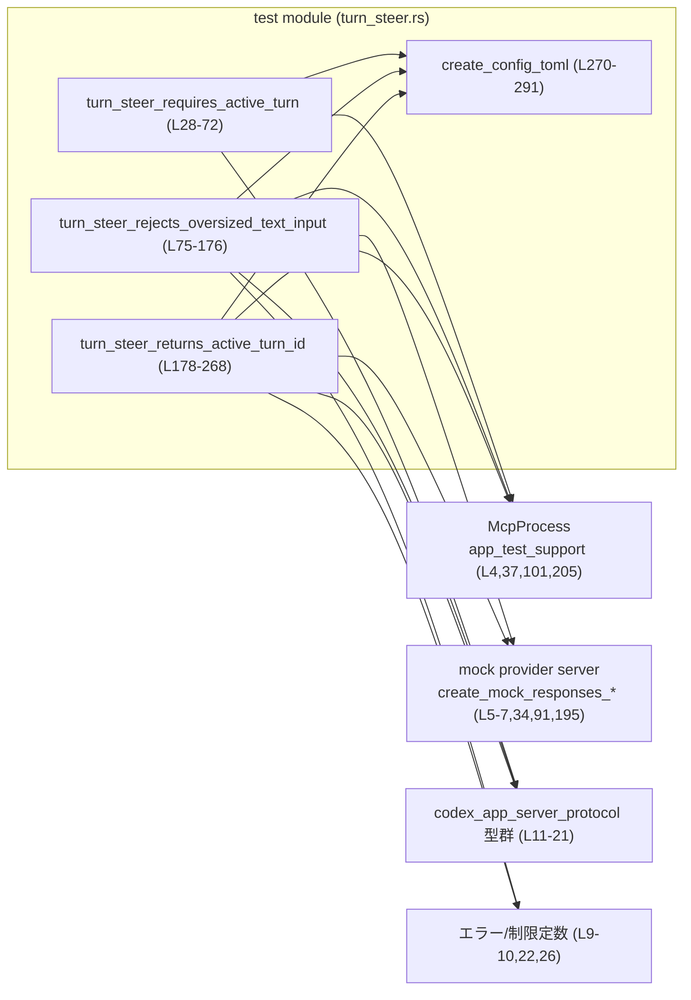
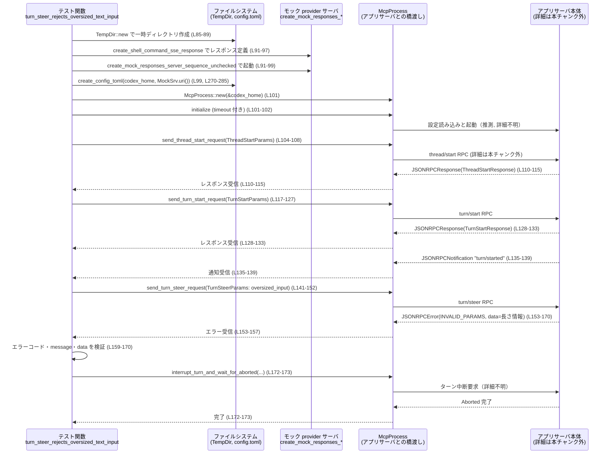

# app-server/tests/suite/v2/turn_steer.rs コード解説

## 0. ざっくり一言

このファイルは、Codex v2 プロトコルの `turn/steer` 操作まわりの振る舞いを、実際のアプリケーションサーバとモック model provider を組み合わせて **エンドツーエンドで検証する非同期テスト群**です（L28-72, L75-176, L178-268）。

---

## 1. このモジュールの役割

### 1.1 概要

- `turn/steer` が **アクティブなターンに対してのみ受理されること**（存在しないターン ID ではエラーになる）（L28-72）。
- `turn/steer` が **ユーザー入力テキスト長の上限を超える入力を拒否し、構造化エラー情報を返すこと**（L75-176）。
- 正常系として、`turn/steer` のレスポンスが **アクティブな `turn_id` を返すこと**（L178-268）。

を確認するテストを提供します。  

これらは `codex_app_server_protocol` の `ThreadStartParams/Response`, `TurnStartParams/Response`, `TurnSteerParams/Response` などの型を通して間接的にサーバの挙動を検証しています（L15-21, L40-51, L104-133, L208-237, L245-262）。

### 1.2 アーキテクチャ内での位置づけ

このテストモジュールは以下のコンポーネントと連携します。

- `McpProcess`（`app_test_support`）: サーバプロセスの起動と JSON-RPC 送受信をラップするヘルパ（L4, L37-48, L101-102, L205-206 など）。
- モック model provider サーバ: `create_mock_responses_server_sequence[_unchecked]` で起動され、`uri()` を通じて base_url として config に書き込まれる（L5-7, L34, L91-99, L195-202, L270-285）。
- JSON-RPC 型群: `JSONRPCResponse`, `JSONRPCError`, `JSONRPCNotification`, `RequestId` など（L11-14, L46-51, L64-69, L110-115, L128-133, L135-139, L154-170, L214-219, L232-237, L239-243, L256-262）。
- v2 入力・応答: `V2UserInput`, `ThreadStartParams/Response`, `TurnStartParams/Response`, `TurnSteerParams/Response`（L15-21, L40-51, L104-133, L117-127, L141-152, L208-237, L245-262）。

依存関係（簡略版）は次の通りです。



### 1.3 設計上のポイント

- **Unix 専用のテスト**  
  ファイル全体が `#![cfg(unix)]` でガードされており、Unix 系 OS でのみコンパイル・実行されます（L1）。  
  内部の `#[cfg(target_os = "windows")]` 分岐は、この条件下ではコンパイルされません（L76-83, L180-187）。

- **非同期テスト + タイムアウト**  
  すべてのテストは `#[tokio::test]` で非同期に実行され、I/O 待ちを `tokio::time::timeout` で 10 秒に制限しています（L24, L26, L28-29, L38, L46-50, L64-68, L101-102, L110-114, L128-132, L135-139, L153-157, L172-173, L205-206, L214-218, L232-236, L239-243, L256-260, L264-265）。

- **anyhow によるエラー伝播**  
  各テストは `anyhow::Result<()>` を返し、`?` / `??` を使って I/O エラーやタイムアウト、プロトコルエラーをそのままテスト失敗として扱います（L3, L28-29, L38, L51, L64-68, L75-76, L85-90, L99, L101-102, L115-116, L128-132, L135-139, L152-157, L172-173, L175-176, L178-179, L189-194, L203-206, L219-220, L232-236, L239-243, L255-260, L264-265, L267-268）。

- **エンドツーエンド志向**  
  各テストは:
  - 一時ディレクトリと `config.toml` を作成（L30-33, L85-89, L189-193, L270-285）
  - モック model provider サーバを起動（L34, L91-99, L195-202）
  - `McpProcess` を介してスレッド開始・ターン開始・ターンステアを実行（L37-51, L101-115, L117-133, L141-152, L205-219, L221-237, L245-262）  
  という一連の流れで、本番に近い構成を再現しています。

- **明示的な検証ポイント**  
  - JSON-RPC エラーコード `-32600`（Invalid Request に相当）や `INVALID_PARAMS_ERROR_CODE` をアサート（L69, L159-160）。
  - 入力長制限 `MAX_USER_INPUT_TEXT_CHARS` と構造化エラー `INPUT_TOO_LARGE_ERROR_CODE`、`max_chars` / `actual_chars` をアサート（L22, L141-147, L159-170）。
  - 正常系で `TurnSteerResponse.turn_id` がアクティブな `turn.id` に一致することをアサート（L261-262）。

---

## 2. 主要な機能一覧（コンポーネントインベントリ）

### 2.1 このファイル内で定義されるコンポーネント

| 名前 | 種別 | 役割 / 用途 | 定義箇所 |
|------|------|-------------|----------|
| `DEFAULT_READ_TIMEOUT` | 定数 | 全テストで使用する非同期読み取りのタイムアウト（10 秒） | `turn_steer.rs:L26` |
| `turn_steer_requires_active_turn` | 非同期テスト関数 | アクティブなターンが存在しない状態で `turn/steer` を呼ぶと JSON-RPC エラー `-32600` になることを検証 | `turn_steer.rs:L28-72` |
| `turn_steer_rejects_oversized_text_input` | 非同期テスト関数 | テキスト入力が `MAX_USER_INPUT_TEXT_CHARS + 1` 文字の場合に `INVALID_PARAMS_ERROR_CODE` と構造化エラー情報が返ることを検証 | `turn_steer.rs:L74-176` |
| `turn_steer_returns_active_turn_id` | 非同期テスト関数 | 正常な `turn/steer` 呼び出しで `TurnSteerResponse.turn_id` がアクティブな `turn.id` と一致することを検証 | `turn_steer.rs:L178-268` |
| `create_config_toml` | 同期ヘルパ関数 | 一時的な `codex_home` ディレクトリに `config.toml` を書き出し、モック provider を指す設定を行う | `turn_steer.rs:L270-291` |

### 2.2 主な外部コンポーネント（このチャンク内での使用のみ）

| 名前 | 種別 | 本ファイルでの役割 | 使用箇所（例） |
|------|------|-------------------|----------------|
| `McpProcess` (`app_test_support`) | 構造体 | サーバプロセスの起動と JSON-RPC 通信を抽象化。`initialize`・`send_thread_start_request`・`send_turn_start_request`・`send_turn_steer_request` などを提供 | `turn_steer.rs:L4, L37-38, L40-48, L53-67, L101-102, L104-115, L117-139, L142-157, L172-173, L205-206, L208-219, L221-237, L245-260, L264-265` |
| `create_mock_responses_server_sequence` | 関数 | モック model provider サーバを起動し、レスポンスシーケンスを設定（詳細不明） | `turn_steer.rs:L5, L34` |
| `create_mock_responses_server_sequence_unchecked` | 関数 | 上記のバリアント。シェルコマンド SSE レスポンスを扱うために利用 | `turn_steer.rs:L6, L91-99, L195-202` |
| `create_shell_command_sse_response` | 関数 | シェルコマンド実行を模した SSE レスポンス定義を生成（詳細不明） | `turn_steer.rs:L7, L91-97, L195-201` |
| `JSONRPCResponse`, `JSONRPCError`, `JSONRPCNotification`, `RequestId` | 構造体等 | JSON-RPC メッセージのレスポンス・エラー・通知・ID を表現。テストはこれらの値をパース・検証 | `turn_steer.rs:L11-14, L46-51, L64-69, L110-115, L128-133, L135-139, L154-170, L214-219, L232-237, L239-243, L256-262` |
| `ThreadStartParams`, `ThreadStartResponse`, `TurnStartParams`, `TurnStartResponse`, `TurnSteerParams`, `TurnSteerResponse`, `UserInput as V2UserInput` | 構造体 / enum | アプリサーバの v2 プロトコルにおけるスレッド/ターン開始・ステアの要求/応答、およびユーザー入力を表現 | `turn_steer.rs:L15-21, L40-51, L104-133, L117-127, L141-152, L208-237, L245-262` |
| `MAX_USER_INPUT_TEXT_CHARS` | 定数 | ユーザー入力テキストの最大文字数 | `turn_steer.rs:L22, L141-147, L159-163, L169-170` |
| `INPUT_TOO_LARGE_ERROR_CODE`, `INVALID_PARAMS_ERROR_CODE` | 定数 | 入力エラーのエラーコード、および JSON-RPC `invalid params` エラーコード | `turn_steer.rs:L9-10, L159-160, L168-170` |
| `TempDir` | 構造体 | 一時ディレクトリ管理（自動クリーンアップを伴う） | `turn_steer.rs:L23, L30-31, L85-89, L189-193` |
| `tokio::time::timeout` | 関数 | 非同期処理のタイムアウト制御 | `turn_steer.rs:L24, L38, L46-50, L64-68, L101-102, L110-114, L128-132, L135-139, L153-157, L172-173, L205-206, L214-218, L232-236, L239-243, L256-260, L264-265` |

---

## 3. 公開 API と詳細解説

このファイルはテストコードであり、ライブラリとしての公開 API は提供しませんが、**テストシナリオ**として重要な 4 つの非同期関数と 1 つの設定ヘルパ関数について詳細を整理します。

### 3.1 型一覧（このファイル内で定義される型）

このファイル内で新たに定義される構造体・列挙体はありません。  
型はすべて外部クレートからインポートされています（L3-24）。

### 3.2 関数詳細（テンプレート）

#### `turn_steer_requires_active_turn() -> Result<()>`

**概要**

- アクティブなターンを開始せずに `turn/steer` を呼び出した場合、JSON-RPC エラー `code = -32600` が返されることを検証するテストです（L28-72）。

**引数**

なし（テスト関数であり、テストランナーから呼ばれます）。

**戻り値**

- `Result<()>` (`anyhow::Result<()>`)（L3, L28-29）  
  - 成功: 期待どおりのエラーコードが返却され、すべての手順が成功したことを示します。
  - 失敗: I/O エラー、タイムアウト、プロトコルエラーなどが発生した場合に `Err` を返し、テストが失敗します。

**内部処理の流れ**

1. 一時ディレクトリ `tmp` と `codex_home` を作成（L30-33）。
2. モック provider サーバを、空のレスポンスシーケンスで起動（L34）。  
   → このテストでは provider 呼び出しは行わないため。
3. `codex_home/config.toml` を `create_config_toml` で書き出し、model provider の `base_url` をモックサーバ URI に設定（L35, L270-285）。
4. `McpProcess::new(&codex_home)` でアプリサーバプロセスを起動し（L37）、`timeout(DEFAULT_READ_TIMEOUT, mcp.initialize()).await??;` で初期化完了を 10 秒以内に待ちます（L38）。
5. `ThreadStartParams`（`model: Some("mock-model")`）でスレッド開始リクエストを送信し（L40-45）、対応する `JSONRPCResponse` を受信して `ThreadStartResponse` にパースし、`thread.id` を取得（L46-51）。
6. アクティブなターンが存在しない状態で `TurnSteerParams` を構築し、`expected_turn_id` に存在しない ID `"turn-does-not-exist"` を設定して `send_turn_steer_request` を送信（L53-62）。
7. `read_stream_until_error_message` でエラーレスポンスを待ち、`JSONRPCError` として取得（L64-68）。
8. `assert_eq!(steer_err.error.code, -32600);` により、エラーコードが `-32600` であることを検証（L69）。

**Examples（使用例）**

この関数自体は `#[tokio::test]` によりテストランナーから自動で呼び出され、ユーザコードから直接呼ぶことは想定されていません（L28-29）。

**Errors / Panics**

- `TempDir::new` や `std::fs::create_dir`、`create_config_toml` が失敗した場合、`?` によって `Err` が返りテスト失敗となります（L30-33, L35, L270-291）。
- `McpProcess::new` や `mcp.initialize`、各種送受信メソッドが失敗した場合も同様です（L37-38, L40-51, L53-68）。
- `timeout` が `Elapsed` を返した場合も、`await??` によりテストは失敗します（L38, L46-50, L64-68）。
- この関数内で `expect` や `unwrap` は使用していません。

**Edge cases（エッジケース）**

- アクティブなターンが 1 つもない状態で `turn/steer` を呼んだ場合に `-32600` が返ることは検証されています（L53-69）。
- 「別のスレッドのターン ID を指定した場合」などのケースはこのテストでは扱われていません（このチャンクには現れません）。

**使用上の注意点**

- このテストが通る前提として、`turn/steer` サーバ実装が「アクティブなターンが存在しない `expected_turn_id` を不正リクエストとして扱う」という契約を守っている必要があります（推論。コードからは方向性のみ分かります）。

---

#### `turn_steer_rejects_oversized_text_input() -> Result<()>`

**概要**

- アクティブなターンに対して `turn/steer` を送信する際、`text` が `MAX_USER_INPUT_TEXT_CHARS + 1` 文字の場合に:
  - エラーコードが `INVALID_PARAMS_ERROR_CODE` であること（L159-160）
  - エラーメッセージが「Input exceeds the maximum length of {MAX_USER_INPUT_TEXT_CHARS} characters.」であること（L161-163）
  - 構造化エラー `data` に `input_error_code`, `max_chars`, `actual_chars` が含まれること（L164-170）
  
  を検証します。

**引数**

なし。

**戻り値**

- `Result<()>`（L75-76）  
  エラーが発生した場合は `Err` が返され、テストが失敗します。

**内部処理の流れ**

1. OS ごとに異なる `shell_command` を準備（Unix パスでは `["sleep","10"]`）（L76-83）。  
   ただしファイル自体は `cfg(unix)` なので Windows 分岐はコンパイルされません（L1, L76-83）。
2. 一時 `codex_home` と `working_directory` を作成（L85-89）。
3. `create_shell_command_sse_response` でシェルコマンド実行用 SSE レスポンス定義を作成し（L91-97）、`create_mock_responses_server_sequence_unchecked` に渡してモック provider サーバを起動（L91-99）。
4. `create_config_toml` で `config.toml` を書き出し（L99, L270-285）。
5. `McpProcess::new` → `mcp.initialize` でアプリサーバを起動・初期化（L101-102）。
6. `ThreadStartParams` でスレッドを開始し、`ThreadStartResponse` から `thread.id` を取得（L104-115）。
7. `TurnStartParams` で「`run sleep`」という入力を使ってターンを開始し、`TurnStartResponse` から `turn.id` を取得（L117-133）。`cwd` に `working_directory` を指定（L124-125）。
8. `read_stream_until_notification_message("turn/started")` を使って `turn/started` 通知を受信し、ターンがアクティブになったことを確認（L135-139）。
9. `oversized_input = "x".repeat(MAX_USER_INPUT_TEXT_CHARS + 1);` で最大文字数 +1 の文字列を作成（L141-142）。
10. `TurnSteerParams` にこの `oversized_input` を `V2UserInput::Text` として設定し、`expected_turn_id` に現在の `turn.id` を指定して `send_turn_steer_request` を送信（L142-152）。
11. `read_stream_until_error_message` でエラーを受信し、`JSONRPCError` として取得（L153-157）。
12. 以下をアサート（L159-170）:
    - `steer_err.error.code == INVALID_PARAMS_ERROR_CODE`（L159-160）
    - `steer_err.error.message` が期待どおり（L161-163）
    - `error.data` が `Some` であり（`expect("expected structured error data")`）（L164-167）
    - `data["input_error_code"] == INPUT_TOO_LARGE_ERROR_CODE`（L168）
    - `data["max_chars"] == MAX_USER_INPUT_TEXT_CHARS`（L169）
    - `data["actual_chars"] == oversized_input.chars().count()`（L170）
13. 最後に `mcp.interrupt_turn_and_wait_for_aborted(thread.id, turn.id, DEFAULT_READ_TIMEOUT)` でターンを中断し、アボート完了を待機（L172-173）。

**Examples（使用例）**

この関数もテストとしてのみ使用されますが、「入力長バリデーション用の E2E テスト」の典型パターンとして参考になります。

**Errors / Panics**

- `create_shell_command_sse_response` や `create_mock_responses_server_sequence_unchecked`、`McpProcess` の操作で発生したエラーは `?` で伝播します（L91-99, L101-102, L104-115, L117-133, L141-152, L153-157, L172-173）。
- `timeout` の `Elapsed` も同様に伝播します（L101-102, L110-114, L128-132, L135-139, L153-157, L172-173）。
- `error.data.expect("expected structured error data")` が `None` の場合は `panic` し、テストが失敗します（L164-167）。

**Edge cases（エッジケース）**

- 検証されているのは **「最大値 + 1」** のケースのみです（L141-142）。
  - ちょうど `MAX_USER_INPUT_TEXT_CHARS` 文字や、それより短い入力の挙動はこのチャンクからは分かりません。
- 入力にマルチバイト文字（UTF-8 で 2 バイト以上の文字）を含めた場合の `chars().count()` とサーバ側カウントの扱いは、このテストでは確認されていません。

**使用上の注意点**

- サーバ側実装は `MAX_USER_INPUT_TEXT_CHARS` を基準に入力長を検証し、オーバーした場合は:
  - JSON-RPC エラーコード `INVALID_PARAMS_ERROR_CODE` を返し、
  - `error.data` に `input_error_code`, `max_chars`, `actual_chars` を含める  
  という契約をこのテストが前提にしています（L159-170）。
- テストは `DEFAULT_READ_TIMEOUT`（10 秒）でタイムアウトするため、環境が極端に遅いとタイムアウトでテストが失敗する可能性があります（L26, L101-102, L110-114, L128-132, L135-139, L153-157, L172-173）。

---

#### `turn_steer_returns_active_turn_id() -> Result<()>`

**概要**

- 正常系において、`turn/steer` のレスポンス `TurnSteerResponse.turn_id` が、ステア対象のアクティブな `turn.id` と一致して返されることを検証します（L178-268）。

**引数**

なし。

**戻り値**

- `Result<()>`（L178-179）  
  正常に期待値が検証されれば `Ok(())`、それ以外は `Err` でテスト失敗です。

**内部処理の流れ**

1. `turn_steer_rejects_oversized_text_input` と同様に、一時ディレクトリと `working_directory` を作成し（L189-193）、モック provider サーバを `create_mock_responses_server_sequence_unchecked` で起動（L195-202）。
2. `create_config_toml` で `config.toml` を書き出し（L203, L270-285）。
3. `McpProcess` を起動・初期化（L205-206）。
4. スレッドを開始し、`ThreadStartResponse` から `thread` を取得（L208-219）。
5. `TurnStartParams` で「run sleep」を実行するターンを開始し、`TurnStartResponse` から `turn` を取得（L221-237）。
6. `turn/started` 通知を受信し、ターンがアクティブであることを確認（L239-243）。
7. `TurnSteerParams` を構築し、`input` に `"steer"` のテキスト、`expected_turn_id` に `turn.id` を指定して `send_turn_steer_request` を送信（L245-254）。
8. 対応する `JSONRPCResponse` を受信し、`TurnSteerResponse` に変換（`to_response`）（L256-261）。
9. `assert_eq!(steer.turn_id, turn.id);` により、レスポンスの `turn_id` が元の `turn.id` と一致することを検証（L261-262）。
10. 最後に `mcp.interrupt_turn_and_wait_for_aborted(thread.id, steer.turn_id, DEFAULT_READ_TIMEOUT)` でターンを中断（L264-265）。

**Examples（使用例）**

このテストは、「正常な `turn/steer` 呼び出しの E2E テスト」としての典型例であり、新しいテストを追加する際の参考パターンになります。

**Errors / Panics**

- 他のテストと同様、各種 I/O エラーやタイムアウトは `?` / `??`で伝播します（L195-206, L208-219, L221-237, L239-243, L256-260, L264-265）。
- この関数内では `unwrap`/`expect` による `panic` は使用していません。

**Edge cases（エッジケース）**

- 「複数のターンが存在する場合」や、「ターン ID が切り替わる場合」の挙動はこのテストからは分かりません。
- このテストは **単一のアクティブターン** かつ **1 回のステア** という単純なケースのみを確認しています（L221-237, L245-262）。

**使用上の注意点**

- クライアント実装側は、`TurnSteerResponse.turn_id` が返されることを前提にターンの追跡や整合性チェックを行うことができます。このテストはその契約を保証するものになっています（L245-262）。

---

#### `create_config_toml(codex_home: &Path, server_uri: &str) -> std::io::Result<()>`

**概要**

- テスト用の `config.toml` を指定された `codex_home` ディレクトリに書き出すヘルパです（L270-291）。
- モデルや provider の設定を固定値で記述し、`server_uri` を `model_providers.mock_provider.base_url` に埋め込んでいます（L270-285）。

**引数**

| 引数名 | 型 | 説明 |
|--------|----|------|
| `codex_home` | `&std::path::Path` | `config.toml` を配置するディレクトリのパス。呼び出し側で事前に作成されています（L31-33, L86-87, L190-191）。 |
| `server_uri` | `&str` | モック model provider サーバのベース URI。`"{server_uri}/v1"` として `base_url` に埋め込まれます（L270-285）。 |

**戻り値**

- `std::io::Result<()>`（L270）  
  - 成功: 設定ファイルを書き込めた場合。
  - 失敗: パスが存在しない、権限がないなどの I/O エラーが発生した場合。

**内部処理の流れ**

1. `codex_home.join("config.toml")` で設定ファイルのパスを組み立てる（L271）。
2. `std::fs::write` を使用し、固定の TOML 文字列をファイルに書き込みます（L272-290）。
   - TOML 内容（L275-288）:
     - `model = "mock-model"`
     - `approval_policy = "never"`
     - `sandbox_mode = "danger-full-access"`
     - `model_provider = "mock_provider"`
     - `[model_providers.mock_provider]` セクションで:
       - `name = "Mock provider for test"`
       - `base_url = "{server_uri}/v1"`
       - `wire_api = "responses"`
       - `request_max_retries = 0`
       - `stream_max_retries = 0`

**Examples（使用例）**

```rust
// 一時ディレクトリを用意する（L30-31 と同様）
let tmp = tempfile::TempDir::new()?;                           // 一時ディレクトリ作成
let codex_home = tmp.path().join("codex_home");                // codex_home パス
std::fs::create_dir(&codex_home)?;                             // ディレクトリ作成

// モックサーバ URI が "http://127.0.0.1:12345" の場合
create_config_toml(&codex_home, "http://127.0.0.1:12345")?;    // config.toml を出力
```

**Errors / Panics**

- `std::fs::write` がエラーを返した場合、`Err(std::io::Error)` が返ります（L272-290）。
- この関数内では `unwrap` / `expect` は使用されていません。

**Edge cases（エッジケース）**

- `codex_home` が存在しないディレクトリを指している場合、`std::fs::write` はエラーになります（呼び出し側で事前に `create_dir` しているため、通常は問題ありません: L31-33, L86-87, L190-191）。
- `server_uri` が空文字列や不正な URI であっても、単に文字列として埋め込まれるだけであり、この関数は検証を行いません（L275-285）。

**使用上の注意点**

- テスト専用の設定値（`approval_policy = "never"`, `sandbox_mode = "danger-full-access"` 等）を埋め込んでいるため、本番環境用の設定には使うべきではありません（L275-282）。
- `server_uri` の末尾に `/v1` を付与する前提のため、呼び出し側は適切なベース URI を渡す必要があります（L284-285）。

---

### 3.3 その他の関数

このファイル内には、上記以外の補助関数はありません。

---

## 4. データフロー

ここでは、最も複雑なシナリオである `turn_steer_rejects_oversized_text_input` のデータフローを示します（L75-176）。

1. テストコードが一時ディレクトリを作成し、モック provider サーバを起動（L85-99）。
2. `create_config_toml` が `codex_home/config.toml` を書き込み、モックサーバの URI を `base_url` に設定（L99, L270-285）。
3. `McpProcess` がその設定を用いてアプリサーバプロセスを起動・初期化（L101-102）。
4. テストは `ThreadStartParams` と `TurnStartParams` を通じてスレッド・ターンを開始し、`turn/started` 通知を確認（L104-115, L117-133, L135-139）。
5. `TurnSteerParams` に最大長を超えるテキストを設定して `send_turn_steer_request` を行い、サーバから JSON-RPC エラーを受信（L141-157）。
6. テストはエラーコードと構造化データを検証し、最後にターンを中止して終了（L159-173）。

### シーケンス図



※ `Server` の内部実装やプロトコル詳細は、このチャンクからは直接は分かりません。

---

## 5. 使い方（How to Use）

### 5.1 基本的な使用方法（テストパターンとして）

このモジュールのテストは、「モック provider + 本物のアプリサーバ」を組み合わせた E2E テストのテンプレートとして利用できます。

典型的な流れは次のようになります（内容は各テストの共通パターン L30-51, L85-115, L189-219 に基づきます）。

```rust
#[tokio::test]                                             // Tokio ランタイムで非同期テストを実行
async fn example_turn_test() -> anyhow::Result<()> {       // anyhow::Result でエラーを一元管理
    // 1. 一時ディレクトリと config.toml の準備
    let tmp = tempfile::TempDir::new()?;                   // 一時ディレクトリ
    let codex_home = tmp.path().join("codex_home");        // codex_home パス
    std::fs::create_dir(&codex_home)?;                     // ディレクトリ作成
    // モック provider サーバを起動（レスポンスシーケンスは省略）
    let server = create_mock_responses_server_sequence(vec![]).await;
    create_config_toml(&codex_home, &server.uri())?;       // config.toml 出力

    // 2. McpProcess の起動と初期化
    let mut mcp = McpProcess::new(&codex_home).await?;     // プロセス起動
    tokio::time::timeout(DEFAULT_READ_TIMEOUT, mcp.initialize()).await??;

    // 3. スレッド開始
    let thread_req = mcp
        .send_thread_start_request(ThreadStartParams {
            model: Some("mock-model".to_string()),
            ..Default::default()
        })
        .await?;
    // レスポンスの待機とパース
    let thread_resp: JSONRPCResponse = tokio::time::timeout(
        DEFAULT_READ_TIMEOUT,
        mcp.read_stream_until_response_message(RequestId::Integer(thread_req)),
    )
    .await??;
    let ThreadStartResponse { thread, .. } =
        to_response::<ThreadStartResponse>(thread_resp)?;

    // 4. 必要に応じて turn/start, turn/steer を呼び出す……
    //    （具体例は既存テストを参照）
    Ok(())
}
```

### 5.2 よくある使用パターン

- **異常系検証パターン**
  - `send_*_request` → `read_stream_until_error_message` → `JSONRPCError` を検証するパターン（L53-69, L141-170）。
- **正常系＋通知検証パターン**
  - `send_turn_start_request` → `read_stream_until_response_message` → `read_stream_until_notification_message("turn/started")` の順で、レスポンスと通知の両方を検証（L117-139, L221-243）。
- **リソースクリーンアップパターン**
  - 長時間実行するコマンド（`sleep 10`）を起動しておき、テストの最後に `interrupt_turn_and_wait_for_aborted` で確実に中断（L172-173, L264-265）。

### 5.3 よくある間違い

```rust
// 間違い例: ターンを開始せずに、正常系レスポンスを期待している
let steer_req = mcp.send_turn_steer_request(TurnSteerParams {
    thread_id: thread.id.clone(),
    input: vec![V2UserInput::Text {
        text: "steer".to_string(),
        text_elements: Vec::new(),
    }],
    responsesapi_client_metadata: None,
    expected_turn_id: turn.id.clone(), // そもそもturnが存在しない
}).await?;

// 正しい例: 事前に turn/start でアクティブターンを作成しておく（L117-133, L221-237）
let turn_req = mcp.send_turn_start_request(TurnStartParams {
    thread_id: thread.id.clone(),
    input: vec![V2UserInput::Text {
        text: "run sleep".to_string(),
        text_elements: Vec::new(),
    }],
    cwd: Some(working_directory.clone()),
    ..Default::default()
}).await?;
```

### 5.4 使用上の注意点（まとめ）

- **並行性 / 非同期**
  - すべて `async` 関数として実装され、Tokio ランタイム上で実行されます（L28-29, L75-76, L178-179）。
  - ブロッキング I/O (`std::fs::write`, `create_dir` など) はテスト開始時の短時間に限られており、主要な待ち処理は非同期に行われます（L30-33, L85-89, L189-193, L270-291）。

- **エラー処理**
  - `timeout(...).await??` パターンで、**タイムアウトエラー** と **内部処理のエラー** の両方を `anyhow::Error` として伝播させています（L38, L46-50, L64-68, L101-102, L110-114, L128-132, L135-139, L153-157, L172-173, L205-206, L214-218, L232-236, L239-243, L256-260, L264-265）。

- **入力制限**
  - `MAX_USER_INPUT_TEXT_CHARS + 1` 文字の入力が拒否されることがテストで保証されており（L141-142, L159-170）、非常に長い入力を渡すクライアント実装はこの制限を意識する必要があります。

---

## 6. 変更の仕方（How to Modify）

### 6.1 新しい機能を追加する場合（新たな turn/steer シナリオのテスト）

1. **テスト関数追加**
   - このファイルに新たな `#[tokio::test] async fn ... -> Result<()>` を追加します（既存の 3 関数 L28-72, L75-176, L178-268 を参考）。

2. **共通セットアップの再利用**
   - 一時ディレクトリ・`codex_home` 作成と `create_config_toml` 呼び出し（L30-35, L85-99, L189-203）。
   - `McpProcess::new` と `initialize`（L37-38, L101-102, L205-206）。
   - `thread/start` → `turn/start` → 通知待ち（必要に応じて）（L40-51, L104-115, L117-139, L208-219, L221-243）。

3. **検証ロジック**
   - 追加したいシナリオに応じて:
     - 期待する `JSONRPCResponse` → `TurnSteerResponse` のフィールドをアサートする。
     - あるいは `JSONRPCError` の `code`, `message`, `data` をアサートする（L159-170）。

### 6.2 既存の機能を変更する場合（契約変更への追随）

- **エラーコードやメッセージ仕様を変更する場合**
  - `INVALID_PARAMS_ERROR_CODE`, `INPUT_TOO_LARGE_ERROR_CODE`, `MAX_USER_INPUT_TEXT_CHARS` などの定数仕様を変えた場合、対応する `assert_eq!` を更新する必要があります（L159-170）。
  - JSON-RPC エラーコード `-32600` の扱いを変更した場合は、`turn_steer_requires_active_turn` のアサーションを更新します（L69）。

- **プロトコルフィールドの追加/変更**
  - `TurnSteerParams` や `TurnSteerResponse` にフィールド追加があった場合、本テストが使っているフィールド（`thread_id`, `input`, `expected_turn_id`, `turn_id`）の意味が変わらないか確認し、必要に応じてテストを調整します（L53-62, L142-152, L245-254, L261-262）。

- **影響範囲の確認**
  - 同名のテストが他ファイルにも存在する場合がありますが、このチャンクからは分かりません。`rg "turn_steer"` 等でリポジトリ全体を検索して影響範囲を確認することが推奨されます（指針としてのコメントであり、コードからは直接分かりません）。

---

## 7. 関連ファイル / モジュール

このモジュールと密接に関係するが、このチャンクには定義が現れないコンポーネントを列挙します。

| パス / クレート（推定） | 役割 / 関係 |
|-------------------------|------------|
| `app_test_support::McpProcess` | アプリサーバプロセスの起動と JSON-RPC 通信を抽象化するテスト支援コンポーネント。`new`, `initialize`, 各種 `send_*_request`, `read_stream_until_*`, `interrupt_turn_and_wait_for_aborted` を提供（L4, L37-38, L40-48, L53-68, L101-102, L104-115, L117-139, L141-157, L172-173, L205-206, L208-219, L221-243, L245-260, L264-265）。定義場所はこのチャンクには現れません。 |
| `app_test_support::create_mock_responses_server_sequence[_unchecked]` | モック model provider サーバを起動するヘルパ。`uri()` メソッドを介してベース URI を取得（L5-7, L34, L91-99, L195-202）。 |
| `app_test_support::create_shell_command_sse_response` | モックサーバに対してシェルコマンド実行風の SSE レスポンスを登録するためのヘルパ（L7, L91-97, L195-201）。 |
| `codex_app_server_protocol` | JSON-RPC メッセージと v2 プロトコルの型定義 (`JSONRPCResponse/Error/Notification`, `RequestId`, `ThreadStartParams/Response`, `TurnStartParams/Response`, `TurnSteerParams/Response`, `UserInput`) を提供（L11-21）。 |
| `codex_app_server` | エラーコードなど、アプリサーバ固有の定数を提供。ここでは `INPUT_TOO_LARGE_ERROR_CODE` と `INVALID_PARAMS_ERROR_CODE` が使用されています（L9-10, L159-160, L168-170）。定義場所はこのチャンクには現れません。 |
| `codex_protocol::user_input` | ユーザー入力の仕様（ここでは最大文字数 `MAX_USER_INPUT_TEXT_CHARS`）を提供（L22, L141-147, L159-163, L169-170）。 |

---

### Bugs / Security / Contracts / Edge Cases まとめ（本チャンクから読み取れる範囲）

- **Contracts（挙動の契約）**
  - `turn/steer` は、アクティブなターンが存在しない／ID が一致しない場合、JSON-RPC エラー `-32600` を返す（L53-69）。
  - `turn/steer` は、入力テキスト長が `MAX_USER_INPUT_TEXT_CHARS` を超える場合、`INVALID_PARAMS_ERROR_CODE` と `INPUT_TOO_LARGE_ERROR_CODE` を含む構造化エラーを返す（L141-170）。
  - 正常系では、`TurnSteerResponse.turn_id` にアクティブターンの ID が入る（L245-262）。

- **Security（セキュリティ関連の含意）**
  - 入力長制限により、極端に長いユーザー入力によるリソース枯渇やバッファ過剰使用のリスク低減に寄与しています（L141-170）。
  - 存在しないターン ID へのステアを拒否することで、不正なセッション操作を防ぐ契約が確認できます（L53-69）。

- **Edge Cases（境界条件）**
  - `MAX_USER_INPUT_TEXT_CHARS + 1` は明示的にエラーになることがテストされているが（L141-142, L159-170）、ちょうど最大値・マルチバイト文字を含むケースなどはこのチャンクからは不明です。
  - タイムアウト (`DEFAULT_READ_TIMEOUT` = 10 秒) を超える動作は考慮されていませんが、超えた場合はテストが失敗することになります（L26, L38, L101-102, L110-114, L128-132, L135-139, L153-157, L172-173, L205-206, L214-218, L232-236, L239-243, L256-260, L264-265）。

- **Performance / Scalability（テストとして）**
  - `sleep 10` 相当の外部コマンドを走らせることで、「長時間動作中のターン」を前提としたテストを行っています（L76-83, L180-187）。  
    これはテスト実行時間に影響しうるため、大量の類似テストを追加する際は注意が必要です。

- **Observability**
  - このファイル自身はログ出力などの観測手段を持たず、テスト結果（成功／失敗）とアサーションのメッセージに依存しています。  
    追加の観測が必要な場合は、`McpProcess` 側のログや外部のトレース機構を利用することになると考えられますが、このチャンクからは詳細は不明です。
