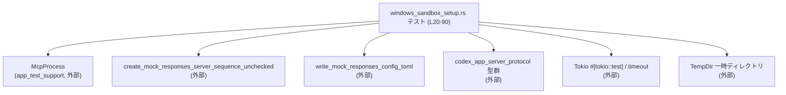
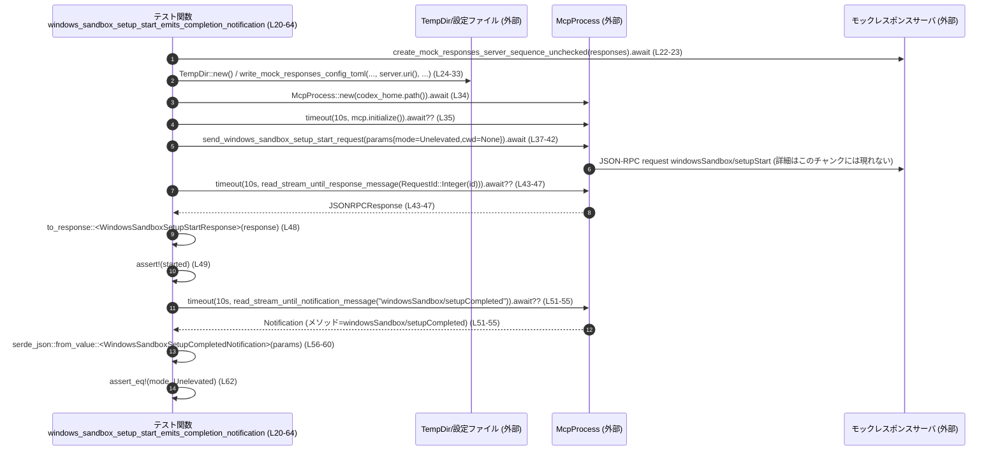

app-server/tests/suite/v2/windows_sandbox_setup.rs の解説レポートです。

---

## 0. ざっくり一言

Windows Sandbox 関連の JSON-RPC API について、

- 正常に開始できると完了通知が飛ぶこと  
- 相対パスの `cwd` を指定したリクエストはエラーになること  

を、`McpProcess` 経由で検証する非同期統合テスト群です（`windows_sandbox_setup.rs:L20-90`）。

---

## 1. このモジュールの役割

### 1.1 概要

このモジュールは、Codex アプリサーバの「Windows Sandbox セットアップ」機能が JSON-RPC プロトコル上で次を満たすかどうかを検証します。

- `windowsSandbox/setupStart` を発行すると、
  - `WindowsSandboxSetupStartResponse` の `started` が `true` で返ること（`windows_sandbox_setup.rs:L37-49`）
  - その後 `windowsSandbox/setupCompleted` 通知が届き、通知ペイロードの `mode` がリクエストと一致すること（`windows_sandbox_setup.rs:L51-62`）
- `cwd` に相対パス文字列を渡した `windowsSandbox/setupStart` リクエストが、JSON-RPC エラーコード `-32600`（Invalid Request）で拒否されること（`windows_sandbox_setup.rs:L72-89`）

### 1.2 アーキテクチャ内での位置づけ

このファイルはテスト専用であり、本番コードではなく以下の外部コンポーネントを利用します。

- `app_test_support::McpProcess`：アプリサーバと JSON-RPC で対話するテスト用プロセスラッパ（定義はこのチャンクには現れない）
- `app_test_support::create_mock_responses_server_sequence_unchecked`／`write_mock_responses_config_toml`：モックレスポンスサーバと設定ファイル生成（`windows_sandbox_setup.rs:L4-6, L22-33`）
- `codex_app_server_protocol` の各種型：JSON-RPC のメッセージ型（`windows_sandbox_setup.rs:L7-12, L56-60`）
- Tokio の非同期ランタイムと `timeout`：非同期テストとタイムアウト制御（`windows_sandbox_setup.rs:L16, L20, L35, L43-47, L51-55, L70, L82-86`）
- `tempfile::TempDir`：テスト用一時ディレクトリ（`windows_sandbox_setup.rs:L15, L24, L68`）

依存関係を簡略化した図です。



> この図は、本チャンクに登場する呼び出し関係のみを示しています。

### 1.3 設計上のポイント

コードから読み取れる設計上の特徴は次のとおりです。

- **非同期テスト**  
  - 両テストとも `#[tokio::test]` でマークされ、非同期コンテキストで動作します（`windows_sandbox_setup.rs:L20, L66`）。
- **タイムアウト付き I/O**  
  - すべての I/O ライクな処理（初期化・レスポンス待ち・通知待ち・エラー待ち）は `tokio::time::timeout` 経由で行い、10 秒のデフォルトタイムアウトを共通定数で管理します（`windows_sandbox_setup.rs:L18, L35, L43-47, L51-55, L70, L82-86`）。
- **一時ディレクトリごとの独立環境**  
  - 各テストは `TempDir::new()` によるユニークな `codex_home` を使用し、環境を分離しています（`windows_sandbox_setup.rs:L24, L68`）。
- **強いプロトコル整合性チェック**  
  - 成功ケースでは `WindowsSandboxSetupStartResponse` と `WindowsSandboxSetupCompletedNotification` を型付きでパースし、フィールド値まで確認します（`windows_sandbox_setup.rs:L48-49, L56-62`）。
  - エラーケースでは JSON-RPC エラーコードとメッセージ文字列を検証します（`windows_sandbox_setup.rs:L88-89`）。
- **エラー処理の一元化**  
  - 戻り値の型を `anyhow::Result<()>` にして `?` 演算子でエラーを伝播し、失敗時にはテスト全体を即時失敗させる構造です（`windows_sandbox_setup.rs:L21, L67`）。

---

## 2. コンポーネント一覧（インベントリー）と主要機能

### 2.1 このファイルで定義されるコンポーネント

| 名前 | 種別 | 定義位置 | 説明 |
|------|------|----------|------|
| `DEFAULT_READ_TIMEOUT` | `const std::time::Duration` | `windows_sandbox_setup.rs:L18-18` | 非同期読み取り系処理に共通で利用する 10 秒のタイムアウト値です。 |
| `windows_sandbox_setup_start_emits_completion_notification` | 非公開 async 関数（テスト） | `windows_sandbox_setup.rs:L20-64` | 正常な `windowsSandbox/setupStart` リクエストが成功レスポンスと完了通知を発行することを検証します。 |
| `windows_sandbox_setup_start_rejects_relative_cwd` | 非公開 async 関数（テスト） | `windows_sandbox_setup.rs:L66-90` | `cwd` に相対パスを指定した `windowsSandbox/setupStart` リクエストが「Invalid request」エラーで拒否されることを検証します。 |

### 2.2 外部コンポーネント（利用のみ）

| 名前 | 種別 | 定義位置 | 本ファイルでの役割 |
|------|------|----------|--------------------|
| `McpProcess` | 構造体（推定） | このチャンクには現れない（`app_test_support` クレート） | アプリサーバとの JSON-RPC 通信とストリーム読み取りの高レベルラッパとして使用されています（`windows_sandbox_setup.rs:L3, L34-37, L45, L53, L69-80, L84`）。 |
| `create_mock_responses_server_sequence_unchecked` | 非同期関数（推定） | このチャンクには現れない（`app_test_support`） | モックレスポンスサーバを起動し、その URI を設定に書き込むために使用します（`windows_sandbox_setup.rs:L4, L22-23`）。 |
| `write_mock_responses_config_toml` | 関数（推定） | このチャンクには現れない（`app_test_support`） | Codex の設定ファイルにモックサーバ URI などを記述します（`windows_sandbox_setup.rs:L6, L25-33`）。 |
| `to_response` | 関数（推定） | このチャンクには現れない（`app_test_support`） | `JSONRPCResponse` を `WindowsSandboxSetupStartResponse` に変換します（`windows_sandbox_setup.rs:L5, L48`）。 |
| `JSONRPCResponse` 他プロトコル型 | 構造体/列挙体 | このチャンクには現れない（`codex_app_server_protocol`） | JSON-RPC レスポンス・リクエスト ID・Windows Sandbox 関連のパラメータ／レスポンス型として利用されます（`windows_sandbox_setup.rs:L7-12, L38-41, L48, L56-62, L73-78, L84-85`）。 |

### 2.3 主要な機能一覧（要約）

- Windows Sandbox セットアップの成功パス検証  
  - `windows_sandbox_setup_start_emits_completion_notification` が、開始レスポンスと完了通知の両方を検査します（`windows_sandbox_setup.rs:L37-49, L51-62`）。
- Windows Sandbox セットアップのバリデーション検証  
  - `windows_sandbox_setup_start_rejects_relative_cwd` が、相対パス指定の `cwd` を持つ開始リクエストが JSON-RPC エラー `-32600`＋メッセージ「Invalid request」を伴って拒否されることを確認します（`windows_sandbox_setup.rs:L72-80, L82-89`）。
- テスト用の共通タイムアウト定義  
  - `DEFAULT_READ_TIMEOUT` により、各種読み取り処理を 10 秒でタイムアウトさせます（`windows_sandbox_setup.rs:L18, L35, L43-45, L51-53, L70, L82-84`）。

---

## 3. 公開 API と詳細解説

このファイルはテストモジュールであり、外部クレートから利用される「公開 API」は定義していません。ここでは「テスト関数」を単位として詳細を説明します。

### 3.1 型一覧（このファイルで新規定義される型）

このファイル内で新しく定義される構造体・列挙体・型エイリアスはありません（`windows_sandbox_setup.rs:L1-91` 全体より）。

参考として、頻繁に利用される外部型を列挙します（いずれも定義はこのチャンクには現れません）。

| 名前 | 種別 | 用途 / 根拠 |
|------|------|-------------|
| `JSONRPCResponse` | 構造体（推定） | JSON-RPC レスポンスとして読み取ったメッセージを一旦格納し、`to_response` で型付きレスポンスに変換します（`windows_sandbox_setup.rs:L7, L43-48`）。 |
| `RequestId` | 列挙体（推定） | JSON-RPC リクエスト ID を表し、整数 ID でレスポンス／エラーメッセージを識別します（`windows_sandbox_setup.rs:L8, L45, L84`）。 |
| `WindowsSandboxSetupMode` | 列挙体（推定） | Windows Sandbox のモード（ここでは `Unelevated`）を表現し、リクエスト・通知の両方で使用されます（`windows_sandbox_setup.rs:L10, L39, L62`）。 |
| `WindowsSandboxSetupStartParams` | 構造体（推定） | `windowsSandbox/setupStart` リクエストのパラメータであり、`mode` と `cwd` を含みます（`windows_sandbox_setup.rs:L11, L38-41`）。 |
| `WindowsSandboxSetupStartResponse` | 構造体（推定） | セットアップ開始リクエストのレスポンスで、`started` フラグを持ちます（`windows_sandbox_setup.rs:L12, L48-49`）。 |
| `WindowsSandboxSetupCompletedNotification` | 構造体（推定） | `windowsSandbox/setupCompleted` 通知のペイロード型で、`mode` などを保持します（`windows_sandbox_setup.rs:L9, L56-62`）。 |

### 3.2 関数詳細

#### `windows_sandbox_setup_start_emits_completion_notification() -> Result<()>`

**概要**

- Windows Sandbox セットアップ開始リクエストを `McpProcess` 経由で送信し（`windows_sandbox_setup.rs:L37-42`）、  
  - `started: true` なレスポンスが返ること（`windows_sandbox_setup.rs:L43-49`）  
  - その後 `windowsSandbox/setupCompleted` 通知が届き、通知内の `mode` が `Unelevated` であること（`windows_sandbox_setup.rs:L51-62`）  
  を検証する非同期テストです。

**引数**

この関数は引数を取りません（`windows_sandbox_setup.rs:L20-21`）。

| 引数名 | 型 | 説明 |
|--------|----|------|
| なし | - | テスト関数として、テストランナーから直接呼び出される前提のため引数はありません。 |

**戻り値**

- 型: `anyhow::Result<()>`（`windows_sandbox_setup.rs:L21`）
- 意味:
  - `Ok(())`：すべての操作・アサーションが成功し、テストがパスしたことを表します。
  - `Err(anyhow::Error)`：I/O 失敗・タイムアウト・パースエラー・アサーション以外のエラーなどが発生し、テストを早期終了させるために返されます。

**内部処理の流れ（アルゴリズム）**

1. **モックレスポンスサーバの起動**（`windows_sandbox_setup.rs:L22-23`）  
   - 空の `responses: Vec<_>` を作成し（`L22`）、  
   - `create_mock_responses_server_sequence_unchecked(responses).await` でモックサーバを起動し、そのハンドルを `server` として取得します（`L23`）。  
   - モックサーバが実際にどのようなレスポンスを返すかは、このチャンクには現れません。

2. **一時ディレクトリと設定ファイルの作成**（`windows_sandbox_setup.rs:L24-33`）  
   - `TempDir::new()?` で一時ディレクトリ `codex_home` を作成します（`L24`）。  
   - `write_mock_responses_config_toml` を呼び出し、`codex_home` 配下にモックサーバ URI などを記載した設定ファイルを作成します（`L25-33`）。  
     - 第 2 引数で `server.uri()` を渡しているため（`L27`）、アプリサーバはこの URI を経由してモックサーバと通信すると推測されますが、詳細はこのチャンクには現れません。

3. **`McpProcess` の起動と初期化**（`windows_sandbox_setup.rs:L34-35`）  
   - `McpProcess::new(codex_home.path()).await?` で Codex アプリサーバをラップするプロセスを起動し、`mcp` として取得します（`L34`）。  
   - `timeout(DEFAULT_READ_TIMEOUT, mcp.initialize()).await??;` で、10 秒のタイムアウト付きで初期化処理を完了させます（`L35`）。  
     - 1 回目の `?` で `Elapsed`（タイムアウト）を、2 回目の `?` で `mcp.initialize()` 自体の `Result` を評価しています。

4. **Windows Sandbox セットアップ開始リクエストの送信**（`windows_sandbox_setup.rs:L37-42`）  
   - `WindowsSandboxSetupStartParams` を構築し、`mode` に `WindowsSandboxSetupMode::Unelevated` を指定、`cwd` は `None` にします（`L38-41`）。  
   - `mcp.send_windows_sandbox_setup_start_request(...)` を `await` し、整数型の `request_id` を取得します（`L37-42`）。

5. **開始レスポンスの受信と検証**（`windows_sandbox_setup.rs:L43-49`）  
   - `timeout(DEFAULT_READ_TIMEOUT, mcp.read_stream_until_response_message(RequestId::Integer(request_id)))` で、先ほどの `request_id` を持つレスポンスを 10 秒以内に待ちます（`L43-47`）。  
   - 取得した `JSONRPCResponse` を `to_response` に渡し、`WindowsSandboxSetupStartResponse` にデコードします（`L48`）。  
   - `assert!(start_payload.started);` で `started` フラグが真であることを検証します（`L49`）。

6. **完了通知の受信と検証**（`windows_sandbox_setup.rs:L51-62`）  
   - `timeout(DEFAULT_READ_TIMEOUT, mcp.read_stream_until_notification_message("windowsSandbox/setupCompleted"))` で、指定のメソッド名を持つ通知を 10 秒以内に待ちます（`L51-55`）。  
   - 取得した `notification.params` に対して `context("missing windowsSandbox/setupCompleted params")?` を適用し、`None` であれば文脈付きエラーに変換します（`L56-60`）。  
   - `serde_json::from_value` で `WindowsSandboxSetupCompletedNotification` 型にデコードします（`L56-60`）。  
   - `assert_eq!(payload.mode, WindowsSandboxSetupMode::Unelevated);` により、通知中の `mode` がリクエストで指定したモードと一致することを検証します（`L62`）。

7. **正常終了**  
   - すべてのステップが成功すると `Ok(())` を返し、テストがパスします（`windows_sandbox_setup.rs:L63`）。

**Examples（使用例）**

この関数はテストとして `cargo test` から実行されます。個別にこのテストだけを実行する場合の例です。

```bash
# このテスト関数だけを実行する例
cargo test --test windows_sandbox_setup \
  windows_sandbox_setup_start_emits_completion_notification
```

Rust コードから直接呼び出すことは通常ありませんが、パターンとして同様のテストを書く例を示します。

```rust
use anyhow::Result;                                  // anyhow::Result をインポートする
use tokio::time::timeout;                            // timeout 関数をインポートする

#[tokio::test]                                       // Tokio の非同期テストマクロ
async fn example_like_windows_sandbox_test() -> Result<()> { // anyhow::Result<()> を返す async テスト
    // 実際には TempDir や McpProcess のセットアップを行う                      // 本ファイルと同様のセットアップを想定
    // let codex_home = TempDir::new()?;                                      // 一時ディレクトリの作成（省略）
    // let mut mcp = McpProcess::new(codex_home.path()).await?;              // MCP プロセスの生成（省略）

    // timeout を使った初期化パターンの例                                     // timeout で初期化をタイムアウト付きで実行
    // timeout(DEFAULT_READ_TIMEOUT, mcp.initialize()).await??;              // 本ファイルと同様の初期化処理（省略）

    // ここに JSON-RPC リクエストとアサーションを記述する                     // リクエスト送信と検証を行う

    Ok(())                                             // エラーがなければ Ok(()) を返す
}
```

**Errors / Panics**

- `Err`（関数がエラーを返す）になる条件（いずれも `?` の伝播による）：
  - 一時ディレクトリの生成失敗（`TempDir::new()`、`windows_sandbox_setup.rs:L24`）。
  - モックサーバ起動や設定ファイル書き込みの失敗（`create_mock_responses_server_sequence_unchecked`, `write_mock_responses_config_toml`、`L22-23, L25-33`）。
  - `McpProcess::new` あるいは `mcp.initialize()` の失敗（`windows_sandbox_setup.rs:L34-35`）。
  - `timeout` によるタイムアウト（`Elapsed`）が発生した場合（`windows_sandbox_setup.rs:L35, L43-47, L51-55`）。  
    10 秒以内に処理が完了しないと `Err` になります。
  - `send_windows_sandbox_setup_start_request` の送信失敗（`windows_sandbox_setup.rs:L37-42`）。
  - レスポンス／通知の読み取り失敗（`read_stream_until_response_message`, `read_stream_until_notification_message`、`L43-47, L51-55`）。
  - `to_response` によるレスポンスのデコード失敗（`windows_sandbox_setup.rs:L48`）。
  - `notification.params` が `None` で、`context("missing ...")?` がエラーを返すケース（`windows_sandbox_setup.rs:L56-60`）。
  - `serde_json::from_value` による通知ペイロード変換の失敗（`windows_sandbox_setup.rs:L56-60`）。

- パニック（テスト失敗として扱われる）を起こしうる箇所：
  - `assert!(start_payload.started);`（`windows_sandbox_setup.rs:L49`）
  - `assert_eq!(payload.mode, WindowsSandboxSetupMode::Unelevated);`（`windows_sandbox_setup.rs:L62`）

これらのアサートが成立しない場合、テストはパニックし、そのテストケースは失敗となります。

**Edge cases（エッジケース）**

- サーバがレスポンス／通知を送らない場合  
  - `timeout` により 10 秒でタイムアウトし、`Elapsed` エラーが返ります（`windows_sandbox_setup.rs:L43-47, L51-55`）。
- `windowsSandbox/setupCompleted` 通知に `params` が含まれない場合  
  - `notification.params` が `None` となり、`context("missing ...")?` によりエラーが返ります（`windows_sandbox_setup.rs:L56-60`）。
- 通知の `mode` が `Unelevated` と一致しない場合  
  - `assert_eq!(...)` がパニックし、テストが失敗します（`windows_sandbox_setup.rs:L62`）。

**使用上の注意点**

- すべての I/O を `timeout` 経由にしているため、環境が極端に遅い場合にはテストがタイムアウトで落ちる可能性があります（`windows_sandbox_setup.rs:L18, L35, L43-47, L51-55`）。
- `RequestId::Integer(request_id)` を使ってレスポンスをフィルタしているため、ID の整合性が非常に重要です（`windows_sandbox_setup.rs:L45`）。
- テストは Windows Sandbox 機能の仕様（モードと通知の関係）に依存しているため、プロトコル仕様の変更があればこのテストも同時に更新する必要があります（仕様自体はこのチャンクには現れません）。

---

#### `windows_sandbox_setup_start_rejects_relative_cwd() -> Result<()>`

**概要**

- `windowsSandbox/setupStart` メソッドに対し、`cwd` に相対パス `"relative-root"` を指定した生 JSON-RPC リクエストを送信し（`windows_sandbox_setup.rs:L72-79`）、  
  - エラーコード `-32600`（Invalid request）  
  - エラーメッセージに `"Invalid request"` を含む  
  という JSON-RPC エラーが返ることを確認する非同期テストです（`windows_sandbox_setup.rs:L82-89`）。

**引数**

この関数も引数を取りません（`windows_sandbox_setup.rs:L66-67`）。

| 引数名 | 型 | 説明 |
|--------|----|------|
| なし | - | テスト関数として自動実行されるため、引数はありません。 |

**戻り値**

- 型: `anyhow::Result<()>`（`windows_sandbox_setup.rs:L67`）
- 意味:
  - `Ok(())`：エラーコード・メッセージのアサーションに成功したことを意味します。
  - `Err(anyhow::Error)`：起動・初期化・リクエスト送信・エラー読み取りのいずれかで失敗が発生したことを意味します。

**内部処理の流れ**

1. **一時ディレクトリと `McpProcess` の初期化**（`windows_sandbox_setup.rs:L68-70`）  
   - `TempDir::new()?` でテスト専用の `codex_home` を作成し（`L68`）、  
   - `McpProcess::new(codex_home.path()).await?` で MCP プロセスを生成します（`L69`）。  
   - `timeout(DEFAULT_READ_TIMEOUT, mcp.initialize()).await??;` で 10 秒のタイムアウト付きで初期化します（`L70`）。

2. **相対パス `cwd` を含む生リクエストの送信**（`windows_sandbox_setup.rs:L72-80`）  
   - `mcp.send_raw_request("windowsSandbox/setupStart", Some(serde_json::json!({ ... })))` を呼び出し、  
     JSON パラメータに `"mode": "unelevated"` と `"cwd": "relative-root"` を指定します（`L73-78`）。  
   - 戻り値として整数型の `request_id` を取得します（`L72-80`）。

3. **エラーメッセージの読み取り**（`windows_sandbox_setup.rs:L82-86`）  
   - `timeout(DEFAULT_READ_TIMEOUT, mcp.read_stream_until_error_message(RequestId::Integer(request_id)))` により、  
     対応するエラーメッセージがストリームから現れるまで 10 秒待ちます（`L82-85`）。  
   - `err` 変数に JSON-RPC エラーメッセージ全体を格納します（`L82-86`）。

4. **エラー内容の検証**（`windows_sandbox_setup.rs:L88-89`）  
   - `assert_eq!(err.error.code, -32600);` により、エラーコードが `-32600`（JSON-RPC 仕様における「Invalid Request」）であることを確認します（`L88`）。  
   - `assert!(err.error.message.contains("Invalid request"));` により、エラーメッセージの文字列に `"Invalid request"` を含むことを確認します（`L89`）。

5. **正常終了**  
   - すべてのアサーションが満たされれば `Ok(())` を返します（`windows_sandbox_setup.rs:L90`）。

**Examples（使用例）**

このテストのみを実行するコマンド例です。

```bash
cargo test --test windows_sandbox_setup \
  windows_sandbox_setup_start_rejects_relative_cwd
```

似たパターンで別のバリデーション（例えば `mode` の不正値）を検証するテストを書く場合のひな型です。

```rust
use anyhow::Result;                                        // anyhow::Result をインポートする

#[tokio::test]                                             // 非同期テストマクロ
async fn invalid_mode_is_rejected_example() -> Result<()> { // 不正な mode を検証する架空の例
    // let codex_home = TempDir::new()?;                   // 一時ディレクトリを作成（本ファイルと同様の前提）
    // let mut mcp = McpProcess::new(codex_home.path()).await?; // MCP プロセスを生成（実装はこのチャンクには現れない）
    // timeout(DEFAULT_READ_TIMEOUT, mcp.initialize()).await??; // 初期化（省略）

    // 不正な mode を含む JSON を送る例（実際の仕様はこのチャンクには現れない）  // エラー応答を期待するパターンの例
    // let request_id = mcp
    //     .send_raw_request("windowsSandbox/setupStart",
    //         Some(serde_json::json!({ "mode": "invalid-mode", "cwd": null }))
    //     )
    //     .await?;

    // 後続で read_stream_until_error_message を使って検証する                      // 本ファイルのエラーテストと同様の流れ

    Ok(())                                                 // ここでは例示のため常に Ok を返している
}
```

**Errors / Panics**

- `Err` になる条件：
  - `TempDir::new` の失敗（`windows_sandbox_setup.rs:L68`）。
  - `McpProcess::new` または `mcp.initialize()` の失敗（`windows_sandbox_setup.rs:L69-70`）。
  - `timeout` による初期化・エラー待ちのタイムアウト（`windows_sandbox_setup.rs:L70, L82-85`）。
  - `send_raw_request` の送信失敗（`windows_sandbox_setup.rs:L72-80`）。
  - `read_stream_until_error_message` の読み取り失敗（`windows_sandbox_setup.rs:L82-85`）。

- パニック（テスト失敗として扱われる）を起こしうる箇所：
  - `assert_eq!(err.error.code, -32600);`（`windows_sandbox_setup.rs:L88`）  
  - `assert!(err.error.message.contains("Invalid request"));`（`windows_sandbox_setup.rs:L89`）

**Edge cases（エッジケース）**

- サーバがエラーではなく通常レスポンスを返した場合  
  - `read_stream_until_error_message` が目的のメッセージを見つけられず、`timeout` によりタイムアウトになる可能性があります（`windows_sandbox_setup.rs:L82-85`）。
- エラーコードが `-32600` 以外の場合  
  - `assert_eq!(...)` が失敗し、テストはパニックします（`windows_sandbox_setup.rs:L88`）。
- エラーメッセージ文言が変更され `"Invalid request"` を含まなくなった場合  
  - `assert!(...contains("Invalid request"))` が失敗します（`windows_sandbox_setup.rs:L89`）。

**使用上の注意点**

- JSON を直接 `serde_json::json!` で構築しているため、型付けされたパラメータ構造体を使う場合と比べて、スペルミスやキーの誤りがコンパイル時には検出されません（`windows_sandbox_setup.rs:L73-78`）。
- このテストはサーバが JSON-RPC のバリデーションとして `cwd` の相対パスを不正とみなす仕様に依存しています。仕様変更時にはテスト側の期待値も併せて更新する必要があります。

### 3.3 その他の関数

このファイル内で定義される関数は上記 2 つのテスト関数のみです（`windows_sandbox_setup.rs:L20-64, L66-90`）。

---

## 4. データフロー

ここでは、成功ケースのテスト `windows_sandbox_setup_start_emits_completion_notification` におけるデータフローを説明します（`windows_sandbox_setup.rs:L20-64`）。

1. テスト関数がモックレスポンスサーバを起動し、その URI を設定ファイルに書き込みます（`L22-33`）。
2. `McpProcess::new` と `initialize` により、アプリサーバとの JSON-RPC 通信チャネルを初期化します（`L34-35`）。
3. `send_windows_sandbox_setup_start_request` を通じて、`WindowsSandboxSetupStartParams { mode: Unelevated, cwd: None }` を送信します（`L37-41`）。
4. `read_stream_until_response_message` によって、同一 `RequestId` のレスポンスが流れてくるまでストリームを読み進め、`JSONRPCResponse` を取得します（`L43-47`）。
5. `to_response` でレスポンスを `WindowsSandboxSetupStartResponse` に変換し、`started` フラグを検証します（`L48-49`）。
6. 続いて `read_stream_until_notification_message("windowsSandbox/setupCompleted")` で通知を待ち、`params` を `WindowsSandboxSetupCompletedNotification` にパースし、`mode` を検証します（`L51-62`）。

この流れを sequence diagram で表すと次のようになります。



> `McpProcess` とモックサーバ間の低レベル通信内容（HTTP/WebSocket など）は、このチャンクには現れません。

---

## 5. 使い方（How to Use）

### 5.1 基本的な使用方法：テストの実行

このモジュールはテスト専用です。一般的な実行方法は次のとおりです。

```bash
# このテストファイルのすべてのテストを実行
cargo test --test windows_sandbox_setup

# 成功ケースだけを実行
cargo test --test windows_sandbox_setup \
  windows_sandbox_setup_start_emits_completion_notification

# エラーケースだけを実行
cargo test --test windows_sandbox_setup \
  windows_sandbox_setup_start_rejects_relative_cwd
```

### 5.2 よくある使用パターン（テストの書き方）

このファイルには、次の 2 パターンのテストの書き方が現れています。

1. **型付きパラメータ＋型付きレスポンス**（成功ケース、`windows_sandbox_setup.rs:L37-49, L56-62`）
   - `WindowsSandboxSetupStartParams` でパラメータを構築し、  
     `WindowsSandboxSetupStartResponse` と `WindowsSandboxSetupCompletedNotification` にデコードして検証します。
2. **生 JSON でのリクエスト＋ JSON-RPC エラー検証**（エラーケース、`windows_sandbox_setup.rs:L72-80, L82-89`）
   - `send_raw_request` に JSON オブジェクトを渡し、`read_stream_until_error_message` でエラー内容を直接検証します。

同様のパターンで別のメソッドをテストする骨格例です。

```rust
use anyhow::Result;                                 // anyhow::Result をインポートする
use tokio::time::timeout;                           // timeout 関数をインポートする

#[tokio::test]                                      // 非同期テストマクロ
async fn new_method_happy_path_example() -> Result<()> { // 新しいメソッドの正常系を検証する架空の例
    // let codex_home = TempDir::new()?;            // 一時ディレクトリを作成（本ファイルと同じパターン）
    // let mut mcp = McpProcess::new(codex_home.path()).await?; // MCP プロセスを生成
    // timeout(DEFAULT_READ_TIMEOUT, mcp.initialize()).await??; // タイムアウト付きで初期化する

    // 型付きリクエストを送るイメージ                                     // 実際の型名やメソッド名は仕様に依存する
    // let request_id = mcp.send_new_method_request(NewMethodParams { /* ... */ }).await?;

    // レスポンスを待って型付きにデコード                                // 成功レスポンスを検証する
    // let response = timeout(DEFAULT_READ_TIMEOUT,
    //     mcp.read_stream_until_response_message(RequestId::Integer(request_id))
    // ).await??;
    // let payload: NewMethodResponse = to_response(response)?;

    // アサーション                                                        // レスポンス内容を検証する
    // assert!(payload.ok);

    Ok(())                                            // 問題がなければ Ok(()) を返す
}
```

### 5.3 よくある間違いと正しいパターン

このファイルの実装から推測できる「誤用しやすい点」と、その正しい例を示します。

#### 1. `McpProcess` を初期化せずにリクエストを送る

```rust
// 間違い例: initialize を呼ばずにリクエストを送っている
// let mut mcp = McpProcess::new(codex_home.path()).await?;
// let request_id = mcp.send_windows_sandbox_setup_start_request(params).await?;
// timeout(DEFAULT_READ_TIMEOUT, mcp.read_stream_until_response_message(RequestId::Integer(request_id))).await??;
```

```rust
// 正しい例: initialize を timeout 経由で完了させてからリクエストを送る
let mut mcp = McpProcess::new(codex_home.path()).await?;        // MCP プロセスを生成する（windows_sandbox_setup.rs:L34, L69）
timeout(DEFAULT_READ_TIMEOUT, mcp.initialize()).await??;        // 初期化をタイムアウト付きで完了させる（L35, L70）
let request_id = mcp
    .send_windows_sandbox_setup_start_request(params)           // 初期化後にリクエストを送る（L37-42）
    .await?;
let response = timeout(
    DEFAULT_READ_TIMEOUT,
    mcp.read_stream_until_response_message(RequestId::Integer(request_id)),
)
.await??;                                                        // 適切な ID でレスポンスを待つ（L43-47）
```

#### 2. `RequestId` を一致させない

```rust
// 間違い例: 別の ID でレスポンスを待ってしまう
let request_id = mcp.send_raw_request("windowsSandbox/setupStart", params).await?;
// 他のリクエストの ID を使ってレスポンスを待っている
let err = mcp.read_stream_until_error_message(RequestId::Integer(9999)).await?;
```

```rust
// 正しい例: 送信時に得た request_id をそのまま使う
let request_id = mcp.send_raw_request("windowsSandbox/setupStart", params).await?; // L72-80
let err = timeout(
    DEFAULT_READ_TIMEOUT,
    mcp.read_stream_until_error_message(RequestId::Integer(request_id)),          // L82-85
)
.await??;
```

### 5.4 使用上の注意点（まとめ）

- どのテストも `DEFAULT_READ_TIMEOUT` の 10 秒に依存しているため、環境が遅い場合はタイムアウト値の調整が必要になる可能性があります（`windows_sandbox_setup.rs:L18`）。
- モックサーバの挙動と設定ファイルの書き方は `create_mock_responses_server_sequence_unchecked`／`write_mock_responses_config_toml` の実装に依存しており、その詳細はこのチャンクには現れません（`windows_sandbox_setup.rs:L22-33`）。
- Windows Sandbox のプロトコル仕様（メソッド名、パラメータ構造、エラーコードなど）が変わると、テストのアサーションは更新が必要です（`windows_sandbox_setup.rs:L37-41, L56-62, L72-78, L88-89`）。

---

## 6. 変更の仕方（How to Modify）

### 6.1 新しい機能（テストケース）を追加する場合

Windows Sandbox や関連 API に対する新しいテストを追加したい場合、次のステップが自然です。

1. **このファイルに新しい `#[tokio::test]` 関数を追加する**  
   - パターンとして、`windows_sandbox_setup_start_emits_completion_notification`／`windows_sandbox_setup_start_rejects_relative_cwd` の構造を参考にします（`windows_sandbox_setup.rs:L20-64, L66-90`）。

2. **セットアップの再利用**  
   - 一時ディレクトリ生成と `McpProcess` 初期化（`TempDir::new`, `McpProcess::new`, `mcp.initialize`）は既存テストと同様の手順を踏みます（`windows_sandbox_setup.rs:L24, L34-35, L68-70`）。
   - モックサーバと設定ファイルが必要なケースでは、`create_mock_responses_server_sequence_unchecked` と `write_mock_responses_config_toml` を再利用します（`windows_sandbox_setup.rs:L22-33`）。

3. **テスト対象メソッドに応じた呼び出しを追加**  
   - 型付きの API がある場合は対応する `send_..._request` を利用し（成功ケースの例、`windows_sandbox_setup.rs:L37-42`）、  
   - バリデーションやエラーケースを検証したい場合は `send_raw_request` と `read_stream_until_error_message` のパターンを用いると柔軟に記述できます（`windows_sandbox_setup.rs:L72-80, L82-85`）。

4. **アサーションの設計**  
   - プロトコル仕様に基づき、期待されるレスポンス型・通知型を用いてフィールド単位のアサーションを行います（`windows_sandbox_setup.rs:L48-49, L56-62, L88-89`）。

### 6.2 既存の機能（テスト）を変更する場合

変更時に注意すべき点をまとめます。

- **影響範囲の確認**  
  - テスト関数自体は他モジュールから呼び出されておらず、テストランナーからのみ利用されます（`windows_sandbox_setup.rs:L20-21, L66-67`）。  
    名前変更時は `cargo test` で特定テストだけ実行するスクリプト等への影響のみを確認すればよい場合が多いです。
- **契約（前提条件）**  
  - `McpProcess` の全メソッドは、`initialize` 済みであることを前提としているように見えます（両テストで必ず初期化してから使用しているため、`windows_sandbox_setup.rs:L35, L70`）。  
  - `RequestId` は送信時に得られた ID をそのまま読み取り側に渡す前提で書かれています（`windows_sandbox_setup.rs:L45, L84`）。
- **テストの意味の維持**  
  - エラーメッセージの文言は仕様変更で変わる可能性があるため、`contains("Invalid request")` の部分をより緩やかな条件にする、といった調整も検討できます（`windows_sandbox_setup.rs:L89`）。  
    ただし、その場合はテストが何を保証するのかをコメントなどで明示すると理解しやすくなります。
- **関連テストの存在確認**  
  - Windows Sandbox 関連の他テスト（同ディレクトリ内の別ファイルなど）は、このチャンクには現れません。追加・変更の際は、リポジトリ全体で `windowsSandbox/` を検索し、同じ仕様を検証しているテストとの整合性を確認することが有用です。

---

## 7. 関連ファイル

このモジュールと密接に関連すると思われるファイル・クレートを列挙します。実際のパスはこのチャンクには現れないものも含みます。

| パス / クレート | 役割 / 関係 |
|-----------------|------------|
| `app_test_support` クレート内 (`McpProcess`, `create_mock_responses_server_sequence_unchecked`, `write_mock_responses_config_toml`, `to_response`) | テスト用のユーティリティ群です。MCP プロセスの起動・初期化・ストリーム読み取り、モックサーバの起動、設定ファイルの生成、レスポンスのデコードを提供します（`windows_sandbox_setup.rs:L3-6, L22-23, L25-33, L34-35, L37-47, L51-55, L72-80, L82-85`）。 |
| `codex_app_server_protocol` クレート | JSON-RPC ベースの Codex アプリサーバプロトコルの型定義を提供します。Windows Sandbox 関連のリクエスト／レスポンス／通知型や `RequestId` 型が含まれます（`windows_sandbox_setup.rs:L7-12, L38-41, L48-49, L56-62, L73-78, L84-85`）。 |
| `tempfile::TempDir`（標準クレート外依存） | テストごとに分離された一時ディレクトリ (`codex_home`) を提供し、設定と実行環境を分離します（`windows_sandbox_setup.rs:L15, L24, L68`）。 |
| `tokio` クレート | 非同期ランタイムと `#[tokio::test]`、`tokio::time::timeout` を提供します。タイムアウト付きで非同期操作を実行するために使用されています（`windows_sandbox_setup.rs:L16, L20, L35, L43-47, L51-55, L66, L70, L82-85`）。 |

---

### Bugs / Security 観点の補足（このファイルから読み取れる範囲）

- **バリデーションの検証**  
  - `windows_sandbox_setup_start_rejects_relative_cwd` により、サーバが相対パスの `cwd` を JSON-RPC レベルで `Invalid request` として拒否することがテストされています（`windows_sandbox_setup.rs:L72-80, L82-89`）。  
    これにより、「相対パスが意図せず許容される」という種のバグを検知できます。
- **完了通知の検証**  
  - 成功ケースで完了通知の `mode` まで検証しているため、通知を送らない・誤ったモードで送るなどのバグも検出可能です（`windows_sandbox_setup.rs:L51-62`）。

このファイル自体には、明らかなセキュリティホールや並行性の問題（データ競合など）は見当たりません。非同期処理はすべてシングルスレッドのテスト関数内で順次実行されており（`windows_sandbox_setup.rs:L21-63, L67-90`）、共有可変状態も出てこないためです。
