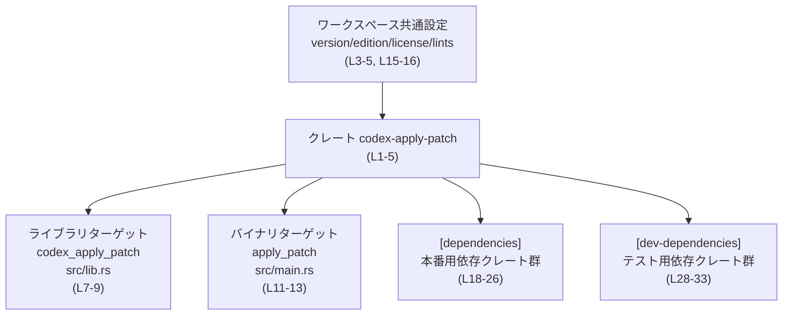
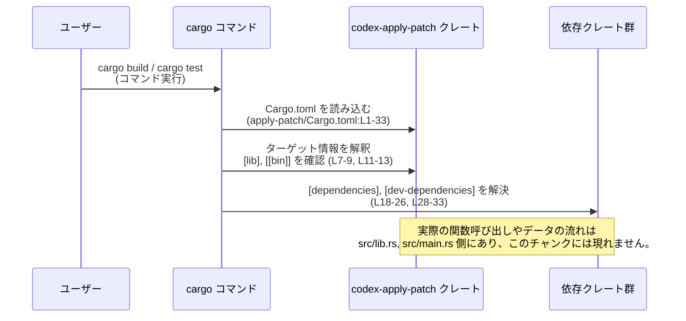

# apply-patch/Cargo.toml コード解説

## 0. ざっくり一言

`apply-patch/Cargo.toml` は、クレート `codex-apply-patch` の **Cargo マニフェスト**で、  
ライブラリ/バイナリターゲットと依存クレート（本番用・テスト用）を宣言する設定ファイルです（apply-patch/Cargo.toml:L1-5, L7-9, L11-13, L18-26, L28-33）。

---

## 1. このモジュールの役割

### 1.1 概要

- このファイルは、Rust のビルドツール Cargo に対して
  - クレート名やバージョンなどのメタデータ（`[package]`）（L1-5）
  - ライブラリターゲット `codex_apply_patch`（`src/lib.rs`）（L7-9）
  - バイナリターゲット `apply_patch`（`src/main.rs`）（L11-13）
  - 共通 lints 設定（L15-16）
  - 本番用依存クレート（`[dependencies]`）（L18-26）
  - テスト用依存クレート（`[dev-dependencies]`）（L28-33）
  を伝える役割を持ちます。
- 実際のロジックや公開 API は `src/lib.rs` / `src/main.rs` 側にあり、このファイルには関数や型定義は含まれていません（L7-9, L11-13）。

### 1.2 アーキテクチャ内での位置づけ

このファイルは、ワークスペースの一員として `codex-apply-patch` クレートを定義し、  
そのクレートがどのターゲット・どの依存クレート群を持つかを宣言しています（L1-5, L18-26, L28-33）。



> 図は `apply-patch/Cargo.toml:L1-33` の情報のみをもとに、Cargo レベルの依存関係構造を表しています。

### 1.3 設計上のポイント

- **ワークスペース集中管理**  
  - `version.workspace = true` / `edition.workspace = true` / `license.workspace = true` により、  
    バージョン・edition・ライセンスはワークスペース共通設定に委譲されています（L3-5）。
  - `[lints] workspace = true` により、lints 設定もワークスペース側で一元管理されます（L15-16）。
- **ライブラリ + バイナリ構成**  
  - ライブラリターゲット `codex_apply_patch`（L7-9）とバイナリターゲット `apply_patch`（L11-13）の両方を持つ構成になっています。
- **依存クレートもワークスペース経由**  
  - `anyhow = { workspace = true }` など、すべての依存クレートが `workspace = true` で宣言されており、  
    依存バージョンもワークスペース側で管理されます（L19-26, L29-33）。
- **安全性・エラー・並行性に関する示唆（用途は一般的な知識に基づく）**  
  - `anyhow` / `thiserror` が依存に含まれているため、エラー処理用のユーティリティを利用可能です（L19, L23）。  
    ※実際にどう使っているかは、このファイル単体からは分かりません。
  - `tokio` 依存（features: `"macros", "rt"`）により、非同期処理・並行実行が可能な構成になっています（L24）。  
    ※どの程度活用しているかは `src/lib.rs` / `src/main.rs` を見ないと分かりません。

---

## 2. 主要な機能一覧（マニフェストとしての機能）

- クレートメタデータの宣言（`[package]` セクション）（L1-5）
- ライブラリターゲット `codex_apply_patch` の定義（L7-9）
- バイナリターゲット `apply_patch` の定義（L11-13）
- ワークスペース共通 lints 設定の利用（L15-16）
- 実行時に利用可能な依存クレート群の宣言（`[dependencies]`）（L18-26）
- テストや開発時のみ利用する依存クレート群の宣言（`[dev-dependencies]`）（L28-33）

### 2.1 コンポーネントインベントリー（マニフェスト由来）

このチャンクから確認できる「コンポーネント」（ターゲット・依存クレートなど）の一覧です。

| コンポーネント名 | 種別 | 役割 / 説明 | 根拠 |
|------------------|------|-------------|------|
| `codex-apply-patch` | クレート（パッケージ） | クレート名・メタデータを持つパッケージ | apply-patch/Cargo.toml:L1-5 |
| `version.workspace` | ワークスペース継承設定 | バージョン番号をワークスペースから継承 | L3 |
| `edition.workspace` | ワークスペース継承設定 | Rust edition をワークスペースから継承 | L4 |
| `license.workspace` | ワークスペース継承設定 | ライセンス情報をワークスペースから継承 | L5 |
| `codex_apply_patch` | ライブラリターゲット | `src/lib.rs` をエントリポイントとするライブラリ | L7-9 |
| `apply_patch` | バイナリターゲット | `src/main.rs` をエントリポイントとする実行可能バイナリ | L11-13 |
| `[lints] workspace` | ワークスペース継承設定 | lints 設定をワークスペースから継承 | L15-16 |
| `anyhow` | 依存クレート | 本番コードで利用可能な依存クレート | L19 |
| `codex-exec-server` | 依存クレート | 本番コードで利用可能な依存クレート | L20 |
| `codex-utils-absolute-path` | 依存クレート | 本番コードで利用可能な依存クレート | L21 |
| `similar` | 依存クレート | 本番コードで利用可能な依存クレート | L22 |
| `thiserror` | 依存クレート | 本番コードで利用可能な依存クレート | L23 |
| `tokio` | 依存クレート | 本番コードで利用可能な依存クレート（features: `"macros", "rt"`） | L24 |
| `tree-sitter` | 依存クレート | 本番コードで利用可能な依存クレート | L25 |
| `tree-sitter-bash` | 依存クレート | 本番コードで利用可能な依存クレート | L26 |
| `assert_cmd` | dev 依存クレート | テストコードで利用可能な依存クレート | L29 |
| `assert_matches` | dev 依存クレート | テストコードで利用可能な依存クレート | L30 |
| `codex-utils-cargo-bin` | dev 依存クレート | テストコードで利用可能な依存クレート | L31 |
| `pretty_assertions` | dev 依存クレート | テストコードで利用可能な依存クレート | L32 |
| `tempfile` | dev 依存クレート | テストコードで利用可能な依存クレート | L33 |

> これら依存クレートが crates.io 由来か、ワークスペース内の別クレートかは、  
> `workspace = true` の定義がワークスペースルート側にあるため、このチャンク単体からは分かりません。

---

## 3. 公開 API と詳細解説

### 3.1 型一覧（構造体・列挙体など）

- `apply-patch/Cargo.toml` は **設定ファイル**であり、Rust の構造体や列挙体などの型定義は含みません。
- 型は `src/lib.rs` および `src/main.rs` に実装されていると推測されますが、内容はこのチャンクには現れません（L7-9, L11-13）。

### 3.2 関数詳細

- このファイルには関数定義が存在しないため、関数レベルの公開 API の解説は対象外です。
- 公開 API やコアロジックの詳細は `src/lib.rs`／`src/main.rs` 側の解析が必要です（パスのみが指定されています：L8-9, L12-13）。

### 3.3 その他の関数

- 同上の理由により、このセクションに該当する関数はありません。

---

## 4. データフロー

このチャンクから確実に言えるのは、**ビルド・テスト時の依存解決フロー**です。  
実行時にどの関数がどの依存クレートを呼ぶかといった詳細なデータフローは、このファイルには現れません。

### 4.1 ビルド・テストにおけるフロー（Cargo 観点）



- `[dependencies]` に列挙されたクレートは、ライブラリ/バイナリの両方から利用可能です（L18-26）。
- `[dev-dependencies]` はテストやサンプルなど、開発時にのみリンクされます（L28-33）。

---

## 5. 使い方（How to Use）

### 5.1 基本的な使用方法

`apply-patch/Cargo.toml` は通常、直接編集されるだけで、単体で「実行」するものではありません。  
ビルド・実行には `cargo` コマンドを用います。

```bash
# クレート（ライブラリ + バイナリ）をビルドする例
cargo build -p codex-apply-patch  # L1-5 に定義されたクレート名を指定

# apply_patch バイナリターゲットを実行する例
cargo run -p codex-apply-patch --bin apply_patch -- --help
#                    ^ クレート名 (L2)
#                                   ^ バイナリ名 (L12)
#                                           ^ 以降はバイナリに渡す引数（内容はこのチャンクからは不明）
```

### 5.2 よくある使用パターン

1. **テストの実行（dev-dependencies の利用）**

```bash
# テスト実行。assert_cmd や tempfile などはこのときにリンクされる (L29-33)
cargo test -p codex-apply-patch
```

1. **リリースビルド**

```bash
# 最適化有効のリリースビルド
cargo build -p codex-apply-patch --release
```

### 5.3 よくある間違い

#### 例 1: ワークスペース側に依存定義を追加せずに `workspace = true` を書く

```toml
# 間違い例（このファイル側だけに書いても不十分な場合）
[dependencies]
foo = { workspace = true }  # ルートの [workspace.dependencies] に foo がないと解決できない
```

```toml
# 正しい例（概念的なイメージ）
# ワークスペースルート側 Cargo.toml（このチャンクには現れない）
[workspace.dependencies]
foo = "1.2"

# apply-patch/Cargo.toml 側（L18-26 と同様の書き方）
[dependencies]
foo = { workspace = true }
```

> ルート側の `workspace.dependencies` がどうなっているかは、このチャンクには現れませんが、  
> `workspace = true` を使う以上、対応する定義が必要です。

#### 例 2: `src/lib.rs` / `src/main.rs` を削除する

```text
// 間違い例: マニフェストはそのままで src/main.rs を削除してしまう
// → apply_patch バイナリターゲット (L11-13) のエントリファイルが存在せず、ビルドエラーになる
```

```text
// 正しい例: ターゲットを削除するなら Cargo.toml 側の [[bin]] 設定も合わせて削除・変更する
```

### 5.4 使用上の注意点（まとめ）

- **ワークスペース依存**  
  - `version.workspace` / `edition.workspace` / `license.workspace` / `[lints] workspace` を使っているため、  
    これらを変更したい場合はワークスペースルートの `Cargo.toml` を編集する必要があります（L3-5, L15-16）。
- **依存クレートの管理**  
  - すべての依存が `workspace = true` で宣言されており（L19-26, L29-33）、  
    バージョンやソース（crates.io かローカルか）はワークスペースルート側に集約されています。
- **安全性・エラー・並行性に関する補足**  
  - エラー処理（`anyhow`, `thiserror`）、非同期ランタイム（`tokio`）など、安全なエラーハンドリングや並行処理を支援するクレートが依存に含まれています（L19, L23, L24）。  
    ただし、このチャンクからは、どの関数がどのようにそれらを使っているかは分かりません。
- **ビルド失敗の典型要因**  
  - ルートワークスペースで依存や共通設定を定義していない場合、`workspace = true` を解決できずビルドが失敗します。

---

## 6. 変更の仕方（How to Modify）

### 6.1 新しい機能を追加する場合

- **新しいロジックを追加**  
  - 実際の処理ロジックや公開 API は `src/lib.rs` と `src/main.rs` に実装される前提です（L8-9, L12-13）。
  - 新たに別クレートに依存する必要が出てきた場合:
    1. ワークスペースルートの `Cargo.toml` に `[workspace.dependencies]` として依存クレートを追加（このチャンクには現れません）。
    2. `apply-patch/Cargo.toml` の `[dependencies]` に `{ workspace = true }` 付きで追加（L18-26 と同様の書式）。
- **新しいバイナリターゲットを追加**  
  - 新しい CLI ツールを追加する場合は、`[[bin]]` エントリを増やすのが自然です。  
    例（概念的な記述・このチャンクには未定義）:

    ```toml
    [[bin]]
    name = "new_tool"
    path = "src/bin/new_tool.rs"
    ```

  - 追加する場合は、対応する `src/bin/new_tool.rs` を作成する必要があります。

### 6.2 既存の機能を変更する場合

- **クレート名を変更する場合**  
  - `[package].name` を変更すると（L2）、`cargo build -p <名前>` や他クレートの依存指定に影響します。  
    このチャンクだけでは、どこから参照されているかは分からないため、ワークスペース全体での参照箇所確認が必要です。
- **バイナリ名・パスを変更する場合**  
  - `[[bin]].name` / `[[bin]].path`（L11-13）を変更するときは、  
    - 実際のファイルパスが存在すること
    - このバイナリ名を前提にしているスクリプトやドキュメントがないか
    を確認する必要があります（依存先はこのチャンクには現れません）。
- **依存クレートの削除・追加**  
  - `[dependencies]` / `[dev-dependencies]` からの削除は、該当クレートを使っているコードがないことを確認する必要があります（L18-26, L28-33）。  
  - 追加する際は、ワークスペースルート側との整合を取る必要があります（`workspace = true` 利用のため）。

---

## 7. 関連ファイル

このマニフェストと密接に関係するファイル・設定をまとめます。

| パス / 場所 | 役割 / 関係 | 備考 |
|-------------|------------|------|
| `apply-patch/src/lib.rs` | ライブラリターゲット `codex_apply_patch` の実装ファイル | パスは Cargo.toml から分かりますが、内容はこのチャンクには現れません（L7-9）。 |
| `apply-patch/src/main.rs` | バイナリターゲット `apply_patch` のエントリポイント | 同上（L11-13）。 |
| ワークスペースルートの `Cargo.toml` | `version`・`edition`・`license`・`lints`・`workspace.dependencies` を定義するファイル | パスは不明ですが、`workspace = true` の記述から存在が推定されます（L3-5, L15-16, L19-26, L29-33）。 |
| 各依存クレート (`anyhow`, `tokio`, `tree-sitter` など) | ビルド時にリンクされる外部/内部クレート | これらが crates.io 由来か、ローカルパスかはワークスペースルート側の設定に依存し、このチャンクには現れません。 |
| テストコード（パス不明） | `assert_cmd` や `tempfile` など dev-dependencies を利用するコード | テストファイル自体の場所はこのチャンクからは分かりませんが、存在が想定されます（L28-33）。 |

> 公開 API やコアロジック（特に安全性・エラー処理・並行性の詳細）を把握するには、  
> `src/lib.rs` / `src/main.rs` およびワークスペースルート `Cargo.toml` の内容を合わせて確認する必要があります。
