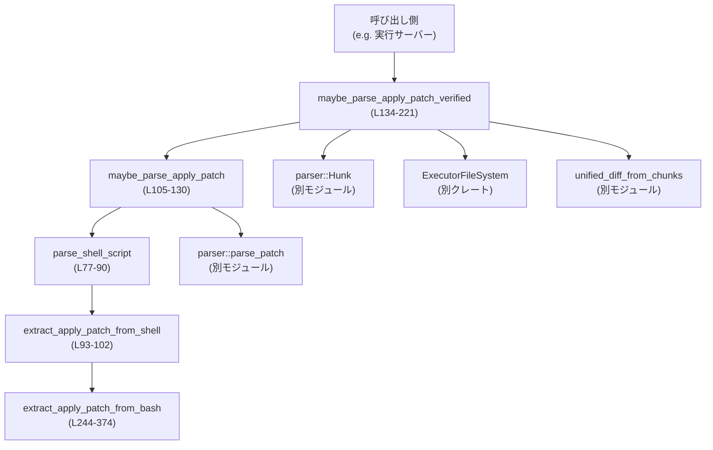
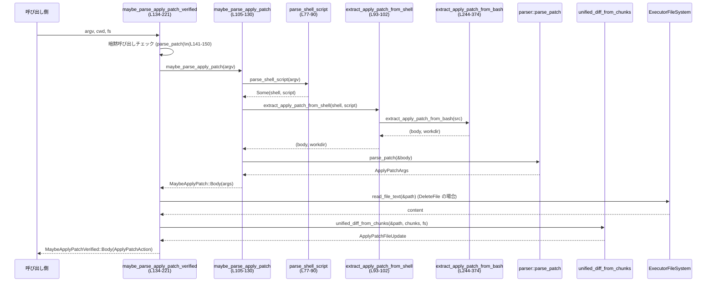

# apply-patch/src/invocation.rs コード解説

## 0. ざっくり一言

このモジュールは、`apply_patch` / `applypatch` コマンド呼び出し（直接またはシェルスクリプト経由）からパッチ本文と作業ディレクトリを抽出し、パッチの妥当性検証とファイル変更一覧 (`ApplyPatchAction`) を組み立てる役割を持ちます。Bash 用 Tree‑sitter を使って heredoc 形式も安全に認識します。

---

## 1. このモジュールの役割

### 1.1 概要

- このモジュールは **「引数ベースのコマンド呼び出しから、パッチ適用アクションへの変換」** を行う部分です。
- 具体的には:
  - `argv: &[String]` から、`apply_patch`/`applypatch` の直接呼び出しや、`bash` / PowerShell / `cmd.exe` 経由の heredoc 呼び出しを判別します（`maybe_parse_apply_patch`）。  
    （`invocation.rs:L105-130`）
  - パッチ本文を `parse_patch` で構文解析して `ApplyPatchArgs` を生成します（同上）。
  - 実ファイルシステム (`ExecutorFileSystem`) を読みながら、追加・削除・更新の各ハンクから `ApplyPatchAction` を組み立てます（`maybe_parse_apply_patch_verified`、`invocation.rs:L134-221`）。
  - Bash 用 Tree‑sitter で `cd ... && apply_patch <<'EOF'` などの heredoc スクリプトからパッチ本文と作業ディレクトリを抽出します（`extract_apply_patch_from_bash`、`invocation.rs:L244-374`）。

### 1.2 アーキテクチャ内での位置づけ

主要な依存関係は次の通りです。

- `parser::parse_patch` / `Hunk` / `ParseError`  
  パッチテキストの構文解析とハンク表現を提供します（`invocation.rs:L20-22`）。
- `ApplyPatchArgs`, `ApplyPatchAction`, `ApplyPatchFileChange`, `ApplyPatchFileUpdate`, `ApplyPatchError`, `MaybeApplyPatchVerified`, `IoError`  
  パッチ内容と検証結果を表現するドメイン型です（`invocation.rs:L13-19`）。
- `ExecutorFileSystem`  
  非同期にファイル内容を読み書きする抽象化で、検証時に利用します（`invocation.rs:L5`, `L134-138`, `L173-180`, `L195-199`）。
- Tree‑sitter Bash (`tree_sitter_bash::LANGUAGE`) と `Query` / `Parser` / `QueryCursor`  
  Bash スクリプトから apply_patch heredoc 呼び出しを抽出します（`invocation.rs:L7-11`, `L268-313`, `L315-329`）。

依存関係の概要を Mermaids 図で示します。



### 1.3 設計上のポイント

- **二段階の状態表現**
  - パースのみを行う `MaybeApplyPatch`（パッチ本文の抽出と構文解析）と、ファイルシステムを伴う検証と変換まで行う `MaybeApplyPatchVerified` を分離しています（`invocation.rs:L36-41`, `L134-221`）。
- **シェルごとのラッパーをシンプルに解析**
  - シェル名とフラグから簡易的にシェル種別を判定し（`classify_shell`, `invocation.rs:L60-69`）、`bash -lc`, `powershell -Command`, `cmd /c` といった正規の形だけを対応します（`parse_shell_script`, `invocation.rs:L77-90`）。
- **heredoc スクリプトの保守的なマッチング**
  - Tree‑sitter Bash で AST を構築し、**単一の top‑level ステートメント** かつ `apply_patch` / `applypatch` への heredoc リダイレクトのみを受け付ける厳密なクエリを使っています（`invocation.rs:L268-313`）。
  - `cd <path> && apply_patch <<'EOF'` 形式のみを特別扱いし、それ以外（前後に別コマンドがある・`cd` の引数が複数など）はマッチさせません（`invocation.rs:L287-309`, テスト群 `L602-669` 周辺）。
- **暗黙的なパッチ適用の禁止**
  - 引数が「生のパッチ本文だけ」の場合や、シェルスクリプト全体が生のパッチ本文のときは、**明示的な apply_patch 呼び出しではない** と見なして `ImplicitInvocation` エラーにします（`invocation.rs:L139-150`）。
- **エラー種類の明確化**
  - シェル解析由来のエラー（`ExtractHeredocError`）、パッチ構文解析エラー（`ParseError`）、検証時の IO エラーなどを、別々の列挙体・バリアントで区別しています（`invocation.rs:L36-51`, `L176-181`, `L218-220`）。

---

## 2. 主要な機能一覧

- `maybe_parse_apply_patch`: `argv` から apply_patch 呼び出しかどうかを判定し、パッチ本文を抽出・構文解析して `MaybeApplyPatch` を返す（`invocation.rs:L105-130`）。
- `maybe_parse_apply_patch_verified`: 上記に加え、カレントディレクトリとファイルシステムを用いてハンクを検証し、`ApplyPatchAction` を含む `MaybeApplyPatchVerified` を返す（`invocation.rs:L134-221`）。
- Bash / PowerShell / Cmd スクリプトからの heredoc 呼び出し解析：
  - `parse_shell_script`: `bash` / PowerShell / `cmd.exe` 呼び出しの引数から、シェル種別とスクリプト文字列を抽出（`invocation.rs:L77-90`）。
  - `extract_apply_patch_from_shell`: シェル種別ごとの解析入口（現状すべて `extract_apply_patch_from_bash` に委譲）（`invocation.rs:L93-102`）。
  - `extract_apply_patch_from_bash`: Tree‑sitter Bash を使い、`cd ... && apply_patch <<'EOF'` や `apply_patch <<'EOF'` の heredoc 本文と `cd` パスを抽出（`invocation.rs:L244-374`）。
- シェル名やフラグの判定ユーティリティ：
  - `classify_shell_name`: パスからシェル名の stem を小文字で取得（`invocation.rs:L53-58`）。
  - `classify_shell`: シェル名と実行フラグから `ApplyPatchShell` を判定（`invocation.rs:L60-69`）。
  - `can_skip_flag`: PowerShell 系の `-NoProfile` をスキップ対象フラグとして判定（`invocation.rs:L71-75`）。

---

## 3. 公開 API と詳細解説

### 3.1 型一覧（構造体・列挙体など）

#### このファイル内で定義される型

| 名前 | 種別 | 公開 | 行範囲 | 役割 / 用途 |
|------|------|------|--------|-------------|
| `ApplyPatchShell` | enum | 非公開 | `invocation.rs:L29-34` | シェル種別を表す内部用の列挙体。`Unix` / `PowerShell` / `Cmd` の 3 値。シェルスクリプト解析の分岐に用いられます。 |
| `MaybeApplyPatch` | enum | 公開 | `invocation.rs:L36-41` | `maybe_parse_apply_patch` の結果を表す。成功時は `Body(ApplyPatchArgs)`、そうでなければ「シェル解析エラー」「パッチ解析エラー」「そもそも apply_patch ではない」の 3 種類を表現します。 |
| `ExtractHeredocError` | enum | 公開 | `invocation.rs:L44-51` | heredoc 抽出時のエラー種別。Bash grammar のロード失敗、AST 生成失敗、UTF-8 エラー、マッチしなかった場合などを区別します。 |

#### 他モジュール定義だが公開関数シグネチャで現れる主な型

※定義はこのファイル外であり、ここでは利用範囲のみを記載します。

| 名前 | 出典 | 用途 / 現れ方 |
|------|------|---------------|
| `ApplyPatchArgs` | `crate` | `MaybeApplyPatch::Body` の中身として、元パッチ文字列 (`patch`)、ハンク一覧 (`hunks`)、`workdir` 情報などを保持します（使用: `invocation.rs:L153-157`, `L438-443` など）。 |
| `ApplyPatchAction` | `crate` | 検証済みパッチ適用アクション。`changes: HashMap<PathBuf, ApplyPatchFileChange>` と `patch`, `cwd` を少なくとも持ちます（使用: `invocation.rs:L13`, `L212-216`, テスト `L780-795`, `L828-847`）。 |
| `ApplyPatchFileChange` | `crate` | 個々のファイルに対する「追加」「削除」「更新」を表す列挙体。`Add { content }` / `Delete { content }` / `Update { unified_diff, move_path, new_content }` として使われています（`invocation.rs:L16`, `L167-170`, `L184-187`, `L203-207`）。 |
| `ApplyPatchFileUpdate` | `crate` | 更新系ハンクから生成される unified diff と新ファイル内容のペア。`unified_diff_from_chunks` の戻り値として使われます（`invocation.rs:L17`, `L192-200`）。 |
| `ApplyPatchError` | `crate` | 検証時のエラー種別。`ImplicitInvocation` や `IoError(IoError)` などとして用いられます（`invocation.rs:L15`, `L144`, `L176-181`, `L219-220`）。 |
| `IoError` | `crate` | IO エラーのラッパーで、`context` と元のエラー (`source`) を保持します（`invocation.rs:L18`, `L176-180`）。 |
| `MaybeApplyPatchVerified` | `crate` | 検証付きパース結果。`Body(ApplyPatchAction)` / `CorrectnessError(ApplyPatchError)` / `ShellParseError(ExtractHeredocError)` / `NotApplyPatch` 等のバリアントが存在すると読み取れます（`invocation.rs:L19`, `L144-150`, `L212-221`）。 |
| `Hunk` | `crate::parser` | パッチ内の一つのファイル変更を表す列挙体。`AddFile`, `DeleteFile`, `UpdateFile { move_path, chunks, .. }` などのバリアントがあります（`invocation.rs:L20`, `L163-210`）。 |
| `ParseError` | `crate::parser` | `parse_patch` の構文解析エラー型（`invocation.rs:L21`, `L40`, `L108-111`, `L115-121`, `L219`）。 |
| `ExecutorFileSystem` | `codex_exec_server` | 非同期ファイルシステム抽象。`read_file_text(&path).await` を用いて既存ファイル内容を取得します（`invocation.rs:L5`, `L134-138`, `L173-180`）。 |

### 3.2 関数詳細（主要関数）

#### `maybe_parse_apply_patch(argv: &[String]) -> MaybeApplyPatch`

**概要**

- `argv` が apply_patch 呼び出しに該当するかを判定し、該当する場合はパッチ本文を `parse_patch` で解析して `ApplyPatchArgs` を返します。  
- 対応形態は:
  - 直接呼び出し: `apply_patch "<patch body>"` または `applypatch "<patch body>"`（`invocation.rs:L107-111`）。
  - シェル経由: `bash -lc 'cd ... && apply_patch <<PATCH ...'` など（`invocation.rs:L112-128`）。

**シグネチャと位置**

- シグネチャ: `pub fn maybe_parse_apply_patch(argv: &[String]) -> MaybeApplyPatch`
- 行範囲: `invocation.rs:L105-130`

**引数**

| 引数名 | 型 | 説明 |
|--------|----|------|
| `argv` | `&[String]` | コマンドライン引数全体。`argv[0]` がコマンド名またはシェル、`argv[1..]` がフラグ・スクリプト等。 |

**戻り値**

- `MaybeApplyPatch::Body(ApplyPatchArgs)`  
  正しく apply_patch 呼び出しとして認識でき、かつパッチ構文解析に成功した場合。
- `MaybeApplyPatch::ShellParseError(ExtractHeredocError)`  
  シェルスクリプト経由での呼び出しと判定されたが、heredoc 抽出などでエラーになった場合（`invocation.rs:L114-126`）。
- `MaybeApplyPatch::PatchParseError(ParseError)`  
  apply_patch 呼び出しとしては認識できたが、パッチ本文の構文解析に失敗した場合（`invocation.rs:L108-111`, `L115-121`）。
- `MaybeApplyPatch::NotApplyPatch`  
  そもそも apply_patch 呼び出しではない、または認識対象外パターンのスクリプトだった場合（`invocation.rs:L122-123`, `L127-128`）。

**内部処理の流れ**

1. `match argv` により、2 要素の「直接呼び出し」パターンとそれ以外を分岐します（`invocation.rs:L106-112`）。
2. 直接呼び出しパターン `[cmd, body]` では:
   - `cmd.as_str()` が `"apply_patch"` または `"applypatch"` のいずれかかを `APPLY_PATCH_COMMANDS.contains` で確認（`invocation.rs:L108`）。
   - 一致すれば `parse_patch(body)` を呼び、成功なら `Body(ApplyPatchArgs)`、失敗なら `PatchParseError(e)` を返します（`invocation.rs:L108-111`）。
3. それ以外のパターンでは:
   - `parse_shell_script(argv)` で `bash` / PowerShell / `cmd.exe` 形式を認識し、`Some((shell, script))` ならさらに処理（`invocation.rs:L113-114`）。
   - `extract_apply_patch_from_shell(shell, script)` で heredoc から `(body, workdir)` を抽出（`invocation.rs:L114`）。
   - 抽出成功時は `parse_patch(&body)` を呼び、成功なら `ApplyPatchArgs` に `workdir` を書き戻して `Body(...)` を返します（`invocation.rs:L115-119`）。
   - `extract_apply_patch_from_shell` が `CommandDidNotStartWithApplyPatch` を返したときは「apply_patch 呼び出しではなかった」とみなし `NotApplyPatch` を返します（`invocation.rs:L122-123`）。
   - その他の `ExtractHeredocError` は `ShellParseError` にラップされます（`invocation.rs:L125-126`）。
   - `parse_shell_script(argv)` 自体が `None` の場合も `NotApplyPatch` を返します（`invocation.rs:L127-128`）。

**Examples（使用例）**

直接呼び出しでパッチを解析する例です。

```rust
use crate::invocation::maybe_parse_apply_patch;
use crate::invocation::MaybeApplyPatch;

let argv = vec![
    "apply_patch".to_string(), // コマンド名
    r#"*** Begin Patch
*** Add File: foo
+hi
*** End Patch
"#.to_string(),
];

match maybe_parse_apply_patch(&argv) {                    // invocation.rs:L105-130
    MaybeApplyPatch::Body(args) => {
        // args.hunks や args.patch, args.workdir を利用して後続処理へ渡す
        println!("parsed {} hunks", args.hunks.len());
    }
    MaybeApplyPatch::NotApplyPatch => {
        // apply_patch 呼び出しではなかった
    }
    MaybeApplyPatch::PatchParseError(e) => {
        // パッチ構文が不正
        eprintln!("patch parse error: {e:?}");
    }
    MaybeApplyPatch::ShellParseError(e) => {
        // シェル heredoc 解析エラー
        eprintln!("shell parse error: {e:?}");
    }
}
```

**Errors / Panics**

- `parse_patch` が `Err(ParseError)` を返した場合、`MaybeApplyPatch::PatchParseError(e)` になります（`invocation.rs:L108-111`, `L115-121`）。
- heredoc 抽出時のエラーは `MaybeApplyPatch::ShellParseError(e)` または `NotApplyPatch` にマッピングされます（`invocation.rs:L114-126`）。
- この関数内で明示的に `panic!` を呼び出している箇所はありません。

**Edge cases（エッジケース）**

- `argv.len() != 2` かつ `parse_shell_script(argv)` が `None` の場合は、たとえ引数中に `"*** Begin Patch"` 等が含まれていても `NotApplyPatch` になります（`invocation.rs:L113`, `L127-128`）。
- heredoc 解析で `CommandDidNotStartWithApplyPatch` が返るケース（`extract_apply_patch_from_bash` が一切マッチしない場合）は、シェル解析エラーではなく「apply_patch 呼び出しではなかった」とみなされます（`invocation.rs:L122-123`）。
- パッチ本文中の `workdir` は `parse_patch` が構築する `ApplyPatchArgs` に含まれるフィールドであり、heredoc から得た `workdir` に上書きされます（`invocation.rs:L115-119`）。

**使用上の注意点**

- この関数はファイルシステムへのアクセスや検証を行いません。パッチが適用可能かどうかは `maybe_parse_apply_patch_verified` で確認する必要があります。
- `argv` が生のパッチ本文 1 要素だけであっても、ここでは `MaybeApplyPatch::NotApplyPatch` になり得ます。暗黙呼び出し検出は `maybe_parse_apply_patch_verified` 側で行われます（`invocation.rs:L141-150`）。

---

#### `maybe_parse_apply_patch_verified(argv: &[String], cwd: &AbsolutePathBuf, fs: &dyn ExecutorFileSystem) -> MaybeApplyPatchVerified`

**概要**

- `maybe_parse_apply_patch` の結果に対し、ファイルシステムからの読み取りを含む検証と変換を行い、`ApplyPatchAction` を生成します。  
- さらに、「コマンドとして apply_patch を明示せず、生のパッチ本文だけが渡された」ケースを検出して明示的エラー (`ImplicitInvocation`) とします（`invocation.rs:L139-150`）。

**シグネチャと位置**

- シグネチャ:  
  `pub async fn maybe_parse_apply_patch_verified(argv: &[String], cwd: &AbsolutePathBuf, fs: &dyn ExecutorFileSystem) -> MaybeApplyPatchVerified`
- 行範囲: `invocation.rs:L134-221`

**引数**

| 引数名 | 型 | 説明 |
|--------|----|------|
| `argv` | `&[String]` | コマンドライン引数。`maybe_parse_apply_patch` と同様。 |
| `cwd` | `&AbsolutePathBuf` | 現在の作業ディレクトリ。コメントで「絶対パスである必要がある」と明記されています（`invocation.rs:L132-138`）。 |
| `fs` | `&dyn ExecutorFileSystem` | ファイルシステム抽象。既存ファイルの内容読み取りや unified diff 生成で使用されます。 |

**戻り値**

- `MaybeApplyPatchVerified::Body(ApplyPatchAction)`  
  パッチが正しく parse され、ファイルシステムとの整合性チェックも通過した場合（`invocation.rs:L212-216`）。
- `MaybeApplyPatchVerified::CorrectnessError(ApplyPatchError)`  
  暗黙的呼び出し (`ImplicitInvocation`)、IO エラー (`IoError`)、unified diff 生成エラーなど、パッチ適用の正しさに関わるエラー（`invocation.rs:L144`, `L176-181`, `L195-199`, `L219-220`）。
- `MaybeApplyPatchVerified::ShellParseError(ExtractHeredocError)`  
  シェル解析の失敗（`invocation.rs:L218`）。
- `MaybeApplyPatchVerified::NotApplyPatch`  
  もともと apply_patch 呼び出しではなかった場合（`invocation.rs:L220-221`）。

**内部処理の流れ**

1. **暗黙的なパッチ呼び出しの検出**（CorrectnessError）
   - `if let [body] = argv && parse_patch(body).is_ok()` で、引数が 1 つだけの生パッチ本文でないかを確認し、そうであれば `ImplicitInvocation` エラーを返します（`invocation.rs:L141-145`）。
   - 同様に、`if let Some((_, script)) = parse_shell_script(argv) && parse_patch(script).is_ok()` で、シェルスクリプト全体がパッチ本文として parse 可能な場合も `ImplicitInvocation` とします（`invocation.rs:L146-150`）。
2. **基本パース**
   - `maybe_parse_apply_patch(argv)` を呼び、`MaybeApplyPatch` を取得（`invocation.rs:L152`）。
3. **成功ケース (`MaybeApplyPatch::Body`) の処理**
   - `ApplyPatchArgs { patch, hunks, workdir }` をパターンマッチで取り出し（`invocation.rs:L153-157`）。
   - `workdir` が `Some(dir)` なら `cwd.join(dir)` を、`None` なら `cwd.clone()` を `effective_cwd` として使用（`invocation.rs:L158-161`）。
   - `changes: HashMap` を生成し、各 `Hunk` について以下のように変換します（`invocation.rs:L162-211`）:
     - `Hunk::AddFile { contents, .. }`  
       → `ApplyPatchFileChange::Add { content: contents }`（`invocation.rs:L166-171`）。
     - `Hunk::DeleteFile { .. }`  
       → 現在のファイル内容を `fs.read_file_text(&path).await` で取得し、`ApplyPatchFileChange::Delete { content }` に格納（`invocation.rs:L172-187`）。IO エラー時は `ApplyPatchError::IoError` にラップして `CorrectnessError` を返して終了（`invocation.rs:L176-181`）。
     - `Hunk::UpdateFile { move_path, chunks, .. }`  
       → `unified_diff_from_chunks(&path, &chunks, fs).await` で `ApplyPatchFileUpdate { unified_diff, content }` を取得（`invocation.rs:L192-200`）。  
       → これを `ApplyPatchFileChange::Update { unified_diff, move_path: move_path.map(|p| effective_cwd.join(p).into_path_buf()), new_content: contents }` に変換（`invocation.rs:L201-207`）。
   - 最終的に `MaybeApplyPatchVerified::Body(ApplyPatchAction { changes, patch, cwd: effective_cwd })` を返します（`invocation.rs:L212-216`）。
4. **その他の `MaybeApplyPatch` バリアントの処理**
   - `ShellParseError(e)` → `MaybeApplyPatchVerified::ShellParseError(e)`（`invocation.rs:L218`）。
   - `PatchParseError(e)` → `MaybeApplyPatchVerified::CorrectnessError(e.into())`（`invocation.rs:L219`）。
   - `NotApplyPatch` → `MaybeApplyPatchVerified::NotApplyPatch`（`invocation.rs:L220-221`）。

**Examples（使用例）**

基本的な使用方法の例です。`LOCAL_FS` のような実装はテストで使用されているものと同等と考えられます（`invocation.rs:L381-382`）。

```rust
use codex_utils_absolute_path::AbsolutePathBuf;
use codex_exec_server::ExecutorFileSystem;
use crate::invocation::{maybe_parse_apply_patch_verified, MaybeApplyPatchVerified};
use crate::{ApplyPatchError};

async fn handle_command(
    argv: Vec<String>,
    cwd: &AbsolutePathBuf,
    fs: &dyn ExecutorFileSystem,
) {
    match maybe_parse_apply_patch_verified(&argv, cwd, fs).await { // invocation.rs:L134-221
        MaybeApplyPatchVerified::Body(action) => {
            // action.changes() を見てファイルの追加・削除・更新を行う
            // action.cwd が適用時の基準ディレクトリ
            for (path, change) in action.changes() {
                println!("will change {:?}", path);
                // 実際の適用は別コンポーネントで行う想定
            }
        }
        MaybeApplyPatchVerified::CorrectnessError(e) => match e {
            ApplyPatchError::ImplicitInvocation => {
                eprintln!("apply_patch コマンドを明示せずにパッチが渡されました");
            }
            other => {
                eprintln!("patch correctness error: {other:?}");
            }
        },
        MaybeApplyPatchVerified::ShellParseError(e) => {
            eprintln!("shell heredoc parse error: {e:?}");
        }
        MaybeApplyPatchVerified::NotApplyPatch => {
            // 単なる通常コマンドとして処理する、など
        }
    }
}
```

**Errors / Panics**

- 明示的エラー:
  - `argv` が単一の生パッチ本文、またはシェルスクリプト全体がパッチとして parse 可能な場合 → `CorrectnessError(ApplyPatchError::ImplicitInvocation)`（`invocation.rs:L141-150`）。
  - `Hunk::DeleteFile` の対象ファイル読み取りに失敗 → `CorrectnessError(ApplyPatchError::IoError(IoError { context: "Failed to read ...", source: e }))`（`invocation.rs:L172-181`）。
  - `unified_diff_from_chunks` がエラー → `CorrectnessError(e)`（`invocation.rs:L192-199`）。
  - `maybe_parse_apply_patch` が `PatchParseError` を返した場合 → `CorrectnessError(e.into())`（`invocation.rs:L219`）。
- この関数内に `panic!` 呼び出しはありません。

**Edge cases（エッジケース）**

- `workdir` が `Some` の場合、`cwd` と `workdir` の結合により `effective_cwd` が変化します。その結果、`Hunk::UpdateFile` の `move_path` も `effective_cwd` 基準の絶対パスに解決されます（`invocation.rs:L158-161`, `L205-206`）。`test_apply_patch_resolves_move_path_with_effective_cwd` がこの挙動を検証しています（`invocation.rs:L800-847`）。
- `Hunk::DeleteFile` で対象ファイルが存在しない場合（`read_file_text` がエラー）は、その時点で即座に `CorrectnessError` を返し、他のファイル変更は実行されません（`invocation.rs:L172-181`）。
- `MaybeApplyPatch::NotApplyPatch` はそのまま `MaybeApplyPatchVerified::NotApplyPatch` となるため、「apply_patch ではない通常コマンド」はここでは何も行われません（`invocation.rs:L220-221`）。

**使用上の注意点**

- `cwd` はコメントにあるように「絶対パスであること」が前提です（`invocation.rs:L132-134`）。相対パスを渡すと、`workdir` の結合結果も相対になり、他コンポーネントとの整合性が崩れる可能性があります。
- この関数は非同期 (`async fn`) であり、`ExecutorFileSystem` の実装も非同期 IO を前提としています。同期コンテキストから呼ぶ場合は適切な async ランタイム（`tokio` など）が必要です。
- `ImplicitInvocation` エラーの存在により、「ユーザーの入力した単なるパッチ文字列」を誤って apply_patch 呼び出しとして扱うことを防いでいます。そのため、「本当に apply_patch コマンドを使いたい」ケースでは、`argv` にコマンド名を含める必要があります。

---

#### `parse_shell_script(argv: &[String]) -> Option<(ApplyPatchShell, &str)>`

**概要**

- `argv` が `bash` / PowerShell / `cmd.exe` のいずれかの形式で、スクリプト文字列を最後の引数として持つかどうかを判定し、シェル種別とスクリプト文字列を返します（`invocation.rs:L77-90`）。

**位置**

- 行範囲: `invocation.rs:L77-90`

**引数**

| 引数名 | 型 | 説明 |
|--------|----|------|
| `argv` | `&[String]` | コマンドライン引数。少なくとも 3 要素（シェル、フラグ、スクリプト）を期待。 |

**戻り値**

- `Some((shell_type, script))`  
  形式が認識できた場合。`shell_type` は `ApplyPatchShell`、`script` は `&str` で参照するスクリプト文字列。
- `None`  
  いずれのサポート形式にも一致しない場合。

**内部処理の流れ**

1. 配列パターンマッチで 2 つの形をサポート（`invocation.rs:L78-88`）:
   - `[shell, flag, script]`  
     → `classify_shell(shell, flag)` が `Some(shell_type)` のとき `Some((shell_type, script.as_str()))`。
   - `[shell, skip_flag, flag, script]`  
     → `can_skip_flag(shell, skip_flag)` が `true` かつ `classify_shell(shell, flag)` が `Some(shell_type)` のとき `Some((shell_type, script.as_str()))`。
2. それ以外の長さ・形の `argv` は `None` を返します（`invocation.rs:L89-90`）。

**使用上の注意点**

- PowerShell 系の `-NoProfile` フラグは `can_skip_flag` によりスキップとして扱われるため、`["powershell.exe", "-NoProfile", "-Command", script]` のような形にも対応しています（`invocation.rs:L71-75`, テスト `L587-595`）。
- シェル名は `classify_shell_name` によってパス末尾の stem から小文字化したものを用いており、`bash.exe` / `powershell.exe` のような拡張子付きでも認識されます（`invocation.rs:L53-58`）。

---

#### `extract_apply_patch_from_shell(shell: ApplyPatchShell, script: &str) -> Result<(String, Option<String>), ExtractHeredocError>`

**概要**

- シェル種別に応じて、`script` から heredoc 形式の apply_patch 呼び出しを抽出します。
- 現状は `ApplyPatchShell` の 3 種類すべてを `extract_apply_patch_from_bash` に委譲しています（`invocation.rs:L97-101`）。

**位置**

- 行範囲: `invocation.rs:L93-102`

**引数**

| 引数名 | 型 | 説明 |
|--------|----|------|
| `shell` | `ApplyPatchShell` | `parse_shell_script` により判定されたシェル種別。 |
| `script` | `&str` | シェルに渡されるスクリプト全体。 |

**戻り値**

- `Ok((heredoc_body, workdir))`  
  `extract_apply_patch_from_bash` が成功した場合。`workdir` は `cd <path>` があれば `Some(path)`、なければ `None`。
- `Err(ExtractHeredocError)`  
  Bash grammar ロード失敗、AST 生成失敗、heredoc 抽出失敗など。

**内部処理の流れ**

- `match shell { ApplyPatchShell::Unix | ApplyPatchShell::PowerShell | ApplyPatchShell::Cmd => extract_apply_patch_from_bash(script) }` という形で、現状はシェル種別による分岐は行っていません（`invocation.rs:L97-101`）。

**使用上の注意点**

- PowerShell / Cmd 向けのスクリプトも、Bash 用 Tree‑sitter grammar で parse できる範囲に制限して利用していると解釈できます（コードからは、同じ `extract_apply_patch_from_bash` に渡しています）。  
  これは、テストで PowerShell / Cmd でも同じ heredoc 形式のスクリプトを渡していることに対応しています（`invocation.rs:L583-606`）。
- シェル種別ごとに文法差異を厳密に考慮しているわけではなく、「ごく限定された apply_patch heredoc パターンのみを認識する」ことを優先している構造です。

---

#### `extract_apply_patch_from_bash(src: &str) -> Result<(String, Option<String>), ExtractHeredocError>`

**概要**

- Bash スクリプト `src` を Tree‑sitter で解析し、次のどちらかのパターンにマッチする場合に heredoc 本文と `cd` パスを抽出します（`invocation.rs:L244-243` のコメント参照）。
  - `apply_patch <<'EOF'\n...\nEOF`
  - `cd <path> && apply_patch <<'EOF'\n...\nEOF`

**位置**

- 行範囲: `invocation.rs:L244-374`

**引数**

| 引数名 | 型 | 説明 |
|--------|----|------|
| `src` | `&str` | Bash スクリプト全体。UTF-8 文字列。 |

**戻り値**

- `Ok((heredoc_body, Some(path)))`  
  `cd <path> && apply_patch <<...` パターンにマッチした場合。`path` は quoted/unquoted を考慮して抽出されたパス文字列。
- `Ok((heredoc_body, None))`  
  `apply_patch <<...` 直書きパターン。
- `Err(ExtractHeredocError::FailedToLoadBashGrammar(_))`  
  `parser.set_language(&lang)` に失敗した場合（`invocation.rs:L315-319`）。
- `Err(ExtractHeredocError::FailedToParsePatchIntoAst)`  
  `parser.parse(src, None)` が `None` を返した場合（`invocation.rs:L320-322`）。
- `Err(ExtractHeredocError::HeredocNotUtf8(_))`  
  `utf8_text(bytes)` 呼び出しで UTF-8 エラーが発生した場合（`invocation.rs:L337-341`, `L347-350`, `L355-357`）。
- `Err(ExtractHeredocError::CommandDidNotStartWithApplyPatch)`  
  Tree‑sitter クエリにマッチするノードが一つも無かった場合（`invocation.rs:L373`）。

**内部処理の流れ**

1. **Tree‑sitter Query の定義**（静的初期化）
   - `LazyLock<Query>` により `APPLY_PATCH_QUERY` を一度だけコンパイル済クエリとして保持します（`invocation.rs:L268-313`）。
   - クエリは 2 つのパターンを定義します（`invocation.rs:L274-285`, `L287-309`）:
     - `program` の唯一の top‑level 子として `redirected_statement` があり、その `body` が `command`（`apply_patch` or `applypatch`）であるパターン。
     - 同じく `redirected_statement` の `body` が `list` で、`cd <path> && apply_patch` になっているパターン。
   - `cd` の引数としては `(word)`, `(string (string_content))`, `(raw_string)` のいずれかを許容し、それぞれ `cd_path` または `cd_raw_string` として capture します（`invocation.rs:L291-297`）。
2. **AST 生成**
   - `Parser::new()` → `set_language(&lang)` → `parse(src, None)` で AST (`tree`) を生成し、`root_node` を取得します（`invocation.rs:L315-325`）。
3. **クエリ実行とキャプチャ処理**
   - `QueryCursor::new()` → `cursor.matches(&APPLY_PATCH_QUERY, root, bytes)` を用いてマッチ列挙を開始します（`invocation.rs:L327-328`）。
   - 各マッチ `m` について `m.captures` を走査し、`capture.index` に対応する capture 名を `APPLY_PATCH_QUERY.capture_names()` から取得します（`invocation.rs:L333-335`）。
   - `match name` により:
     - `"heredoc"`: `utf8_text(bytes)` → `trim_end_matches('\n')` → `heredoc_text` に格納（`invocation.rs:L336-343`）。
     - `"cd_path"`: `utf8_text(bytes)` をそのまま `cd_path` に格納（`invocation.rs:L345-351`）。
     - `"cd_raw_string"`: raw string（例: `'foo bar'`）から前後の `'` を削って `cd_path` に格納（`invocation.rs:L353-362`）。
4. **結果の返却**
   - `heredoc_text` が `Some` なら、その時点で `Ok((heredoc, cd_path))` を返します（`invocation.rs:L368-370`）。
   - すべてのマッチを処理しても `heredoc_text` が得られなかった場合、`CommandDidNotStartWithApplyPatch` を返します（`invocation.rs:L373`）。

**使用上の注意点**

- マッチ対象は「スクリプト全体が単一の `redirected_statement` である」ことを前提としているため、前後に他のコマンドがあるスクリプトはすべて非マッチとなります。  
  テストでは `echo foo && apply_patch ...` や `cd ... && apply_patch ... && echo done` が `NotApplyPatch` になることが確認されています（`invocation.rs:L639-663`）。
- `FailedToFindHeredocBody` というエラー variant は定義されていますが、現在の実装では使用されていません（`invocation.rs:L44-51`）。heredoc 本文が見つからないケースは `CommandDidNotStartWithApplyPatch` で包括されています。

---

#### `classify_shell(shell: &str, flag: &str) -> Option<ApplyPatchShell>`

**概要**

- シェルコマンド名とフラグから、`ApplyPatchShell`（Unix / PowerShell / Cmd）を判定します（`invocation.rs:L60-69`）。

**位置**

- 行範囲: `invocation.rs:L60-69`

**ロジック概要**

- `classify_shell_name(shell)` で `bash` / `zsh` / `sh` / `pwsh` / `powershell` / `cmd` などを小文字で取得（`invocation.rs:L53-58`）。
- `match name.as_str()` で:
  - `"bash" | "zsh" | "sh"` かつ `flag` が `"-lc"` または `"-c"` → `Some(ApplyPatchShell::Unix)`（`invocation.rs:L62`）。
  - `"pwsh" | "powershell"` かつ `flag.eq_ignore_ascii_case("-command")` → `Some(ApplyPatchShell::PowerShell)`（`invocation.rs:L63-65`）。
  - `"cmd"` かつ `flag.eq_ignore_ascii_case("/c")` → `Some(ApplyPatchShell::Cmd)`（`invocation.rs:L66`）。
  - それ以外は `None`。

**使用上の注意点**

- `.file_stem()` で拡張子を取り除いているため、`bash.exe` や `powershell.exe` にも対応します（`invocation.rs:L54-57`）。
- サポート外のシェル（例: `fish`）やフラグは `None` になり、結果として `parse_shell_script` から `None` が返ります。

---

#### `can_skip_flag(shell: &str, flag: &str) -> bool`

**概要**

- PowerShell 系シェルにおいて `-NoProfile` フラグを「スキップ対象」として扱うためのヘルパーです（`invocation.rs:L71-75`）。

**位置**

- 行範囲: `invocation.rs:L71-75`

**ロジック概要**

- `classify_shell_name(shell).is_some_and(|name| matches!(name.as_str(), "pwsh" | "powershell") && flag.eq_ignore_ascii_case("-noprofile"))` という 1 行で実装されています（`invocation.rs:L71-74`）。

**使用上の注意点**

- 大文字小文字を無視する比較 (`eq_ignore_ascii_case`) のため、`-NoProfile`, `-noprofile` いずれもスキップ対象になります。
- Bash/`cmd` など PowerShell 以外のシェルでは常に `false` です。

---

### 3.3 その他の関数

メインロジックを補助する関数と、テスト専用ヘルパーを一覧にします。

#### 本体ロジック側（非公開）

| 関数名 | 行範囲 | 役割（1 行） |
|--------|--------|--------------|
| `classify_shell_name(shell: &str) -> Option<String>` | `invocation.rs:L53-58` | パスからファイル名の stem を取り、小文字化したシェル名を返します。 |
| `parse_shell_script(argv: &[String]) -> Option<(ApplyPatchShell, &str)>` | `invocation.rs:L77-90` | 上述の通り、シェル呼び出しからスクリプト文字列を抽出します。 |
| `extract_apply_patch_from_shell(shell, script)` | `invocation.rs:L93-102` | シェル種別に応じた heredoc 抽出入口。現状はすべて Bash 解析に委譲します。 |

#### テストモジュール内ヘルパー

| 関数名 | 行範囲 | 役割（1 行） |
|--------|--------|--------------|
| `wrap_patch(body: &str) -> String` | `invocation.rs:L390-392` | 任意の本文を `*** Begin Patch` / `*** End Patch` でラップするテスト用ユーティリティ。 |
| `strs_to_strings(strs: &[&str]) -> Vec<String>` | `invocation.rs:L394-396` | `&[&str]` を `Vec<String>` に変換するヘルパー。 |
| `args_bash(script: &str) -> Vec<String>` | `invocation.rs:L399-401` | `["bash", "-lc", script]` を生成するテスト用引数ビルダー。 |
| `args_powershell`, `args_powershell_no_profile`, `args_pwsh`, `args_cmd` | `invocation.rs:L403-417` | 各シェル向けテスト引数ビルダー。 |
| `heredoc_script(prefix: &str) -> String` | `invocation.rs:L419-423` | `prefix` を付けた apply_patch heredoc スクリプトを生成。 |
| `heredoc_script_ps(prefix, suffix)` | `invocation.rs:L425-429` | PowerShell 向けに suffix を持つ apply_patch heredoc スクリプトを生成。 |
| `expected_single_add() -> Vec<Hunk>` | `invocation.rs:L431-436` | `foo` への AddFile ハンクのみを含むベクタを返す。 |
| `assert_match_args`, `assert_match`, `assert_not_match` | `invocation.rs:L438-459` | `maybe_parse_apply_patch` の結果を検証するためのアサーションヘルパー。 |

---

## 4. データフロー

ここでは、典型的なシナリオとして「bash -lc で heredoc 形式の apply_patch を実行し、そのパッチを検証する」場合のデータフローを説明します。

1. 呼び出し側が `argv = ["bash", "-lc", "cd foo && apply_patch <<'PATCH' ... PATCH"]` と `cwd`（セッションディレクトリの絶対パス）、`fs` を用意して `maybe_parse_apply_patch_verified` を呼びます（`invocation.rs:L134-138`）。
2. `maybe_parse_apply_patch_verified` は、暗黙的呼び出しでないことを確認した後、`maybe_parse_apply_patch(argv)` を呼びます（`invocation.rs:L139-152`）。
3. `maybe_parse_apply_patch` は `parse_shell_script(argv)` → `extract_apply_patch_from_shell(shell, script)` → `extract_apply_patch_from_bash(src)` と進み、heredoc 本文と `cd` パスを抽出します（`invocation.rs:L113-120`, `L77-90`, `L93-102`, `L244-374`）。
4. `parse_patch(&body)` によりパッチが `ApplyPatchArgs { patch, hunks, workdir }` に変換されます（`invocation.rs:L115-119`）。
5. `maybe_parse_apply_patch_verified` は `hunks` を走査し、`Hunk::AddFile` / `DeleteFile` / `UpdateFile` ごとに `ApplyPatchFileChange` を構築します。この過程で既存ファイル内容の読み取り (`fs.read_file_text`) や `unified_diff_from_chunks` による diff 生成が行われます（`invocation.rs:L162-210`）。
6. すべてのハンクが正常に処理されると、`ApplyPatchAction { changes, patch, cwd: effective_cwd }` が `MaybeApplyPatchVerified::Body` として呼び出し側に返されます（`invocation.rs:L212-216`）。
7. 呼び出し側の別コンポーネントが、この `ApplyPatchAction` を元に実際のファイル変更を行う想定です。

Mermaid のシーケンス図で表すと次のようになります。



---

## 5. 使い方（How to Use）

### 5.1 基本的な使用方法

最も典型的なフローは次のようになります。

1. コマンドライン引数 `argv` を受け取る。
2. 現在の作業ディレクトリを `AbsolutePathBuf` に変換する。
3. 適切な `ExecutorFileSystem` 実装（例: ローカルファイルシステム）への参照を用意する。
4. `maybe_parse_apply_patch_verified` を呼び出し、結果のバリアントに応じて処理を分岐する。

```rust
use codex_utils_absolute_path::AbsolutePathBuf;
use codex_exec_server::{ExecutorFileSystem /*, LOCAL_FS など*/};
use crate::invocation::{maybe_parse_apply_patch_verified, MaybeApplyPatchVerified};
use crate::ApplyPatchError;

async fn handle(argv: Vec<String>, fs: &dyn ExecutorFileSystem) {
    // 例として現在ディレクトリを cwd とする
    let cwd = AbsolutePathBuf::from_current_dir().expect("absolute cwd");

    match maybe_parse_apply_patch_verified(&argv, &cwd, fs).await {
        MaybeApplyPatchVerified::Body(action) => {
            // ここで action.changes() を実際の apply ロジックに渡す
            println!("patch text:\n{}", action.patch());
            println!("effective cwd: {:?}", action.cwd());
        }
        MaybeApplyPatchVerified::CorrectnessError(ApplyPatchError::ImplicitInvocation) => {
            eprintln!("apply_patch コマンドを明示してください");
        }
        MaybeApplyPatchVerified::CorrectnessError(other) => {
            eprintln!("patch correctness error: {other:?}");
        }
        MaybeApplyPatchVerified::ShellParseError(e) => {
            eprintln!("shell parse error: {e:?}");
        }
        MaybeApplyPatchVerified::NotApplyPatch => {
            // apply_patch 呼び出しではない。通常コマンドとして扱うなど。
        }
    }
}
```

※ `AbsolutePathBuf::from_current_dir` や `action.patch()`, `action.cwd()` などの詳細はこのファイル外で定義されているため、ここでは利用イメージのみ示しています。

### 5.2 よくある使用パターン

1. **直接 apply_patch を呼ぶケース**

   - CLI レイヤーが `["apply_patch", "<patch-body>"]` という引数を構築し、そのまま `maybe_parse_apply_patch_verified` に渡す形です。
   - テスト `test_literal` / `test_literal_applypatch` がこのパターンを検証しています（`invocation.rs:L493-541`）。

2. **bash -lc + heredoc ケース**

   - LLM 等が `bash -lc 'cd foo && apply_patch <<PATCH ... PATCH'` のようなコマンドを生成し、その `argv` を解析するケースです。
   - `parse_shell_script` が `ApplyPatchShell::Unix` とスクリプト文字列を抽出し、`extract_apply_patch_from_bash` が `cd foo` と heredoc 本文を取り出します（`invocation.rs:L399-423`, `L544-553`, `L608-611`）。

3. **PowerShell / Cmd で同様の heredoc パターン**

   - テストでは PowerShell および Cmd でも同じ heredoc 形式を使用しており、`args_powershell` / `args_cmd` を通じて `maybe_parse_apply_patch` の挙動を確認しています（`invocation.rs:L583-606`）。

### 5.3 よくある間違い

```rust
// 誤り例: 生のパッチ本文だけを argv に渡している
let argv = vec![
    r#"*** Begin Patch
*** Add File: foo
+hi
*** End Patch"#.to_string(),
];
let result = maybe_parse_apply_patch_verified(&argv, &cwd, fs).await;

// result は CorrectnessError(ImplicitInvocation) となる（invocation.rs:L141-145）

// 正しい例: apply_patch コマンド名を含める
let argv = vec![
    "apply_patch".to_string(),
    r#"*** Begin Patch
*** Add File: foo
+hi
*** End Patch"#.to_string(),
];
let result = maybe_parse_apply_patch_verified(&argv, &cwd, fs).await;
// ここでは Body(ApplyPatchAction) またはパッチ解析エラーなどの結果が返る
```

```rust
// 誤り例: heredoc に余計なコマンドを付けている
let script = "cd foo && apply_patch <<'PATCH'\n...\nPATCH && echo done";
// extract_apply_patch_from_bash はマッチせず NotApplyPatch になる（invocation.rs:L425-429, L660-663）

// 正しい例: apply_patch の heredoc がスクリプト唯一の top-level 文になるようにする
let script = "cd foo && apply_patch <<'PATCH'\n...\nPATCH";
```

### 5.4 使用上の注意点（まとめ）

- **前提条件**
  - `cwd: &AbsolutePathBuf` は絶対パスである必要があります（`invocation.rs:L132-134`）。
  - `ExecutorFileSystem` 実装は `read_file_text` のような非同期メソッドを持つことが前提です（`invocation.rs:L173-180`）。
- **禁止・非対応パターン**
  - apply_patch heredoc の前後に他のコマンドがある Bash スクリプト（`echo foo && apply_patch ...` など）は認識されず、`NotApplyPatch` になり得ます（`invocation.rs:L239`, テスト `L638-641`, `L660-663`）。
  - `cd` に複数引数・オプションを渡す形（`cd foo bar && apply_patch ...` など）はサポートされません（テスト `L654-657`）。
- **エラーの使い分け**
  - 「apply_patch 呼び出しではない」 → `NotApplyPatch`
  - 「apply_patch だがパッチ構文が不正」 → `PatchParseError` → Verified 側で `CorrectnessError`
  - 「シェル解析自体の技術的エラー」 → `ShellParseError`
  - 「パッチは正しいがファイルが読めない / diff 生成に失敗」 → `CorrectnessError(ApplyPatchError::IoError / その他)`
- **並行性・安全性**
  - `APPLY_PATCH_QUERY` は `LazyLock<Query>` で静的に初期化されますが、読み取り専用のため、複数スレッドからの同時呼び出しでもグローバルな可変状態はありません（`invocation.rs:L268-313`）。
  - `Parser` や `QueryCursor` は各呼び出しごとに新しく生成しており、共有されません（`invocation.rs:L315-329`）。

---

## 6. 変更の仕方（How to Modify）

### 6.1 新しい機能を追加する場合

例として「別のシェル形式をサポートしたい」場合を考えます。

1. **シェル識別の追加**
   - `classify_shell_name` / `classify_shell` に新しいシェル名とフラグの組み合わせを追加します（`invocation.rs:L53-69`）。
2. **`parse_shell_script` での対応**
   - 新形式が既存の `[shell, flag, script]` または `[shell, skip_flag, flag, script]` で表現できるなら、特別な変更は不要です（`invocation.rs:L77-90`）。
3. **heredoc 抽出ロジック**
   - 文法が Bash と大きく異なる場合は、`extract_apply_patch_from_shell` にそのシェル用の別関数（例: `extract_apply_patch_from_new_shell`）を追加し、`match shell` に分岐を挿入します（`invocation.rs:L93-102`）。
   - その際、Tree‑sitter の grammar や Query を追加する場合は、`APPLY_PATCH_QUERY` と同様に `LazyLock` で静的初期化するとよいです。
4. **テストの追加**
   - `mod tests` 内に新しいシェル用の `args_*` ヘルパーと、ポジティブ / ネガティブケースのテストを追加します（参考: `invocation.rs:L399-417`, `L583-606`）。

### 6.2 既存の機能を変更する場合

変更前に確認すべき点を箇条書きにします。

- **影響範囲**
  - `maybe_parse_apply_patch` と `maybe_parse_apply_patch_verified` は crate の公開 API であり、他のモジュールから直接呼ばれている可能性があります（`invocation.rs:L105-130`, `L134-221`）。
  - `MaybeApplyPatch` と `ExtractHeredocError` も公開 enum であり、パターンマッチされている呼び出し側が存在すると考えられます（`invocation.rs:L36-51`）。
- **契約（前提条件・戻り値の意味）**
  - `NotApplyPatch` を返す条件を変えると、「どのコマンドが apply_patch と見なされるか」の契約が変化します。
  - `ImplicitInvocation` の検出条件（`invocation.rs:L139-150`）を変更する場合、ユーザー体験や安全性に直接影響します。
- **テストとの整合**
  - `mod tests` に豊富なテストが用意されており、パターンごとの挙動が詳細に規定されています（`invocation.rs:L461-849`）。仕様変更時には該当テストケースを更新・追加する必要があります。
- **エッジケース**
  - Tree‑sitter クエリ（`APPLY_PATCH_QUERY`）を変更する場合は、意図しないスクリプトがマッチしてしまわないよう、テストを追加して網羅することが重要です（`invocation.rs:L268-313`, テスト `L613-669` など）。

---

## 7. 関連ファイル

このモジュールと密接に関係するファイルやコンポーネントをまとめます。

| パス / コンポーネント | 役割 / 関係 |
|------------------------|------------|
| `crate::parser`（例: `src/parser.rs`） | `parse_patch` / `Hunk` / `ParseError` を定義し、パッチ本文の構文解析と中間表現を提供します（`invocation.rs:L20-22`, `L108-121`, `L192-200`）。 |
| `crate::actions` 等（仮） | `ApplyPatchArgs`, `ApplyPatchAction`, `ApplyPatchFileChange`, `ApplyPatchFileUpdate`, `ApplyPatchError`, `MaybeApplyPatchVerified`, `IoError` を定義するモジュール群。パッチ適用ロジックのコアとなると考えられます（`invocation.rs:L13-19`, `L212-216`）。 |
| `codex_exec_server` | `ExecutorFileSystem` および `LOCAL_FS` などの実装を提供し、`maybe_parse_apply_patch_verified` やテストで利用されています（`invocation.rs:L5`, `L381-382`）。 |
| `codex_utils_absolute_path` | `AbsolutePathBuf` と `PathExt` を提供し、相対パスの解決やテスト用の絶対パス変換に使われます（`invocation.rs:L6`, `L382`, `L769-772`）。 |
| `tree_sitter_bash` | Bash 用 Tree‑sitter grammar を提供し、heredoc スクリプト解析に使用されます（`invocation.rs:L11`, `L268-313`, `L315-322`）。 |

---

## （補足）テスト・安全性・潜在的な注意点

- **テストカバレッジ**
  - 暗黙呼び出し検出（`test_implicit_patch_single_arg_is_error`, `test_implicit_patch_bash_script_is_error`、`invocation.rs:L461-491`）。
  - 直接 apply_patch / applypatch 呼び出し（`test_literal`, `test_literal_applypatch`、`invocation.rs:L493-541`）。
  - Bash / PowerShell / Cmd 各種 heredoc パターン・非対応パターン（`invocation.rs:L543-669`）。
  - `unified_diff_from_chunks` の端パターン（最後の行の置換・EOF への挿入）（`invocation.rs:L671-746`）。
  - `cwd` および `move_path` 解決ロジック（`invocation.rs:L748-847`）。
- **言語固有の安全性・並行性**
  - `LazyLock<Query>` により Query の初期化はスレッドセーフに一度だけ行われます（`invocation.rs:L268-313`）。
  - それ以外の状態は関数スコープ内に閉じており、共有ミュータブル状態はありません。
  - 非同期処理は `ExecutorFileSystem` / `unified_diff_from_chunks` に限定され、`maybe_parse_apply_patch` 自体は同期関数です。
- **セキュリティ観点での注意**
  - このモジュール自体は外部コマンドの実行を行わず、文字列解析とファイル読み取りのみに責務を限定しています。
  - 「apply_patch を明示しないパッチ文字列」を受け付けない設計（`ImplicitInvocation`）により、ユーザー入力を意図せず自動適用するリスクを抑えています（`invocation.rs:L139-150`）。
  - heredoc マッチングを非常に限定的なパターンに絞っているため、予期しないスクリプト構造を apply_patch 呼び出しと誤認する可能性を低減しています（`invocation.rs:L268-313`, テスト `L613-669`）。
