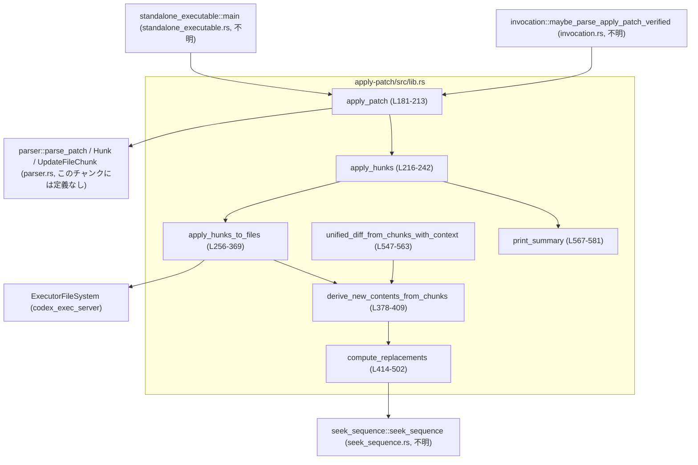
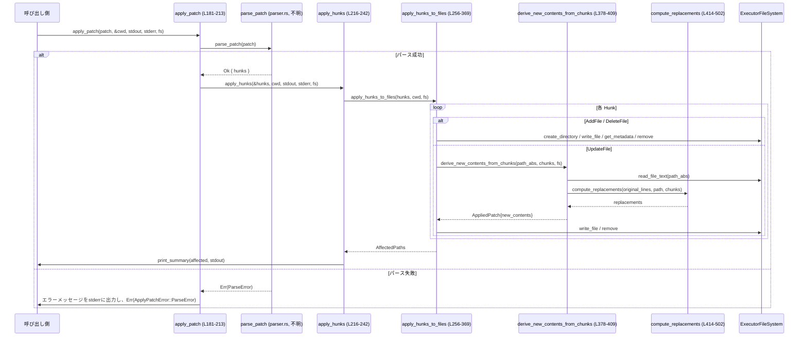

# apply-patch/src/lib.rs

## 0. ざっくり一言

`apply-patch/src/lib.rs` は、Codex の `apply_patch` ツール用パッチ文字列をパースし、抽象化されたファイルシステム (`ExecutorFileSystem`) に対して非同期に適用するコアロジックと、変更サマリや unified diff 生成機能を提供するモジュールです（apply-patch/src/lib.rs:L1-4, L13-16, L181-213, L539-563）。

---

## 1. このモジュールの役割

### 1.1 概要

- このモジュールは **テキストパッチの適用問題** を解決するために存在し、以下の機能を提供します。
  - 専用フォーマットのパッチ文字列をパースして `Hunk` 列挙体に変換する（パーサ本体は `parser` モジュール、ここから re-export）（apply-patch/src/lib.rs:L17-21）。
  - 各 `Hunk` を抽象ファイルシステム `ExecutorFileSystem` に適用し、ファイルの追加・削除・更新・移動を行う（L256-369）。
  - 既存ファイルとパッチ内容から unified diff と将来のファイル内容を生成する（L539-563）。
  - CLI／RPC 層との間で使うエラー型や結果型を定義する（L42-56, L92-97, L99-113, L115-143）。

### 1.2 アーキテクチャ内での位置づけ

このファイルは apply-patch クレートの中核で、周辺モジュールと次のように連携します。

- `parser` モジュール  
  - パッチ文字列 → `Hunk` / `UpdateFileChunk` へのパース（本チャンクには実装なし／不明）。
  - `Hunk`, `ParseError`, `parse_patch` を re-export（L17-21）。
- `invocation` モジュール  
  - `maybe_parse_apply_patch_verified` や `ExtractHeredocError` を提供し、シェル引数から「apply_patch 呼び出しかどうか」を判定（L25, L28）。本チャンクには実装なし。
- `seek_sequence` モジュール  
  - 行列の中から「旧行シーケンス」や「コンテキスト行」を探すマッチャ（L423-431, L465-484）。実装は本チャンクには存在しませんが、`compute_replacements` が使用します。
- `standalone_executable` モジュール  
  - `main` を re-export（L26）。CLI のエントリポイントですが、実装はこのチャンクには含まれていません。
- 外部クレート
  - `codex_exec_server::ExecutorFileSystem` によって実ファイルシステム／仮想ファイルシステムを抽象化（L13-15, L181-187, L256-260, L379-382, L539-543）。
  - `similar::TextDiff` により unified diff を生成（L22, L557-558）。
  - `anyhow` によりファイル操作エラーに説明的コンテキストを付加（L11-12, L260-263, L273-281, L283-285, L289-307, L318-328, L330-333, L351-353, L356-359）。

Mermaid での依存関係図（このチャンクの範囲をコメントで付記）:



### 1.3 設計上のポイント

コードから読み取れる特徴を列挙します。

- **責務分割**
  - パースと構文エラー処理は `parser` モジュールに委譲し、このファイルは「既にパースされた `Hunk` の適用」と「差分生成」に集中しています（L181-208, L256-369, L539-563）。
  - テキストレベルの置換位置計算（`compute_replacements`）と、実際のファイル更新（`apply_hunks_to_files`）を分離しています（L414-502 と L256-369）。
- **抽象ファイルシステムと非同期 I/O**
  - 実際のファイル操作は全て `ExecutorFileSystem` トレイト経由で行われ、`async fn` で非同期実行されます（L181-187, L256-260, L379-382, L539-543）。
  - これにより、ローカル FS だけでなく、リモートやサンドボックス FS 実装にも対応できる設計です（トレイト自体の詳細はこのチャンクには現れません）。
- **エラーハンドリング**
  - クライアント向けエラー型 `ApplyPatchError` を `thiserror` で定義し、パースエラー・I/O エラー・差分計算エラーなどを集約しています（L42-56）。
  - ファイル操作部分では `anyhow::Error` を利用してエラーに文脈情報（どのファイルで失敗したかなど）を付加し、その後 `apply_hunks` で `ApplyPatchError` に畳み込みます（L256-263, L223-241）。
- **テキストマッチングの工夫**
  - `compute_replacements` 内で、「終端の空行（改行のセンチネル）」や EOF 付近の差分に対応するために、`old_lines` の末尾が空文字列の場合に再検索するなどの実装上の工夫があります（L454-463, L471-485）。
  - `seek_sequence` によるマッチングを利用し、コンテキスト行を元にファイル中の位置を探索します（L423-431, L465-468）。
- **状態管理**
  - グローバルな可変状態は持たず、すべての処理は関数ローカルな変数と引数で完結しています。
  - これにより、スレッド安全性（データ競合の不在）が保たれています（このチャンクには `static mut` 等は存在しません）。

---

## 2. 主要な機能一覧

このモジュールが提供する主要な機能（外部公開 API ベース）:

- パッチ文字列の適用: `apply_patch` でパッチ文字列をパースしてファイルシステムに適用（L181-213）。
- 事前にパース済み `Hunk` の適用: `apply_hunks` で `Hunk` 配列を適用（L216-242）。
- テキスト差分計算と適用:
  - `derive_new_contents_from_chunks` で `UpdateFileChunk` から新しいファイル内容を計算（L378-409）。
  - `compute_replacements` と `apply_replacements` で行単位の置換を行う（L414-502, L506-530）。
- unified diff 生成: `unified_diff_from_chunks` / `unified_diff_from_chunks_with_context` で元の内容と新内容から unified diff を生成（L539-563）。
- 変更サマリ出力: `print_summary` で `git` 風の A/M/D 行を標準出力に書き出す（L567-581）。
- 結果表現とエラー表現:
  - `ApplyPatchAction`, `ApplyPatchArgs`, `ApplyPatchFileChange`, `MaybeApplyPatchVerified` などのドメイン型（L92-97, L99-113, L115-143）。
  - `ApplyPatchError`, `IoError` によるエラー表現（L42-56, L76-88）。

### 2.1 コンポーネントインベントリー（このファイル内）

主な型・関数・定数の一覧です（行番号はこのファイル内の定義範囲）。

| 名称 | 種別 | 公開性 | 行範囲 | 説明 |
|------|------|--------|--------|------|
| `APPLY_PATCH_TOOL_INSTRUCTIONS` | 定数 `&'static str` | `pub` | L31 | GPT-4.1 向け `apply_patch` ツールの説明文を取り込む（`include_str!`）（L30-31）。 |
| `CODEX_CORE_APPLY_PATCH_ARG1` | 定数 `&'static str` | `pub` | L33-40 | Codex 実行ファイルが self-invoke する際の特別な argv[1] フラグ（L33-40）。 |
| `ApplyPatchError` | enum | `pub` | L42-56 | パッチ適用に関する高レベルなエラー型。パースエラー、I/O エラー、置換計算エラー、暗黙呼び出しエラーを表現（L42-55）。 |
| `IoError` | struct | `pub` | L76-82 | I/O エラーに追加コンテキスト文字列を付与したエラー型（L76-82）。 |
| `ApplyPatchArgs` | struct | `pub` | L92-97 | `apply_patch` のパッチ文字列と、それをパースした `hunks`、作業ディレクトリをまとめた型（L90-97）。 |
| `ApplyPatchFileChange` | enum | `pub` | L99-113 | ファイル単位の変更内容（追加／削除／更新＋移動）を表す型（L99-113）。 |
| `MaybeApplyPatchVerified` | enum | `pub` | L115-128 | 引数列が `apply_patch` 呼び出しかどうかの判定結果（成功・シェルパースエラー・正当性エラー・非該当）（L115-127）。 |
| `ApplyPatchAction` | struct | `pub` | L133-143 | パッチ解析の結果としての「絶対パス → 変更内容」マップと元のパッチ文字列、`cwd` を保持（L130-143）。 |
| `ApplyPatchAction::is_empty` | メソッド | `pub` | L145-148 | 変更マップが空かどうかを判定（L145-148）。 |
| `ApplyPatchAction::changes` | メソッド | `pub` | L150-153 | 内部の `HashMap<PathBuf, ApplyPatchFileChange>` への参照を返す（L150-153）。 |
| `ApplyPatchAction::new_add_for_test` | 関数（関連） | `pub` | L155-177 | テスト専用ヘルパ。単一ファイル追加の `ApplyPatchAction` を構築（L155-177）。 |
| `apply_patch` | `async fn` | `pub` | L181-213 | パッチ文字列をパースし、`apply_hunks` を通じて適用するトップレベル API（L181-213）。 |
| `apply_hunks` | `async fn` | `pub` | L216-242 | 事前にパース済みの `Hunk` 配列をファイルシステムに適用し、サマリを出力（L216-242）。 |
| `AffectedPaths` | struct | `pub` | L248-252 | 追加・変更・削除されたパスの一覧を保持する構造体（L248-252）。 |
| `apply_hunks_to_files` | `async fn` | `pub(crate)`（シグネチャ上は `fn` だがモジュール内の helper） | L256-369 | 各 `Hunk` をループし、`ExecutorFileSystem` に対してファイル操作を行うコア処理（L256-369）。 |
| `AppliedPatch` | struct | 非公開 | L371-374 | ファイル更新前後の全文文字列を保持（L371-374）。 |
| `derive_new_contents_from_chunks` | `async fn` | 非公開 | L378-409 | 既存ファイルを読み込み、`UpdateFileChunk` 群から新しい内容を構築（L378-409）。 |
| `compute_replacements` | `fn` | 非公開 | L414-502 | 行単位の置換リスト `(start, old_len, new_lines)` を計算するテキストマッチングロジック（L414-502）。 |
| `apply_replacements` | `fn` | 非公開 | L506-530 | 置換リストを既存行ベクタに適用する（L506-530）。 |
| `ApplyPatchFileUpdate` | struct | `pub` | L533-537 | unified diff と新しいコンテンツ文字列をまとめた結果型（L532-537）。 |
| `unified_diff_from_chunks` | `async fn` | `pub` | L539-545 | デフォルトのコンテキスト幅 1 で unified diff を生成するラッパー（L539-545）。 |
| `unified_diff_from_chunks_with_context` | `async fn` | `pub` | L547-563 | コンテキスト幅指定付き unified diff 生成関数（L547-563）。 |
| `print_summary` | `fn` | `pub` | L567-581 | 変更サマリを `git` 風に出力する関数（L567-581）。 |
| `Hunk`, `ParseError`, `parse_patch` | 型／関数 | `pub use` | L17-21 | `parser` モジュールから re-export。定義はこのチャンクにはありません。 |
| `maybe_parse_apply_patch_verified` | 関数 | `pub use` | L25 | `invocation` モジュールから re-export。定義は不明。 |
| `main` | 関数 | `pub use` | L26 | `standalone_executable` モジュールから re-export。CLI エントリポイント。 |

---

## 3. 公開 API と詳細解説

### 3.1 型一覧（構造体・列挙体など）

主要な公開型の概要です。

| 名前 | 種別 | 役割 / 用途 | 根拠 |
|------|------|-------------|------|
| `ApplyPatchError` | enum | `apply_patch` / `apply_hunks` / unified diff 系 API が返す高レベルエラー。パースエラー・I/O エラー・置換計算エラー・暗黙呼び出しエラーを区別（`ParseError`, `IoError`, `ComputeReplacements(String)`, `ImplicitInvocation`）（L42-56）。 | apply-patch/src/lib.rs:L42-56 |
| `IoError` | struct | I/O エラーに文字列コンテキストを付けてラップする型。`ApplyPatchError::IoError` の中に格納される（L76-82）。 | L76-82 |
| `ApplyPatchArgs` | struct | パッチ文字列（生）と、そのパッチからパースされた `Hunk` 配列、オプションの作業ディレクトリ文字列を一括保持（L90-97）。 | L90-97 |
| `ApplyPatchFileChange` | enum | 単一ファイルに対する変更内容。追加／削除／更新（unified diff, 移動先パス、新コンテンツ）を表現（L99-113）。 | L99-113 |
| `MaybeApplyPatchVerified` | enum | 引数列が `apply_patch` 呼び出しかどうかの検査結果。成功時は `Body(ApplyPatchAction)` を含み、その他にシェル解析エラー・正当性エラー・非適用パッチの状態を表す（L115-127）。 | L115-127 |
| `ApplyPatchAction` | struct | `apply_patch` コマンドの解析結果を表す。絶対パス→変更内容のマップ、元のパッチ文字列、`cwd` を保持（L130-143）。 | L130-143 |
| `AffectedPaths` | struct | パッチ適用により追加・変更・削除されたパスを `Vec<PathBuf>` として3種類に分けて保持（L248-252）。 | L248-252 |
| `ApplyPatchFileUpdate` | struct | unified diff と更新後コンテンツのペアを保持する結果型。unified diff プレビューなどで使用（L532-537）。 | L532-537 |

`Hunk`, `UpdateFileChunk`, `ParseError` は `parser` モジュール定義ですが、使い方から以下が読み取れます（このチャンクには完全な定義はありません）。

- `Hunk` には少なくとも `AddFile`, `DeleteFile`, `UpdateFile { move_path, chunks, .. }` の各バリアントと `path()`, `resolve_path(cwd)` メソッドが存在します（L269-271, L272-287, L288-309, L310-361）。
- `UpdateFileChunk` は `change_context: Option<String>`, `old_lines: Vec<String>`, `new_lines: Vec<String>`, `is_end_of_file: bool` などのフィールドを持つことがコードから推測できます（L423-427, L442-452, L465-476, L479-484）。
- `ParseError` には `InvalidPatchError(String)` と `InvalidHunkError { message: String, line_number: usize }` のようなバリアントがあることが、`apply_patch` のマッチから分かります（L191-203）。

### 3.2 関数詳細（代表 7 件）

#### `apply_patch(patch: &str, cwd: &AbsolutePathBuf, stdout: &mut impl Write, stderr: &mut impl Write, fs: &dyn ExecutorFileSystem) -> Result<(), ApplyPatchError>`

**概要**

- パッチ文字列 `patch` を `parser::parse_patch` でパースし、`Hunk` 群を `apply_hunks` を通じてファイルシステムに適用する高レベル API です（L181-213）。
- 標準出力／標準エラーへ人間向けメッセージを出力する責務も持ちます。

**引数**

| 引数名 | 型 | 説明 |
|--------|----|------|
| `patch` | `&str` | `*** Begin Patch` / `*** End Patch` を含むパッチ文字列（テストの `wrap_patch` 参考）（L181, L595-597）。 |
| `cwd` | `&AbsolutePathBuf` | パッチ中の相対パスを解決する際の基準ディレクトリ（L182-183, L269-271）。 |
| `stdout` | `&mut impl Write` | 成功時のサマリ出力先。`print_summary` が使用（L184-185, L225-227, L567-581）。 |
| `stderr` | `&mut impl Write` | パッチ構文エラーなどのエラーメッセージ出力先（L185-186, L191-203）。 |
| `fs` | `&dyn ExecutorFileSystem` | 抽象ファイルシステム。ファイルの読み書き・削除・メタデータ取得に利用（L186-187, L273-285, L289-305, L330-333, L356-359, L383-388）。 |

**戻り値**

- `Ok(())` : パッチ適用が成功した場合。
- `Err(ApplyPatchError)` : パッチのパース失敗、ファイル操作の失敗、あるいは内部テキストマッチングエラーの場合（L188-207, L223-241）。

**内部処理の流れ**

1. `parse_patch(patch)` を呼び出し `Result` を受け取る（L188-190）。
2. `Ok(source)` の場合は `source.hunks` を取り出す（L188-190）。
3. `Err(e)` の場合:
   - `InvalidPatchError(message)` なら `"Invalid patch: {message}"` を `stderr` に書き出す（L191-194）。
   - `InvalidHunkError { message, line_number }` なら `"Invalid patch hunk on line {line_number}: {message}"` を `stderr` に書き出す（L195-203）。
   - その後 `ApplyPatchError::ParseError(e)` としてエラーを返す（L206-207）。
4. パース成功時は `apply_hunks(&hunks, cwd, stdout, stderr, fs).await?` を呼び、`ApplyPatchError` を透過（L210-211）。
5. 最終的に `Ok(())` を返す（L212-213）。

**Examples（使用例）**

テスト `test_add_file_hunk_creates_file_with_contents` を簡略化した例（L599-631）:

```rust
use apply_patch::apply_patch;
use codex_exec_server::LOCAL_FS;
use codex_utils_absolute_path::AbsolutePathBuf;
use std::io::Write;
use tempfile::tempdir;

#[tokio::main]
async fn main() -> Result<(), Box<dyn std::error::Error>> {
    // 一時ディレクトリを用意
    let dir = tempdir()?;
    let file_path = dir.path().join("example.txt");

    // パッチ文字列を作成（ヘルパ wrap_patch と同様の形式）
    let patch_body = format!(
        r#"*** Add File: {}
+hello
+world"#,
        file_path.display()
    );
    let patch = format!("*** Begin Patch\n{patch_body}\n*** End Patch");

    let mut stdout = Vec::new();
    let mut stderr = Vec::new();

    // パッチ適用（AbsolutePathBuf に変換）
    let cwd = AbsolutePathBuf::from_absolute_path(dir.path())?;
    apply_patch(&patch, &cwd, &mut stdout, &mut stderr, LOCAL_FS.as_ref()).await?;

    println!("stdout:\n{}", String::from_utf8(stdout)?); // 変更サマリ
    println!("stderr:\n{}", String::from_utf8(stderr)?); // エラーがあれば表示
    Ok(())
}
```

**Errors / Panics**

- `parse_patch` がエラーを返すと `ApplyPatchError::ParseError` が返ります（L188-207）。
- `apply_hunks` 内のファイル操作エラーなども最終的に `ApplyPatchError` として返されます（L223-241）。
- この関数自身は `panic!` を直接呼びません。

**Edge cases（エッジケース）**

- パッチ文字列が空、または `*** Begin Patch` / `*** End Patch` を含まない場合の挙動は `parse_patch` に依存し、このチャンクだけでは不明です。
- パッチから得られた `hunks` が空の場合、`apply_hunks_to_files` 内で `"No files were modified."` エラーになります（L261-263）。これは `apply_patch` 呼び出し側にはエラーとして伝播します。
- 作業ディレクトリ `cwd` が実際のファイル構造と矛盾した場合（相対パスが存在しない等）の挙動は `ExecutorFileSystem` 実装側に依存します。

**使用上の注意点**

- 非同期関数であるため、Tokio などの async ランタイム上で実行する必要があります（`#[tokio::test]` を用いたテスト参照 L599 以降）。
- `stdout` / `stderr` は `std::io::Write` を実装するオブジェクトであればよいですが、並列に複数回呼び出す場合、バッファを共有しない方が安全です。
- `fs` は任意の `ExecutorFileSystem` 実装を渡せますが、パスの解決や sandbox 対応などのセキュリティ保証は `fs` 側に委ねられています（本モジュール内でパス制限等は行っていません）。

---

#### `apply_hunks(hunks: &[Hunk], cwd: &AbsolutePathBuf, stdout: &mut impl Write, stderr: &mut impl Write, fs: &dyn ExecutorFileSystem) -> Result<(), ApplyPatchError>`

**概要**

- 既にパースされた `Hunk` 配列をファイルシステムへ適用し、その結果を `stdout` に要約出力する関数です（L216-242）。
- 実際のファイル操作は `apply_hunks_to_files` に委譲します。

**引数**

`apply_patch` の `stdout`/`stderr`/`cwd`/`fs` と同様で、`hunks` がすでに存在する点のみ異なります（L217-222）。

**戻り値**

- 成功時 `Ok(())`。
- 失敗時 `Err(ApplyPatchError)`。

**内部処理の流れ**

1. `apply_hunks_to_files(hunks, cwd, fs).await` を呼び出す（L224-224）。
2. 成功時:
   - `print_summary(&affected, stdout)` を呼んでサマリを出力し、`Ok(())` を返す（L225-227）。
3. エラー時:
   - `err.to_string()` でメッセージを生成し、`stderr` に書き出す（L229-231）。
   - `err.downcast_ref::<std::io::Error>()` が成功すれば、`ApplyPatchError::from(io)`（つまり `IoError { context: "I/O error", source: io }`）へマッピング（L232-234, L58-65）。
   - そうでなければ、新たに `IoError { context: msg, source: std::io::Error::other(err) }` を構築して `ApplyPatchError::IoError` を返す（L235-239）。

**Errors / Edge cases**

- `apply_hunks_to_files` が `"No files were modified."` で `anyhow::Error` を返した場合も、ここでは `ApplyPatchError::IoError` 相当として扱われます（L261-263, L229-239）。
- `stderr` への書き込みに失敗すると、`ApplyPatchError::IoError` に変換されます（`writeln!` への `map_err(ApplyPatchError::from)` 参照 L231）。

**使用上の注意点**

- すでに `Hunk` が得られている場合に直接呼び出すことで、パーサと適用処理を分離して使うことができます。
- `err.downcast_ref::<std::io::Error>()` で拾えないエラーは「I/O エラー」として再ラップされるため、元の `ApplyPatchError::ComputeReplacements` などの型情報は失われます（L232-239）。

---

#### `apply_hunks_to_files(hunks: &[Hunk], cwd: &AbsolutePathBuf, fs: &dyn ExecutorFileSystem) -> anyhow::Result<AffectedPaths>`

**概要**

- 各 `Hunk` を `ExecutorFileSystem` に適用し、追加・変更・削除されたファイルパスを `AffectedPaths` として返すコア処理です（L256-369）。
- 失敗時には `anyhow::Error` に詳細なコンテキストメッセージを付けて返します。

**引数**

| 引数名 | 型 | 説明 |
|--------|----|------|
| `hunks` | `&[Hunk]` | `parser` から得られたパッチ単位（ファイル単位）の列（L257-258）。 |
| `cwd` | `&AbsolutePathBuf` | `Hunk::path()` に対する相対パスを絶対パスに解決する基準（L258-259, L270-271）。 |
| `fs` | `&dyn ExecutorFileSystem` | 抽象ファイルシステム（L259-260）。 |

**戻り値**

- `Ok(AffectedPaths { added, modified, deleted })` : 1 つ以上のファイルに変更が適用された場合（L364-368）。
- `Err(anyhow::Error)` : ファイル操作やパッチ適用に失敗した場合（`anyhow::bail!` や `with_context` 経由）（L261-263, L273-285, L289-307, L318-333, L351-353, L356-359）。

**内部処理の流れ（アルゴリズム）**

1. `hunks` が空なら `anyhow::bail!("No files were modified.")`（L261-263）。
2. `added`, `modified`, `deleted` の 3 つの `Vec<PathBuf>` を初期化（L265-267）。
3. 各 `hunk` についてループ（L268-268）:
   1. `affected_path = hunk.path().to_path_buf()` でパッチ中のパス表記を保持（L269-269）。
   2. `path_abs = hunk.resolve_path(cwd)` で絶対パスに変換（L270-271）。
   3. `match hunk` でバリアントに応じた処理（L271-271）:
      - **`AddFile { contents, .. }`**（L272-287）
        - 親ディレクトリが存在すれば `fs.create_directory(parent_abs, recursive: true)` を実行し、失敗時は `"Failed to create parent directories for {path}"` コンテキスト付きでエラー（L273-281）。
        - `fs.write_file(path_abs, contents.clone().into_bytes())` を実行し、失敗時は `"Failed to write file {path}"` コンテキスト付きでエラー（L283-285）。
        - `affected_path` を `added` に push（L286-286）。
      - **`DeleteFile { .. }`**（L288-309）
        - 内部の `async` ブロックで:
          - `fs.get_metadata(&path_abs).await?` でメタデータ取得（L289-290）。
          - `is_directory` が真なら `io::ErrorKind::InvalidInput` で `"path is a directory"` エラーを返す（L291-295）。
          - そうでなければ `fs.remove(path_abs, RemoveOptions { recursive: false, force: false })` を実行（L297-303）。
        - 結果 `io::Result<()>` を `result.with_context(|| format!("Failed to delete file {}", path_abs.display()))?` でラップ（L306-307）。
        - `affected_path` を `deleted` に push（L308-308）。
      - **`UpdateFile { move_path, chunks, .. }`**（L310-361）
        - `derive_new_contents_from_chunks(&path_abs, chunks, fs).await?` で `AppliedPatch { new_contents, .. }` を取得（L313-314）。
        - `Some(dest)` の場合（ファイルの移動）:
          - `dest_abs = AbsolutePathBuf::resolve_path_against_base(dest, cwd)` で新しい絶対パスを算出（L315-317）。
          - 親ディレクトリを `create_directory(recursive: true)` で作成し、失敗時にコンテキスト付きエラー（L317-328）。
          - `fs.write_file(&dest_abs, new_contents.into_bytes())` を実行（L330-333）。
          - 古いパスについて `get_metadata` → ディレクトリならエラー → `remove(recursive: false, force: false)` の流れで削除し、失敗時 `"Failed to remove original {path}"` コンテキストを付ける（L333-353）。
          - `affected_path` を `modified` に push（L354）。
        - `None` の場合（同じパスに更新）:
          - `fs.write_file(&path_abs, new_contents.into_bytes())` を実行（L356-359）。
          - `affected_path` を `modified` に push（L359）。

**Errors / Edge cases**

- ディレクトリを `DeleteFile` しようとした場合は、`io::ErrorKind::InvalidInput` で `"path is a directory"` を返し、その後 `"Failed to delete file {path}"` のコンテキスト付き `anyhow::Error` となります（L289-297, L307）。
- `derive_new_contents_from_chunks` が `ApplyPatchError::ComputeReplacements` を返した場合、ここでは `?` によって `anyhow::Error` になります（L313-314）。
- 複数の `UpdateFile` が同一パスを対象にするケースについては、このチャンクにそうしたパッチの例はなく、挙動は不明です。

**使用上の注意点**

- 呼び出し元（`apply_hunks`）では `anyhow::Error` を型ごと downcast していないため、ここでのエラー型の選び方が、最終的にどの種類の `ApplyPatchError` になるかに影響します（L229-239）。
- `RemoveOptions { recursive: false, force: false }` を使用しているため、サブディレクトリの削除や強制削除は行われません（L297-302, L342-347）。

---

#### `derive_new_contents_from_chunks(path_abs: &AbsolutePathBuf, chunks: &[UpdateFileChunk], fs: &dyn ExecutorFileSystem) -> Result<AppliedPatch, ApplyPatchError>`

**概要**

- 指定パスの既存ファイルを読み込み、`UpdateFileChunk` 群に従ってテキスト置換を行い、新しいファイル内容を構築します（L378-409）。
- 旧内容（`original_contents`）と新内容（`new_contents`）を `AppliedPatch` にまとめて返します。

**引数**

| 引数名 | 型 | 説明 |
|--------|----|------|
| `path_abs` | `&AbsolutePathBuf` | 更新対象ファイルの絶対パス（L379-380, L383-386）。 |
| `chunks` | `&[UpdateFileChunk]` | `Hunk::UpdateFile` に含まれる変更チャンク列（L380-381, L313-314）。 |
| `fs` | `&dyn ExecutorFileSystem` | ファイル読み込みに使う抽象ファイルシステム（L381-382, L383-388）。 |

**戻り値**

- `Ok(AppliedPatch { original_contents, new_contents })`（L405-408）。
- `Err(ApplyPatchError)` : `IoError` または `ComputeReplacements` のいずれか。

**内部処理の流れ**

1. `fs.read_file_text(path_abs).await` で元のファイル内容を読み込み、失敗時は `IoError { context: "Failed to read file to update {path}", source: err }` に変換（L383-388）。
2. `original_contents.split('\n').map(String::from).collect()` で行ベクタ `original_lines` を作成（L390）。
3. 行末に由来する「余分な空要素」があれば、`original_lines.pop()` で削除（L392-396）。これは diff の行数と合わせるため（コメント参照）。
4. `compute_replacements(&original_lines, path_abs.as_path(), chunks)?` によって `(start_index, old_len, new_lines)` の置換リストを取得（L398）。
5. `apply_replacements(original_lines, &replacements)` で新しい行ベクタ `new_lines` を得る（L399）。
6. 末尾の行が空でなければ、空文字列を追加して「末尾に改行」の状態を維持（L400-403）。
7. `new_contents = new_lines.join("\n")` で新しいコンテンツ文字列を生成（L404）。
8. `AppliedPatch { original_contents, new_contents }` を返す（L405-408）。

**Errors / Edge cases**

- ファイルが存在しない場合や読み取り権限がない場合は、`fs.read_file_text` がエラーになり、それが `ApplyPatchError::IoError` に変換されます（L383-388）。
- `compute_replacements` が失敗すると、`ApplyPatchError::ComputeReplacements` として呼び出し元に伝播します（L398-398）。
- 元ファイル末尾に改行がない場合でも、新しいファイルには必ず末尾に改行が付与されます（末尾が空文字列になる）（L400-403）。

**使用上の注意点**

- テキストを行単位で扱うため、バイナリファイルや巨大なファイルに対しては性能上の考慮が必要です（全体を `String` として読み込んでいます L383-390）。
- 改行コードは LF 前提で処理されており、CRLF の扱いはこのチャンクからは不明です。

---

#### `compute_replacements(original_lines: &[String], path: &Path, chunks: &[UpdateFileChunk]) -> Result<Vec<(usize, usize, Vec<String>)>, ApplyPatchError>`

**概要**

- 既存ファイルの行列 `original_lines` と `UpdateFileChunk` 群から、置換操作のリスト `(開始インデックス, 置換する旧行数, 新行ベクタ)` を計算します（L411-413, L414-502）。
- コンテキスト行や EOF に近い変更などに対応するために、`seek_sequence` を用いた柔軟なマッチングを行います。

**引数**

| 引数名 | 型 | 説明 |
|--------|----|------|
| `original_lines` | `&[String]` | 元ファイルを改行で分割した行列（末尾の空行は既に取り除かれている）（L415-416, L390-396）。 |
| `path` | `&Path` | エラーメッセージ用に使用するパス（L416-417, L435-438, L492-495）。 |
| `chunks` | `&[UpdateFileChunk]` | 変更チャンク列（L417-418, L422-422）。 |

**戻り値**

- `Ok(Vec<(usize, usize, Vec<String>)>)` : 置換操作のリスト（開始位置昇順にソート済み）（L499-501）。
- `Err(ApplyPatchError::ComputeReplacements(String))` : コンテキスト行や旧行が見つからなかった場合など（L434-438, L491-495）。

**内部処理の流れ（要約）**

1. 空の `replacements` と `line_index = 0` を初期化（L419-420）。
2. 各 `chunk` についてループ（L422-422）:
   1. `change_context` が `Some(ctx_line)` の場合:
      - `seek_sequence(original_lines, &[ctx_line], line_index, eof=false)` で探索し、見つかったら `line_index = idx + 1` に更新（L423-433）。
      - 見つからなければ `"Failed to find context '{ctx_line}' in {path}"` という `ComputeReplacements` エラーを返す（L434-438）。
   2. `old_lines` が空の場合（純粋な追加）:
      - 末尾行が空であれば、その直前（`len - 1`）、そうでなければ末尾（`len`）を `insertion_idx` として決定（L445-449）。
      - `(insertion_idx, 0, chunk.new_lines.clone())` を `replacements` に追加し、次のチャンクへ（L450-451）。
   3. それ以外（旧行の置換／削除を含む場合）:
      - `pattern = &chunk.old_lines` を初期パターンとして、`seek_sequence(original_lines, pattern, line_index, chunk.is_end_of_file)` を呼び出す（L465-468）。
      - `new_slice = &chunk.new_lines` を新行スライスとして保持（L469-470）。
      - 見つからず、かつ `pattern` の末尾が空文字列なら:
        - パターンから末尾 1 行を取り除き、`new_slice` の末尾も空なら取り除いて再検索（L471-477, L479-484）。
      - 見つかった場合:
        - `start_idx` を取得し、`(start_idx, pattern.len(), new_slice.to_vec())` を `replacements` に追加し、`line_index = start_idx + pattern.len()` に更新（L487-490）。
      - それでも見つからない場合:
        - `"Failed to find expected lines in {path}:\n{chunk.old_lines.join("\n")}"` という `ComputeReplacements` エラーを返す（L491-495）。
3. 全てのチャンク処理後、`replacements` を開始インデックス昇順にソート（L499）。
4. ソート済み `replacements` を返却（L501）。

**Edge cases / Contracts**

- **コンテキスト行のマッチング失敗**  
  `change_context` が指定されているにもかかわらず、`seek_sequence` で見つからない場合は即座にエラーになります（L423-438）。これにより、コンテキストに依存する変更は誤った位置に適用されないことが保証されます。
- **EOF 付近の変更**  
  `old_lines` の末尾が空文字列（改行のセンチネル）で失敗した場合に、末尾を取り除いて再試行するロジックがあり、EOF 付近の変更に対応しています（L457-463, L471-485）。
- **pure add（挿入のみ）**  
  `old_lines.is_empty()` のチャンクは、「最終行が空ならその直前、そうでなければ末尾」に挿入されます（L442-452）。テスト `test_unified_diff_insert_at_eof` などの EOF 挿入に対応しています（L1120-1153）。
- **重複／重なりのある置換**  
  `start_idx` によって位置が決まるため、パターンが重なるようなチャンクが与えられた場合の挙動は、チャンクの順序と `line_index` の進み方に依存します。このケースはテストからは見えず、このチャンクだけでは詳細は不明です。

**使用上の注意点**

- `seek_sequence` のマッチング仕様（ユニコードの正規化や近似マッチなど）はこのチャンクには記述されていませんが、テスト `test_update_line_with_unicode_dash` から ASCII と Unicode のダッシュを跨ぐマッチングが行われていることが分かります（L944-983）。この挙動自体は `seek_sequence` に依存します。
- エラーメッセージはファイルパスと失敗したパターンを含むため、デバッグ時に有用です（L491-495）。

---

#### `unified_diff_from_chunks_with_context(path_abs: &AbsolutePathBuf, chunks: &[UpdateFileChunk], context: usize, fs: &dyn ExecutorFileSystem) -> Result<ApplyPatchFileUpdate, ApplyPatchError>`

**概要**

- 指定ファイルの現在の内容と、`UpdateFileChunk` 適用後の内容の差分を unified diff 形式で生成し、その diff と新しい内容を返します（L547-563）。
- 実際のファイル書き換えは行わないため、「適用前のプレビュー」として利用できます。

**引数**

| 引数名 | 型 | 説明 |
|--------|----|------|
| `path_abs` | `&AbsolutePathBuf` | 差分の基準となるファイル絶対パス（L548-549）。 |
| `chunks` | `&[UpdateFileChunk]` | 適用予定の変更チャンク列（L549-550）。 |
| `context` | `usize` | unified diff の行コンテキスト幅（`TextDiff::unified_diff().context_radius(context)` に渡される）（L550-550, L557-558）。 |
| `fs` | `&dyn ExecutorFileSystem` | ファイル読み込みに使うファイルシステム（L551-552）。 |

**戻り値**

- `Ok(ApplyPatchFileUpdate { unified_diff, content })` : unified diff 文字列と新しい内容文字列（L559-562）。
- `Err(ApplyPatchError)` : ファイル読み込みエラーまたは置換計算エラー（L553-556）。

**内部処理の流れ**

1. `derive_new_contents_from_chunks(path_abs, chunks, fs).await?` で元と新の内容を計算（L553-556）。
2. `TextDiff::from_lines(&original_contents, &new_contents)` で行単位の diff を構築（L557）。
3. `.unified_diff().context_radius(context).to_string()` で unified diff 形式のテキストを生成（L557-558）。
4. `ApplyPatchFileUpdate { unified_diff, content: new_contents }` を返す（L559-562）。

**Examples（使用例）**

テスト `test_unified_diff` を簡略化（L997-1037）:

```rust
use apply_patch::{parse_patch, unified_diff_from_chunks, ApplyPatchFileUpdate};
use codex_exec_server::LOCAL_FS;
use codex_utils_absolute_path::AbsolutePathBuf;
use std::fs;

#[tokio::main]
async fn main() -> Result<(), Box<dyn std::error::Error>> {
    let dir = tempfile::tempdir()?;
    let path = dir.path().join("file.txt");
    fs::write(&path, "line1\nline2\n")?; // もとのファイル

    // 変更パッチ
    let patch_body = format!(
        r#"*** Update File: {}
@@
-line1
+LINE1"#,
        path.display()
    );
    let patch = format!("*** Begin Patch\n{patch_body}\n*** End Patch");

    // パースして UpdateFile の chunks を取り出す
    let parsed = parse_patch(&patch)?;
    let chunks = match parsed.hunks.as_slice() {
        [apply_patch::Hunk::UpdateFile { chunks, .. }] => chunks,
        _ => panic!("Expected a single UpdateFile hunk"),
    };

    let abs = AbsolutePathBuf::from_absolute_path(&path)?;
    let update: ApplyPatchFileUpdate =
        unified_diff_from_chunks(&abs, chunks, LOCAL_FS.as_ref()).await?;

    println!("Unified diff:\n{}", update.unified_diff);
    println!("New content:\n{}", update.content);
    Ok(())
}
```

**Errors / Edge cases**

- `derive_new_contents_from_chunks` と同じエラー条件を持ちます。
- `context` によって diff の表示範囲が変わりますが、値の妥当性チェック（例えば 0 や極端に大きい値）についてはこのチャンクでは行っていません。

**使用上の注意点**

- 実際のファイル変更は行われないため、適用前のプレビューとして安全に利用できます。
- `unified_diff_from_chunks`（L539-545）は `context=1` を指定した単純なラッパーで、一般的な用途にはこちらで十分です。

---

#### `print_summary(affected: &AffectedPaths, out: &mut impl Write) -> std::io::Result<()>`

**概要**

- `AffectedPaths` に含まれる追加・変更・削除ファイルを `git` 風のフォーマットで出力します（L567-581）。
- メッセージは以下の形式です（テスト参照 L620-627 等）。
  - `"Success. Updated the following files:"`
  - `"A <path>"`, `"M <path>"`, `"D <path>"`

**引数**

| 引数名 | 型 | 説明 |
|--------|----|------|
| `affected` | `&AffectedPaths` | 追加・変更・削除されたパス一覧（L568-569, L248-252）。 |
| `out` | `&mut impl Write` | 出力先（通常は stdout バッファ）（L569-570）。 |

**戻り値**

- `Ok(())` : 出力成功。
- `Err(std::io::Error)` : 書き込みエラー。

**内部処理**

1. `"Success. Updated the following files:"` を出力（L571）。
2. `added` の各パスについて `"A {path}"` を出力（L572-574）。
3. `modified` の各パスについて `"M {path}"` を出力（L575-577）。
4. `deleted` の各パスについて `"D {path}"` を出力（L578-580）。

**Edge cases**

- `added`, `modified`, `deleted` のいずれも空の場合でもヘッダ行だけは出力されます（ループが 0 回で終わるため L571-580）。
- パスは `Hunk::path()` から得られた「パッチ中の表記」が使用されるため、絶対パス・相対パス・記号リンクなどの表現がそのまま出力されます（L269-269, L286-286, L308-308, L354-360）。

---

### 3.3 その他の関数

補助的な関数や単純なラッパー関数の一覧です。

| 関数名 | 役割（1 行） | 根拠 |
|--------|--------------|------|
| `ApplyPatchAction::new_add_for_test` | テスト専用に、単一ファイル追加の `ApplyPatchAction` を構築する（L155-177）。 | apply-patch/src/lib.rs:L155-177 |
| `apply_replacements` | 置換リストを元に `Vec<String>` の内容を更新する。後ろから適用することでインデックスずれを防ぐ（L506-530）。 | L506-530 |
| `unified_diff_from_chunks` | `unified_diff_from_chunks_with_context` を `context=1` で呼ぶラッパー（L539-545）。 | L539-545 |

---

## 4. データフロー

ここでは、代表的なシナリオとして `apply_patch` が呼ばれたときのデータフローを示します。

### 4.1 `apply_patch` 経由のパッチ適用フロー

1. 呼び出し側がパッチ文字列・作業ディレクトリ・`ExecutorFileSystem` を準備し、`apply_patch` を呼び出します（L181-187）。
2. `apply_patch` が `parse_patch` を呼び、パッチを `Hunk` 群にパースします（L188-190）。
3. パース成功時、`apply_hunks` が `apply_hunks_to_files` を使って各 `Hunk` を適用し、`AffectedPaths` を構築します（L210, L224-228, L256-369）。
4. `apply_hunks` は `print_summary` を使ってサマリを `stdout` に書き、制御を呼び出し元に返します（L225-227, L567-581）。

Mermaid のシーケンス図（このファイルに現れる範囲のみ）:



### 4.2 unified diff 生成フロー

パッチ適用前に unified diff を生成する場合のフロー:

1. 呼び出し側が `parse_patch` で `Hunk::UpdateFile` を取り出し、その `chunks` を取得（テスト参照 L1015-1020 等）。
2. `unified_diff_from_chunks` / `_with_context` を呼び出す。
3. 内部で `derive_new_contents_from_chunks` → `compute_replacements` → `apply_replacements` により新しい内容を計算。
4. `TextDiff::from_lines` → `.unified_diff().context_radius(context).to_string()` で unified diff を生成（L553-558）。

---

## 5. 使い方（How to Use）

### 5.1 基本的な使用方法

最も典型的なフローは、パッチ文字列をそのまま `apply_patch` に渡して適用する形です。

```rust
use apply_patch::apply_patch;
use codex_exec_server::LOCAL_FS;
use codex_utils_absolute_path::AbsolutePathBuf;
use std::io::Write;

#[tokio::main]
async fn main() -> Result<(), Box<dyn std::error::Error>> {
    // 作業ディレクトリ（patch 中の相対パスの基準）
    let cwd_path = std::env::current_dir()?;
    let cwd = AbsolutePathBuf::from_absolute_path(&cwd_path)?;

    // 例: 単一ファイル追加パッチ
    let target = cwd_path.join("hello.txt");
    let patch_body = format!(
        r#"*** Add File: {}
+hello
+world"#,
        target.display()
    );
    let patch = format!("*** Begin Patch\n{patch_body}\n*** End Patch");

    let mut stdout = Vec::new();
    let mut stderr = Vec::new();

    apply_patch(&patch, &cwd, &mut stdout, &mut stderr, LOCAL_FS.as_ref()).await?;

    println!("summary:\n{}", String::from_utf8(stdout)?);
    eprintln!("stderr:\n{}", String::from_utf8(stderr)?);

    Ok(())
}
```

- 上記はテスト `test_add_file_hunk_creates_file_with_contents`（L599-631）と同様のパターンです。

### 5.2 よくある使用パターン

1. **相対パスと絶対パスの混在**  
   テスト `test_apply_patch_hunks_accept_relative_and_absolute_paths`（L633-696）から分かるように、パッチ中に相対パス（`relative-add.txt`）と絶対パス（`/tmp/.../absolute-add.txt`）を混在させても、`cwd` を適切に指定していれば両方正しく適用されます（L648-666, L670-672）。

2. **ファイルの移動を伴う更新**  
   `Update File` + `Move to` の組み合わせでファイルを更新しつつ移動できます（テスト `test_update_file_hunk_can_move_file` L763-801）。
   - パッチ側: `*** Update File: src.txt` と `*** Move to: dst.txt`（L769-777）。
   - 実装側: `move_path` が `Some(dest)` の場合に、新パスへ書き込み後、旧パスを削除する（L315-355）。

3. **unified diff の生成のみ行う**  
   テスト群 `test_unified_diff*`（L997-1217）では、`unified_diff_from_chunks` を用いて diff と新コンテンツを生成し、その後に別途 `apply_patch` で適用しています（L1190-1227）。

### 5.3 よくある間違い

このモジュールのコードとテストから推測できる誤用の例:

```rust
// 間違い例: cwd をパッチ中の相対パスと無関係な場所にする
let cwd = AbsolutePathBuf::from_absolute_path("/some/other/dir")?;
// パッチ中は "relative-add.txt" を想定している
apply_patch(&patch, &cwd, &mut stdout, &mut stderr, LOCAL_FS.as_ref()).await?;
// → パッチで指定した相対パスが意図しない場所に作成される可能性がある

// 正しい例: パッチ前に想定するルートディレクトリを cwd として渡す
let dir = tempfile::tempdir()?;
let cwd = AbsolutePathBuf::from_absolute_path(dir.path())?;
apply_patch(&patch, &cwd, &mut stdout, &mut stderr, LOCAL_FS.as_ref()).await?;
```

```rust
// 間違い例: async コンテキストの外で await を使おうとする
// let result = apply_patch(&patch, &cwd, &mut stdout, &mut stderr, LOCAL_FS.as_ref()).await;

// 正しい例: tokio::main もしくは tokio::test など async ランタイム内で await する
#[tokio::main]
async fn main() -> Result<(), Box<dyn std::error::Error>> {
    apply_patch(&patch, &cwd, &mut stdout, &mut stderr, LOCAL_FS.as_ref()).await?;
    Ok(())
}
```

### 5.4 使用上の注意点（まとめ）

- **前提条件**
  - `cwd` は `AbsolutePathBuf` として正しい絶対パスである必要があります（L182-183, L270-271）。
  - 更新対象ファイルはテキスト（UTF-8 想定）であり、`read_file_text` が成功することが前提です（L383-388）。
- **エラー取り扱い**
  - パッチ構文の問題は `ApplyPatchError::ParseError` として区別されます（L188-207）。
  - ファイル操作や内部エラーの多くは `ApplyPatchError::IoError` として扱われます（L47-47, L223-241）。
  - `ComputeReplacements` エラーは unified diff API では `ApplyPatchError::ComputeReplacements` として識別可能な一方で、`apply_patch` 経由では最終的に I/O エラー風にラップされることがあります（L398, L223-239）。
- **並行性**
  - このモジュールはグローバル状態を持たず、引数に基づいて動作するため、異なるファイルや異なる `ExecutorFileSystem` に対する複数の `apply_patch` を並行実行しても、データ競合は発生しません。
  - ただし同じパスに対する同時パッチ適用は、ファイルシステム実装や OS 側の排他制御に依存します。
- **セキュリティ**
  - パスの正規化やルート制限はこのモジュールでは行っていません。絶対パスを含むパッチを適用した場合、そのパスに到達可能な権限があれば、そのまま更新されます（L269-271, L315-317）。
  - そのため、信頼できないソースからのパッチを直接適用する場合は、サンドボックス化された `ExecutorFileSystem` 実装を用いる必要があります。

---

## 6. 変更の仕方（How to Modify）

### 6.1 新しい機能を追加する場合

代表的な拡張シナリオと対応するコード位置です。

1. **新しい `Hunk` バリアントを追加したい場合**
   - 想定するバリアントは `parser` モジュール側で定義されます（このチャンクには定義なし）。
   - このファイルでの変更入口は `apply_hunks_to_files` の `match hunk` 部分です（L271-362）。
     1. `parser` 側に新しいバリアントを追加。
     2. `apply_hunks_to_files` の `match` に対応する腕を追加し、`ExecutorFileSystem` に対する適切な操作を実装。
     3. `AffectedPaths` にどう反映するか（add/modify/delete のいずれか、もしくは新種別を追加するか）を検討。
2. **summary 出力フォーマットを変更したい場合**
   - `print_summary` が一箇所の出力ロジックを担っています（L567-581）。
   - フォーマット変更はここを修正し、`tests` モジュール内の期待文字列（`expected_out`）も合わせて更新します（例: L623-627, L688-695 など）。
3. **unified diff の生成方法を変更したい場合**
   - `unified_diff_from_chunks_with_context` 内で `similar::TextDiff` を使用しています（L557-558）。
   - 別の diff ライブラリを使う場合は、この関数の内部実装を差し替えるのが最小の変更範囲です。

### 6.2 既存の機能を変更する場合

変更時に確認すべきポイントです。

- **テキストマッチングロジック（`compute_replacements`）を変更する**
  - 影響範囲:
    - `derive_new_contents_from_chunks` 経由のすべての Update File 処理（L398-399, L313-314）。
    - unified diff 生成ロジック（L553-556）。
  - 注意点:
    - EOF 挿入・先頭／末尾行の置換など、多様なテストが用意されているため（L997-1217）、変更後はこれらのテストをすべて再確認する必要があります。
    - `ComputeReplacements` エラーメッセージのフォーマットが既存クライアントに依存している可能性があるため、メッセージを大きく変える場合は注意が必要です（L491-495）。
- **エラーのラップ方法を変更する**
  - `apply_hunks` で `anyhow::Error` → `ApplyPatchError` への変換ロジックがあります（L229-239）。
  - ここを変更すると、外部 API から見えるエラーの種類が変わるため、既存の呼び出し元コード（特にエラー種別に依存している部分）が影響を受けます。
- **ファイルシステム操作の挙動を変更する**
  - `RemoveOptions { recursive: false, force: false }` などのパラメータを変更すると、ディレクトリ削除や強制削除の挙動が変わります（L297-302, L342-347）。
  - これに依存するテストや上位ロジックがないか確認が必要です。

---

## 7. 関連ファイル

このモジュールと密接に関係する他ファイル・ディレクトリ（このチャンクにコード本体は含まれないものもあります）。

| パス | 役割 / 関係 |
|------|------------|
| `apply-patch/src/parser.rs` | パッチ文字列を `Hunk` / `UpdateFileChunk` にパースするロジックと `ParseError` の定義を提供するモジュールと考えられます。`Hunk`, `ParseError`, `parse_patch`, `UpdateFileChunk` が本ファイルから参照されています（L17-21, L188-207, L269-271, L310-314, L415-418）。定義はこのチャンクには現れません。 |
| `apply-patch/src/invocation.rs` | `maybe_parse_apply_patch_verified` や `ExtractHeredocError` を提供し、シェル引数と heredoc から `ApplyPatchAction` を導出するレイヤと推測されます（L25, L28, L115-123）。実装は不明です。 |
| `apply-patch/src/seek_sequence.rs` | 行シーケンスの検索ロジックを提供するユーティリティ。`compute_replacements` 内でコンテキスト行や旧行群の位置を探すのに使用されます（L423-431, L465-468, L479-484）。 |
| `apply-patch/src/standalone_executable.rs` | CLI 用の `main` 関数を定義していると考えられます。`pub use standalone_executable::main;` によりエントリポイントとして公開されています（L26）。 |
| `apply-patch/apply_patch_tool_instructions.md` | `APPLY_PATCH_TOOL_INSTRUCTIONS` 定数に `include_str!` されるテキスト。GPT-4.1 に対する `apply_patch` ツールの使用説明が含まれるとコメントにあります（L30-31）。 |
| `codex_exec_server` クレート | `ExecutorFileSystem`, `CreateDirectoryOptions`, `RemoveOptions`, `LOCAL_FS` を提供し、ファイル操作を抽象化します（L13-15, L181-187, L256-260, L273-281, L297-303, L318-321, L342-347, L383-388, L539-543, L587, L611-617）。 |
| `codex_utils_absolute_path` クレート | `AbsolutePathBuf` およびテスト用拡張 `PathExt::abs` を提供し、絶対パスの扱いを簡便にします（L16, L271, L315-317, L379-380, L540-541, L588, L636-642, L1010-1022）。 |

---

### テストと品質保証の補足

- このファイルには多くの `#[tokio::test]` テストが含まれており、以下の観点がカバーされています（L599-1264）。
  - 追加・削除・更新・移動といった基本操作（L599-801）。
  - 複数チャンクによる同一ファイルの複数箇所の更新（L803-847）。
  - EOF 付近の更新や挿入（L849-907, L1120-1153）。
  - Unicode ダッシュと ASCII ダッシュのマッチング（L944-995）。
  - unified diff 出力の詳細な検証（L997-1217）。
  - 書き込みエラー時に `apply_patch` が失敗すること（L1239-1263）。

これらのテストは、テキストマッチングロジックとファイルシステム操作の多くのエッジケースをカバーしており、変更時の回帰検知に利用できます。
