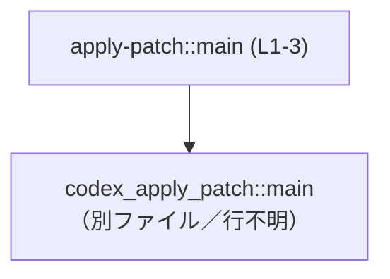
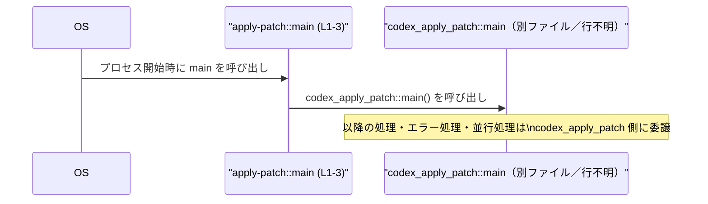
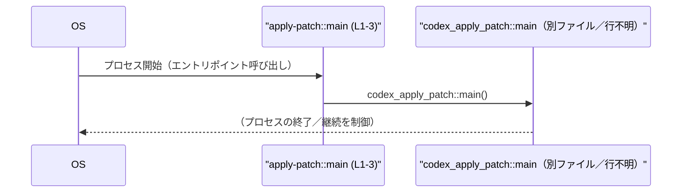

# apply-patch/src/main.rs コード解説

## 0. ざっくり一言

- `codex_apply_patch::main` を呼び出すだけの、バイナリクレートのエントリポイント関数を定義するファイルです。（根拠: apply-patch/src/main.rs:L1-3）

---

## 1. このモジュールの役割

### 1.1 概要

- このファイルは、実行可能バイナリ `apply-patch`（仮称）のプロセス開始時に呼ばれる `main` 関数を定義します。（根拠: apply-patch/src/main.rs:L1）
- 実際の処理はすべて `codex_apply_patch::main()` に委譲し、自身ではロジックやエラーハンドリングを行いません。（根拠: apply-patch/src/main.rs:L2）
- `main` の戻り値型が `!`（決して戻らないことを表す「never 型」）であるため、プロセスは `codex_apply_patch::main` が終了するか、プロセス終了 API が呼ばれるまで継続します。（根拠: apply-patch/src/main.rs:L1-2）

### 1.2 アーキテクチャ内での位置づけ

このファイルは、バイナリクレートのルート（`src/main.rs`）として、外部（または別クレート）`codex_apply_patch` のエントリポイント関数に制御を引き渡す役割を持ちます。

- 依存関係:
  - `apply-patch::main` → `codex_apply_patch::main`（根拠: apply-patch/src/main.rs:L1-2）
  - `codex_apply_patch` 側の実装はこのチャンクには現れません。



### 1.3 設計上のポイント

- **責務の分離**  
  - このファイルはエントリポイント定義に限定し、ビジネスロジックを一切含めず、別クレート `codex_apply_patch` に委譲する構造になっています。（根拠: apply-patch/src/main.rs:L1-2）
- **状態管理**  
  - このファイル内に状態を保持する変数や構造体は存在しません。（根拠: apply-patch/src/main.rs:L1-3）
- **エラーハンドリング方針**  
  - `main` 関数では `Result` などを返さず、エラー処理は完全に `codex_apply_patch::main` 側に任されています。（根拠: apply-patch/src/main.rs:L1-2）
- **並行性**  
  - このファイル内でスレッド生成や非同期処理は行われていません。並行性があれば、それは `codex_apply_patch::main` 側の責務です。（根拠: apply-patch/src/main.rs:L1-3）

---

## 2. 主要な機能一覧（コンポーネントインベントリー）

このファイルに含まれる公開 API は 1 つです。

- `main`: プロセス開始時に呼び出され、`codex_apply_patch::main` に処理を委譲するエントリポイント関数。（根拠: apply-patch/src/main.rs:L1-2）

関数インベントリー（位置付き）:

| 名前 | 種別 | 位置 | 役割 / 用途 |
|------|------|------|------------|
| `main` | 関数 | L1-3 | バイナリクレート `apply-patch` のエントリポイントとして、`codex_apply_patch::main` を呼び出す。（根拠: apply-patch/src/main.rs:L1-3） |

---

## 3. 公開 API と詳細解説

### 3.1 型一覧（構造体・列挙体など）

このファイル内で定義されている型はありません。（根拠: apply-patch/src/main.rs:L1-3）

| 名前 | 種別 | 役割 / 用途 |
|------|------|-------------|
| なし | - | このファイルには型定義が存在しません。（根拠: apply-patch/src/main.rs:L1-3） |

### 3.2 関数詳細

#### `pub fn main() -> !`

**概要**

- 実行可能バイナリのエントリポイントです。（根拠: apply-patch/src/main.rs:L1）
- 本体では `codex_apply_patch::main()` を呼び出すのみで、以降の処理はすべてそちらに委譲されます。（根拠: apply-patch/src/main.rs:L2）
- 戻り値型が `!`（never 型）のため、この関数は決して呼び出し元（ランタイム）に「通常の戻り値」としては戻りません。（根拠: apply-patch/src/main.rs:L1）

**シグネチャ**

```rust
pub fn main() -> ! {
    codex_apply_patch::main()
}
```

（根拠: apply-patch/src/main.rs:L1-3）

**引数**

- 引数はありません。（根拠: apply-patch/src/main.rs:L1）

**戻り値**

- 戻り値の型: `!`（never 型）  
  - 「決して完了しない」ことを表す型です。関数が永久ループするか、プロセス終了を引き起こしたあと戻らない場合に用いられます。
  - このため、`codex_apply_patch::main` も同じく `!` を返す関数である必要があります。（根拠: Rust の型システムおよび apply-patch/src/main.rs:L1-2）

**内部処理の流れ（アルゴリズム）**

- ステップは 1 つのみです。

1. `codex_apply_patch::main()` を呼び出す。（根拠: apply-patch/src/main.rs:L2）
2. `codex_apply_patch::main` が戻らない設計であるため、そのままプロセスが継続または終了します。`apply-patch::main` に制御が戻ることは想定されていません。（根拠: 戻り値型 `!` と apply-patch/src/main.rs:L1-2）

**処理フロー図**

`main` 関数が行う単純な委譲の流れです。



**Examples（使用例）**

この関数は OS／ランタイムから直接呼び出されるエントリポイントであり、ユーザーコードから呼び出す前提ではありません。Rust コードから直接利用する「使用例」は通常存在しません。

参考として、同種の構造を持つ最小バイナリのイメージ例を示します。

```rust
// src/main.rs
pub fn main() -> ! {                         // エントリポイント（never 型を返す）
    my_lib::main()                           // 別クレート my_lib の main に委譲
}

// 別クレート my_lib 側（イメージ／このチャンクには存在しません）
pub fn main() -> ! {
    // 実際の処理
    std::process::exit(0);                   // プロセス終了などを行う
}
```

このファイルにおいても同様に、「バイナリ側 main からライブラリ側 main へ委譲」という構造になっています。（根拠: apply-patch/src/main.rs:L1-2）

**Errors / Panics**

- この `main` 関数自体には `Result` のような戻り値はなく、エラーを表現しません。（根拠: apply-patch/src/main.rs:L1）
- `codex_apply_patch::main` 呼び出し中に発生しうるパニックやエラー、および終了コードの扱いは、このチャンクのコードからは分かりません。（根拠: apply-patch/src/main.rs:L2）

**Edge cases（エッジケース）**

- **引数なし**  
  - 引数を取らないため、空入力や異常な引数に関するエッジケースは存在しません。（根拠: apply-patch/src/main.rs:L1）
- **戻らない関数としての挙動**  
  - 戻り値型が `!` のため、正常終了・異常終了いずれにしても、「関数として値を返す」という意味で戻ることは想定されていません。（根拠: apply-patch/src/main.rs:L1）
- **`codex_apply_patch::main` が戻る場合**  
  - 型シグネチャ上 `codex_apply_patch::main` も `!` を返すはずであり、通常の意味で戻るコードパスは存在しない前提です。このため、「`codex_apply_patch::main` が戻ってしまう」ようなエッジケースは型レベルで排除されています。（根拠: apply-patch/src/main.rs:L1-2 と Rust の `!` 型の型付けルール）

**使用上の注意点**

- この関数はバイナリクレートのエントリポイント専用です。別のモジュールから再利用することは通常想定されていませんが、`pub` として公開されています。（根拠: apply-patch/src/main.rs:L1）
- 並行処理（スレッド生成や async ランタイムの起動など）を行いたい場合は、`codex_apply_patch::main` 側に実装する必要があります。このファイルには並行処理に関するコードはありません。（根拠: apply-patch/src/main.rs:L1-3）
- エラーハンドリング・ログ出力・終了コードの制御などを変更したい場合も、このファイルではなく `codex_apply_patch` クレート側の `main` 実装を確認・変更する必要があると考えられます。このチャンクから具体的な実装は読み取れません。（根拠: apply-patch/src/main.rs:L2）

### 3.3 その他の関数

- このファイルには `main` 以外の関数は存在しません。（根拠: apply-patch/src/main.rs:L1-3）

---

## 4. データフロー

### 4.1 代表的な処理シナリオ

このファイルでは「データ」の受け渡しは行われず、制御フロー（どの関数がどの関数を呼ぶか）のみが存在します。

- OS／ランタイムが `apply-patch::main` を呼び出す。（根拠: Rust バイナリの標準的な挙動と apply-patch/src/main.rs:L1）
- `apply-patch::main` はそのまま `codex_apply_patch::main()` を呼び出し、制御を移譲する。（根拠: apply-patch/src/main.rs:L2）
- 以降の処理（引数パース、I/O、並行処理、エラーハンドリングなど）は `codex_apply_patch::main` 側に委ねられます。（根拠: apply-patch/src/main.rs:L2）

### 4.2 シーケンス図



この図は、このファイルが「OS とライブラリクレートの間の非常に薄い橋渡し」であることを示しています。

---

## 5. 使い方（How to Use）

### 5.1 基本的な使用方法

このファイルの `main` 関数は、ユーザーコードから直接呼び出す対象ではなく、コンパイルされたバイナリが OS から起動される際のエントリポイントとしてのみ使用されます。（根拠: apply-patch/src/main.rs:L1）

典型的な利用フロー（概念的なもの）:

1. プロジェクトをビルドしてバイナリ `apply-patch` を生成する（`cargo build --bin apply-patch` など）。
2. OS 上で `apply-patch` を実行する。
3. OS が `apply-patch::main` を呼び出し、このファイル内の `main` が `codex_apply_patch::main` に委譲する。（根拠: apply-patch/src/main.rs:L1-2）

### 5.2 よくある使用パターン

このファイルは固定的なエントリポイントであり、呼び出しパターンのバリエーションはありません。

Rust プロジェクト全体で見た場合、以下のような「ライブラリの main に委譲する」構成の一例と同じパターンです。

```rust
// バイナリクレート側（現在のファイルと同種の構成）
pub fn main() -> ! {
    codex_apply_patch::main()       // 実際の CLI ロジックはライブラリに記述
}
```

（根拠: apply-patch/src/main.rs:L1-2）

### 5.3 よくある間違い（このファイルに関連しうる点）

このファイル単体に関して想定される誤用は多くありませんが、構成上起こりそうな注意点を挙げます。

```rust
// （誤用の例）戻り値型を変更してしまう
pub fn main() {                      // -> ! を外してしまう
    codex_apply_patch::main();
    // コンパイルエラーになる可能性が高い：
    // codex_apply_patch::main() が ! を返すため、ここに戻って来ない前提
}
```

- `codex_apply_patch::main` が `!` を返す設計である以上、このファイルの `main` も `!` を返すシグネチャのままである必要があります。（根拠: apply-patch/src/main.rs:L1-2）

### 5.4 使用上の注意点（まとめ）

- **前提条件**  
  - `codex_apply_patch` クレートが依存として解決可能であり、`codex_apply_patch::main` 関数が定義されていること。（根拠: apply-patch/src/main.rs:L2）
- **エラー・パニック**  
  - このファイル内にエラー処理はなく、すべて `codex_apply_patch::main` 側に委譲されるため、エラー時の挙動を確認するにはそちらの実装を見る必要があります。（根拠: apply-patch/src/main.rs:L2）
- **並行性**  
  - 並行・並列処理（スレッドや async）はこのファイルには存在せず、並行性に関わるバグやレースコンディションは、もしあれば `codex_apply_patch` 側に起因します。（根拠: apply-patch/src/main.rs:L1-3）
- **セキュリティ**  
  - このファイル自体は入出力もせず、外部データを扱いません。セキュリティ上の懸念は主として `codex_apply_patch` の実装次第です。（根拠: apply-patch/src/main.rs:L1-3）

---

## 6. 変更の仕方（How to Modify）

### 6.1 新しい機能を追加する場合

「機能追加」は通常このファイルではなく `codex_apply_patch` 側で行うのが自然です。このファイルで考えられる変更は主に「委譲先の変更」です。

- **別のエントリポイント関数に委譲したい場合**
  1. `codex_apply_patch` クレート側に新しい関数（例: `run_with_config`）を定義する。
  2. `apply-patch/src/main.rs` の `codex_apply_patch::main()` 呼び出しを、新しい関数呼び出しに置き換える。（根拠: apply-patch/src/main.rs:L2）

```rust
pub fn main() -> ! {
    codex_apply_patch::run_with_config()   // 例：別の関数に委譲（このチャンクには存在しません）
}
```

※ 上記は構造の説明用の例であり、実際に `run_with_config` が存在するかどうかは、このチャンクからは分かりません。

### 6.2 既存の機能を変更する場合

このファイルの変更は影響範囲が大きくなりやすいため、次の点に注意する必要があります。

- **エントリポイントのシグネチャを変える場合**
  - `pub fn main() -> !` の戻り値型や名前を変更すると、Rust のエントリポイントとして認識されなくなったり、型整合性が崩れたりします。（根拠: apply-patch/src/main.rs:L1）
- **呼び出し先を変更する場合**
  - `codex_apply_patch::main()` の呼び出し先を変更すると、アプリケーションの起動時の挙動が根本的に変わります。（根拠: apply-patch/src/main.rs:L2）
  - 変更後の呼び出し先関数も `!` を返すか、意図に応じた戻り値型との整合性を確認する必要があります。（根拠: apply-patch/src/main.rs:L1-2）
- **テスト・使用箇所の確認**
  - このファイルの `main` は OS から直接呼び出されるため、ユニットテストから直接参照するケースは少ないと考えられます。挙動確認は主に実行バイナリ（統合テストや手動実行）を通じて行うことになります。この点はコードからは直接は分かりませんが、エントリポイントの性質から一般的にそうなります。

---

## 7. 関連ファイル

このファイルと密接に関係するコンポーネントは次の通りです。

| パス / 識別子 | 役割 / 関係 |
|--------------|------------|
| `codex_apply_patch::main` | このファイルの `main` から直接呼び出される、実際の処理エントリポイント。実装は別ファイルにあり、このチャンクには現れません。（根拠: apply-patch/src/main.rs:L2） |
| `apply-patch/src/main.rs` | 本ファイル。バイナリクレート `apply-patch` のエントリポイントを提供します。（根拠: apply-patch/src/main.rs:L1-3） |

このチャンクには `codex_apply_patch` クレートのソースコードやテストコードは含まれていないため、それらの詳細な挙動や依存関係は「不明」です。
