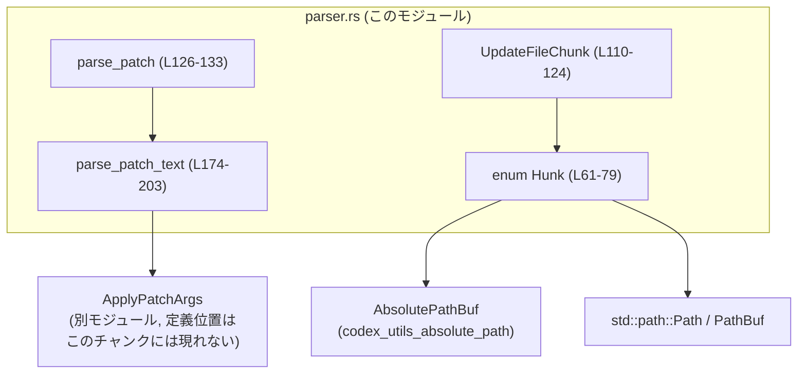
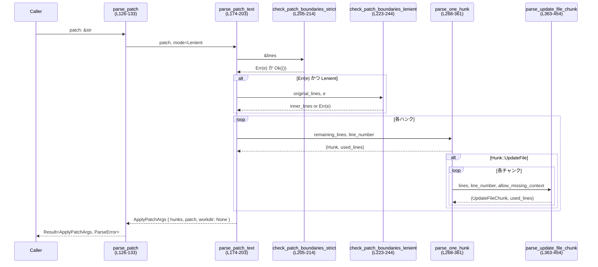

# apply-patch/src/parser.rs

## 0. ざっくり一言

- `apply_patch` CLI が受け取るパッチテキストを解析し、`AddFile` / `DeleteFile` / `UpdateFile` の「ハンク (Hunk)」一覧に変換するモジュールです（ファイルシステムへの適用は行いません）。  
  根拠: `//!` コメントと `Hunk` 定義、`parse_patch` / `parse_patch_text` 実装  
  `apply-patch\src\parser.rs:L1-24, L61-79, L126-133, L174-203`

---

## 1. このモジュールの役割

### 1.1 概要

- このモジュールは **パッチテキスト → 構造化データ** への変換を担当します。  
  - パッチフォーマットは先頭/末尾に `*** Begin Patch` / `*** End Patch` を持ち、中に 1 個以上のハンクを含みます。`L1-21`  
  - ハンクは `AddFile` / `DeleteFile` / `UpdateFile` の 3 種別で、`UpdateFile` はさらに複数の `UpdateFileChunk` を持ちます。`L61-79, L110-124`
- 公開関数 `parse_patch` で入力文字列を解析し、`ApplyPatchArgs { hunks, patch, workdir }` を返します。`L126-133, L198-202`
- OpenAI の `local_shell` / heredoc 事情に合わせ、デフォルトでは「やや寛容 (Lenient)」なパースモードを採用しています。`L44-50, L135-172`

### 1.2 アーキテクチャ内での位置づけ

このモジュールが依存する主なコンポーネントは次の通りです。

- `crate::ApplyPatchArgs`: パース結果を保持する構造体（少なくとも `hunks`, `patch`, `workdir` フィールドを持つ）。`L198-202`
- `codex_utils_absolute_path::AbsolutePathBuf`: 相対パスを基準ディレクトリに解決するための型。`L26, L81-88`
- `std::path::{Path, PathBuf}`: ファイルパスを表現。`L29-30`
- `thiserror::Error`: エラー型 `ParseError` の導出に使用。`L32, L52-58`
- テスト時のみ `tempfile`, `PathBufExt` に依存。`L27-28, L606-623, L651-658`

依存関係を簡略化した図:



### 1.3 設計上のポイント

- **責務の分割**  
  - 全体の流れ: `parse_patch` → `parse_patch_text` → `check_*` 群 → `parse_one_hunk` → `parse_update_file_chunk`。`L126-133, L174-203, L205-214, L223-244, L268-361, L363-454`
  - ファイル単位の操作は `Hunk` / `UpdateFileChunk` に集約。
  - パッチ境界判定 (`check_*`) とハンク/チャンク解析 (`parse_*`) を分離。
- **エラーハンドリング**  
  - すべての公開処理は `Result<_, ParseError>` で失敗を明示。`L52-58, L126-133, L174-203`
  - 解析失敗は `InvalidPatchError`（全体の形式不正）と `InvalidHunkError`（特定ハンクの不正）に分類。`L52-58`
  - エラーは thiserror で人間に読みやすいメッセージにフォーマット。`L52-57`
- **安全性**  
  - ライブラリ部分には `unwrap` や `panic!` はなく、`unsafe` も未使用です。`L126-454`  
    （`unwrap` が出現するのはテストのみ。`L608, L626-628, L653-658` など）
  - インデックスアクセス前に長さ条件を満たすよう制御し、空スライスへの `lines[0]` アクセスを防いでいます。`L186-193, L268-271, L368-373`
- **状態と並行性**  
  - 共有状態やグローバル可変変数を持たない純粋な関数群で、**スレッドセーフ** です（`&self` かローカル変数のみ使用）。`L81-88, L126-133, L174-203`
  - 非同期処理 (`async` / `await`) やスレッド API は一切使用していません。このモジュール単体は完全に同期的です。
- **パースモード**  
  - `ParseMode` に `Strict` / `Lenient` を定義し、Lenient では heredoc ラッパー `<<EOF ... EOF`（クォート付きも含む）を外してから、厳密な境界チェックに回します。`L135-172, L174-184, L223-244`
  - 実際の公開 API `parse_patch` は `PARSE_IN_STRICT_MODE = false` により常に Lenient モードを使用します（コンパイル時定数）。`L44-50, L126-132`

---

## 2. 主要な機能一覧

- パッチ全体の解析: `parse_patch` / `parse_patch_text` でパッチ文字列を `ApplyPatchArgs` に変換します。`L126-133, L174-203`
- パッチ境界の検証: `check_patch_boundaries_strict` / `check_patch_boundaries_lenient` / `check_start_and_end_lines_strict` で `*** Begin/End Patch` と heredoc を扱います。`L205-214, L223-244, L246-263`
- ハンクの解析: `parse_one_hunk` で `AddFile` / `DeleteFile` / `UpdateFile` を認識し、`Hunk` 列挙体にマッピングします。`L268-361`
- Update チャンクの解析: `parse_update_file_chunk` で `@@` コンテキストや `+ / - / (スペース)` 行、`*** End of File` を解釈し `UpdateFileChunk` に変換します。`L363-454`
- パス解決: `Hunk::resolve_path` で相対/絶対パスをカレントワークディレクトリ基準の絶対パスに解決します。`L81-88`
- ターゲットパス取得: `Hunk::path` で、リネームの場合には移動先パスを優先して返します。`L90-105`

---

## 3. 公開 API と詳細解説

### 3.1 型一覧（構造体・列挙体など）

| 名前 | 種別 | 公開 | 役割 / 用途 | 定義位置 |
|------|------|------|-------------|----------|
| `ParseError` | enum | `pub` | パッチ全体・ハンク単位のパースエラーを表現 (`InvalidPatchError`, `InvalidHunkError`) | `apply-patch\src\parser.rs:L52-58` |
| `Hunk` | enum | `pub` | 1 ファイル分の変更を表すハンク。`AddFile` / `DeleteFile` / `UpdateFile` の 3 バリアント | `L61-79` |
| `UpdateFileChunk` | struct | `pub` | `UpdateFile` 内の 1 まとまりの変更（コンテキスト + old/new 行 + EOF フラグ） | `L110-124` |
| `ParseMode` | enum | 非公開 | パースモード（Strict / Lenient）。`parse_patch_text` の挙動を切り替える | `L135-172` |
| `ApplyPatchArgs` | struct | `pub`（別モジュール） | パッチ適用用の引数。少なくとも `hunks: Vec<Hunk>`, `patch: String`, `workdir: Option<_>` フィールドを持つ | 定義位置はこのチャンクには現れないが、構造体リテラルからフィールド名がわかる `L198-202` |

### 3.2 関数詳細（主要 7 件）

#### `parse_patch(patch: &str) -> Result<ApplyPatchArgs, ParseError>`

**概要**

- 公開エントリポイントです。与えられたパッチ文字列を（現在は常に）Lenient モードで解析し、`ApplyPatchArgs` を返します。`L126-133`

**引数**

| 引数名 | 型 | 説明 |
|--------|----|------|
| `patch` | `&str` | `*** Begin Patch` から `*** End Patch` までを含むパッチ文字列。heredoc ラッパーを含んでいてもよい（Lenient モードで除去される）。 |

**戻り値**

- `Ok(ApplyPatchArgs)` パースに成功した場合。`hunks` に `Hunk` の一覧、`patch` に正規化されたパッチ文字列（heredoc を外し、境界をトリムしたもの）、`workdir: None` が入ります。`L186-203`
- `Err(ParseError)` パッチ形式不正またはハンク内構造不正の場合。

**内部処理の流れ**

1. コンパイル時定数 `PARSE_IN_STRICT_MODE` を確認し、`ParseMode` を決定（現在は常に `Lenient`）。`L44-50, L126-132`
2. `parse_patch_text(patch, mode)` を呼び出して詳細な解析を委譲。`L132-133`

**Examples（使用例）**

```rust
use apply_patch::parser::{parse_patch, Hunk};

fn main() -> Result<(), Box<dyn std::error::Error>> {
    let patch = "\
*** Begin Patch
*** Add File: hello.txt
+Hello
*** End Patch";

    let args = parse_patch(patch)?; // Result<ApplyPatchArgs, ParseError>

    for hunk in &args.hunks {
        match hunk {
            Hunk::AddFile { path, contents } => {
                println!("Add: {:?} with contents:\n{}", path, contents);
            }
            _ => {}
        }
    }

    Ok(())
}
```

**Errors / Panics**

- `Err(InvalidPatchError(_))`  
  - 先頭行が `*** Begin Patch` でない場合。`L253-259, L459-463`
  - 末尾行が `*** End Patch` でない場合。`L260-262, L465-468`
- `Err(InvalidHunkError { .. })`  
  - ハンクヘッダ行が `*** Add/Delete/Update File:` のいずれでもない。`L355-360, L795-803`
  - `UpdateFile` ハンクにチャンクが 1 つも含まれていない。`L338-343, L490-499`
  - `Update` チャンク内の行形式が不正。`L368-373, L381-388, L392-397, L407-413, L435-443, L809-890`
- ライブラリコードでのパニックは想定されていません（`unwrap` はテスト内のみ）。`L126-454`

**Edge cases（エッジケース）**

- 空文字列 / 空白だけの文字列: `patch.trim()` により空スライスとなり、`InvalidPatchError("first line ...")` または `"... last line ..."` になります。`L174-181, L205-214, L246-263`
- ハンクが 0 個（`Begin` と `End` だけ）のパッチは **有効** として扱われ、`hunks` は空の `Vec` になります。`L186-202, L502-510`
- heredoc ラッパー `<<EOF ... EOF` が付いている場合でも Lenient モードで受理されます。`L216-244, L708-791`

**使用上の注意点**

- `parse_patch` は常に Lenient モードで動作するため、heredoc ラッパーも受理されます。より厳密な検証が必要であれば、別途呼び出し側で追加バリデーションを行う必要があります。
- `ApplyPatchArgs::workdir` は常に `None` をセットして返します。このフィールドをどう解釈するかは、他のモジュールに依存します。`L198-202`  
  （このチャンクには `ApplyPatchArgs` の定義が現れません。）

---

#### `Hunk::resolve_path(&self, cwd: &AbsolutePathBuf) -> AbsolutePathBuf`

**概要**

- ハンクが対象とするパスを、指定されたカレントディレクトリ `cwd` を基準に絶対パスへ解決します。`L81-88`

**引数**

| 引数名 | 型 | 説明 |
|--------|----|------|
| `self` | `&Hunk` | 解決対象のハンク。 |
| `cwd` | `&AbsolutePathBuf` | 基準となる絶対パス（カレントディレクトリ相当）。 |

**戻り値**

- `AbsolutePathBuf`  
  - `AddFile` / `DeleteFile` / `UpdateFile` の `path` が相対パスの場合は `cwd` からの相対解決。`L81-88, L660-705`
  - すでに絶対パスの場合は、そのまま返されます（`AbsolutePathBuf::resolve_path_against_base` の挙動に依存）。`L81-88, L606-648`

**内部処理の流れ**

1. `match self` でバリアントごとに対象パスを取得。`UpdateFile` の場合は元パス `path`、それ以外は `self.path()` を使用。`L83-86`
2. `AbsolutePathBuf::resolve_path_against_base(path, cwd)` を呼び出して絶対パス化。`L87`

**Examples（使用例）**

```rust
use apply_patch::parser::{Hunk};
use codex_utils_absolute_path::AbsolutePathBuf;

fn resolve_all(hunks: &[Hunk], cwd: &AbsolutePathBuf) -> Vec<AbsolutePathBuf> {
    hunks.iter().map(|h| h.resolve_path(cwd)).collect()
}
```

**Errors / Panics**

- このメソッド自身は `Result` を返さず、`panic!` も行いません。  
  パス解決中のエラーがある場合は `AbsolutePathBuf::resolve_path_against_base` 側の仕様に依存します（このチャンクにはその実装は現れません）。

**Edge cases**

- 相対パス・絶対パス両方を受け付けることがテストで確認されています。`L651-705`
- `UpdateFile` で `move_path: Some(..)` の場合は、`path()` が移動先を返す一方、このメソッドは常に元パス `path` を `cwd` に対して解決します。`L83-86, L90-105`  
  （解決対象をどちらとみなすかは使用側の設計に依存します。）

**使用上の注意点**

- `Hunk::path()` は「実際に影響を受けるパス」（リネーム時は移動先）を返すのに対し、`resolve_path` は元パスに対して解決する点に注意が必要です。`L81-88, L90-105`
- 相対パスの基準は、`cwd` に渡す `AbsolutePathBuf` によって変わるため、呼び出し元で一貫した `cwd` を用意する必要があります。

---

#### `Hunk::path(&self) -> &Path`

**概要**

- このハンクが対象とするファイルパスを返します。`UpdateFile` の場合、`move_path` が存在すればそちら（移動先）を優先します。`L90-105`

**引数**

| 引数名 | 型 | 説明 |
|--------|----|------|
| `self` | `&Hunk` | 対象ハンク。 |

**戻り値**

- `&Path` — ハンクが適用されるファイルパス。リネーム時は移動先パス。`L93-104`

**内部処理の流れ**

1. `match self` でバリアントごとにパスを選択。`L92-104`
   - `AddFile` → `path`。
   - `DeleteFile` → `path`。
   - `UpdateFile { move_path: Some(path), .. }` → 移動先 `path`。
   - `UpdateFile { path, move_path: None, .. }` → 元パス `path`。

**Examples（使用例）**

```rust
use apply_patch::parser::Hunk;

fn print_targets(hunks: &[Hunk]) {
    for h in hunks {
        println!("Target path: {:?}", h.path());
    }
}
```

**Errors / Panics**

- 単純な参照返却のみで、エラーやパニックはありません。`L90-105`

**Edge cases**

- `UpdateFile` で `move_path` が `Some` のときに移動先が返ることがテストで暗黙に前提とされており、`resolve_path` との挙動差に注意が必要です。`L81-88, L90-105`

**使用上の注意点**

- 実際のパッチ適用で「どのパスに対して操作するか」を判断したい場合は、`Hunk::path()` を使うのが自然です（移動先を返すため）。  
  しかし、元パスも必要であれば `UpdateFile` のフィールドから直接参照するか、別途保持する必要があります。

---

#### `parse_patch_text(patch: &str, mode: ParseMode) -> Result<ApplyPatchArgs, ParseError>`

**概要**

- 実際のパッチテキスト解析処理の本体です。Strict/Lenient モードを受け取り、行ごとの解析とハンク生成を行います。`L174-203`

**引数**

| 引数名 | 型 | 説明 |
|--------|----|------|
| `patch` | `&str` | パッチ文字列。heredoc ラッパー含む場合もあり。 |
| `mode` | `ParseMode` | `Strict` または `Lenient`。`Lenient` のとき heredoc を除去してから Strict 境界チェックを再実行。`L135-172, L174-184` |

**戻り値**

- `Ok(ApplyPatchArgs)` — パッチの境界と各ハンク・チャンクが正しく解析された場合。`L186-203`
- `Err(ParseError)` — 境界不正またはハンク/チャンク不正。

**内部処理の流れ**

1. `patch.trim().lines().collect()` で前後の空白を除去し、行単位スライスを生成。`L174-176`
2. `check_patch_boundaries_strict(&lines)` を呼ぶ。`L176-177`
   - OK の場合 → そのまま `lines` を使用。
   - Err の場合:
     - `mode == Strict` → そのまま `Err` を返す。`L178-181`
     - `mode == Lenient` → `check_patch_boundaries_lenient(&lines, e)` で heredoc ラッパーの除去を試みる。`L182-183`
3. `lines[1..last_line_index]`（先頭/末尾行を除いた部分）を `remaining_lines` とし、`line_number = 2` からループ。`L186-191`
4. `while !remaining_lines.is_empty()` の間、`parse_one_hunk(remaining_lines, line_number)` を呼び、返ってきた行数分スライスを進める。`L191-196`
5. 最終的な `lines.join("\n")` を `patch` フィールドとして `ApplyPatchArgs` を構築。`L197-202`

**Examples（使用例）**

通常は直接呼ばず `parse_patch` を経由しますが、Strict モードのみを許したい場合の例です（テストコードを簡略化）。`L456-604`

```rust
use apply_patch::parser::{ParseError};
use apply_patch::parser::ParseMode; // ParseMode はこのファイル内の非公開 enum（実コードではエクスポートされていない）

fn parse_strict_for_test(patch: &str) -> Result<(), ParseError> {
    // 実運用コードでは parse_patch を使うのが前提です。
    super::parse_patch_text(patch, super::ParseMode::Strict).map(|_| ())
}
```

> 注: 実際には `ParseMode` は非公開なので、このような呼び出しは同モジュール内またはテストからのみ可能です。

**Errors / Panics**

- パッチ境界不正 → `InvalidPatchError` (`check_start_and_end_lines_strict` 由来)。`L205-214, L246-263`
- heredoc 付きであっても、内側のパッチ境界が不正なら同様に `InvalidPatchError`。`L223-244, L708-791`
- ハンク解析不正 → `InvalidHunkError` (`parse_one_hunk` 由来)。`L191-193, L268-361`
- ライブラリコードとしてのパニックはありません。

**Edge cases**

- ハンク 0 個のパッチは有効（`hunks` が空の `Vec`）。`L186-203, L502-510`
- heredoc ラッパーが中途半端（`<<EOF` だけある / 終端 `EOF` がない）な場合、Lenient モードでもエラーになります。`L223-244, L780-791`

**使用上の注意点**

- パブリックには `parse_patch` だけが公開されている想定であり、`parse_patch_text` は内部用です（このファイル内に `pub` が付いていません）。`L174`
- テストでは Strict モードも直接利用して境界チェックやエラーメッセージを検証しています。`L456-604, L708-791`

---

#### `check_patch_boundaries_lenient<'a>(original_lines: &'a [&'a str], original_parse_error: ParseError) -> Result<&'a [&'a str], ParseError>`

**概要**

- Lenient モード時に、heredoc ラッパー (`<<EOF` / `<<'EOF'` / `<<"EOF"`) 付きのパッチを扱うため、外側の枠を外してから Strict 境界チェックを再実行します。`L216-244`

**引数**

| 引数名 | 型 | 説明 |
|--------|----|------|
| `original_lines` | `&[&str]` | `patch.trim().lines().collect()` 結果。`L174-176, L223-224` |
| `original_parse_error` | `ParseError` | Strict 境界チェック失敗時のエラー。heredoc でない場合はそのまま再利用されます。`L223-226, L238-240` |

**戻り値**

- `Ok(inner_lines)` — heredoc ラッパーを除いた内側の行スライス。`*** Begin/End Patch` を含みます。`L233-236`
- `Err(original_parse_error)` — heredoc と判定できなかった場合、あるいは内側の境界チェックも失敗した場合。`L238-243`

**内部処理の流れ**

1. パターン `[first, .., last]` のみを扱い、それ以外（0〜1 行）は即エラー。`L227-228, L242-243`
2. `first` が `"<<EOF"` / `"<<'EOF'"` / `"<<"EOF""` のいずれか、かつ `last.ends_with("EOF")` かつ行数 ≥ 4 であれば heredoc とみなす。`L229-232`
3. `inner_lines = &original_lines[1..len-1]` を切り出し、`check_patch_boundaries_strict(inner_lines)` を実行。`L233-235`
   - OK → `Ok(inner_lines)`。
   - Err(e) → `Err(e)` として返す。`L235-237`
4. 条件を満たさない場合は `Err(original_parse_error)` をそのまま返す。`L238-243`

**Examples（使用例）**

テストからの挙動例（簡略化）。`L708-791`

```rust
let patch_text = "\
*** Begin Patch
*** Update File: file2.py
 import foo
+bar
*** End Patch";

let with_heredoc = format!("<<EOF\n{patch_text}\nEOF\n");

// Strict ではそのままエラー
assert!(matches!(
    parse_patch_text(&with_heredoc, ParseMode::Strict),
    Err(ParseError::InvalidPatchError(_))
));

// Lenient では heredoc を外した上で成功
let parsed = parse_patch_text(&with_heredoc, ParseMode::Lenient).unwrap();
assert_eq!(parsed.patch, patch_text);
```

**Errors / Panics**

- 行数が 4 未満、または first/last が heredoc パターンを満たさない → `Err(original_parse_error)`。`L227-232, L238-243`
- 内側の境界が不正 → `Err(InvalidPatchError("first..." or "last..."))`。`L233-237, L246-263`
- パニックはありません。

**Edge cases**

- クォートの種類は `<<EOF` / `<<'EOF'` / `<<"EOF"` の 3 種類のみ受理。`<<\"EOF'` のようなミスマッチは拒否されます（テストあり）。`L229-232, L770-778`
- `last.ends_with("EOF")` で判定しているため、理論的には `"...EOF"` も受理されますが、実際にはそのようなパターンを前提とするテストは存在しません。この挙動は lenient さに基づく設計と解釈できます。`L229-232`

**使用上の注意点**

- この関数はあくまで Lenient モードでのみ利用され、Strict モードでは呼び出されません。`L176-184`
- セキュリティ上、heredoc の内側パッチは依然として Strict 境界チェックを必ず通るため、「heredoc で包めば不正なパッチが通る」ということはありません。`L233-237, L246-263`

---

#### `parse_one_hunk(lines: &[&str], line_number: usize) -> Result<(Hunk, usize), ParseError>`

**概要**

- ハンクの先頭行から `AddFile` / `DeleteFile` / `UpdateFile` のいずれか 1 つを解析し、対応する `Hunk` と消費した行数を返します。`L266-361`

**引数**

| 引数名 | 型 | 説明 |
|--------|----|------|
| `lines` | `&[&str]` | 現在位置以降のパッチ行。先頭要素がハンクヘッダ行である前提。`L268-271` |
| `line_number` | `usize` | `lines[0]` が元パッチ内で何行目か（1-origin）。エラーメッセージに利用。`L268-269, L339-342, L355-360` |

**戻り値**

- `Ok((hunk, parsed_lines))` — パース成功時。`parsed_lines` はこのハンクに属する行数。`L284-290, L293-298, L345-352`
- `Err(InvalidHunkError { .. })` — ハンクヘッダや中身が不正な場合。`L338-343, L355-360`

**内部処理の流れ**

1. `first_line = lines[0].trim()`。前後空白を除去。`L270`
2. `first_line.strip_prefix(ADD_FILE_MARKER)` が取れれば AddFile ハンク:
   - 直後の `+` で始まる行を連続して `contents` に追加、各行末に `\n` を付与。`L271-280`
3. `DELETE_FILE_MARKER` なら DeleteFile ハンク（追加の行は持たない）。`L291-298`
4. `UPDATE_FILE_MARKER` なら UpdateFile ハンク:
   - 次行を見て `MOVE_TO_MARKER` があれば `move_path` として 1 行消費。`L305-312`
   - 以降 `remaining_lines` を走査し、空行をスキップしつつ `parse_update_file_chunk` を繰り返し呼んで `chunks` を構築。`L314-336`
   - `remaining_lines[0].starts_with("***")` に遭遇したら次のハンクヘッダと見なして終了。`L324-326`
   - `chunks` が空ならエラー。`L338-343`
5. どのプレフィックスにもマッチしない場合、`InvalidHunkError` を返す。`L355-360`

**Examples（使用例）**

テストの一部（不正ヘッダ確認）。`L794-803`

```rust
assert_eq!(
    parse_one_hunk(&["bad"], 234),
    Err(ParseError::InvalidHunkError {
        message: "'bad' is not a valid hunk header. \
        Valid hunk headers: '*** Add File: {path}', '*** Delete File: {path}', '*** Update File: {path}'".to_string(),
        line_number: 234,
    })
);
```

**Errors / Panics**

- ヘッダ行が不正 → `InvalidHunkError`。`L355-360, L794-803`
- `UpdateFile` ハンクにチャンクが 1 つもない → `InvalidHunkError`。`L338-343, L490-499`
- ライブラリコードでは `lines` が空で呼ばれることはありません（呼び出し元の `while !remaining_lines.is_empty()` で防止）。`L191-193, L268-271`  
  これに依存して、関数内部では `lines[0]` を直接参照しており、事前条件違反があるとパニックになり得ます。

**Edge cases**

- `*** Update File` の直後がすぐ次のヘッダ（`***` で始まる）で、チャンクが存在しない場合にエラーになることがテストで確認されています。`L490-499`
- `UpdateFile` の直後に空行が複数続いても、空行はスキップしてチャンク解析に入ります。`L317-322`

**使用上の注意点**

- 公開 API ではなく、`parse_patch_text` からのみ呼ばれる内部関数です。外部から直接使う場合は「非空スライスであること」「`line_number` が実際の行番号と整合していること」を呼び出し側で保証する必要があります。
- コメントには「case mismatches にも寛容」とありますが、実装は大文字・小文字を区別して `strip_prefix` を行っているため、マーカー部分の大小文字は一致している必要があります。`L269-272`（コメントと実装の差異に注意）

---

#### `parse_update_file_chunk(lines: &[&str], line_number: usize, allow_missing_context: bool) -> Result<(UpdateFileChunk, usize), ParseError>`

**概要**

- `UpdateFile` ハンク内の 1 つのチャンクを解析します。オプションの `@@` コンテキスト行、`+` / `-` / ` ` で始まる diff 行、`*** End of File` を解釈して `UpdateFileChunk` を構築します。`L363-454`

**引数**

| 引数名 | 型 | 説明 |
|--------|----|------|
| `lines` | `&[&str]` | チャンク先頭行からの行スライス。`@@` 行を含む場合もあれば diff 行から始まる場合もある。`L363-367` |
| `line_number` | `usize` | `lines[0]` が元パッチ内で何行目か。エラーメッセージ用。`L365-366, L371-372, L387-388, L395-396, L411-412, L441-442` |
| `allow_missing_context` | `bool` | 先頭に `@@` がなくても許すかどうか（最初のチャンクのみ `true`）。`L366-367, L328-332` |

**戻り値**

- `Ok((chunk, parsed_lines))` — パース成功時。`parsed_lines` はコンテキスト行 + diff 行 + EOF 行を含めた消費行数。`L453-453`
- `Err(InvalidHunkError { .. })` — 行形式が不正、または diff 行が存在しないなどの場合。`L368-373, L381-388, L392-397, L407-413, L435-443`

**内部処理の流れ**

1. `lines.is_empty()` なら即エラー。`"Update hunk does not contain any lines"`。`L368-373`
2. 先頭行からコンテキスト判定。`L374-391`
   - `lines[0] == "@@"` → `change_context = None`, `start_index = 1`。`L376-377`
   - `lines[0].strip_prefix("@@ ")` 成功 → `change_context = Some(context)`, `start_index = 1`。`L378-380`
   - それ以外:
     - `allow_missing_context == false` → エラー `"Expected update hunk to start with a @@ context marker, got: '...'"`。`L381-388`
     - `allow_missing_context == true` → `change_context = None`, `start_index = 0`。`L390-391`
3. `start_index >= lines.len()` なら diff 行が 1 行もないためエラー。`L392-397`
4. `parsed_lines = 0` から `for line in &lines[start_index..]` をループ。`L404-451`
   - 行が `EOF_MARKER`（`"*** End of File"`）なら:
     - まだ diff 行を 1 行も読んでいない場合はエラー（EOF だけのチャンクは禁止）。`L407-413`
     - そうでなければ `is_end_of_file = true`, `parsed_lines += 1` して終了。`L414-417`
   - それ以外の行は先頭文字で分岐。`L418-435`
     - 空文字列（`.chars().next()` が `None`） → 空行として old/new に `""` を push。`L420-424`
     - `' '` → コンテキスト行: `old_lines` と `new_lines` の両方に先頭 1 文字を除いた文字列を追加。`L425-428`
     - `'+'` → 追加行: `new_lines` のみに内容追加。`L429-431`
     - `'-'` → 削除行: `old_lines` のみに内容追加。`L432-434`
     - その他:
       - まだ 1 行も diff 行を読んでいないならエラー（先頭行形式不正）。`L435-443`
       - 1 行以上読んでいるなら「次のチャンクの開始」と見なしてループ終了。`L444-446`
   - 各 diff 行処理後に `parsed_lines += 1`。`L448`
5. `Ok((chunk, parsed_lines + start_index))` を返す。`L453`

**Examples（使用例）**

テストコードからの正常系例。`L851-899`

```rust
let (chunk, used) = parse_update_file_chunk(
    &["@@", "+line", "*** End of File"],
    123,
    /*allow_missing_context*/ false,
).unwrap();

assert_eq!(used, 3);
assert_eq!(chunk.change_context, None);
assert_eq!(chunk.old_lines, Vec::<String>::new());
assert_eq!(chunk.new_lines, vec!["line".to_string()]);
assert!(chunk.is_end_of_file);
```

**Errors / Panics**

- 先頭行が `@@` / `@@ ...` / diff 行以外で、かつ `allow_missing_context == false` → `InvalidHunkError("Expected update hunk to start with a @@ context marker, got: '...'")`。`L381-388, L809-819`
- `@@` の直後が EOF または存在しない → `"Update hunk does not contain any lines"`。`L392-397, L822-830, L841-849`
- diff 行の先頭文字が `' '` / `+` / `-` 以外で、最初の diff 行として登場 → `"Unexpected line found in update hunk: '...'. Every line should start with ..."`。`L435-443, L833-838`
- EOF 行しかないチャンク → `"Update hunk does not contain any lines"`。`L407-413, L841-849`
- パニックとなるコードはなく、空スライスも明示的にチェック済みです。`L368-373`

**Edge cases**

- 先頭に `@@` がなくても、ハンク内の **最初のチャンク** であれば `allow_missing_context == true` により受理されます。`L328-332, L580-603, L708-724`  
  → gpt が `@@` を付け忘れたようなパッチも許容。
- 空行は `old_lines` / `new_lines` 両方に `""` として追加されます。`L420-424, L852-883`
- `*** End Patch` は EOF_MARKER (`"*** End of File"`) とは異なるため、ここでは特別扱いせず「次チャンク開始のきっかけ」として扱われます（実際の判定は呼び出し側の `parse_one_hunk` で `starts_with("***")` を見ています）。`L315-326, L854-861`

**使用上の注意点**

- 呼び出し側で `allow_missing_context` を適切に設定することが重要です。`UpdateFile` 内の 2 個目以降のチャンクでは `false` にしないと、「明示的な `@@` を要求する」という仕様が崩れます。`L328-332`
- `line_number` はエラーメッセージの行番号としてのみ利用されるため、`parse_one_hunk` から呼ぶときに「パッチ内実際の行数 + ヘッダ行数」で渡すことで、ユーザにとって意味のある数値になります。`L328-332, L456-604`

---

### 3.3 その他の関数

| 関数名 | 役割（1 行） | 定義位置 |
|--------|--------------|----------|
| `check_patch_boundaries_strict(lines: &[&str]) -> Result<(), ParseError>` | パッチ全体の先頭/末尾行が `*** Begin Patch` / `*** End Patch` かを検証する。`L205-214` |
| `check_start_and_end_lines_strict(first_line: Option<&&str>, last_line: Option<&&str>) -> Result<(), ParseError>` | 先頭/末尾行の組み合わせから `InvalidPatchError` を生成する内部ユーティリティ。`L246-263` |
| テスト関数群（`test_parse_patch` 他） | パッチ境界・ハンク/チャンク解析・パス解決・Lenient モードの挙動を網羅的に検証する。`L456-901` |

---

## 4. データフロー

典型的な処理シナリオ: 呼び出し元が `parse_patch` を呼び出し、パッチ文字列が `Hunk` / `UpdateFileChunk` のリストに分解される流れです。



要点:

- パッチ境界の検証は Strict →（必要なら）Lenient の 2 段構え。`L176-184, L223-244`
- ハンクごとに `parse_one_hunk` で分岐し、`UpdateFile` ハンクの内部で `parse_update_file_chunk` をループ処理しています。`L191-196, L314-336, L328-332`
- エラーは最初に検出された箇所で即座に `Result::Err` として上位へ伝播します（`?` 演算子は使用していませんが、`return Err(...)` / `?` の組み合わせ）。`L176-183, L192-193, L328-332, L368-373`

---

## 5. 使い方（How to Use）

### 5.1 基本的な使用方法

最も典型的なフローは、「パッチ文字列 → `parse_patch` → `Hunk` ごとの処理」です。

```rust
use apply_patch::parser::{parse_patch, Hunk, UpdateFileChunk};
use codex_utils_absolute_path::AbsolutePathBuf;

fn main() -> Result<(), Box<dyn std::error::Error>> {
    // パッチ文字列を組み立てる
    let patch = "\
*** Begin Patch
*** Add File: src/new.rs
+fn hello() {
+    println!(\"hello\");
+}
*** Update File: src/lib.rs
@@ fn main() {
-    println!(\"old\");
+    println!(\"new\");
*** End Patch";

    // パッチを解析する
    let args = parse_patch(patch)?; // Result<ApplyPatchArgs, ParseError>

    // カレントディレクトリ（例）
    let cwd = AbsolutePathBuf::from_current_dir()?;

    for hunk in &args.hunks {
        let abs = hunk.resolve_path(&cwd);

        match hunk {
            Hunk::AddFile { contents, .. } => {
                println!("Add {:?}:\n{}", abs, contents);
            }
            Hunk::DeleteFile { .. } => {
                println!("Delete {:?}", abs);
            }
            Hunk::UpdateFile { chunks, .. } => {
                println!("Update {:?}", abs);
                for UpdateFileChunk { old_lines, new_lines, is_end_of_file, .. } in chunks {
                    println!("  old: {:?}", old_lines);
                    println!("  new: {:?}", new_lines);
                    println!("  eof?: {}", is_end_of_file);
                }
            }
        }
    }

    Ok(())
}
```

### 5.2 よくある使用パターン

1. **相対パスと絶対パス混在のパッチ**  
   - `parse_patch` はどちらもそのまま `PathBuf` に取り込みます。`L471-488, L606-648`  
   - 実際の適用前に、`Hunk::resolve_path` で絶対パスに揃えるのが自然です。`L81-88, L651-705`

2. **`@@` のない Update hunk の許容**  
   - 最初のチャンクのみ `@@` がなくても受理され、diff 行から直接始めることができます。`L328-332, L580-603, L708-724`

3. **heredoc を含む CLI コマンドからの利用**  
   - `local_shell` 経由で `apply_patch` を実行する際、`"<<'EOF'...EOF"` 形式の引数になっても、Lenient モードで中身だけを抽出して解析します。`L135-172, L223-244, L708-791`

### 5.3 よくある間違い

```rust
// 間違い例 1: Begin/End マーカーがない
let patch = "*** Update File: file.rs\n@@\n+line\n";
let result = parse_patch(patch); // Err(InvalidPatchError(...))

// 正しい例: 必ず Begin/End マーカーで囲む
let patch = "\
*** Begin Patch
*** Update File: file.rs
@@
+line
*** End Patch";
let result = parse_patch(patch); // Ok(...)
```

```rust
// 間違い例 2: Update hunk が空（チャンクなし）
let patch = "\
*** Begin Patch
*** Update File: file.rs
*** End Patch";
let result = parse_patch(patch);
// Err(InvalidHunkError { message: "Update file hunk for path 'file.rs' is empty", ... })

// 正しい例: 少なくとも 1 つの diff 行を含める
let patch = "\
*** Begin Patch
*** Update File: file.rs
@@
+line
*** End Patch";
```

```rust
// 間違い例 3: Update チャンク先頭の形式が不正（@@ も diff 行もない）
let patch = "\
*** Begin Patch
*** Update File: file.rs
bad
*** End Patch";
let result = parse_patch(patch);
// Err(InvalidHunkError("Expected update hunk to start with a @@ context marker, got: 'bad'"))
```

### 5.4 使用上の注意点（まとめ）

- **フォーマット前提条件**
  - パッチ全体: 最初と最後が `*** Begin Patch` / `*** End Patch` であること。`L253-262`
  - 各ハンク: ヘッダ行が `*** Add File:` / `*** Delete File:` / `*** Update File:` のいずれかであること。`L271-299, L355-360`
  - Update チャンク:
    - 最初のチャンクのみ `@@` 省略可、それ以外は `@@` または `@@ <context>` 必須。`L374-391, L328-332`
    - 各 diff 行は `' '` / `'+'` / `'-'` のいずれかで始まること。`L419-435`
- **スレッド安全性**
  - すべてのデータはローカル変数またはイミュータブル参照で保持され、共有可変状態はありません。そのため、同じ `patch` を複数スレッドから同時に `parse_patch` してもデータ競合は発生しません。
- **セキュリティ**
  - このモジュールはファイルシステムを書き換えず、`PathBuf` や `String` を生成するだけです。  
    絶対パスや親ディレクトリへのパス (`../`) を許容するかどうかといったポリシーは、パッチを適用する別モジュール側で制御する必要があります。`L606-648, L651-705`
- **性能**
  - パッチ全体を `Vec<&str>` → `String` にロードするため、パッチサイズに比例した O(n) のメモリ・時間コストがかかりますが、特別な最適化や並列処理は行っていません。`L174-176, L197-202`  

---

## 6. 変更の仕方（How to Modify）

### 6.1 新しい機能を追加する場合

例: 新しいハンク種別（例: `RenameFile`）を追加する場合。

1. **データ型の追加・拡張**
   - `Hunk` に新しいバリアントを追加。`apply-patch\src\parser.rs:L61-79`
   - 必要なら専用の構造体を `UpdateFileChunk` と同様に定義。`L110-124`
2. **パーサの拡張**
   - `parse_one_hunk` 内で新マーカー（例: `"*** Rename File: "`）を検出し、新バリアントにマッピング。`L268-361`
   - 設計によっては `parse_update_file_chunk` に似た補助関数を追加。
3. **パス解決の更新**
   - 新バリアントに応じて `Hunk::resolve_path` / `Hunk::path` を更新し、期待するパスを返すように調整。`L81-88, L90-105`
4. **テスト追加**
   - 新フォーマットを含むパッチの正常系/異常系テストを、既存の `test_parse_patch` などと同様に追加。`L456-604, L795-900`

### 6.2 既存の機能を変更する場合

- **Lenient/Strict の切り替え**
  - すべての呼び出しで Strict モードを使いたい場合は、`PARSE_IN_STRICT_MODE` を `true` に変更。`L44-50, L126-132`  
    → ただし、heredoc ラッパー付きの引数は受理されなくなり、既存利用との互換性に影響します。
- **エラーメッセージの変更**
  - エラーメッセージはテストで直接比較されています（`assert_eq!`）。`L456-463, L495-499, L795-803, L809-890`  
    → メッセージを変える場合は対応するテストも更新する必要があります。
- **パスの扱い**
  - 絶対パスを禁止したい場合、このモジュール内ではなく、パッチ適用側で `Path::is_absolute()` などを用いてフィルタするのが自然です。`L606-648, L651-705`
- **観測性（ログなど）**
  - 現時点ではログ出力やメトリクスは一切行っていません。解析過程にログを入れる場合は、`parse_patch_text` や `parse_one_hunk` に `log::debug!` などを追加することになります。`L174-203, L268-361`

---

## 7. 関連ファイル

| パス | 役割 / 関係 |
|------|------------|
| `apply-patch/src/parser.rs` | 本ファイル。パッチテキストを `Hunk` / `UpdateFileChunk` にパースする。 |
| `apply-patch/src/lib.rs` または `main.rs`（推定） | `ApplyPatchArgs` の定義および `parse_patch` の公開を行うと推定されますが、このチャンクには現れません。`L25, L198-202` |
| `codex_utils_absolute_path` クレート | `AbsolutePathBuf` 型と `PathBufExt::abs()` などのユーティリティを提供し、パス解決を担います。`L26-28, L606-648, L651-658` |
| `tempfile` クレート（テストのみ） | 一時ディレクトリを生成し、絶対パスを含むパッチのテストに利用。`L606-623, L651-658` |

> 注: このレポートは提供された `apply-patch/src/parser.rs` のみを根拠としており、それ以外のファイル構成や CLI の全体像については、このチャンクには現れません。
