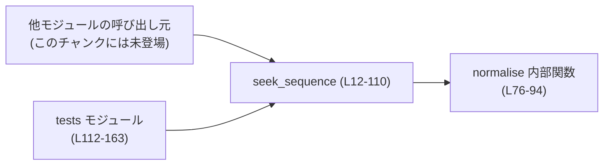
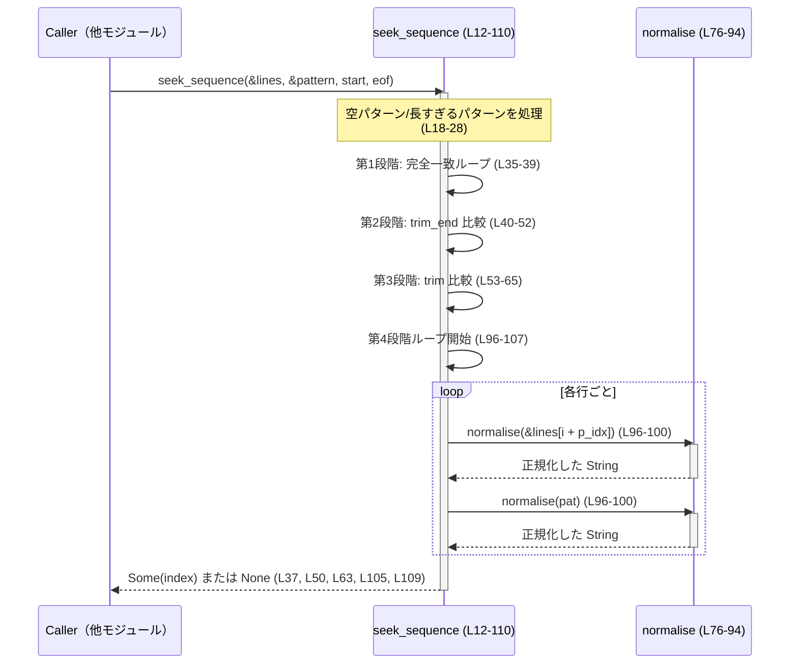

# apply-patch/src/seek_sequence.rs

## 0. ざっくり一言

`seek_sequence` は、`Vec<String>` 相当の行列から、別の行列パターンが出現する位置を「だんだん緩い条件」で探すための関数です（厳密一致 → 末尾空白無視 → 前後空白無視 → 一部 Unicode 記号の正規化一致）。  
パターンが長すぎてマッチ不能な場合に panic しないよう、防御的なチェックも含まれています（`pattern.len() > lines.len()` のガードなど、seek_sequence.rs:L22-28）。

---

## 1. このモジュールの役割

### 1.1 概要

- このモジュールは **テキスト行列から指定の行シーケンスを検索する問題** を解決するために存在し、**複数段階の「ゆるい一致条件」による検索機能** を提供します（seek_sequence.rs:L12-65, L67-107）。
- 既存コメントから、`git apply` のようなパッチ適用処理で「コンテキスト行」を探す用途が想定されます（seek_sequence.rs:L67-73）。

### 1.2 アーキテクチャ内での位置づけ

このファイル内で完結しており、外部依存は標準ライブラリのみです。`seek_sequence` は crate 内から `pub(crate)` として呼び出され、テストは同一ファイル内のモジュールから呼び出します（seek_sequence.rs:L12, L112-115）。



### 1.3 設計上のポイント

- **多段階マッチ戦略**（seek_sequence.rs:L34-65, L96-107）
  - 1回の呼び出しで、厳密一致 → 空白無視 → Unicode 正規化まで、最大4段階で探索します。
- **防御的な境界チェック**
  - `pattern.is_empty()` を特別扱いし即時成功（seek_sequence.rs:L18-20）。
  - `pattern.len() > lines.len()` の場合は即 `None` を返し、後続のスライスで panic しないようにしています（seek_sequence.rs:L22-28）。
- **状態を持たない純粋関数**
  - グローバル状態や I/O には触れず、`lines` と `pattern` から `Option<usize>` を計算するだけの関数です。
  - 内部関数 `normalise` も、副作用のない純粋な変換関数です（seek_sequence.rs:L76-94）。
- **安全性（Rust 特有）**
  - `unsafe` ブロックは存在せず、インデックスアクセスも境界チェック付きループと早期リターンにより panic を避ける設計です（seek_sequence.rs:L26-28, L35-37 など）。
- **並行性**
  - 共有可変状態を持たないため、同じ `lines` / `pattern` を共有参照で渡す限り、複数スレッドから同時に呼び出しても競合しません（`&[String]` 引数、seek_sequence.rs:L12-17）。

---

## 2. 主要な機能一覧

### 2.1 コンポーネント一覧

| 名前 | 種別 | シグネチャ / 概要 | 行範囲 |
|------|------|-------------------|--------|
| `seek_sequence` | 関数（crate 内公開） | `fn seek_sequence(lines: &[String], pattern: &[String], start: usize, eof: bool) -> Option<usize>` – 行列中に `pattern` シーケンスが現れる開始インデックスを、複数段階のマッチ戦略で検索します | seek_sequence.rs:L12-110 |
| `normalise` | 関数（`seek_sequence` 内部） | `fn normalise(s: &str) -> String` – 文字列をトリムした上で、一部 Unicode 記号を ASCII に正規化します | seek_sequence.rs:L76-94 |
| `to_vec` | テスト用ヘルパー関数 | `fn to_vec(strings: &[&str]) -> Vec<String>` – `&str` スライスから `Vec<String>` を生成します | seek_sequence.rs:L117-119 |
| `test_exact_match_finds_sequence` ほか 3件 | テスト関数 | `seek_sequence` の代表的なパターンを検証する単体テスト群です | seek_sequence.rs:L121-160 |

### 2.2 機能一覧

- シーケンス検索: 行列 `lines` 中から `pattern` が出現する開始インデックスを検索（seek_sequence.rs:L34-65, L96-107）。
- 空白差分を許容した検索: 末尾空白無視・前後空白無視での一致判定（seek_sequence.rs:L40-65）。
- Unicode 記号の正規化マッチ: 各種ダッシュ・引用符・不可視スペース等を ASCII へ正規化して比較（seek_sequence.rs:L67-73, L76-94, L96-107）。
- 防御的エラー条件処理: 空パターンやパターン長 > 入力長を特別扱いし、panic を回避（seek_sequence.rs:L18-20, L22-28）。

---

## 3. 公開 API と詳細解説

### 3.1 型一覧（構造体・列挙体など）

このファイル内にはユーザー定義の構造体・列挙体はありません。主に標準ライブラリの以下の型を扱います。

| 名前 | 種別 | 役割 / 用途 |
|------|------|-------------|
| `String` | 標準ライブラリ構造体 | 1行分のテキストを保持します（seek_sequence.rs:L13-14）。 |
| `Option<usize>` | 列挙体 | マッチが見つかった開始位置（`Some(index)`）または見つからない場合の `None` を表します（seek_sequence.rs:L17, L37, L50, L63, L105, L109）。 |
| `Vec<String>` | ベクタ | テストで `lines` / `pattern` を構築するのに使われます（seek_sequence.rs:L117-119, L123-124 など）。 |

### 3.2 関数詳細：`seek_sequence`

#### `seek_sequence(lines: &[String], pattern: &[String], start: usize, eof: bool) -> Option<usize>`

**概要**

- `lines` 中に `pattern` で与えられた行シーケンスが現れるかどうかを、指定した位置以降で検索する関数です（seek_sequence.rs:L12-17）。
- 一致条件は段階的に緩和されます（seek_sequence.rs:L34-65, L96-107）。
  1. 完全一致
  2. 行末の空白（スペース・タブ等）を無視
  3. 行頭・行末の空白を無視
  4. 空白をトリムしつつ、Unicode の一部のダッシュ・引用符・スペースを ASCII に正規化して比較

**引数**

| 引数名 | 型 | 説明 |
|--------|----|------|
| `lines` | `&[String]` | 検索対象となる、テキスト行のスライスです（seek_sequence.rs:L12-13）。 |
| `pattern` | `&[String]` | 探したい行シーケンスです。空のときは「どこでもマッチ」と解釈されます（seek_sequence.rs:L14, L18-20）。 |
| `start` | `usize` | 探索開始位置のインデックスです。`eof` が `false` の場合、この位置以降のインデックスでマッチを探します（seek_sequence.rs:L15, L29-33）。 |
| `eof` | `bool` | `true` の場合、まずファイル末尾（`lines.len() - pattern.len()`）でのマッチを優先し、その位置のみをチェックします（seek_sequence.rs:L29-33, L35-39 など）。 |

> ドキュメントコメントには「eof が `true` のときは EOF から試し、必要なら `start` から検索にフォールバック」と書かれていますが（seek_sequence.rs:L4-6）、実装上は `search_start` が一度だけ計算され、その後すべての探索ループで同じ値が使われるため、`start` へフォールバックする処理は実装されていません（seek_sequence.rs:L29-33, L35-65, L96-107）。

**戻り値**

- `Some(index)` – `lines[index..index + pattern.len()]` が、いずれかの一致条件で `pattern` とマッチした場合の開始インデックス（seek_sequence.rs:L36-37, L49-50, L62-63, L104-105）。
- `None` – マッチが見つからなかった場合（seek_sequence.rs:L27, L109）。

**内部処理の流れ（アルゴリズム）**

1. **空パターンの特別扱い**  
   `pattern.is_empty()` の場合は、実際に検索を行わず `Some(start)` を返します（seek_sequence.rs:L18-20）。

2. **長さチェック（防御的プログラミング）**  
   `pattern.len() > lines.len()` なら、どこにもマッチし得ないため即 `None` を返し、後続のスライスで panic しないようにします（seek_sequence.rs:L22-28）。

3. **探索開始位置の決定**  
   - `eof == true` かつ `lines.len() >= pattern.len()` の場合: `search_start = lines.len() - pattern.len()` に設定し、「末尾にぴったり一致するか」を試します（seek_sequence.rs:L29-30）。
   - それ以外の場合: 引数 `start` をそのまま `search_start` とします（seek_sequence.rs:L31-33）。

4. **第1段階 – 完全一致検索**（厳密）  
   - ループ: `for i in search_start..=lines.len().saturating_sub(pattern.len())`（seek_sequence.rs:L35）。
   - 条件: `lines[i..i + pattern.len()] == *pattern`（スライス同士の要素比較）なら `Some(i)` を返して終了（seek_sequence.rs:L36-37）。

5. **第2段階 – 行末空白無視**  
   - 同じループ範囲で、各行を `trim_end()` して比較します（seek_sequence.rs:L40-48）。
   - すべての行が一致したら、その `i` を返します（seek_sequence.rs:L49-50）。

6. **第3段階 – 行頭・行末の空白無視**  
   - 同ループ範囲で、`trim()` を用いて前後の空白を除去して比較します（seek_sequence.rs:L53-61）。
   - すべて一致したら `Some(i)` を返します（seek_sequence.rs:L62-63）。

7. **第4段階 – Unicode 記号の正規化＋前後トリム**  
   - 内部関数 `normalise(s: &str) -> String` で、以下を行います（seek_sequence.rs:L76-94）。
     - `s.trim()` で前後の空白を除去。
     - 各文字について、Unicode のダッシュ・引用符・特殊スペースを ASCII の `'-'` / `'\'` / `'"'` / `' '` に変換し、それ以外はそのまま残す（seek_sequence.rs:L80-91）。
   - ループでは `normalise(&lines[i + p_idx]) != normalise(pat)` かどうかで比較し、すべて一致すれば `Some(i)` を返します（seek_sequence.rs:L96-105）。

8. **いずれの段階でもマッチしない場合**  
   - `None` を返して終了します（seek_sequence.rs:L109）。

**Examples（使用例）**

1. 基本的な完全一致検索（テストと同等、正常系）

```rust
use crate::seek_sequence::seek_sequence; // 実際のパスはクレート構成に依存（このチャンクでは不明）

fn main() {
    // 検索対象の行列を用意
    let lines = vec![
        "foo".to_string(),
        "bar".to_string(),
        "baz".to_string(),
    ];

    // 検索したいパターン
    let pattern = vec!["bar".to_string(), "baz".to_string()];

    // 先頭から検索（eof = false）
    let index = seek_sequence(&lines, &pattern, 0, false);

    assert_eq!(index, Some(1)); // "bar" から始まるので 1
}
```

この例は `test_exact_match_finds_sequence` と同じ挙動を示します（seek_sequence.rs:L121-128）。

1. 行末の空白を無視した検索（テストと同等）

```rust
let lines = vec![
    "foo   ".to_string(),  // 行末にスペース
    "bar\t\t".to_string(), // 行末にタブ
];

let pattern = vec!["foo".to_string(), "bar".to_string()];

let index = seek_sequence(&lines, &pattern, 0, false);
// 行末空白無視の第2段階でマッチする
assert_eq!(index, Some(0));
```

これは `test_rstrip_match_ignores_trailing_whitespace` と同じケースです（seek_sequence.rs:L132-139）。

**Errors / Panics（エラー・パニック条件）**

- **返り値としてのエラー表現**
  - マッチが見つからない場合は `None` を返します。例外や `Result` は使わず、呼び出し側で `Option` を解釈します（seek_sequence.rs:L109）。
- **panic の可能性**
  - 明示的な `panic!` 呼び出しや `unwrap` はありません。
  - インデックスアクセスはすべて
    - `pattern.is_empty()` で早期リターン（seek_sequence.rs:L18-20）
    - `pattern.len() > lines.len()` で早期リターン（seek_sequence.rs:L22-28）
    - ループ範囲 `search_start..=lines.len().saturating_sub(pattern.len())`（seek_sequence.rs:L35, L41, L54, L96）
  
    により、`lines[i..i + pattern.len()]` や `lines[i + p_idx]` が常に範囲内になるよう制約されています（seek_sequence.rs:L35-37, L41-48, L54-61, L96-103）。  
    これにより、境界外アクセスによる panic は避けられています。

**Edge cases（エッジケース）**

- `pattern.is_empty() == true`  
  → 無条件に `Some(start)` を返します（seek_sequence.rs:L18-20）。実際の探索処理は行いません。
- `pattern.len() > lines.len()`  
  → 早期に `None` を返します（seek_sequence.rs:L22-28）。  
    コメントに「過去に out-of-bounds panic があったため」と明記されています（seek_sequence.rs:L22-25）。
- `start > lines.len()`  
  → `search_start = start` となり、`for i in start..=lines.len().saturating_sub(pattern.len())` の範囲が空になるため、どのループも実行されず `None` を返します。panic は発生しません（seek_sequence.rs:L29-35, L41, L54, L96）。
- `eof == true` で `lines.len() >= pattern.len()`  
  → `search_start` は常に `lines.len() - pattern.len()` となり、その位置のみをチェックします（seek_sequence.rs:L29-33, L35-37 ほか）。`start` は無視されます。
- `lines.len() < pattern.len()` かつ `eof == true`  
  → `pattern.len() > lines.len()` のチェックで `None` を返し、以降の処理は実行されません（seek_sequence.rs:L22-28）。
- 行内に Unicode のダッシュ・引用符・特殊スペースが含まれる場合  
  → 第4段階の `normalise` で ASCII 相当に変換されるため、ASCII ベースの `pattern` でもマッチする可能性があります（seek_sequence.rs:L67-73, L76-94, L96-103）。

**使用上の注意点**

- `start` より前の位置は探索されません（`eof == true` で末尾固定の場合を除く）。`start` の意味は「検索を始める最初のインデックス」です（seek_sequence.rs:L29-35）。
- `eof == true` の場合は、コメントとは異なり「末尾位置だけをチェックする」挙動になります。`start` へのフォールバックは実装されていないため、末尾以外も検索したい場合は `eof == false` で呼び出す必要があります（seek_sequence.rs:L29-33, L35-65, L96-107）。
- 第4段階の `normalise` は毎回 `String` を新規に生成するため、非常に長い `lines` / `pattern` に対して頻繁に呼ぶ場合は、後半の段階ほど追加のメモリ割り当てが発生します（seek_sequence.rs:L76-94, L96-103）。
- 関数自体はスレッドセーフであり、共有参照（`&[String]`）を渡す限り、複数スレッドから同時に呼んで問題ありません。

### 3.3 その他の関数

| 関数名 | 役割（1 行） | 行範囲 |
|--------|--------------|--------|
| `normalise(s: &str) -> String` | 文字列の前後空白をトリムしつつ、Unicode のいくつかの記号類（ダッシュ・引用符・特殊スペース）を ASCII に正規化します。`seek_sequence` の最も寛容な比較に使用されます。 | seek_sequence.rs:L76-94 |
| `to_vec(strings: &[&str]) -> Vec<String>` | テストで `&[&str]` から `Vec<String>` を作る単純なヘルパー関数です。 | seek_sequence.rs:L117-119 |
| `test_exact_match_finds_sequence` | 厳密一致で `pattern` が正しく検出されることを検証します。 | seek_sequence.rs:L121-129 |
| `test_rstrip_match_ignores_trailing_whitespace` | 行末空白無視のマッチングが機能することを検証します。 | seek_sequence.rs:L131-139 |
| `test_trim_match_ignores_leading_and_trailing_whitespace` | 行頭・行末の空白無視のマッチングが機能することを検証します。 | seek_sequence.rs:L142-151 |
| `test_pattern_longer_than_input_returns_none` | `pattern.len() > lines.len()` の場合に panic せず `None` を返すことを検証します。 | seek_sequence.rs:L153-161 |

---

## 4. データフロー

### 4.1 代表的な処理シナリオ

典型的なシナリオは、パッチ適用などで「コンテキスト行」を探すために呼び出されるケースです。

1. 呼び出し元が `lines`（ファイル全行）と `pattern`（パッチのコンテキスト行）を構築する。
2. `seek_sequence(&lines, &pattern, start, eof)` を呼び出す。
3. 関数内部で複数段階の比較を順番に行う。
4. 最初にマッチした位置のインデックスを返す。見つからなければ `None` を返す。



この図は、検索の各段階でどのように `normalise` が呼ばれるか、および呼び出し元とのやりとりを表しています。

---

## 5. 使い方（How to Use）

### 5.1 基本的な使用方法

もっとも単純な使い方は、ファイルの全行を `lines` に、探したいブロックを `pattern` に入れて、先頭から検索する方法です。

```rust
fn find_block(lines: &[String]) -> Option<usize> {
    // 探したいブロック（例）
    let pattern = vec![
        "BEGIN CONFIG".to_string(),
        "version = 1".to_string(),
    ];

    // 先頭から検索し、マッチした開始位置を返す
    seek_sequence(lines, &pattern, 0, /*eof*/ false)
}
```

- 返ってきた `Option<usize>` をもとに、`lines[index..index + pattern.len()]` でマッチした部分を取り出せます（呼び出し側の責務）。

### 5.2 よくある使用パターン

1. **ファイル末尾にアンカーされたパターンを探す**

```rust
fn pattern_at_eof(lines: &[String], pattern: &[String]) -> bool {
    // eof = true にすると、末尾でのマッチだけが試される
    seek_sequence(lines, pattern, 0, /*eof*/ true).is_some()
}
```

- `eof == true` の場合、`search_start` は末尾位置 (`lines.len() - pattern.len()`) に固定されます（seek_sequence.rs:L29-30）。

1. **探索を途中から再開する**

```rust
fn find_next(lines: &[String], pattern: &[String], mut from: usize) -> Option<usize> {
    // 直前に見つかった位置の次から探す
    if let Some(pos) = seek_sequence(lines, pattern, from, false) {
        // 次回は、その次の位置から探す
        from = pos + 1;
        Some(pos)
    } else {
        None
    }
}
```

- `start` 引数を変えることで、同じ `lines` / `pattern` に対して複数回検索を行うことができます（seek_sequence.rs:L15, L29-35）。

### 5.3 よくある間違い

```rust
// 間違い例: eof = true なら start からも検索してくれると想定している
let index = seek_sequence(&lines, &pattern, 10, /*eof*/ true);
// 期待: まず末尾を試し、ダメなら index=10 から手前も含めて検索
// 実際: 末尾位置（lines.len() - pattern.len()）のみをチェックし、
//       そこでマッチしなければ None になる
```

```rust
// 正しい例: 末尾だけでなくそれ以前も検索したい場合は eof = false にする
let index = seek_sequence(&lines, &pattern, 10, /*eof*/ false);
```

- 実装を見ると、`search_start` は1度決まったら全段階で固定であり、`start` へのフォールバックはありません（seek_sequence.rs:L29-33, L35-65, L96-107）。

### 5.4 使用上の注意点（まとめ）

- **前提条件**
  - `lines` / `pattern` は UTF-8 のテキスト行を `String` で保持している想定です。
  - `pattern` が空のときは「必ずマッチする」とみなされ、`Some(start)` が返ります（seek_sequence.rs:L18-20）。
- **禁止事項 / 想定外**
  - `pattern` が空であるにもかかわらず、「マッチしないことを確認したい」のような用途には向きません（ロジック上、必ず `Some(start)` になるため）。
- **エラー処理**
  - 失敗は `None` で表現されます。エラー詳細（どこまで一致したかなど）は返されません。
- **性能上の注意**
  - 各段階は O(N × M)（N: `lines` の長さ、M: `pattern` の長さ）程度のループで、最大4段階まで実行されます。
  - 第4段階では `normalise` が毎回 `String` を生成するため、かなり大きな入力に対して多用すると、アロケーションコストが増加します（seek_sequence.rs:L76-94, L96-103）。
- **並行性**
  - 関数は引数のスライスを読み取るだけで、内部に共有状態を持たないため、複数スレッドから同時に呼び出してもデータ競合は発生しません。

### 5.5 バグおよびセキュリティ上の観点

- **仕様コメントと挙動のずれ**
  - コメントには「`eof` が true のとき、EOF から試し、必要なら `start` から検索」と記載されていますが（seek_sequence.rs:L4-6）、実装では `search_start` が末尾に固定され、`start` にフォールバックする処理はありません（seek_sequence.rs:L29-33, L35-65, L96-107）。
  - この差異は、利用側がコメントだけを読んだ場合に期待と実際の挙動が異なる原因となる可能性があります。
- **セキュリティ**
  - ファイル I/O や外部プロセス呼び出しは行っておらず、処理対象は引数で渡された文字列のみです。
  - 正規化で扱う Unicode コードポイントは決め打ちのマッピングであり、バッファオーバーフロー等の低レベルな脆弱性は Rust の安全機構と実装からは見当たりません（seek_sequence.rs:L76-94）。
  - 計算量的には最悪で O(N × M × 段階数) となるため、非常に大きな入力を攻撃的に与えられると CPU 時間を消費する可能性はありますが、これは一般的なシーケンス検索アルゴリズムと同程度の性質です。

---

## 6. 変更の仕方（How to Modify）

### 6.1 新しい機能を追加する場合

**例: さらに別のマッチ戦略（大文字小文字無視など）を追加したい場合**

1. **追加する戦略の位置を決める**  
   - 既存の段階は「厳密 → 空白無視 → Unicode 正規化」の順です（seek_sequence.rs:L34-65, L96-107）。  
     新戦略をどこに挿入するかを決めます。
2. **同様のループを追加する**  
   - `for i in search_start..=lines.len().saturating_sub(pattern.len())` というループパターンを真似し（seek_sequence.rs:L35, L41, L54, L96）、内部の比較条件だけを差し替えます。
3. **`normalise` の拡張が必要なら内部関数を修正**  
   - 追加の正規化ルールが必要であれば、`normalise` 内の `match c` に分岐を追加します（seek_sequence.rs:L80-91）。
4. **新しい挙動をカバーするテストを追加**  
   - 既存テストの形式に倣い、`tests` モジュールに `#[test]` 関数を追加します（seek_sequence.rs:L121-161）。

### 6.2 既存の機能を変更する場合

- **影響範囲の確認**
  - `seek_sequence` は `pub(crate)` のため、同一 crate 内の他モジュールから呼び出されている可能性があります（seek_sequence.rs:L12）。  
    実際の呼び出し箇所はこのチャンクには登場しません。
- **変更時に注意すべき契約**
  - 空パターンで `Some(start)` を返す契約（seek_sequence.rs:L18-20）。
  - `pattern.len() > lines.len()` で `None` を返し、panic しない契約（seek_sequence.rs:L22-28）。
  - `eof == true` のとき末尾のみを試す現在の挙動（seek_sequence.rs:L29-33, L35-65, L96-107）。
- **テストとの整合性**
  - 4つの既存テストは以下を前提としています（seek_sequence.rs:L121-161）。
    - 厳密一致での検出
    - 行末空白無視
    - 前後空白無視
    - `pattern.len() > lines.len()` で `None`
  - これらの挙動を変更する場合は、テストの修正や新しいテストの追加が必要です。

---

## 7. 関連ファイル

このチャンクには、このモジュールと直接関連する他ファイルの情報は現れていません。

| パス | 役割 / 関係 |
|------|------------|
| （不明） | `seek_sequence` は `pub(crate)` であるため、同一 crate 内の他モジュールから呼ばれていると推測できますが、具体的なファイルはこのチャンクには現れていません（seek_sequence.rs:L12）。 |
| （本ファイル）`apply-patch/src/seek_sequence.rs` | `seek_sequence` の実装および単体テストを含む自己完結したモジュールです（seek_sequence.rs:L12-110, L112-163）。 |

このファイルを基点として、実際の呼び出し元モジュールを調べる場合は、crate 全体で `seek_sequence(` を検索するのが入口になります。
