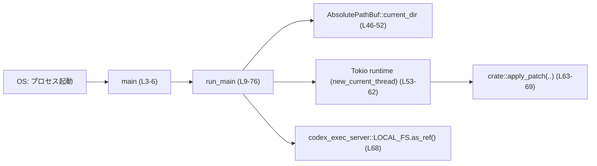
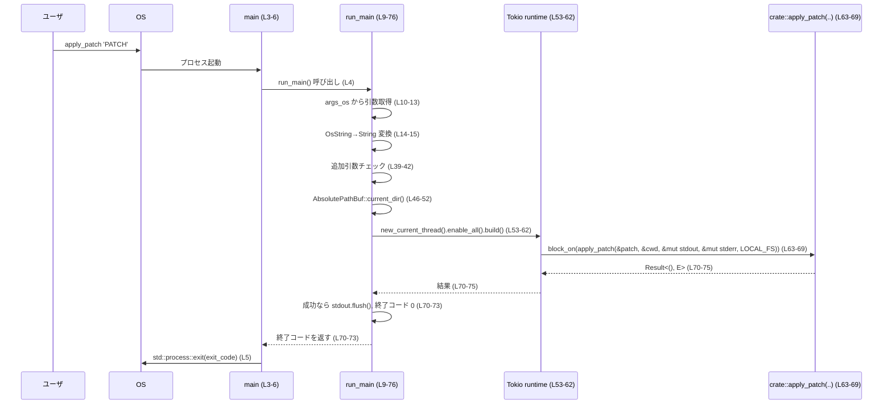

# apply-patch/src/standalone_executable.rs コード解説

## 0. ざっくり一言

`apply_patch` コマンド用の「スタンドアロン実行可能」エントリポイントです。  
コマンドライン引数または標準入力からパッチ文字列を取得し、Tokio ランタイム上で `crate::apply_patch` を実行して、その結果をプロセスの終了コードに変換します（根拠: `apply-patch/src/standalone_executable.rs:L3-6,L9-76`）。

---

## 1. このモジュールの役割

### 1.1 概要

- このモジュールは、`apply_patch` の **CLI 実行エントリポイント**として機能します。
- パッチ文字列を次のいずれかから取得します（根拠: L10-38）。
  - 第 1 引数（プログラム名を除いた最初の実引数）
  - 引数が無い場合は標準入力（stdin）
- 取得したパッチとカレントディレクトリ、標準出力・標準エラー出力、`LOCAL_FS` を `crate::apply_patch` に渡し、成功／失敗を整数の終了コード（0,1,2）にマッピングします（根拠: L44-45,L46-52,L63-75）。

### 1.2 アーキテクチャ内での位置づけ

このファイルは、プロセス起動時に呼ばれる `main` と、その実処理を行う `run_main` を提供します。  
`run_main` は、他モジュールの非同期処理 `crate::apply_patch` の同期ラッパとして振る舞い、Tokio ランタイムを自前で構築して `block_on` しています（根拠: L53-69）。



`crate::apply_patch` や `LOCAL_FS` の具体的な実装はこのチャンクには現れませんが、`block_on` の引数になっているため、`crate::apply_patch` は `Future` を返す非同期処理であることが分かります（根拠: L63-69）。

### 1.3 設計上のポイント

- **エントリポイントの分離**  
  - `pub fn main() -> !` は最小限で、処理のほとんどを `pub fn run_main() -> i32` に委譲しています（根拠: L3-6,L9）。  
  - これにより、テストや他のランナーからは `run_main` を直接呼び出せる設計になっています（ただし、このチャンクには実際の呼び出し例やテストは存在しません: L1-77）。
- **引数・標準入力の二択処理**  
  - 引数があればそれをパッチとみなし、無ければ標準入力を `String` として全読み込みします（根拠: L10-38）。
- **厳密な引数検証**  
  - 「パッチ引数はちょうど 1 つ」だけを受け付ける仕様であり、追加引数がある場合にはエラーとして終了コード 2 を返します（根拠: L39-42）。
- **同期→非同期ブリッジ**  
  - 現在のスレッド上に Tokio ランタイム（`new_current_thread`）を構築し、その上で非同期な `crate::apply_patch` を実行することで、同期的な `main` から async 処理を呼び出しています（根拠: L53-69）。
- **エラーハンドリングと終了コード**  
  - さまざまな失敗パターン（UTF-8 変換失敗、stdin 読み取り失敗、カレントディレクトリ取得失敗、ランタイム初期化失敗、`apply_patch` のエラー）を `1` または `2` の終了コードに集約しています（根拠: L17-19,L27-29,L33-35,L39-43,L46-52,L53-62,L70-75）。
- **安全性・並行性**  
  - このファイル内には `unsafe` は存在せず（根拠: L1-77）、全て安全な API を通じて I/O やランタイム構築を行っています。  
  - `new_current_thread` により、Tokio ランタイムは単一スレッドで動作し、`&mut stdout` / `&mut stderr` を非同期処理に渡しても多スレッド同時アクセスが発生しない設計になっています（根拠: L53-69）。

---

## 2. コンポーネントインベントリー / 主要な機能一覧

### 2.1 関数・外部コンポーネント一覧

| 名前 | 種別 | 公開 | 役割 / 用途 | 定義 / 使用範囲 |
|------|------|------|-------------|-----------------|
| `main` | 関数 | `pub` | プロセスのエントリポイント。`run_main` の戻り値をそのままプロセス終了コードとして `std::process::exit` で終了させる | 定義: `apply-patch/src/standalone_executable.rs:L3-6` |
| `run_main` | 関数 | `pub` | 引数/標準入力からパッチ文字列を取得し、Tokio ランタイム上で `crate::apply_patch` を実行し終了コードを決定する | 定義: L9-76 |
| `crate::apply_patch` | 関数（外部） | 不明 | 非同期処理としてパッチ適用を行う関数。`block_on` されているため `Future` を返す | 呼び出し: L63-69（このチャンクには定義は現れません） |
| `codex_utils_absolute_path::AbsolutePathBuf::current_dir` | 関数（外部） | 不明 | カレントディレクトリを取得し、`AbsolutePathBuf` として返す関数 | 呼び出し: L46-52（定義はこのチャンクには現れません） |
| `codex_exec_server::LOCAL_FS` | 静的値（外部） | 不明 | `.as_ref()` で参照を取得し、`crate::apply_patch` の最終引数として渡されるファイルシステム関連の依存オブジェクト | 使用: L68（定義はこのチャンクには現れません） |

### 2.2 機能の箇条書き

- プロセスエントリポイント実装 (`main`)（根拠: L3-6）
- パッチ文字列の取得（コマンドライン引数／標準入力）（根拠: L10-38）
- 引数個数のバリデーション（「正確に 1 引数」ルール）（根拠: L39-42）
- カレントディレクトリ取得とエラー処理（根拠: L46-52）
- 単一スレッド Tokio ランタイムの構築（根拠: L53-62）
- 非同期 `crate::apply_patch` の実行と結果に基づく終了コード決定（根拠: L63-75）

---

## 3. 公開 API と詳細解説

### 3.1 型一覧（構造体・列挙体など）

このファイル内で **新たに定義されている構造体・列挙体はありません**（根拠: L1-77）。

利用している外部型としては、次のようなものがありますが、いずれも他モジュール／外部クレートで定義されており、このチャンクには型定義が現れません。

| 名前 | 種別 | 定義元 | 役割 / 用途 | 根拠 |
|------|------|--------|-------------|------|
| `AbsolutePathBuf` | 構造体と考えられる型 | `codex_utils_absolute_path` クレート（モジュール） | `current_dir()` の戻り値として使用され、カレントディレクトリを表すパス型と推測されますが、定義はこのチャンクにはありません | 使用: L46-52 |
| Tokio ランタイム型 | 構造体 | `tokio::runtime` | `Builder::new_current_thread().build()` の戻り値として非同期処理の実行基盤を提供する型（具体的な型名はこのチャンクには現れません） | 使用: L53-62 |

※ これら外部型のより詳細な仕様は、該当クレートのドキュメントや実装を参照する必要があります。

---

### 3.2 関数詳細

#### `pub fn main() -> !`

**概要**

- プロセスのエントリポイントです。`run_main()` を呼び出して終了コードを取得し、そのコードで `std::process::exit` によりプロセスを終了させます（根拠: L3-6）。

**引数**

- なし（引数を受け取りません）。

**戻り値**

- `!`（never 型）  
  - この関数は `std::process::exit` を呼び出すため、正常に戻ることはなく、必ずプロセス終了で終わります（根拠: L3-6）。

**内部処理の流れ**

1. `run_main()` を呼び出し、戻り値の整数を `exit_code` に格納する（根拠: L4）。
2. `std::process::exit(exit_code)` を呼び出してプロセスを直ちに終了する（根拠: L5）。

**Examples（使用例）**

この関数はバイナリクレートのエントリポイントとしてコンパイラにより自動的に呼び出されることを前提としており、通常はコードから直接呼び出すことはありません。

ライブラリ側から同等の処理を行いたい場合は、`run_main()` を直接使うことになります（根拠: L3-6,L9）。

**Errors / Panics**

- `std::process::exit` 自体は通常エラーを返しません。  
- `run_main()` 内でパニックが発生した場合、そのパニックは `main` から外側に伝播し、挙動はランタイム／テストハーネスのデフォルト設定に従います。このファイル内ではパニックを明示的に補足していません（根拠: L3-6,L9-76）。

**Edge cases（エッジケース）**

- `main` 自体には分岐や I/O が無く、エッジケースはすべて `run_main` に委譲されています（根拠: L3-6,L9-76）。

**使用上の注意点**

- `std::process::exit` により、通常のスコープ終了時の `Drop` は実行されません。そのため、グローバルなクリーンアップ処理が必要な場合は `run_main` 側で完了させておく必要があります（根拠: L3-6）。  
- `main` をテストから直接呼び出すとプロセス自体が終了するため、通常は `run_main` を対象にテストする設計が想定されます。

---

#### `pub fn run_main() -> i32`

**概要**

- `apply_patch` コマンドの実行本体です。
- コマンドライン引数または標準入力からパッチ文字列を取得し、カレントディレクトリとともに `crate::apply_patch` を Tokio ランタイム上で実行します（根拠: L10-38,L46-52,L53-69）。
- 実行結果やエラー状況を整数の終了コード（0,1,2）として返します（根拠: L17-19,L27-29,L33-35,L39-43,L46-52,L53-62,L70-75）。

**引数**

- なし（`std::env::args_os()` と標準入力を直接参照します）。

**戻り値**

- `i32`  
  - プロセス終了コードとして `main` から `std::process::exit` に渡されます（根拠: L3-6,L9）。

終了コードの意味（このファイルから読み取れる範囲）:

- `0`: `crate::apply_patch` が `Ok(())` を返した場合（成功）（根拠: L70-73）。
- `1`: 「実行時エラー」系（UTF-8 エラー、stdin 読み取り失敗、カレントディレクトリ取得失敗、ランタイム構築失敗、`crate::apply_patch` の `Err`）（根拠: L17-19,L33-35,L46-52,L53-62,L75）。
- `2`: 「利用方法エラー」系（パッチが空／追加引数が存在する）（根拠: L27-29,L39-42）。

**内部処理の流れ（アルゴリズム）**

1. **引数の取得とプログラム名のスキップ**  
   - `std::env::args_os()` で引数イテレータを取得し、最初の要素（プログラムパス）を破棄します（根拠: L10-12）。
2. **パッチ文字列の決定**  
   - 2 番目の引数が存在するかを `args.next()` で確認します（根拠: L13）。  
   - 存在する場合:
     - `OsString` を `into_string()` で UTF-8 の `String` へ変換します（根拠: L14-15）。
     - 変換失敗時はエラーメッセージを `eprintln!` で出力し、終了コード `1` を返します（根拠: L16-19）。
   - 存在しない場合:
     - 標準入力から `String` に全読み込みします（`stdin().read_to_string(&mut buf)`）（根拠: L21-25）。  
     - 読み込み成功かつ空文字列なら、利用方法メッセージを出力して終了コード `2` を返します（根拠: L26-29）。  
     - 読み込みエラー（UTF-8 を含む）はエラーメッセージを出力して終了コード `1` を返します（根拠: L32-35）。
3. **追加引数の拒否**  
   - `args.next().is_some()` で 3 個目以降の引数があるか確認し、あればエラーメッセージとともに終了コード `2` を返します（根拠: L39-42）。
4. **出力ストリームの取得**  
   - `std::io::stdout()` / `stderr()` を呼び出して `Stdout` / `Stderr` を `mut` 変数として確保します（根拠: L44-45）。  
   - これらは後で `&mut` 参照として `crate::apply_patch` に渡されます（根拠: L63-69）。
5. **カレントディレクトリの取得**  
   - `AbsolutePathBuf::current_dir()` を呼び出し、成功時は `cwd` に格納します（根拠: L46-47）。  
   - 失敗時にはエラーメッセージを出力し終了コード `1` を返します（根拠: L48-51）。
6. **Tokio ランタイムの構築**  
   - `tokio::runtime::Builder::new_current_thread().enable_all().build()` により、現在のスレッド上に Tokio ランタイムを構築します（根拠: L53-56）。  
   - 失敗時にはエラーメッセージを出力し終了コード `1` を返します（根拠: L57-61）。
7. **非同期 `apply_patch` の実行**  
   - `runtime.block_on(crate::apply_patch(&patch_arg, &cwd, &mut stdout, &mut stderr, codex_exec_server::LOCAL_FS.as_ref()))` を実行します（根拠: L63-69）。  
   - ここで `crate::apply_patch` の戻り値は `Result<(), E>` であることが `match` から分かります（根拠: L70-75）。
8. **結果に応じた終了コードとフラッシュ**  
   - `Ok(())` の場合:
     - `stdout.flush()` を実行して標準出力を明示的にフラッシュし（エラーは無視）、`0` を返します（根拠: L70-73）。  
       - コメントから「パイプライン利用時の出力順序」を意図していることが分かります（根拠: L71-72）。
   - `Err(_)` の場合:
     - エラー内容はここではログ出力されず、終了コード `1` を返します（根拠: L75）。エラーの詳細ログは `crate::apply_patch` 側に委ねられていると解釈できますが、実際の実装はこのチャンクには現れません。

**Examples（使用例）**

この関数は CLI エントリポイントとして設計されており、通常はバイナリとして起動します。

- 引数でパッチを渡す:

```bash
# シェルからの利用例
apply_patch 'PATCH_CONTENT'
# または
./apply-patch-binary 'PATCH_CONTENT'
```

- 標準入力からパッチを渡す:

```bash
echo 'PATCH_CONTENT' | apply_patch
```

Rust コードから直接呼ぶ場合（例: 独自ランナー）:

```rust
// 注意: run_main は std::env::args_os() と stdin を直接参照するため、
// テストや他の環境で再利用する際は、その点を考慮する必要があります。

fn main() {
    let code = apply_patch::standalone_executable::run_main(); // 実行
    // 必要なら code をログに残したり、独自の終了処理を行ったりできる
    std::process::exit(code);
}
```

**Errors / Panics**

`run_main` が `Err` 型を返すことはなく、エラー状況は終了コードにマッピングされます。このファイルから読み取れるエラー条件は次の通りです。

- **終了コード 1（実行時エラー）**
  - パッチ引数が非 UTF-8（`OsString::into_string()` が失敗）（根拠: L14-19）。
  - 標準入力読み取り時に I/O エラーまたは UTF-8 エラー（`read_to_string` が `Err`）（根拠: L24-25,L32-35）。
  - カレントディレクトリの取得失敗（根拠: L46-52）。
  - Tokio ランタイム構築に失敗（根拠: L53-62）。
  - `crate::apply_patch` が `Err(_)` を返す（根拠: L63-69,L75）。
- **終了コード 2（利用方法エラー）**
  - 引数も無く、標準入力も空文字列だった場合（根拠: L21-29）。
  - パッチの他に追加の引数が渡された場合（根拠: L39-42）。

この関数内に明示的な `panic!` や `unwrap` は存在せず（根拠: L1-77）、パニックは内部で使用するライブラリ関数に依存します。

**Edge cases（エッジケース）**

- **引数が 0 個**  
  - 標準入力からの読み取りを試みます（根拠: L21-25）。  
  - 標準入力が EOF で空の場合、Usage メッセージを表示して終了コード 2（根拠: L26-29）。
- **引数が 1 個（パッチ）**  
  - その引数は UTF-8 である必要があります。そうでない場合は終了コード 1（根拠: L14-19）。
- **引数が 2 個以上**  
  - パッチ（引数 1）を取得した後、`args.next()` で追加引数の有無を確認し、存在すれば終了コード 2（根拠: L13,L39-42）。
- **非常に大きなパッチ**  
  - 標準入力からの読み取りは `String` に全読み込みするため、入力サイズが大きいほどメモリ消費が増加します（根拠: L23-25）。CLI 用途では妥当ですが、巨大なパッチには注意が必要です。
- **出力のフラッシュ失敗**  
  - `stdout.flush()` の戻り値は破棄されており、フラッシュエラーが発生しても終了コードは 0 のままです（根拠: L72-73）。

**使用上の注意点**

- **CLI 依存性**  
  - `std::env::args_os()` と標準入力に直接依存するため、ライブラリ関数として汎用的に再利用するには向きません（根拠: L10-12,L21-25）。  
  - テストから呼ぶ場合は、プロセス全体の引数や標準入力を制御する必要があります。
- **UTF-8 前提**  
  - パッチは **UTF-8 のテキスト** として扱われます。非 UTF-8 のバイト列パッチはサポートしていません（根拠: L14-19,L23-25）。
- **並行性**  
  - ランタイムは `new_current_thread` を使用しているため、非同期タスクは単一スレッド上で協調的に実行されます（根拠: L53-56）。  
  - これにより `&mut stdout` / `&mut stderr` を非同期関数に渡しても、多スレッドからの同時アクセスは発生しない設計です（根拠: L63-69）。
- **エラー情報の露出**  
  - 一部の I/O エラーでは `err` を文字列展開して標準エラーに出力します（根拠: L33-35,L49-50,L59-60）。ファイルパスなどの情報が含まれる可能性があるため、ログポリシーに注意が必要です。

---

### 3.3 その他の関数

- このファイルには、`main` と `run_main` 以外の関数は定義されていません（根拠: L1-77）。

---

## 4. データフロー

ここでは「引数でパッチを渡した場合」の典型フローを示します。標準入力から読む場合も、パッチ決定以外の流れは同様です。



要点:

- 入力（引数／stdin）はすべて `run_main` 内で処理されます（根拠: L10-38）。
- ファイルシステム操作やパッチ適用の本体は `crate::apply_patch` に委譲されています（根拠: L63-69）。
- `main` は `run_main` の戻り値をそのまま OS に渡すだけの薄いラッパです（根拠: L3-6）。

---

## 5. 使い方（How to Use）

### 5.1 基本的な使用方法

このファイルは CLI バイナリとしての利用を想定しています。

- **パッチを引数で渡す**

```bash
# 単純な利用例
apply_patch 'PATCH_CONTENT'
```

- **パッチを標準入力で渡す**

```bash
# ファイルから読み取って適用する
cat my.patch | apply_patch
```

いずれの場合も、実際には `run_main()` がコマンドの振る舞いを決め、`main()` が終了コードでプロセスを終了させます（根拠: L3-6,L9-76）。

### 5.2 よくある使用パターン

- **シェルスクリプトや CI からの利用**
  - スクリプト中で `apply_patch 'PATCH'` とインライン指定するか、生成したパッチをパイプで渡す（根拠: L10-38）。
- **パイプラインでの利用**
  - コメントより、パイプライン内での出力順序を意識して `stdout.flush()` を行っているため（根拠: L71-72）、例えば以下のような組み合わせが想定されます:
  
```bash
generate_patch | apply_patch | tee apply.log
```

### 5.3 よくある間違い

このファイルから想定される誤用と結果は次の通りです。

```rust
// 間違い例 1: パッチと無関係な追加引数を渡す
// $ apply_patch 'PATCH' extra
// -> "Error: apply_patch accepts exactly one argument." と表示され、終了コード 2
// 根拠: L39-42

// 間違い例 2: 非 UTF-8 の引数を渡す（OS 側で起こりうる）
// -> "Error: apply_patch requires a UTF-8 PATCH argument." と表示され、終了コード 1
// 根拠: L14-19

// 間違い例 3: 引数もパイプも無しで実行する
// $ apply_patch
// -> Usage メッセージを表示し、終了コード 2
// 根拠: L21-29
```

### 5.4 使用上の注意点（まとめ）

- **終了コードの意味を前提にする場合**  
  - 0: 正常終了  
  - 1: 実行時エラー（I/O, ランタイム構築, apply_patch 失敗など）  
  - 2: 使用方法エラー（引数個数、入力なし）  
  （根拠: L17-19,L27-29,L33-35,L39-43,L46-52,L53-62,L70-75）
- **UTF-8 のみ対応**  
  - パッチは UTF-8 テキストでなければなりません。バイナリパッチを扱う用途には適しません（根拠: L14-19,L23-25）。
- **標準入力は全読み込み**  
  - `read_to_string` により全入力をメモリに読み込むため、非常に大きな入力ではメモリ使用量が増加します（根拠: L23-25）。
- **非同期処理は単一スレッドランタイム**  
  - 高いスループットが必要な場合や、重い非同期処理を大量に並列実行する場合には、この設計（current_thread ランタイム）のスケーリング特性を考慮する必要があります（根拠: L53-62）。  
  - ただし、このファイルからは `crate::apply_patch` 内部のタスクモデルは分かりません。

---

## 6. 変更の仕方（How to Modify）

### 6.1 新しい機能を追加する場合

例: CLI オプションを追加したい場合（`--dry-run` 等）

1. **引数解析部分の拡張**  
   - `run_main` 冒頭の引数処理（L10-13,L39-42）に新しいオプションの解釈ロジックを追加します。  
   - 現在は「パッチ 1 つのみ」という前提があるため、その契約をどう変更するかを明確にする必要があります。
2. **使用方法メッセージの更新**  
   - Usage 文言は標準入力が空だった場合にのみ表示されます（根拠: L26-29）。オプション追加時はこのメッセージも合わせて更新することが望ましいです。
3. **`crate::apply_patch` への引数連携**  
   - 新たなオプション値を `crate::apply_patch` 側に渡す必要がある場合は、その関数シグネチャの変更が必要になります（このチャンクには `apply_patch` の定義が無いため、詳細は不明です: L63-69）。

### 6.2 既存の機能を変更する場合

- **終了コード仕様を変更する場合**
  - `run_main` から返している `1` / `2` の意味はこのファイル内で一貫して使われているため（根拠: L17-19,L27-29,L33-35,L39-43,L46-52,L53-62,L70-75）、外部ツールやテストがこれに依存していないかを確認する必要があります。
- **Tokio ランタイムの構成を変える場合**
  - 例えばマルチスレッドランタイムに変えたい場合は、`Builder::new_current_thread()` 部分（L53-56）を変更します。  
  - その場合、`&mut stdout` / `&mut stderr` をマルチスレッドコンテキストに渡す設計が適切かどうかも合わせて検討する必要があります（根拠: L63-69）。
- **カレントディレクトリの取得方法を変更する場合**
  - `AbsolutePathBuf::current_dir()` の呼び出し（L46-52）を別の API に置き換える際は、`apply_patch` 側が期待するパスの形式（絶対／相対など）を確認する必要がありますが、このチャンクのみからは判断できません。

---

## 7. 関連ファイル

このモジュールと密接に関係する外部コンポーネントは、コード上から次のように読み取れます。

| パス / シンボル | 役割 / 関係 | 根拠 |
|-----------------|------------|------|
| `crate::apply_patch` | パッチ適用処理の本体となる非同期関数。`run_main` から Tokio ランタイム上で `block_on` される | 呼び出し: `apply-patch/src/standalone_executable.rs:L63-69`（定義はこのチャンクには現れません） |
| `codex_utils_absolute_path::AbsolutePathBuf` | カレントディレクトリを表すパス型と推測される。`current_dir()` で値を取得し、`apply_patch` に引き渡す | 使用: L46-52,L64-65（型の定義はこのチャンクには現れません） |
| `codex_exec_server::LOCAL_FS` | ファイルシステムへのアクセスを表す依存オブジェクトと考えられる。`as_ref()` の戻り値が `apply_patch` の最後の引数として渡される | 使用: L68（定義はこのチャンクには現れません） |
| `tokio::runtime::Builder` | 非同期ランタイムを構築するためのビルダ。`new_current_thread().enable_all().build()` でランタイムインスタンスを生成する | 使用: L53-56 |

このファイルだけでは、`crate::apply_patch` や `LOCAL_FS` の安全性や内部挙動（ファイルシステムアクセスの詳細など）は分からないため、必要に応じてそれぞれの実装／ドキュメントを参照する必要があります。
