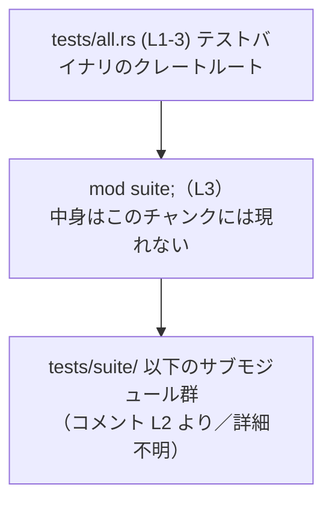

# apply-patch/tests/all.rs

## 0. ざっくり一言

- 統合テスト用バイナリの「ルートファイル」として、`suite` サブモジュールにあるテスト群を 1 つのテストバイナリに集約するための非常に薄いエントリーポイントになっています（apply-patch/tests/all.rs:L1-3）。

---

## 1. このモジュールの役割

### 1.1 概要

- コメントから、このファイルは「単一の統合テストバイナリ（Single integration test binary）」であり、すべてのテストモジュールを集約する役割を持つことがわかります（`Single integration test binary that aggregates all test modules.`、apply-patch/tests/all.rs:L1）。
- また、集約されるサブモジュールは `tests/suite/` 以下に配置されていることが明示されています（`The submodules live in \`tests/suite/\`.`、L2）。
- 実際のテストロジックは `suite` モジュール側にあり、このファイルは `mod suite;` によりそれを参照するだけの構造になっています（L3）。

### 1.2 アーキテクチャ内での位置づけ

Cargo の統合テストでは、`tests/` 直下の各 `.rs` ファイルが、それぞれ独立したテストバイナリ（クレート）としてコンパイルされます。このファイルはその 1 つであり、テストバイナリのルートとして `suite` モジュールを取り込んでいます（L3）。



- `tests/all.rs` はクレートルートとして `mod suite;` を宣言します（L3）。
- `suite` の実体（`tests/suite/...` のどのファイルか、どんなテストがあるか）は、このチャンクには現れていません（L1-3 からは不明）。

### 1.3 設計上のポイント

- **責務の分離**  
  - このファイルは「テストバイナリの入口」と「`suite` の読み込み」だけを担当し、実際のテストは `suite` 側に委譲する構造になっています（L1-3）。
- **依存関係の単純さ**  
  - 依存先は `suite` モジュール 1 つだけであり、統合テストの構造をシンプルに保っています（L3）。
- **状態／エラー処理／並行性**  
  - このファイル内には構造体・関数・状態管理・エラー処理・並行処理はいずれも現れません（L1-3）。
  - 並行実行やエラー処理は、Rust のテストハーネスや `suite` 側のコードに委ねられていると考えられますが、`suite` の中身はこのチャンクには現れないため詳細は不明です。

---

## 2. 主要な機能一覧

このファイル単体で提供している機能は 1 点に集約されます。

- `suite` テストモジュールの集約:  
  `mod suite;` により、`tests/suite/` 以下にあるテストモジュール群を 1 つの統合テストバイナリに取り込む（apply-patch/tests/all.rs:L2-3）。

---

## 3. 公開 API と詳細解説

### 3.1 コンポーネント一覧

このチャンクに現れるコンポーネント（モジュール・関数・型）を一覧にします。

| 名前      | 種別     | 役割 / 用途                                                                                     | 定義位置                                |
|-----------|----------|--------------------------------------------------------------------------------------------------|-----------------------------------------|
| `suite`   | モジュール | 統合テストを束ねるサブモジュールとして宣言されています。中身（テスト関数やサブモジュール構成）はこのチャンクには現れません。 | `apply-patch/tests/all.rs:L3-3`         |

- このファイルには、構造体・列挙体・関数・定数などの定義は存在しません（L1-3）。

### 3.2 関数詳細（最大 7 件）

- `apply-patch/tests/all.rs` には関数・メソッド・`#[test]` 関数の定義は 1 つも存在しません（L1-3）。
- Rust の統合テストではテストハーネスが `main` 関数を自動生成するため、このファイルで `fn main()` を定義していないのは通常の構成です。

### 3.3 その他の関数

- このチャンクには補助関数・ラッパー関数も存在しません（L1-3）。

---

## 4. データフロー

このファイルはデータを直接扱いませんが、「テスト実行」という観点での制御フローを概念的に整理します。

1. 開発者が `cargo test` を実行する（一般的な Rust/Cargo の挙動）。
2. Cargo は `tests/all.rs` を含むテストクレートをビルドし、テストハーネス付きのバイナリを生成する。
3. 生成されたテストバイナリのクレートルートがこのファイルであり、コンパイル時に `mod suite;` によって `suite` モジュールが組み込まれる（L3）。
4. 実際のテスト関数（`#[test]`）などは `suite` モジュール側に存在する想定ですが、その中身はこのチャンクには現れません。

> 3〜4 のうち「`suite` 内にどのようなテストが存在するか」「どのデータを扱うか」は、このチャンクからは不明です。

```mermaid
sequenceDiagram
    participant C as cargo test / テストハーネス
    participant A as all.rs (L1-3)
    participant S as suite モジュール（詳細不明）
    %% T の中身はこのチャンク外のため抽象化
    participant T as suite 内のテスト群（不明）

    C->>A: テストバイナリを起動<br/>(一般的な挙動)
    Note right of A: A はクレートルートとして<br/>mod suite; を含む（L3）
    A->>S: コンパイル時に suite をリンク（L3）
    S->>T: テスト関数の列挙・実行（一般的想定／詳細はこのチャンクには現れない）
```

---

## 5. 使い方（How to Use）

### 5.1 基本的な使用方法

このファイルは、Rust/Cargo の通常の統合テストフローの一部として利用されます。

1. プロジェクトルートで `cargo test` を実行する。
2. Cargo が `tests/all.rs` をテストクレートとしてビルドし、テストバイナリを実行する。
3. `mod suite;` を通じて、`tests/suite/` 以下のテストモジュールがこのバイナリに含まれる（L2-3）。

コメントが示す構成（L2）を前提にした、簡易的な例を示します。これは実際のリポジトリ構成ではなく、構造を理解するための例です。

```text
project-root/
├─ src/
│   └─ lib.rs           // ライブラリ本体（例）
└─ tests/
    ├─ all.rs           // ← 今解説しているファイル
    └─ suite/
        ├─ mod.rs       // suite モジュールのルート（例）
        └─ example.rs   // 実際のテスト（例）
```

`tests/all.rs`（実ファイル）:

```rust
// Single integration test binary that aggregates all test modules.      // 単一の統合テストバイナリで全テストを集約する（L1）
// The submodules live in `tests/suite/`.                                // サブモジュールは tests/suite/ 内に置く（L2）
mod suite;                                                               // suite モジュールをこのテストクレートに取り込む（L3）
```

`tests/suite/mod.rs`（構造説明のための例）:

```rust
// tests/suite 配下のサブモジュールを re-export する例                    // 実際のリポジトリにこのファイルが存在するかは、このチャンクからは分からない
mod example;                                                              // example.rs をサブモジュールとして宣言

// 必要であれば、pub use example::*; のようにエクスポートすることもできる
```

`tests/suite/example.rs`（例としてのテスト）:

```rust
// 実際のプロジェクトにこのテストがあるとは限りません。                   // 構造を説明するためのサンプルコードです。
#[test]                                                                  // テスト関数であることを示す属性
fn it_works() {                                                          // テスト関数の定義
    assert_eq!(2 + 2, 4);                                                // 簡単なアサーション
}
```

### 5.2 よくある使用パターン

- **パターン: テストの追加・変更は `suite` 側で行う**  
  - コメントにより、サブモジュールは `tests/suite/` に置く前提になっているため（L2）、新しい統合テストを追加する場合は `tests/suite/` 以下にファイルを追加し、`suite` モジュールから参照するのが自然な使い方と考えられます。
  - `all.rs` 自体はほとんど変更せず、テストの増減に応じて `suite` の構成を変える、という運用が想定されます（L1-3）。

### 5.3 よくある間違い（起こりうる例）

コードから直接は読み取れませんが、コメントが示す構成（L2）に照らして、起こりうる誤用例を挙げます。

```rust
// （誤用の例: 構造説明のための仮想例です）

// tests/all.rs で tests/suite/ ではない場所のモジュールを指定してしまう
mod other_suite;   // コメント L2 の前提から外れる構成
```

- コメントは「サブモジュールは `tests/suite/` に置く」と書いているため（L2）、このような宣言はプロジェクトの方針と齟齬を生む可能性があります。
- 実際に許容されるかどうかは、プロジェクト全体のルール次第であり、このチャンクだけからは断定できません。

### 5.4 使用上の注意点（まとめ）

- **前提ディレクトリ構成**  
  - コメントにより、サブモジュールが `tests/suite/` にある前提が共有されているため（L2）、テストファイルを別の場所に置くとチームメンバーとの認識がずれやすくなります。
- **エラー・安全性**  
  - このファイル単体では I/O やスレッド、パニックを伴う処理は行っていません（L1-3）。  
    したがって、Rust 特有の所有権・並行性に関する安全性やエラーハンドリングは、このファイルの外側（`suite` あるいはテスト対象コード）で検討する必要があります。
- **Bugs/Security**  
  - このファイルはモジュール宣言のみであり、外部入力を扱わないため、ここから直接読み取れるバグやセキュリティリスクは特にありません（L1-3）。

---

## 6. 変更の仕方（How to Modify）

### 6.1 新しい機能（テスト）を追加する場合

- コメントから、実際のテストモジュールは `tests/suite/` 以下に配置されると考えられます（L2）。
- このため、新しいテストを追加する際の典型的な手順は次のようになります（あくまで構造例であり、このチャンクの外のコードに依存します）。

1. `tests/suite/` 以下に新しいテストファイル（例: `new_case.rs`）を作成する。
2. `tests/suite/mod.rs`（存在する場合）で `mod new_case;` を追加してサブモジュールとして登録する。
3. 必要であれば `pub use new_case::*;` のようにエクスポートする。
4. `cargo test` を実行し、`tests/all.rs` のテストバイナリ経由で新しいテストが実行されることを確認する。

> 上記 2–3 のファイル (`tests/suite/mod.rs` など) は、このチャンクには現れていないため実在するかどうかは不明であり、一般的な Rust プロジェクトのパターンを例として示しています。

### 6.2 既存の機能を変更する場合

- **`all.rs` を変更するケース**  
  - このファイルのコードは 1 行のコメントと 1 行のモジュール宣言のみであり（L1-3）、変更の余地はほとんどありません。
  - `mod suite;` の名前を変更する場合、対応するモジュール側（`tests/suite/` 以下のファイル名や `mod` 宣言）を合わせて変更する必要があります。
- **影響範囲の確認**  
  - `mod suite;` の名前や場所を変えると、`suite` 側にあるすべてのテストのビルド・実行に影響します。
  - 変更後は `cargo test` を実行し、テストが期待通り検出・実行されているかを確認することが重要です。
- **契約（前提条件）の維持**  
  - コメントで明示された「サブモジュールは `tests/suite/` に置く」という前提（L2）を変更する場合、コメントも合わせて更新しないと、開発者間での理解がずれる可能性があります。

---

## 7. 関連ファイル

このチャンクから参照が分かる関連ファイル・ディレクトリは次の通りです。

| パス                     | 役割 / 関係                                                                                 | 根拠 |
|--------------------------|----------------------------------------------------------------------------------------------|------|
| `tests/suite/`           | `suite` サブモジュールの実体が置かれているディレクトリとコメントされています。             | `apply-patch/tests/all.rs:L2-3` |
| `tests/suite/...`        | 実際のテストモジュール群（ファイル名や内容は、このチャンクには現れません）。               | コメント `The submodules live in \`tests/suite/\`.`（L2） |

- `tests/suite/` 配下にどのようなファイル・モジュール・テスト関数があるかは、このチャンクには現れないため不明です。

---

### まとめ（Contracts / Edge Cases / Performance などの観点）

- **Contracts（契約・前提条件）**  
  - サブモジュールは `tests/suite/` に配置される前提がコメントで宣言されています（L2）。
  - `mod suite;` がコンパイル可能であること（対応するモジュールファイルが存在すること）が暗黙の契約です（L3）。
- **Edge Cases（エッジケース）**  
  - このファイル単体では関数引数やデータ入力が存在しないため、典型的な意味でのエッジケース（空入力・境界値など）はありません（L1-3）。
- **Performance / Scalability**  
  - コード量が極小でロジックも持たないため、このファイル自体に起因する性能・スケーラビリティ上の懸念はありません（L1-3）。
- **Observability（可観測性）**  
  - ログ出力やメトリクス取得などは行っておらず（L1-3）、テストの可観測性は `suite` 側やテスト対象コードに依存します。

このファイルは、統合テストの構造を整えるための「入り口」として位置付けられており、実際の振る舞いの大部分は `suite` モジュール側に委ねられている、という点が理解の要点になります。
