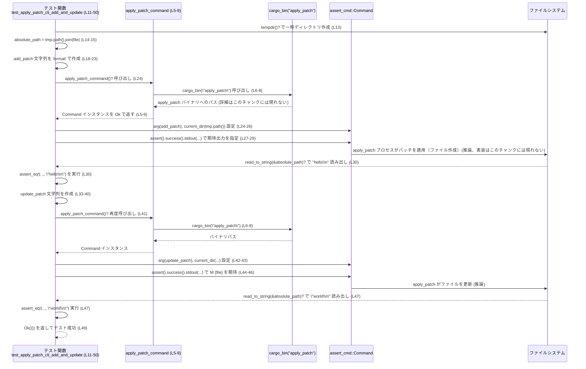

# apply-patch/tests/suite/cli.rs コード解説

## 0. ざっくり一言

`apply_patch` コマンドラインツールの「ファイル追加」と「ファイル更新」の正常系を、引数経由と標準入力経由の 2 パターンで検証するテストモジュールです（cli.rs:L5-9, L11-50, L52-91）。

---

## 1. このモジュールの役割

### 1.1 概要

- このモジュールは、`apply_patch` バイナリがパッチ文字列を正しく解釈し、指定した作業ディレクトリ配下のファイルを追加・更新できるかを検証するために存在します（cli.rs:L11-50, L52-91）。
- 具体的には、
  - パッチを**コマンドライン引数**として渡した場合（cli.rs:L17-30, L32-47）
  - パッチを**標準入力**として渡した場合（cli.rs:L58-71, L73-88）
  の双方で、出力メッセージと結果ファイルの内容が期待通りであることを確認します。

### 1.2 アーキテクチャ内での位置づけ

このテストファイルは、外部 CLI バイナリ `apply_patch` に対して「ブラックボックステスト」を行う位置づけです。

- `apply_patch_command` ヘルパー関数が、`codex_utils_cargo_bin::cargo_bin("apply_patch")` を介して CLI バイナリの `Command` を構築します（cli.rs:L5-9）。
- 各テストは `apply_patch_command` を用いてプロセスを起動し、`assert_cmd::Command` の API で終了ステータス・標準出力を検証します（cli.rs:L24-29, L41-46, L65-70, L82-87）。
- ファイルシステムとのやり取りは `tempfile::tempdir` で作成した一時ディレクトリと、`std::fs::read_to_string` に限定されています（cli.rs:L13-15, L30, L47, L54-56, L71, L88）。

以下の図は、本ファイル内の関数と主要外部コンポーネントの関係を示します（cli.rs:L1-91）。

```mermaid
graph TD
  subgraph "tests/suite/cli.rs (L1-91)"
    H["apply_patch_command (L5-9)"]
    T1["test_apply_patch_cli_add_and_update (L11-50)"]
    T2["test_apply_patch_cli_stdin_add_and_update (L52-91)"]
  end

  T1 --> H
  T2 --> H

  H --> CARGO["codex_utils_cargo_bin::cargo_bin(\"apply_patch\")"]
  T1 --> CMD["assert_cmd::Command"]
  T2 --> CMD
  T1 --> FS["tempfile::tempdir / std::fs::read_to_string"]
  T2 --> FS
```

### 1.3 設計上のポイント

- **コマンド生成の共通化**  
  - `apply_patch_command` によって `apply_patch` バイナリの `Command` 生成を一箇所に集約しています（cli.rs:L5-9）。  
    これにより、バイナリ名や解決方法が変わった際の修正箇所が一箇所に限定されます。
- **テスト環境の分離**  
  - 各テストは `tempdir()` で一時ディレクトリを作成し、その配下にテスト用ファイルを作成・更新します（cli.rs:L13-15, L54-56）。  
    テスト同士でファイルパスが衝突しないようにしている構造と解釈できます。
- **標準出力とファイル内容の両方を検証**  
  - CLI の結果メッセージ（stdout）と、実際に書き出されたファイル内容の双方を `assert_cmd` と `assert_eq!` で確認しています（cli.rs:L24-30, L41-47, L65-71, L82-88）。
- **エラー処理の方針**  
  - 各テスト関数は `anyhow::Result<()>` を返し、`?` 演算子で I/O やコマンド生成のエラーをそのままテスト失敗として扱う方針になっています（cli.rs:L5, L12, L53）。
- **並行性**  
  - 本ファイル内にはスレッドや async/await などの並行処理は登場せず、各テストは同期的に CLI を 2 回起動する構造です（cli.rs:L11-50, L52-91）。

---

## 2. 主要な機能一覧（コンポーネントインベントリー）

### 2.1 ローカル関数一覧

| 名前 | 種別 | 役割 / 用途 | 定義位置 |
|------|------|-------------|----------|
| `apply_patch_command` | ヘルパー関数 | `apply_patch` バイナリを起動するための `assert_cmd::Command` を生成する | cli.rs:L5-9 |
| `test_apply_patch_cli_add_and_update` | テスト関数 | パッチを引数で渡したときのファイル追加・更新と成功メッセージを検証する | cli.rs:L11-50 |
| `test_apply_patch_cli_stdin_add_and_update` | テスト関数 | パッチを標準入力で渡したときのファイル追加・更新と成功メッセージを検証する | cli.rs:L52-91 |

### 2.2 外部コンポーネント参照一覧

| 名前 | 種別 | 用途 | 使用箇所（根拠） |
|------|------|------|------------------|
| `assert_cmd::Command` | 外部クレートの型 | CLI プロセス起動とアサーション（`.arg`, `.current_dir`, `.write_stdin`, `.assert`, `.success`, `.stdout`）に使用 | インポート: cli.rs:L1、利用: cli.rs:L24-29, L41-46, L65-70, L82-87 |
| `std::fs::read_to_string` (`fs` 経由) | 標準ライブラリ I/O 関数 | 出力されたファイルの内容検証に使用 | インポート: cli.rs:L2、利用: cli.rs:L30, L47, L71, L88 |
| `tempfile::tempdir` | 外部クレートの関数 | 一時ディレクトリの作成に使用 | インポート: cli.rs:L3、利用: cli.rs:L13, L54 |
| `codex_utils_cargo_bin::cargo_bin` | 外部クレートの関数 | `apply_patch` 実行ファイルのパス解決に使用 | 呼び出し: cli.rs:L6-8（インポートはこのチャンクには現れません） |

---

## 3. 公開 API と詳細解説

このファイルはテストモジュールであり、ライブラリとして外部に公開される API はありませんが、ここでは**テスト内で利用される関数**を対象に詳細を整理します。

### 3.1 型一覧（構造体・列挙体など）

本ファイル内で新たに定義されている構造体・列挙体・型エイリアスはありません。

- `struct` / `enum` / `type` といった定義キーワードが、このチャンクには存在しないことを根拠としています（cli.rs:L1-91）。

### 3.2 関数詳細

#### `apply_patch_command() -> anyhow::Result<Command>`

（定義: cli.rs:L5-9）

**概要**

- `apply_patch` バイナリを実行するための `assert_cmd::Command` インスタンスを生成し、`anyhow::Result` で返すヘルパー関数です。
- テストごとに実行コマンド生成処理を書かなくて済むように共通化されています（cli.rs:L24, L41, L65, L82）。

**引数**

| 引数名 | 型 | 説明 |
|--------|----|------|
| なし   | -  | 引数は取りません。常に `apply_patch` バイナリを対象としたコマンドを返します。 |

**戻り値**

- `anyhow::Result<Command>`  
  - `Ok(Command)` の場合: `Command::new` で構築された `assert_cmd::Command` インスタンス。`apply_patch` バイナリを起動する準備ができています（cli.rs:L5-8）。
  - `Err(e)` の場合: `codex_utils_cargo_bin::cargo_bin("apply_patch")` 内部で発生したエラーが `?` により伝播したものと考えられます（cli.rs:L6-8）。具体的なエラー内容はこのチャンクには現れません。

**内部処理の流れ**

1. `codex_utils_cargo_bin::cargo_bin("apply_patch")` を呼び出し、`apply_patch` バイナリのパスを取得します（cli.rs:L6-8）。
2. 取得したパスを引数に `Command::new(...)` を呼び出し、`assert_cmd::Command` を構築します（cli.rs:L6-8）。
3. 構築した `Command` を `Ok(...)` でラップして返します（cli.rs:L5-8）。

**Examples（使用例）**

この関数はテスト内で次のように使用されています（cli.rs:L24-29 を簡略化）。

```rust
// apply_patch_command から Command を取得する
let mut cmd = apply_patch_command()?;                      // cli.rs:L24

// パッチ文字列を引数として渡し、実行ディレクトリを設定する
cmd.arg(add_patch)                                        // cli.rs:L25
   .current_dir(tmp.path())                               // cli.rs:L26
   .assert()                                              // cli.rs:L27
   .success()                                             // cli.rs:L28
   .stdout(format!("Success. Updated the following files:\nA {file}\n")); // cli.rs:L29
```

このコードにより、`apply_patch` バイナリが一時ディレクトリを作業ディレクトリとして実行され、期待どおりの標準出力を生成するかが検証されます。

**Errors / Panics**

- `Err` になる可能性:
  - `codex_utils_cargo_bin::cargo_bin("apply_patch")` がエラーを返した場合、`?` によってそのまま `Err` が返ります（cli.rs:L6-8）。
  - 具体的なエラー条件（バイナリが存在しない等）はこのチャンクには記載がありません。
- panic の可能性:
  - 関数内で明示的な panic 呼び出しはありません（cli.rs:L5-9）。
  - `Command::new` 自体が panic するかどうかは、このチャンクからは分かりません。

**Edge cases（エッジケース）**

- `apply_patch` バイナリがビルドされていない・見つからない場合:
  - `cargo_bin` がエラーを返す可能性があり、その場合 `apply_patch_command` から `Err` が返ります（cli.rs:L6-8）。
- 引数がないことに関連するエッジケース:
  - 任意のバイナリ名を指定する柔軟性はなく、常に `"apply_patch"` 固定となります（cli.rs:L6-7）。

**使用上の注意点**

- `Result` を返すため、呼び出し側（テスト関数）は `?` でエラーを伝播させるか、`expect` / `unwrap` で明示的に扱う必要があります（cli.rs:L12, L53）。
- 得られる `Command` は同期的な CLI 起動用であり、非同期コンテキスト（async 関数内で `.await` する等）とは無関係です。このファイルには async/await は登場しません（cli.rs:L1-91）。

---

#### `test_apply_patch_cli_add_and_update() -> anyhow::Result<()>`

（定義: cli.rs:L11-50）

**概要**

- パッチ文字列を**コマンドライン引数**として `apply_patch` に渡した場合に、
  1. 存在しないファイルが追加されること
  2. そのファイルが別の内容に更新されること
  を検証するテストです（cli.rs:L17-47）。

**引数**

| 引数名 | 型 | 説明 |
|--------|----|------|
| なし   | -  | テスト関数として、引数は取りません。 |

**戻り値**

- `anyhow::Result<()>`  
  - `Ok(())` の場合: すべてのコマンド実行・ファイル I/O・アサーションが成功したことを意味し、テスト成功となります（cli.rs:L49）。
  - `Err(e)` の場合: `tempdir()` や `apply_patch_command()`、`fs::read_to_string` などで発生したエラーが `?` により伝播したものと考えられ、テストは失敗します（cli.rs:L13, L24, L30, L41, L47）。

**内部処理の流れ（アルゴリズム）**

1. 一時ディレクトリとファイルパスの準備  
   - `tempdir()?` で一時ディレクトリを作成し（cli.rs:L13）、`file = "cli_test.txt"` とファイル名を決めます（cli.rs:L14）。  
   - `absolute_path = tmp.path().join(file)` で、作業ディレクトリ配下の対象ファイルパスを生成します（cli.rs:L15）。

2. 「ファイル追加」パッチの作成と実行  
   - `format!` と生文字列リテラルを用いて、`*** Add File: {file}` 形式のパッチ文字列 `add_patch` を組み立てます（cli.rs:L18-23）。
   - `apply_patch_command()?` で `Command` を取得し（cli.rs:L24）、`.arg(add_patch)` でパッチ文字列を引数に指定し、`.current_dir(tmp.path())` で作業ディレクトリを一時ディレクトリに設定します（cli.rs:L24-26）。
   - `.assert().success().stdout(...)` で、コマンドが成功し、標準出力が `"Success. Updated the following files:\nA {file}\n"` と等しいことを検証します（cli.rs:L27-29）。

3. 追加されたファイル内容の検証  
   - `fs::read_to_string(&absolute_path)?` でファイル内容を読み取り（cli.rs:L30）、`assert_eq!(..., "hello\n")` により `"hello\n"` であることを検証します（cli.rs:L30）。

4. 「ファイル更新」パッチの作成と実行  
   - 同様に `format!` を用いて、`*** Update File: {file}` および差分ブロックを含むパッチ文字列 `update_patch` を組み立てます（cli.rs:L33-40）。
   - 再度 `apply_patch_command()?` を呼び出し（cli.rs:L41）、`.arg(update_patch)`, `.current_dir(tmp.path())` を設定し（cli.rs:L42-43）、`.assert().success().stdout(...)` で `"M {file}\n"` が出力されることを検証します（cli.rs:L44-46）。

5. 更新後のファイル内容の検証  
   - `fs::read_to_string(&absolute_path)?` で再度読み取り（cli.rs:L47）、`assert_eq!(..., "world\n")` により `"world\n"` に更新されたことを確認します（cli.rs:L47）。

6. 正常終了  
   - 最後に `Ok(())` を返し、テスト成功を表します（cli.rs:L49）。

**Examples（使用例）**

この関数自体はテストランナー（`cargo test` 等）から自動的に呼び出されます。  
同様のテストを追加する場合のパターン例は以下のようになります（本ファイルの構造に基づくサンプル）。

```rust
#[test]                                                      // テストとしてマークする
fn test_apply_patch_cli_custom_case() -> anyhow::Result<()> { // anyhown::Result で?を使いやすくする
    let tmp = tempdir()?;                                   // 一時ディレクトリを作成
    let file = "custom_case.txt";                           // テスト用のファイル名
    let absolute_path = tmp.path().join(file);              // 作業ディレクトリ配下のパス

    let patch = format!(                                   // パッチ文字列を組み立てる
        r#"*** Begin Patch
*** Add File: {file}
+contents
*** End Patch"#,
    );

    apply_patch_command()?                                 // apply_patch の Command を取得
        .arg(patch)                                        // パッチを引数で渡す
        .current_dir(tmp.path())                           // 作業ディレクトリを一時ディレクトリに
        .assert()                                          // 実行とアサートを開始
        .success();                                        // 成功終了を確認

    assert_eq!(fs::read_to_string(&absolute_path)?, "contents\n"); // ファイル内容を確認

    Ok(())                                                 // テスト成功
}
```

**Errors / Panics**

- `Err` によるテスト失敗:
  - `tempdir()?` が失敗した場合（cli.rs:L13）。
  - `apply_patch_command()?` が `Err` を返した場合（cli.rs:L24, L41）。
  - `fs::read_to_string(&absolute_path)?` が失敗した場合（ファイルが存在しない・アクセス不可など）（cli.rs:L30, L47）。
- panic によるテスト失敗:
  - `assert()` / `.success()` / `.stdout(...)` が期待に反する結果を検出した場合、`assert_cmd` 内部で panic が発生する可能性があります（cli.rs:L27-29, L44-46）。
  - `assert_eq!` 自体も、期待値と実際の値が異なると panic します（cli.rs:L30, L47）。

**Edge cases（エッジケース）**

- `apply_patch` の標準出力がメッセージは同じでも改行や空白が異なる場合:
  - `.stdout(format!(...))` は文字列一致を前提としているため、余分な改行や空白、前後にログが追加された場合などにテストが失敗します（cli.rs:L29, L46）。
- ファイル末尾の改行:
  - 期待値は `"hello\n"` / `"world\n"` と末尾の改行を含んでいます（cli.rs:L30, L47）。  
    CLI が末尾の改行を付けない・複数付ける場合、テストは失敗します。
- `apply_patch` 側の挙動によるエッジケース:
  - パッチに示されたファイルがすでに存在する／存在しないといった条件を、CLI がどう扱うかはこのテストでは正常系（想定どおり追加 → 更新できるケース）のみ確認しています。  
    それ以外のケースはこのチャンクには現れません。

**使用上の注意点**

- 一時ディレクトリを `current_dir` に設定しているため（cli.rs:L26, L43）、`apply_patch` 側の実装が「カレントディレクトリからの相対パス」を前提にしていることが暗黙の前提条件になっています。
- テストは CLI の標準エラー出力（stderr）には触れていません。このファイルからは、stderr に何が出力されるか・されないかは分かりません。
- 並行実行について:
  - テスト名やファイル名は重複しないようにしてあります（`cli_test.txt` はこのテストのみで使用、cli.rs:L14）。  
    一時ディレクトリごとにファイルを作成しているため、他テストとのファイルパス衝突リスクを抑えた構造になっています。

---

#### `test_apply_patch_cli_stdin_add_and_update() -> anyhow::Result<()>`

（定義: cli.rs:L52-91）

**概要**

- パッチ文字列を**標準入力（stdin）**から `apply_patch` に渡した場合に、
  - ファイルが追加されること
  - 内容が更新されること
  を検証するテストです（cli.rs:L58-71, L73-88）。
- 引数経由のテストとの差分は、「パッチの渡し方」を `.write_stdin` に変更している点のみです（cli.rs:L66-67, L83-84）。

**引数**

| 引数名 | 型 | 説明 |
|--------|----|------|
| なし   | -  | テスト関数として、引数は取りません。 |

**戻り値**

- `anyhow::Result<()>`  
  - `Ok(())`: すべての I/O とアサーションが成功し、テスト成功（cli.rs:L90）。
  - `Err(e)`: `tempdir()`、`apply_patch_command()`、`fs::read_to_string` などで発生したエラーが `?` により伝播した状態で、テスト失敗となります（cli.rs:L54, L65, L71, L82, L88）。

**内部処理の流れ（アルゴリズム）**

構造は前述のテストとほぼ同じで、異なるのはパッチの渡し方とファイル名です。

1. 一時ディレクトリとファイルパスの準備  
   - `tempdir()?` で一時ディレクトリを作成（cli.rs:L54）。
   - `file = "cli_test_stdin.txt"` と別のファイル名を使用（cli.rs:L55）。
   - `absolute_path = tmp.path().join(file)` で対象ファイルパスを生成（cli.rs:L56）。

2. 「ファイル追加」パッチの作成と stdin 経由での実行  
   - `add_patch` パッチ文字列を組み立て（cli.rs:L59-64）、`apply_patch_command()?` でコマンドを取得（cli.rs:L65）。
   - `.current_dir(tmp.path())` を設定し（cli.rs:L66）、`.write_stdin(add_patch)` でパッチを標準入力に書き込みます（cli.rs:L67）。
   - `.assert().success().stdout(...)` で CLI の成功とメッセージを検証します（cli.rs:L68-70）。

3. ファイル内容の検証  
   - `fs::read_to_string(&absolute_path)?` で内容を読み取り（cli.rs:L71）、`assert_eq!(..., "hello\n")` で `"hello\n"` であることを検証します（cli.rs:L71）。

4. 「ファイル更新」パッチの作成と stdin 経由での実行  
   - `update_patch` を組み立て（cli.rs:L74-81）、再び `apply_patch_command()?` を取得（cli.rs:L82）。
   - `.current_dir(tmp.path())` を設定（cli.rs:L83）、`.write_stdin(update_patch)` で標準入力に書き込みます（cli.rs:L84）。
   - `.assert().success().stdout(...)` により `"M {file}\n"` のメッセージを検証します（cli.rs:L85-87）。

5. 更新後のファイル内容の検証  
   - `fs::read_to_string(&absolute_path)?` を再度呼び出し（cli.rs:L88）、`assert_eq!(..., "world\n")` により `"world\n"` であることを確認します（cli.rs:L88）。

6. 正常終了  
   - `Ok(())` を返してテスト成功を示します（cli.rs:L90）。

**Examples（使用例）**

標準入力経由で CLI をテストするパターンの参考例です（cli.rs:L65-71, L82-88 を抽象化）。

```rust
let tmp = tempdir()?;                                      // 一時ディレクトリを用意
let patch = r#"*** Begin Patch
*** Add File: example.txt
+hello
*** End Patch"#;                                           // stdin に流すパッチ

apply_patch_command()?                                     // apply_patch コマンドを取得
    .current_dir(tmp.path())                               // 作業ディレクトリを設定
    .write_stdin(patch)                                    // パッチを標準入力に書き込む
    .assert()                                              // 実行 + アサート
    .success();                                            // 成功終了を確認
```

**Errors / Panics**

- `Err` によるテスト失敗:
  - `tempdir()?`、`apply_patch_command()?`、`fs::read_to_string(...)?` が返す I/O 系エラー（cli.rs:L54-56, L65, L71, L82, L88）。
- panic によるテスト失敗:
  - `.success()` や `.stdout(...)` のアサーションが失敗した場合（cli.rs:L68-70, L85-87）。
  - `assert_eq!` が期待値と一致しないファイル内容を検出した場合（cli.rs:L71, L88）。

**Edge cases（エッジケース）**

- CLI が標準入力を想定していない場合:
  - このテストは、標準入力からパッチ文字列を受け取れるという前提で書かれています（cli.rs:L67, L84）。  
    `apply_patch` 実装が stdin を無視する、あるいは別のプロトコルを期待している場合、テストは失敗します。
- 入力サイズや改行コード:
  - このテストでは比較的小さな UTF-8 テキストと LF 改行のみを扱っています（cli.rs:L59-63, L74-80）。  
    大きなパッチや異なる改行コード（CRLF 等）に対する挙動は、このチャンクには現れません。

**使用上の注意点**

- 標準入力経由のテストは、パッチ文字列を一括して `.write_stdin` に渡す形になっており、インタラクティブな入出力（複数回の読み書きなど）は想定していません（cli.rs:L67, L84）。
- コマンドライン引数と stdin 経路は別々のテスト関数で検証しているため（cli.rs:L11-50, L52-91）、両方の経路を変更する場合は両テストの更新が必要になります。

---

### 3.3 その他の関数

- 本ファイルには、上記 3 つ以外のローカル関数は存在しません（cli.rs:L1-91 を通読し、`fn` が 3 箇所のみであることを確認）。

---

## 4. データフロー

ここでは、`test_apply_patch_cli_add_and_update` における典型的なデータの流れを示します（cli.rs:L11-47）。

### 4.1 処理の要点

- テスト関数が一時ディレクトリとファイルパスを準備し、パッチ文字列を構築します。
- `apply_patch_command` が CLI プロセスを起動するための `Command` を返します。
- `assert_cmd` がコマンド実行・終了ステータス・標準出力の検証を行います。
- ファイルシステムから結果ファイルを読み出し、内容を検証します。

### 4.2 シーケンス図（引数経由のケース）



標準入力経由のテスト（cli.rs:L52-91）では、`arg(add_patch)` が `.write_stdin(add_patch)` に置き換わる点を除き、同様のデータフローになっています（cli.rs:L65-67, L82-84）。

---

## 5. 使い方（How to Use）

このモジュールはテストコードですが、CLI テストのパターンとして実務で再利用しやすい構造になっています。

### 5.1 基本的な使用方法（パターン）

**目的**: 新しい CLI 動作をテストしたい場合、このファイルと同様のステップでテストを書くことができます。

1. 一時ディレクトリを作成し、作業ディレクトリを決める（cli.rs:L13-15, L54-56）。
2. パッチや入力データを文字列として組み立てる（cli.rs:L18-23, L33-40, L59-64, L74-81）。
3. `apply_patch_command` で `Command` を作り、引数または stdin でデータを渡す（cli.rs:L24-27, L41-45, L65-69, L82-86）。
4. `assert_cmd` で終了ステータスと stdout を検証する（cli.rs:L27-29, L44-46, L68-70, L85-87）。
5. 必要に応じて、ファイルシステムの状態を `fs::read_to_string` などで検証する（cli.rs:L30, L47, L71, L88）。

### 5.2 よくある使用パターン

- **引数経由 vs 標準入力経由の比較検証**  
  - 同じパッチ内容を、引数経由・標準入力経由の両方で渡し、それぞれに対して同様のファイル更新結果とメッセージを期待するパターン（cli.rs:L17-47, L58-88）。
- **段階的な状態変化の検証**  
  - 同じテスト関数内で、ファイルの「追加」と「更新」を連続して行うことで、状態遷移（存在しない → `"hello\n"` → `"world\n"`）を確認しています（cli.rs:L17-30, L32-47, L58-71, L73-88）。

### 5.3 よくある間違いとこのファイルでの回避方法

このファイルには直接は現れませんが、類似の CLI テストで起こりがちな誤りと、本コードがどう回避しているかを整理します。

```rust
// 誤り例: 作業ディレクトリを設定していないため、意図しない場所にファイルが作られうる
apply_patch_command()?
    .arg(add_patch)
    // .current_dir(tmp.path()) を呼び忘れている
    .assert()
    .success();

// 正しい例: 一時ディレクトリを作業ディレクトリとして明示する（cli.rs:L26, L43, L66, L83）
apply_patch_command()?
    .arg(add_patch)
    .current_dir(tmp.path())
    .assert()
    .success();
```

- 本ファイルでは必ず `.current_dir(tmp.path())` を呼び出しているため、テストは常に一時ディレクトリ配下のみを汚します（cli.rs:L26, L43, L66, L83）。

### 5.4 使用上の注意点（まとめ）

- **安全性（ファイルシステム）**  
  - `current_dir(tmp.path())` により、`apply_patch` の相対パス操作は一時ディレクトリ配下に限定される前提になっています（cli.rs:L26, L43, L66, L83）。  
    ただし、CLI 側がパッチ記述から絶対パスを解釈する場合、その挙動はこのテストだけでは制限されません。
- **エラー処理とテスト失敗の関係**  
  - `anyhow::Result` + `?` を使っているため、I/O やコマンド生成のエラーは即座にテスト失敗となります（cli.rs:L12-13, L53-54）。  
    Rust の `Result` ベースのエラー処理により、エラーの種類を明示しつつ安全に早期リターンする構造です。
- **並行性**  
  - テストコード内にはスレッド・async/await は登場しません（cli.rs:L1-91）。  
    テスト実行ツール側がテストを並行実行した場合でも、一時ディレクトリごとにファイルを分離しているため、ファイル名の衝突は起きにくい設計になっています。
- **観測可能性（Observability）**  
  - このテストは標準出力（stdout）のみを検証しており、標準エラー出力（stderr）やログファイルには触れていません（cli.rs:L29, L46, L70, L87）。  
    CLI がログレベルに応じて stderr に出力を行う場合でも、このテストでは検出されません。

---

## 6. 変更の仕方（How to Modify）

### 6.1 新しい機能を追加する場合（テストを増やす）

新しい CLI の振る舞いをテストしたい場合、以下のような手順が自然です。

1. **新規テスト関数を追加**  
   - 本ファイル `cli.rs` に `#[test]` 付きの関数を追加し、`anyhow::Result<()>` を戻り値とする形にします（cli.rs:L11-12, L52-53 を参考）。
2. **一時ディレクトリを準備**  
   - `let tmp = tempdir()?;` とし、作業ディレクトリを確保します（cli.rs:L13, L54）。
3. **入力データやパッチを構築**  
   - `format!` と生文字列リテラルを使うと、パッチ形式など複数行の入力を読みやすく記述できます（cli.rs:L18-23, L33-40, L59-64, L74-81）。
4. **`apply_patch_command` を利用して CLI を起動**  
   - 引数経由なら `.arg(...)`、標準入力経由なら `.write_stdin(...)` を利用しつつ、`.current_dir(tmp.path())` を忘れないようにします（cli.rs:L24-27, L41-45, L65-69, L82-86）。
5. **期待される出力・副作用をアサート**  
   - stdout のメッセージを `.stdout(...)` で検証し（cli.rs:L29, L46, L70, L87）、必要に応じて `fs::read_to_string` などでファイル内容をチェックします（cli.rs:L30, L47, L71, L88）。

### 6.2 既存の機能（テスト）を変更する場合の注意点

- **CLI メッセージ仕様の変更時**  
  - `Success. Updated the following files:\nA {file}\n` といった文字列はテストにハードコードされています（cli.rs:L29, L46, L70, L87）。  
    CLI 側のメッセージ文言やフォーマットを変更した場合、これらの期待値も同時に更新する必要があります。
- **返り値・前提条件の「契約」**  
  - テストは「`apply_patch` が成功した場合に標準出力へ特定の文字列を書き、ファイル内容が特定の状態になる」という契約に依存しています（cli.rs:L24-30, L41-47, L65-71, L82-88）。  
    CLI 側で成功時の出力先を変更したり、成功時でもメッセージを書かない設計に変えると、テストは意図どおり動かなくなります。
- **リファクタリングの影響範囲**  
  - `apply_patch_command` を修正する場合、両方のテスト（引数経由・stdin 経由）が影響を受けます（cli.rs:L24, L41, L65, L82）。  
  - テスト内で使用しているパスやファイル名（`cli_test.txt`, `cli_test_stdin.txt`）を変更すると、ログや一時ディレクトリの解析に依存している他のテストやツールがあれば影響を与える可能性がありますが、そのような利用箇所はこのチャンクには現れません。

---

## 7. 関連ファイル

このモジュールと密接に関係するが、このチャンクから部分的にしか分からないファイル・ディレクトリを整理します。

| パス / コンポーネント | 役割 / 関係 |
|------------------------|------------|
| `apply-patch/tests/suite/cli.rs` | 本ファイル。`apply_patch` CLI の正常系（ファイル追加・更新）を、引数経由と stdin 経由の 2 パスで検証するテストを提供します（cli.rs:L5-9, L11-50, L52-91）。 |
| `apply_patch` バイナリ（正確なソースパスは不明） | `codex_utils_cargo_bin::cargo_bin("apply_patch")` で実行ファイルのパスが解決される CLI 実装です（cli.rs:L6-8）。ソースコードや配置場所はこのチャンクには現れません。 |
| `codex_utils_cargo_bin` クレート（パス不明） | テストから `cargo_bin` 関数を提供し、ビルド済みバイナリ `apply_patch` のパスを取得する役割を持つと解釈できますが、実装や定義場所はこのチャンクには現れません（cli.rs:L6-8）。 |
| `assert_cmd` クレート | CLI 実行とアサーションのためのユーティリティクレートであり、本テストで広く利用されています（cli.rs:L1, L24-29, L41-46, L65-70, L82-87）。 |
| `tempfile` クレート | 一時ディレクトリ/ファイルの作成を行うクレートで、本テストでは作業ディレクトリ用に使用されています（cli.rs:L3, L13, L54）。 |
| `std::fs` モジュール | 出力ファイル内容の読み取りに使用される標準ライブラリのファイルシステム API です（cli.rs:L2, L30, L47, L71, L88）。 |

このチャンクでは、`apply_patch` CLI の内部実装や、パッチフォーマット全体の仕様は示されていません。テストコードから読み取れるのは、少なくとも `*** Add File:` / `*** Update File:` のようなヘッダと差分形式を理解する実装になっている、という点までです（cli.rs:L18-22, L33-38, L59-63, L74-80）。
