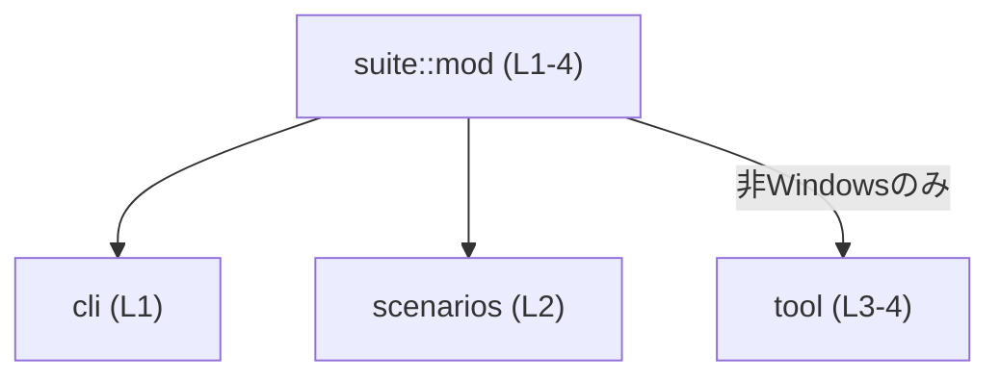

# apply-patch/tests/suite/mod.rs コード解説

## 0. ざっくり一言

- テスト用とみられるモジュール階層の「入口」として、`cli`・`scenarios`・`tool` の3つのサブモジュールを登録しているファイルです（`apply-patch/tests/suite/mod.rs:L1-4`）。

---

## 1. このモジュールの役割

### 1.1 概要

- このファイルは、同一ディレクトリ配下のサブモジュール `cli`・`scenarios`・`tool` をコンパイル対象として宣言する役割を持ちます（`mod cli;` / `mod scenarios;` / `mod tool;`）（`apply-patch/tests/suite/mod.rs:L1-4`）。
- `tool` モジュールは `#[cfg(not(target_os = "windows"))]` 属性付きで宣言されており、**Windows 以外の環境でのみ** 有効になる条件付きモジュールです（`apply-patch/tests/suite/mod.rs:L3-4`）。

### 1.2 アーキテクチャ内での位置づけ

このファイルを中心としたモジュール依存関係は、次のように表現できます。



- `suite::mod`（このファイル）がサブモジュール `cli`・`scenarios`・`tool` を包含します（`apply-patch/tests/suite/mod.rs:L1-4`）。
- `tool` への依存は `not(target_os = "windows")` 条件付きであり、Windows 環境では `tool` モジュール自体が存在しない扱いになります（`apply-patch/tests/suite/mod.rs:L3-4`）。

※ `cli`・`scenarios`・`tool` 各モジュール内部でどのような処理やテストが行われているかは、このチャンクには現れていません。

### 1.3 設計上のポイント

コードから読み取れる設計上の特徴は次のとおりです。

- **責務の分割**
  - 機能（またはテスト群）が `cli`、`scenarios`、`tool` という名前のモジュールに分割されています（`apply-patch/tests/suite/mod.rs:L1-4`）。
- **プラットフォーム依存の考慮**
  - `tool` モジュールは `#[cfg(not(target_os = "windows"))]` によって、Windows ではコンパイルされないよう条件付けされています（`apply-patch/tests/suite/mod.rs:L3-4`）。
- **状態・ロジック**
  - このファイル内には構造体・列挙体・関数・テスト本体などのロジックは定義されていません。モジュール宣言のみが存在します（`apply-patch/tests/suite/mod.rs:L1-4`）。
- **安全性・エラーハンドリング・並行性**
  - 所有権・エラーハンドリング・並行処理に関連するコードはこのファイルには登場せず、問題となるようなランタイムの安全性や並行性の論点はこのチャンクからは読み取れません。

---

## 2. 主要な機能一覧（コンポーネントインベントリー）

このファイルが直接提供する「機能」はサブモジュールの登録のみです。内部ロジックはサブモジュール側に存在し、このチャンクには現れていません。

### 2.1 モジュール一覧

| 名前       | 種別     | 役割 / 用途（このチャンクから分かる範囲）                               | 根拠 |
|------------|----------|------------------------------------------------------------------------|------|
| `cli`      | モジュール | `suite::mod` から参照されるサブモジュール。中身はこのチャンクには現れない | `apply-patch/tests/suite/mod.rs:L1-1` |
| `scenarios`| モジュール | `suite::mod` から参照されるサブモジュール。中身はこのチャンクには現れない | `apply-patch/tests/suite/mod.rs:L2-2` |
| `tool`     | モジュール | 非 Windows 環境でのみ有効化されるサブモジュール。中身はこのチャンクには現れない | `apply-patch/tests/suite/mod.rs:L3-4` |

※ 各モジュールの実体ファイル（`cli.rs` / `cli/mod.rs` など）の正確なパスは、このチャンクからは特定できません（Rust コンパイラは `mod cli;` から、同ディレクトリの `cli.rs` または `cli/mod.rs` を探索しますが、どちらが存在するかは不明です）。

---

## 3. 公開 API と詳細解説

### 3.1 型一覧（構造体・列挙体など）

このファイルには、構造体・列挙体・型エイリアスなどの型定義は存在しません。

- 型定義なし（`apply-patch/tests/suite/mod.rs:L1-4`）

### 3.2 関数詳細（最大 7 件）

このファイルには、関数やメソッド、テスト関数も含め、一切の関数定義が存在しません。

- 関数定義なし（`apply-patch/tests/suite/mod.rs:L1-4`）

したがって、このセクションで詳しく説明すべき個別関数はありません。`cli`・`scenarios`・`tool` の中にあるかもしれない関数については、このチャンクには現れないため不明です。

### 3.3 その他の関数

- なし（関数の宣言・定義が存在しません）

---

## 4. データフロー（およびコンパイル時の依存関係）

このファイルには実行時の処理ロジックがないため、データの流れ自体を追うことはできません。ただし、**コンパイル時のモジュール依存関係** という観点では次のように整理できます。

- コンパイル時に、`suite::mod (L1-4)` が `cli`・`scenarios`・`tool` の3モジュールを読み込みます（`apply-patch/tests/suite/mod.rs:L1-4`）。
- `tool` は `not(target_os = "windows")` 条件下でのみ読み込まれるため、Windows 環境ではこのモジュールは存在しません（`apply-patch/tests/suite/mod.rs:L3-4`）。

これを簡単なシーケンス図風に表すと、次のようになります。

```mermaid
sequenceDiagram
    participant Compiler as コンパイラ
    participant SuiteMod as suite::mod (L1-4)
    participant Cli as cli (L1)
    participant Scenarios as scenarios (L2)
    participant Tool as tool (L3-4, 非Windowsのみ)

    Compiler->>SuiteMod: mod cli; / mod scenarios; / #[cfg(...)] mod tool;
    SuiteMod-->>Cli: サブモジュールとして解決
    SuiteMod-->>Scenarios: サブモジュールとして解決
    Note over SuiteMod,Tool: not(target_os = "windows") の場合のみ\nTool をサブモジュールとして解決
```

- 実行時の関数呼び出し関係・データの受け渡しは、このファイルには存在せず、このチャンクからは不明です。
- モジュールの有無がプラットフォーム依存で変わる点が、このファイルにおける主な「フロー」といえます。

---

## 5. 使い方（How to Use）

このファイル単体には公開関数がないため、「呼び出す」というよりは、**コンパイラにモジュール構成を知らせる設定ファイル** のように振る舞います。

### 5.1 基本的な使用方法

Rust のモジュール規則に従うと、このファイルは次のように機能します。

- 同じディレクトリに `cli`・`scenarios`・`tool` モジュールの実装ファイルを置く（`cli.rs` または `cli/mod.rs` など）。
- それらを `mod` 宣言で読み込むことで、同じクレート内の他のコードから `crate::cli` などの形で参照できるようになります（ただし、実際にどのように参照しているかはこのチャンクには現れていません）。

簡略化したイメージコードを示すと、次のような構成になります（**あくまで一般的な例であり、このリポジトリ固有のコードではありません**）。

```rust
// tests/suite/mod.rs（本ファイルと同様の構成の例）
mod cli;        // apply-patch/tests/suite/cli.rs または cli/mod.rs を想定
mod scenarios;  // 同上
#[cfg(not(target_os = "windows"))]
mod tool;       // 非Windowsでのみコンパイルされる
```

### 5.2 よくある使用パターン（一般的な話）

このファイルのような構成は、次のようなケースでよく使われます（一般論）：

- テストコードを複数ファイル・複数カテゴリに分割し、`mod` 宣言で束ねる。
- プラットフォーム依存のテスト（例: Unix系のみで動作する外部ツールに依存したテスト）を `#[cfg(...)]` で条件付けする。

ただし、実際に `cli`・`scenarios`・`tool` が何をしているかは、このチャンクには現れません。

### 5.3 よくある間違い（一般的な注意）

この種の `#[cfg]` 付きモジュール宣言では、次のような誤用が起こりやすいです。

```rust
// 誤りとなる可能性がある一般例（このリポジトリ内にあるとは限りません）

#[cfg(not(target_os = "windows"))]
mod tool;

// Windows も含め、無条件で tool を使おうとする
fn use_tool() {
    tool::run(); // Windows では tool モジュールが存在しないためコンパイルエラー
}
```

正しくは、**利用側も同じ条件でガード** する必要があります。

```rust
#[cfg(not(target_os = "windows"))]
mod tool;

#[cfg(not(target_os = "windows"))]
fn use_tool() {
    tool::run();
}
```

このように、`#[cfg]` を付けたモジュールを利用するコードは、同じ条件（またはそれより厳しい条件）で囲む必要があります。これは Rust の一般的なルールであり、本ファイルにも同様の注意点が当てはまります。

### 5.4 使用上の注意点（まとめ）

- **プラットフォーム条件**
  - `tool` モジュールを利用するコードは、`not(target_os = "windows")` 条件付きでコンパイルされるようにする必要があります（一般論）。
- **このファイル単体の制約**
  - このファイル自体にはロジックがないため、単体で「実行」することはありません。常に、コンパイル時に他のモジュールとともに解釈されます。
- **安全性・エラー・並行性**
  - このファイルはモジュール宣言のみであり、ランタイムのエラー処理や並行処理を直接扱う部分はありません。そのため、メモリ安全性・エラーハンドリング・スレッド安全性に関する考慮は、サブモジュール側に委ねられます。

---

## 6. 変更の仕方（How to Modify）

### 6.1 新しい機能（テストカテゴリなど）を追加する場合

Rust のモジュール規則に従うと、このファイルに新しいモジュールを追加する典型的な手順は次のとおりです（一般的な手順です）。

1. `apply-patch/tests/suite/` ディレクトリに、新しいモジュール用ファイル（例: `new_feature.rs` または `new_feature/mod.rs`）を追加する。  
   - このファイルの中に新しいテストやヘルパー関数を実装します。
2. 本ファイル `mod.rs` に新しい `mod` 宣言を追加する。

   ```rust
   mod cli;
   mod scenarios;
   #[cfg(not(target_os = "windows"))]
   mod tool;
   mod new_feature; // 新規追加
   ```

3. 必要であれば、`#[cfg(...)]` を利用して新モジュールにも条件を付与します（例: ある OS や feature のときだけ有効にする）。

このチャンクには、既存モジュールの実装内容やテストの構造は現れていないため、「どのモジュールにどのような機能を追加すべきか」の粒度までは判断できません。

### 6.2 既存の機能を変更する場合

`cli`・`scenarios`・`tool` の内部を変更する際に考慮すべき点として、一般的に次のようなものがあります。

- **影響範囲の確認**
  - どのファイルから `cli`・`scenarios`・`tool` が参照されているかを、エディタや検索等で確認する必要があります。
  - このチャンクには、その利用箇所が現れていないため、実際には他ファイルを参照する必要があります。
- **条件付モジュールの契約**
  - `tool` は非 Windows 環境でのみ存在するため、`tool` の関数や型に依存する変更は、Windows でコンパイルが通るかどうかも含めて確認する必要があります。
- **テスト再実行**
  - 変更後は、各プラットフォーム（少なくとも Windows / 非 Windows）の構成でテストを再度実行することが望ましいです。ただし、このリポジトリ固有の CI 設定などは、このチャンクからは分かりません。

---

## 7. 関連ファイル

このモジュールと密接に関係するのは、宣言されているサブモジュールの実体ファイルです。ただし、正確なパスやファイル名はこのチャンクからは特定できません。

| 推定パス / パターン                                         | 役割 / 関係                                                 | 根拠 |
|-------------------------------------------------------------|------------------------------------------------------------|------|
| `apply-patch/tests/suite/cli.rs` または `cli/mod.rs`       | `mod cli;` の実体。`cli` モジュールの中身を定義するファイルと推定されるが、どちら形式かは不明 | `apply-patch/tests/suite/mod.rs:L1-1` |
| `apply-patch/tests/suite/scenarios.rs` または `scenarios/mod.rs` | `mod scenarios;` の実体。どちら形式かは不明                  | `apply-patch/tests/suite/mod.rs:L2-2` |
| `apply-patch/tests/suite/tool.rs` または `tool/mod.rs`     | `#[cfg(...)] mod tool;` の実体。非 Windows 環境でのみ利用されるファイルと推定されるが、どちら形式かは不明 | `apply-patch/tests/suite/mod.rs:L3-4` |

※ これらのファイルの中身（関数・型・テストケースなど）は、このチャンクには現れていないため、詳細は不明です。

---

### このファイルから読み取れる契約・エッジケースのまとめ

- **プラットフォーム依存**
  - `tool` モジュールは Windows には存在しないため、`tool` を利用するコードはすべて `#[cfg(not(target_os = "windows"))]` などの条件付きコンパイルでガードされている必要があります（一般論）。
- **エッジケース**
  - Windows 環境で `tool` を無条件に参照すると「モジュールが見つからない」コンパイルエラーになります。このファイルの `#[cfg]` 設定から、その可能性があることが読み取れます（`apply-patch/tests/suite/mod.rs:L3-4`）。
- **安全性・エラー・並行性**
  - このファイルはモジュール宣言のみであり、実行時エラーや並行処理に直接関わるコードがないため、この範囲で特有の安全性問題は確認できません。実際のロジックに関する安全性やエラーハンドリングは、各サブモジュール側のコードを確認する必要があります。
