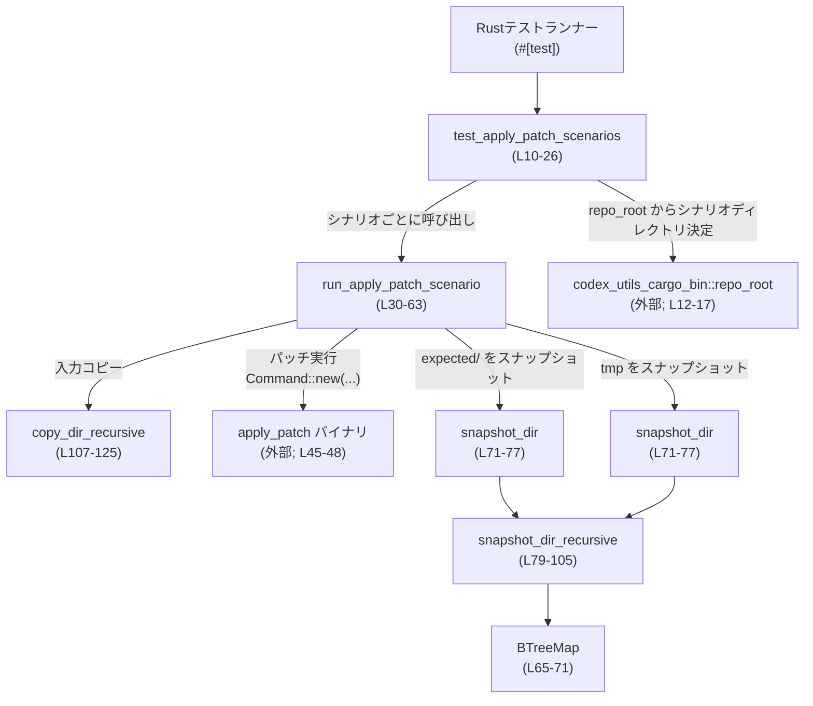

# apply-patch/tests/suite/scenarios.rs コード解説

## 0. ざっくり一言

`apply_patch` バイナリに対するシナリオテストをまとめて実行し、**ファイルシステムの最終状態を丸ごとスナップショットして検証するためのテスト用モジュール**です（apply-patch/tests/suite/scenarios.rs:L10-26, L30-63, L71-105）。

---

## 1. このモジュールの役割

### 1.1 概要

- このモジュールは、`apply_patch` コマンドの挙動を **シナリオ単位で統合テスト**するために存在します（L10-26）。
- 各シナリオは `input/` ディレクトリ・`patch.txt`・`expected/` ディレクトリから構成され、  
  入力を一時ディレクトリにコピーして `apply_patch` を実行し、最終状態を `expected/` と厳密に比較します（L30-53）。
- 比較には、ディレクトリ構造とファイル内容を `BTreeMap<PathBuf, Entry>` でスナップショットする仕組みを用いています（L65-71, L79-105）。

### 1.2 アーキテクチャ内での位置づけ

このモジュール内の主なコンポーネントと外部要素（テストランナー・ファイルシステム・`apply_patch` バイナリ）の関係を示します。



- テストランナーが `#[test]` 関数 `test_apply_patch_scenarios` を起動し、全シナリオを列挙します（L10-24）。
- 各シナリオごとに `run_apply_patch_scenario` が呼び出され、セットアップ・実行・検証を行います（L22, L30-63）。
- スナップショットの取得は `snapshot_dir` → `snapshot_dir_recursive` の二段構成で実装されています（L71-77, L79-105）。

### 1.3 設計上のポイント

- **ディレクトリスナップショット方式**
  - `Entry` 列挙体で「ファイル（バイト列）」と「ディレクトリ」を区別し（L65-69）、
    `BTreeMap<PathBuf, Entry>` により「パス → エントリ」の対応を保持します（L71-72）。
  - `BTreeMap` を用いることで、キー（パス）が常にソート順に格納され、比較時に順序の違いの影響を受けません（標準ライブラリ仕様に基づく性質; 使用箇所は L71-72, L82-83）。
- **ブラックボックステスト**
  - `apply_patch` は外部バイナリとして `Command::new` で起動され、**終了ステータスにはあえて依存せず**、  
    ファイルシステムの最終状態のみを判定基準としています（コメントとコードより; L42-48）。
- **テストの隔離**
  - `tempfile::tempdir()` を用いて一時ディレクトリを作成し（L31）、各シナリオをそこで実行することで、  
    実際のワークスペースに副作用を残さない構造になっています。
- **シンボリックリンクへの配慮**
  - Buck2 環境では `__srcs` 下のファイルがシンボリックリンクになることがあり、  
    それに対応するため `fs::metadata()` （シンボリックリンクを辿る）を明示的に使っている、とコメントされています（L92-95, L113-114）。
- **安全性（Rust観点）**
  - `unsafe` ブロックは存在せず（このチャンクには現れません）、  
    すべての I/O エラーは `anyhow::Result` 経由で伝播されます（`?` 演算子の使用; L12, L18, L31, L36, L40, L45, L52-53, L71, L74, L84-85, L95-96, L100, L107-108, L114-116, L117, L122）。

---

## 2. 主要な機能一覧とコンポーネントインベントリー

### 2.1 機能一覧

- 全シナリオの一括実行: シナリオディレクトリを列挙し、各シナリオを順にテストします（L10-24）。
- 単一シナリオの実行と検証: 入力コピー → パッチ適用 → スナップショット比較を行います（L30-63）。
- ディレクトリのスナップショット取得: ルート以下のディレクトリ・ファイルを走査し、`Entry` として記録します（L71-105）。
- ディレクトリの再帰コピー: 入力ディレクトリを一時ディレクトリに再帰的にコピーします（L107-125）。

### 2.2 コンポーネントインベントリー

| 名前 | 種別 | 役割 / 用途 | 定義位置 |
|------|------|------------|----------|
| `test_apply_patch_scenarios` | 関数（テスト） | 全シナリオディレクトリを列挙し、`run_apply_patch_scenario` を呼び出すエントリポイント | apply-patch/tests/suite/scenarios.rs:L10-26 |
| `run_apply_patch_scenario` | 関数 | 単一シナリオのセットアップ・`apply_patch` 実行・スナップショット比較を行う | apply-patch/tests/suite/scenarios.rs:L30-63 |
| `Entry` | 列挙体 | スナップショットにおけるエントリ種別（ファイル or ディレクトリ）と内容を表す | apply-patch/tests/suite/scenarios.rs:L65-69 |
| `snapshot_dir` | 関数 | 指定されたパス直下のディレクトリをスナップショットし、`BTreeMap` を返す | apply-patch/tests/suite/scenarios.rs:L71-77 |
| `snapshot_dir_recursive` | 関数 | ディレクトリを再帰的に走査し、`entries` マップを構築する内部ヘルパー | apply-patch/tests/suite/scenarios.rs:L79-105 |
| `copy_dir_recursive` | 関数 | ディレクトリを再帰コピーする内部ヘルパー | apply-patch/tests/suite/scenarios.rs:L107-125 |

---

## 3. 公開 API と詳細解説

### 3.1 型一覧（構造体・列挙体など）

| 名前 | 種別 | 役割 / 用途 | 定義位置 |
|------|------|------------|----------|
| `Entry` | 列挙体 | スナップショット内の各パスがファイルかディレクトリかを表し、ファイルならそのバイト列を保持する | apply-patch/tests/suite/scenarios.rs:L65-69 |

`Entry` のバリアント:

- `Entry::File(Vec<u8>)`: ファイルを表し、その内容をバイト列として保持します（L67, L100-101）。
- `Entry::Dir`: ディレクトリを表すマーカーです（L68, L96-98）。

### 3.2 関数詳細

#### `test_apply_patch_scenarios() -> anyhow::Result<()>`

**概要**

- リポジトリルートからシナリオディレクトリのルートパスを構成し、  
  内部の各サブディレクトリをシナリオとして `run_apply_patch_scenario` に渡すテスト関数です（L10-24）。

**引数**

- なし（Rust テストランナーから直接呼び出されます）。

**戻り値**

- `anyhow::Result<()>`  
  - すべてのシナリオが成功した場合は `Ok(())`（L25）。  
  - 途中で I/O エラー等が発生した場合や、アサーション失敗によりパニックした場合はテスト失敗となります。

**内部処理の流れ**

1. `repo_root()?` からリポジトリルートを取得し（外部関数; L12）、  
   `"codex-rs/apply-patch/tests/fixtures/scenarios"` を順に `join` してシナリオルートディレクトリを構成します（L12-17）。
2. `fs::read_dir(scenarios_dir)?` でシナリオルート直下のエントリを列挙します（L18）。
3. 各エントリに対して `path()` を取り出し（L20）、  
   ディレクトリであれば `run_apply_patch_scenario(&path)?` を呼び出します（L21-22）。
4. すべてのシナリオ処理が完了したら `Ok(())` を返します（L25）。

**Examples（使用例）**

テストランナーから自動的に使用されるため、直接呼び出すケースは通常ありませんが、  
同等の処理を別のモジュールから使う場合のイメージは以下のようになります。

```rust
// テストモジュール内から呼び出す例
#[test]
fn run_all_apply_patch_scenarios() -> anyhow::Result<()> {
    // 既存のテスト関数をそのまま再利用してもよい構造になっています（L10-26）
    crate::test_apply_patch_scenarios()
}
```

**Errors / Panics**

- `repo_root()` からのエラー（パス取得失敗等）が `?` で伝播します（L12）。
- `fs::read_dir` が失敗した場合（存在しないディレクトリ・権限不足など）も `?` で `Err` になります（L18）。
- ループ内で `scenario?` の箇所でディレクトリエントリ取得が失敗すると `Err` になります（L19）。
- `run_apply_patch_scenario` 内でのエラーも `?` により伝播します（L22）。
- `assert_eq!` 失敗は `panic!` を引き起こし、テスト失敗になります（L55-60）。

**Edge cases（エッジケース）**

- シナリオディレクトリが空の場合: ループは一度も実行されず、そのまま `Ok(())` が返ります（L18-24）。
- シナリオルート自体が存在しない場合: `fs::read_dir` でエラーとなり、テストが失敗します（L18）。

**使用上の注意点**

- この関数はテスト用途専用であり、本番コードからの呼び出しは想定されていません（`#[test]` 属性; L10）。
- シナリオディレクトリのレイアウトはコードにハードコーディングされているため（L12-17）、  
  ディレクトリ構成を変更する場合はここも合わせて修正する必要があります。

---

#### `run_apply_patch_scenario(dir: &Path) -> anyhow::Result<()>`

**概要**

- 単一のシナリオディレクトリを受け取り、  
  - `input/` の内容を一時ディレクトリへコピーし（任意）  
  - `patch.txt` の内容を `apply_patch` バイナリに渡して実行し  
  - 実行後の一時ディレクトリと `expected/` ディレクトリのスナップショットを比較する  
  という一連の処理を行います（L30-63）。

**引数**

| 引数名 | 型 | 説明 |
|--------|----|------|
| `dir` | `&Path` | シナリオディレクトリのパス。内部には `input/`（任意）、`patch.txt`、`expected/` がある前提です（L34, L40, L51）。 |

**戻り値**

- `anyhow::Result<()>`  
  - 比較が成功し、エラーなく処理が完了すれば `Ok(())` を返します（L62）。  
  - I/O エラーやコマンド実行時のエラーは `Err` として返ります。  
  - 期待と実際のスナップショットが異なる場合は `assert_eq!` が `panic!` し、テスト失敗となります（L55-60）。

**内部処理の流れ（アルゴリズム）**

1. `tempdir()` で一時ディレクトリを作成し、そのパスを取得します（L31）。
2. `dir.join("input")` で入力ディレクトリのパスを組み立て（L34）、  
   それがディレクトリであれば `copy_dir_recursive(&input_dir, tmp.path())?` で一時ディレクトリへコピーします（L35-37）。
3. `dir.join("patch.txt")` からパッチ内容を `String` として読み込みます（L39-40）。
4. `codex_utils_cargo_bin::cargo_bin("apply_patch")?` で `apply_patch` バイナリのパスを取得し（L45）、  
   `Command::new(...)` によりプロセスを起動します。  
   - 引数として、読み込んだ `patch` 文字列を一つ渡します（L46）。  
   - カレントディレクトリを一時ディレクトリに設定します（L47）。  
   - `.output()?` で実行し、終了まで待ちます（L48）。
   - コメントにある通り、終了コードにはチェックを行いません（L42-44）。
5. `dir.join("expected")` から期待ディレクトリのパスを構成し（L51）、  
   `snapshot_dir(&expected_dir)?` でスナップショットを取得します（L52）。  
   一方 `snapshot_dir(tmp.path())?` で実際のディレクトリのスナップショットを同様に取得します（L53）。
6. `assert_eq!(actual_snapshot, expected_snapshot, "...")` で 2 つのスナップショットを比較し、完全一致であることを検証します（L55-60）。
7. 最後に `Ok(())` を返します（L62）。

**Examples（使用例）**

テスト以外のコードから同様のシナリオ処理を行う場合のイメージです。

```rust
use std::path::Path;
use anyhow::Result;

// 単一シナリオを明示的に実行する例
fn run_one_scenario_example() -> Result<()> {
    // シナリオディレクトリへのパスを用意する（L30 の dir に相当）
    let scenario_dir = Path::new("codex-rs/apply-patch/tests/fixtures/scenarios/example");

    // シナリオを実行し、期待状態との一致を検証する（L30-63）
    run_apply_patch_scenario(scenario_dir)
}
```

**Errors / Panics**

- `tempdir()` 失敗時に `Err` が返ります（L31）。
- `copy_dir_recursive` 内での I/O エラーが `?` により伝播します（L36-37）。
- `fs::read_to_string` による `patch.txt` 読み込み失敗（ファイル不存在・エンコーディング問題など）が `Err` を引き起こします（L40）。
- `codex_utils_cargo_bin::cargo_bin` の失敗、および `Command::new(...).output()` 実行時のエラーも `Err` として伝播します（L45-48）。
- `snapshot_dir` 内の I/O エラーも `Err` として伝播します（L52-53, L71-76）。
- 期待スナップショットと実際のスナップショットが異なる場合、`assert_eq!` が `panic!` を発生させ、テストが失敗します（L55-60）。

**Edge cases（エッジケース）**

- `input/` ディレクトリが存在しない場合:
  - `input_dir.is_dir()` が `false` となり、コピーはスキップされます（L34-37）。  
    その場合、一時ディレクトリは空のままパッチが適用されます。
- `expected/` ディレクトリが存在しない場合:
  - `snapshot_dir(&expected_dir)?` で空のスナップショット（`BTreeMap::new()`）が返ります（L71-76, L51-52）。  
    一方で一時ディレクトリ側にファイルが存在すれば不一致となり、テストは失敗します。
- `apply_patch` が異常終了した場合:
  - 終了コードはチェックしていないため（コメント; L42-44）、  
    ファイルシステムの状態が `expected/` と一致していればテストは成功します。

**使用上の注意点**

- `dir` 以下のディレクトリ構造（`input/`, `patch.txt`, `expected/`）が前提条件です。  
  いずれかが欠けている場合、テストがエラーまたは失敗になります（L34, L40, L51）。
- `apply_patch` の挙動を **最終状態だけで検証**しているため、  
  中間状態（途中で一時ファイルを作成して消すなど）はテストでは観測されません。
- `Command::output()` は標準出力・標準エラーの内容をメモリに保持するため、  
  極端に大きな出力を行うとメモリ使用量が増える点に注意が必要です（一般的な `std::process::Command` の性質; 使用箇所 L48）。

---

#### `snapshot_dir(root: &Path) -> anyhow::Result<BTreeMap<PathBuf, Entry>>`

**概要**

- 指定したパスがディレクトリであれば、その配下のディレクトリ構造とファイル内容を再帰的に走査し、  
  `BTreeMap<PathBuf, Entry>` としてスナップショットを返します（L71-76）。

**引数**

| 引数名 | 型 | 説明 |
|--------|----|------|
| `root` | `&Path` | スナップショットの基準となるディレクトリパスです（L71-74）。 |

**戻り値**

- `anyhow::Result<BTreeMap<PathBuf, Entry>>`  
  - 正常時は、`root` の下に存在する全ディレクトリ・ファイルをキーに持つ `BTreeMap` を返します（L71-76）。  
  - I/O エラー等が発生した場合は `Err` を返します（`snapshot_dir_recursive` 内で発生; L74）。

**内部処理の流れ**

1. 空の `BTreeMap<PathBuf, Entry>` を作成します（L72）。
2. `root.is_dir()` が真であれば、`snapshot_dir_recursive(root, root, &mut entries)?` を呼び出します（L73-74）。
3. `entries` を `Ok(entries)` として返します（L76）。

**Examples（使用例）**

```rust
use std::path::Path;
use std::collections::BTreeMap;

// ディレクトリのスナップショットを取得して利用する例
fn print_snapshot(root: &Path) -> anyhow::Result<()> {
    let snapshot: BTreeMap<std::path::PathBuf, Entry> = snapshot_dir(root)?; // L71-77

    for (rel_path, entry) in &snapshot {
        match entry {
            Entry::Dir => {
                println!("DIR  {:?}", rel_path);
            }
            Entry::File(bytes) => {
                println!("FILE {:?} ({} bytes)", rel_path, bytes.len());
            }
        }
    }

    Ok(())
}
```

**Errors / Panics**

- `root.is_dir()` が `false` の場合でもエラーにはならず、空の `BTreeMap` を返します（L72-76）。
- 再帰処理内での `fs::read_dir`・`fs::metadata`・`fs::read` のエラーは `?` を通して `Err` として返されます（L74, L84-85, L95-96, L100）。

**Edge cases（エッジケース）**

- `root` が存在しない、またはディレクトリでない場合:
  - `root.is_dir()` が `false` となり、空のマップが返ります（L73-76）。
- 空ディレクトリの場合:
  - `snapshot_dir_recursive` で `fs::read_dir` は成功しても、ループ本体が実行されないため、空のマップが返ります（L84-103）。

**使用上の注意点**

- 戻り値のキーは `root` からの **相対パス** です（`strip_prefix(base)` を使用; L87-90）。  
  呼び出し側はこれを前提として扱う必要があります。
- 非常に大きなディレクトリに対して呼び出した場合、  
  全ファイル内容をメモリに読み込むため、メモリ消費が大きくなります（L100-101）。

---

#### `snapshot_dir_recursive(base: &Path, dir: &Path, entries: &mut BTreeMap<PathBuf, Entry>) -> anyhow::Result<()>`

**概要**

- `snapshot_dir` の内部ヘルパーとして、`dir` 以下のファイル・ディレクトリを再帰的に列挙し、  
  `entries` に `base` からの相対パスをキーとして `Entry` を格納します（L79-105）。

**引数**

| 引数名 | 型 | 説明 |
|--------|----|------|
| `base` | `&Path` | 相対パスの基準となるディレクトリです。最初の呼び出しでは `root` と同じになります（L79-81, L74）。 |
| `dir` | `&Path` | 現在走査中のディレクトリのパスです（L81, L84-86）。 |
| `entries` | `&mut BTreeMap<PathBuf, Entry>` | スナップショットを蓄積するマップです（L82-83, L97-98, L101）。 |

**戻り値**

- `anyhow::Result<()>`  
  - 正常に走査が終われば `Ok(())`（L104-105）。  
  - I/O エラーが発生した場合は `Err` を返します（L84-85, L95-96, L100）。

**内部処理の流れ**

1. `fs::read_dir(dir)?` で `dir` 配下のエントリを列挙します（L84）。
2. 各エントリに対して:
   1. `entry?` で `DirEntry` を取得し（L85）、`entry.path()` で絶対パスを得ます（L86）。
   2. `path.strip_prefix(base).ok()` によって `base` からの相対パスを取得し、  
      これが取得できない場合は `continue` でスキップします（L87-89）。
   3. 相対パスを `PathBuf` に変換して `rel` とします（L90）。
   4. `fs::metadata(&path)?` でメタデータを取得します（L95）。  
      コメントで、Buck2 環境でのシンボリックリンク対応のために `metadata()` を使っていると説明されています（L92-95）。
   5. `metadata.is_dir()` ならディレクトリとして:
      - `entries.insert(rel.clone(), Entry::Dir)` を行い（L96-98）、
      - `snapshot_dir_recursive(base, &path, entries)?` で再帰的に処理します（L98）。
   6. `metadata.is_file()` ならファイルとして:
      - `fs::read(&path)?` で内容をバイト列として読み込みます（L100）。
      - `entries.insert(rel, Entry::File(contents))` を行います（L101-102）。
3. すべてのエントリ処理が完了したら `Ok(())` を返します（L104-105）。

**Examples（使用例）**

通常は `snapshot_dir` を通じて間接的に使用されます（L74）。  
直接利用する場合のイメージは以下の通りです。

```rust
use std::collections::BTreeMap;
use std::path::PathBuf;

// snapshot_dir_recursive を直接使って部分木だけをスナップショットする例
fn snapshot_subdir(base: &std::path::Path, subdir: &std::path::Path) -> anyhow::Result<BTreeMap<PathBuf, Entry>> {
    let mut entries = BTreeMap::new();
    snapshot_dir_recursive(base, subdir, &mut entries)?; // L79-83
    Ok(entries)
}
```

**Errors / Panics**

- `fs::read_dir(dir)?` が失敗した場合（権限不足・パス不存在など）、`Err` を返します（L84）。
- `fs::metadata(&path)?` が失敗した場合も `Err` を返します（L95-96）。
- `fs::read(&path)?` によるファイル読み込み失敗も `Err` になります（L100）。
- `strip_prefix(base)` が失敗した場合は `continue` してスキップするため、パニックにはなりません（L87-89）。

**Edge cases（エッジケース）**

- `dir` 以下に `base` からの相対パスが計算できないパスが存在する場合:
  - `strip_prefix(base).ok()` が `None` となり、そのエントリはスキップされます（L87-89）。  
    ただし、`dir` は `base` 以下から辿っているため、通常は起こらない防御的な処理と考えられます。
- ディレクトリでもファイルでもない特殊なファイル種別（デバイスファイルなど）が存在する場合:
  - `metadata.is_dir()` と `metadata.is_file()` のどちらでもない場合、何も挿入されずスキップされます（L95-102）。  
    この挙動自体はコードから読み取れますが、想定しているかどうかはこのチャンクからは不明です。

**使用上の注意点**

- `base` と `dir` の関係が不適切（`dir` が `base` の配下でない）な場合、  
  すべてのエントリが `strip_prefix` でスキップされ、空のマップになる可能性があります（L87-90）。
- 無限再帰を避けるため、ディレクトリ構造に循環（ディレクトリの自己参照など）があると I/O エラーや無限探索のリスクがありますが、  
  ここでは通常のファイルシステムを前提としており、このチャンクからは特別な対策の有無は分かりません（特別なチェックは存在しません）。

---

#### `copy_dir_recursive(src: &Path, dst: &Path) -> anyhow::Result<()>`

**概要**

- `src` ディレクトリの内容を、同じ構造で `dst` に再帰コピーするヘルパー関数です（L107-125）。
- ディレクトリがあれば `create_dir_all` し、ファイルは `fs::copy` でコピーします（L115-117, L122）。

**引数**

| 引数名 | 型 | 説明 |
|--------|----|------|
| `src` | `&Path` | コピー元ディレクトリのパスです（L107-108）。 |
| `dst` | `&Path` | コピー先ディレクトリのパスです（L107, L111）。 |

**戻り値**

- `anyhow::Result<()>`  
  - すべてのコピーに成功した場合は `Ok(())`（L125）。  
  - いずれかの I/O 操作が失敗した場合は `Err` を返します。

**内部処理の流れ**

1. `fs::read_dir(src)?` で `src` 内のエントリを列挙します（L108）。
2. 各エントリに対して:
   1. `entry?` で `DirEntry` を取得し（L109）、`entry.path()` を `path` として保存します（L110）。
   2. コピー先パス `dest_path` を `dst.join(entry.file_name())` で構成します（L111）。
   3. コメントにある通り、`snapshot_dir_recursive` と同様の理由で `fs::metadata(&path)?` を使います（L113-114）。
   4. `metadata.is_dir()` なら:
      - `fs::create_dir_all(&dest_path)?` でディレクトリを作成し（L115-116）、
      - `copy_dir_recursive(&path, &dest_path)?` を再帰的に呼びます（L117）。
   5. `metadata.is_file()` なら:
      - `dest_path.parent()` があれば `fs::create_dir_all(parent)?` で親ディレクトリを作成し（L119-121）、
      - `fs::copy(&path, &dest_path)?` でファイルをコピーします（L122）。
3. 全エントリの処理が完了したら `Ok(())` を返します（L125）。

**Examples（使用例）**

```rust
use std::path::Path;

// ディレクトリを別の場所にコピーする例
fn duplicate_dir() -> anyhow::Result<()> {
    let src = Path::new("path/to/source");
    let dst = Path::new("path/to/dest");

    copy_dir_recursive(src, dst)?; // L107-125
    Ok(())
}
```

**Errors / Panics**

- `fs::read_dir(src)?` が失敗した場合に `Err` を返します（L108）。
- `fs::metadata(&path)?`、`fs::create_dir_all`、`fs::copy` のいずれかが失敗した場合も `Err` を返します（L114-116, L117, L119-121, L122）。
- パニックを引き起こすコード（`unwrap` 等）は使用していません。

**Edge cases（エッジケース）**

- `src` にファイルだけが存在し、ディレクトリがない場合:
  - すべて `metadata.is_file()` パスを通り、`dst` 直下にファイルがコピーされます（L118-122）。
- `src` にシンボリックリンクが存在する場合:
  - `fs::metadata` はリンク先に対するメタデータを返します（標準ライブラリ仕様; 使用箇所 L114）。  
    したがって、リンクがディレクトリを指していれば再帰コピーされ、ファイルを指していればファイルとしてコピーされます。
- 親ディレクトリが存在しない場合:
  - `dest_path.parent()` で親ディレクトリを取得し、`create_dir_all` で作成してからコピーします（L119-121）。

**使用上の注意点**

- コピーは再帰的に行われるため、非常に深いディレクトリ階層や大量のファイルに対しては時間とメモリのコストが増加します。
- シンボリックリンクを辿る点は `snapshot_dir_recursive` と同様であり（コメント; L113-114）、  
  リンク先によっては意図しないコピー範囲が広がる可能性があります。

---

### 3.3 その他の関数

このファイルには上記以外の関数は定義されていません（このチャンクには現れません）。

---

## 4. データフロー

### 4.1 代表的なシナリオ

**「すべてのシナリオを実行し、スナップショット比較で検証する」** 処理のデータフローです。

1. テストランナーが `test_apply_patch_scenarios` を呼び出します（L10）。
2. `repo_root()` からシナリオディレクトリのルートパスを構築し（L12-17）、各シナリオディレクトリを列挙します（L18-24）。
3. 各シナリオごとに `run_apply_patch_scenario` が呼び出されます（L22, L30-63）。
4. `run_apply_patch_scenario` 内で、一時ディレクトリを作成し（L31）、必要に応じて `input/` をコピーします（L34-37）。
5. `patch.txt` を読み込み（L40）、`apply_patch` バイナリを一時ディレクトリ内で実行します（L45-48）。
6. 実行後、`expected/` と一時ディレクトリのスナップショットを `snapshot_dir`→`snapshot_dir_recursive` で取得します（L51-53, L71-77, L79-105）。
7. 両者を `assert_eq!` で比較し、一致しなければテスト失敗です（L55-60）。

### 4.2 シーケンス図

```mermaid
sequenceDiagram
    participant TR as テストランナー
    participant T as test_apply_patch_scenarios<br/>(L10-26)
    participant R as run_apply_patch_scenario<br/>(L30-63)
    participant C as copy_dir_recursive<br/>(L107-125)
    participant AP as apply_patch バイナリ<br/>(L45-48)
    participant SD as snapshot_dir<br/>(L71-77)
    participant SR as snapshot_dir_recursive<br/>(L79-105)

    TR->>T: 呼び出し (#[test])
    T->>T: シナリオディレクトリ決定 (repo_root + join; L12-17)
    T->>T: fs::read_dir でシナリオ列挙 (L18)
    loop 各シナリオ
        T->>R: run_apply_patch_scenario(&scenario_dir) (L22)
        R->>R: tempdir() で一時ディレクトリ作成 (L31)
        alt input/ が存在する場合
            R->>C: copy_dir_recursive(input/, tmp) (L35-37)
            C-->>R: コピー完了 (L107-125)
        end
        R->>R: patch.txt を読み込み (L39-40)
        R->>AP: Command::new(...).arg(patch).output() (L45-48)
        AP-->>R: 実行完了 (exit status はチェックしない; L42-44)
        R->>SD: snapshot_dir(expected/) (L51-52)
        SD->>SR: snapshot_dir_recursive(base=root, dir=root) (L74, L79-105)
        SR-->>SD: entries へ挿入 (L84-103)
        SD-->>R: expected_snapshot (L71-77)
        R->>SD: snapshot_dir(tmp) (L53)
        SD->>SR: snapshot_dir_recursive (L74, L79-105)
        SR-->>SD: entries へ挿入
        SD-->>R: actual_snapshot
        R->>R: assert_eq!(actual, expected) (L55-60)
        R-->>T: Ok(()) or panic
    end
    T-->>TR: Ok(()) or panic
```

---

## 5. 使い方（How to Use）

### 5.1 基本的な使用方法（テストとして）

このモジュールはテストクレート内のファイルであり、Rust のテストランナーによって `#[test]` 関数が自動的に実行されます（L10）。

**シナリオディレクトリ構成**

コードから読み取れる前提となる構成は次の通りです（L12-17, L34, L40, L51）。

```text
<repo_root>/
  codex-rs/
    apply-patch/
      tests/
        fixtures/
          scenarios/
            scenario_a/
              input/        # 初期ファイル群（任意; 無くてもよい; L34-37）
              patch.txt     # apply_patch に渡すパッチ（必須; L39-40）
              expected/     # 実行後の期待ディレクトリ構造（L51-52）
            scenario_b/
              ...
```

- `scenario_a`, `scenario_b` のような各サブディレクトリが一つのシナリオです（L18-24）。
- `input/` がない場合、そのシナリオは空の一時ディレクトリから開始します（L34-37）。

### 5.2 よくある使用パターン

1. **新しいシナリオを追加する**
   - `tests/fixtures/scenarios/` の下に新しいディレクトリを作成し（L12-17）、  
     `input/`・`patch.txt`・`expected/` を配置すると、自動的にテスト対象になります（L18-24, L34, L40, L51）。

2. **ディレクトリ比較ロジックの再利用**
   - 他のテストでディレクトリの完全一致を検証したい場合に、  
     `snapshot_dir` と `Entry` を利用して `BTreeMap` 同士を比較することができます（L65-71, L71-77）。

### 5.3 よくある間違い

```rust
// 間違い例: expected/ ディレクトリを作らずにシナリオを追加した場合
// scenario_x/
//   input/
//   patch.txt
//
// 結果: snapshot_dir(expected/) は空のマップを返すが（L71-76）、
//       apply_patch の結果として tmp にファイルがあると不一致になりテスト失敗となる（L51-53, L55-60）。

// 正しい例: expected/ を作成し、apply_patch 実行後の期待状態を再現しておく
// scenario_x/
//   input/
//   patch.txt
//   expected/
//     ... # 期待するディレクトリ構造とファイル内容
```

```rust
// 間違い例: patch.txt を置き忘れる
// scenario_y/
//   input/
//   expected/
//
// 結果: fs::read_to_string(dir.join("patch.txt"))? が失敗し、テストが Err で終了する（L39-40）。

// 正しい例: patch.txt を配置する
// scenario_y/
//   input/
//   patch.txt     // apply_patch に適用させたいパッチ
//   expected/
```

### 5.4 使用上の注意点（まとめ）

- シナリオディレクトリの構造（`input/`, `patch.txt`, `expected/`）は必須の契約条件です（L34, L40, L51）。
- 比較は「ディレクトリ構造」と「ファイル内容（バイト列）」の両方について**完全一致**を要求します（`assert_eq!` と `Entry::File(Vec<u8>)`; L55-60, L65-69, L100-101）。
- Rust テストはデフォルトで並行実行される可能性がありますが、このテストは
  - 1 つの `#[test]` 関数内で全シナリオを順に処理し（L18-24）、
  - 各シナリオは一時ディレクトリごとに分離されているため（L31）、  
  **同テスト内でのデータ競合は起きない構造**になっています。

---

## 6. 変更の仕方（How to Modify）

### 6.1 新しい機能を追加する場合

1. **スナップショット形式を拡張する**
   - 例: パーミッションやタイムスタンプも比較したい場合
   - 変更対象:
     - `Entry` に新しいフィールドやバリアントを追加する（L65-69）。
     - `snapshot_dir_recursive` で `fs::metadata` から必要な情報を取得して `Entry` に格納するよう拡張する（L95-101）。
   - 影響:
     - `Entry` の `Debug` / `PartialEq` / `Eq` 派生（L65）により、`assert_eq!` の比較対象にも反映されます（L55-60）。

2. **特定のファイルを比較対象から除外する**
   - 例: 一時ファイルやログファイルを無視したい場合
   - 変更対象:
     - `snapshot_dir_recursive` のループ内（L84-103）で `rel`（相対パス; L90）に対するフィルタ条件を追加し、  
       条件に合致するパスを `entries.insert` から除外します（L96-98, L100-101）。

### 6.2 既存の機能を変更する場合の注意点

- **スナップショットロジック変更時**
  - `snapshot_dir_recursive` と `copy_dir_recursive` は、ともに `fs::metadata` を使い、  
    シンボリックリンクを辿る前提で書かれています（コメント; L92-95, L113-114）。  
    一方だけ挙動を変えると、「コピーした内容」と「スナップショット取得方法」が不整合になる可能性があります。
- **パスの扱い**
  - `snapshot_dir` は `strip_prefix(base)` を用いて相対パスを計算しているため（L87-90）、  
    `base` の意味を変える場合はこの前提を壊さないよう注意が必要です（L79-81）。
- **外部依存の変更**
  - `repo_root()` および `codex_utils_cargo_bin::cargo_bin("apply_patch")` は外部クレートに依存しています（L12, L45）。  
    これらの API が変更された場合は、ここも合わせて修正する必要があります。

---

## 7. 関連ファイル

このモジュールと密接に関係する（コードから読み取れる）ファイル・ディレクトリは次の通りです。

| パス / 要素 | 役割 / 関係 |
|-------------|------------|
| `codex-rs/apply-patch/tests/fixtures/scenarios` | シナリオディレクトリのルート。`test_apply_patch_scenarios` で使用されています（L12-18）。 |
| `codex-rs/apply-patch/tests/fixtures/scenarios/<scenario>/input` | 各シナリオの初期ファイル群。存在する場合だけ一時ディレクトリにコピーされます（L34-37）。 |
| `codex-rs/apply-patch/tests/fixtures/scenarios/<scenario>/patch.txt` | `apply_patch` に渡すパッチ内容を記述したテキストファイル（L39-40）。 |
| `codex-rs/apply-patch/tests/fixtures/scenarios/<scenario>/expected` | 実行後に期待されるディレクトリ構造とファイル内容を保持するディレクトリ（L51-52）。 |
| `codex_utils_cargo_bin::repo_root` | リポジトリルートを取得する外部関数。シナリオディレクトリのパス構成に利用されています（L12-17）。 |
| `codex_utils_cargo_bin::cargo_bin("apply_patch")` | `apply_patch` バイナリのパスを取得する外部関数。`Command::new` の引数として利用されています（L45）。 |

このチャンクからは、`apply_patch` バイナリ自体の実装ファイル（例: `src/main.rs` など）の位置は読み取れません（不明）。
