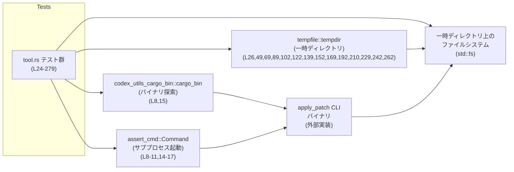
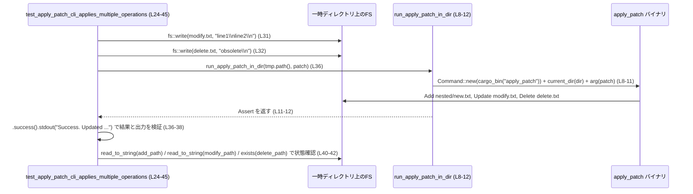

# apply-patch/tests/suite/tool.rs コード解説

## 0. ざっくり一言

`apply_patch` CLI バイナリをサブプロセスとして起動し、一時ディレクトリ上のファイルにパッチ文字列を適用した結果を検証する **統合テスト群** のモジュールです（`apply-patch/tests/suite/tool.rs`）。

---

## 1. このモジュールの役割

### 1.1 概要

- このモジュールは `apply_patch` コマンドラインツールの **外部挙動**（CLI インターフェースとファイルシステムへの影響）を検証するために存在します。
- 具体的には、パッチ文字列に含まれる
  - ファイルの追加（Add）
  - 変更（Update）＋複数ハンク
  - 削除（Delete）
  - 移動（Move）
- といった操作が、期待どおりの stdout/stderr とファイル内容の変化を伴って行われることを確認します（例: `test_apply_patch_cli_applies_multiple_operations`、`apply-patch/tests/suite/tool.rs:L24-45`）。

### 1.2 アーキテクチャ内での位置づけ

このファイルは **テストコード**であり、本体バイナリ `apply_patch` を `assert_cmd::Command` を通して起動します。



- テストは毎回 `tempdir()` で一時ディレクトリを作成し（例: `L26`）、その中でファイルの作成・削除を行います。
- `codex_utils_cargo_bin::cargo_bin("apply_patch")` でビルド済みの `apply_patch` バイナリを探し（`L8,15`）、`assert_cmd::Command` でサブプロセスとして起動します（`L8-11,14-17`）。
- ファイル操作には `std::fs` が使われています（例: `fs::write` や `fs::create_dir_all`、`L31-32,51,72-73` など）。

### 1.3 設計上のポイント

コードから読み取れる設計上の特徴は次のとおりです。

- **共通ヘルパー関数による重複排除**
  - `run_apply_patch_in_dir` と `apply_patch_command` で「指定ディレクトリをカレントディレクトリとして `apply_patch` を起動する」という処理を共通化しています（`L8-18`）。
- **絶対パス（正規化パス）でのエラー検証**
  - エラーメッセージ内のパスは `resolved_under` で `canonicalize` した結果を使用して検証しています（`L20-22,104-105,123-124,212-213,264-265`）。
  - これは `apply_patch` がエラー時に絶対パス（実パス）を表示することを前提としたテスト契約です。
- **テストごとに独立したファイルシステム環境**
  - 各テストは必ず新しい `tempdir()` を作成し、その配下だけを操作します（例: `L26,49,69,89,102,122,139,...`）。
  - これにより、テストランナーが並列実行してもディレクトリが競合しないようになっています。
- **CLI 振る舞いの詳細な検証**
  - 成功時は stdout に「A/M/D + パス」を出力すること（`L36-38,55-57,77-79,181-182,200-201,250-251`）。
  - 失敗時は stderr に具体的なエラーメッセージを出力し、終了ステータスが failure になること（`L91-95,107-114,125-132,141-145,155-162,215-221,231-235,266-274`）。
- **部分成功後の失敗をロールバックしない契約の確認**
  - パッチ適用途中でエラーになっても、既に適用された変更は残ることを明示的にテストしています（`test_apply_patch_cli_failure_after_partial_success_leaves_changes`、`L260-279`）。

---

## 2. 主要な機能一覧（テスト観点）

このモジュールがカバーしている **CLI 機能・契約** を列挙します（括弧内は代表テストと行範囲）。

- 複数ファイルへの複合操作:
  - 追加（Add）、変更（Update）、削除（Delete）が 1 つのパッチ内で順に適用されること  
    （`test_apply_patch_cli_applies_multiple_operations`、`L24-45`）。
- 1 ファイル内での複数ハンク（chunks）更新:
  - `@@` で区切られた複数の差分が順に適用されること  
    （`test_apply_patch_cli_applies_multiple_chunks`、`L47-65`）。
- ファイルの移動:
  - `*** Move to: ...` によりファイルが別ディレクトリに移動されること
  - 宛先が既に存在する場合でも上書きされること  
    （`test_apply_patch_cli_moves_file_to_new_directory`、`L67-85`／`test_apply_patch_cli_move_overwrites_existing_destination`、`L167-188`）。
- 追加（Add）時の上書き:
  - `*** Add File:` が既存ファイルを上書きすること  
    （`test_apply_patch_cli_add_overwrites_existing_file`、`L190-206`）。
- パッチ構文エラー・不正ケースの検出:
  - 空パッチ（Begin〜End の間に何もない）を拒否（`L87-98`）。
  - `Update File` なのに中身が空（`+/-` 行がない）ハンクを拒否（`L137-148`）。
  - 無効なハンクヘッダ（`*** Frobnicate File: ...`）を拒否し、許可されたヘッダ一覧を提示（`L227-238`）。
- 文脈（context）不一致の検出:
  - `-missing` など、既存ファイル側に存在しない行を削除しようとした場合にエラーとし、どのファイルでどの行が見つからないかを報告  
    （`test_apply_patch_cli_reports_missing_context`、`L100-118`）。
- ファイル存在確認と削除・更新エラー:
  - 削除対象ファイルが存在しない場合にエラー（`L120-135`）。
  - 実際にはディレクトリであるパスに対して `Delete File` を行うとエラー（`L208-225`）。
  - 更新対象ファイルが存在しない場合にエラー（`L150-165`）。
- 改行の扱い:
  - 更新後のファイル末尾に必ず改行が付くこと（`test_apply_patch_cli_updates_file_appends_trailing_newline`、`L240-258`）。
- トランザクション性の欠如（部分成功の保持）:
  - 複数ハンクのうち前半だけ成功し、その後のハンクでエラーになった場合でも、前半で行われた変更は残ること  
    （`test_apply_patch_cli_failure_after_partial_success_leaves_changes`、`L260-279`）。

---

## 3. 公開 API と詳細解説

### 3.1 型一覧（構造体・列挙体など）

このファイル内で **新しく定義されている型はありません**。利用している主な標準／外部型のみ参考として挙げます。

| 名前 | 種別 | 定義 | 役割 / 用途 |
|------|------|------|-------------|
| `&Path` | 参照（標準ライブラリ） | `std::path::Path` | ディレクトリ・ファイルパスの参照（`run_apply_patch_in_dir`, `apply_patch_command`, `resolved_under` の引数など、`L8-21`）。 |
| `PathBuf` | 構造体（標準ライブラリ） | `std::path::PathBuf` | 可変パスバッファ。テスト内でファイルパスを組み立てる際に使用（例: `L27-29,50,70-71`）。 |
| `Command` | 構造体（外部クレート） | `assert_cmd::Command` | `apply_patch` バイナリをサブプロセスとして起動し、標準入出力と終了コードを検証するために使用（`L1,8-11,14-17`）。 |
| `Assert` | 構造体（外部クレート） | `assert_cmd::assert::Assert` | サブプロセスの結果に対して `.success()` / `.failure()` / `.stdout()` / `.stderr()` をチェーンするための型。`run_apply_patch_in_dir` の返り値（`L8-12`）。 |

### 3.2 関数詳細（7 件）

#### `run_apply_patch_in_dir(dir: &Path, patch: &str) -> anyhow::Result<assert_cmd::assert::Assert>`

**定義位置**: `apply-patch/tests/suite/tool.rs:L8-12`

**概要**

- 指定されたディレクトリをカレントディレクトリとして `apply_patch` バイナリを起動し、パッチ文字列を 1 つのコマンドライン引数として渡します。
- その実行結果を表す `Assert` オブジェクトを `anyhow::Result` で返します。

**引数**

| 引数名 | 型 | 説明 |
|--------|----|------|
| `dir` | `&Path` | `apply_patch` を実行する作業ディレクトリ。パッチ対象のファイルがこの配下に存在します。 |
| `patch` | `&str` | `*** Begin Patch` 〜 `*** End Patch` を含むパッチ文字列。CLI の単一引数として渡されます。 |

**戻り値**

- `Ok(Assert)`:
  - `apply_patch` プロセスを起動し、`Command::assert()` を呼び出した結果として得られる `Assert` インスタンス。
  - 呼び出し側で `.success()` / `.failure()` / `.stdout()` / `.stderr()` をチェーンして検証できます（例: `L36-38,55-57,77-79`）。
- `Err(anyhow::Error)`:
  - `cargo_bin("apply_patch")` の取得やプロセス起動に失敗した場合など、`Command::new(...)` の準備段階で発生したエラー。

**内部処理の流れ**

1. `codex_utils_cargo_bin::cargo_bin("apply_patch")` で `apply_patch` バイナリのパスを取得します（`L8-9`）。
2. `Command::new(...)` でコマンドを生成します（`L9`）。
3. `cmd.current_dir(dir)` でカレントディレクトリを指定ディレクトリに変更します（`L10`）。
4. `cmd.arg(patch)` でパッチ文字列を 1 つの引数として追加し、`.assert()` を呼び出して `Assert` を生成します（`L11`）。
5. 上記の `Assert` を `Ok(...)` で返します（`L11-12`）。

**Examples（使用例）**

テスト内での典型的な使用例です。

```rust
// 一時ディレクトリを作成
let tmp = tempdir()?; // L26

// パッチを定義
let patch = "*** Begin Patch\n*** Add File: nested/new.txt\n+created\n*** End Patch";

// パッチを適用し、成功と標準出力を検証
run_apply_patch_in_dir(tmp.path(), patch)?          // L36
    .success()                                     // 成功終了コードを期待
    .stdout("Success. Updated the following files:\nA nested/new.txt\n"); // 出力検証
```

**Errors / Panics**

- `Err` が返る主なケース（想定）:
  - `cargo_bin("apply_patch")` がバイナリを発見できない場合。
  - `Command::new` の内部で OS レベルのエラーが発生した場合。
- パニックの可能性:
  - この関数内では明示的な `panic!` / `unwrap` / `expect` は使われていません（`L8-12`）。
  - ただし戻り値を `?` で扱うテスト側では `Err` がそのままテスト失敗として報告されます。

**Edge cases（エッジケース）**

- `patch` が空文字列や不正フォーマットでも、この関数自体は `Assert` を返します。  
  その後の `.success()` / `.failure()` 判定や stderr 検証側で不正が検出されます（例: 空パッチ `L91-95`）。
- 非存在ディレクトリを指す `dir` を渡した場合の挙動は、このファイル内のコードからは分かりません（このケースはテストされていません）。

**使用上の注意点**

- この関数は **常に `.assert()` まで呼び出してから返す** ため、呼び出し側で `Command` 自体を操作することはできません。  
  任意の引数を追加したい場合は、後述の `apply_patch_command` を使用する必要があります（`L14-18`）。
- CLI の標準入出力・終了コードを検証する場合は、戻り値の `Assert` に対して `.success()` / `.failure()` を必ず呼び出す必要があります。呼び出さない場合、プロセス終了コードがチェックされません。

---

#### `apply_patch_command(dir: &Path) -> anyhow::Result<Command>`

**定義位置**: `apply-patch/tests/suite/tool.rs:L14-18`

**概要**

- 指定ディレクトリをカレントディレクトリとした `apply_patch` コマンドを生成し、**まだ実行せずに** `Command` を返します。
- 呼び出し側で `.arg(...)` を使って自由に引数を設定した上で `.assert()` などの操作を行うためのヘルパーです。

**引数**

| 引数名 | 型 | 説明 |
|--------|----|------|
| `dir` | `&Path` | 作業ディレクトリ。パッチ対象ファイルが置かれるディレクトリを指します。 |

**戻り値**

- `Ok(Command)`:
  - `apply_patch` を起動する準備が整った `assert_cmd::Command`。
  - 呼び出し側で `.arg(...)` でパッチ文字列を追加し、`.assert()` で実行・検証します（例: `L91-95,107-114,125-132,...`）。
- `Err(anyhow::Error)`:
  - `run_apply_patch_in_dir` 同様、`cargo_bin("apply_patch")` の探索や `Command::new` に失敗した場合など。

**内部処理の流れ**

1. `codex_utils_cargo_bin::cargo_bin("apply_patch")` でバイナリパスを取得します（`L15`）。
2. `Command::new(...)` でコマンドを生成します（`L15`）。
3. `cmd.current_dir(dir)` で作業ディレクトリを設定します（`L16`）。
4. `cmd` を `Ok(cmd)` として返します（`L17-18`）。

**Examples（使用例）**

失敗ケースを検証するときの典型パターンです。

```rust
let tmp = tempdir()?; // L89

apply_patch_command(tmp.path())?          // コマンドを生成 (L91)
    .arg("*** Begin Patch\n*** End Patch") // パッチ文字列を引数として追加 (L92)
    .assert()                             // 実行 & Assert を取得 (L93)
    .failure()                            // 失敗終了コードを期待 (L94)
    .stderr("No files were modified.\n"); // 標準エラー出力を検証 (L95)
```

**Errors / Panics**

- この関数自体は `Err(anyhow::Error)` を返すのみでパニックしません（`L14-18`）。
- 呼び出し側で `.assert()` を呼び出した後は `assert_cmd` の挙動に従い、期待値に反する終了コード・標準出力などがあればテスト失敗になります。

**Edge cases（エッジケース）**

- まだ `.arg(...)` を一度も呼んでいない状態で `.assert()` を呼んだ場合、`apply_patch` がどのように振る舞うかは、このテストファイルからは分かりません（該当ケースはテストされていません）。
- `dir` が存在しない場合についても、このコードからは挙動を判断できません。

**使用上の注意点**

- パッチ文字列を複数の `.arg` で分割して渡すと、`apply_patch` 側のパーサが想定していない入力になる可能性があります。  
  このファイルでは常に **1 つの `.arg` にすべてのパッチテキストを渡す** パターンのみが使われています（例: `L92,108,126,142,156,216,232,267`）。
- 成功・失敗の期待が明確な場合は、`.success()` / `.failure()` を必ずチェーンして、終了コードを明示的に検証しています。

---

#### `resolved_under(root: &Path, path: &str) -> anyhow::Result<PathBuf>`

**定義位置**: `apply-patch/tests/suite/tool.rs:L20-22`

**概要**

- `root` ディレクトリの実パス（canonical path）を取得し、その配下の相対パス `path` を結合した `PathBuf` を返します。
- `apply_patch` のエラーメッセージに出てくるファイルパスと **同じ形式（絶対・正規化されたパス）** をテスト側で組み立てるために使用されます。

**引数**

| 引数名 | 型 | 説明 |
|--------|----|------|
| `root` | `&Path` | 基準となるディレクトリ（一時ディレクトリのパスなど）。 |
| `path` | `&str` | `root` からの相対パス（例: `"modify.txt"`, `"missing.txt"`, `"dir"`）。 |

**戻り値**

- `Ok(PathBuf)`:
  - `root.canonicalize()?.join(path)` の結果。実ファイルシステム上の絶対パス（シンボリックリンク解決後を含む）と、相対パスの結合結果です（`L21`）。
- `Err(anyhow::Error)`:
  - `root.canonicalize()` が失敗した場合（`root` が存在しないなど）。

**内部処理の流れ**

1. `root.canonicalize()?` で `root` の実パスを取得（`?` によりエラーなら即座に `Err` で返す、`L21`）。
2. その結果に対して `.join(path)` を呼び出し、相対パスを連結（`L21`）。
3. 出来上がった `PathBuf` を `Ok(...)` で返却（`L21-22`）。

**Examples（使用例）**

エラーメッセージ内のパスと一致させるための利用例です。

```rust
let tmp = tempdir()?;                                    // L102
let expected_target_path = resolved_under(tmp.path(), "modify.txt")?; // L104

apply_patch_command(tmp.path())?
    .arg("*** Begin Patch\n*** Update File: modify.txt\n@@\n-missing\n+changed\n*** End Patch")
    .assert()
    .failure()
    .stderr(format!(
        "Failed to find expected lines in {}:\nmissing\n",
        expected_target_path.display()                   // L111-113
    ));
```

**Errors / Panics**

- `root` が存在しないディレクトリの場合、`canonicalize()` が失敗し `Err` を返します。
  - このファイル内でそのケースは発生しておらず、`?` によりテストがエラーとして終了するだけです。
- パニックは使用していません（`unwrap` や `expect` はこの関数内にはありません）。

**Edge cases（エッジケース）**

- `path` に `"../..."` などの上位ディレクトリを含めた場合、canonicalize 後の `root` に対してさらに相対移動することになりますが、そのような利用はテスト内には登場しません。
- シンボリックリンクが含まれる場合のパス解決は `canonicalize` に依存しますが、これもこのファイルからは詳細が分かりません。

**使用上の注意点**

- `apply_patch` がエラーメッセージに **canonicalized path** を出力する前提でテストしているため、CLI の仕様が変わり、相対パス等を出力するようになるとテストが失敗します。
- 新しいテストでエラーメッセージ中のパスをチェックする場合も、同じく `resolved_under` を通すと表現の違い（絶対/相対・シンボリックリンクなど）に影響されにくくなります。

---

#### `test_apply_patch_cli_applies_multiple_operations() -> anyhow::Result<()>`

**定義位置**: `apply-patch/tests/suite/tool.rs:L24-45`

**概要**

- 1 つのパッチで Add / Update / Delete の 3 種類の操作を行ったときに、
  - すべてが成功すること
  - 各ファイルの内容が期待どおりに変化していること
  - stdout に A/M/D の一覧が出力されること
- を統合的に検証するテストです。

**内部処理の流れ（アルゴリズム）**

1. `tempdir()` で一時ディレクトリを作成（`L26`）。
2. `modify.txt` と `delete.txt` を事前に作成（`L28-29,31-32`）。
3. Add / Delete / Update を含むパッチ文字列を組み立て（`L34`）。
4. `run_apply_patch_in_dir(tmp.path(), patch)` で CLI を実行し、`.success().stdout(...)` で成功と stdout を検証（`L36-38`）。
5. ファイルシステムを検証:
   - `nested/new.txt` の中身が `"created\n"`（`L40`）。
   - `modify.txt` が `"line1\nchanged\n"` に変わっている（`L41`）。
   - `delete.txt` が存在しない（`L42`）。
6. すべて成功したら `Ok(())` を返す（`L44`）。

**Examples（使用例）**

このテスト自体が、`run_apply_patch_in_dir` を使った正常系の代表例です（`L24-45`）。

**Errors / Panics**

- `tempdir()` や `fs::write` が失敗した場合、`?` によって `Err(anyhow::Error)` としてテストが失敗扱いになります（`L26,31-32`）。
- `run_apply_patch_in_dir` が `Err` を返した場合も同様です（`L36`）。
- `assert_eq!` / `assert!` による検証（`L40-42`）が失敗するとテストはパニックし、失敗として扱われます。

**Edge cases（エッジケース）**

- `nested` ディレクトリは事前に作成していませんが（`L27`）、Add File によって必要なディレクトリが自動作成されるか、またはパッチ適用側で何らかの処理を行っていることが暗黙に前提とされています（ディレクトリ作成処理はこのファイルには現れません）。
- stdout のメッセージは改行や順序も含めて **完全一致** を比較しているので（`L36-38`）、CLI の出力フォーマットが変わるとテストが失敗します。

**使用上の注意点**

- 新しい操作種別を CLI に追加する場合、ここと同様の統合テストを追加することで、複数操作が組み合わさった際の挙動を検証できます。
- Add / Update / Delete の 3 種すべてが成功することが前提であり、途中でエラーが出るパターンは別テスト（`test_apply_patch_cli_failure_after_partial_success_leaves_changes`）の担当です。

---

#### `test_apply_patch_cli_reports_missing_context() -> anyhow::Result<()>`

**定義位置**: `apply-patch/tests/suite/tool.rs:L100-118`

**概要**

- `Update File` のハンクが、対象ファイルに存在しない行（ここでは `"missing"`）を削除しようとした場合に、
  - パッチ適用が失敗すること
  - stderr に「どのファイルでどの行が見つからなかったか」が表示されること
  - 元ファイルの内容が変更されないこと
- を検証するテストです。

**内部処理の流れ**

1. 一時ディレクトリを作成し、`modify.txt` に `"line1\nline2\n"` を書き込む（`L102-105`）。
2. `resolved_under` を使って、`modify.txt` の絶対パスを取得（`L104`）。
3. `"missing"` 行を削除し `"changed"` を追加するパッチを `Update File: modify.txt` として CLI に渡す（`L107-108`）。
4. `.assert().failure()` で失敗を期待し、`.stderr(format!(...))` でエラーメッセージを検証（`L107-114`）。
5. `fs::read_to_string` で `modify.txt` の内容がまったく変化していないことを確認（`L115`）。
6. `Ok(())` を返す（`L117`）。

**Errors / Panics**

- CLI が成功終了してしまった場合、`.failure()` が失敗しテストはエラーになります（`L109-110`）。
- stderr の内容が期待と異なる場合、`assert_cmd` 側でテスト失敗になります（`L111-114`）。
- `resolved_under` や `fs::write`, `fs::read_to_string` がエラーを返した場合は `?` によりテストが失敗します。

**Edge cases**

- `"missing"` 行がファイル内に複数回出現するケースはこのテストでは扱っておらず、「どの位置で」失敗するかはここからは分かりません。
- エラー発生時にどこまで処理が進んでいるか（例えば部分的に変更された後にロールバックされているかどうか）は、このテストからは読み取れませんが、少なくとも単一ハンクの場合に変更されていないことは確認できます（`L115`）。

**使用上の注意点**

- 文脈不一致エラーを確認するために **メッセージ全文（パス + 行内容 + 改行）** を比較しているため、エラーメッセージのフォーマットを変更するとこのテストも更新が必要になります。
- 他のコンテキスト不一致パターン（複数行、順番違い等）をテストしたい場合は、本テストを雛形として追加すると分かりやすくなります。

---

#### `test_apply_patch_cli_rejects_missing_file_delete() -> anyhow::Result<()>`

**定義位置**: `apply-patch/tests/suite/tool.rs:L120-135`

**概要**

- `*** Delete File: missing.txt` で、存在しないファイルを削除しようとしたときの挙動を検証するテストです。
- 期待される挙動は:
  - CLI が失敗終了すること
  - stderr に「Failed to delete file {canonical_path}」が出力されること

**内部処理の流れ**

1. 一時ディレクトリを作成（`L122`）。
2. `resolved_under` で `missing.txt` の canonical パスを組み立てる（`L123-124`）。
3. `apply_patch_command(tmp.path())?` でコマンドを用意し、`*** Delete File: missing.txt` のみを含むパッチを引数として渡す（`L125-126`）。
4. `.assert().failure()` で失敗を期待し、`.stderr(format!(...))` でエラーメッセージを検証（`L127-132`）。
5. `Ok(())` を返す（`L134`）。

**Errors / Panics**

- CLI が成功終了した場合や、stderr のメッセージが期待と異なる場合はテスト失敗になります。
- `resolved_under` が失敗する可能性は理論上ありますが、一時ディレクトリは存在するため通常は問題になりません。

**Edge cases**

- OS 側からの詳細なエラーメッセージ（例: “No such file or directory”）は、このテストでは検証していません。  
  `Failed to delete file {path}` という先頭の部分のみがチェックされています（`L129-131`）。
- 削除対象がディレクトリである場合の挙動は別テスト（`test_apply_patch_cli_delete_directory_fails`、`L208-225`）でカバーされています。

**使用上の注意点**

- 新しい削除エラーケース（権限不足など）をテストする際も、このテストと同様に `resolved_under` でパスを揃えることで、CLI 側のパス表示仕様が変わってもテストを保守しやすくなります。

---

#### `test_apply_patch_cli_failure_after_partial_success_leaves_changes() -> anyhow::Result<()>`

**定義位置**: `apply-patch/tests/suite/tool.rs:L260-279`

**概要**

- 1 つのパッチに複数ハンクが含まれ、最初のハンク（Add）が成功した後、後続のハンク（Update）がエラーになった場合の挙動を検証するテストです。
- 期待される挙動:
  - CLI は全体としては **失敗終了** する。
  - しかし、すでに適用された Add の結果（`created.txt` の作成）は **ロールバックされずに残る**。

**内部処理の流れ**

1. 一時ディレクトリを作成し、`created.txt` のパスと `missing.txt` の canonical パスを用意（`L262-265`）。
2. パッチ文字列を組み立て:
   - `*** Add File: created.txt` で `"hello"` を追加。
   - `*** Update File: missing.txt` で存在しないファイルを更新しようとするハンク（`L266-267`）。
3. CLI を実行し、
   - `.failure()` で失敗を期待。
   - `.stdout("")` で標準出力が空であることを検証。
   - `.stderr(format!(...))` で「Failed to read file to update {missing_file}: No such file or directory (os error 2)」を検証（`L268-274`）。
4. `fs::read_to_string("created.txt")` で `created.txt` が `"hello\n"` を含んでいることを確認（`L276`）。
5. `Ok(())` を返す（`L278`）。

**Errors / Panics**

- CLI が成功終了した場合、または stderr や stdout の内容が期待と異なる場合にテスト失敗となります。
- `created.txt` の内容が `"hello\n"` 以外であれば `assert_eq!` が失敗し、テストはパニックします。

**Edge cases**

- どのタイミングでエラーが発生したか（Add 直後か Update 処理中か）は、このテストからは判断できませんが、
  - 少なくとも Add が完了した後に Update でエラーになっても **ロールバックはされない** という契約が確認できます（`L276`）。
- 他の操作種類（Delete や Move）を含む複合パッチでのトランザクション挙動は、このテストではカバーされていません。

**使用上の注意点**

- `apply_patch` は **全操作の原子性を保証しない** ことが、このテストから分かります。  
  実運用でこのツールを使う場合、途中失敗時に部分的な変更が残ることを前提に設計する必要があります。
- テスト観点としても、部分成功の可能性を考慮して「失敗時にどこまで変更が残るか」を明示的にチェックすることが重要です。

---

### 3.3 その他の関数（テスト群）

ヘルパー以外の残りのテスト関数の一覧です。

| 関数名 | 役割（1 行） | 定義位置 |
|--------|--------------|----------|
| `test_apply_patch_cli_applies_multiple_chunks` | 1 ファイル内で複数の `@@` ハンクが適用されることと、最終内容・stdout を検証する。 | `L47-65` |
| `test_apply_patch_cli_moves_file_to_new_directory` | `Update File` + `Move to` によるファイル移動と内容更新、および元ファイル削除を検証する。 | `L67-85` |
| `test_apply_patch_cli_rejects_empty_patch` | Begin〜End の間にハンクがない空パッチがエラーとなり、「No files were modified.」を出力することを検証。 | `L87-98` |
| `test_apply_patch_cli_rejects_empty_update_hunk` | `*** Update File:` でハンク内容が空の場合に「Update file hunk ... is empty」とエラーになることを検証。 | `L137-148` |
| `test_apply_patch_cli_requires_existing_file_for_update` | 更新対象ファイルが存在しない場合、「Failed to read file to update ... (os error 2)」で失敗することを検証。 | `L150-165` |
| `test_apply_patch_cli_move_overwrites_existing_destination` | Move 先のファイルが既に存在する場合でも、その内容を新しい内容で上書きすることを検証。 | `L167-188` |
| `test_apply_patch_cli_add_overwrites_existing_file` | Add 先のファイルが既に存在する場合でも、その内容を新しい内容で上書きすることを検証。 | `L190-206` |
| `test_apply_patch_cli_delete_directory_fails` | `Delete File` がディレクトリに対して行われた場合、エラーになることを検証。 | `L208-225` |
| `test_apply_patch_cli_rejects_invalid_hunk_header` | 認識されないハンクヘッダ（`Frobnicate File`）に対してエラーとし、有効なヘッダ一覧を提示することを検証。 | `L227-238` |
| `test_apply_patch_cli_updates_file_appends_trailing_newline` | 更新後のファイルが末尾に必ず改行を含むこと、かつ期待どおりの内容になることを検証。 | `L240-258` |

---

## 4. データフロー

ここでは代表的なシナリオとして  
`test_apply_patch_cli_applies_multiple_operations`（`L24-45`）のデータフローを示します。

### 処理の要点

- テストコードが一時ディレクトリに初期ファイルを作成します。
- `run_apply_patch_in_dir` を通じて `apply_patch` バイナリを実行し、パッチ文字列を CLI 引数として渡します。
- バイナリがファイルシステムを変更し、その結果をテストが `fs::read_to_string` で検証します。



※ `apply_patch` バイナリ内部での処理内容は、このファイルのコードからは分かりません。上記ではファイル操作の意図のみを表現しています。

---

## 5. 使い方（How to Use）

### 5.1 基本的な使用方法（新しいテストを追加する場合）

このモジュールのパターンに従って新しい統合テストを追加する際の典型的なフローです。

```rust
use tempfile::tempdir;
use std::fs;

#[test]
fn test_apply_patch_cli_custom_scenario() -> anyhow::Result<()> {
    // 1. 一時ディレクトリを作成する
    let tmp = tempdir()?;                         // tool.rs:L26 と同じパターン

    // 2. 初期状態のファイルを準備する
    let path = tmp.path().join("file.txt");
    fs::write(&path, "before\n")?;

    // 3. パッチ文字列を組み立てる（1つの &str として）
    let patch = "*** Begin Patch\n\
                 *** Update File: file.txt\n\
                 @@\n\
                 -before\n\
                 +after\n\
                 *** End Patch";

    // 4. CLI を実行して成功を検証する
    run_apply_patch_in_dir(tmp.path(), patch)?    // tool.rs:L8-12
        .success()
        .stdout("Success. Updated the following files:\nM file.txt\n");

    // 5. ファイルの最終状態を検証する
    assert_eq!(fs::read_to_string(&path)?, "after\n");

    Ok(())
}
```

### 5.2 よくある使用パターン

1. **正常系（成功を期待する）**
   - `run_apply_patch_in_dir(...)?` を使い、その戻り値（`Assert`）に対して `.success().stdout(...)` を連鎖させるパターンです（`L36-38,55-57,77-79,181-182,200-201,250-251`）。

2. **異常系（失敗を期待する）**
   - `apply_patch_command(...)?` で `Command` を取得し、`.arg(patch).assert().failure().stderr(...)` で失敗とエラーメッセージを検証するパターンです。  
     代表例: 空パッチ（`L91-95`）、無効ハンクヘッダ（`L231-235`）、存在しないファイル削除（`L125-132`）など。

3. **パスを含むエラーの検証**
   - `resolved_under(tmp.path(), "file.txt")?` で canonical パスを事前に作成し、それを `format!` で stderr 期待値に埋め込むパターンです（`L104-105,123-124,212-213,264-265`）。

### 5.3 よくある間違い（推測されるもの）

このファイルのパターンから、誤りやすい点を挙げます。

```rust
// 誤り例: エラーメッセージの末尾改行を忘れて比較してしまう
.apply_patch_command(tmp.path())?
    .arg("*** Begin Patch\n*** End Patch")
    .assert()
    .failure()
    .stderr("No files were modified."); // ← 実際の出力は末尾に '\n' がある (L95)

// 正しい例
.apply_patch_command(tmp.path())?
    .arg("*** Begin Patch\n*** End Patch")
    .assert()
    .failure()
    .stderr("No files were modified.\n"); // L95 と一致
```

```rust
// 誤り例: エラーメッセージのパスを相対パスで期待してしまう
let expected = tmp.path().join("missing.txt"); // これは canonicalize していない
.stderr(format!("Failed to delete file {}\n", expected.display()));

// 正しい例: resolved_under を使い canonical パスを使う
let missing_path = resolved_under(tmp.path(), "missing.txt")?; // L123-124
.stderr(format!("Failed to delete file {}\n", missing_path.display()));
```

### 5.4 使用上の注意点（まとめ）

- **パッチ文字列は 1 つの引数にまとめる**  
  このファイルではすべてのパッチを 1 つの `.arg("...")` で渡しています（`L92,108,126,142,156,179,198,216,232,248,267`）。  
  改行やスペースを含むため、複数引数に分割すると CLI 側が正しくパースできない可能性があります。
- **エラー時のパスは canonical パスで比較する**  
  `apply_patch` はエラーメッセージで canonicalized path を出力する前提でテストが書かれているため、`resolved_under` の利用が必須です（`L104-105,123-124,212-213,264-265`）。
- **部分成功後の失敗に注意**  
  `test_apply_patch_cli_failure_after_partial_success_leaves_changes`（`L260-279`）から、`apply_patch` の処理はトランザクションではなく、途中で失敗してもそれまでの変更は残ることが分かります。  
  実運用ではこの性質を前提に、失敗時にどうリカバリするかを検討する必要があります。
- **並列実行の安全性**  
  各テストは独自の `tempdir()` を使い、一時ディレクトリが別々であるため（`L26,49,69,...`）、テストランナーがテストを並列実行してもパスが衝突しない構造になっています。

---

## 6. 変更の仕方（How to Modify）

### 6.1 新しい機能を追加する場合（新しい CLI 振る舞いのテスト）

1. **シナリオを決める**
   - 追加したい CLI 機能（例: 新しいハンク種別やオプション）を明確にします。
2. **テスト関数を追加**
   - 本ファイルと同じように、`#[test]` + `fn test_apply_patch_cli_...() -> anyhow::Result<()>` の形式でテストを追加します。
   - `tempdir()` で一時ディレクトリを用意し、必要な初期ファイルを `fs::write` などで作成します。
3. **ヘルパーの選択**
   - 成功系なら `run_apply_patch_in_dir`、失敗系なら `apply_patch_command` を使うのが既存パターンと揃っています（`L8-18`）。
4. **期待結果の明示**
   - stdout / stderr / ファイル内容の期待値を `assert_cmd` / `assert_eq!` / `assert!` で明示的に記述します。
   - エラーメッセージ内にパスが含まれていれば `resolved_under` を利用します。

### 6.2 既存の機能を変更する場合（CLI 仕様の変更）

CLI のメッセージや挙動を変更する際は、次の点に注意が必要です。

- **影響範囲の確認**
  - stdout / stderr の文言やフォーマットを変更すると、以下のテストが影響を受けます。
    - stdout のフォーマット: `test_apply_patch_cli_applies_multiple_operations`（`L36-38`）など。
    - 各種エラーメッセージ: `test_apply_patch_cli_rejects_empty_patch`（`L91-95`）、`..._reports_missing_context`（`L107-114`）、`..._rejects_invalid_hunk_header`（`L231-235`）等。
- **契約の維持／変更**
  - 例えば「Add/Move が既存ファイルを上書きするかどうか」の契約を変えると、`test_apply_patch_cli_add_overwrites_existing_file`（`L190-206`）や `test_apply_patch_cli_move_overwrites_existing_destination`（`L167-188`）の期待値も合わせて変更する必要があります。
- **トランザクション性に関する契約**
  - 「部分成功の変更をロールバックする」ように仕様変更するなら、`test_apply_patch_cli_failure_after_partial_success_leaves_changes`（`L260-279`）は逆の期待を持つように修正する必要があります。

---

## 7. 関連ファイル

このモジュールから直接参照されているが、コードがこのチャンクには現れないコンポーネントを整理します。

| パス / コンポーネント | 役割 / 関係 |
|------------------------|------------|
| `apply_patch` バイナリ（`codex_utils_cargo_bin::cargo_bin("apply_patch")`） | テスト対象の CLI 本体。ファイル操作やパッチパースの実装はこのバイナリ側にあり、本ファイルではその外部挙動のみを検証しています（`L8-9,15`）。 |
| クレート `assert_cmd` | サブプロセスとして CLI を起動し、終了コード・stdout・stderr をテストするためのユーティリティ（`L1,8-11,14-17`）。 |
| クレート `tempfile` | 一時ディレクトリ（`tempdir()`）を提供し、テストごとに独立したファイルシステム環境を作るために使用（`L6,26,49,69,...`）。 |
| クレート `pretty_assertions` | `assert_eq!` の出力を見やすくするために使用されています（`L2,40-41,59-62,82,115,185,203,255,276`）。 |

その他の具体的な実装ファイル（`src/` 以下など）の構成は、このチャンクには現れません。そのため、このレポートでは **CLI の外部挙動** に限定して解説しています。
