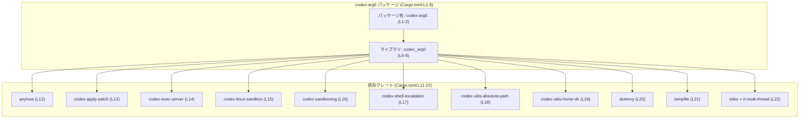
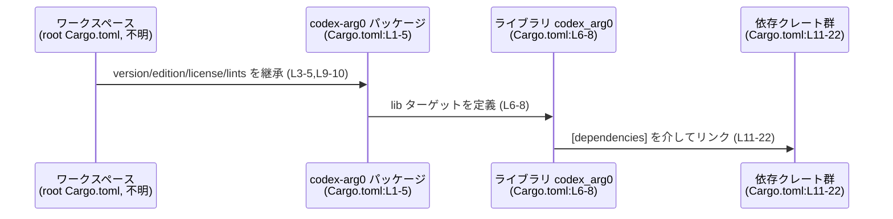

# arg0/Cargo.toml コード解説

## 0. ざっくり一言

`arg0/Cargo.toml` は、ライブラリクレート `codex-arg0`（クレート名 `codex_arg0`）のメタデータと、ワークスペース共通の設定・依存クレートを宣言するマニフェストファイルです（`Cargo.toml:L1-22`）。  

---

## 1. このモジュールの役割

### 1.1 概要

- このファイルは **Rust の Cargo マニフェスト**であり、パッケージ名・ライブラリターゲット・依存クレート・ワークスペース設定を定義します（`Cargo.toml:L1-22`）。
- コード本体は `src/lib.rs` にあり（`Cargo.toml:L6-8`）、公開 API やコアロジックはこのチャンクには現れません。
- エラー処理・サンドボックス・プロセス実行・パス操作・環境変数読み取り・一時ファイル・非同期ランタイムといった機能を提供するクレートを依存として利用可能な状態にします（`Cargo.toml:L12-22`）。

### 1.2 アーキテクチャ内での位置づけ

`codex-arg0` はワークスペース内の 1 つのライブラリクレートであり、複数のワークスペース依存クレートにリンクします（`Cargo.toml:L3-4,L10-11`）。



この図は、**ビルド時・リンク時の依存関係**のみを表します。各依存クレート内の関数呼び出しや実行時データフローは、本チャンクからは分かりません。

### 1.3 設計上のポイント

コードから読み取れる設計上の特徴は次のとおりです。

- **ワークスペース集中管理**  
  - パッケージの `version`・`edition`・`license` はワークスペースから継承しています（`Cargo.toml:L3-5`）。
  - 依存クレートもすべて `workspace = true` で宣言されており（`Cargo.toml:L12-22`）、バージョンやソースはワークスペースルートで一元管理されます。
  - lints（コンパイラ警告などの設定）もワークスペースに委譲しています（`Cargo.toml:L9-10`）。

- **ライブラリ専用クレート**  
  - `[lib]` セクションのみが定義されており、バイナリターゲット（`[[bin]]`）は現れません（`Cargo.toml:L6-8`）。  
    → 他のクレートからインポートされて利用されることを主目的とする構成です。

- **エラー処理と非同期実行のための依存**  
  - `anyhow` 依存があり（`Cargo.toml:L12`）、汎用的なエラー型を利用可能な設計です（ただし実際の使用状況は不明）。
  - `tokio` に `rt-multi-thread` フィーチャが有効化されており（`Cargo.toml:L22`）、**マルチスレッド非同期ランタイム**を利用可能な状態でビルドされます。  
    実際に tokio ランタイムを起動しているかどうか、本チャンクからは分かりません。

- **サンドボックスや実行環境に関する内部クレート群**  
  - `codex-apply-patch`, `codex-exec-server`, `codex-linux-sandbox`, `codex-sandboxing`, `codex-shell-escalation` など、名前から実行環境やサンドボックスに関係しそうなクレートが依存として宣言されています（`Cargo.toml:L13-17`）。  
    ただし、具体的な API や使用方法はこのチャンクには現れません。

---

## 2. 主要な機能一覧（マニフェストとして）

このファイル自体は関数や型を定義しませんが、**クレート単位の機能**として次を提供します。

- パッケージ定義:  
  - `codex-arg0` パッケージと、そのライブラリターゲット `codex_arg0` の定義（`Cargo.toml:L1-2,L6-8`）。
- ワークスペース設定の継承:  
  - バージョン / edition / license / lints をワークスペースから継承（`Cargo.toml:L3-5,L9-10`）。
- 依存クレートの宣言:  
  - エラー処理 (`anyhow`)、非同期ランタイム (`tokio`)、一時ファイル (`tempfile`)、環境変数読み込み (`dotenvy`)、パス・ホームディレクトリ処理 (`codex-utils-*`)、サンドボックス・実行制御関連 (`codex-*`) への依存を宣言（`Cargo.toml:L12-22`）。

---

## 3. 公開 API と詳細解説

### 3.1 コンポーネントインベントリー（このファイルで確認できるもの）

このチャンクに現れる「コンポーネント」（パッケージ／ターゲット／依存クレート）の一覧です。

#### パッケージ・ライブラリターゲット

| 名前 | 種別 | 定義位置 | 根拠 | 説明 |
|------|------|----------|------|------|
| `codex-arg0` | Cargo パッケージ名 | `Cargo.toml:L1-2` | `[package]` セクションと `name` 行 | ワークスペース内の 1 パッケージとして登録される名前です。 |
| `codex_arg0` | ライブラリクレート名 | `Cargo.toml:L6-8` | `[lib]` セクションの `name` と `path` | Rust コードから `use codex_arg0::...;` のようにインポートされるクレート名です。コード本体は `src/lib.rs` にあります。 |

#### 依存クレート

| 名前 | 種別 | 定義位置 | 根拠 | 説明（用途は一般的な説明であり、このクレートでの実際の使用は不明） |
|------|------|----------|------|------------------------------------------------------------|
| `anyhow` | 依存クレート | `Cargo.toml:L12` | `[dependencies]` 内の行 | 一般的にエラー型 `anyhow::Error` / `anyhow::Result<T>` を提供するクレートです。 |
| `codex-apply-patch` | ワークスペース依存 | `Cargo.toml:L13` | 同上 | パッチ適用に関連すると考えられる内部クレート名ですが、詳細は本チャンクには現れません。 |
| `codex-exec-server` | ワークスペース依存 | `Cargo.toml:L14` | 同上 | コマンド実行サーバーに関連しそうな名前です。API 内容は不明です。 |
| `codex-linux-sandbox` | ワークスペース依存 | `Cargo.toml:L15` | 同上 | Linux サンドボックス機能に関連する可能性がありますが、詳細は不明です。 |
| `codex-sandboxing` | ワークスペース依存 | `Cargo.toml:L16` | 同上 | サンドボックス化の共通ロジックを提供している可能性があります。 |
| `codex-shell-escalation` | ワークスペース依存 | `Cargo.toml:L17` | 同上 | シェル経由の権限昇格処理に関連すると考えられる名前です。 |
| `codex-utils-absolute-path` | ワークスペース依存 | `Cargo.toml:L18` | 同上 | 絶対パス計算のユーティリティと推測されます。 |
| `codex-utils-home-dir` | ワークスペース依存 | `Cargo.toml:L19` | 同上 | ホームディレクトリに関するユーティリティと推測されます。 |
| `dotenvy` | 依存クレート | `Cargo.toml:L20` | 同上 | 一般に `.env` ファイルから環境変数を読み込むクレートです。 |
| `tempfile` | 依存クレート | `Cargo.toml:L21` | 同上 | 一般に一時ファイル／ディレクトリを安全に生成するクレートです。 |
| `tokio` (feature: `rt-multi-thread`) | 依存クレート | `Cargo.toml:L22` | 同上 | 一般に非同期 I/O ランタイムを提供するクレートで、この設定ではマルチスレッドランタイム機能が有効です。 |

> 上の「用途」列はクレート名から分かる一般的な説明です。  
> 実際に `codex_arg0` 内でこれらの機能がどう使われているかは、このチャンクには現れません。

#### 関数・構造体インベントリー

- このファイルは **Cargo マニフェスト**であり、Rust の関数・構造体・列挙体などの定義は含まれていません。  
  → 関数／構造体インベントリーは、このチャンクに関しては「なし」となります。  
  → 実際の公開 API は `src/lib.rs` などに定義されており、本チャンクには現れません（`Cargo.toml:L6-8`）。

### 3.2 関数詳細

- `Cargo.toml` には関数・メソッド・型定義が存在しないため、このセクションで詳細を解説できる **公開関数はありません**。
- 公開 API の具体的なシグネチャやエラー型、並行性モデルは、このファイル以外（`src/lib.rs` など）のコードを確認しないと分かりません。

### 3.3 その他の関数

- 同上の理由により、このファイルから把握できる補助関数・内部関数もありません。

---

## 4. データフロー

### 4.1 ビルド時の依存解決フロー（このファイルから分かる範囲）

実行時のデータフローや関数呼び出し関係は本チャンクには現れないため、ここでは **ビルド時の依存解決フロー**を示します。



- **要点**  
  - ワークスペースルートの `Cargo.toml`（パスはこのチャンクからは不明）に記述された共通設定と依存の詳細が、`workspace = true` を通じて `codex-arg0` に適用されます（`Cargo.toml:L3-5,L10,L12-22`）。
  - `codex_arg0` ライブラリコード（`src/lib.rs`）は、ビルド時にここで宣言された依存クレートとリンクされます（`Cargo.toml:L6-8,L11-22`）。
  - 実行時に、どの関数がどの依存クレートを呼び出すかといった **コールグラフやデータフロー**は、このチャンクには現れません。

---

## 5. 使い方（How to Use）

### 5.1 基本的な使用方法（外部クレートからの利用）

`codex-arg0` はライブラリクレートとして定義されているため（`Cargo.toml:L6-8`）、他のクレートから利用されることを想定できます。利用例は次のようになります。

#### 1. 他クレートの `Cargo.toml` で依存を追加（例）

```toml
[dependencies]
codex-arg0 = { workspace = true }
```

- これは **同じワークスペース内**に `codex-arg0` パッケージがあるケースの一例です。  
  実際のワークスペース構成はこのチャンクには現れないため、ここでは一般的な形として示しています。

#### 2. Rust コードからライブラリをインポート（例）

```rust
// 実際の公開 API（関数名・構造体名など）はこのチャンクから分からないため、仮の例です。
use codex_arg0; // クレート名は Cargo.toml の [lib].name = "codex_arg0" に対応 (L7)

// 具体的な API:
// fn some_main_entry(...) -> anyhow::Result<()>;
// といった関数が存在する可能性はありますが、このチャンクでは確認できません。
```

> 実際の `use` 対象（モジュール名や関数名）は `src/lib.rs` などのコードを参照する必要があります。

### 5.2 よくある使用パターン（推測できない点）

- **非同期 API の有無**  
  - `tokio` の `rt-multi-thread` フィーチャが有効化されているため（`Cargo.toml:L22`）、`async fn` や `tokio::spawn` などを利用した API が存在する可能性があります。
  - ただし、本チャンクには API の具体例がないため、「同期 API / 非同期 API のどちらを提供するか」は分かりません。

- **エラー処理のスタイル**  
  - `anyhow` 依存があるため（`Cargo.toml:L12`）、`anyhow::Result<T>` を返すエントリポイント関数が存在するケースが考えられます。
  - これもコード本体がないため、実際のシグネチャは不明です。

### 5.3 よくある間違い（Cargo.toml 観点）

このマニフェストに関連して起こり得る典型的な間違いを挙げます。いずれも一般論であり、本プロジェクトで実際に起きているかは不明です。

```toml
# 誤り例: ワークスペース管理を無視して勝手にバージョンを指定
[dependencies]
tokio = "1.20"
```

```toml
# 望ましい形の一例: ワークスペースに統一を任せる（本ファイルと同様）
[dependencies]
tokio = { workspace = true }
```

- `version.workspace = true` や `dependencies.*.workspace = true` を使っている場合（`Cargo.toml:L3,L12-22`）、  
  個別パッケージ側でバージョンを勝手に指定すると、ワークスペースの方針と齟齬が出ることがあります。

### 5.4 使用上の注意点（まとめ）

- **ワークスペース前提**  
  - `version.workspace = true` や `dependencies.*.workspace = true` に依存しているため（`Cargo.toml:L3,L12-22`）、  
    このパッケージ単体ではビルドできず、ワークスペースルートの `Cargo.toml` が必要です。
- **依存バージョンの変更場所**  
  - 依存クレートのバージョンやフィーチャを変えたい場合、このファイルではなく **ワークスペースルートの `Cargo.toml`** を編集する設計になっています。
- **非同期ランタイムの二重起動**（一般論）  
  - `tokio` の `rt-multi-thread` を有効にしているプロジェクトでは（`Cargo.toml:L22`）、  
    複数箇所で `tokio::runtime::Runtime` を乱立させると複雑な並行性問題が生じやすくなります。  
  - ただし、`codex_arg0` 内で tokio ランタイムがどのように使われているかは、このチャンクには現れません。

---

## 6. 変更の仕方（How to Modify）

### 6.1 新しい機能を追加する場合（依存追加の観点）

**前提:** 公開 API やコアロジックの追加自体は `src/lib.rs` などのコードファイル側で行われます。ここでは、そのために必要なマニフェスト変更だけを説明します。

1. **新しい依存クレートを追加する**
   - 例として、別のユーティリティクレートを追加したい場合:

   ```toml
   [dependencies]
   anyhow = { workspace = true }                 # 既存 (L12)
   # 新規依存の例（実際に必要かどうかはコード次第）
   serde = { workspace = true }
   ```

   - 実際には、ワークスペースルートの `Cargo.toml` に `serde` の定義を追加する必要があります（このチャンクには現れません）。

2. **既存の内部クレートを再利用する**
   - サンドボックス制御などを拡張したい場合は、まず `codex-sandboxing` など既存依存の API を検討するのが自然です（`Cargo.toml:L16`）。
   - どのクレートにどの機能があるかはコードやドキュメントを確認する必要があります。

3. **ライブラリ API を `src/lib.rs` に追加**
   - マニフェストからは分かりませんが、新機能のエントリポイントとなる関数や構造体を `codex_arg0` クレートに追加します。
   - その際、`anyhow` を使ったエラー型や、`tokio` を使った `async fn` など、既存依存を活用すると一貫性が保ちやすくなります（これは一般的な指針であり、現状のコードスタイルは本チャンクからは不明です）。

### 6.2 既存の機能を変更する場合（影響範囲の考え方）

- **依存クレートの変更**
  - 依存追加・削除・フィーチャ変更を行う場合は、
    - このファイルの `[dependencies]`（`Cargo.toml:L11-22`）
    - ワークスペースルート側の依存定義  
    の双方への影響を確認する必要があります。
  - 特に `tokio` や `anyhow` のような基盤的な依存を削除・変更すると、`src/lib.rs` 以下の広範囲に影響する可能性があります。

- **ライブラリターゲットの変更**
  - `name = "codex_arg0"` や `path = "src/lib.rs"` を変更すると（`Cargo.toml:L7-8`）、  
    他クレートからの `use codex_arg0::...` という参照がすべて壊れる可能性があります。
  - 変更前に、ワークスペース内での参照箇所を検索しておく必要があります。

- **契約・前提条件（Contracts）の観点**
  - このファイル自体が明示する契約は主に「このパッケージはライブラリであり、これらの依存クレートを利用可能とする」という点にあります。
  - 公開 API の引数・戻り値・エラー条件などの契約は、`src/lib.rs` 以降のコードで定義されており、このチャンクには現れません。

---

## 7. 関連ファイル

このマニフェストから、密接に関係すると分かるファイル・モジュールは次のとおりです。

| パス | 役割 / 関係 | 根拠 |
|------|-------------|------|
| `src/lib.rs` | ライブラリクレート `codex_arg0` のエントリポイント。公開 API やコアロジックが定義されると推測されます。 | `Cargo.toml` の `[lib]` セクションで `path = "src/lib.rs"` と指定（`Cargo.toml:L6-8`）。 |
| （ワークスペースルートの `Cargo.toml`、パス不明） | バージョン・edition・license・lints・依存クレートの詳細を定義しているファイル。ここから本パッケージが設定を継承します。 | `version.workspace = true`・`edition.workspace = true`・`license.workspace = true`・`[lints] workspace = true`・各依存の `workspace = true`（`Cargo.toml:L3-5,L9-10,L12-22`）。 |

> テストコード（`tests/` ディレクトリなど）や、各 `codex-*` 依存クレートの実装ファイルは、このチャンクには現れないため、ここでは列挙できません。

---

### Bugs / Security / Edge cases（このファイルから分かる範囲でのまとめ）

- **Bugs**  
  - この `Cargo.toml` には明らかな構文エラーや矛盾は見当たりません（`[package]`, `[lib]`, `[dependencies]` の構造が正当な形になっています: `Cargo.toml:L1-22`）。
  - 実際のバグの有無は、コード本体がないと評価できません。

- **Security（依存レベルの注意点／一般論）**
  - `codex-shell-escalation` など特権に関わりそうなクレートへの依存があり（`Cargo.toml:L17`）、もし利用されていれば入力バリデーションや権限管理が重要になります。ただし実際の使用は不明です。
  - `dotenvy` や `home-dir`・`absolute-path` 系ユーティリティを組み合わせる場合、パス・環境変数をユーザー入力から生成する際の検証が重要になります（`Cargo.toml:L18-20`）。

- **Edge cases / Contracts（マニフェスト自身のエッジケース）**
  - ワークスペースルートで `anyhow` や `tokio` の依存が削除・名称変更された場合、このファイルの `workspace = true` 宣言が解決できずビルドエラーになります（`Cargo.toml:L12-22`）。
  - `src/lib.rs` が存在しない、またはコンパイルエラーがある場合、このパッケージはビルドできません（`Cargo.toml:L6-8`）。これもこのチャンク単独では確認できません。

このファイルに関しては以上です。公開 API やコアロジック、Rust 特有の安全性・エラー・並行性の詳細を把握するには、`src/lib.rs` 以降のコードが必要になります。
