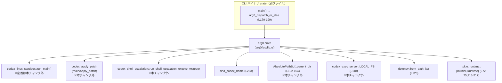
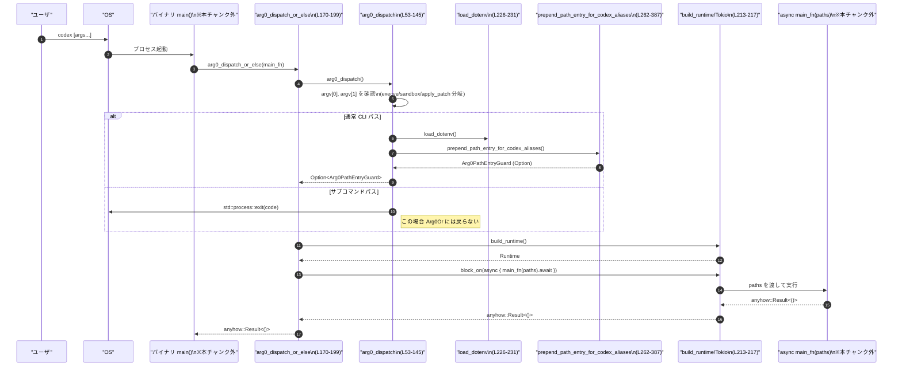

# arg0/src/lib.rs コード解説

> ここで示す行番号は、提示されたコードチャンクの先頭行を 1 として数えたものです（実ファイルの行番号と一致する保証はありません）。  
> 形式: `arg0/src/lib.rs:L開始-終了`

---

## 0. ざっくり一言

このモジュールは、Codex CLI を **単一バイナリで複数のサブコマンドに見せかけるための「arg0 ディスパッチ」処理と、そのための PATH エイリアス管理** を行うユーティリティです。  
Tokio ランタイムの初期化、`.env` 読み込み、補助バイナリ用パスの配布もまとめて担当します。

---

## 1. このモジュールの役割

### 1.1 概要

このモジュールは、次の問題を解決するために存在します（`arg0/src/lib.rs` 全体）:

- **問題**  
  - Codex を単一の CLI バイナリとして配布したいが、`codex-linux-sandbox` や `apply_patch` など、複数の CLI として振る舞わせたい。
  - PATH や `.env` の操作はプロセス全体に影響し、スレッド安全性やセキュリティに注意が必要。
- **提供する機能**
  - 実行ファイル名（argv[0]）に応じて、Linux サンドボックスや apply_patch などの **サブコマンドにディスパッチ** する (`arg0_dispatch`, `arg0_dispatch_or_else`)。
  - `apply_patch` などの **エイリアスを一時ディレクトリに作成し、PATH へ一時的に追加** する (`prepend_path_entry_for_codex_aliases`)。
  - `~/.codex/.env` から環境変数を読み込むが、`CODEX_` で始まる内部用変数は上書きさせない (`load_dotenv`, `set_filtered`)。
  - Tokio マルチスレッドランタイムの構築 (`build_runtime`)。

### 1.2 アーキテクチャ内での位置づけ

このモジュールは、他のバイナリ crate の `main()` をラップする「入口」として動作し、Codex の他コンポーネントに橋渡しします。

主な依存関係は次の通りです（呼び出し元/呼び出し先の関係）:



- CLI バイナリは `arg0_dispatch_or_else` を呼び出し、ここから
  - `arg0_dispatch` → `.env` 読み込み・PATH エイリアス追加
  - Tokio ランタイム構築 (`build_runtime`)
  - 呼び出し元が渡した `async main_fn` を実行  
 という流れになります（`arg0/src/lib.rs:L53-145, L170-199`）。

### 1.3 設計上のポイント

コードから読み取れる設計上の特徴をまとめます。

- **責務の分割**（`Arg0DispatchPaths`, `Arg0PathEntryGuard`, `arg0_dispatch*`）
  - `Arg0DispatchPaths`（L20-30）は、呼び出し元に渡す「再実行に必要なパス」の集約構造体。
  - `Arg0PathEntryGuard`（L32-37）は、一時ディレクトリとロックファイルを保持し、**エイリアス PATH エントリの寿命をガード** します。
  - `arg0_dispatch`（L53-145）は「argv[0]/argv[1] に基づくディスパッチと前処理（dotenv, PATH）」のみ担当。
  - `arg0_dispatch_or_else`（L170-199）は「Tokio ランタイム構築と、呼び出し元の async main 実行」を担当。

- **状態とライフタイム管理**
  - 状態は基本的に
    - 環境変数（グローバル状態）
    - ファイルシステム上の一時ディレクトリ＋ロックファイル
  に閉じており、Rust の構造体で表現される **長期状態は `Arg0PathEntryGuard` のみ** です。

- **エラーハンドリング方針**
  - 「サブコマンドとして独立して動く」パス（execve wrapper / apply_patch）は、**`std::process::exit` によるプロセス終了** を使う（L68-85, L129）。
  - メイン CLI パスでは、`anyhow::Result<()>` や `std::io::Result` を返し、呼び出し元にエラーを伝搬（L170-199, L262-387, L389-430）。
  - PATH 更新失敗など「致命的でない」失敗は `eprintln!` で警告して継続（L136-144, L291-293）。

- **並行性の配慮**
  - 環境変数の変更は **Tokio ランタイム構築前、スレッド生成前** に行う（L132-134, L260-261 のコメント）。
  - プロセス間の競合（複数インスタンスが同じ temp root を使う）は、**ロックファイル＋非ブロッキングロック** で制御（L300-307, L418-430, L389-415）。

- **セキュリティ**
  - `.env` から読み込む環境変数は、`CODEX_` プレフィックス付きキーを拒否し、アプリ内部の変数を上書きさせない（L220-226, L239-245）。
  - 非 debug ビルドでは、`codex_home` がシステムの temp ディレクトリ配下である場合を拒否（L263-276）。
  - Unix では、一時ディレクトリを 0o700 に設定し、他ユーザからのアクセスを制限（L282-288）。

---

## 2. 主要な機能一覧

このモジュールが提供する主要機能は次の通りです。

- arg0 ディスパッチ:
  - 実行ファイル名（argv[0]）に基づき、`codex-linux-sandbox` / `apply_patch` / execve wrapper / 通常 CLI のどれとして振る舞うかを決定（`arg0_dispatch`, L53-145）。
- 非同期 main ラッパ:
  - Tokio ランタイムを構築し、`async` な main 関数を `anyhow::Result<()>` として実行（`arg0_dispatch_or_else`, L170-199）。
- PATH エイリアス管理:
  - `apply_patch` などのエイリアスを一時ディレクトリに作成し、そのディレクトリを PATH の先頭に追加（`prepend_path_entry_for_codex_aliases`, L262-387）。
  - 一時ディレクトリとロックファイルを RAII で保持（`Arg0PathEntryGuard`, L32-50）。
- dotenv 読み込みとフィルタリング:
  - `~/.codex/.env` の読み込み、`CODEX_` プレフィックス付き変数のフィルタリング（`load_dotenv`, `set_filtered`, L222-246）。
- サンドボックスパス解決:
  - Linux 上で `codex-linux-sandbox` エイリアスを優先して再実行パスを決定（`linux_sandbox_exe_path`, L201-211）。
- 古い一時ディレクトリの掃除:
  - 未ロック状態のセッションディレクトリのみを削除する清掃処理（`janitor_cleanup`, `try_lock_dir`, L389-430）。

### 2.1 コンポーネント一覧（インベントリー）

| 名前 | 種別 | 公開? | 行範囲 | 役割 |
|------|------|-------|--------|------|
| `APPLY_PATCH_ARG0` | `const &str` | 非公開 | L13 | `apply_patch` エイリアス名 |
| `MISSPELLED_APPLY_PATCH_ARG0` | `const &str` | 非公開 | L14 | `applypatch`（旧/誤記）エイリアス名 |
| `EXECVE_WRAPPER_ARG0` | `const &str` | 非公開 (`#[cfg(unix)]`) | L15-16 | execve ラッパ用エイリアス名 |
| `LOCK_FILENAME` | `const &str` | 非公開 | L17 | ロックファイル名 `.lock` |
| `TOKIO_WORKER_STACK_SIZE_BYTES` | `const usize` | 非公開 | L18 | Tokio worker スレッドのスタックサイズ |
| `Arg0DispatchPaths` | 構造体 | 公開 | L20-30 | 再実行に必要な補助バイナリのパス群 |
| `Arg0PathEntryGuard` | 構造体 | 公開 | L32-37 | 一時 PATH エントリとロックの RAII ガード |
| `Arg0PathEntryGuard::new` | 関数（関連） | 非公開 | L39-46 | ガードの生成（テストからも使用） |
| `Arg0PathEntryGuard::paths` | メソッド | 公開 | L48-50 | 内部の `Arg0DispatchPaths` 参照を取得 |
| `arg0_dispatch` | 関数 | 公開 | L53-145 | argv[0]/argv[1] に応じたディスパッチ＋dotenv/PATH 初期化 |
| `arg0_dispatch_or_else` | 関数 | 公開 | L170-199 | ランタイム構築＋`async main` 実行ラッパ |
| `linux_sandbox_exe_path` | 関数 | 非公開 | L201-211 | Linux サンドボックス用の実行パス決定 |
| `build_runtime` | 関数 | 非公開 | L213-217 | Tokio マルチスレッドランタイム構築 |
| `ILLEGAL_ENV_VAR_PREFIX` | `const &str` | 非公開 | L220 | フィルタ対象の変数プレフィックス `"CODEX_"` |
| `load_dotenv` | 関数 | 非公開 | L222-231 | `~/.codex/.env` 読み込み＋フィルタ適用 |
| `set_filtered` | 関数(ジェネリック) | 非公開 | L234-245 | `.env` イテレータから安全な環境変数のみ設定 |
| `prepend_path_entry_for_codex_aliases` | 関数 | 公開 | L248-387 | 一時ディレクトリ作成・エイリアス生成・PATH 先頭追加 |
| `janitor_cleanup` | 関数 | 非公開 | L389-415 | 古いセッションディレクトリの削除 |
| `try_lock_dir` | 関数 | 非公開 | L418-430 | ディレクトリの `.lock` を非ブロッキング取得 |
| `tests::create_lock` | 関数 | テスト専用 | L446-454 | テスト用ロックファイル生成 |
| `tests::linux_sandbox_exe_path_prefers_*` | テスト関数 | テスト専用 | L456-476 | サンドボックスパスの優先順位テスト |
| `tests::janitor_*` | テスト関数 | テスト専用 | L478-515 | janitor の挙動テスト（ロック有無/保持状態別） |

---

## 3. 公開 API と詳細解説

### 3.1 型一覧（構造体）

| 名前 | 種別 | フィールド | 役割 / 用途 | 根拠 |
|------|------|-----------|-------------|------|
| `Arg0DispatchPaths` | 構造体 | `codex_self_exe: Option<PathBuf>` | 現在の Codex 実行ファイルのパス。テストハーネス下でも安定して子プロセスの `argv[0]` に使えるようにする（L20-27）。 | `arg0/src/lib.rs:L20-27` |
| | | `codex_linux_sandbox_exe: Option<PathBuf>` | Linux サンドボックス用ヘルパーの実行パス。なければ `codex_self_exe` などにフォールバック（L28, L185-191, L201-211）。 | `arg0/src/lib.rs:L28,L185-191,L201-211` |
| | | `main_execve_wrapper_exe: Option<PathBuf>` | execve ラッパ（`codex-execve-wrapper`）へのパス（L29, L192-195, L374-383）。 | `arg0/src/lib.rs:L29,L192-195,L374-383` |
| `Arg0PathEntryGuard` | 構造体 | `_temp_dir: TempDir` | セッション用一時ディレクトリ。スコープ終了時に削除される（L32-35, L295-298）。 | `arg0/src/lib.rs:L32-35,L295-298` |
| | | `_lock_file: File` | ディレクトリに対する `.lock` ファイル。保持中は janitor に削除されない（L35, L300-307, L389-415）。 | `arg0/src/lib.rs:L35,L300-307,L389-415` |
| | | `paths: Arg0DispatchPaths` | 補助バイナリへのパスを格納（L36）。`paths()` で外部に提供（L48-50）。 | `arg0/src/lib.rs:L36,L48-50` |

`Arg0PathEntryGuard` は公開構造体ですが、コンストラクタ `new` は非公開であり、通常は `prepend_path_entry_for_codex_aliases` や `arg0_dispatch` を通じて取得します（L39-46, L262-387, L53-145）。

---

### 3.2 関数詳細（主要 7 件）

#### `arg0_dispatch() -> Option<Arg0PathEntryGuard>`

**概要**

- 実行ファイル名および第 1 引数に応じて、以下を行います（L53-145）:
  - `codex-execve-wrapper` として呼ばれた場合: 特権昇格ラッパを実行して即座に `exit`。
  - `codex-linux-sandbox` / `apply_patch` または `applypatch` として呼ばれた場合: 各専用エントリポイントを実行。
  - `--codex-run-as-apply-patch`（`CODEX_CORE_APPLY_PATCH_ARG1`）が最初の引数の場合: ライブラリ版 `apply_patch` を実行し `exit`。
  - それ以外の通常 CLI 呼び出しの場合: `.env` を読み込み、PATH にエイリアスを追加し、そのガード（`Arg0PathEntryGuard`）を返す。

**引数**

- なし（環境変数 `args_os()` / `args()` およびグローバル状態を利用）。

**戻り値**

- `Some(Arg0PathEntryGuard)`:
  - `prepend_path_entry_for_codex_aliases` が成功し、一時 PATH エントリが有効な場合（L136-138）。
- `None`:
  - PATH 更新に失敗した場合（警告を出して継続、L139-144）。
  - 「サブコマンドとして即時 `exit` したケース」は戻り値が発生しない（プロセス終了）。

**内部処理の流れ**

1. `std::env::args_os()` から argv[0] を取り出し、パスの末尾名（ファイル名）を UTF-8 として取得（失敗時は `""`）（L55-60）。
2. （Unix のみ）`exe_name == "codex-execve-wrapper"` なら、`std::env::args()` から引数を取得し、`tokio::runtime::Builder::new_current_thread()` でランタイムを作成、`codex_shell_escalation::run_shell_escalation_execve_wrapper` を実行し、その終了コードで `std::process::exit`（L62-85）。
3. `exe_name == CODEX_LINUX_SANDBOX_ARG0` なら `codex_linux_sandbox::run_main()` を呼び出し（コメント上「never returns」, L88-90）。
   - そうでなく `exe_name == "apply_patch"` または `"applypatch"` なら `codex_apply_patch::main()` を呼び出し（L91-93）。
4. argv[1] を取得し（なくても `OsString::new()`）、`argv1 == CODEX_CORE_APPLY_PATCH_ARG1` なら:
   - パッチ引数を UTF-8 文字列として取り出す（取れなければエラーメッセージを表示して exit 1, L95-127）。
   - 現在ディレクトリを `AbsolutePathBuf::current_dir` で取得（失敗時は exit 1, L102-105）。
   - current-thread Tokio ランタイムを構築し（失敗時 exit 1, L106-112）、`codex_apply_patch::apply_patch` を実行。成功なら exit 0, 失敗なら exit 1（L113-122, L129）。
5. ここまでで `exit` していなければ通常 CLI パス:
   - `.env` を読み込むため `load_dotenv()` を呼び出し（L132-134）。
   - `prepend_path_entry_for_codex_aliases()` を呼び出して PATH エイリアスディレクトリを作成（L136-144）。
     - 成功時: `Some(Arg0PathEntryGuard)` を返す。
     - 失敗時: `WARNING` を標準エラーに出力し、`None` を返す。

**Examples（使用例）**

この関数は通常、直接ではなく `arg0_dispatch_or_else` から呼ばれます（L178）。  
テストや特殊用途で直接使う場合のイメージ:

```rust
// 例: PATH エイリアスだけ前もって用意したいケース
fn main() -> anyhow::Result<()> {
    // サブコマンドであればこの呼び出しの中で exit する
    let guard = arg0::arg0_dispatch(); // Option<Arg0PathEntryGuard>

    if let Some(guard) = &guard {
        // 生成されたエイリアスパスにアクセスできる
        if let Some(sandbox) = &guard.paths().codex_linux_sandbox_exe {
            eprintln!("sandbox helper at {:?}", sandbox);
        }
    }

    // 本来は後続で Tokio ランタイムを作って async main へ進む
    Ok(())
}
```

**Errors / Panics**

- `arg0_dispatch` 自体は `Result` を返さず、内部で **プロセス終了 (`std::process::exit`) を多用** します（L68-69, L77-78, L83-85, L104-105, L111-112, L129）。
  - そのため、「エラーとして呼び出し元に戻る」ことはなく、終了コードでのみ失敗を表現する経路が多数あります。
- パニックの可能性:
  - 標準ライブラリ関数がパニックを起こすケース（`std::env::args_os` など）は通常ありません。
  - この関数内で明示的な `panic!` 呼び出しはありません。

**Edge cases（エッジケース）**

- argv[0] が存在しない場合:
  - `args.next().unwrap_or_default()` により空の `OsString` として扱われ、`exe_name` は `""` になり、どの別名にもマッチせず通常 CLI パスに入ります（L55-60）。
- argv[1] が存在しない場合:
  - `argv1` は空の `OsString` になり、`CODEX_CORE_APPLY_PATCH_ARG1` には一致しないため apply_patch サブコマンド分岐をスキップ（L95-96）。
- パッチパスが非 UTF-8 の場合:
  - `to_str()` が `None` を返し、`patch_arg` が `None` となるため、エラーメッセージを表示して exit 1（L97-127）。

**使用上の注意点**

- この関数は **環境変数の変更や一時ディレクトリ作成などの副作用を持つ** ため、複数回呼び出す設計は想定されていないと解釈できます（コードから明示はされていませんが、`TempDir` ライフタイムや PATH 更新から）。
- `std::process::exit` による終了は Rust のデストラクタを実行しないため、**リソースの解放やログ出力などは `arg0_dispatch` より前に依存しない設計** が必要です。

---

#### `arg0_dispatch_or_else<F, Fut>(main_fn: F) -> anyhow::Result<()>`  

（L170-199）

**概要**

- 「Codex CLI の `main()` 関数をラップするためのエントリポイント」です。
- `arg0_dispatch` でサブコマンド処理・dotenv・PATH 初期化を行った後、Tokio マルチスレッドランタイムを構築し、呼び出し元が渡した `async main_fn` を `Arg0DispatchPaths` とともに実行します。

**引数**

| 引数名 | 型 | 説明 |
|--------|----|------|
| `main_fn` | `F` where `F: FnOnce(Arg0DispatchPaths) -> Fut` | メインの async 関数ファクトリ。`Arg0DispatchPaths` を受け取り、`Fut`（`Future<Output = anyhow::Result<()>>`）を返すクロージャ（L170-173）。 |

**戻り値**

- `anyhow::Result<()>`:
  - `build_runtime` の失敗 (`tokio::runtime::Builder::build()` の失敗) または
  - `main_fn(paths).await` の失敗  
  のいずれかを `anyhow::Error` としてラップして返します（L182-198）。

**内部処理の流れ**

1. `arg0_dispatch()` を呼び出し、PATH 初期化およびサブコマンド処理を行い、その結果の `Option<Arg0PathEntryGuard>` を保持（L178）。
2. `build_runtime()` を呼び出して Tokio マルチスレッドランタイムを構築（L182）。
3. `runtime.block_on(async move { ... })` で以下の async ブロックを実行（L183-198）:
   - `std::env::current_exe().ok()` で現在の実行ファイルパス取得（UTF-8 失敗などは `None` を許容, L184）。
   - `Arg0DispatchPaths` を構築（L185-195）:
     - `codex_self_exe`: 上記 `current_exe.clone()`。
     - `codex_linux_sandbox_exe`: Linux の場合のみ `linux_sandbox_exe_path(path_entry_guard.as_ref(), current_exe)`、それ以外は `None`（L185-191）。
     - `main_execve_wrapper_exe`: `path_entry_guard` が `Some` ならそこから `main_execve_wrapper_exe` を取り出す（L192-195）。
   - 渡された `main_fn(paths).await` を実行し、その `anyhow::Result<()>` を呼び出し元へ返す（L197-198）。

**Examples（使用例）**

CLI バイナリ crate の `main()` での典型的な使い方イメージ（`codex_core` などの詳細はこのチャンクには現れません）:

```rust
use arg0::arg0_dispatch_or_else;
use arg0::Arg0DispatchPaths;

fn main() -> anyhow::Result<()> {
    arg0_dispatch_or_else(|paths: Arg0DispatchPaths| async move {
        // paths からサンドボックスや execve wrapper のパスを取得できる
        if let Some(sandbox_exe) = &paths.codex_linux_sandbox_exe {
            eprintln!("sandbox helper: {:?}", sandbox_exe);
        }

        // ここで実際の CLI ロジックを実行する
        // 例えば Config を組み立ててメイン処理を呼び出す、など。
        Ok(())
    })
}
```

**Errors / Panics**

- `build_runtime()?` により、Tokio ランタイム構築失敗時には `Err(anyhow::Error)` を返します（L182-183, L213-217）。
- `main_fn(paths).await` が `Err` を返した場合も、そのまま `anyhow::Error` として呼び出し元に伝搬されます（L197-198）。
- 明示的な `panic!` はありません。

**Edge cases**

- `arg0_dispatch()` が `None` を返した場合（PATH 初期化失敗）でも、`path_entry_guard.as_ref()` は `None` となり、`linux_sandbox_exe_path` は `current_exe` をそのまま返します（L178-189, L201-211）。
  - このため、**サンドボックスパスの解決や execve wrapper は degrade しつつ動作継続** します。
- `current_exe()` が失敗した場合は `codex_self_exe: None` となり、その情報に依存する処理は呼び出し側で考慮が必要です（L184-186）。

**使用上の注意点**

- **既に Tokio ランタイム内にいるコンテキスト** からこの関数を呼ぶと、内部で新たにマルチスレッドランタイムを作ることになるため、設計上注意が必要です（ネストしたランタイムは一般に避けるべきですが、このチャンク単体からは利用規約を断定できません）。
- 環境変数の変更や PATH エントリ追加は `arg0_dispatch()` によって行われるため、**`arg0_dispatch_or_else` は `main()` から一度だけ呼び出す前提** で設計されていると解釈できます。

---

#### `prepend_path_entry_for_codex_aliases() -> std::io::Result<Arg0PathEntryGuard>`  

（L262-387）

**概要**

- Codex 用のホームディレクトリ配下に、一時ディレクトリを作成し、その中に:
  - `apply_patch` / `applypatch`（および条件付きで `codex-linux-sandbox`, `codex-execve-wrapper`）へのエイリアス
- を作成した上で、そのディレクトリを PATH 先頭に追加し、ライフタイムをガードする `Arg0PathEntryGuard` を返します。

**引数**

- なし（`find_codex_home()` と環境変数 `PATH` を使用）。

**戻り値**

- `Ok(Arg0PathEntryGuard)`:
  - 一時ディレクトリ・ロックの取得・エイリアス作成・PATH 更新が全て成功した場合。
- `Err(std::io::Error)`:
  - `find_codex_home()`、ディレクトリ作成、ロック取得、シンボリックリンク作成、バッチスクリプト作成、PATH 更新のいずれかで I/O エラー等が発生した場合。

**内部処理の流れ**

1. `find_codex_home()` で Codex 用ホームディレクトリを決定（L263）。
2. 非 debug ビルドでは、`codex_home` が `std::env::temp_dir()` 配下であればエラーを返す（L264-276）。
3. `codex_home` および `codex_home/tmp/arg0` を作成（L278-281）。
4. Unix の場合、`temp_root` の permissions を 0o700 に設定（L282-288）。
5. `janitor_cleanup(&temp_root)` で古いセッションディレクトリを削除（失敗時は警告だけ出して続行, L290-293）。
6. `tempfile::Builder::new().prefix("codex-arg0").tempdir_in(&temp_root)` で新しい一時ディレクトリを生成し、`path` を取得（L295-298）。
7. `path.join(".lock")` を開き、`lock_file.try_lock()?` で非ブロッキングロックを取得（L300-307）。
8. エイリアス対象のファイル名一覧に対してループ（L309-316）:
   - `current_exe()` を取得（L317）。
   - Unix では `symlink(&exe, &link)` を作成（L319-323）。
   - Windows では `.bat` スクリプトを生成し、`apply_patch` を `CODEX_CORE_APPLY_PATCH_ARG1` 経由で本体にフォワード（L325-337）。
9. OS ごとの `PATH_SEPARATOR`（`:` or `;`）を定義し（L340-344）、既存の PATH を取得（L346-356）。
10. `path` + PATH_SEPARATOR + 既存 PATH の順で連結した `updated_path_env_var` を作り、`set_var("PATH", updated_path_env_var)` で PATH を更新（L346-360）。
11. `Arg0DispatchPaths` を組み立て（`current_exe().ok()` / path 結合, L362-384）、`Arg0PathEntryGuard::new(temp_dir, lock_file, paths)` を返す（L386-387）。

**Examples（使用例）**

`arg0_dispatch()` によって内部的に呼び出されるのが基本ですが、単体利用のイメージは以下の通りです。

```rust
use arg0::{prepend_path_entry_for_codex_aliases, Arg0DispatchPaths};

fn main() -> std::io::Result<()> {
    let guard = prepend_path_entry_for_codex_aliases()?; // PATH に一時エイリアスを追加

    // エイリアスパスを確認
    let paths: &Arg0DispatchPaths = guard.paths();
    println!("codex self exe: {:?}", paths.codex_self_exe);

    // guard がスコープを抜けると一時ディレクトリが削除される
    Ok(())
}
```

**Errors / Panics**

- `find_codex_home()` 失敗 → `Err`（L263）。
- 非 debug ビルドで `codex_home` が system temp 配下 → `ErrorKind::InvalidInput` で `Err`（L267-275）。
- ディレクトリ作成、権限変更、ロック取得、シンボリックリンク作成/バッチ作成、PATH 更新（`set_var` はここでは `unsafe` ブロック内ですが `set_var` 自体は `Result` を返さず、ここでの失敗はパニックにはなりません）で I/O エラーがあれば `Err`（L278-287, L300-307, L317-337, L346-360）。

**Edge cases**

- 既存の `PATH` が存在しない場合:
  - `std::env::var_os("PATH")` が `None` を返し、新しい PATH は `path` 単独になります（L346-356）。
- 既に同名のエイリアスファイルが存在する場合:
  - `symlink` や `std::fs::write` の時点でエラーになる可能性がありますが、その挙動は OS/API に依存します。コード上は `?` で I/O エラーとして上位へ返します（L321-323, L327-337）。
- `janitor_cleanup` の失敗:
  - `Err(err)` でも `eprintln!` を出して処理続行するため、古い一時ディレクトリが残存することがあります（L290-293）。

**使用上の注意点**

- 関数コメントに明示されている通り、**マルチスレッドを開始する前に呼び出す必要があります**（L260-261）。  
  環境変数 PATH の書き換えはプロセス全体に影響し、スレッド間で競合すると挙動が不定になるためです。
- 返された `Arg0PathEntryGuard` がドロップされると、一時ディレクトリがクリーンアップされます。  
  **エイリアスを必要とするあいだはガードを保持しておく契約** が暗黙に存在します。

---

#### `linux_sandbox_exe_path(path_entry_guard: Option<&Arg0PathEntryGuard>, current_exe: Option<PathBuf>) -> Option<PathBuf>`  

（L201-211）

**概要**

- Linux 上でサンドボックスを再実行するための実行ファイルパスを決定します。
- `Arg0PathEntryGuard` 経由で得られる `codex-linux-sandbox` エイリアスを優先し、それがない場合は `current_exe` を返します（L205-211）。

**引数**

| 引数名 | 型 | 説明 |
|--------|----|------|
| `path_entry_guard` | `Option<&Arg0PathEntryGuard>` | PATH エイリアスを保持しているガード。`None` の場合はエイリアスがない前提。 |
| `current_exe` | `Option<PathBuf>` | `std::env::current_exe().ok()` などから取得した現在の実行ファイルパス（L184, L201-204）。 |

**戻り値**

- `Some(PathBuf)`:
  - `path_entry_guard` 内の `codex_linux_sandbox_exe` が `Some` の場合、それを返す。
  - そうでなければ `current_exe` をそのまま返す。
- `None`:
  - エイリアスも `current_exe` も `None` の場合。

**内部処理**

- `path_entry_guard.and_then(|g| g.paths().codex_linux_sandbox_exe.clone()).or(current_exe)`  
  というメソッドチェーンで実装されています（L208-210）。

**Examples（使用例）**

テストコードでは、エイリアスが存在する場合にそれを優先することを検証しています（L456-476）。

```rust
let sandbox_path = linux_sandbox_exe_path(path_entry_guard.as_ref(), current_exe);
```

**Edge cases / 注意点**

- `path_entry_guard` が `None` の場合、単純に `current_exe` を返すだけなので、**PATH エイリアスが失敗していてもサンドボックス自体は起動可能** です（`argv[0]` が `codex-linux-sandbox` であれば `arg0_dispatch` 側でディスパッチされる設計）。
- `current_exe` も `None` の場合は `None` となるので、呼び出し側はこのケースを考慮する必要があります。

---

#### `build_runtime() -> anyhow::Result<tokio::runtime::Runtime>`  

（L213-217）

**概要**

- Tokio マルチスレッドランタイムの標準構成（`enable_all` + ワーカースタック 16 MiB）を構築します。

**引数 / 戻り値**

- 引数なし。
- `Ok(Runtime)` または `Err(anyhow::Error)`（`builder.build()?` に起因）。

**内部処理**

1. `tokio::runtime::Builder::new_multi_thread()` でビルダー作成（L214）。
2. `enable_all()` で I/O / タイマーなど全機能を有効化（L215）。
3. `thread_stack_size(TOKIO_WORKER_STACK_SIZE_BYTES)` でワーカースレッドのスタックサイズを 16 MiB に設定（L216, L18）。
4. `builder.build()?` を `anyhow::Result` に変換して返却（L217）。

**注意点**

- スタックサイズを明示的に大きめに指定しているため、大量のワーカーが立つ環境では **メモリフットプリントが増加** しますが、再帰的処理や深いスタックを必要とするコードに対する余裕も確保しています。

---

#### `load_dotenv()`  

（L222-231）

**概要**

- `find_codex_home()` によって決定される `~/.codex` ディレクトリから `.env` を読み込み、その内容を `set_filtered` 経由で環境変数に反映します。
- `CODEX_` プレフィックス付き変数は `.env` から上書きできないようにフィルタされます。

**内部処理**

1. `find_codex_home()` が `Ok(codex_home)` を返し、かつ `dotenvy::from_path_iter(codex_home.join(".env"))` が `Ok(iter)` を返した場合のみ（if-let ガード, L227-229）。
2. `set_filtered(iter)` を呼び出して、フィルタ付きで環境変数をセット（L230）。

**Errors / Edge cases**

- `find_codex_home()` または `from_path_iter` が `Err` の場合は何もせず戻る（L227-229）。
  - エラーはログにも出さず、呼び出し元には伝搬しません。
- `.env` 内の個々のエントリのパースエラーは `set_filtered` 側で `flatten()` により無視されます（L239）。

**使用上の注意点**

- `.env` による `CODEX_` 変数の上書きはできません（セキュリティコメント, L224-225）。
- エラーがサイレントに無視されるため、**`.env` に問題があっても気付きにくい** ことに注意が必要です（ログ出力はありません）。

---

#### `set_filtered<I>(iter: I)`  

（L234-245）

**概要**

- `dotenvy::from_path_iter` が返すイテレータを受け取り、`CODEX_` プレフィックスで始まる環境変数名をスキップし、それ以外のみを `std::env::set_var` で設定します。

**引数**

| 引数名 | 型 | 説明 |
|--------|----|------|
| `iter` | `I` where `I: IntoIterator<Item = Result<(String, String), dotenvy::Error>>` | `.env` エントリのイテレータ。各要素が `Ok((key, value))` または `Err(dotenvy::Error)`。 |

**内部処理**

1. `iter.into_iter().flatten()` により、`Err` 要素をスキップし、`(key, value)` のみ取り出す（L239）。
2. 各 `(key, value)` について、`key.to_ascii_uppercase().starts_with("CODEX_")` を判定し、**プレフィックスを持たないものだけ** を `set_var` で設定（L240-243）。
3. `set_var` 呼び出しは `unsafe` ブロックに包まれており、「プロセスが単一スレッドであること」を前提としたコメントが付いています（L241-243）。

**Errors / Panics**

- `std::env::set_var` は panic しないのが通常であり、`Result` も返さないため、ここで `Err` を返すことはありません。
- 非 UTF-8 の値は `.env` 側で `String` として渡されているため、この関数の範囲では考慮不要です。

**Edge cases / 使用上の注意点**

- `ILLEGAL_ENV_VAR_PREFIX` は `"CODEX_"`（L220）であり、`key.to_ascii_uppercase()` を使っているため、`codex_path` など小文字や混在ケースもブロックされます（L240）。
- `unsafe` ブロックの前提通り、**この関数はスレッドが立ち上がる前にのみ呼び出される想定** です（`load_dotenv` → `arg0_dispatch` → ランタイム構築という順序, L132-134, L170-183）。

---

#### `janitor_cleanup(temp_root: &Path) -> std::io::Result<()>`  

（L389-415）

**概要**

- `temp_root` 以下のセッションディレクトリを走査し、**ロックが取れるディレクトリのみ** を削除します。
- これにより、異常終了などで残った古い一時ディレクトリをクリーンアップしつつ、**別プロセスが使用中のディレクトリは削除しない** ようになっています。

**引数**

| 引数名 | 型 | 説明 |
|--------|----|------|
| `temp_root` | `&Path` | セッションディレクトリ群を含むルートディレクトリ（`codex_home/tmp/arg0` 等, L280-281, L389）。 |

**戻り値**

- `Ok(())`: 走査と、削除可能なディレクトリの削除が成功した場合。
- `Err(std::io::Error)`: `read_dir` や `remove_dir_all` などの I/O 操作が失敗した場合。

**内部処理**

1. `std::fs::read_dir(temp_root)` を試みる（L390）。
   - `NotFound` エラーの場合は「そもそも temp_root がない」と判断し `Ok(())` で早期リターン（L392）。
2. `entries.flatten()` で、エントリ取得に失敗したものをスキップしつつ、各エントリの `path` を取り出す（L396-397）。
3. `path.is_dir()` でディレクトリのみ対象にし、それ以外はスキップ（L398-400）。
4. `try_lock_dir(&path)?` を呼ぶ（L403）:
   - ロック取得に成功すれば `Some(lock_file)` が返り、そうでなければ `None`。
   - `None` の場合は「使用中 or ロックファイルなし」とみなしてスキップ（L402-405）。
5. ロック取得済みのディレクトリに対して `std::fs::remove_dir_all(&path)` を呼ぶ（L407）。
   - `NotFound` エラーは TOCTOU レースとして無視（L409-410）。
   - その他のエラーは `Err` として返す（L411）。

**Examples（使用例）**

`prepend_path_entry_for_codex_aliases` から呼び出されます（L290-293）。テストでは次のケースが検証されています（L478-515）。

- `.lock` が存在しないディレクトリ → 削除されない（L478-487）。
- `.lock` はあるがロック保持中 → 削除されない（L490-501）。
- `.lock` があり、ロックを保持していない → 削除される（L505-514）。

**使用上の注意点**

- この関数は temp_root 配下の **サブディレクトリ全てに対して動作** するため、新たなサブディレクトリを追加する場合は `.lock` の有無と意味を整合させる必要があります。

---

### 3.3 その他の関数

| 関数名 | 役割 | 根拠 |
|--------|------|------|
| `Arg0PathEntryGuard::new(temp_dir, lock_file, paths) -> Self` | `Arg0PathEntryGuard` のコンストラクタ。`temp_dir` のライフタイム、ロックファイル、および `Arg0DispatchPaths` をフィールドに格納する（主に `prepend_path_entry_for_codex_aliases` とテストで使用, L39-46, L386-387, L461-469）。 | `arg0/src/lib.rs:L39-46,L386-387,L461-469` |
| `Arg0PathEntryGuard::paths(&self) -> &Arg0DispatchPaths` | 内部の `paths` フィールドへのイミュータブル参照を返す（L48-50）。 | `arg0/src/lib.rs:L48-50` |
| `try_lock_dir(dir: &Path) -> std::io::Result<Option<File>>` | `dir/.lock` を読み取り/書き込みモードで開き、`try_lock()` で非ブロッキングロックを試みる。成功すれば `Ok(Some(File))`、なければ `Ok(None)`、エラー時は `Err`（L418-430）。`janitor_cleanup` 専用のヘルパー。 | `arg0/src/lib.rs:L418-430` |
| `tests::create_lock` | テスト専用。指定ディレクトリに `.lock` ファイルを作成（L446-454）。 | `arg0/src/lib.rs:L446-454` |
| テスト 4 件 | `linux_sandbox_exe_path` の優先順位、および `janitor_cleanup` の挙動（ロックなし/保持中/非保持）を検証（L456-515）。 | `arg0/src/lib.rs:L456-515` |

---

## 4. データフロー

ここでは、**通常の CLI 実行パス**（argv[0] が Codex 本体、argv[1] 以降が CLI 引数）の代表的な処理フローを示します。

### 4.1 高レベルフロー（説明）

1. OS が Codex バイナリを起動し、バイナリの `main()` が `arg0_dispatch_or_else(main_fn)` を呼び出します（`main()` はこのチャンクには現れません）。
2. `arg0_dispatch` が呼ばれ、execve wrapper / sandbox / apply_patch のいずれかならすぐに `exit` し、通常 CLI なら `.env` 読み込みおよび PATH エイリアス生成を行い、`Arg0PathEntryGuard` を返します（L53-145）。
3. `arg0_dispatch_or_else` が Tokio マルチスレッドランタイムを構築し（L213-217）、`Arg0DispatchPaths` を組み立てて、呼び出し元が提供した `main_fn(paths)` を `block_on` で待機します（L170-199）。
4. `main_fn` 内では、`Arg0DispatchPaths` から必要な補助バイナリパスを利用しながら、アプリケーション本体の処理が行われます（本チャンクには現れない）。

### 4.2 シーケンス図



---

## 5. 使い方（How to Use）

### 5.1 基本的な使用方法

最も典型的な利用は、**CLI バイナリの `main()` を `arg0_dispatch_or_else` でラップする** パターンです。

```rust
// src/main.rs （例）                                 // CLI バイナリ側の main
use arg0::{arg0_dispatch_or_else, Arg0DispatchPaths};  // 本モジュールの公開 API をインポート

fn main() -> anyhow::Result<()> {                      // 同期 main は anyhow::Result<()> を返す
    arg0_dispatch_or_else(|paths: Arg0DispatchPaths| async move {
        // paths から補助バイナリのパスを取得できる
        if let Some(self_exe) = &paths.codex_self_exe { // Codex 本体の実行パス
            eprintln!("running from {:?}", self_exe);
        }

        // ここで実際の CLI ロジックを実装する
        // 例: コマンドライン解析、サブコマンド実行など
        Ok(())
    })
}
```

この書き方をすると、次のことが自動的に行われます。

- `codex-linux-sandbox` / `apply_patch` などの **別名で起動された場合は arg0 層で処理され、`main_fn` は呼ばれません**。
- 通常 CLI の場合:
  - `.env`（`~/.codex/.env`）が読み込まれ、
  - `apply_patch` 等のエイリアスが一時ディレクトリに作成され、
  - Tokio マルチスレッドランタイムが構築され、
  - `main_fn(paths)` が実行されます。

### 5.2 よくある使用パターン

1. **エイリアス PATH のみを事前に作成したい場合**

   CLI 起動前にエイリアスを用意し、別プロセスから `apply_patch` 等を呼び出したいようなテスト/ツール用途:

   ```rust
   use arg0::prepend_path_entry_for_codex_aliases;

   fn main() -> std::io::Result<()> {
       let _guard = prepend_path_entry_for_codex_aliases()?; // エイリアスが PATH に追加される

       // ここから先、同一プロセス内や子プロセスから apply_patch を呼び出せる
       // _guard が生きている間は一時ディレクトリが削除されない

       Ok(())
   }
   ```

2. **Linux サンドボックスの再実行パスを取得したい場合**

   `Arg0DispatchPaths` を使って、サンドボックス再実行に使う実行ファイルを決める:

   ```rust
   use arg0::Arg0DispatchPaths;

   async fn run_with_sandbox(paths: Arg0DispatchPaths) -> anyhow::Result<()> {
       if let Some(sandbox_exe) = &paths.codex_linux_sandbox_exe {
           // sandbox_exe を使って子プロセスを起動する、など。
           eprintln!("sandbox helper is {:?}", sandbox_exe);
       }
       Ok(())
   }
   ```

### 5.3 よくある間違い

```rust
// 間違い例: スレッド起動後に PATH を変更している
fn main() -> std::io::Result<()> {
    std::thread::spawn(|| {
        // 何らかの処理
    });

    // ここで PATH を書き換えるのは安全性に問題がある
    let _guard = arg0::prepend_path_entry_for_codex_aliases()?; // NG（設計上想定外）

    Ok(())
}
```

```rust
// 正しい例: スレッド起動前に PATH を変更
fn main() -> anyhow::Result<()> {
    arg0::arg0_dispatch_or_else(|paths| async move {
        // ここに来るまでに PATH は初期化済みで、スレッドもまだ作られていない
        // 安全に Tokio のマルチスレッドランタイムが使える
        Ok(())
    })
}
```

別の誤用パターン:

```rust
// 間違い例: Arg0PathEntryGuard をすぐにドロップしてしまう
fn main() -> std::io::Result<()> {
    let guard = arg0::prepend_path_entry_for_codex_aliases()?;
    drop(guard); // ここで一時ディレクトリが解放される

    // 以降は apply_patch エイリアスが存在しない可能性がある
    Ok(())
}
```

### 5.4 使用上の注意点（まとめ）

- **スレッド安全性**
  - `load_dotenv` と `prepend_path_entry_for_codex_aliases` 内の `set_var` は、「スレッド生成前にのみ呼ばれる」という前提で `unsafe` ブロックで実行されています（L241-243, L358-360）。  
    実際の利用では、**`arg0_dispatch_or_else` を `main()` から一度だけ呼び出す** ことが重要です。
- **ライフタイム**
  - `Arg0PathEntryGuard` がドロップされると、一時ディレクトリとロックファイルが解放されるため、**それ以降はエイリアスの存在を前提にしない** 必要があります。
- **セキュリティ**
  - `.env` からの `CODEX_` 変数上書きは禁止されており（L220-225, L239-245）、プロジェクト側 `.env` で内部用環境変数を変更しようとしても反映されません。
  - 非 debug ビルドで system temp 配下の `codex_home` を拒否するチェックがあるため、`find_codex_home` の設定・動作と合わせて注意が必要です（L263-276）。

---

## 6. 変更の仕方（How to Modify）

### 6.1 新しい機能（新しいエイリアス CLI 等）を追加する場合

「argv[0] による新しいディスパッチ」を増やす場合の手順例です。

1. **エイリアス名の定義**
   - 新しい `const` を追加（例: `const NEW_TOOL_ARG0: &str = "codex-new-tool";`）  
     適切な場所: 既存の `APPLY_PATCH_ARG0` などの定義付近（L13-18）。

2. **PATH エイリアスの生成**
   - `prepend_path_entry_for_codex_aliases` の `for filename in &[ ... ]` 配列に新エイリアスを追加（L309-316）。
   - Linux / Windows 両方でどう振る舞うか（シンボリックリンク vs `.bat`）を確認。

3. **argv[0] によるディスパッチ**
   - `arg0_dispatch` の `if exe_name == ...` チェーンに新しい分岐を追加（L88-93 付近）。
   - 必要なら、`codex_*` 系の別モジュールの `run_main` 相当を呼び出す（そのモジュールの定義は本チャンクには現れません）。

4. **`Arg0DispatchPaths` への追加が必要か検討**
   - 子プロセスや別箇所から再利用したい場合は、`Arg0DispatchPaths` に新しいフィールドを追加し、`prepend_path_entry_for_codex_aliases` と `arg0_dispatch_or_else` 内でその値を設定する（L20-29, L362-384, L185-195）。

### 6.2 既存の機能を変更する場合の注意点

- **環境変数読み込み (`load_dotenv` / `set_filtered`)**
  - `CODEX_` プレフィックスの扱いを変える場合は、`ILLEGAL_ENV_VAR_PREFIX` と `set_filtered` の条件（L220, L239-245）を両方確認する必要があります。
  - エラーの扱い（現在はサイレント）を変えたい場合は、`load_dotenv` で `Err` をログ出力・伝搬するかどうかを検討します（L227-231）。

- **janitor の動作**
  - セッションディレクトリの命名規則や `.lock` ファイル名を変える場合は、`LOCK_FILENAME`（L17）、`janitor_cleanup`（L389-415）、`try_lock_dir`（L418-430）、およびテスト（L456-515）を一貫して更新する必要があります。

- **Tokio ランタイム構成**
  - ワーカースタックサイズやマルチスレッド/シングルスレッドの選択を変える場合は `build_runtime`（L213-217）を変更するとともに、
    - `arg0_dispatch` の `current_thread` ランタイム使用部（L72-75, L106-112）との一貫性も確認が必要です。

- **エラー伝搬 vs `std::process::exit`**
  - どの経路で `exit` し、どの経路で `Result` を返すかは現在のように混在しています。  
    振る舞いを変更する場合は、CLI の UX（終了コードやメッセージ）も含めて影響範囲を確認する必要があります。

---

## 7. 関連ファイル

このモジュールから利用されている外部モジュール・crate は次の通りです。  
いずれも実装はこのチャンクには現れません。

| パス / 項目 | 役割 / 関係 |
|-------------|------------|
| `codex_apply_patch::CODEX_CORE_APPLY_PATCH_ARG1` | apply_patch サブコマンドを識別する「秘密の」引数名（L6, L95-129）。 |
| `codex_apply_patch::main` / `codex_apply_patch::apply_patch` | `apply_patch` CLI / ライブラリのエントリポイント（L91-93, L113-122）。本チャンクからは詳細不明。 |
| `codex_sandboxing::landlock::CODEX_LINUX_SANDBOX_ARG0` | `codex-linux-sandbox` エイリアス名用の定数（L7, L88-90, L312-313）。 |
| `codex_linux_sandbox::run_main` | Linux サンドボックス動作用のメイン。コメント上「never returns」（L88-90）。 |
| `codex_shell_escalation::run_shell_escalation_execve_wrapper` | execve ラッパ `codex-execve-wrapper` が利用する特権昇格用処理（L80-81）。 |
| `codex_utils_home_dir::find_codex_home` | Codex 用のホームディレクトリを特定する関数。PATH エイリアス作成時に使用（L8, L263）。 |
| `codex_utils_absolute_path::AbsolutePathBuf::current_dir` | カレントディレクトリを絶対パスとして取得（L102-105）。 |
| `codex_exec_server::LOCAL_FS` | `apply_patch` 実行時に渡されるローカルファイルシステム実装（L118）。 |
| `dotenvy::from_path_iter` | `.env` ファイルの読み込み（L228-229）。 |
| `tokio::runtime::{Builder, Runtime}` | `current_thread` / `multi_thread` ランタイム構築に使用（L72-75, L106-112, L213-217）。 |

テストコードは同一ファイル内 `mod tests` に存在し、`linux_sandbox_exe_path` と `janitor_cleanup` の挙動を検証しています（L433-515）。  

---

## Bugs / Security / Contracts / Tests / Performance（まとめ）

最後に、ユーザ指定の観点ごとに要点のみ簡潔にまとめます。

- **Bugs（潜在的な問題点）**
  - `.env` 読み込み失敗や `.env` 内個別エントリのパース失敗がサイレントに無視されるため、設定ミスに気付きにくい（L227-231, L239）。
  - `unsafe { set_var(...) }` 自体は UB を生むわけではありませんが、「シングルスレッドであること」という暗黙契約に依存しています（L241-243, L358-360）。

- **Security**
  - `.env` から `CODEX_` 変数を上書きできない設計（L220-225, L239-245）は、ユーザプロジェクトから内部設定を乗っ取られないための防御と解釈できます。
  - temp root の権限を 0o700 に制限し、system temp 下への展開を非 debug ビルドで拒否することにより、他ユーザへの影響・競合を抑制しています（L264-276, L282-288）。

- **Contracts / Edge Cases**
  - PATH や環境変数の変更は「スレッド生成前」という前提（コメントおよび `unsafe` ブロック, L132-134, L260-261, L241-243, L358-360）。
  - `Arg0PathEntryGuard` のライフタイム = エイリアスの有効期間という契約（L32-37, L295-298）。
  - `janitor_cleanup` は「`.lock` ありかつロック可能なディレクトリのみ削除」という契約（L389-415, テスト L478-515）。

- **Tests**
  - `linux_sandbox_exe_path` の優先順位（エイリアス優先）を `linux_sandbox_exe_path_prefers_codex_linux_sandbox_alias` で検証（L456-476）。
  - `janitor_cleanup` の 3 パターン（ロックなし / ロック保持中 / ロック非保持）をそれぞれ検証し、契約がテストでカバーされています（L478-515）。

- **Performance / Scalability**
  - Tokio ランタイムはマルチスレッドで、ワーカーごとに 16 MiB スタックを確保するため、並列度が高いとメモリ使用量が増加する可能性があります（L18, L213-217）。
  - `janitor_cleanup` は起動時に `temp_root` 配下の全ディレクトリを走査しますが、通常はセッション数が限定的であり、起動時のみの一回きり処理です（L389-415）。

この情報を基に、既存のコードを安全に呼び出しつつ、新しいサブコマンドやエイリアスを追加する際の参考にできる構成になっています。
