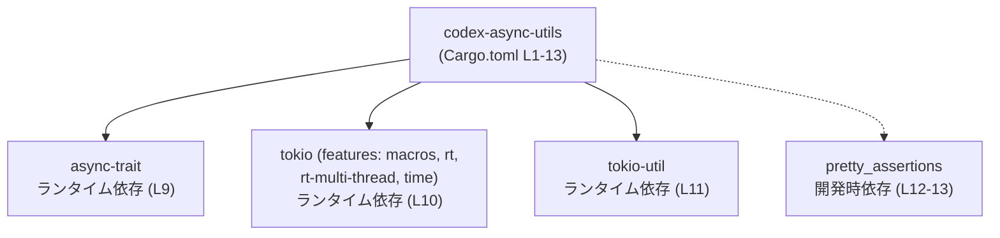
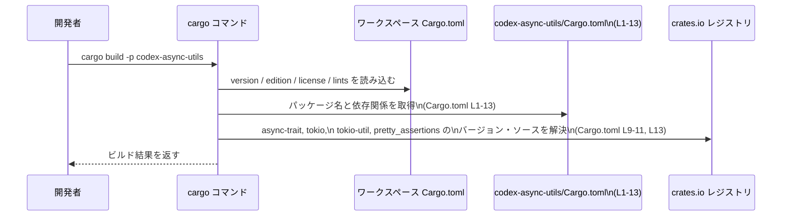

# async-utils/Cargo.toml コード解説

## 0. ざっくり一言

`async-utils/Cargo.toml` は、Rust クレート `codex-async-utils` の Cargo マニフェストであり、ワークスペース共通設定と、非同期処理関連クレート（`async-trait`, `tokio`, `tokio-util`）および開発時専用クレート `pretty_assertions` への依存を宣言するファイルです（Cargo.toml:L1-13）。

---

## 1. このモジュールの役割

### 1.1 概要

- このファイルは、`codex-async-utils` クレートの **パッケージメタデータ** と **依存関係** を宣言する役割を持ちます（Cargo.toml:L1-2, L8-13）。
- バージョン、エディション、ライセンス、lint 設定などは、ワークスペース側の設定を継承する構成になっています（Cargo.toml:L3-5, L6-7）。
- 非同期処理用の主要クレート `async-trait`, `tokio`, `tokio-util` をランタイム依存として宣言し（Cargo.toml:L9-11）、テスト等で `pretty_assertions` を利用できるようにしています（Cargo.toml:L12-13）。

このファイル自体には Rust コード（関数・型定義）は含まれていません。

### 1.2 アーキテクチャ内での位置づけ

`codex-async-utils` クレートが、どの外部クレートに依存しているかを示した依存関係図です。



- `async-trait` は async 関数を含むトレイトを扱うためのクレートです（依存宣言: Cargo.toml:L9）。
- `tokio` は非同期ランタイムであり、`macros`, `rt`, `rt-multi-thread`, `time` の機能が有効化されています（Cargo.toml:L10）。
- `tokio-util` は tokio 向けの補助ユーティリティクレートです（Cargo.toml:L11）。
- `pretty_assertions` は開発時（テストなど）に利用されるアサーション改善クレートです（Cargo.toml:L12-13）。

### 1.3 設計上のポイント

- **ワークスペース一元管理**  
  - `version.workspace = true`、`edition.workspace = true`、`license.workspace = true` により、バージョン・エディション・ライセンスはワークスペース共通設定から継承されます（Cargo.toml:L3-5）。
  - lint 設定も `[lints]` セクションで `workspace = true` とすることで一元管理されています（Cargo.toml:L6-7）。
- **非同期処理・並行性の前提**  
  - 非同期トレイト用の `async-trait` と、マルチスレッド対応の tokio ランタイム（`rt-multi-thread`）を依存に含める構成になっています（Cargo.toml:L9-10）。
  - tokio の `macros` 機能を有効化しているため、`#[tokio::main]` や `#[tokio::test]` などのマクロを利用できる設定です（Cargo.toml:L10）。
- **テスト・開発体験**  
  - `[dev-dependencies]` に `pretty_assertions` を指定し、テスト時の差分表示を見やすくする構成が可能になっています（Cargo.toml:L12-13）。

---

## 2. 主要な機能一覧（このファイルが提供する構成要素）

このファイルは実行時 API ではなく「構成」を提供します。その主要な役割は次のとおりです。

- パッケージ定義:  
  - クレート名 `codex-async-utils` を定義し（Cargo.toml:L2）、バージョン・エディション・ライセンスをワークスペースから継承します（Cargo.toml:L3-5）。
- lint 設定の継承:  
  - `[lints]` セクションでワークスペース共通の lint 設定を有効化します（Cargo.toml:L6-7）。
- 非同期関連ランタイム依存の宣言:  
  - `async-trait`, `tokio`（指定された機能付き）, `tokio-util` をランタイム依存として宣言します（Cargo.toml:L8-11）。
- 開発時依存の宣言:  
  - `pretty_assertions` を開発・テスト用の依存として宣言します（Cargo.toml:L12-13）。

---

## 3. 公開 API と詳細解説

### 3.1 型一覧（構造体・列挙体など）

このファイルは Rust のソースコードではなく、設定ファイル（TOML）です。そのため Rust の型定義は含まれていません。

| 名前 | 種別 | 役割 / 用途 |
|------|------|-------------|
| (なし) | - | このファイルには Rust の型定義は存在しません（Cargo.toml:L1-13） |

### 3.2 関数詳細（該当なし）

- `async-utils/Cargo.toml` は関数やメソッドを定義するファイルではありません。
- 公開 API やコアロジック（実際の非同期処理・エラー処理・並行処理の実装）は Rust ソースコード側（例: `src/*.rs` など）に存在するはずですが、その内容はこのチャンクには現れていません（Cargo.toml:L1-13）。
- そのため、本セクションでテンプレートに基づいて詳述すべき関数は「該当なし」となります。

### 3.3 その他の関数

- 同上の理由で、このファイルから読み取れる関数・メソッドはありません（Cargo.toml:L1-13）。

---

## 4. データフロー

ここでは、「この `Cargo.toml` がビルド時にどのように利用されるか」という観点のフローを示します。  
Rust の一般的な Cargo ワークスペースの挙動に基づく説明であり、`codex-async-utils` 固有のロジックは含みません。

### 4.1 ビルド時のフロー（Cargo と依存解決）



要点:

- `version.workspace = true` などの指定により、バージョンやエディションはワークスペースのルート `Cargo.toml` から供給されます（Cargo.toml:L3-5）。
- `[dependencies]` / `[dev-dependencies]` セクションの記述に基づき、Cargo が `async-trait`, `tokio`, `tokio-util`, `pretty_assertions` を解決します（Cargo.toml:L8-13）。
- 解決された依存クレートはコンパイル時にリンクされ、非同期処理／並行処理の実装は Rust コード側で行われます。このファイルからその内容は分かりません。

---

## 5. 使い方（How to Use）

### 5.1 基本的な使用方法

このファイルは開発者が直接「呼び出す」ものではなく、Cargo がビルドやテストの際に利用します。

代表的な利用方法（コマンド）は次の通りです。

```bash
# ワークスペース全体をビルドする
cargo build

# codex-async-utils クレートのみをビルドする
cargo build -p codex-async-utils

# テストを実行する（pretty_assertions が利用される可能性がある）
cargo test -p codex-async-utils
```

- これらのコマンド実行時に、Cargo が `async-utils/Cargo.toml` を読み取り、依存関係を解決します（Cargo.toml:L8-13）。

### 5.2 よくある使用パターン（依存の追加・変更）

依存関係を追加・変更する際は、すでにあるパターンに揃えるのが基本です。

```toml
[dependencies]                         # ランタイム依存クレートのセクション (Cargo.toml:L8)
async-trait.workspace = true          # async-trait のバージョンはワークスペースで一元管理 (L9)
tokio = {                             # tokio 依存の設定 (L10)
    workspace = true,                 # バージョンはワークスペース側で管理
    features = [
        "macros",                    # tokio のマクロ機能（#[tokio::main] 等）を有効化 (L10)
        "rt",                        # 基本ランタイム機能 (L10)
        "rt-multi-thread",           # マルチスレッドランタイム (L10)
        "time",                      # 時刻・タイマー関連ユーティリティ (L10)
    ],
}
tokio-util.workspace = true           # tokio 補助ユーティリティもワークスペースでバージョン管理 (L11)
# 例: 新しい依存を追加する場合（実際のファイルには未記載）
# anyhow.workspace = true            # エラー処理クレートをワークスペース管理で追加する例
```

- 新しい依存を追加する場合も、可能なら `xxx.workspace = true` 形式に揃え、バージョンはワークスペース側で管理する構成が想定されます。
- 実際にどの依存が必要かは、Rust コード側の実装内容に依存し、このチャンクからは分かりません。

### 5.3 よくある間違い（推定される注意点）

このファイル構成から推定される、起こり得る誤りとその影響を挙げます。

- **`.workspace = true` を削除してバージョン未指定のままにする**  
  - 例: `version.workspace = true` を削除して `version = "..."` も書かない場合（Cargo.toml:L3）。
  - Cargo はバージョンが未指定としてエラーになります。  
  - 同様に依存クレートに対しても、`workspace = true` を削除した場合は `version = "..."` などを明示的に指定する必要があります（Cargo.toml:L9-11, L13）。
- **tokio の機能フラグを不用意に削る**  
  - `rt-multi-thread` や `time` を削除すると、コード側でマルチスレッドランタイムや時間ユーティリティに依存している場合にコンパイルエラーになります（Cargo.toml:L10）。
  - このファイルからはコード側の依存関係までは分からないため、削除前にコード検索やビルドで確認する必要があります。

### 5.4 使用上の注意点（まとめ）

- **ワークスペース設定との整合性**  
  - `.workspace = true` が付いている項目（version, edition, license, 各依存）の実体はワークスペースルートの `Cargo.toml` にあります（Cargo.toml:L3-5, L9, L11, L13）。  
    ワークスペース側の変更がこのクレートにも一括して影響する点に注意が必要です。
- **並行性・非同期ランタイム**  
  - tokio の `rt-multi-thread` 機能が前提になっているため、コード側もマルチスレッドランタイムの特性（スレッド間共有、`Send`／`Sync` 制約など）を考慮した実装になっている可能性があります（Cargo.toml:L10）。  
    このファイルだけではその実装の詳細は不明です。
- **セキュリティ・依存バージョン**  
  - このファイルには具体的なバージョン番号が書かれておらず、ワークスペース側で管理されています（Cargo.toml:L3-5, L9, L11, L13）。  
    依存のセキュリティ状況（既知の脆弱性の有無など）を評価するには、ワークスペースルートの `Cargo.toml` と `Cargo.lock` を確認する必要があります。

---

## 6. 変更の仕方（How to Modify）

### 6.1 新しい機能を追加する場合（依存追加）

新しい機能を実装する際、外部クレートに依存したくなる場合があります。その場合の一般的な手順です。

1. **ワークスペース側に依存を追加するか検討する**  
   - 既存の依存がすべて `xxx.workspace = true` で宣言されているため（Cargo.toml:L3-5, L9, L11, L13）、  
     新しい依存もワークスペース共通で使う場合は、まずワークスペースルート `Cargo.toml` の `[workspace.dependencies]` 等に追加する構成が自然です。  
   - ワークスペース側の定義はこのチャンクには現れません。

2. **`async-utils/Cargo.toml` に依存を宣言する**  
   - ワークスペース側に追加した依存を、このファイルでは `xxx.workspace = true` で参照する形にします（既存の `async-trait` 等と同様: Cargo.toml:L9-11）。
   - ワークスペースで共有しない依存であれば、通常の `version = "..."` 指定による追加も可能です。

3. **tokio 機能を増やす／変更する場合**  
   - 例えば、ブロッキング I/O 用機能が必要になれば、`features` 配列に `blocking` などを追加します（Cargo.toml:L10 が tokio 機能指定の根拠）。
   - 機能フラグの追加・削除はコンパイルエラーに直結しやすいため、変更後は必ずビルドとテストを実行します。

### 6.2 既存の機能を変更する場合（依存・ランタイム構成の変更）

- **tokio ランタイム構成を変更する**  
  - `rt-multi-thread` を `rt` のみに変更するなど、ランタイムの並行性モデルを切り替える場合は、コード側でマルチスレッド前提の利用（例えば `Send` でない型をタスク間で共有しているかなど）を確認する必要があります（tokio 機能指定: Cargo.toml:L10）。
  - このファイルだけでは、コード側がどのランタイム機能に依存しているかは分かりません。

- **依存クレート自体を入れ替える／削除する**  
  - 例: `tokio-util` を削除する場合（Cargo.toml:L11）、`tokio_util` を参照している箇所がコンパイルエラーになるため、事前にコード検索が必要です。
  - `async-trait` を削除する場合も同様に、`#[async_trait]` マクロなどを利用している箇所があれば影響を受けます（Cargo.toml:L9）。
  - これらの影響範囲はソースコード側を参照しないと判定できません。

- **lint 設定のカスタマイズ**  
  - 現状は `lints.workspace = true` でワークスペース共通設定を利用しています（Cargo.toml:L6-7）。
  - このクレートだけ異なる lint 設定にしたい場合は、ワークスペース側の設定を確認したうえで、ここに個別の `[lints]` 設定を追加することが考えられますが、具体的な内容はこのチャンクからは不明です。

---

## 7. 関連ファイル

このファイルと密接に関係する構成要素・外部クレートをまとめます。

| パス / 名称 | 役割 / 関係 |
|-------------|------------|
| （不明：ワークスペースルートの `Cargo.toml`） | `version.workspace = true`、`edition.workspace = true`、`license.workspace = true` および各依存の `.workspace = true` の実体を定義するファイルです（Cargo.toml:L3-5, L9, L11, L13）。パスはこのチャンクからは分かりません。 |
| crates.io の `async-trait` クレート | 非同期トレイトを扱うためのユーティリティクレートであり、本クレートのランタイム依存として宣言されています（Cargo.toml:L9）。 |
| crates.io の `tokio` クレート | 非同期ランタイムとして利用されるクレートで、本クレートは `macros`, `rt`, `rt-multi-thread`, `time` 機能を有効にしています（Cargo.toml:L10）。 |
| crates.io の `tokio-util` クレート | tokio と連携するための補助ユーティリティクレートであり、本クレートのランタイム依存として宣言されています（Cargo.toml:L11）。 |
| crates.io の `pretty_assertions` クレート | テスト時の差分表示を改善する開発時依存クレートで、`[dev-dependencies]` に指定されています（Cargo.toml:L12-13）。 |

なお、`codex-async-utils` クレートの具体的な公開 API（関数・型など）やテストコード、実際の非同期処理・並行処理ロジックは Rust ソースファイル側に存在すると考えられますが、それらのファイル名・構造は、この `Cargo.toml` の情報だけからは特定できません。
