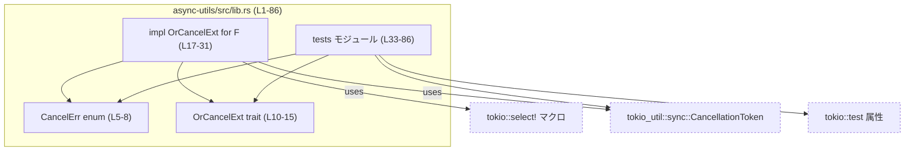
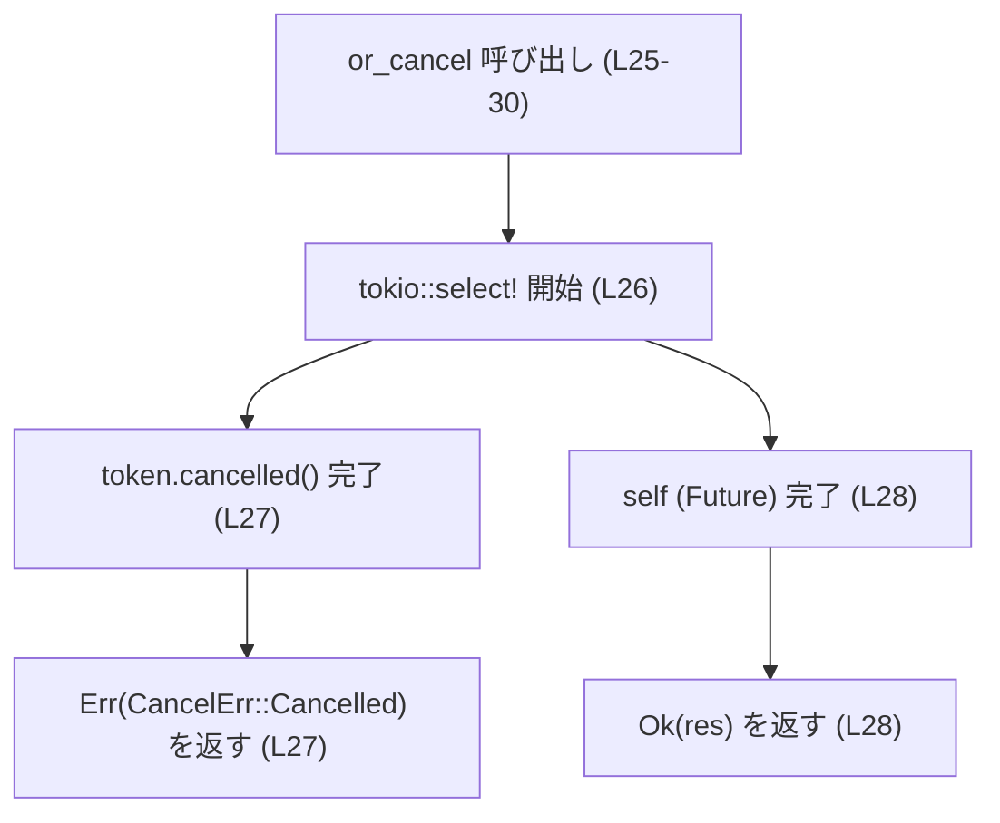

# async-utils/src/lib.rs

## 0. ざっくり一言

このファイルは、任意の `Future` に対して「Tokio の `CancellationToken` によるキャンセルと競合させて待つ」ための拡張トレイト `OrCancelExt` と、そのエラー型 `CancelErr` を提供する非同期ユーティリティです（`async-utils/src/lib.rs:L5-31`）。

---

## 1. このモジュールの役割

### 1.1 概要

- このモジュールは、非同期処理を「キャンセル可能」にするための補助機能を提供します。
- 具体的には、任意の `Future` に `.or_cancel(&CancellationToken)` メソッドを追加し、
  - 対象の `Future` が先に完了した場合はその結果を返し、
  - `CancellationToken` が先にキャンセルされた場合は `Err(CancelErr::Cancelled)` を返す
  という振る舞いを実現します（`async-utils/src/lib.rs:L10-15`, `L17-31`）。

### 1.2 アーキテクチャ内での位置づけ

このファイル単体で見ると、以下の依存関係になります。



点線のノード（Tokio 関連）は外部クレートに属しており、その内部実装はこのファイルには現れません。

### 1.3 設計上のポイント

コードから読み取れる設計上の特徴は次のとおりです。

- 拡張トレイトパターン  
  - 任意の `Future` 型 `F` に対して `OrCancelExt` を実装し、メソッドチェーンとして `.or_cancel(...)` を呼べるようにしています（`async-utils/src/lib.rs:L10-15`, `L17-31`）。
- エラー表現の明示化  
  - キャンセル要因は独自の列挙型 `CancelErr::Cancelled` で表現され、`Result<Output, CancelErr>` によって通常完了との区別が明確になっています（`async-utils/src/lib.rs:L5-8`, `L14`, `L25`）。
- 並行性・安全性  
  - `F: Future + Send` かつ `F::Output: Send` を要求しており、非同期タスクやその結果をスレッド境界をまたいで安全に扱う前提になっています（`async-utils/src/lib.rs:L18-21`）。
  - `unsafe` コードは一切含まれておらず、Rust の安全な抽象化のみで実装されています。
- キャンセル制御  
  - Tokio の `CancellationToken` と `tokio::select!` マクロを組み合わせることで、「キャンセル通知」と「元の Future」のどちらが先に完了するかを待つ構造になっています（`async-utils/src/lib.rs:L25-29`）。

---

## 2. 主要な機能一覧

このモジュールが提供する主要な機能は次のとおりです。

- `CancelErr` 列挙体: キャンセルが発生したことを表すエラー型です（`async-utils/src/lib.rs:L5-8`）。
- `OrCancelExt` トレイト: 任意の `Future` に対して `.or_cancel(&CancellationToken)` メソッドを追加する拡張トレイトです（`async-utils/src/lib.rs:L10-15`）。
- `OrCancelExt` の汎用実装: `F: Future + Send` に対して、キャンセル可能に待つ `or_cancel` の具象実装を提供します（`async-utils/src/lib.rs:L17-31`）。

---

## 3. 公開 API と詳細解説

### 3.1 型一覧（構造体・列挙体など）

公開されている主要な型の一覧です。

| 名前 | 種別 | 役割 / 用途 | 定義位置 |
|------|------|-------------|----------|
| `CancelErr` | 列挙体 (`enum`) | キャンセルが発生したことを表現するエラー型。現在は `Cancelled` バリアントのみを持つ | `async-utils/src/lib.rs:L5-8` |
| `OrCancelExt` | トレイト (`trait`) | 任意の `Future` にキャンセル制御付きの `.or_cancel(&CancellationToken)` メソッドを追加する拡張トレイト | `async-utils/src/lib.rs:L10-15` |

`OrCancelExt` の実装自体はジェネリックな `impl<F> OrCancelExt for F` として定義されています（`async-utils/src/lib.rs:L17-31`）。

---

### 3.2 関数詳細（`or_cancel`）

このファイルで最も重要な関数は `OrCancelExt::or_cancel` の実装です。

#### `or_cancel(self, token: &CancellationToken) -> Result<Self::Output, CancelErr>`

**定義位置**

- トレイト宣言: `async-utils/src/lib.rs:L14`  
- 汎用実装（本体）: `async-utils/src/lib.rs:L25-30`

**概要**

- `Future` の完了と `CancellationToken` のキャンセル通知のどちらか早く起きた方に応じて結果を返す非同期メソッドです。
- `Future` が先に完了した場合は `Ok(F::Output)` を返し、トークンが先にキャンセルされた場合は `Err(CancelErr::Cancelled)` を返します（`async-utils/src/lib.rs:L25-29`）。

**引数**

| 引数名 | 型 | 説明 |
|--------|----|------|
| `self` | `Self`（`Future` 実装型） | キャンセル可能に待ちたい対象の `Future` そのものです。`self` は所有権をムーブして受け取ります（`async-utils/src/lib.rs:L18-21`, `L25-29`）。 |
| `token` | `&CancellationToken` | キャンセルを検知するためのトークンの参照です（`async-utils/src/lib.rs:L14`, `L25-27`）。 |

**戻り値**

- 型: `Result<Self::Output, CancelErr>`（`async-utils/src/lib.rs:L14`, `L25`）。
- 意味:
  - `Ok(value)` … 元の `Future` が正常に完了したとき、その結果 `value` を返します（`async-utils/src/lib.rs:L28-29`）。
  - `Err(CancelErr::Cancelled)` … `CancellationToken` がキャンセルされたときに返されます（`async-utils/src/lib.rs:L27`）。

**内部処理の流れ（アルゴリズム）**

実装は `tokio::select!` マクロを用いて、キャンセル通知と元の `Future` を同時に待ちます（`async-utils/src/lib.rs:L25-29`）。

1. `tokio::select!` 内で 2 つの非同期式を並列に待ちます（`async-utils/src/lib.rs:L26-29`）。
   - `token.cancelled()` … キャンセル通知を待つ `Future`（`async-utils/src/lib.rs:L27`）。
   - `self` … 元の `Future` の完了を待つ（`async-utils/src/lib.rs:L28`）。
2. `token.cancelled()` が完了した場合  
   - 分岐 `_ = token.cancelled() => Err(CancelErr::Cancelled)` が選ばれ、`Err(CancelErr::Cancelled)` を返します（`async-utils/src/lib.rs:L27`）。
3. 元の `Future`（`self`）が完了した場合  
   - 分岐 `res = self => Ok(res)` が選ばれ、その結果 `res` を `Ok` で包んで返します（`async-utils/src/lib.rs:L28`）。
4. どちらの分岐でも `Result<Self::Output, CancelErr>` が返り、`await` している呼び出し元に渡されます（テストでの利用例: `async-utils/src/lib.rs:L46`, `L65-66`, `L81-82`）。

この処理の要点を簡単なフロー図で表すと次のようになります（`or_cancel (L25-30)`）。



**Examples（使用例）**

このファイル内のテストから、代表的な使用例を抜粋します。

1. `Future` がキャンセルより先に完了する場合（正常系）

```rust
// async-utils/src/lib.rs:L41-49 より簡略
#[tokio::test]                                         // Tokio ランタイム上で動作するテスト
async fn example_future_completes_first() {
    let token = CancellationToken::new();             // キャンセルトークンを生成
    let value = async { 42 };                         // 即座に 42 を返す Future

    let result = value.or_cancel(&token).await;       // トークンと競合させて待つ

    assert_eq!(Ok(42), result);                      // Future が先に完了するため Ok(42)
}
```

1. キャンセルが先に発生する場合

```rust
// async-utils/src/lib.rs:L52-70 より簡略
#[tokio::test]
async fn example_token_cancelled_first() {
    let token = CancellationToken::new();
    let token_clone = token.clone();                  // 別タスクでキャンセルするためにクローン

    // 少し遅れてトークンをキャンセルするタスク
    let cancel_handle = task::spawn(async move {
        sleep(Duration::from_millis(10)).await;
        token_clone.cancel();                         // キャンセルを発行
    });

    // より長い時間がかかる Future
    let result = async {
        sleep(Duration::from_millis(100)).await;
        7
    }
    .or_cancel(&token)                                // キャンセル可能に待つ
    .await;

    cancel_handle.await.expect("cancel task panicked");
    assert_eq!(Err(CancelErr::Cancelled), result);    // キャンセルが先なので Err
}
```

1. トークンがすでにキャンセル済みの場合

```rust
// async-utils/src/lib.rs:L72-84 より簡略
#[tokio::test]
async fn example_token_already_cancelled() {
    let token = CancellationToken::new();
    token.cancel();                                   // 事前にキャンセルしておく

    let result = async {
        sleep(Duration::from_millis(50)).await;
        5
    }
    .or_cancel(&token)
    .await;

    assert_eq!(Err(CancelErr::Cancelled), result);    // 即座に Err が返ることを期待
}
```

これらのテストの期待値から、「トークンが既にキャンセル済みでも `or_cancel` は `Err(CancelErr::Cancelled)` を返す」ことが分かります（`async-utils/src/lib.rs:L72-84`）。

**Errors / Panics**

- エラー（`Result::Err`）:
  - `CancellationToken` がキャンセルされた場合に `Err(CancelErr::Cancelled)` を返します（`async-utils/src/lib.rs:L27`）。
  - いつキャンセルされるか（事前・途中）は `CancellationToken` の利用側によって異なりますが、このファイル内のテストでは両方のケースが `Err` になることを確認しています（`async-utils/src/lib.rs:L52-70`, `L72-84`）。
- パニック:
  - `or_cancel` 本体には明示的な `panic!` 呼び出しはありません（`async-utils/src/lib.rs:L25-30`）。
  - 元の `Future`（`self`）がパニックした場合など、`Future` 側の挙動はこのファイルからは分かりません。
  - テストコードでは、キャンセルタスクの `JoinHandle` に対して `expect("cancel task panicked")` を呼んでおり、キャンセルタスクがパニックした場合にテストが失敗するようになっています（`async-utils/src/lib.rs:L68`）。

**エッジケース**

コードとテストから読み取れる代表的なエッジケースは次のとおりです。

- トークンが既にキャンセル済みの状態で `or_cancel` を呼ぶ  
  - テスト `returns_err_when_token_already_cancelled` はこのケースで `Err(CancelErr::Cancelled)` が返ることを期待しています（`async-utils/src/lib.rs:L72-84`）。
- トークンがキャンセルされない場合  
  - テスト `returns_ok_when_future_completes_first` ではトークンをキャンセルせず、`Future` が完了することで `Ok(42)` が返ることを確認しています（`async-utils/src/lib.rs:L41-49`）。
- キャンセルと完了の競合  
  - `returns_err_when_token_cancelled_first` では、短い遅延でキャンセルが発生し、長い遅延の `Future` と競合させた結果 `Err` が返ることを確認しています（`async-utils/src/lib.rs:L52-70`）。
- `Future` 側が永遠に完了しない場合  
  - その場合の挙動はテストされておらず、このファイルからは具体的な観測はできません。ただし構造上、トークンがキャンセルされない限り `tokio::select!` 全体も完了しない可能性があります（`async-utils/src/lib.rs:L26-29`）。

**使用上の注意点**

コードから読める前提条件・注意点は次のとおりです。

- `Future` と結果の送受信制約  
  - `impl<F> OrCancelExt for F where F: Future + Send, F::Output: Send` という制約があるため、`Future` とその結果は `Send` である必要があります（`async-utils/src/lib.rs:L18-21`）。
- ランタイム前提（間接的）  
  - 実装は `tokio::select!` を利用しており（`async-utils/src/lib.rs:L26-29`）、テストも `#[tokio::test]` 属性で実行されています（`async-utils/src/lib.rs:L41`, `L51`, `L72`）。  
    そのため、実際の利用時も Tokio ランタイム上の非同期コンテキストで `.or_cancel()` が `await` されることが想定されますが、ランタイムの初期化方法などはこのファイルには現れません。
- トークン参照のライフタイム  
  - `token` は参照（`&CancellationToken`）として渡されるため、`or_cancel` を `await` している間は有効である必要があります（`async-utils/src/lib.rs:L14`, `L25`）。
- 観測・ログ  
  - キャンセルされたかどうかの判定は `Result` を見ることでしか分からず、このファイル内にはログ出力やメトリクス送信などの観測機構は含まれていません。

---

### 3.3 その他の関数（テスト）

このファイルには、テスト用に 3 つの非公開関数（`#[tokio::test]` 関数）が存在します（`async-utils/src/lib.rs:L41-49`, `L51-70`, `L72-84`）。

| 関数名 | 役割（1 行） | 定義位置 |
|--------|--------------|----------|
| `returns_ok_when_future_completes_first` | `Future` が先に完了した場合に `Ok` が返ることを検証するテスト | `async-utils/src/lib.rs:L41-49` |
| `returns_err_when_token_cancelled_first` | キャンセルが先に発生した場合に `Err(CancelErr::Cancelled)` が返ることを検証するテスト | `async-utils/src/lib.rs:L51-70` |
| `returns_err_when_token_already_cancelled` | トークンが既にキャンセル済みでも `Err(CancelErr::Cancelled)` が返ることを検証するテスト | `async-utils/src/lib.rs:L72-84` |

これらはモジュール外から直接呼び出される API ではなく、`#[cfg(test)]` セクション内に限定されています（`async-utils/src/lib.rs:L33-86`）。

---

## 4. データフロー

ここでは、典型的なシナリオとして「`Future` が `.or_cancel(&token)` でラップされ、キャンセルと競合する」場合のデータフローを示します。

### 4.1 高レベルな流れ

1. 呼び出し側が `CancellationToken` を生成する（`async-utils/src/lib.rs:L43`, `L53`, `L74`）。
2. 呼び出し側が任意の `Future` を用意し、それに対して `.or_cancel(&token)` を呼ぶ（`async-utils/src/lib.rs:L44-47`, `L61-66`, `L77-82`）。
3. `or_cancel` 内部で `tokio::select!` により、`token.cancelled()` と元の `Future` の両方が同時に待たれる（`async-utils/src/lib.rs:L25-29`）。
4. 先に完了した方に応じて `Ok` または `Err(CancelErr::Cancelled)` が返る。
5. 呼び出し側は `Result` を `match` したりテストで `assert_eq!` することで、キャンセルされたかどうかを判定する（`async-utils/src/lib.rs:L48`, `L69`, `L84`）。

### 4.2 シーケンス図（`returns_err_when_token_cancelled_first` の場合）

テスト `returns_err_when_token_cancelled_first` に対応するシーケンスを例示します（`or_cancel (L25-30)` + `tests (L51-70)`）。

```mermaid
sequenceDiagram
    autonumber
    participant Caller as テスト関数<br/>returns_err_when_token_cancelled_first (L52-70)
    participant Token as CancellationToken (外部)
    participant FutureF as 長時間の Future<br/>async { ... } (L61-64)
    participant CancelTask as キャンセル用タスク (L56-59)
    participant OrCancel as or_cancel 実装 (L25-30)

    Caller->>Token: new() で生成 (L53)
    Caller->>Token: clone() (L54)
    Caller->>CancelTask: task::spawn(async move { ... token_clone.cancel(); }) (L56-59)
    Caller->>FutureF: async { sleep(100ms); 7 } を作成 (L61-64)
    Caller->>OrCancel: FutureF.or_cancel(&token).await (L61-66)
    OrCancel->>Token: token.cancelled() を待つ (L27)
    OrCancel->>FutureF: FutureF を待つ (L28)
    CancelTask->>Token: cancel() 呼び出し (L58)
    Token-->>OrCancel: cancelled() が完了
    OrCancel-->>Caller: Err(CancelErr::Cancelled) を返す (L27)
```

---

## 5. 使い方（How to Use）

### 5.1 基本的な使用方法

このモジュールを利用する典型的なコードフローは、テストコードと同様です。ここでは、テストに基づいて簡略化した例を示します。

```rust
use async_utils::OrCancelExt;                         // OrCancelExt トレイトをインポート
use tokio_util::sync::CancellationToken;
use tokio::time::{sleep, Duration};

#[tokio::main]                                        // Tokio ランタイムで実行
async fn main() {
    let token = CancellationToken::new();             // キャンセルトークンを生成

    // 何らかの非同期処理
    let fut = async {
        sleep(Duration::from_secs(5)).await;          // 時間のかかる処理
        "done"
    };

    // トークンによるキャンセルと競合させながら待つ
    match fut.or_cancel(&token).await {               // async-utils/src/lib.rs:L14, L25-29
        Ok(result) => {
            println!("completed: {}", result);        // 完了した場合
        }
        Err(async_utils::CancelErr::Cancelled) => {
            println!("cancelled");                    // キャンセルされた場合
        }
    }
}
```

この例は、テストでの使用パターン（`async-utils/src/lib.rs:L41-49`, `L52-70`）を一般化したものです。

### 5.2 よくある使用パターン

このファイルから読み取れる代表的なパターンは次の 2 つです。

1. **長時間処理の手動キャンセル**

   - 別タスクで `CancellationToken::cancel()` を呼ぶことで、長時間処理を外部から中断するパターンです（`async-utils/src/lib.rs:L56-59`）。
   - `or_cancel` でラップした `Future` は、キャンセルが発生すると `Err(CancelErr::Cancelled)` を返します（`async-utils/src/lib.rs:L27`, `L52-70`）。

2. **キャンセル済み状態のチェック**

   - `CancellationToken` が既にキャンセルされている場合、`or_cancel` を呼んだ時点で `Err` が返ることがテストで確認されています（`async-utils/src/lib.rs:L72-84`）。
   - これにより、「キャンセル状態なら処理を行わない」といったガードとしても利用できます。

### 5.3 よくある間違い（起こり得るもの）

コードから直接は読み取れませんが、構造から起こり得る誤用例と修正例を示します。

```rust
// 想定される誤用例: トークンのスコープが短すぎる
async fn wrong_usage() {
    let result = {
        let token = CancellationToken::new(); // このスコープ内だけ有効
        async { 42 }.or_cancel(&token)
        // ここで token のスコープが終わる可能性がある
    }; // result は Future のまま

    // result.await; // token 参照が生きている保証がない構造
}

// 正しい例: token のスコープを await よりも外側に置く
async fn correct_usage() {
    let token = CancellationToken::new();
    let fut = async { 42 }.or_cancel(&token);
    let result = fut.await;                     // token はまだ有効
    println!("{:?}", result);
}
```

この例は、「`token` のライフタイムが `or_cancel().await` の間中、少なくとも生きている必要がある」という点を強調するためのものです（`async-utils/src/lib.rs:L14`, `L25`）。

### 5.4 使用上の注意点（まとめ）

- **トークンのライフタイム**  
  - `&CancellationToken` の参照を渡すため、`or_cancel` を `await` している間はトークンがスコープ内に存在している必要があります（`async-utils/src/lib.rs:L14`, `L25`）。
- **`Send` 制約**  
  - `Future` およびその出力に `Send` が必要です（`async-utils/src/lib.rs:L18-21`）。ローカルな `!Send` 資源を閉じ込めた `Future` にはこの拡張は自動では適用されません。
- **キャンセルの扱い**  
  - キャンセルは `Err(CancelErr::Cancelled)` で表現されるため、呼び出し側では `Result` 型を `match` するなどで明示的に扱う必要があります（`async-utils/src/lib.rs:L5-8`, `L25-29`）。
- **ログ・監視**  
  - このモジュール単体ではログやメトリクスは出力されないため、キャンセル回数などを観測したい場合は呼び出し側で対応する必要があります。

---

## 6. 変更の仕方（How to Modify）

### 6.1 新しい機能を追加する場合

例として、「キャンセル理由を増やしたい」「タイムアウトを別バリアントで表現したい」といった機能追加を想定した場合の入口を整理します。

1. **エラー種別の追加**  
   - `CancelErr` に新しいバリアントを追加する場合は `async-utils/src/lib.rs:L5-8` を編集します。
   - その場合、`or_cancel` の戻り値型が変わるため、呼び出し側やテストの `assert_eq!` も更新する必要があります（`async-utils/src/lib.rs:L48`, `L69`, `L84`）。

2. **異なるキャンセル条件の導入**  
   - 現在は `CancellationToken` のみを見ていますが、タイムアウト等を追加する場合は `tokio::select!` の分岐を追加するのが自然です（`async-utils/src/lib.rs:L26-29`）。
   - その際は、どの条件でどの `CancelErr` バリアントを返すかを明確に設計する必要があります。

3. **新しい拡張メソッドの追加**  
   - 同じ `OrCancelExt` トレイトに別名のメソッドを追加するか、別トレイトを定義する場合も、コード上の入口は `async-utils/src/lib.rs:L10-15`（トレイト定義）と `L17-31`（`impl<F>`）になります。

### 6.2 既存の機能を変更する場合

`or_cancel` の挙動を変更する際の注意点です。

- **影響範囲の確認**  
  - 実装は `impl<F> OrCancelExt for F` の中の `or_cancel` のみです（`async-utils/src/lib.rs:L25-30`）。
  - `Result` の型・エラー種別に変更を加える場合は、公開 API に影響が出るため、呼び出し側全体への影響を確認する必要があります（呼び出し側コードはこのチャンクには現れません）。

- **テストとの整合性**  
  - 3 つのテストは、それぞれ「Future が先」「キャンセルが先」「既にキャンセル済み」の 3 パターンの挙動を前提としています（`async-utils/src/lib.rs:L41-49`, `L51-70`, `L72-84`）。
  - これらの挙動を変える場合は、テストの期待値も合わせて更新する必要があります。

- **契約（前提条件・返り値の意味）**  
  - 現状、`Err(CancelErr::Cancelled)` は「トークンによるキャンセルが発生した」ことを意味します（`async-utils/src/lib.rs:L5-8`, `L27`）。
  - これとは異なる理由で `Err` を返すよう拡張する場合、呼び出し側が原因を判別できるように `CancelErr` の設計を見直す必要があります。

---

## 7. 関連ファイル

このチャンクには他ファイルの内容は含まれていないため、厳密な依存ファイル一覧は分かりません。ただし、コードから次の外部依存関係が読み取れます。

| パス / クレート | 役割 / 関係 | 根拠 |
|----------------|------------|------|
| `async_trait` クレート | 非同期メソッドを持つトレイト `OrCancelExt` とその `impl` に対して、`async fn` を使えるようにするための属性マクロを提供 | `async-utils/src/lib.rs:L1`, `L10`, `L17` |
| `tokio` クレート | `tokio::select!` マクロ、およびテストで利用される `#[tokio::test]`、`tokio::task`、`tokio::time::sleep` を提供 | `async-utils/src/lib.rs:L26`, `L39`, `L41`, `L51`, `L72` |
| `tokio_util::sync::CancellationToken` | キャンセル用トークン型。`or_cancel` の引数およびテストで利用 | `async-utils/src/lib.rs:L3`, `L14`, `L25`, `L43`, `L53`, `L74` |
| `pretty_assertions` クレート | テストで `assert_eq!` マクロの出力を拡張するために利用 | `async-utils/src/lib.rs:L36` |
| Rust 標準ライブラリ (`std::future::Future`, `std::time::Duration`) | `Future` トレイトと時間表現 `Duration` を利用 | `async-utils/src/lib.rs:L2`, `L37` |

これらのクレートやモジュールの内部実装や詳細な仕様は、このチャンクには現れません。挙動の詳細を確認する場合は、それぞれの公式ドキュメントや実装を参照する必要があります。
