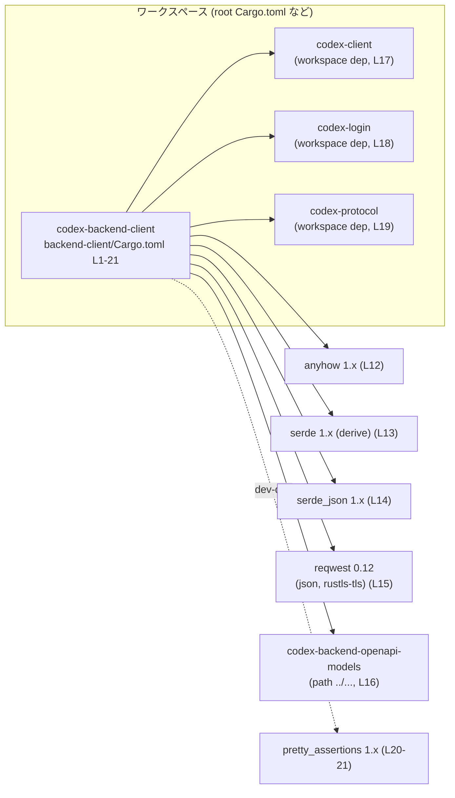
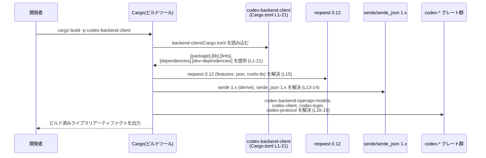

# backend-client/Cargo.toml

## 0. ざっくり一言

`backend-client/Cargo.toml` は、ライブラリクレート `codex-backend-client` のメタデータと依存クレートを定義する設定ファイルです（backend-client/Cargo.toml:L1-21）。  

---

## 1. このモジュールの役割

### 1.1 概要

- このファイルは、`codex-backend-client` クレートの **ビルド設定と依存関係** を定義します（L1-6, L7-8, L11-21）。
- バージョン・エディション・ライセンスはワークスペース共通設定から継承し（L3-5）、ライブラリルートを `src/lib.rs` に固定します（L7-8）。
- HTTP クライアントやシリアライズ関連、Codex 系内部クレートへの依存をまとめて宣言します（L11-19）。

このファイルからは **公開 API（関数・構造体）やコアロジックの中身は分かりません**。それらは `src/lib.rs` 以降のソースコード側に定義されていると考えられますが、このチャンクには現れません。

### 1.2 アーキテクチャ内での位置づけ

このファイルから読み取れる範囲で、`codex-backend-client` クレートと依存クレートの関係を図示します。



- `codex-backend-client` 自身はライブラリクレートとして定義されています（[lib] セクション, L7-8）。
- Codex 系の他クレート（`codex-client`, `codex-login`, `codex-protocol`）とは、**同一ワークスペース内の依存** として結合されています（L17-19）。
- HTTP 通信や JSON シリアライズ用に、一般的な外部クレート `reqwest`, `serde`, `serde_json` を利用する構成です（L13-15）。

### 1.3 設計上のポイント（Cargo 設定として）

コードから読み取れる範囲の特徴を箇条書きにします。

- **ワークスペース集中管理**
  - バージョン・エディション・ライセンスはワークスペース側で一括管理し、このクレートでは `*.workspace = true` として参照しています（L3-5）。
  - Lints（コンパイラ警告ポリシー）もワークスペース共通設定に依存しています（[lints] セクション, L9-10）。
- **ライブラリクレートとしての定義**
  - `[lib]` セクションで `path = "src/lib.rs"` を指定し、バイナリではなくライブラリとして構成されています（L7-8）。
- **内部専用クレート**
  - `publish = false` によって crates.io への公開を無効化しており（L6）、ワークスペース内部での利用を前提としたクレートになっています。
- **HTTP クライアントと TLS の選択**
  - `reqwest` の `default-features` を無効にし（`default-features = false`）、明示的に `json` と `rustls-tls` のみを有効化しています（L15）。
  - これにより、`reqwest` の依存機能を制限しつつ、Rustls ベースの TLS 実装を利用する構成になっています（L15）。
- **Codex 専用モデル・プロトコルとの連携**
  - OpenAPI モデル定義クレート `codex-backend-openapi-models` をローカルパス依存として利用しています（L16）。
  - `codex-client`, `codex-login`, `codex-protocol` との連携により、Codex ドメイン固有のプロトコルやログイン処理と結合することが想定されますが、具体的な API はこのチャンクには現れません（L17-19）。

---

## 2. 主要な機能一覧

このファイルはコード本体ではないため、**実行時の機能（関数・メソッド）ではなく、ビルド構成上の機能** を列挙します。

- ライブラリクレート `codex-backend-client` を定義する（L1-2, L7-8）。
- バージョン・エディション・ライセンス・Lint 設定をワークスペース共通値から継承する（L3-5, L9-10）。
- HTTP クライアント（`reqwest`）と JSON シリアライズ（`serde`, `serde_json`）の依存を宣言する（L11-15）。
- Codex 系の内部クレート（`codex-backend-openapi-models`, `codex-client`, `codex-login`, `codex-protocol`）への依存を定義する（L16-19）。
- テストや開発用に `pretty_assertions` を dev-dependency として追加する（L20-21）。

### 2.1 コンポーネントインベントリー（関数・構造体）

指示に従い、このチャンクに現れる「関数・構造体」のインベントリーをまとめます。

| 種類 | 名前 | 説明 | 根拠 |
|------|------|------|------|
| なし | なし | このファイルには関数・構造体定義は存在しません。 | backend-client/Cargo.toml:L1-21 |

関数や構造体は、`src/lib.rs` などのソースコードファイル側に定義されている可能性がありますが、このチャンクには現れないため内容は不明です。

### 2.2 クレート・依存クレート一覧（コンポーネントインベントリー）

Cargo レベルで見えるコンポーネント（クレート）を一覧化します。

| コンポーネント | 種別 | 用途（Cargo.toml から読み取れる範囲） | 根拠 |
|----------------|------|----------------------------------------|------|
| `codex-backend-client` | ライブラリクレート | 本ファイルで定義されるメインクレート。`src/lib.rs` をルートとするライブラリ。 | L1-2, L7-8 |
| `anyhow` | 依存クレート | エラー処理のためのユーティリティクレート（一般的用途）。このクレートでも何らかのエラーラッピングに利用される可能性があるが、具体的な使い方は不明。 | L12 |
| `serde` | 依存クレート | シリアライズ/デシリアライズ用。`derive` 機能を利用しているため、構造体・列挙体に `#[derive(Serialize, Deserialize)]` を付与している可能性があるが、このチャンクには現れません。 | L13 |
| `serde_json` | 依存クレート | JSON 形式のシリアライズ/デシリアライズ。 | L14 |
| `reqwest` | 依存クレート | HTTP クライアントライブラリ。`json` と `rustls-tls` 機能のみ有効化されている。具体的なリクエスト処理はソース側で定義。 | L15 |
| `codex-backend-openapi-models` | 依存クレート（ローカルパス） | Codex バックエンドの OpenAPI モデル定義を含むと推測されるローカルクレート。API モデル型に依存することが想定されるが、このチャンクには型定義は現れません。 | L16 |
| `codex-client` | 依存クレート（ワークスペース） | Codex クライアント機能を提供するワークスペース内クレート。どの API を使っているかは不明。 | L17 |
| `codex-login` | 依存クレート（ワークスペース） | ログイン周りの機能を提供すると推測されるワークスペース内クレート。利用方法は不明。 | L18 |
| `codex-protocol` | 依存クレート（ワークスペース） | Codex の通信プロトコルや型を提供するクレートと推測される。詳細はこのチャンクには現れません。 | L19 |
| `pretty_assertions` | 開発用依存クレート | テスト時にわかりやすい差分表示を行うためのクレート。実際のテストコードはこのチャンクには現れません。 | L20-21 |

---

## 3. 公開 API と詳細解説

### 3.1 型一覧（構造体・列挙体など）

このファイルは **Cargo 設定ファイル** であり、Rust の型定義（構造体・列挙体など）は含まれていません。

- 型の定義は `src/lib.rs` およびその配下の `.rs` ファイル側に存在するはずですが、このチャンクには登場しません。
- したがって、このセクションで解説できる公開型はありません。

### 3.2 関数詳細（該当なし）

指示されている「関数詳細テンプレート」に基づき、重要な関数を解説することが推奨されていますが、`backend-client/Cargo.toml` には関数定義が一切存在しません（L1-21）。

- そのため、このファイル単体から **公開 API やコアロジックの関数シグネチャ・挙動を説明することはできません**。
- 実際の関数やメソッドの詳細は、`src/lib.rs` などの実装ファイルを参照する必要があります。

### 3.3 その他の関数

- このファイルには関数・メソッド・モジュール定義が存在しないため、「その他の関数」の一覧もありません（L1-21）。

---

## 4. データフロー

### 4.1 Cargo ビルド時のデータフロー

実行時のビジネスロジックはこのファイルからは分かりませんが、**ビルド時に Cargo がどのようにこのファイルを利用するか** のフローは説明できます。



この図は、`backend-client/Cargo.toml`（L1-21）を元に、`cargo build` が依存クレートを解決しライブラリをビルドする流れを表現しています。

---

## 5. 使い方（How to Use）

### 5.1 基本的な使用方法（ビルド・テスト）

`codex-backend-client` はライブラリクレートとして定義されているため（L7-8）、ワークスペース内から次のように利用されることが一般的です。

#### ビルド

```bash
# ワークスペースルートで、対象クレートのみビルド
cargo build -p codex-backend-client
```

#### テスト

```bash
# pretty_assertions を利用したテストが（もしあれば）実行される
cargo test -p codex-backend-client
```

- これらのコマンドは、Cargo が `backend-client/Cargo.toml` を読み込み、依存クレート（L11-21）を解決したうえでビルド・テストを行うという前提です。

### 5.2 他クレートからの利用例（想定されるパターン）

`publish = false` のため、crates.io から外部プロジェクトが利用することは想定されていません（L6）。  
同一ワークスペース内の別クレートから、ローカル依存として利用するイメージは次のようになります。

```toml
# （他のワークスペースメンバーの Cargo.toml の例）

[dependencies]
# backend-client が同じワークスペースにメンバー登録されている前提
codex-backend-client = { workspace = true }
```

- 実際に `workspace = true` を指定できるかどうかは、ルートの `Cargo.toml` の書き方に依存します。このチャンクにはワークスペースルートの情報はないため、具体的な設定は不明です。

### 5.3 よくある使用ミス（Cargo 設定周り）

このファイルの内容から想定される、設定まわりのつまずきポイントを挙げます。

- **`publish = false` を忘れて外部公開されると困るケース**
  - このクレートは `publish = false` により公開が抑止されています（L6）。
  - 内部専用クレートとして扱いたい場合は、この設定が必要です。
- **ワークスペース側の設定不足**
  - `version.workspace = true` などを利用しているため（L3-5, L9-10）、ワークスペースルートで `workspace.package.version` や `workspace.lints` などの設定がされていない場合、Cargo がエラーを出します。
  - このファイルからはワークスペースルートの設定は見えないため、エラー時はそちらを確認する必要があります。

### 5.4 使用上の注意点（まとめ）

- **ワークスペース前提**
  - `*.workspace = true` な項目が多いため（L3-5, L9-10, L17-19）、このクレート単体で独立して使うことは想定されていません。ワークスペース外で使うには、個別に `version`, `edition`, `license`, `lints` 等を明示する必要があります。
- **HTTP/TLS 機能の選択**
  - `reqwest` の `default-features = false` と `rustls-tls` の明示的な有効化（L15）により、TLS 実装として Rustls に依存します。
  - これを変更したい場合、`native-tls` など別の feature を有効化する必要があり、その結果依存関係や挙動が変わります。
- **公開 API や並行性の詳細**
  - このファイルからは、どのような非同期ランタイムを使っているか（tokio など）、どのようなスレッドモデルで動作しているかといった並行性の詳細は分かりません。
  - 同様に、エラー処理や型の構造などの「契約（コントラクト）」もソースコード側を確認しないと把握できません。

---

## 6. 変更の仕方（How to Modify）

### 6.1 新しい機能を追加する場合（Cargo 側の観点）

`codex-backend-client` に新機能を実装し、それが新たな依存クレートを必要とする場合の、Cargo 側の変更手順は次のようになります。

1. **依存クレートの追加**
   - `backend-client/Cargo.toml` の `[dependencies]` セクションに新しいクレートを追加します（L11-19 参照）。
   - 例: 新たなロギングクレートを追加する場合

     ```toml
     [dependencies]
     anyhow = "1"
     # 既存 …
     tracing = "0.1"
     ```

2. **ワークスペース共通化が必要か検討**
   - 共通で利用したい依存であれば、他クレート同様に `workspace = true` でワークスペース側に集約することもできます（`codex-client` などの指定方法, L17-19 を参考）。
3. **ソースコード側での利用**
   - 実際の機能追加は `src/lib.rs` などソース側で行います。Cargo.toml はあくまで依存関係の宣言のみであり、ロジックはこのファイルでは扱いません。

### 6.2 既存の機能を変更する場合（特に reqwest/serde 周り）

既存の HTTP/JSON 機能の挙動に影響しうる設定変更について、注意点を整理します。

- **`reqwest` の feature を変更する**
  - 現在は `default-features = false` かつ `["json", "rustls-tls"]` です（L15）。
  - もし `default-features = true` に変更すると、`native-tls` など他の機能が自動的に有効になり、TLS 実装や依存関係が大きく変わる可能性があります。
  - これはセキュリティや動作環境（例: OpenSSL の有無）に影響するため、変更時にはソースコードと実行環境の両方を確認する必要があります。
- **serde 関連のバージョン変更**
  - `serde` と `serde_json` はどちらも `"1"` 系です（L13-14）。
  - メジャーバージョンを変更する場合は、全ての型の `Serialize`/`Deserialize` 実装や JSON 形式の互換性に注意が必要です。
- **Codex 系クレートのバージョン・API 変更**
  - `codex-client` などワークスペース依存のバージョンはワークスペース側で管理されているため（L17-19）、API が変わるとこのクレートのソースコード側にも影響します。
  - Cargo.toml 側では、必要に応じて `features` の追加・削除や `optional = true` などの指定を行うことも考えられますが、このチャンクにはそういった設定は現在ありません（L11-19）。

---

## 7. 関連ファイル

このファイルと密接に関係するファイル・ディレクトリを整理します。

| パス | 役割 / 関係 | 根拠 |
|------|-------------|------|
| `backend-client/src/lib.rs` | `codex-backend-client` ライブラリクレートのエントリポイント。公開 API やコアロジックはここから始まると考えられます。 | `[lib]` セクションの `path = "src/lib.rs"`（L7-8） |
| ルート `Cargo.toml`（ワークスペース） | `version.workspace = true` や `edition.workspace = true`、`license.workspace = true`、`lints.workspace = true` の参照先。ワークスペース共通設定とメンバー一覧を定義しているはずですが、このチャンクには現れません。 | L3-5, L9-10 |
| `../codex-backend-openapi-models` | ローカルパス依存として指定されている Codex バックエンドの OpenAPI モデルクレート。API モデル型の定義を含むと推測されます。 | `codex-backend-openapi-models = { path = "../codex-backend-openapi-models" }`（L16） |
| ワークスペース内の `codex-client` | `codex-backend-client` が依存する Codex クライアントクレート。認証や接続管理などを提供している可能性がありますが、詳細は不明です。 | `codex-client = { workspace = true }`（L17） |
| ワークスペース内の `codex-login` | ログイン関連機能を提供するワークスペースクレートと推測されます。 | `codex-login = { workspace = true }`（L18） |
| ワークスペース内の `codex-protocol` | Codex の通信プロトコルや共通型定義を提供するクレートと推測されます。 | `codex-protocol = { workspace = true }`（L19） |
| テストコード（例: `backend-client/tests/` や `src/lib.rs` 内の `#[cfg(test)]`） | `pretty_assertions` を利用するテストがあれば、これらのファイルに記述されているはずです。このチャンクにはテストコードは現れません。 | `pretty_assertions = "1"`（L20-21） |

---

### Bugs / Security / Contracts / Edge Cases について（このファイルから読み取れる範囲）

- **Bugs**
  - 設定上の明確なバグ（文法ミスなど）は見当たりません（L1-21 全体が正しい TOML 構造になっています）。
- **Security**
  - `rustls-tls` を利用しているため（L15）、TLS 実装として Rustls を使用する構成になっています。これによりシステムの OpenSSL 依存を避けることが一般的には可能ですが、実際のセキュリティ要件や証明書扱いはソースコードと実行環境に依存します。
- **Contracts**
  - このファイルレベルでは、「ワークスペース側で共通設定が定義されていること」「依存クレートが指定バージョン範囲で解決可能であること」などが前提条件（契約）になります（L3-5, L9-10, L11-19）。
- **Edge Cases**
  - ワークスペースの設定が不十分な場合（例: `workspace.package.version` が無いなど）、`*.workspace = true` の項目が解決できずビルドエラーとなります。
  - 外部プロジェクトが crates.io 経由でこのクレートを利用しようとすると、`publish = false` のためそもそも公開されていない、という状態になります（L6）。

このチャンクだけでは、実際の API・並行性・エラー処理の詳細などは分からないため、それらを把握するには `src/lib.rs` 以下のコードを確認する必要があります。
