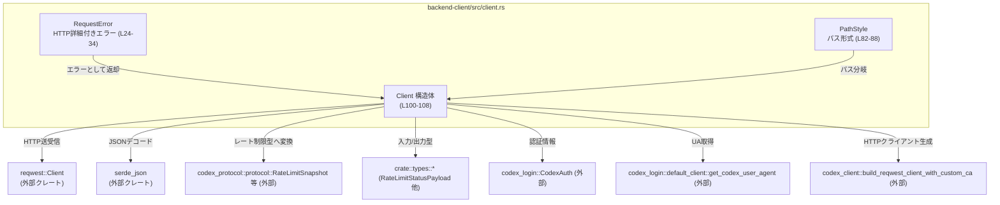
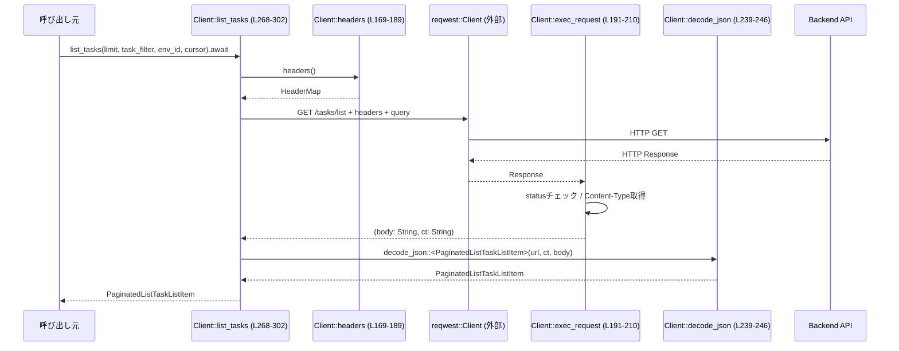

# backend-client/src/client.rs コード解説

## 0. ざっくり一言

CodeX / ChatGPT バックエンド向けの HTTP クライアント `Client` を提供し、レート制限情報やタスク関連 API（一覧・詳細・作成）、設定ファイル取得などを非同期に呼び出すための窓口となるモジュールです（根拠: `backend-client/src/client.rs:L100-108, L248-393`）。

---

## 1. このモジュールの役割

### 1.1 概要

- このモジュールは **Codex / ChatGPT バックエンド API を統一的に叩くためのクライアント** を提供します。
- ベース URL から API パス形式（Codex API か ChatGPT backend-api か）を自動判定し、適切なパスにリクエストを送ります（根拠: `PathStyle`, `PathStyle::from_base_url`, `Client::new`: `L82-98, L110-134`）。
- レート制限情報の取得・マッピング、タスク一覧・詳細取得、兄弟ターン一覧取得、requirements 設定ファイル取得、新規タスク作成といった主要な API をカバーします（根拠: 公開メソッド群 `L248-393`）。
- レスポンス JSON を内部型や `codex_protocol` の型（例: `RateLimitSnapshot`）に変換し、呼び出し側からは Rust の型として扱えるようにします（根拠: `decode_json`, `rate_limit_snapshots_from_payload` など: `L239-246, L395-443`）。

### 1.2 アーキテクチャ内での位置づけ

このファイル単体で確認できる依存関係を図示します。



- `Client` は HTTP レイヤ（`reqwest::Client`）と、API 仕様を表す型（`crate::types`, `codex_protocol`）の橋渡しを行います（根拠: `L100-108, L248-266, L395-443`）。
- 認証は `CodexAuth` からトークン・アカウント ID を読み出して `Authorization` ヘッダなどを組み立てます（根拠: `Client::from_auth`, `headers`: `L136-145, L169-189`）。

### 1.3 設計上のポイント

- **エラー型の二段構成**  
  - 一般 API 呼び出しは `anyhow::Result<T>` を返し、メッセージ主体のエラーになります（根拠: 多くの `pub async fn` の戻り値: `L110-307, L323-393`）。
  - 設定ファイル取得のみ `Result<T, RequestError>` を返し、HTTP ステータスやレスポンスボディを保持した詳細なエラーを扱えます（根拠: `get_config_requirements_file`: `L347-358`, `RequestError`: `L24-80`）。
- **パス形式の抽象化**  
  - `PathStyle` により `/api/codex/...` と `/wham/...` の二系統の API を切り替えます（根拠: `PathStyle`, 各メソッド内の `match self.path_style`: `L82-98, L257-261, L275-278, L313-316, L328-337, L350-353, L363-366`）。
- **状態の少なさとスレッドセーフな利用**  
  - `Client` は主に設定（`base_url`, `bearer_token`, `user_agent`, `chatgpt_account_id`, `path_style`）と `reqwest::Client` を保持し、API 呼び出しメソッドはすべて `&self` で非可変参照のみを取ります（根拠: `Client` フィールド定義とメソッドシグネチャ: `L100-108, L136-393`）。
  - これにより複数タスクから同一インスタンスを同時に使うことが想定されています。
- **レート制限情報の正規化**  
  - 生の `RateLimitStatusPayload` を `RateLimitSnapshot` 群に変換し、複数メーターを一貫した形で扱えるようにしています（根拠: `rate_limit_snapshots_from_payload`, `make_rate_limit_snapshot`, `map_rate_limit_window`, `map_credits`: `L395-468`）。
- **テストによるマッピングの検証**  
  - レート制限とプラン種別をマッピングする内部ロジックに対してテストが用意されています（根拠: `mod tests`: `L505-654`）。

---

## 2. 主要な機能一覧

このモジュールが提供する主要機能（公開 API ベース）です。

- `Client::new`: ベース URL から HTTP クライアントを初期化し、`PathStyle` を自動判定する（`L110-134`）。
- `Client::from_auth`: `CodexAuth` からトークンとアカウント ID を取り出し、認証付きの `Client` を生成する（`L136-145`）。
- `Client::with_*` 系: ベアラートークン・User-Agent・ChatGPT アカウント ID・パススタイルを上書きしやすくするビルダー系メソッド（`L147-167`）。
- `Client::get_rate_limits_many`: `/usage` エンドポイントからレート制限ペイロードを取得し、`RateLimitSnapshot` のベクタに変換する（`L257-266, L395-443`）。
- `Client::get_rate_limits`: `get_rate_limits_many` の結果から `limit_id == "codex"` のスナップショットを優先的に一つ返す（`L248-255`）。
- `Client::list_tasks`: タスク一覧をクエリパラメータ付きの GET で取得する（`L268-302`）。
- `Client::get_task_details` / `get_task_details_with_body`: タスク詳細を取得し、必要に応じて生ボディと Content-Type も返す（`L304-321`）。
- `Client::list_sibling_turns`: 指定タスク・ターンに関連する「兄弟ターン」一覧を取得する（`L323-341`）。
- `Client::get_config_requirements_file`: requirements 設定ファイル（managed requirements）を取得し、HTTP エラー詳細付きで返す（`L343-358`）。
- `Client::create_task`: 新しいタスクを POST して作成し、返された JSON からタスク ID を抽出する（`L360-393`）。

---

## 3. 公開 API と詳細解説

### 3.1 型一覧（構造体・列挙体など）

| 名前 | 種別 | 公開 | 役割 / 用途 | 定義位置 |
|------|------|------|-------------|----------|
| `RequestError` | 列挙体 | `pub` | HTTP レスポンスのステータス・Content-Type・ボディを含む詳細エラー、またはラップされた `anyhow::Error` を表す。`get_config_requirements_file` で使用される。 | `backend-client/src/client.rs:L24-34` |
| `PathStyle` | 列挙体 | `pub` | API パス形式の切り替えを表す。`CodexApi`（`/api/codex/...`）と `ChatGptApi`（`/wham/...`）の 2 種類。 | `backend-client/src/client.rs:L82-88` |
| `Client` | 構造体 | `pub` | Codex / ChatGPT バックエンドに対する非同期 HTTP クライアント。認証・User-Agent・アカウント ID・パス形式などを保持し、各種 API メソッドを提供。 | `backend-client/src/client.rs:L100-108` |
| `tests` モジュール | モジュール | `cfg(test)` | レート制限マッピングとプラン種別マッピング、`get_rate_limits` の選択ロジックを検証するテスト群。 | `backend-client/src/client.rs:L505-654` |

※ `RateLimitStatusPayload`, `RateLimitStatusDetails`, `CreditStatusDetails`, `RateLimitWindowSnapshot` などは `crate::types` から参照されていますが、このチャンクには定義が現れません（根拠: `L1-5, L424-467, L525-561`）。  

### 3.1.1 `RequestError` の補足

- バリアント:
  - `UnexpectedStatus { method, url, status, content_type, body }`: 期待外ステータスの場合の詳細情報（根拠: `L26-32`）。
  - `Other(anyhow::Error)`: それ以外のエラーをラップ（根拠: `L33`）。
- 補助メソッド:
  - `status(&self) -> Option<StatusCode>`: `UnexpectedStatus` の場合にのみ HTTP ステータスを返す（`L37-42`）。
  - `is_unauthorized(&self) -> bool`: ステータスが 401 かどうかを判定（`L44-46`）。

### 3.2 関数詳細（主要 7 件）

#### 3.2.1 `Client::new(base_url: impl Into<String>) -> Result<Client>`

**概要**

- ベース URL から `Client` を生成します。
- ChatGPT のホスト名（`https://chatgpt.com` / `https://chat.openai.com`）が与えられた場合、自動的に `/backend-api` を付加して WHAM パスに向けます。
- 末尾のスラッシュを取り除き、`PathStyle` を決定し、`reqwest::Client` をカスタム CA 付きで構築します。  
  （根拠: `backend-client/src/client.rs:L110-134`）

**引数**

| 引数名 | 型 | 説明 |
|--------|----|------|
| `base_url` | `impl Into<String>` | バックエンド API のベース URL。`https://chatgpt.com` などが渡された場合は内部で補正される。 |

**戻り値**

- `Result<Client>` (`anyhow::Result<Client>`)  
  - 成功時: 初期化済みの `Client`。
  - 失敗時: `build_reqwest_client_with_custom_ca` の失敗などを含む `anyhow::Error`。  
  （根拠: `L124` の `?` によりエラー伝播）

**内部処理の流れ**

1. `base_url.into()` で可変 `String` に変換（`L112`）。
2. `while base_url.ends_with('/') { base_url.pop(); }` で末尾の `/` をすべて削除（`L115-117`）。
3. ベース URL が ChatGPT ホストで、かつ `/backend-api` を含まない場合は `/backend-api` を連結（`L118-123`）。
4. `build_reqwest_client_with_custom_ca(reqwest::Client::builder())?` で HTTP クライアントを構築（`L124`）。
5. `PathStyle::from_base_url(&base_url)` でパス形式を決定（`L125`）。
6. 各フィールドを初期値で埋めた `Client` を `Ok(Self { ... })` で返す（`L126-133`）。

**Examples（使用例）**

```rust
// 非同期コンテキスト外で Client を初期化する例
use backend_client::client::Client; // 実際のクレートパスは不明（このチャンクには現れません）

fn build_client() -> anyhow::Result<Client> {
    // ChatGPT のホスト名を渡すと /backend-api が自動で付与される
    let client = Client::new("https://chatgpt.com")?;
    Ok(client)
}
```

**Errors / Panics**

- `build_reqwest_client_with_custom_ca` がエラーを返した場合、`?` により `Err(anyhow::Error)` が返ります（`L124`）。
- panic の可能性がある操作はありません。

**Edge cases（エッジケース）**

- `base_url` が `/` のみで終わる形 `https://example.com///` のような場合でも、`while` ループによりすべての末尾スラッシュが削除されます（`L115-117`）。
- `base_url` が ChatGPT ホスト名以外の場合は、`/backend-api` は付与されず、そのまま `PathStyle::CodexApi` が選択されます（`L118-123, L91-97`）。

**使用上の注意点**

- `base_url` に API パス（例: `/api/codex`）を含めるかどうかは呼び出し側の責務ですが、内部では `PathStyle` に応じて `/api/codex/...` または `/wham/...` を追加します。そのため、ベース URL には通常、パスの先頭部分は含めません。
- このメソッドは同期関数なので、非同期ランタイム外でも呼び出せます。

---

#### 3.2.2 `Client::from_auth(base_url: impl Into<String>, auth: &CodexAuth) -> Result<Client>`

**概要**

- `CodexAuth` からアクセストークンとアカウント ID を取得し、それらを設定した `Client` を生成します（根拠: `L136-145`）。

**引数**

| 引数名 | 型 | 説明 |
|--------|----|------|
| `base_url` | `impl Into<String>` | ベース URL。`Client::new` と同様。 |
| `auth` | `&CodexAuth` | 認証情報。`get_token` / `get_account_id` メソッドを持つ。定義はこのチャンクには現れません。 |

**戻り値**

- `Result<Client>`: 成功時は Bearer トークン・User-Agent・ChatGPT アカウント ID を設定済みの `Client`。

**内部処理の流れ**

1. `auth.get_token()` を呼び出し、エラーがあれば `anyhow::Error` に変換（`map_err(anyhow::Error::from)`）（`L137`）。
2. `Client::new(base_url)?` でベースとなるクライアントを生成（`L138`）。
3. `with_user_agent(get_codex_user_agent())` と `with_bearer_token(token)` をメソッドチェーンで適用（`L138-140`）。
4. `auth.get_account_id()` が `Some` の場合、`with_chatgpt_account_id(account_id)` を適用（`L141-143`）。
5. 完成した `client` を返却（`L144`）。

**Examples**

```rust
use codex_login::CodexAuth;
use backend_client::client::Client; // 実際のパスは不明

fn build_client_from_auth(auth: &CodexAuth) -> anyhow::Result<Client> {
    // 認証情報付きのクライアントを構築
    let client = Client::from_auth("https://chatgpt.com", auth)?;
    Ok(client)
}
```

**Errors / Panics**

- `auth.get_token()` の失敗、または `Client::new` での HTTP クライアント生成失敗時に `Err(anyhow::Error)` が返ります（`L137-138`）。
- panic はありません。

**Edge cases**

- `get_account_id()` が `None` の場合でも、トークンと User-Agent のみ設定された `Client` が正常に返ります（`L141-143`）。

**使用上の注意点**

- `CodexAuth` の具体的な実装はこのファイルにはないため、トークンの有効期限や更新タイミングは別途考慮が必要です。
- `Client` 生成後にさらに `with_*` 系メソッドで上書きすることも可能です。

---

#### 3.2.3 `Client::get_rate_limits_many(&self) -> Result<Vec<RateLimitSnapshot>>`

**概要**

- `/usage` エンドポイントからレート制限情報を取得し、`RateLimitSnapshot` のベクタに変換して返します（根拠: `L257-266, L395-443`）。
- 現在のプラン種別や追加レート制限（`additional_rate_limits`）も含めて正規化します。

**引数**

| 引数名 | 型 | 説明 |
|--------|----|------|
| `&self` | `&Client` | 内部状態を参照のみで使用。 |

**戻り値**

- `Result<Vec<RateLimitSnapshot>>` (`anyhow::Result`):
  - 成功時: 少なくとも 1 要素以上の `RateLimitSnapshot` を含むベクタ（`vec![...]` で 1 件は必ず作成: `L399-406`）。
  - 失敗時: HTTP 通信・JSON デコードなどのエラー情報を含む `anyhow::Error`。

**内部処理の流れ**

1. `self.path_style` に応じて URL を組み立て（Codex: `/api/codex/usage`, ChatGPT: `/wham/usage`）（`L258-261`）。
2. `self.http.get(&url).headers(self.headers())` でリクエストを準備（`L262`）。
3. `exec_request(req, "GET", &url).await?` で HTTP 実行し、ボディ文字列と Content-Type を取得（`L263`）。
4. `decode_json::<RateLimitStatusPayload>(&url, &ct, &body)?` で JSON を `RateLimitStatusPayload` にパース（`L264`）。
5. `rate_limit_snapshots_from_payload(payload)` で `Vec<RateLimitSnapshot>` に変換（`L265, L395-443`）。

**Examples**

```rust
// 非同期コンテキストでの使用例
async fn print_rate_limits(client: &Client) -> anyhow::Result<()> {
    let snapshots = client.get_rate_limits_many().await?;
    for s in snapshots {
        // RateLimitSnapshot のフィールドは codex_protocol 側の定義に依存（このチャンクには現れません）
        println!("limit_id = {:?}", s.limit_id);
    }
    Ok(())
}
```

**Errors / Panics**

- `exec_request` 内で:
  - HTTP リクエスト送信エラー時に `Err(anyhow::Error)`（`req.send().await?`）（`L197`）。
  - ステータスコードが成功でない場合に `anyhow::bail!` でエラーを返す（`L206-208`）。
- JSON パース失敗時には `decode_json` が `anyhow::bail!` を返します（`L239-244`）。
- `rate_limit_snapshots_from_payload` は panic しない構造です（`L395-419`）。
- `Vec` を `Ok` で返すのみでインデックスアクセスを行わないため、このメソッド内での panic は確認できません。

**Edge cases**

- バックエンドがレート制限情報を持たない場合でも、`rate_limit` が `None` の状態で `"codex"` 用のスナップショットが 1 件作られ、`primary`/`secondary` は `None` になります（根拠: `L399-406, L421-434`, およびテスト `usage_payload_maps_zero_rate_limit_when_primary_absent`: `L597-617`）。
- 追加レート制限が存在する場合、`additional_rate_limits` の各要素に対してスナップショットが追加されます（`L407-417`）。

**使用上の注意点**

- ネットワーク I/O を伴うため、非同期ランタイム（Tokio など）のコンテキストで `await` する必要があります。
- HTTP エラー時には `RequestError` ではなく `anyhow::Error` が返る点に注意が必要です。ステータスコードを直接参照したい場合は `get_config_requirements_file`+`RequestError` を使うか、別途 `exec_request_detailed` 相当の関数を増やす必要があります。

---

#### 3.2.4 `Client::list_tasks(&self, limit: Option<i32>, task_filter: Option<&str>, environment_id: Option<&str>, cursor: Option<&str>) -> Result<PaginatedListTaskListItem>`

**概要**

- タスク一覧を取得するための API 呼び出しです。
- クエリパラメータとして `limit`, `task_filter`, `cursor`, `environment_id` を任意指定できます（根拠: `L268-302`）。

**引数**

| 引数名 | 型 | 説明 |
|--------|----|------|
| `&self` | `&Client` | クライアント。 |
| `limit` | `Option<i32>` | 取得件数の上限。`Some` の場合のみ `limit` クエリに追加。 |
| `task_filter` | `Option<&str>` | タスクのフィルタ条件文字列。 |
| `environment_id` | `Option<&str>` | 環境 ID。 |
| `cursor` | `Option<&str>` | ページング用カーソル。 |

**戻り値**

- `Result<PaginatedListTaskListItem>`: ページネーション付きタスク一覧モデル。具体的なフィールド構成は `crate::types` に依存し、このチャンクには現れません（根拠: `L3`）。

**内部処理の流れ**

1. `path_style` に応じて URL を `/api/codex/tasks/list` か `/wham/tasks/list` に設定（`L275-278`）。
2. `self.http.get(&url).headers(self.headers())` でベースのリクエストを作成（`L279`）。
3. 各 `Option` 引数が `Some` の場合のみ `RequestBuilder::query` でクエリパラメータを追加（`L280-299`）。
4. `exec_request(req, "GET", &url).await?` で HTTP 実行（`L300`）。
5. `decode_json::<PaginatedListTaskListItem>(&url, &ct, &body)` で JSON をパースして返す（`L301-302`）。

**Examples**

```rust
// タスク一覧を 20 件まで取得する例
async fn fetch_tasks(client: &Client) -> anyhow::Result<()> {
    let tasks = client
        .list_tasks(
            Some(20),         // limit
            Some("open"),     // task_filter
            None,             // environment_id
            None,             // cursor
        )
        .await?;
    println!("got {} tasks", tasks.items.len()); // items フィールド名は仮。実際の定義はこのチャンクには現れません。
    Ok(())
}
```

**Errors / Panics**

- `get_rate_limits_many` と同様、`exec_request` 内で HTTP エラーを `anyhow::Error` として返します（`L191-210`）。
- JSON 形式が期待と異なる場合には `decode_json` が `anyhow::Error` を返します（`L239-244`）。
- panic を引き起こすコードは含まれていません。

**Edge cases**

- すべてのクエリ引数が `None` の場合、純粋な `/tasks/list` の GET になります（`L280-299` の `else { req }` 経路）。
- 同じキーのクエリが上書きされる挙動は `reqwest` に依存しますが、このコード上は一度ずつしか `query` を呼んでいません。

**使用上の注意点**

- クエリパラメータは `reqwest` の `query` によって URL エンコードされます。`task_filter` などに特殊文字を含めても `query` で処理されます。
- 戻り値型の構造は `crate::types` 依存のため、変更時にはこのメソッドの戻り値も合わせて確認する必要があります。

---

#### 3.2.5 `Client::get_config_requirements_file(&self) -> Result<ConfigFileResponse, RequestError>`

**概要**

- Codex バックエンドから managed requirements ファイルを取得します（根拠: コメントと実装: `L343-358`）。
- HTTP エラー時には `RequestError::UnexpectedStatus` を返し、ステータスコードやボディを呼び出し側で参照できます。

**引数**

| 引数名 | 型 | 説明 |
|--------|----|------|
| `&self` | `&Client` | クライアント。 |

**戻り値**

- `std::result::Result<ConfigFileResponse, RequestError>`  
  - 成功時: `ConfigFileResponse`。定義は `crate::types` にあり、このチャンクには現れません（`L2`）。
  - 失敗時: `RequestError`。

**内部処理の流れ**

1. `path_style` により URL を `/api/codex/config/requirements` か `/wham/config/requirements` に設定（`L350-353`）。
2. `self.http.get(&url).headers(self.headers())` でリクエストを準備（`L354`）。
3. `exec_request_detailed(req, "GET", &url).await?` で HTTP を実行し、ステータスやボディを確認（`L355`）。
   - ステータスが成功でない場合、`RequestError::UnexpectedStatus{...}` が返ります（`L212-236`）。
4. `decode_json::<ConfigFileResponse>(&url, &ct, &body)` で JSON をパースし、`map_err(RequestError::from)` で `anyhow::Error` を `RequestError::Other` に変換（`L356-357`）。

**Examples**

```rust
async fn load_requirements(client: &Client) {
    match client.get_config_requirements_file().await {
        Ok(config) => {
            // ConfigFileResponse の構造は crate::types 依存
            println!("config loaded: {:?}", config);
        }
        Err(err) => {
            if err.is_unauthorized() {
                eprintln!("unauthorized to fetch requirements");
            } else {
                eprintln!("failed: {}", err);
            }
        }
    }
}
```

**Errors / Panics**

- HTTP ステータスが成功でない場合: `RequestError::UnexpectedStatus`（`L227-235`）。
- HTTP 送信自体のエラーや JSON デコードエラーは `RequestError::Other(anyhow::Error)` に変換されます（`L218, L356-357, L76-80`）。
- panic はありません。

**Edge cases**

- レスポンスボディの読み取りに失敗した場合、`res.text().await.unwrap_or_default()` により空文字列として処理されます（`L226`）。
- Content-Type が取得できない場合、空文字列として扱われます（`L220-225`）。

**使用上の注意点**

- `RequestError` から `status()` / `is_unauthorized()` を使うことで HTTP ステータスに応じた分岐が可能です（`L36-46`）。
- 他のメソッドは `anyhow::Error` を返すため、同様の粒度でステータスを扱いたい場合はこのパターンの再利用が有効です。

---

#### 3.2.6 `Client::create_task(&self, request_body: serde_json::Value) -> Result<String>`

**概要**

- 新しいタスク（ユーザーターン）を作成するために JSON を POST し、レスポンスからタスク ID を抽出して返します（根拠: `L360-393`）。

**引数**

| 引数名 | 型 | 説明 |
|--------|----|------|
| `&self` | `&Client` | クライアント。 |
| `request_body` | `serde_json::Value` | POST するリクエストボディ。任意の JSON。 |

**戻り値**

- `Result<String>`: 作成されたタスクの ID 文字列。

**内部処理の流れ**

1. `path_style` により URL を `/api/codex/tasks` か `/wham/tasks` に設定（`L363-366`）。
2. `self.http.post(&url)` から `RequestBuilder` を生成し、`headers(self.headers())` を追加（`L367-371`）。
3. `CONTENT_TYPE: application/json` を明示し、`json(&request_body)` でボディをセット（`L371-372`）。
4. `exec_request(req, "POST", &url).await?` で HTTP 実行（`L373`）。
5. レスポンスボディを `serde_json::Value` として `from_str`（`L375`）。
6. 解析順:
   - `v.get("task").and_then(|t| t.get("id")).and_then(|s| s.as_str())` があれば、その値を ID として返す（`L377-382`）。
   - そうでなければ `v.get("id").and_then(|s| s.as_str())` を ID として返す（`L382-384`）。
   - どちらもなければ `anyhow::bail!` でエラー（`L386-388`）。
7. JSON パース自体が失敗した場合も `anyhow::bail!` でエラー（`L391-392`）。

**Examples**

```rust
use serde_json::json;

async fn create_example_task(client: &Client) -> anyhow::Result<String> {
    // リクエストボディは API 仕様に依存（このチャンクには詳細は現れません）
    let body = json!({
        "prompt": "Explain Rust ownership",
        "metadata": { "source": "cli-demo" }
    });

    let task_id = client.create_task(body).await?;
    println!("created task id = {}", task_id);
    Ok(task_id)
}
```

**Errors / Panics**

- HTTP エラーや非 2xx ステータスは `exec_request` → `anyhow::Error` として返されます（`L191-210`）。
- レスポンス JSON の形式が期待と異なり ID を取得できない場合、`anyhow::bail!` により `Err(anyhow::Error)` が返ります（`L386-388`）。
- JSON デコードエラーも同様に `anyhow::Error` として返ります（`L391-392`）。
- panic は含まれていません。

**Edge cases**

- タスク ID が `task.id` にネストされている場合（おそらく Codex API スタイル）と、トップレベル `id` にある場合（別の API スタイル）両方をサポートします（`L377-385`）。
- レスポンスボディが空文字列でも `serde_json::from_str` でエラーとなり、`anyhow::Error` として返されます。

**使用上の注意点**

- API 仕様変更により ID の位置が変わると、このメソッドはエラーになります。その場合は ID 抽出部分のロジック更新が必要です。
- `request_body` の構造は呼び出し側で保証する必要があります。

---

#### 3.2.7 `Client::rate_limit_snapshots_from_payload(payload: RateLimitStatusPayload) -> Vec<RateLimitSnapshot>`

（内部ヘルパーですが、レート制限周りのコアロジックのため詳細に記載します。）

**概要**

- バックエンドからの `RateLimitStatusPayload` を一連の `RateLimitSnapshot` に変換します（根拠: `L395-419`）。
- `"codex"` を主スナップショットとし、追加レート制限をそれぞれ別スナップショットとして扱います。

**引数**

| 引数名 | 型 | 説明 |
|--------|----|------|
| `payload` | `RateLimitStatusPayload` | バックエンドのレート制限ペイロード。構造は `crate::types` に定義（このチャンクには現れません）。 |

**戻り値**

- `Vec<RateLimitSnapshot>`: 最低 1 要素。  
  - 先頭要素: `limit_id = Some("codex")` のスナップショット（`L399-406`）。
  - 以降: 追加レート制限ごとのスナップショット。

**内部処理の流れ**

1. `plan_type` を `Self::map_plan_type(payload.plan_type)` で `Option<AccountPlanType>` に変換（`L399`）。
2. 先頭スナップショットとして `"codex"` 用を `make_rate_limit_snapshot` で作成し、`snapshots` ベクタに格納（`L400-406`）。
   - 引数 `rate_limit` には `payload.rate_limit.flatten().map(|details| *details)` を渡し、`Option<Option<Box<...>>>` を平坦化（`L403`）。
   - `credits` には `payload.credits.flatten().map(|details| *details)` を渡し、同様に平坦化（`L404`）。
3. `payload.additional_rate_limits.flatten()` が `Some` の場合、それぞれについて `make_rate_limit_snapshot` を呼び出し（`L407-416`）。
   - `limit_id = Some(details.metered_feature)`
   - `limit_name = Some(details.limit_name)`
   - `rate_limit`: `details.rate_limit.flatten().map(|rate_limit| *rate_limit)`（`L412`）
   - `credits = None`
4. すべてを含んだ `snapshots` を返す（`L418`）。

**Examples**

テストコードがこの関数の挙動を示す具体例になっています。

```rust
// tests::usage_payload_maps_primary_and_additional_rate_limits (簡略化)
let payload = RateLimitStatusPayload { /* ... */ };
let snapshots = Client::rate_limit_snapshots_from_payload(payload);
assert_eq!(snapshots.len(), 2);
assert_eq!(snapshots[0].limit_id.as_deref(), Some("codex"));
assert_eq!(snapshots[1].limit_id.as_deref(), Some("codex_other"));
```

（根拠: `L523-595`）

**Errors / Panics**

- この関数内で `Result` は使用されておらず、エラーは発生しません。
- `vec![...]` を使っているため、常に 1 要素以上のベクタが生成され、インデックスアクセスは行っていません（`L400-406`）。panic 要因はありません。

**Edge cases**

- `payload.rate_limit` や `payload.credits`、`additional_rate_limits` が `None` の場合でも `"codex"` スナップショットは生成されますが、その `primary`/`secondary` や `credits` は `None` になります（`L399-406, L421-434, L460-467` およびテスト: `L597-617`）。
- `additional_rate_limits` 内で `rate_limit` が `None` の場合、該当スナップショットの `primary`/`secondary` は `None`（`L412-413, L421-434`）。

**使用上の注意点**

- `get_rate_limits` は、このベクタから `"codex"` を優先的に選択して単一スナップショットを返します（`L248-255`）。その前提として、この関数が `"codex"` を先頭に追加していることに依存しています（`L400-402`）。

---

### 3.3 その他の関数（インベントリー）

公開・内部・テスト関数の一覧です。

| 名前 | 種別 | 公開 | 役割（1 行） | 定義位置 |
|------|------|------|--------------|----------|
| `RequestError::status(&self)` | メソッド | `pub` | `UnexpectedStatus` から HTTP ステータスを取り出す。 | `backend-client/src/client.rs:L37-42` |
| `RequestError::is_unauthorized(&self)` | メソッド | `pub` | ステータスが `401 Unauthorized` かどうかを判定。 | `backend-client/src/client.rs:L44-46` |
| `impl Display for RequestError::fmt` | トレイトメソッド | 自動公開 | エラー内容を `"{method} {url} failed: {status}; ..."` 形式などで文字列化。 | `backend-client/src/client.rs:L49-64` |
| `impl Error for RequestError::source` | トレイトメソッド | 自動公開 | 内部の `anyhow::Error` への参照を返す。 | `backend-client/src/client.rs:L67-73` |
| `impl From<anyhow::Error> for RequestError::from` | 関数 | 自動公開 | `anyhow::Error` を `RequestError::Other` に変換。 | `backend-client/src/client.rs:L76-79` |
| `PathStyle::from_base_url(&str)` | 関数 | `pub` | ベース URL に `/backend-api` を含むかどうかで `ChatGptApi` / `CodexApi` を決定。 | `backend-client/src/client.rs:L91-97` |
| `Client::with_bearer_token(self, token)` | メソッド | `pub` | ベアラートークンを設定するビルダー。 | `backend-client/src/client.rs:L147-150` |
| `Client::with_user_agent(self, ua)` | メソッド | `pub` | User-Agent ヘッダ値を設定するビルダー（不正な値は無視）。 | `backend-client/src/client.rs:L152-157` |
| `Client::with_chatgpt_account_id(self, account_id)` | メソッド | `pub` | `ChatGPT-Account-Id` ヘッダ用のアカウント ID を設定。 | `backend-client/src/client.rs:L159-161` |
| `Client::with_path_style(self, style)` | メソッド | `pub` | `PathStyle` を明示的に上書きする。 | `backend-client/src/client.rs:L164-167` |
| `Client::headers(&self)` | メソッド | `fn` | 共通 HTTP ヘッダ（User-Agent, Authorization, ChatGPT-Account-Id）を組み立てる。 | `backend-client/src/client.rs:L169-189` |
| `Client::exec_request(&self, req, method, url)` | メソッド | `async fn` | HTTP リクエストを送り、成功ステータスのみ `(body, content_type)` を返す。失敗時は `anyhow::Error`。 | `backend-client/src/client.rs:L191-210` |
| `Client::exec_request_detailed(&self, req, method, url)` | メソッド | `async fn` | HTTP エラー時に `RequestError::UnexpectedStatus` を返すバリアント。 | `backend-client/src/client.rs:L212-237` |
| `Client::decode_json<T>(&self, url, ct, body)` | メソッド | `fn` | JSON 文字列を指定型にデコードし、失敗時には URL / Content-Type / ボディを含むエラーを返す。 | `backend-client/src/client.rs:L239-246` |
| `Client::get_rate_limits(&self)` | メソッド | `pub async fn` | `get_rate_limits_many` から `"codex"` のスナップショットを一つ返す。 | `backend-client/src/client.rs:L248-255` |
| `Client::get_task_details(&self, task_id)` | メソッド | `pub async fn` | `get_task_details_with_body` のラッパー。パース済みレスポンスのみ返す。 | `backend-client/src/client.rs:L304-307` |
| `Client::get_task_details_with_body(&self, task_id)` | メソッド | `pub async fn` | タスク詳細を取得し、パース済み・生ボディ・Content-Type をタプルで返す。 | `backend-client/src/client.rs:L309-321` |
| `Client::list_sibling_turns(&self, task_id, turn_id)` | メソッド | `pub async fn` | 指定タスクの兄弟ターン一覧を取得する。 | `backend-client/src/client.rs:L323-341` |
| `Client::make_rate_limit_snapshot(...)` | 関数 | `fn` | レート制限詳細・クレジット情報を `RateLimitSnapshot` にまとめる。 | `backend-client/src/client.rs:L421-443` |
| `Client::map_rate_limit_window(...)` | 関数 | `fn` | `RateLimitWindowSnapshot` を `RateLimitWindow` に変換。秒単位のウィンドウを分単位へ丸める。 | `backend-client/src/client.rs:L445-457` |
| `Client::map_credits(...)` | 関数 | `fn` | `CreditStatusDetails` から `CreditsSnapshot` を生成。 | `backend-client/src/client.rs:L460-467` |
| `Client::map_plan_type(...)` | 関数 | `fn` | `crate::types::PlanType` を `AccountPlanType` にマッピング。 | `backend-client/src/client.rs:L470-492` |
| `Client::window_minutes_from_seconds(seconds)` | 関数 | `fn` | 秒数を 1 分単位に切り上げて `Option<i64>` に変換（0 以下は `None`）。 | `backend-client/src/client.rs:L495-502` |
| `tests::map_plan_type_supports_usage_based_business_variants()` | テスト | `#[test]` | 使用量課金系プランが `AccountPlanType` に正しくマッピングされることを確認。 | `backend-client/src/client.rs:L511-520` |
| `tests::usage_payload_maps_primary_and_additional_rate_limits()` | テスト | `#[test]` | `RateLimitStatusPayload` から 2 件のスナップショットが生成されることなどを検証。 | `backend-client/src/client.rs:L523-595` |
| `tests::usage_payload_maps_zero_rate_limit_when_primary_absent()` | テスト | `#[test]` | `rate_limit` が `None` の場合に `"codex"` スナップショットが `primary=None` で生成されることを検証。 | `backend-client/src/client.rs:L597-617` |
| `tests::preferred_snapshot_selection_matches_get_rate_limits_behavior()` | テスト | `#[test]` | `"codex"` `limit_id` を持つスナップショットが優先されるロジックを検証。 | `backend-client/src/client.rs:L619-653` |

---

## 4. データフロー

ここでは代表的なシナリオとして、`Client::list_tasks` を呼び出したときのデータフローを説明します。

### 4.1 処理の要点

- 呼び出し元は `Client::list_tasks` を `await` します（`L268-302`）。
- `list_tasks` は内部で共通ヘッダを生成し (`headers`: `L169-189`)、`reqwest::Client` 経由で HTTP GET を送信します（`L279-300`）。
- レスポンスは `exec_request` でステータスチェックされ（`L191-210`）、成功時のみボディ文字列と Content-Type を返します。
- その後 `decode_json` が JSON を `PaginatedListTaskListItem` に変換し、呼び出し元に返されます（`L239-246`）。

### 4.2 シーケンス図



（すべて `backend-client/src/client.rs` 内の `L169-210, L268-302, L239-246` に基づいています。）

---

## 5. 使い方（How to Use）

### 5.1 基本的な使用方法

ここでは、認証情報から `Client` を構築し、タスク一覧を取得する基本的な流れを示します。

```rust
use anyhow::Result;
use codex_login::CodexAuth;
use backend_client::client::Client; // 実際のクレート名はこのチャンクには現れません

#[tokio::main] // Tokio ランタイムを起動
async fn main() -> Result<()> {
    // 認証情報をどこかから取得する（詳細は CodexAuth の実装に依存）
    let auth = CodexAuth::from_env()?; // 仮の API。実在するかどうかはこのチャンクには現れません。

    // Client を認証付きで初期化する
    let client = Client::from_auth("https://chatgpt.com", &auth)?; // L136-145

    // タスク一覧を取得する
    let tasks = client
        .list_tasks(
            Some(50),  // limit
            None,      // task_filter
            None,      // environment_id
            None,      // cursor
        )
        .await?;     // L268-302

    println!("tasks = {:?}", tasks);
    Ok(())
}
```

ポイント:

- `Client::from_auth` により Bearer トークンや User-Agent が自動設定されます（`L136-145`）。
- 非同期メソッドはすべて `async fn` かつ `&self` を受け取る形になっているため、同一 `Client` を複数の `async` タスクで共有可能です。

### 5.2 よくある使用パターン

#### 5.2.1 レート制限情報の取得

```rust
async fn show_rate_limits(client: &Client) -> anyhow::Result<()> {
    // 単一スナップショット
    let snapshot = client.get_rate_limits().await?; // L248-255

    // 詳細なスナップショット一覧
    let all = client.get_rate_limits_many().await?; // L257-266
    println!("got {} snapshots", all.len());
    Ok(())
}
```

- `get_rate_limits` は `"codex"` のスナップショットを優先的に返し（`L250-255`）、`get_rate_limits_many` は内部メーターをすべて返します。

#### 5.2.2 タスク詳細と生レスポンスボディの取得

```rust
async fn debug_task(client: &Client, task_id: &str) -> anyhow::Result<()> {
    let (parsed, body, ct) = client.get_task_details_with_body(task_id).await?; // L309-321

    println!("content-type = {}", ct);
    println!("raw body = {}", body);
    println!("parsed = {:?}", parsed);

    Ok(())
}
```

- API 仕様変更時に JSON パースエラーが起きた場合、生ボディと Content-Type をログに出すと調査に役立ちます。

#### 5.2.3 requirements ファイル取得と 401 判定

```rust
async fn ensure_requirements(client: &Client) {
    match client.get_config_requirements_file().await { // L347-358
        Ok(cfg) => println!("requirements: {:?}", cfg),
        Err(e) if e.is_unauthorized() => {
            eprintln!("please login: unauthorized to fetch requirements");
        }
        Err(e) => eprintln!("failed to fetch requirements: {}", e),
    }
}
```

- `is_unauthorized` により 401 エラーを特別扱いできます（`L44-46`）。

### 5.3 よくある間違い

```rust
// 間違い例: 認証情報を設定せずに保護された API を呼び出す
async fn bad_example() -> anyhow::Result<()> {
    let client = Client::new("https://chatgpt.com")?; // トークン未設定
    // 多くの API が 401 エラーになる可能性が高い
    let _ = client.get_rate_limits().await?;
    Ok(())
}

// 正しい例: from_auth を通じてトークンを設定する
async fn good_example(auth: &CodexAuth) -> anyhow::Result<()> {
    let client = Client::from_auth("https://chatgpt.com", auth)?; // L136-145
    let _ = client.get_rate_limits().await?;
    Ok(())
}
```

その他の誤用パターン:

- ベース URL にすでに `/api/codex` や `/wham` まで含めてしまうと、パスが二重になりうる点（この挙動は呼び出し側の指定に依存。`Client` 側では `/api/codex/...` を必ず連結する: `L258-261, L275-278`）。
- `create_task` の戻り値を無視し、タスク ID を保存しないまま後続処理で必要になるケース。

### 5.4 使用上の注意点（まとめ）

#### エラー処理と契約

- 多くのメソッドは `anyhow::Result<T>` を返し、エラー内容は文字列ベースです（`L110-307, L323-393`）。
- `get_config_requirements_file` のみ `RequestError` を返し、HTTP ステータス・Content-Type・ボディが参照可能です（`L347-358, L24-46`）。
- JSON デコードエラー時には、`decode_json` が URL・Content-Type・ボディをメッセージに含めた `anyhow::Error` を返します（`L239-244`）。

#### 並行性

- すべての API メソッドは `&self` を取り、`Client` フィールドは内部で変更されません（`L136-393`）。
- `reqwest::Client` は一般にスレッドセーフであり（外部ドキュメントによる）、`Client` 自体も `Clone` 可能です（`#[derive(Clone, Debug)]`: `L100`）。
- そのため、1 つの `Client` を複数の非同期タスクで共有したり、必要に応じてクローンして使うことが想定されます。

#### バグ / セキュリティ上の注意（抜粋）

- `Client::get_rate_limits` は `snapshots[0]` にフォールバックしますが、`rate_limit_snapshots_from_payload` が常に 1 件以上のスナップショットを生成するため、現状 panic は起こりません（`L248-255, L399-406`）。この前提が崩れるような変更を行う場合は注意が必要です。
- URL に `task_id` や `turn_id` をそのまま埋め込んでいるため、これらの文字列に `/` などを含めるとパス構造に影響を及ぼす可能性があります（`L313-316, L328-337`）。API 仕様上許可されている文字列のみを渡す必要があります。
- HTTP レスポンスボディ読み取り失敗時には空文字列にフォールバックしており、その場合も JSON パースを試みます（`L205-206, L226`）。調査の際にはこの可能性も考慮する必要があります。

#### パフォーマンス上の注意

- 各リクエストごとに `HeaderMap` を生成していますが、フィールド数が少ないため一般的には問題になりにくいと考えられます（`L169-189`）。
- `reqwest::Client` を毎回生成せず、`Client` に 1 つ保持して使い回している点はスケーラビリティ上有利です（`L100-104, L124-129`）。

---

## 6. 変更の仕方（How to Modify）

### 6.1 新しい機能を追加する場合

例: 新しいエンドポイント `/api/codex/tasks/{id}/cancel` を叩くメソッドを追加するとします。

1. **どのファイルに追加するか**  
   - このクライアントに属する機能であれば、`backend-client/src/client.rs` の `impl Client` ブロック内に `pub async fn cancel_task(...)` を追加するのが自然です（`L110-503`）。
2. **既存のどの関数・型に依存すべきか**
   - 共通ヘッダ生成: `self.headers()` を利用する（`L169-189`）。
   - HTTP 実行とエラーハンドリング: `exec_request` または `exec_request_detailed` を再利用する（`L191-210, L212-237`）。
   - JSON デコード: `decode_json::<YourType>` を使う（`L239-246`）。
3. **追加した機能をどこから呼び出すか**
   - CLI や上位サービス層からは `Client` の公開メソッドとして呼び出す想定となります。
4. **パス形式への対応**
   - `PathStyle` に応じた URL を `match self.path_style` で組み立て、Codex API / ChatGPT backend-api 両方に対応する（既存の `list_tasks` などを参考: `L275-278`）。

### 6.2 既存の機能を変更する場合

#### 6.2.1 レート制限マッピングの変更

- 影響範囲:
  - `rate_limit_snapshots_from_payload`（`L395-419`）
  - `make_rate_limit_snapshot`（`L421-443`）
  - `map_rate_limit_window`（`L445-457`）
  - `map_credits`（`L460-467`）
  - `map_plan_type`（`L470-492`）
  - 上記を検証するテスト（`L511-653`）
- 変更時に注意すべき契約:
  - `get_rate_limits` は `"codex"` のスナップショットが存在することを前提に `snapshots[0]` を参照しています（`L248-255`）。この前提を崩す場合は `get_rate_limits` も合わせて修正する必要があります。
- テスト:
  - 既存テスト（`usage_payload_maps_primary_and_additional_rate_limits`, `usage_payload_maps_zero_rate_limit_when_primary_absent`, `preferred_snapshot_selection_matches_get_rate_limits_behavior`）を更新し、新しい仕様を反映させる必要があります（`L523-653`）。

#### 6.2.2 新たなエラー情報の露出

- `exec_request` は `anyhow::Error` のみ、`exec_request_detailed` は `RequestError` を返します（`L191-237`）。
- 既存の API メソッドを `RequestError` ベースに変更したい場合は:
  - 戻り値型を `Result<_, RequestError>` に変更。
  - 内部で `exec_request_detailed` を使うように修正。
  - 呼び出し側コードとそのテストも合わせて修正が必要です。

---

## 7. 関連ファイル

このモジュールと密接に関係する他ファイル・クレートです。

| パス / クレート | 役割 / 関係 |
|-----------------|------------|
| `crate::types` | `CodeTaskDetailsResponse`, `ConfigFileResponse`, `PaginatedListTaskListItem`, `RateLimitStatusPayload` などを定義。レスポンス JSON の型定義を提供します（根拠: `L1-5, L424-467, L525-561`）。定義そのものはこのチャンクには現れません。 |
| `codex_client::build_reqwest_client_with_custom_ca` | `Client::new` で `reqwest::Client` を生成するために使用されるヘルパー。カスタム CA 設定などを行うと推測されますが、実装はこのチャンクには現れません（`L7, L124`）。 |
| `codex_login::CodexAuth` | `from_auth` でトークンやアカウント ID を取得する認証情報型（`L8, L136-145`）。具体的な実装は不明です。 |
| `codex_login::default_client::get_codex_user_agent` | Codex 用の User-Agent 文字列を取得する関数（`L9, L138-140`）。 |
| `codex_protocol::protocol::{RateLimitSnapshot, RateLimitWindow, CreditsSnapshot}` | レート制限・クレジット情報の標準化された表現を提供し、本モジュールのマッピング先型となっています（`L11-13, L421-457, L464-467`）。 |
| `codex_protocol::account::PlanType as AccountPlanType` | プラン種別の列挙体。`crate::types::PlanType` からの変換先として使用されています（`L10, L470-492`）。 |
| `codex_backend_openapi_models::models::AdditionalRateLimitDetails` | テスト用に `additional_rate_limits` の構造を生成するために使用されます（`L508, L542-555`）。 |
| `reqwest` クレート | HTTP クライアントおよびヘッダ型を提供し、本モジュールの非同期通信の基盤となっています（`L14-20, L191-237`）。 |

以上が、`backend-client/src/client.rs` における公開 API・コアロジック・データフロー・エラー/並行性に関する解説です。
