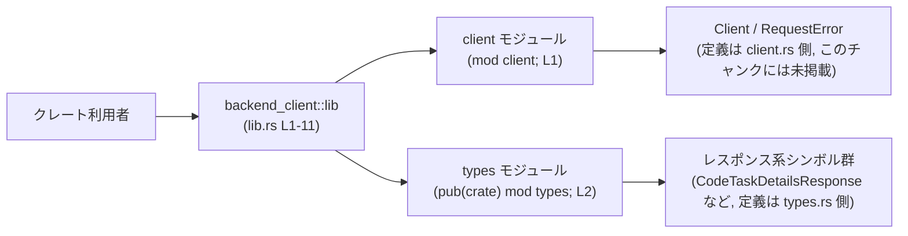

# backend-client/src/lib.rs

## 0. ざっくり一言

`backend-client` クレートの **公開 API をまとめて再エクスポートするための入口モジュール** です。  
`Client` や各種レスポンス系の型をクレートのルート名前空間から利用できるようにしています（lib.rs:L1-11）。

---

## 1. このモジュールの役割

### 1.1 概要

- このモジュールは、`client` モジュールおよび `types` モジュールで定義されているシンボルをクレート外部に公開する役割を持ちます（lib.rs:L1-2, L4-11）。
- 外部利用者は `backend_client::Client` などの形で直接型を利用でき、内部のモジュール構成を意識せずに済むようになっています（lib.rs:L4-11）。

### 1.2 アーキテクチャ内での位置づけ

このファイルから読み取れる範囲でのモジュール依存関係を図示します。



- `mod client;` により `client` モジュールがクレート内に定義されます（lib.rs:L1）。
- `pub(crate) mod types;` により `types` モジュールはクレート内に公開されますが、クレート外からは直接参照できません（lib.rs:L2）。
- `pub use` により、`Client`, `RequestError` およびレスポンス関連シンボルがクレートのルートから公開されています（lib.rs:L4-11）。

### 1.3 設計上のポイント

このファイルから読み取れる設計上の特徴です。

- **公開 API の集約**  
  - 外部に見せるシンボルをすべて `lib.rs` に集約し、`pub use` で再エクスポートしています（lib.rs:L4-11）。
- **内部モジュールの隠蔽**  
  - `types` モジュールは `pub(crate)` として定義されており、クレート外からは直接 `backend_client::types::...` と参照できません（lib.rs:L2）。
  - 代わりに必要な型のみをルートから `pub use` しています（lib.rs:L6-11）。
- **責務の分離**  
  - 実際のロジックや型定義は `client` / `types` モジュール側にあり、このファイルはそれらの「窓口」としてのみ機能しています（lib.rs:L1-2, L4-11）。
- **エラー型の明示的公開**  
  - `RequestError` が `Client` と並んで公開されており、エラー処理用の型をクレート利用者に提供していることが分かります（lib.rs:L5）。

※ このファイル自体にはロジック（関数・メソッド・I/O）は一切含まれず、メモリ安全性・並行性・エラーハンドリングの具体的な実装はすべて他ファイルに存在します。

### 1.4 コンポーネント一覧（インベントリー）

このチャンクに現れるモジュール／シンボルの一覧です。

| 名前 | 種別 | 公開範囲 | 定義元（モジュール） | 説明（このファイルから読み取れる範囲） | 根拠 |
|------|------|----------|----------------------|------------------------------------------|------|
| `client` | モジュール | クレート内 | `client` | `mod client;` により定義される内部モジュール。中身はこのチャンクには現れません。 | `backend-client/src/lib.rs:L1-1` |
| `types` | モジュール | `pub(crate)`（クレート内公開） | `types` | クレート内からのみ参照可能なモジュール。外部には中の一部シンボルのみが再エクスポートされています。 | `backend-client/src/lib.rs:L2-2` |
| `Client` | 再エクスポートされたシンボル（詳細種別は不明） | `pub`（クレート外公開） | `client` モジュール | クレート利用者が `backend_client::Client` として利用できるように再エクスポートされています。 | `backend-client/src/lib.rs:L4-4` |
| `RequestError` | 再エクスポートされたシンボル（詳細種別は不明） | `pub` | `client` モジュール | エラー関連のシンボル。クレート利用者が `backend_client::RequestError` として利用できます。 | `backend-client/src/lib.rs:L5-5` |
| `CodeTaskDetailsResponse` | 再エクスポートされたシンボル（詳細種別は不明） | `pub` | `types` モジュール | コードタスク詳細のレスポンスと思われるシンボルですが、種別・構造はこのチャンクには現れません。 | `backend-client/src/lib.rs:L6-6` |
| `CodeTaskDetailsResponseExt` | 再エクスポートされたシンボル（詳細種別は不明） | `pub` | `types` モジュール | `CodeTaskDetailsResponse` に関連する拡張機能を表すシンボル名ですが、詳細は不明です。 | `backend-client/src/lib.rs:L7-7` |
| `ConfigFileResponse` | 再エクスポートされたシンボル（詳細種別は不明） | `pub` | `types` モジュール | 設定ファイルに関するレスポンスを表すシンボル名ですが、詳細は不明です。 | `backend-client/src/lib.rs:L8-8` |
| `PaginatedListTaskListItem` | 再エクスポートされたシンボル（詳細種別は不明） | `pub` | `types` モジュール | ページネーションされたタスクリストの要素を表すシンボル名ですが、詳細は不明です。 | `backend-client/src/lib.rs:L9-9` |
| `TaskListItem` | 再エクスポートされたシンボル（詳細種別は不明） | `pub` | `types` モジュール | タスクリストの1要素を表すシンボル名ですが、詳細は不明です。 | `backend-client/src/lib.rs:L10-10` |
| `TurnAttemptsSiblingTurnsResponse` | 再エクスポートされたシンボル（詳細種別は不明） | `pub` | `types` モジュール | `TurnAttempts` と関連するレスポンスと思われますが、構造・用途はこのチャンクには現れません。 | `backend-client/src/lib.rs:L11-11` |

※ 「詳細種別」は `struct` / `enum` / `type alias` / `trait` などの可能性がありますが、このファイルだけでは判別できないため「不明」としています。

---

## 2. 主要な機能一覧

このファイルが提供する実質的な「機能」は、**型やシンボルの再エクスポートによる公開 API の整形** に限定されます。

- クレートのルートから `Client` 型と思われるシンボルを利用可能にする（lib.rs:L4）。
- クレートのルートからエラー型と思われる `RequestError` を利用可能にする（lib.rs:L5）。
- クレートのルートから複数のレスポンス系シンボル（`CodeTaskDetailsResponse` など）を利用可能にする（lib.rs:L6-11）。
- `types` モジュール自体は `pub(crate)` として隠蔽しつつ、必要なシンボルのみ選択的に外部公開する（lib.rs:L2, L6-11）。

※ コアロジック（HTTP 呼び出しやシリアライズなど）は `client` / `types` モジュール側に存在し、このファイルには現れていません。

---

## 3. 公開 API と詳細解説

### 3.1 型一覧（公開シンボル一覧）

このファイルから外部に公開される主なシンボルをまとめます。

| 名前 | 種別（このファイルから読める範囲） | 定義モジュール | 用途 / 役割（推測を含まない範囲） | 根拠 |
|------|------------------------------------|----------------|--------------------------------------|------|
| `Client` | 不明（型またはその他のシンボル） | `client` | クレート利用者が直接利用することを意図したシンボル。`pub use` でルートに再公開されています。 | `backend-client/src/lib.rs:L4-4` |
| `RequestError` | 不明（エラー用シンボル） | `client` | エラー関連のシンボル。`Client` とペアで公開されているため、`Client` 利用時のエラー表現に関係すると考えられますが、詳細はコードからは分かりません。 | `backend-client/src/lib.rs:L5-5` |
| `CodeTaskDetailsResponse` | 不明 | `types` | `types` モジュールに定義されている公開シンボル。詳細はこのチャンクには現れません。 | `backend-client/src/lib.rs:L6-6` |
| `CodeTaskDetailsResponseExt` | 不明 | `types` | `CodeTaskDetailsResponse` に関連する拡張的なシンボルとして命名されていますが、内容は不明です。 | `backend-client/src/lib.rs:L7-7` |
| `ConfigFileResponse` | 不明 | `types` | 設定ファイルに関する応答を表すシンボル名ですが、内部構造は不明です。 | `backend-client/src/lib.rs:L8-8` |
| `PaginatedListTaskListItem` | 不明 | `types` | ページングされたタスク一覧の要素を表すシンボル名ですが、詳細は不明です。 | `backend-client/src/lib.rs:L9-9` |
| `TaskListItem` | 不明 | `types` | タスクリストの単一要素を表すシンボル名ですが、詳細は不明です。 | `backend-client/src/lib.rs:L10-10` |
| `TurnAttemptsSiblingTurnsResponse` | 不明 | `types` | `Turn`／`Attempts` に関連する応答を表すシンボル名ですが、詳細は不明です。 | `backend-client/src/lib.rs:L11-11` |

> このファイルには、これらのシンボルのフィールドやメソッド、トレイト実装に関する情報は一切現れません。そのため、型の構造やエッジケース、並行性関連の性質などは、このチャンクからは判断できません。

### 3.2 関数詳細

- **このファイルには関数定義が存在しません。**  
  すべての行はモジュール宣言および再エクスポートのみで構成されており、呼び出し可能な関数やメソッドシンボルは一切定義されていません（lib.rs:L1-11）。

したがって、関数ごとの詳細テンプレート（引数・戻り値・エラー条件など）は、このファイル単体では作成できません。

### 3.3 その他の関数

- このチャンクにはヘルパー関数やラッパー関数も一切現れません。

---

## 4. データフロー

このファイルには実行時の処理ロジックが存在しないため、**実行時データフロー** は読み取れません。  
代わりに、「名前解決レベル」でのシンボルの流れ（どこからどこへ公開されるか）を示します。

### 4.1 シンボル公開のフロー

```mermaid
sequenceDiagram
    participant U as クレート利用者
    participant L as backend_client::lib<br/>(lib.rs L1-11)
    participant C as client モジュール
    participant T as types モジュール

    U->>L: use backend_client::Client;<br/>use backend_client::CodeTaskDetailsResponse;
    Note over L: lib.rs がクレートの公開 API の入口
    L->>C: Client / RequestError の定義を解決<br/>(mod client; L1, pub use client::... L4-5)
    L->>T: レスポンス系シンボルの定義を解決<br/>(pub(crate) mod types; L2, pub use types::... L6-11)
    Note over U,L: 利用者は内部モジュール構造を意識せずに<br/>ルート名でシンボルを利用できる
```

要点:

- クレート利用者は `backend_client::シンボル名` と書くだけで、`client` / `types` モジュールの中身にアクセスできます（lib.rs:L4-11）。
- 実際の型の定義やデータ処理は `client.rs` / `types.rs` 側にあり、このファイルはそれらを束ねる「フロント」に相当します（lib.rs:L1-2）。
- セキュリティやバグリスク・エラーハンドリング・並行性の考慮点は、このフロントではなく、定義元モジュール側で決まります。このチャンクからはそれらの詳細は不明です。

---

## 5. 使い方（How to Use）

### 5.1 基本的な使用方法

このファイルが提供する主な価値は「ルートからのインポート」です。  
典型的には、外部クレート側で次のように利用できます。

```rust
// backend-client クレートの公開シンボルをインポートする
use backend_client::{
    Client,               // lib.rs から再エクスポート（L4）
    RequestError,         // lib.rs から再エクスポート（L5）
    CodeTaskDetailsResponse,
    TaskListItem,
};

fn main() {
    // Client の具体的なコンストラクタやメソッド、
    // 各レスポンス型のフィールド構造などは client.rs / types.rs 側の定義によります。
    // lib.rs にはそれらの情報は含まれていないため、
    // ここではインポートまでしかコード例を示せません。
}
```

- **前提**: `backend-client` クレートを依存関係として追加していること（Cargo.toml による設定）。これはこのチャンクには現れませんが、Rust プロジェクトの一般的な前提です。
- **注意**: `types` モジュール自体は `pub(crate)` なので、外部から `backend_client::types::CodeTaskDetailsResponse` のように参照することはできません（lib.rs:L2, L6-11）。

### 5.2 よくある使用パターン

このファイルからは `Client` のメソッドやレスポンス型の詳細が分からないため、「よくある処理フロー」のコード例（例: `client.get_task_details(...)` のようなもの）は提示できません。

このチャンクで確認できる典型パターンは **「ルートからのインポート」** のみです。

```rust
// ○ ルートから再エクスポートされた型を使う
use backend_client::Client;
use backend_client::TaskListItem;
```

### 5.3 よくある間違い

`types` モジュールの可視性に起因する誤用が想定されます。

```rust
// 間違い例: types モジュールは pub(crate) なので外部クレートからは参照できない
// use backend_client::types::ConfigFileResponse;

// 正しい例: lib.rs で再エクスポートされたシンボルをルートから利用する
use backend_client::ConfigFileResponse;

fn main() {
    // ConfigFileResponse を使用する
}
```

- 間違いの原因: `pub(crate) mod types;` により、`types` モジュールはクレート内部専用です（lib.rs:L2）。
- 対策: 外部からは常に `backend_client::Xxx` 形式で、`lib.rs` が再エクスポートしているシンボルを経由して利用する必要があります（lib.rs:L4-11）。

### 5.4 使用上の注意点（まとめ）

このファイルに関する使用上の注意点をまとめます。

- **API の入口は常にクレートルート**  
  - 外部コードは `backend_client::Client` など、ルートからアクセスする前提となっています（lib.rs:L4-11）。
- **内部モジュールに依存しない**  
  - `client` や `types` モジュールのパスに直接依存すると、可視性制約（`pub(crate)`）や将来のリファクタリングで壊れる可能性があります（lib.rs:L1-2）。
- **エラー型の利用**  
  - `RequestError` をルートから利用できるようにしているため、エラー処理にはこのシンボルを使うことが前提になっていると考えられますが、具体的な契約（どの操作でどのエラーが返るか）はこのチャンクからは分かりません（lib.rs:L5）。
- **並行性・スレッド安全性**  
  - `Client` や各種レスポンス型が `Send` / `Sync` かどうか、スレッド間で共有可能かどうかは、このファイルからは判断できません。並行性に関する使用上の注意は、定義元ファイルの分析が別途必要です。

---

## 6. 変更の仕方（How to Modify）

### 6.1 新しい機能を追加する場合

このファイルに対する代表的な変更は、**新しいシンボルを公開 API に追加する** 場合です。

1. **定義の追加**  
   - まず `client.rs` または `types.rs` に新しい型や関数を定義します。  
     （このチャンクにはそれらのファイルの中身は現れませんが、`mod client;` / `pub(crate) mod types;` から存在が推測されます: lib.rs:L1-2）
2. **再エクスポートの追加**  
   - `backend-client/src/lib.rs` に `pub use` を追加して、ルートからアクセスできるようにします。例:

     ```rust
     // client.rs に NewFeatureClient というシンボルを定義した場合の例
     mod client;
     pub(crate) mod types;

     pub use client::Client;
     pub use client::RequestError;
     pub use client::NewFeatureClient; // 新しい再エクスポート
     ```

3. **公開範囲の確認**  
   - 外部クレートから見せたい場合は `pub use` にする必要があります。クレート内だけでよい場合は `pub(crate) use` など、別の可視性指定を選ぶこともできます（ただし、このファイルでは `pub` のみが使われています: lib.rs:L4-11）。
4. **影響範囲の確認**  
   - 既存の公開 API に変更を加える場合（シンボル名の変更・削除など）は、外部クレートでの利用箇所が壊れる可能性があるため、注意が必要です。

### 6.2 既存の機能を変更する場合

- **公開シンボルの削除 / 名前変更**  
  - `pub use` 行を削除またはリネームすると、外部 API が変わります（lib.rs:L4-11）。
  - 変更前に、外部からそのシンボルが使用されていないかを検索する必要があります（リポジトリ全体の検索など）。
- **可視性の変更**  
  - `pub use` を `pub(crate) use` に変えることで、クレート内専用にすることもできますが、このファイルではそのような例は見られません。
- **`types` モジュールの公開範囲変更**  
  - `pub(crate) mod types;` を `pub mod types;` に変更すると、`backend_client::types::...` のようなアクセスが外部から可能になります（lib.rs:L2）。
  - ただし、内部構造を外部に晒すことになるため、API 安定性やカプセル化の観点で慎重な検討が必要です。

---

## 7. 関連ファイル

このファイルから参照されている関連ファイルと、その関係です。

| パス（推定） | 役割 / 関係 | 根拠 |
|-------------|------------|------|
| `backend-client/src/client.rs` または `backend-client/src/client/mod.rs` | `mod client;` に対応するモジュール定義ファイル。`Client` や `RequestError` など、このファイルから再エクスポートされているシンボルの定義が存在すると考えられます。実際のコードはこのチャンクには現れません。 | `backend-client/src/lib.rs:L1-1`, `L4-5` |
| `backend-client/src/types.rs` または `backend-client/src/types/mod.rs` | `pub(crate) mod types;` に対応するモジュール定義ファイル。`CodeTaskDetailsResponse` などのレスポンス系シンボルの定義が存在すると考えられます。実際のコードはこのチャンクには現れません。 | `backend-client/src/lib.rs:L2-2`, `L6-11` |

### Bugs / Security / Contracts / Edge Cases / Tests / Performance について

- **Bugs / Security**:  
  - このファイルはモジュール宣言と再エクスポートのみで構成され、ロジック・I/O・状態管理が一切ないため、このファイル単体としてのバグ・セキュリティリスクはほぼありません。
  - 実際のリスクはすべて `client` / `types` モジュール側の実装に依存し、このチャンクからは評価できません。
- **Contracts / Edge Cases**:  
  - 公開シンボルの振る舞いや前提条件、エッジケースに関する契約は、このファイルには一切記述されていません。
- **Tests**:  
  - テストコードやテストに関する記述（`#[cfg(test)]` など）は、このファイルには存在しません。
- **Performance / Scalability / Observability**:  
  - いずれもロジックを持たないため、このファイル単体として評価対象外です。  
    実際の性能や監視用フックなどは、定義元モジュール側の分析が必要です。

以上が、`backend-client/src/lib.rs` の、このチャンクから読み取れる範囲での構造と役割の整理です。
