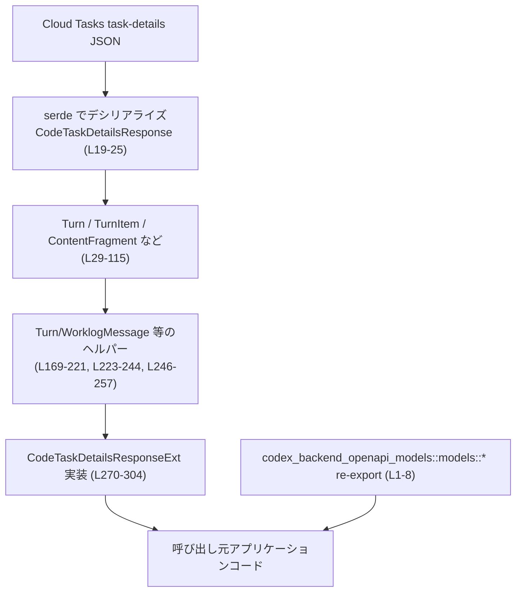
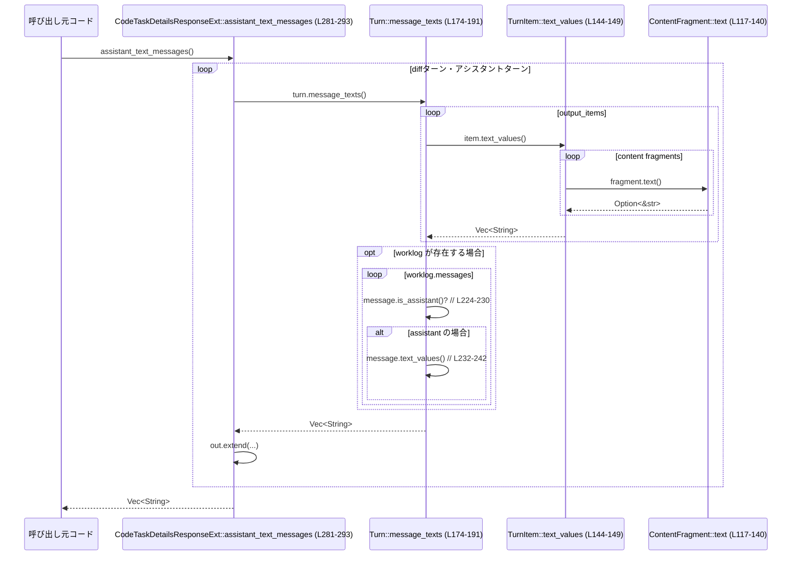

# backend-client/src/types.rs コード解説

## 0. ざっくり一言

Cloud Tasks の task-details レスポンス用に、手書きのモデル構造体と、それから「統合差分 (unified diff)・アシスタントメッセージ・ユーザープロンプト・エラーメッセージ」を簡単に取り出すための拡張トレイトを提供するモジュールです。また、他エンドポイント用の OpenAPI 生成型を re-export しています（backend-client/src/types.rs:L1-8, L18-26, L259-304）。

---

## 1. このモジュールの役割

### 1.1 概要

- Cloud Tasks の「task-details」API が返す JSON を、Rust で扱いやすい構造体にマッピングします（`CodeTaskDetailsResponse` など, L18-26, L29-115）。
- その構造体から、よく使う情報（diff テキスト・アシスタントのテキスト応答・ユーザープロンプト・エラー要約）を取り出すヘルパーメソッド群を提供します（`CodeTaskDetailsResponseExt` トレイト, L259-268, 実装 L270-304）。
- Cloud Tasks の別のレスポンス（sibling turns）のための薄いラッパー型も定義しています（`TurnAttemptsSiblingTurnsResponse`, L314-318）。
- それ以外の多くの API 型は別クレート (`codex_backend_openapi_models`) から再利用し、このモジュールで re-export しています（L1-8）。

### 1.2 アーキテクチャ内での位置づけ

Cloud Tasks の JSON → serde で構造体へ → このモジュールのヘルパーでドメイン寄りの情報に変換、という流れになっています。



- 呼び出し元は通常 `CodeTaskDetailsResponse` を JSON から復元し、`CodeTaskDetailsResponseExt` を通じて必要な文字列情報を取得します。
- このチャンクから、`CodeTaskDetailsResponse` がどこで生成されているか（HTTP クライアントなど）は分かりません。

### 1.3 設計上のポイント

- **手書きモデル + serde 属性**  
  - `#[derive(Deserialize)]` とフィールド単位の `#[serde(default)]` により、欠損フィールドや `null` に対して頑健なデシリアライズを行います（例: `Turn.input_items` など, L36-41, L85-86）。
  - `deserialize_vec` カスタムデシリアライザで、「存在しない or null の配列 → 空ベクタ」に統一しています（L306-312）。
- **ヘルパーメソッドによる解釈ロジックのカプセル化**  
  - テキスト抽出は `ContentFragment::text` → `TurnItem::text_values` → `Turn::message_texts` / `Turn::user_prompt` → `CodeTaskDetailsResponseExt` という段階的な構造になっています（L117-140, L143-149, L174-191, L193-216, L270-303）。
- **エラーハンドリング**  
  - 実行時のロジックは `Option` / `Vec` ベースで書かれており、`unwrap` を使わずに `unwrap_or` / `unwrap_or_default` で安全にデフォルト値へフォールバックしています（L248-249, L311）。
  - パニックを起こしうるコードはテスト内の `panic!` のみです（L329）。
- **並行性**  
  - このモジュールの型と関数はすべて同期的で、副作用のないデータ処理のみを行います。`async` やスレッド関連のコードは登場しません。

---

## 2. 主要な機能一覧（コンポーネントインベントリー）

### 2.1 型（構造体・列挙体・トレイト）の一覧

| 名前 | 種別 | 公開 | 行範囲 | 役割 / 用途 |
|------|------|------|--------|-------------|
| `ConfigFileResponse` 他7種 | re-export | pub | L1-8 | `codex_backend_openapi_models::models` からの設定・プラン・レートリミットなどの型の再公開。 |
| `CodeTaskDetailsResponse` | 構造体 | pub | L19-25 | Cloud Tasks task-details のうち、現ユーザー・アシスタント・diff ターンだけをまとめたルート型。 |
| `Turn` | 構造体 | pub | L29-45 | 1 つの「ターン」（ユーザーあるいはアシスタントの発話/処理）を表す。入出力アイテム・ワークログ・エラーなどを保持。 |
| `TurnItem` | 構造体 | pub | L49-59 | ターン内の 1 アイテム（メッセージ・diff など）を表す。`kind`, `role`, `content`, `diff` を含む。 |
| `ContentFragment` | enum | pub | L62-67 | メッセージ内容の 1 fragment。構造化オブジェクト or プレーン文字列を表現 (`serde(untagged)`)。 |
| `StructuredContent` | 構造体 | pub | L70-74 | `ContentFragment::Structured` 用の中身。`content_type` と `text` を持つ。 |
| `DiffPayload` | 構造体 | pub | L78-80 | PR ターンなどで使われる diff のペイロード。 |
| `Worklog` | 構造体 | pub | L84-86 | ターンに紐付くワークログ（メッセージ列）。 |
| `WorklogMessage` | 構造体 | pub | L90-94 | ワークログ内メッセージ。著者情報と内容を保持。 |
| `Author` | 構造体 | pub | L98-100 | ワークログメッセージの著者（ロール）。 |
| `WorklogContent` | 構造体 | pub | L104-106 | ワークログメッセージのコンテンツ（`ContentFragment` の配列）。 |
| `TurnError` | 構造体 | pub | L110-114 | ターンレベルのエラーコードとメッセージ。 |
| `CodeTaskDetailsResponseExt` | トレイト | pub | L259-268 | `CodeTaskDetailsResponse` から diff / テキスト / エラーを抽出する拡張インターフェース。 |
| `TurnAttemptsSiblingTurnsResponse` | 構造体 | pub | L314-318 | sibling turns のリストをラップするレスポンス。中身は動的 (`HashMap<String, Value>`)。 |

### 2.2 関数・メソッドのインベントリー（概要）

主なメソッド・関数と役割の一覧です。

| 関数 / メソッド名 | 所属 | 公開 | 行範囲 | 役割（1 行） |
|-------------------|------|------|--------|--------------|
| `ContentFragment::text` | impl ContentFragment | 非pub | L117-140 | Fragment をテキストとして解釈し、空文字や非 text タイプを除外して `Option<&str>` を返す。 |
| `TurnItem::text_values` | impl TurnItem | 非pub | L144-149 | `content` 配列から `ContentFragment::text` を通してテキストだけを `Vec<String>` で取得。 |
| `TurnItem::diff_text` | impl TurnItem | 非pub | L151-166 | `kind` と `diff` / `output_diff` から diff テキストを `Option<String>` として抽出。 |
| `Turn::unified_diff` | impl Turn | 非pub | L170-172 | ターンの `output_items` から最初に見つかる diff を返す。 |
| `Turn::message_texts` | impl Turn | 非pub | L174-191 | `output_items` と `worklog` からアシスタントのメッセージテキストを収集。 |
| `Turn::user_prompt` | impl Turn | 非pub | L193-216 | ユーザーの入力メッセージを 2 行改行で連結した 1 文字列として返す。 |
| `Turn::error_summary` | impl Turn | 非pub | L218-220 | `TurnError::summary` を呼び出し、エラー要約を返す。 |
| `WorklogMessage::is_assistant` | impl WorklogMessage | 非pub | L224-230 | 著者ロールが `assistant` かどうか判定。 |
| `WorklogMessage::text_values` | impl WorklogMessage | 非pub | L232-242 | ワークログメッセージのテキスト fragment を抽出。 |
| `TurnError::summary` | impl TurnError | 非pub | L247-256 | `code` と `message` を組み合わせた要約文字列を生成。 |
| `CodeTaskDetailsResponseExt::unified_diff` | impl トレイト | pub | L271-279 | diff ターン優先で unified diff を取り出す。 |
| `CodeTaskDetailsResponseExt::assistant_text_messages` | 同上 | pub | L281-293 | アシスタント側のテキスト出力メッセージをすべてリストアップ。 |
| `CodeTaskDetailsResponseExt::user_text_prompt` | 同上 | pub | L295-297 | 現在のユーザーターンから入力プロンプトを取り出す。 |
| `CodeTaskDetailsResponseExt::assistant_error_message` | 同上 | pub | L299-303 | アシスタントターンのエラー要約文字列を返す。 |
| `deserialize_vec` | モジュール関数 | 非pub | L306-312 | 任意の `Vec<T>` フィールドを `Option` 経由でデシリアライズし、欠損/null → 空ベクタに変換。 |
| `tests::fixture` | テスト用関数 | 非pub | L325-332 | JSON フィクスチャ (`diff` / `error`) を読み込み `CodeTaskDetailsResponse` にデシリアライズ。 |
| テスト関数4つ | テスト | 非pub | L334-374 | それぞれ diff 優先順・fallback・メッセージ抽出・プロンプト結合・エラー要約を検証。 |

---

## 3. 公開 API と詳細解説

### 3.1 型一覧（構造体・列挙体など）

（再掲ですが、公開 API として重要なものに絞って整理します。）

| 名前 | 種別 | 役割 / 用途 | 根拠 |
|------|------|-------------|------|
| `CodeTaskDetailsResponse` | 構造体 | Cloud Tasks の task-details レスポンスのうち、現在の user / assistant / diff ターンだけを保持するルート型。 | L19-25 |
| `Turn` | 構造体 | 個々のターン（入力・出力・ワークログ・エラー）をまとめたコンテナ。 | L29-45 |
| `TurnItem` | 構造体 | ターン内の 1 アイテム（メッセージ・diff・PR など）。 | L49-59 |
| `ContentFragment` | enum | メッセージコンテンツの fragment。構造化 (`StructuredContent`) か生テキスト。 | L62-67 |
| `Worklog` / `WorklogMessage` / `Author` / `WorklogContent` | 構造体 | ワークログ機能：内部ログメッセージとその著者・内容。 | L84-107, L90-95, L98-101 |
| `TurnError` | 構造体 | ターン失敗時の `code` / `message`。 | L110-115 |
| `CodeTaskDetailsResponseExt` | トレイト | `CodeTaskDetailsResponse` に対する高レベルなユーティリティメソッド群。 | L259-268, L270-304 |
| `TurnAttemptsSiblingTurnsResponse` | 構造体 | sibling ターン群をラップするレスポンス。中身は構造が安定しないため `HashMap<String, Value>` として保持。 | L314-318 |

### 3.2 関数詳細（7 件）

#### 1. `ContentFragment::text(&self) -> Option<&str>`

**概要**

`ContentFragment` を「テキスト」として解釈し、有効なテキストだけを返します。構造化コンテンツの場合は `content_type == "text"` のものだけを対象とし、空文字や空白のみの文字列は無視します（L117-140）。

**引数**

| 引数名 | 型 | 説明 |
|--------|----|------|
| `&self` | `&ContentFragment` | 対象のコンテンツフラグメント。所有権は移動せず、借用（参照）だけを行います。 |

**戻り値**

- `Option<&str>`:  
  - 一致するテキストがあり、かつ空でない場合に `Some(&str)`。  
  - それ以外（型が text でない / 空文字 / 空白のみ / `text` フィールドが None）の場合は `None`。

**内部処理の流れ**

1. `match self` で `Structured` / `Text` のどちらかを分岐（L119-132）。
2. `Structured` の場合:
   - `inner.content_type` を参照し、`eq_ignore_ascii_case("text")` で大文字小文字を無視して比較（L121-125）。
   - content_type が `"text"` であれば `inner.text.as_deref()` を取り、`filter(|s| !s.is_empty())` で空文字列を除外（L127）。
3. `Text` の場合:
   - 文字列を `trim()` し、空白のみであれば `None` を返し、それ以外は `Some(raw.as_str())`（L133-137）。

**Examples（使用例）**

```rust
// Structured な text コンテンツ
let frag = ContentFragment::Structured(StructuredContent {
    content_type: Some("text".to_string()),
    text: Some("Hello".to_string()),
}); // backend-client/src/types.rs:L70-74, L64-66

assert_eq!(frag.text(), Some("Hello"));

// プレーン文字列だが空白のみ → None
let frag2 = ContentFragment::Text("   ".to_string());
assert_eq!(frag2.text(), None);
```

**Errors / Panics**

- このメソッド内でパニックを起こす可能性のある操作（`unwrap` 等）はありません（L117-140）。
- `Option` や `as_deref` はすべて安全な操作です。

**Edge cases（エッジケース）**

- `content_type` が `"TEXT"` など大文字小文字違い: `eq_ignore_ascii_case` で許容されます（L121-125）。
- `content_type` が `None` または `"code"` など `"text"` 以外: 常に `None`。
- `text` が `Some("")`（空文字）: `filter(|s| !s.is_empty())` により `None`。
- `Text` バリアントで空白のみ: `trim().is_empty()` → `None`（L133-134）。

**使用上の注意点**

- 「この fragment がテキストを持っているか」を判定するための内部ヘルパーという位置づけであり、外部 API から直接呼び出されることはありません（モジュール外からは非公開, L117）。
- 空白のみのテキストが自動的に無視される点に依存するロジック（たとえば、空行も保持したいケース）は、このメソッドを使わず直接 `StructuredContent` / `String` を扱う必要があります。

---

#### 2. `TurnItem::diff_text(&self) -> Option<String>`

**概要**

`TurnItem` が diff を表すアイテムであれば、その diff テキストを `Option<String>` として返します。`kind` フィールドに応じて、`diff` もしくは `output_diff.diff` を参照します（L151-166）。

**引数**

| 引数名 | 型 | 説明 |
|--------|----|------|
| `&self` | `&TurnItem` | 対象のターンアイテム。 |

**戻り値**

- `Option<String>`:  
  - `kind == "output_diff"` で `diff` が `Some` かつ非空の場合 → そのクローン。  
  - `kind == "pr"` で `output_diff.diff` が `Some` かつ非空の場合 → そのクローン。  
  - それ以外 → `None`。

**内部処理の流れ**

1. `if self.kind == "output_diff"` の場合（L152）、
   - `if let Some(diff) = &self.diff && !diff.is_empty()` で diff の存在と非空を確認（L153-155）。
   - 条件を満たせば `Some(diff.clone())` を返す（L156）。
2. それ以外で `kind == "pr"` の場合（L158）、
   - `output_diff` → `payload.diff` のネストされた `Option` を `if let` で取り出し、非空チェックを行う（L159-161）。
   - 同様に `Some(diff.clone())` を返す（L163）。
3. どちらにも当てはまらない場合は `None`（L165）。

**Examples（使用例）**

```rust
// output_diff タイプの TurnItem
let item = TurnItem {
    kind: "output_diff".to_string(),
    diff: Some("diff --git ...".to_string()),
    ..Default::default()
}; // L49-59

assert!(item.diff_text().unwrap().starts_with("diff --git"));

// kind が pr の場合は output_diff.diff を参照
let item_pr = TurnItem {
    kind: "pr".to_string(),
    output_diff: Some(DiffPayload {
        diff: Some("diff --git ...".to_string()),
    }),
    ..Default::default()
};

assert!(item_pr.diff_text().is_some());
```

**Errors / Panics**

- パニックを起こす操作はありません。すべて `Option` のパターンマッチと `clone` のみです（L151-166）。

**Edge cases**

- `kind` が `"output_diff"` だが `diff` が `None` または空文字: `None` を返します。
- `kind` が `"pr"` だが `output_diff` / `payload.diff` が欠損または空文字: `None`。
- その他の `kind`（例: `"message"`）: 常に `None`。

**使用上の注意点**

- diff が複数含まれるターンでも、このメソッドは 1 アイテムに対して 1 つだけ diff を返します。ターン全体に対して最初の diff を拾うのは `Turn::unified_diff` の責務です（L170-172）。
- `kind` の文字列値に強く依存しているため、新しい diff タイプが API に追加された場合は、このメソッドの条件分岐も更新する必要が生じる可能性があります（このチャンクからはどのような拡張が予定されているかは分かりません）。

---

#### 3. `TurnError::summary(&self) -> Option<String>`

**概要**

`TurnError` の `code` と `message` を読みやすい 1 行のメッセージにまとめて返します（L247-256）。

**引数**

| 引数名 | 型 | 説明 |
|--------|----|------|
| `&self` | `&TurnError` | エラーオブジェクト。 |

**戻り値**

- `Option<String>`:  
  - `code` も `message` も空: `None`。  
  - `code` のみ非空: `Some(code.clone())`。  
  - `message` のみ非空: `Some(message.clone())`。  
  - 両方非空: `"code: message"` という形式の文字列。

**内部処理の流れ**

1. `code` と `message` を `as_deref().unwrap_or("")` で `&str` に変換し、`None` の場合は空文字にする（L248-249）。
2. `(code.is_empty(), message.is_empty())` の組み合わせに応じて `match`（L250-255）。
3. それぞれのケースで `Some` or `None` を返す。

**Examples（使用例）**

```rust
let err = TurnError {
    code: Some("APPLY_FAILED".to_string()),
    message: Some("Patch could not be applied".to_string()),
}; // L110-115

assert_eq!(
    err.summary().as_deref(),
    Some("APPLY_FAILED: Patch could not be applied")
);
```

テスト `assistant_error_message_combines_code_and_message` で、この振る舞いが確認されています（L367-374）。

**Errors / Panics**

- `unwrap_or` は `Option` に対して安全にデフォルト値を返すため、ここではパニックは発生しません。

**Edge cases**

- 両方 `None` / 空文字: `None`。
- どちらか一方だけセットされている場合: その値のみを返す（L252-253）。

**使用上の注意点**

- `code` / `message` が非常に長い文字列であっても特別な制限はありませんが、ログ出力等で使用する場合は呼び出し側で長さ制御を行う必要があります（このモジュール内部では制限していません）。

---

#### 4. `CodeTaskDetailsResponseExt::unified_diff(&self) -> Option<String>`

**概要**

`CodeTaskDetailsResponse` に対する拡張メソッドです。現在の diff タスクターンとアシスタントターンから unified diff を探し、見つかった最初のものを返します。diff タスクターンが優先されます（L271-279）。

**引数**

| 引数名 | 型 | 説明 |
|--------|----|------|
| `&self` | `&CodeTaskDetailsResponse` | タスク詳細レスポンス。 |

**戻り値**

- `Option<String>`: diff ターン、次にアシスタントターンから見つかった unified diff テキスト。なければ `None`。

**内部処理の流れ**

1. `[self.current_diff_task_turn.as_ref(), self.current_assistant_turn.as_ref()]` という配列を作る（L272-275）。
2. `into_iter().flatten()` によって `Option<&Turn>` の列を `&Turn` の列に変換（`None` はスキップ, L276-277）。
3. 各ターンに対して `Turn::unified_diff` を呼び、`find_map` で最初の `Some(diff)` を返す（L278）。

`Turn::unified_diff` 自体は `self.output_items.iter().find_map(TurnItem::diff_text)` で、最初に diff を持つアイテムを探します（L170-172）。

**Examples（使用例）**

```rust
fn print_diff(details: &CodeTaskDetailsResponse) {
    if let Some(diff) = details.unified_diff() { // L271-279
        println!("Got diff:\n{diff}");
    }
}
```

テスト `unified_diff_prefers_current_diff_task_turn` と `unified_diff_falls_back_to_pr_output_diff` で、diff タスクターンが優先されること、および PR 出力の diff にフォールバックすることが検証されています（L334-346）。

**Errors / Panics**

- パニックは発生しません。`Option` とイテレータ操作のみです。

**Edge cases**

- `current_diff_task_turn` / `current_assistant_turn` 両方 `None`: `None`。
- どちらも存在するが、どの `TurnItem` も diff を持たない: `None`。
- diff が複数ある場合: 各ターンごとに最初の diff のみが対象となり、さらに diff タスクターン全体がアシスタントターンより優先されます。

**使用上の注意点**

- 返り値は `Option` のため、呼び出し側で `unwrap()` などを用いると diff がない場合にパニックを引き起こす可能性があります。`if let` や `unwrap_or` などで安全に扱うことが前提です。
- diff のフォーマット（`diff --git ...` といった unified diff フォーマット）は API 側に依存しており、このモジュールは文字列としてそのまま扱うだけです（L335-338 のテストでは `contains("diff --git")` を確認）。

---

#### 5. `CodeTaskDetailsResponseExt::assistant_text_messages(&self) -> Vec<String>`

**概要**

現在の diff タスクターンとアシスタントターンから、アシスタントのテキストメッセージをすべて収集して返します。ターンの `output_items` に含まれる `kind == "message"` のアイテムと、ワークログ内のアシスタントメッセージが対象です（L281-293, L174-191, L223-244）。

**引数**

| 引数名 | 型 | 説明 |
|--------|----|------|
| `&self` | `&CodeTaskDetailsResponse` | タスク詳細レスポンス。 |

**戻り値**

- `Vec<String>`: 抽出されたメッセージテキストのリスト。1つもなければ空ベクタ。

**内部処理の流れ**

1. 空の `Vec` を用意（L282）。
2. diff ターン・アシスタントターンの `Option<&Turn>` を配列にして `into_iter().flatten()` し、実在するターンだけを反復（L283-288）。
3. 各ターンに対し `turn.message_texts()` を呼び、その結果を `out.extend` で追加（L290-291）。
4. `Turn::message_texts` 内では（L174-191）:
   - `output_items` から `kind == "message"` のアイテムを選び、`TurnItem::text_values` でテキストを集める（L176-180, L144-149）。
   - `worklog` があれば、`WorklogMessage::is_assistant()` が true のものに対して `text_values` を呼び、その結果を統合（L182-188, L224-242）。

**Examples（使用例）**

```rust
fn log_assistant_responses(details: &CodeTaskDetailsResponse) {
    for msg in details.assistant_text_messages() { // L281-293
        println!("Assistant: {msg}");
    }
}
```

テスト `assistant_text_messages_extracts_text_content` では、フィクスチャから `"Assistant response"` だけが抽出されることが確認されています（L348-353）。

**Errors / Panics**

- パニックは発生しません。`Vec` の push/extend とイテレータのみです。
- `Vec` のメモリ確保に失敗した場合のような極端な状況は Rust ランタイムレベルの問題であり、このモジュール固有のものではありません。

**Edge cases**

- diff ターンとアシスタントターンが存在しない、またはどちらにも `message` タイプのアイテムやアシスタントのワークログメッセージがない: 空ベクタ。
- メッセージの `content` が空の fragment しか持たない、または空白のみ: `ContentFragment::text` により除外されます。

**使用上の注意点**

- 戻り値には diff に関するメッセージや system ロールのメッセージは含まれません（`Turn::message_texts` のフィルタ条件に従います）。どのメッセージが含まれるかは、実際の Cloud Tasks レスポンス仕様に依存します（このチャンクでは詳細は不明です）。
- メッセージの順序は、`output_items` と `worklog` の順序に従います。時系列順を暗黙に仮定するロジックを書く場合は注意が必要です。

---

#### 6. `CodeTaskDetailsResponseExt::user_text_prompt(&self) -> Option<String>`

**概要**

現在のユーザーターンから、ユーザーの入力メッセージを 2 行改行で結合した 1 つの文字列として取得します（L295-297, L193-216）。

**引数**

| 引数名 | 型 | 説明 |
|--------|----|------|
| `&self` | `&CodeTaskDetailsResponse` | タスク詳細レスポンス。 |

**戻り値**

- `Option<String>`:  
  - 現在のユーザーターンから抽出したメッセージが 1 つ以上ある場合 → それらを `"\n\n"` で連結した文字列。  
  - ターンが存在しない / 対象となるメッセージ fragment がない場合 → `None`。

**内部処理の流れ**

1. `current_user_turn.as_ref().and_then(Turn::user_prompt)` を呼び出すだけの薄いラッパー（L295-297）。
2. `Turn::user_prompt` は以下を行います（L193-216）。
   - `input_items` のうち `kind == "message"` のものだけに絞る（L195-197）。
   - `role` が `"user"` と等しい（大文字小文字無視）メッセージ、または `role` が未設定のメッセージだけを対象にする（L199-203）。
   - 各 `TurnItem` から `text_values` を取り出して `Vec<String>` に集約（L204-205）。
   - `parts` が空なら `None`、そうでなければ `parts.join("\n\n")` を返す（L207-215）。

**Examples（使用例）**

```rust
fn show_user_prompt(details: &CodeTaskDetailsResponse) {
    if let Some(prompt) = details.user_text_prompt() { // L295-297
        println!("User prompt:\n{prompt}");
    }
}
```

テスト `user_text_prompt_joins_parts_with_spacing` では、2 つの行が空行を挟んで結合されることが検証されています（L355-364）。

**Errors / Panics**

- パニックはありません。

**Edge cases**

- ユーザーターンが存在しない (`current_user_turn == None`): `None`。
- `input_items` が空・または `kind != "message"` のアイテムだけ: `None`。
- `role` が `"assistant"` 等のメッセージは除外され、`role == None` のメッセージはユーザーとして扱われます（L199-203）。

**使用上の注意点**

- `role` が未設定のメッセージをユーザー扱いすることに依存しているため、API 側の仕様変更（ロールが必ず付与されるようになる等）があった場合、この挙動が期待と合わなくなる可能性があります。
- 改行のフォーマットは固定で `"\n\n"`（空行を挟む）です。別の結合方法が必要な場合は、`Turn::user_prompt` を使わず、生の `Turn` 構造体から情報を組み立てる必要があります。

---

#### 7. `CodeTaskDetailsResponseExt::assistant_error_message(&self) -> Option<String>`

**概要**

現在のアシスタントターンに紐付くエラーの要約文字列を返します。`TurnError::summary` を利用して、`code` と `message` を適切に組み合わせます（L299-303, L247-256）。

**引数**

| 引数名 | 型 | 説明 |
|--------|----|------|
| `&self` | `&CodeTaskDetailsResponse` | タスク詳細レスポンス。 |

**戻り値**

- `Option<String>`: アシスタントターンの `error` が存在し、少なくとも `code` か `message` のいずれかが非空の場合に、その要約文字列。なければ `None`。

**内部処理の流れ**

1. `self.current_assistant_turn.as_ref()` で現在のアシスタントターンの参照を取得（L299-301）。
2. `and_then(Turn::error_summary)` により、ターンが存在すれば `Turn::error_summary` を呼び出し、結果を返す（L301-303）。
3. `Turn::error_summary` は `self.error.as_ref().and_then(TurnError::summary)` で `TurnError` の要約を取得（L218-220）。

**Examples（使用例）**

```rust
fn log_assistant_error(details: &CodeTaskDetailsResponse) {
    if let Some(err) = details.assistant_error_message() { // L299-303
        eprintln!("Assistant error: {err}");
    }
}
```

テスト `assistant_error_message_combines_code_and_message` で、`"APPLY_FAILED: Patch could not be applied"` という形式で結合されることが確認されています（L367-374）。

**Errors / Panics**

- パニックはありません。

**Edge cases**

- アシスタントターンが存在しない・`error` が `None`・`code` / `message` が両方空の場合は `None`。
- `code` のみ・`message` のみ指定されている場合も `TurnError::summary` の仕様に従って適切に処理されます（L250-255）。

**使用上の注意点**

- このメソッドはあくまで「アシスタントターンのエラー」を対象にしているため、diff ターンやユーザーターンにエラー情報があっても拾いません（そのようなケースが存在するかは、このチャンクからは分かりません）。
- ログ出力や UI 表示で再利用することが想定されるため、国際化やローカライズは呼び出し側で別途行う必要があります。

---

### 3.3 その他の関数

詳細説明を省いた補助メソッド・関数です。

| 関数名 | 所属 | 行範囲 | 役割（1 行） |
|--------|------|--------|--------------|
| `TurnItem::text_values` | impl TurnItem | L144-149 | `content` の `ContentFragment::text` をすべて `String` に変換して集約。 |
| `Turn::unified_diff` | impl Turn | L170-172 | `output_items` の中から最初の diff を探す。 |
| `Turn::message_texts` | impl Turn | L174-191 | 出力メッセージとアシスタントワークログを統合したテキスト群を返す。 |
| `Turn::error_summary` | impl Turn | L218-220 | `TurnError::summary` をラップする。 |
| `WorklogMessage::is_assistant` | impl WorklogMessage | L224-230 | 著者 `role` が `"assistant"` か判定。 |
| `WorklogMessage::text_values` | impl WorklogMessage | L232-242 | ワークログメッセージの `parts` からテキストを抽出。 |
| `deserialize_vec` | 関数 | L306-312 | `Option<Vec<T>>` としてデシリアライズし、`None` → `Vec::new()` にする汎用ヘルパー。 |
| テスト4件 | `mod tests` | L334-374 | メインの公開メソッドの振る舞いをフィクスチャに対して検証。 |

---

## 4. データフロー

### 4.1 典型的な処理シナリオ

「アシスタントのテキストメッセージ一覧を取得する」場合のデータフローです。

1. 呼び出し元が `CodeTaskDetailsResponse` インスタンスを持っている（HTTP レスポンスからデシリアライズ済み）。
2. `assistant_text_messages` を呼ぶと、diff ターンとアシスタントターンを順に処理します（L281-293）。
3. 各ターンに対して `Turn::message_texts` が呼ばれ、ターン内の `TurnItem` と `WorklogMessage` を走査します（L174-191）。
4. 各 `TurnItem` の `content` 内の `ContentFragment` から、`ContentFragment::text` でテキスト fragment だけを抽出します（L117-140, L144-149）。
5. 最終的に、すべてのテキストが `Vec<String>` として呼び出し元に返されます。

### 4.2 sequence diagram



このフローは、テキスト抽出がどの型を経由しているかを示しています。途中で例外やエラーは発生せず、すべて `Option` や空ベクタにフォールバックする形で進みます。

---

## 5. 使い方（How to Use）

### 5.1 基本的な使用方法

タスク詳細 JSON から `CodeTaskDetailsResponse` を復元し、拡張トレイトを通じて情報を取り出す一連の流れの例です。

```rust
use serde_json; // JSON デシリアライズ用
use backend_client::types::{             // モジュール名は仮。実際のクレート名はコードからは不明。
    CodeTaskDetailsResponse,             // backend-client/src/types.rs:L19-25
    CodeTaskDetailsResponseExt,          // L259-268
};

fn handle_task_details(json: &str) -> anyhow::Result<()> {
    // タスク詳細レスポンスを JSON から復元する
    let details: CodeTaskDetailsResponse = serde_json::from_str(json)?; // L19-25

    // unified diff があれば表示する
    if let Some(diff) = details.unified_diff() {                        // L271-279
        println!("--- Unified diff ---\n{diff}");
    }

    // アシスタントのテキスト応答を列挙する
    for msg in details.assistant_text_messages() {                      // L281-293
        println!("Assistant: {msg}");
    }

    // ユーザープロンプトを取得する
    if let Some(prompt) = details.user_text_prompt() {                  // L295-297
        println!("User prompt:\n{prompt}");
    }

    // エラーメッセージがあればログ出力する
    if let Some(err) = details.assistant_error_message() {              // L299-303
        eprintln!("Assistant error: {err}");
    }

    Ok(())
}
```

※ 実際のクレート名・モジュールパスはこのチャンクからは分からないため、`backend_client::types` は説明用の仮の名前です。

### 5.2 よくある使用パターン

1. **Diff ビューアとの連携**

   - `details.unified_diff()` で得られた文字列を、そのまま diff ビューアやパッチ適用ロジックに渡す。
   - テストで `diff.contains("diff --git")` を確認していることから、Git 形式の unified diff を期待していると考えられます（L335-338）。

2. **ログ・モニタリング**

   - `assistant_text_messages()` をログに流して応答の履歴を記録。
   - `assistant_error_message()` をエラーログやメトリクスとして収集。

3. **プロンプト再構成 / 再実行**

   - `user_text_prompt()` を取得し、「同じプロンプトで再実行する」「プロンプトを UI に表示する」といった用途が考えられます（このチャンクから具体的な呼び出し元は分かりません）。

### 5.3 よくある間違い

#### 例1: `Option` を無条件に `unwrap` する

```rust
// 間違い例: diff が必ずあると決めつけている
let diff = details.unified_diff().unwrap(); // diff がない場合にパニック

// 正しい例: None を許容する
if let Some(diff) = details.unified_diff() {
    println!("{diff}");
}
```

#### 例2: ユーザープロンプトが常に存在すると仮定する

```rust
// 間違い例: current_user_turn が None のケースを考慮していない
println!("{}", details.user_text_prompt().unwrap());

// 正しい例
if let Some(prompt) = details.user_text_prompt() {
    println!("{prompt}");
}
```

### 5.4 使用上の注意点（まとめ）

- **Option / Vec の扱い**  
  - ほとんどのフィールドは `Option` や `Vec` でラップされています（L19-25, L29-45, L49-59）。呼び出し側は「値がない」ケースを常に考慮する必要があります。
- **テキスト抽出のフィルタ条件**  
  - 空白のみの fragment や、`content_type != "text"` の構造化コンテンツは `ContentFragment::text` で無視されます（L121-127, L133-137）。「すべての生テキストをそのまま欲しい」場合には、このヘルパーを迂回する必要があります。
- **役割（role）の扱い**  
  - `Turn::user_prompt` 内では `role == None` のメッセージをユーザー扱いしています（L199-203）。API 仕様によっては意図しないメッセージが混ざる可能性があります。
- **並行性**  
  - このモジュールは純粋なデータと同期処理のみで構成されており、`Send` / `Sync` に関する特別な制約や注意点はコードからは読み取れません。複数スレッドから読み取り専用で共有する用途には適しています（すべてのフィールドが所有データか `Option` / `Vec` のみで内部可変性がないため, L29-115）。

---

## 6. 変更の仕方（How to Modify）

### 6.1 新しい機能を追加する場合

例として、「system ロールのメッセージだけを抽出する」ような新しいヘルパーを追加する場合の観点です。

1. **データ構造の確認**

   - 必要な情報（`role`, `kind`, `content` 等）はすでに `TurnItem` / `WorklogMessage` に含まれています（L49-59, L90-95）。
   - 新しいロジックは、既存の `Turn::message_texts` や `WorklogMessage::is_assistant` に近い場所にまとめると、関連コードを把握しやすくなります（L174-191, L223-244）。

2. **ヘルパーメソッドの追加**

   - `impl Turn` ブロック（L169-221）に新しいメソッドを追加し、必要であれば `TurnItem::text_values` / `ContentFragment::text` を再利用します。

3. **拡張トレイト経由での公開**

   - コードベース全体で共通して使いたい API であれば、`CodeTaskDetailsResponseExt` にメソッドシグネチャを追加し（L259-268）、`impl CodeTaskDetailsResponseExt for CodeTaskDetailsResponse` 内で `Turn` のヘルパーを呼ぶようにします（L270-304）。

4. **テストの追加**

   - `mod tests` に、期待する JSON フィクスチャを用意し（既存の `tests/fixtures` と同じ場所, L327-328）、新機能のテスト関数を追加します（L334-374 が既存テストの例です）。

### 6.2 既存の機能を変更する場合

- **影響範囲の確認**

  - `ContentFragment::text` の挙動を変えると、`assistant_text_messages` / `user_text_prompt` / worklog 関連のすべてに影響します（L117-140, L144-149, L174-191, L193-216, L281-293, L295-297）。
  - `TurnItem::diff_text` を変えると、`Turn::unified_diff` および `CodeTaskDetailsResponseExt::unified_diff` の結果が変わります（L151-166, L170-172, L271-279）。

- **契約（前提条件・返り値の意味）の確認**

  - テストコードが実質的な仕様書になっています。例えば diff ターン優先や `"code: message"` 形式などはテストで期待値が固定されています（L334-346, L367-374）。
  - 挙動変更が仕様変更に当たるのかバグ修正に当たるのかは、これらのテストと上位の API 契約次第ですが、このチャンクだけからは判断できません。

- **テストの更新**

  - 挙動を変えた場合、その変更が意図したものであれば、対応するテストの期待値も合わせて更新する必要があります（例: プロンプトの結合方式を変える場合は L355-364 ）。

---

## 7. 関連ファイル

このモジュールと密接に関係があるとコードから読み取れるファイルです。

| パス | 役割 / 関係 | 根拠 |
|------|------------|------|
| `codex_backend_openapi_models::models` | `ConfigFileResponse` など複数の OpenAPI 生成モデルの定義元。このモジュールで re-export されています。 | L1-8 |
| `../tests/fixtures/task_details_with_diff.json` | テスト用フィクスチャ。diff を含む task-details レスポンスの JSON。 | L327 |
| `../tests/fixtures/task_details_with_error.json` | テスト用フィクスチャ。エラーと PR diff を含む task-details レスポンスの JSON。 | L328 |

これら以外に、`CodeTaskDetailsResponse` や `TurnAttemptsSiblingTurnsResponse` をどのように使用しているかは、このチャンク内には現れていません。そのため、上位レイヤー（HTTP クライアントやサービス層）との連携方法は「不明」となります。
