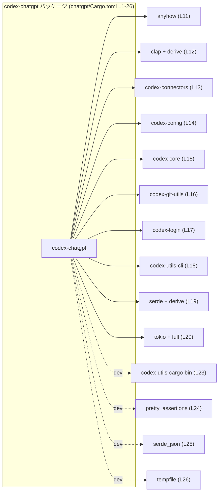
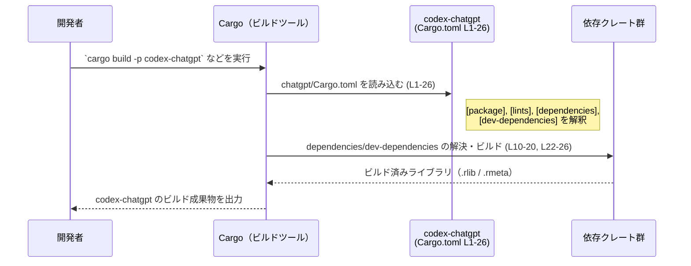

# chatgpt/Cargo.toml コード解説

## 0. ざっくり一言

`chatgpt/Cargo.toml` は、Rust パッケージ `codex-chatgpt` の Cargo マニフェストであり、パッケージのメタデータ、lints 設定、および実行時・開発時の依存クレートを宣言するファイルです（chatgpt/Cargo.toml:L1-5, L7-8, L10-20, L22-26）。

---

## 1. このモジュールの役割

### 1.1 概要

- このファイルは、Rust パッケージ `codex-chatgpt` のビルドに必要な情報を Cargo に提供するために存在します（L1-5）。
- バージョン・エディション・ライセンス・lints といった共通設定をワークスペースから継承します（L3-5, L7-8）。
- 実行時依存クレート（`anyhow`, `clap`, `tokio` など）と開発時依存クレート（`pretty_assertions`, `serde_json` など）を宣言し、コード側からそれらを利用可能にします（L10-20, L22-26）。

### 1.2 アーキテクチャ内での位置づけ

`codex-chatgpt` パッケージを中心とし、周囲の依存クレートとの関係は次のようになります。



- `version.workspace = true` などから、このパッケージはワークスペースの一員であり、ルートの `Cargo.toml` によってバージョンや依存バージョンが集中管理されていることが分かります（L3-5, L11-20, L23-26）。
- Rust の関数や型定義（`fn`, `struct`, `enum` など）はこのファイルには一切現れず、このチャンクだけから具体的なモジュール構造や公開 API は分かりません。

### 1.3 設計上のポイント

コードから読み取れる設計上の特徴は次のとおりです。

- **ワークスペース集中管理**
  - パッケージの `version`・`edition`・`license` はすべて `*.workspace = true` で指定され、ワークスペース共通設定に委譲されています（L3-5）。
  - lints（コンパイラの警告方針）もワークスペース側に一元管理されています（L7-8）。
- **依存バージョンの一元化**
  - 実行時・開発時依存クレートはすべて `{ workspace = true }` として宣言され、各クレートのバージョンや細かな依存設定はワークスペースルート側に集約されます（L11-20, L23-26）。
- **非同期・エラー処理向けの基盤**
  - `anyhow`（汎用エラー型・L11）、`tokio`（非同期ランタイム・L20）といったクレートが依存に含まれており、このパッケージ内でそれらを利用したエラー処理や並行処理を書くことが可能な構成になっています。
  - ただし、このチャンクにはそれらを実際に使用しているコードは現れません。
- **CLI / シリアライズ向けの基盤**
  - `clap`（コマンドライン引数パーサ・L12）、`serde`（シリアライズ/デシリアライズ・L19）が derive 機能付きで指定されており、コード側でマクロベースの定義が可能になっています。

---

## 2. 主要な機能一覧（コンポーネントインベントリー）

このファイルそのものは関数やロジックを持たない設定ファイルですが、「どのコンポーネントを使えるようにしているか」という観点で主要な要素を整理します。

### 2.1 マニフェストレベルの機能

- パッケージメタデータの宣言  
  - `name = "codex-chatgpt"` によりパッケージ名を定義し（L2）、バージョン・エディション・ライセンスはワークスペースから継承します（L3-5）。
- lints 設定のワークスペース継承  
  - `[lints]` セクションで `workspace = true` を指定し、警告レベルや Clippy 設定などをワークスペース共通設定に委ねます（L7-8）。
- 実行時依存クレートの宣言  
  - `[dependencies]` セクションで `anyhow`, `clap`, `codex-*` 系クレート, `serde`, `tokio` などを依存として宣言します（L10-20）。
- 開発時依存クレートの宣言  
  - `[dev-dependencies]` セクションで `codex-utils-cargo-bin`, `pretty_assertions`, `serde_json`, `tempfile` を宣言し、テストや開発ツールから利用可能にします（L22-26）。

### 2.2 依存コンポーネント一覧（根拠付き）

このファイルに直接現れるコンポーネント（クレート）を一覧します。  
「用途の概要」は各クレートの一般的な役割であり、このパッケージ内で実際にどう使われているかは、このチャンクからは分かりません。

| 名前 | 種別 | 用途の概要（一般的な役割） | 根拠 |
|------|------|-----------------------------|------|
| `codex-chatgpt` | パッケージ | ワークスペース内の 1 パッケージ。具体的な役割はこのチャンクには現れません。 | chatgpt/Cargo.toml:L1-5 |
| `anyhow` | 実行時依存 | 汎用エラー型 `anyhow::Error` を提供するエラー処理用クレート。 | chatgpt/Cargo.toml:L11-11 |
| `clap`（features=`["derive"]`） | 実行時依存 | コマンドライン引数パーサ。`derive` 機能で構造体に属性を付けて CLI 定義が可能。 | chatgpt/Cargo.toml:L12-12 |
| `codex-connectors` | 実行時依存 | `codex-*` ワークスペース内の一部。用途はこのチャンクには現れません。 | chatgpt/Cargo.toml:L13-13 |
| `codex-config` | 実行時依存 | 設定管理関連と思われますが、用途はこのチャンクには現れません。 | chatgpt/Cargo.toml:L14-14 |
| `codex-core` | 実行時依存 | コアロジックを含むクレート名ですが、詳細はこのチャンクには現れません。 | chatgpt/Cargo.toml:L15-15 |
| `codex-git-utils` | 実行時依存 | Git 関連ユーティリティと思われますが、詳細はこのチャンクには現れません。 | chatgpt/Cargo.toml:L16-16 |
| `codex-login` | 実行時依存 | 認証・ログイン関連と思われますが、詳細はこのチャンクには現れません。 | chatgpt/Cargo.toml:L17-17 |
| `codex-utils-cli` | 実行時依存 | CLI 向けユーティリティと思われますが、詳細はこのチャンクには現れません。 | chatgpt/Cargo.toml:L18-18 |
| `serde`（features=`["derive"]`） | 実行時依存 | シリアライズ/デシリアライズライブラリ。`derive` 機能で構造体へ自動実装付与。 | chatgpt/Cargo.toml:L19-19 |
| `tokio`（features=`["full"]`） | 実行時依存 | 非同期ランタイム。`full` でほぼ全コンポーネント（I/O, timer, sync など）を有効化。 | chatgpt/Cargo.toml:L20-20 |
| `codex-utils-cargo-bin` | 開発時依存 | Cargo バイナリ関連ユーティリティと思われますが、詳細はこのチャンクには現れません。 | chatgpt/Cargo.toml:L23-23 |
| `pretty_assertions` | 開発時依存 | テスト失敗時の diff を見やすく表示するアサーション拡張クレート。 | chatgpt/Cargo.toml:L24-24 |
| `serde_json` | 開発時依存 | JSON 用の `serde` 対応クレート。テストやツールでの JSON 取扱いに使用可能。 | chatgpt/Cargo.toml:L25-25 |
| `tempfile` | 開発時依存 | 一時ファイル/ディレクトリを安全に扱うユーティリティ。主にテストで利用されることが多い。 | chatgpt/Cargo.toml:L26-26 |

---

## 3. 公開 API と詳細解説

このファイルは Rust コードではなく、設定ファイル（TOML）です。そのため、Rust の意味での「公開 API（関数・型・メソッド）」は定義されていません。

### 3.1 型一覧（構造体・列挙体など）

- このファイルには `struct` や `enum` などの Rust の型定義は存在しません。  
  → 「型一覧」として挙げるべき項目は **ありません**（このチャンクには現れません）。

### 3.2 関数詳細（最大 7 件）

- Cargo.toml は宣言的な設定ファイルであり、Rust の `fn` 定義を含みません。  
  → このセクションに詳細解説すべき関数は **ありません**（このチャンクには現れません）。

### 3.3 その他の関数

- 補助的な関数やラッパー関数も Cargo.toml には存在しません。

---

## 4. データフロー

### 4.1 ビルド時のデータフロー（Cargo 観点）

このファイルを使って Cargo がどのようにビルドを行うか、コンパイル時のフローを示します。



- この図は **ビルドツール側の振る舞い** を表しており、`codex-chatgpt` パッケージ内部の関数呼び出しや runtime のデータフローは、このチャンクからは分かりません。
- 並行性・エラー処理は、このファイルで宣言されたクレート（`tokio`, `anyhow` など）をコード側がどのように利用するかに依存しますが、その実装はこのチャンクには現れません。

---

## 5. 使い方（How to Use）

ここでは **Cargo.toml としての使い方**、およびこの設定を前提にした開発上の注意点を説明します。

### 5.1 基本的な使用方法

`codex-chatgpt` パッケージをビルド・テストするための基本的なコマンド例です。

```bash
# ワークスペース全体をビルド
cargo build

# codex-chatgpt パッケージだけをビルド
cargo build -p codex-chatgpt    # パッケージ名は L2 で定義

# テスト（単体テスト・統合テスト）を実行
cargo test -p codex-chatgpt
```

- これらのコマンド実行時に、Cargo は `chatgpt/Cargo.toml`（L1-26）を読み取り、依存クレート群（L11-20, L23-26）を解決します。
- テスト時には `[dev-dependencies]` に挙げられたクレートもビルドされ、テストコードから利用可能になります。

### 5.2 よくある使用パターン

このマニフェスト設定を前提として、パッケージ内のコードを書くときに一般的に想定されるパターンを列挙します。  
（以下は「このパッケージがそうなっている」と断定するものではなく、「この依存構成で書ける代表的なパターン」です）

1. **`anyhow` によるエラー集約**

   - エラー型に迷う処理では `anyhow::Result<T>` を使ってエラーを一元化することができます（L11）。
   - 非同期処理でも同期処理でも同様のパターンで扱えるため、エラー設計を簡略化しやすい構成です。

2. **`tokio` による非同期処理**

   - `features = ["full"]` により、TCP/HTTP・タイマー・同期プリミティブなど tokio の大部分を利用可能です（L20）。
   - `#[tokio::main]` マクロなどを利用した非同期エントリポイントの作成が可能です（実際にそうなっているかはこのチャンクには現れません）。

3. **`clap` + `serde` の組み合わせ**

   - `clap` の `derive` 機能（L12）と `serde` の `derive` 機能（L19）を併用することで、設定ファイルの読み込みや CLI 引数とのマージなどを型安全に実装できます。
   - このチャンクからは具体的な構造体やオプション名は分かりませんが、そうした設計が可能な依存構成です。

### 5.3 よくある間違い（Cargo.toml 編集時）

Cargo.toml を編集する際に起こりやすい誤りと、このファイルの方針に沿った正しい例を示します。

```toml
# 間違い例: ワークスペース方針と異なる依存の追加
[dependencies]
serde_yaml = "0.9"  # バージョンをローカルに直接書いてしまう

# 正しい例: 既存の方針に合わせて workspace 管理にする
[dependencies]
serde_yaml = { workspace = true }
```

- このファイルでは既存の依存クレートがすべて `{ workspace = true }` で宣言されています（L11-20, L23-26）。
- そのため、新しい依存を追加する場合も同様に `workspace = true` を使うのが前提と考えられます。  
  ただし、ワークスペースルート側で `serde_yaml` を登録する必要があるかどうか、このチャンクからは分かりません。

### 5.4 使用上の注意点（まとめ）

- **ワークスペース整合性**
  - `version.workspace = true` などを使っているため、このファイル単体を別のプロジェクトにコピーしてもそのままでは動きません。対応するワークスペース設定が必要です（L3-5, L11-20, L23-26）。
- **依存バージョンの把握**
  - 具体的なバージョン番号はワークスペース側に隠蔽されており、このファイル単体からはどのバージョンの `tokio` や `serde` が使われるか分かりません。  
    セキュリティやバグ対応のためには、ワークスペースルートの `Cargo.toml` を確認する必要があります（このチャンクには現れません）。
- **並行性に関する前提**
  - `tokio` をフル機能で利用できる構成になっているため（L20）、このパッケージのコードでは非同期タスクやマルチスレッド環境を前提にした実装が書かれている可能性があります。  
    実際のコードを見る際には、`Send` / `Sync` 境界やランタイムの二重起動など、Tokio 特有の並行性上の注意が必要です。
- **テスト用依存の範囲**
  - `pretty_assertions`, `serde_json`, `tempfile` は `[dev-dependencies]` にあり（L24-26）、本番コードから直接使うべきではなく、テスト・ベンチマーク・開発ツールでの使用を想定した構成です。

---

## 6. 変更の仕方（How to Modify）

### 6.1 新しい機能を追加する場合（依存追加の観点）

このファイルには Rust コードは含まれないため、「新しい機能の追加」は主に **新しい依存クレートの追加** または **既存依存の feature 変更** に相当します。

1. **新しい実行時依存クレートを追加する場合**
   - 既存の方針に合わせ、まずワークスペースルートの `Cargo.toml` へ依存クレートを登録する必要がある可能性が高いです（このチャンクにはルート定義は現れません）。
   - その上で、本ファイルの `[dependencies]` セクションに同名クレートを `{ workspace = true }` で追加します。

   ```toml
   [dependencies]
   # 既存の依存...
   new-crate = { workspace = true }  # 追加
   ```

2. **テスト専用の依存を追加する場合**
   - `pretty_assertions` や `tempfile` と同じく `[dev-dependencies]` に追加します（L24-26）。

   ```toml
   [dev-dependencies]
   # 既存の dev 依存...
   new-test-util = { workspace = true }
   ```

3. **Tokio や Clap の機能を絞りたい／広げたい場合**
   - 現在は `tokio = { workspace = true, features = ["full"] }` となっており、Tokio の多くの機能が有効化されています（L20）。  
     機能を絞る場合は `["full"]` を細かい feature のリストに置き換えます。
   - 同様に `clap` と `serde` では `derive` 機能が有効化されています（L12, L19）。derive を使わない設計に変更する場合は、この feature を外す必要があります。

### 6.2 既存の機能を変更する場合（契約・影響範囲）

- **ワークスペースとの契約**
  - `*.workspace = true` を `= "x.y.z"` のような固定バージョン指定に変更すると、ワークスペース全体でのバージョン統一が崩れる可能性があります。  
    その場合、他パッケージとの依存衝突やビルド時間増大（複数バージョンの同時コンパイル）のリスクがあります。
- **依存削除の影響範囲**
  - 依存クレートを削除する場合、`src/` 以下のコードやテストコードからそのクレートを参照していないかを確認する必要がありますが、そのコードはこのチャンクには現れません。
- **開発時依存の整理**
  - `[dev-dependencies]` のクレートは、テストや開発ツールのコードからのみ参照されるべきです。  
    本番コードで誤って dev 依存を前提にしていないかどうかの確認が必要ですが、具体的な使用箇所はこのチャンクには現れません。

---

## 7. 関連ファイル

このファイルから読み取れる範囲で、関連が強いと考えられるファイル・ディレクトリを整理します。

| パス | 役割 / 関係 |
|------|------------|
| （ワークスペースルートの）`Cargo.toml` | `version.workspace = true` や `dependencies = { workspace = true }` の設定先となるワークスペース共通設定ファイルであると考えられます（chatgpt/Cargo.toml:L3-5, L11-20, L23-26）。具体的なパスや内容はこのチャンクには現れません。 |
| `chatgpt/src/lib.rs` または `chatgpt/src/main.rs` | `codex-chatgpt` パッケージの実コードが置かれる場所として一般的ですが、このチャンクにはこれらのファイルの存在や構造は現れません。 |
| `chatgpt/tests/` ディレクトリ | `[dev-dependencies]` のクレートを利用する統合テストが存在する場合の配置先として一般的ですが、このチャンクには具体的なテストファイルは現れません。 |

---

### このチャンクで分かること・分からないことの整理

- 分かること
  - `codex-chatgpt` はワークスペース所属のパッケージであり、エラー処理 (`anyhow`)、CLI (`clap`)、非同期処理 (`tokio`) などの基盤を依存として宣言している（L2-5, L11-20）。
  - テスト・開発用に `pretty_assertions`, `serde_json`, `tempfile` などが利用可能である（L22-26）。

- 分からないこと（このチャンクには現れない）
  - このパッケージが提供する具体的な関数・型・公開 API。
  - `tokio` や `anyhow` などを用いた並行処理・エラー処理の実際の実装。
  - `codex-*` 系クレート（`codex-core` など）の内部構造や、このパッケージからの具体的な呼び出し関係。

このため、公開 API やコアロジックそのものを理解するには、`src/` 以下の Rust コード（別チャンク）を併せて確認する必要があります。
