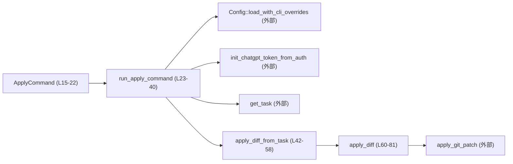
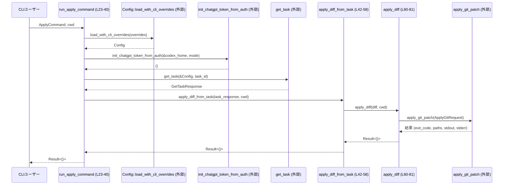

# chatgpt/src/apply_command.rs コード解説

---

## 0. ざっくり一言

Codex エージェントタスクから取得した最新の diff（git パッチ）を、ローカル環境に適用するための CLI コマンドと、その中核ロジックを定義するモジュールです（`ApplyCommand`, `run_apply_command`, `apply_diff_from_task`, `apply_diff`。根拠: `chatgpt/src/apply_command.rs:L15-22,L23-40,L42-58,L60-81`）。

---

## 1. このモジュールの役割

### 1.1 概要

- Codex の設定ファイルと CLI 上書き設定を読み込み、認証情報から ChatGPT トークンを初期化します（根拠: `Config::load_with_cli_overrides` 呼び出しと `init_chatgpt_token_from_auth` 呼び出し `chatgpt/src/apply_command.rs:L27-33,L35-36`）。
- 指定されたタスク ID からタスク情報を取得し、その中から PR 形式の diff を取り出します（根拠: `get_task` と `apply_diff_from_task` 呼び出し `chatgpt/src/apply_command.rs:L38-39,L42-55`）。
- 取り出した diff を git パッチとしてローカルディレクトリに適用し、結果を検査します（根拠: `apply_diff` の実装 `chatgpt/src/apply_command.rs:L60-81`）。

### 1.2 アーキテクチャ内での位置づけ

このモジュールは「CLI → 設定・認証 → タスク取得 → diff 抽出 → git パッチ適用」という一連の処理のうち、**CLI エントリポイントと diff 適用のオーケストレーション**を担当します。

- 設定読み込み: `codex_core::config::Config` に委譲（根拠: `chatgpt/src/apply_command.rs:L4,L27-33`）。
- 認証 / ChatGPT トークン初期化: `crate::chatgpt_token::init_chatgpt_token_from_auth` に委譲（根拠: `chatgpt/src/apply_command.rs:L9,L35-36`）。
- タスク取得と diff 抽出: `crate::get_task` 関連型と関数（`GetTaskResponse`, `OutputItem`, `PrOutputItem`, `get_task`）に依存（根拠: `chatgpt/src/apply_command.rs:L10-13,L38,L42-55`）。
- git パッチ適用: `codex_git_utils::apply_git_patch` に委譲（根拠: `chatgpt/src/apply_command.rs:L5-6,L62-68`）。

主要なコンポーネント関係を Mermaid で示します（本ファイルのみ、行番号付き）:



### 1.3 設計上のポイント

- **責務分割**
  - `run_apply_command`: CLI 全体のフロー制御（設定読み込み、トークン初期化、タスク取得、diff 適用）を担当します（根拠: `chatgpt/src/apply_command.rs:L23-40`）。
  - `apply_diff_from_task`: タスクレスポンスから「どの diff を適用するか」を決めるロジックを担当します（根拠: `chatgpt/src/apply_command.rs:L42-58`）。
  - `apply_diff`: 実際に git パッチを適用し、結果を検査する I/O 近接部分を担当します（根拠: `chatgpt/src/apply_command.rs:L60-81`）。
- **状態管理**
  - 構造体 `ApplyCommand` は CLI からの入力値（task_id と設定上書き）を保持しますが、それ以外に長期的な状態は保持しません（根拠: `chatgpt/src/apply_command.rs:L17-21`）。
  - すべてのデータは関数間で引数として受け渡される構造になっており、グローバルな可変状態は使用していません（関数シグネチャと本体に `static` / `lazy` などが登場しないことから。根拠: `chatgpt/src/apply_command.rs:L23-40,L42-58,L60-81`）。
- **エラーハンドリング方針**
  - 外部呼び出し（設定読み込み、トークン初期化、タスク取得、git パッチ適用）のエラーは `?` 演算子で `anyhow::Result<()>` として上位に伝播します（根拠: `chatgpt/src/apply_command.rs:L27-33,L35-36,L38,L68`）。
  - 期待した情報がタスクレスポンス内に存在しない場合（diff ターンや PR 出力がない場合）は `anyhow::bail!` で明示的に失敗させます（根拠: `chatgpt/src/apply_command.rs:L46-49,L54-57`）。
  - git パッチ自体は実行できたが exit code が 0 でない場合も `anyhow::bail!` でエラーとしています（根拠: `chatgpt/src/apply_command.rs:L69-77`）。
- **非同期処理・並行性**
  - 外部 I/O（設定読み込み、トークン初期化、タスク取得）はすべて `async fn` 経由で呼び出され、呼び出し側の `run_apply_command` / `apply_diff_from_task` も `async` となっています（根拠: `chatgpt/src/apply_command.rs:L23,L42`）。
  - このモジュール自身では `tokio::spawn` などの並列タスク生成は行わず、処理は基本的に直列に進みます（本ファイル内に `spawn` などが存在しないことから。根拠: `chatgpt/src/apply_command.rs:L23-81`）。
- **フォールバック戦略**
  - diff 適用ディレクトリ (`cwd`) が指定されない場合、カレントディレクトリを使い、それが取得できないときは OS のテンポラリディレクトリにフォールバックします（根拠: `chatgpt/src/apply_command.rs:L60-61`）。

---

## 2. 主要な機能一覧

- CLI コマンド定義: `ApplyCommand` でタスク ID と設定上書き用オプションを受け取ります（根拠: `chatgpt/src/apply_command.rs:L15-21`）。
- 設定の読み込みと CLI 上書き適用: `Config::load_with_cli_overrides` を通じて実行します（根拠: `chatgpt/src/apply_command.rs:L27-33`）。
- ChatGPT トークン初期化: `init_chatgpt_token_from_auth` で認証情報からトークンをセットアップします（根拠: `chatgpt/src/apply_command.rs:L35-36`）。
- タスク取得: `get_task` を用いて Codex エージェントのタスク詳細を取得します（根拠: `chatgpt/src/apply_command.rs:L38`）。
- タスクから diff を抽出: `apply_diff_from_task` 内で `GetTaskResponse` から PR の diff を探します（根拠: `chatgpt/src/apply_command.rs:L42-55`）。
- git パッチ適用: `apply_diff` と `apply_git_patch` でローカルディレクトリに diff を適用します（根拠: `chatgpt/src/apply_command.rs:L60-81`）。

---

## 3. 公開 API と詳細解説

### 3.1 型一覧（構造体など）

#### ローカル定義型

| 名前 | 種別 | 公開性 | 役割 / 用途 | 定義位置 |
|------|------|--------|-------------|----------|
| `ApplyCommand` | 構造体（`#[derive(Debug, Parser)]`） | `pub` | Codex diff 適用コマンドの CLI 引数セット。タスク ID と設定上書きオプションを保持します。 | `chatgpt/src/apply_command.rs:L15-22` |

`ApplyCommand` のフィールド:

- `task_id: String` — 適用対象とする Codex タスクの識別子（根拠: `chatgpt/src/apply_command.rs:L18`）。
- `config_overrides: CliConfigOverrides` — CLI から指定された設定上書き。`#[clap(flatten)]` により、上位コマンドのオプションにフラットに展開されます（根拠: `chatgpt/src/apply_command.rs:L20-21`）。

#### ローカル関数コンポーネント一覧

| 名前 | 種別 | 公開性 | 役割 / 用途 | 定義位置 |
|------|------|--------|-------------|----------|
| `run_apply_command` | 非同期関数 | `pub` | CLI から呼ばれ、設定読み込み・トークン初期化・タスク取得・diff 適用を順に行うエントリポイントです。 | `chatgpt/src/apply_command.rs:L23-40` |
| `apply_diff_from_task` | 非同期関数 | `pub` | `GetTaskResponse` から diff を抽出し、`apply_diff` に渡します。タスク側に diff がない場合はエラーにします。 | `chatgpt/src/apply_command.rs:L42-58` |
| `apply_diff` | 非同期関数 | 非公開 | 実際に git パッチ適用を行い、exit code をチェックします。成功時にメッセージを出力します。 | `chatgpt/src/apply_command.rs:L60-81` |

### 3.2 関数詳細

#### `run_apply_command(apply_cli: ApplyCommand, cwd: Option<PathBuf>) -> anyhow::Result<()>`

**概要**

CLI から受け取った `ApplyCommand` を元に:

1. 設定を読み込み（CLI 上書き含む）  
2. ChatGPT トークンを初期化し  
3. 指定タスク ID のタスク詳細を取得し  
4. そのタスクから diff を取り出してローカルに適用する  

という一連の処理をまとめて行う非同期エントリポイントです（根拠: `chatgpt/src/apply_command.rs:L23-40`）。

**引数**

| 引数名 | 型 | 説明 |
|--------|----|------|
| `apply_cli` | `ApplyCommand` | `clap` によりパースされた CLI 引数。タスク ID と設定上書きを含みます（根拠: `chatgpt/src/apply_command.rs:L17-21,L24`）。 |
| `cwd` | `Option<PathBuf>` | diff を適用する作業ディレクトリ。`None` の場合は後続の `apply_diff` 側でカレントディレクトリ → テンポラリディレクトリの順にフォールバックします（根拠: `chatgpt/src/apply_command.rs:L24-25,L60-61`）。 |

**戻り値**

- `anyhow::Result<()>`  
  - 正常終了時は `Ok(())`。  
  - 外部 I/O やタスク内容の不足などでエラーが発生した場合は `Err(anyhow::Error)` が返されます（`?` と `anyhow::bail!` の使用から。根拠: `chatgpt/src/apply_command.rs:L27-33,L35-36,L38,L39`）。

**内部処理の流れ**

1. `CliConfigOverrides::parse_overrides` を呼び、CLI 上書きをパース  
   - エラーは `map_err(anyhow::Error::msg)?` で `anyhow::Error` に変換され、即座に上位に返されます（根拠: `chatgpt/src/apply_command.rs:L28-31`）。
2. 上記の上書き設定を引数に `Config::load_with_cli_overrides(...).await?` を呼び、設定を非同期に読み込みます（根拠: `chatgpt/src/apply_command.rs:L27-33`）。
3. 読み込んだ `config` の `codex_home` と `cli_auth_credentials_store_mode` を渡して、ChatGPT トークンを初期化します（根拠: `chatgpt/src/apply_command.rs:L35-36`）。
4. `get_task(&config, apply_cli.task_id).await?` により、指定タスク ID の `GetTaskResponse` を取得します（根拠: `chatgpt/src/apply_command.rs:L38`）。
5. 取得した `task_response` と `cwd` を `apply_diff_from_task` に渡し、その結果をそのまま呼び出し元に返します（根拠: `chatgpt/src/apply_command.rs:L39`）。

**Examples（使用例）**

> モジュールパスはこのチャンクからは分からないため、`ApplyCommand` / `run_apply_command` がスコープにあることを仮定した例です。

```rust
use clap::Parser;                      // ApplyCommand で #[derive(Parser)] を利用するため
// use crate::apply_command::{ApplyCommand, run_apply_command}; // 実際のパスはプロジェクト構成に依存

#[tokio::main]                         // 非同期ランタイム（例として tokio）上で実行
async fn main() -> anyhow::Result<()> {
    // CLI 引数をパースして ApplyCommand を生成する
    let cmd = ApplyCommand::parse();   // 根拠: ApplyCommand が Parser を derive している (L15-17)

    // カレントディレクトリに対して diff を適用する
    run_apply_command(cmd, None).await
}
```

このコードは、`chatgpt` CLI バイナリの `main` 関数から `run_apply_command` を呼び出す代表的な形を示しています。

**Errors / Panics**

- `Config::load_with_cli_overrides` が失敗した場合  
  → `?` により `Err` が上位に返ります（根拠: `chatgpt/src/apply_command.rs:L27-33`）。
- `CliConfigOverrides::parse_overrides` がエラー文字列などを返した場合  
  → `map_err(anyhow::Error::msg)?` により `anyhow::Error` として失敗します（根拠: `chatgpt/src/apply_command.rs:L28-31`）。
- `init_chatgpt_token_from_auth` が失敗した場合  
  → `?` により `Err` が返ります（根拠: `chatgpt/src/apply_command.rs:L35-36`）。
- `get_task` が指定タスク ID の取得に失敗した場合  
  → `?` により `Err` が返ります（根拠: `chatgpt/src/apply_command.rs:L38`）。
- `apply_diff_from_task` 内で diff が見つからない / git apply が失敗した場合  
  → その `Err` がそのまま返ります（根拠: `chatgpt/src/apply_command.rs:L39`）。

この関数自身は `panic!` を直接呼び出しておらず、`unwrap` も使用していないため、`panic` は外部関数やランタイムが発生させない限り想定されません（根拠: `chatgpt/src/apply_command.rs:L23-40`）。

**Edge cases（エッジケース）**

- `apply_cli.task_id` が空文字列である場合  
  → `get_task` の挙動に依存します。このチャンクには `get_task` の実装がないため、結果は不明です（根拠: `chatgpt/src/apply_command.rs:L38`）。
- `cwd` に存在しないディレクトリを渡した場合  
  → 実際のディレクトリ存在チェックは `apply_diff` / `apply_git_patch` 側で行われると考えられますが、このチャンクからは確定できません。`apply_diff` では単に `PathBuf` を `ApplyGitRequest.cwd` に格納するだけです（根拠: `chatgpt/src/apply_command.rs:L60-67`）。

**使用上の注意点**

- 非同期関数であるため、`tokio` や `async-std` などの非同期ランタイム上から `await` する必要があります（`async fn` 定義から。根拠: `chatgpt/src/apply_command.rs:L23`）。
- 失敗時は `anyhow::Error` が返るため、呼び出し元では `?` で伝播させるか、`match` でエラー内容をログに出力するなどの処理が必要です。
- diff 適用対象のリポジトリのカレントディレクトリを正しく設定しておかないと、意図しないディレクトリにパッチが適用される可能性があります（`apply_diff` の `cwd` フォールバック仕様に基づく。根拠: `chatgpt/src/apply_command.rs:L60-61`）。

---

#### `apply_diff_from_task(task_response: GetTaskResponse, cwd: Option<PathBuf>) -> anyhow::Result<()>`

**概要**

`GetTaskResponse` の中から「diff ターン」に対応する出力を探し、その出力の中から PR 形式の diff を抽出して `apply_diff` に委譲する関数です。必要な diff 情報が見つからない場合はエラーになります（根拠: `chatgpt/src/apply_command.rs:L42-58`）。

**引数**

| 引数名 | 型 | 説明 |
|--------|----|------|
| `task_response` | `GetTaskResponse` | `get_task` によって取得されたタスクレスポンス。内部に `current_diff_task_turn` や `output_items` を含みます（根拠: `chatgpt/src/apply_command.rs:L43,L46-50`）。 |
| `cwd` | `Option<PathBuf>` | diff 適用ディレクトリ。`run_apply_command` からそのまま渡され、`apply_diff` へ再度渡されます（根拠: `chatgpt/src/apply_command.rs:L44,L55`）。 |

**戻り値**

- `anyhow::Result<()>`  
  - diff の抽出と git パッチ適用が成功した場合は `Ok(())`。  
  - diff または PR 出力が見つからない場合、あるいは `apply_diff` が失敗した場合は `Err(anyhow::Error)`。

**内部処理の流れ**

1. `task_response.current_diff_task_turn` を取り出し、`Some(turn)` / `None` を判定します（根拠: `chatgpt/src/apply_command.rs:L46-48`）。
   - `None` の場合は `anyhow::bail!("No diff turn found")` で即座にエラーとします（根拠: `chatgpt/src/apply_command.rs:L48-49`）。
2. `turn.output_items.iter().find_map(...)` で、`OutputItem::Pr(PrOutputItem { output_diff })` にマッチする最初の要素を探します（根拠: `chatgpt/src/apply_command.rs:L50-52`）。
   - 他の種類の `OutputItem` は `_ => None` としてスキップされます（根拠: `chatgpt/src/apply_command.rs:L52-53`）。
3. `match output_diff` で、PR diff が見つかったかどうかを判定します（根拠: `chatgpt/src/apply_command.rs:L54`）。
   - `Some(output_diff)` の場合  
     → `apply_diff(&output_diff.diff, cwd).await` を実行します（根拠: `chatgpt/src/apply_command.rs:L55`）。`diff` フィールドが git パッチ文字列と想定されますが、構造の詳細はこのチャンクからは不明です（根拠: `chatgpt/src/apply_command.rs:L55`）。
   - `None` の場合  
     → `anyhow::bail!("No PR output item found")` でエラーにします（根拠: `chatgpt/src/apply_command.rs:L56-57`）。

**Examples（使用例）**

> ここでは、すでにどこかで `GetTaskResponse` が取得済みであると仮定します。`get_task` の実装はこのチャンクにはありません。

```rust
use std::path::PathBuf;
// use crate::apply_command::apply_diff_from_task;   // 実際のパスはプロジェクト構成による
// use crate::get_task::{get_task, GetTaskResponse}; // 型と関数は別モジュール

async fn apply_from_existing_task(task_response: GetTaskResponse) -> anyhow::Result<()> {
    // 指定リポジトリディレクトリに diff を適用する
    let repo_dir = PathBuf::from("/path/to/repo");
    apply_diff_from_task(task_response, Some(repo_dir)).await
}
```

**Errors / Panics**

- `task_response.current_diff_task_turn` が `None` の場合  
  → `"No diff turn found"` というメッセージで `Err` を返します（根拠: `chatgpt/src/apply_command.rs:L46-49`）。
- `diff_turn.output_items` 内に `OutputItem::Pr` が一つも存在しない場合  
  → `"No PR output item found"` というメッセージで `Err` を返します（根拠: `chatgpt/src/apply_command.rs:L50-57`）。
- `apply_diff` が git パッチ適用時に失敗した場合  
  → その `anyhow::Error` が呼び出し元に伝播します（根拠: `chatgpt/src/apply_command.rs:L55`）。

`apply_diff_from_task` 自体は `unwrap` や `panic!` を使っていないため、panic 条件は外部関数由来のみと考えられます（根拠: `chatgpt/src/apply_command.rs:L42-58`）。

**Edge cases（エッジケース）**

- `current_diff_task_turn` が複数存在するケース  
  → `GetTaskResponse` の構造はこのチャンクには一部しか現れず、`current_diff_task_turn` がどのように選ばれているかは不明です。ここでは単に既に選ばれた 1 つのターンだけを扱っています（根拠: `chatgpt/src/apply_command.rs:L46`）。
- `output_items` に複数の `OutputItem::Pr` がある場合  
  → `find_map` により最初の一つだけが選ばれます（根拠: `chatgpt/src/apply_command.rs:L50-52`）。この選択方針を変えたい場合は、この行を変更することになります。
- `cwd` が `None` の場合  
  → `apply_diff` 内でフォールバック処理が行われます（根拠: `chatgpt/src/apply_command.rs:L60-61`）。

**使用上の注意点**

- この関数は **「すでにタスクが正しく取得されている」** ことを前提としており、タスク取得時のエラー処理は行いません（`run_apply_command` 側で実施。根拠: `chatgpt/src/apply_command.rs:L38-39`）。
- diff 対象が PR 出力 (`OutputItem::Pr`) に格納されていることが前提です。他の形式の出力しかないタスクではエラーになります（根拠: `chatgpt/src/apply_command.rs:L50-57`）。

---

#### `apply_diff(diff: &str, cwd: Option<PathBuf>) -> anyhow::Result<()>`（非公開）

**概要**

文字列として与えられた git diff を、指定またはフォールバックされた作業ディレクトリに適用する関数です。内部で `ApplyGitRequest` を組み立てて `apply_git_patch` を呼び、exit code をチェックして失敗時には詳細なメッセージとともにエラーを返します（根拠: `chatgpt/src/apply_command.rs:L60-81`）。

**引数**

| 引数名 | 型 | 説明 |
|--------|----|------|
| `diff` | `&str` | 適用する git パッチの内容を表すテキスト。PR 出力から渡されます（根拠: `chatgpt/src/apply_command.rs:L55,L60,62-65`）。 |
| `cwd` | `Option<PathBuf>` | パッチ適用先ディレクトリ。`None` の場合はカレントディレクトリ、取得不可の場合はテンポラリディレクトリが使われます（根拠: `chatgpt/src/apply_command.rs:L60-61`）。 |

**戻り値**

- `anyhow::Result<()>`  
  - パッチ適用が成功し、`res.exit_code == 0` なら `Ok(())`。  
  - `apply_git_patch` 自体が失敗、または `exit_code != 0` の場合は `Err(anyhow::Error)`。

**内部処理の流れ**

1. `cwd` の決定（根拠: `chatgpt/src/apply_command.rs:L60-61`）
   - `cwd` が `Some(path)` の場合は、そのまま使用します。
   - `None` の場合は `std::env::current_dir()` を呼び出し、成功すればそれを使用します。
   - `current_dir` がエラーを返した場合は、`std::env::temp_dir()` を代わりに利用します。
2. `ApplyGitRequest` の構築（根拠: `chatgpt/src/apply_command.rs:L62-67`）
   - `cwd`: 上で決定した `PathBuf`。
   - `diff`: `diff.to_string()` により所有権を持つ `String` に変換。
   - `revert`: `false` に固定（差分を適用するモード）。
   - `preflight`: `false` に固定（ドライランでなく実際に適用するモードと推測されますが、意味はこのチャンクからは断定できません）。
3. `apply_git_patch(&req)?` の実行（根拠: `chatgpt/src/apply_command.rs:L68`）
   - 成功時には `res`（適用結果）を受け取ります。
   - I/O や内部エラーがあれば `?` により即座に `Err` が返ります。
4. `res.exit_code` のチェック（根拠: `chatgpt/src/apply_command.rs:L69-77`）
   - `exit_code != 0` の場合  
     → `anyhow::bail!` で `"Git apply failed (applied={}, skipped={}, conflicts={})\nstdout:\n{}\nstderr:\n{}"` という詳細なメッセージを含むエラーを返します。ここで `applied_paths.len()`, `skipped_paths.len()`, `conflicted_paths.len()`, `stdout`, `stderr` をメッセージに埋め込みます。
   - `exit_code == 0` の場合  
     → `"Successfully applied diff"` と標準出力に表示し、`Ok(())` を返します（根拠: `chatgpt/src/apply_command.rs:L79-80`）。

**Examples（使用例）**

この関数は非公開ですが、テストや将来の拡張を想定した直接呼び出しの例です。

```rust
use std::path::PathBuf;

async fn apply_simple_patch() -> anyhow::Result<()> {
    let diff_text = "\
diff --git a/README.md b/README.md
index e69de29..4b825dc 100644
--- a/README.md
+++ b/README.md
@@ -0,0 +1,2 @@
+Hello
+World
";

    let repo_dir = PathBuf::from("/path/to/repo");
    // モジュール内からの呼び出しを想定
    apply_diff(diff_text, Some(repo_dir)).await
}
```

**Errors / Panics**

- `apply_git_patch(&req)?;` がエラー（I/O エラーなど）を返した場合  
  → `?` により `Err(anyhow::Error)` が返ります（根拠: `chatgpt/src/apply_command.rs:L68`）。
- `res.exit_code != 0` の場合  
  → `anyhow::bail!` により、適用結果や stdout/stderr の内容を含むエラーが返されます（根拠: `chatgpt/src/apply_command.rs:L69-77`）。
- `panic` の可能性について  
  - `cwd.unwrap_or(...)` は `Option<PathBuf>` に対する安全な操作であり `unwrap` ではないため、`cwd` に関して panic は発生しません（根拠: `chatgpt/src/apply_command.rs:L60`）。
  - `std::env::current_dir().unwrap_or_else(...)` は `unwrap_or_else` のため、`current_dir()` がエラーでも panic せず、テンポラリディレクトリにフォールバックします（根拠: `chatgpt/src/apply_command.rs:L60-61`）。
  - この関数内には `unwrap()` / `expect()` / `panic!` などは存在しません（根拠: `chatgpt/src/apply_command.rs:L60-81`）。

**Edge cases（エッジケース）**

- `diff` が空文字列の場合  
  → `apply_git_patch` の挙動に依存します。このチャンクには実装がないため、どう扱われるかは不明です（根拠: `chatgpt/src/apply_command.rs:L62-68`）。
- 非 git リポジトリディレクトリでの適用  
  → `apply_git_patch` がどのような exit code やメッセージを返すかによりますが、少なくとも `exit_code != 0` になればこの関数はエラーを返します（根拠: `chatgpt/src/apply_command.rs:L69-77`）。
- 非常に大きな diff  
  → `diff.to_string()` により diff 全体をコピーした `String` を作るため、大きすぎる diff ではメモリ使用量が増加します（根拠: `chatgpt/src/apply_command.rs:L62-65`）。

**使用上の注意点**

- diff は **信頼できるソース** から提供されることが前提と考えられます。外部からの任意入力をそのまま渡した場合、リポジトリ内の任意ファイルを書き換えることになります（git diff の特性に基づく一般論であり、`apply_git_patch` の実装はこのチャンクにはありません）。
- `cwd` を `None` にした場合、どのディレクトリに適用されるかが環境によって変わる（カレントディレクトリ / テンポラリディレクトリ）ため、再現性を重視する場合は明示的に `Some(PathBuf)` を指定する方が安全です（根拠: `chatgpt/src/apply_command.rs:L60-61`）。
- 非同期関数として宣言されていますが、内部は同期 I/O（`std::env::current_dir` など）と外部 crate の非同期/同期関数に委譲しています。`await` ポイントは呼び出し元 (`apply_diff_from_task`) にのみ現れます（根拠: `chatgpt/src/apply_command.rs:L55,L60-81`）。

### 3.3 その他の関数

このファイルには、上記 3 関数以外の補助的な関数やラッパー関数は存在しません（根拠: `chatgpt/src/apply_command.rs:L23-81`）。

---

## 4. データフロー

ここでは `run_apply_command` を起点とした代表的な処理シナリオのデータフローを示します。

1. CLI から `ApplyCommand` が生成され、`run_apply_command` に渡されます（根拠: `chatgpt/src/apply_command.rs:L17-24`）。
2. `run_apply_command` は設定を読み込み、ChatGPT トークンを初期化し、`get_task` でタスクレスポンス (`GetTaskResponse`) を取得します（根拠: `chatgpt/src/apply_command.rs:L27-38`）。
3. `GetTaskResponse` が `apply_diff_from_task` に渡され、そこから diff 情報が抽出され、`apply_diff` に渡されます（根拠: `chatgpt/src/apply_command.rs:L39,L42-55`）。
4. `apply_diff` は `ApplyGitRequest` を構築し、`apply_git_patch` を実行、結果を検査して呼び出し元に `Result` を返します（根拠: `chatgpt/src/apply_command.rs:L60-81`）。

Mermaid のシーケンス図（行番号付き）:



---

## 5. 使い方（How to Use）

### 5.1 基本的な使用方法

典型的には、CLI バイナリの `main` 関数から `ApplyCommand` をパースし、`run_apply_command` を呼び出します。

```rust
use clap::Parser;
use std::env;
// use crate::apply_command::{ApplyCommand, run_apply_command}; // 実際のパスはコードからは不明

#[tokio::main]                               // 任意の async ランタイム
async fn main() -> anyhow::Result<()> {
    // CLI 引数を構造体にパース
    let cmd = ApplyCommand::parse();         // 根拠: #[derive(Parser)] (L15-17)

    // カレントディレクトリ（例: git リポジトリのルート）を取得して cwd に渡す
    let cwd = Some(env::current_dir()?);

    // タスク ID のタスクから diff を取得して適用
    run_apply_command(cmd, cwd).await
}
```

このフローでは:

- 設定ファイルと CLI オプションに基づき `Config` が読み込まれ（L27-33）、
- ChatGPT トークンが初期化され（L35-36）、
- `task_id` のタスクから diff が取得されて適用されます（L38-39,L42-55,L60-81）。

### 5.2 よくある使用パターン

1. **カレントディレクトリを使って適用**

   ```rust
   async fn apply_to_current_dir(cmd: ApplyCommand) -> anyhow::Result<()> {
       // cwd = None として渡し、apply_diff 側で current_dir() を利用してもらう
       run_apply_command(cmd, None).await
   }
   ```

   - `apply_diff` 内で `current_dir()` → `temp_dir()` の順でフォールバックします（根拠: `chatgpt/src/apply_command.rs:L60-61`）。

2. **別ディレクトリに適用**

   ```rust
   use std::path::PathBuf;

   async fn apply_to_specific_repo(cmd: ApplyCommand, repo_root: PathBuf) -> anyhow::Result<()> {
       run_apply_command(cmd, Some(repo_root)).await
   }
   ```

   - `cwd` に明示的なパスを与えることで、カレントディレクトリに依存せずに適用先を制御できます（根拠: `chatgpt/src/apply_command.rs:L24-25,L60`）。

3. **取得済みタスクへの再適用（リトライなど）**

   ```rust
   async fn retry_apply(task_response: GetTaskResponse, repo_root: PathBuf) -> anyhow::Result<()> {
       apply_diff_from_task(task_response, Some(repo_root)).await
   }
   ```

   - 同じ `GetTaskResponse` を使い回して複数回適用したい場合などに有用です（根拠: `chatgpt/src/apply_command.rs:L42-55`）。

### 5.3 よくある間違い

```rust
// 間違い例: git リポジトリ外から cwd = None で呼び出している
async fn bad_example(cmd: ApplyCommand) -> anyhow::Result<()> {
    // 呼び出し側がどのディレクトリかを意識していない
    run_apply_command(cmd, None).await
}

// 正しい例: 適用したい git リポジトリのルートを明示的に渡す
use std::path::PathBuf;

async fn good_example(cmd: ApplyCommand) -> anyhow::Result<()> {
    let repo_root = PathBuf::from("/path/to/repo");
    run_apply_command(cmd, Some(repo_root)).await
}
```

- 間違い例では、`apply_diff` 内で `current_dir()` の結果に依存するため、意図しないディレクトリにパッチが適用される可能性があります（根拠: `chatgpt/src/apply_command.rs:L60-61`）。
- 正しい例では、`cwd` を明示的に指定することで適用先を制御しています。

### 5.4 使用上の注意点（まとめ）

- **非同期ランタイムの必要性**  
  - `run_apply_command` と `apply_diff_from_task` は `async fn` であり、`await` を使って呼び出す必要があります（根拠: `chatgpt/src/apply_command.rs:L23,L42`）。
- **エラー処理**  
  - 設定読み込み・トークン初期化・タスク取得・git apply のいずれかが失敗すると `Err(anyhow::Error)` が返ります。CLI バイナリではこのエラーを適切にログ出力し、終了コードを設定することが望ましいです（`anyhow` の使用から。根拠: `chatgpt/src/apply_command.rs:L26,L45,L60`）。
- **タスク内容の前提**  
  - `current_diff_task_turn` が存在し、`OutputItem::Pr` が少なくとも一つ含まれていないとエラーになります（根拠: `chatgpt/src/apply_command.rs:L46-57`）。
- **パッチ適用の前提**  
  - `ApplyGitRequest` の `revert` と `preflight` はいずれも `false` 固定のため、常に「実際に適用」「差し戻しではない」というモードになります（根拠: `chatgpt/src/apply_command.rs:L62-67`）。

### 5.5 セキュリティと堅牢性の観点

- **リモート生成 diff の適用**
  - Codex エージェントから取得した diff をそのままローカルリポジトリに適用するため、タスクやエージェントの出力を信頼できる前提で利用する必要があります（diff が任意ファイルの編集を行えるため）。
- **情報漏洩リスク**
  - git パッチの適用結果が失敗した場合、stdout / stderr を含むメッセージが `anyhow::Error` として伝播します（根拠: `chatgpt/src/apply_command.rs:L69-77`）。これをユーザーにそのまま表示する場合、パス名や一部の内容が表示される可能性があります。
- **堅牢性**
  - `current_dir()` 取得失敗時にテンポラリディレクトリへフォールバックすることで、ディレクトリが取得できない環境でも panic せずに動作を継続しますが、その場合は実質的に意味のあるパッチ適用ができない可能性があります（根拠: `chatgpt/src/apply_command.rs:L60-61`）。

---

## 6. 変更の仕方（How to Modify）

### 6.1 新しい機能を追加する場合

1. **適用モードの追加（例: preflight チェック）**

   - CLI オプションとして `--preflight` のようなフラグを追加する場合:
     - `ApplyCommand` にフィールドを追加し、`clap` 属性を付与します（根拠: 現在 `ApplyCommand` が CLI パラメータを保持していること `chatgpt/src/apply_command.rs:L17-21`）。
     - `run_apply_command` から `apply_diff_from_task` → `apply_diff` にそのフラグを渡すよう、引数と `ApplyGitRequest` 構築部分を拡張します（根拠: 現在 `preflight: false` 固定 `chatgpt/src/apply_command.rs:L62-67`）。
     - `ApplyGitRequest` の `preflight` フィールドの意味や挙動は `codex_git_utils` 側の定義に依存するため、その仕様を確認する必要があります（このチャンクには定義がありません）。

2. **特定の OutputItem 種別の diff のみを適用**

   - 現状は `OutputItem::Pr` のみを対象としているため、他の種別（例: `OutputItem::Patch`）にも対応したい場合は `match item` の分岐を拡張します（根拠: 現在の分岐 `chatgpt/src/apply_command.rs:L50-52`）。

3. **複数 diff の連続適用**

   - すべての `OutputItem::Pr` に含まれる diff を順に適用したい場合:
     - `find_map` の代わりに `filter_map` + ループで複数の `output_diff` を処理する形に変更することが考えられますが、現行コードは最初の一つだけを適用しています（根拠: `chatgpt/src/apply_command.rs:L50-55`）。

### 6.2 既存の機能を変更する場合

- **diff 抽出ロジックを変更する場合**
  - 影響範囲:
    - `apply_diff_from_task` 内の `current_diff_task_turn` 取得と `output_items` の走査部分（根拠: `chatgpt/src/apply_command.rs:L46-55`）。
  - 注意点:
    - `GetTaskResponse` / `OutputItem` / `PrOutputItem` の構造と意味を `crate::get_task` 側で確認する必要があります（このチャンクには一部の使用例しかありません）。
- **エラーメッセージやエラー条件を変更する場合**
  - 影響範囲:
    - `"No diff turn found"` / `"No PR output item found"`（根拠: `chatgpt/src/apply_command.rs:L48-49,L56-57`）。
    - git apply 失敗時のメッセージ（根拠: `chatgpt/src/apply_command.rs:L69-77`）。
  - 注意点:
    - これらのメッセージに依存しているテストや周辺コードがある場合、それらも併せて更新する必要があります。
- **git 適用の挙動を大きく変える場合**
  - `ApplyGitRequest` に渡す `revert` / `preflight` / `diff` の扱いを変更する際は、`codex_git_utils` の API 契約を確認し、想定している exit code や戻り値の仕様が破られないように注意する必要があります（根拠: `chatgpt/src/apply_command.rs:L62-68`）。

### 6.3 テスト観点

このファイルにはテストコードは含まれていません（根拠: `chatgpt/src/apply_command.rs:L1-81`）。主に次のようなケースがテスト対象となり得ます。

- 正常系
  - `current_diff_task_turn` と `OutputItem::Pr` が存在し、`apply_git_patch` が成功するケース。
- 異常系
  - `current_diff_task_turn` が `None` のケース（"No diff turn found" を期待）。
  - `OutputItem::Pr` が存在しないケース（"No PR output item found" を期待）。
  - `apply_git_patch` から失敗が返るケース（exit_code != 0 の場合のメッセージを確認）。

これらのテストでは、`GetTaskResponse` や `apply_git_patch` をモック化することで、外部依存を切り離してロジック部分のみを検証することが考えられます（ただし、モック化の方法はこのチャンクからは分かりません）。

---

## 7. 関連ファイル

このモジュールと密接に関係する外部モジュール・crate の一覧です。

| パス / モジュール | 役割 / 関係 |
|------------------|------------|
| `codex_core::config::Config` | 設定ファイルの読み込みと CLI 上書き適用を提供します。`load_with_cli_overrides` が `run_apply_command` から利用されています（根拠: `chatgpt/src/apply_command.rs:L4,L27-33`）。 |
| `codex_utils_cli::CliConfigOverrides` | CLI オプションから設定上書きを取得・パースする型です。`ApplyCommand` のフィールドとして保持され、`parse_overrides` が `run_apply_command` 内で呼ばれます（根拠: `chatgpt/src/apply_command.rs:L7,L20-21,L28-31`）。 |
| `crate::chatgpt_token`（具体的なファイルパスはこのチャンクには現れません） | `init_chatgpt_token_from_auth` を提供し、Codex Home ディレクトリと認証ストアモードから ChatGPT トークンを初期化します（根拠: `chatgpt/src/apply_command.rs:L9,L35-36`）。 |
| `crate::get_task`（ファイルパスは不明） | `GetTaskResponse`, `OutputItem`, `PrOutputItem`, `get_task` などを提供し、タスク情報の取得と diff 抽出に関わります（根拠: `chatgpt/src/apply_command.rs:L10-13,L38,L42-55`）。 |
| `codex_git_utils::ApplyGitRequest` / `codex_git_utils::apply_git_patch` | git diff を適用するためのリクエスト定義と実行関数です。`apply_diff` がこれらを用いて実際のパッチ適用を行います（根拠: `chatgpt/src/apply_command.rs:L5-6,L62-68`）。 |

このファイル単体では、これら外部モジュールの実装詳細は分かりませんが、関数呼び出しやフィールドアクセスから上記のような役割が読み取れます。
