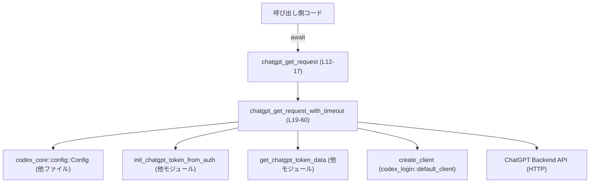
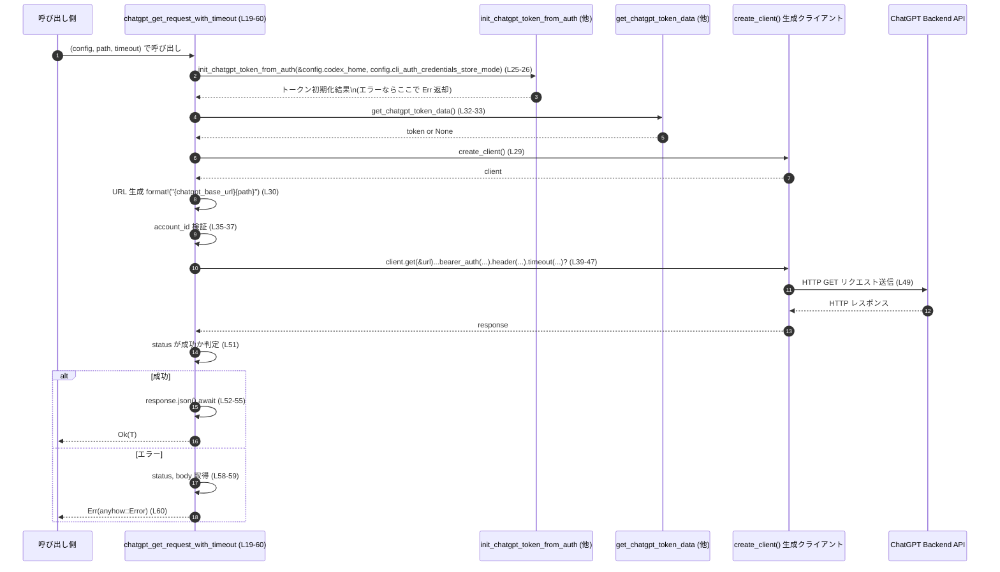

# chatgpt/src/chatgpt_client.rs コード解説

## 0. ざっくり一言

このモジュールは、`Config` から取得した ChatGPT のベース URL と認証トークン情報を使い、ChatGPT のバックエンド API へ GET リクエストを送信し、JSON を任意型としてパースして返す非同期ヘルパー関数を提供しています（`chatgpt_client.rs:L12-60`）。

---

## 1. このモジュールの役割

### 1.1 概要

- このモジュールは **ChatGPT バックエンド API への認証付き GET リクエスト** を行うための内部 API を提供します。
- `Config` から基底 URL を取得し、`chatgpt_token` モジュールを使ってトークンを初期化・取得し、HTTP クライアントでリクエストを発行します（`chatgpt_client.rs:L19-43`）。
- レスポンスは JSON として読み込み、呼び出し側が指定した型 `T` にデシリアライズします（`chatgpt_client.rs:L51-56`）。

### 1.2 アーキテクチャ内での位置づけ

このファイルから見える依存関係を図示します。



- `Config` からベース URL と認証関連の設定を読み出します（`chatgpt_client.rs:L24-25`）。
- `init_chatgpt_token_from_auth` によりトークンの初期化を行った後（`chatgpt_client.rs:L25-26`）、`get_chatgpt_token_data` で実際のトークンを取得します（`chatgpt_client.rs:L32-33`）。
- `create_client` で HTTP クライアントを生成し（`chatgpt_client.rs:L29`）、ChatGPT のエンドポイントへ直接リクエストします（`chatgpt_client.rs:L39-49`）。

### 1.3 設計上のポイント

- **責務の分割**
  - シンプルなラッパ関数 `chatgpt_get_request` と、タイムアウトまで扱う本体関数 `chatgpt_get_request_with_timeout` に分割されています（`chatgpt_client.rs:L12-17`, `L19-60`）。
  - トークンの初期化・取得は `chatgpt_token` モジュールに委譲し、このモジュールは HTTP 呼び出しに集中しています（`chatgpt_client.rs:L25`, `L32`）。
- **状態管理**
  - このモジュール内で保持される永続的な状態はありません。トークンなどの状態は外部モジュール (`chatgpt_token`) に依存しています。
- **エラーハンドリング**
  - 戻り値に `anyhow::Result<T>` を用い、`?` 演算子と `Context` でエラーにメッセージを付与しつつ伝播しています（`chatgpt_client.rs:L25-26`, `L33`, `L35-37`, `L49-60`）。
  - HTTP ステータスコードが非成功の場合は、ステータスとレスポンスボディを含んだエラーで失敗させます（`chatgpt_client.rs:L51-60`）。
- **並行性 / 非同期**
  - 両関数とも `async fn` であり、非同期ランタイム上で `await` されることを前提とした設計です（`chatgpt_client.rs:L12`, `L19`）。
  - 関数内で共有ミュータブル状態を直接扱っていないため、このファイルの範囲ではデータ競合は生じない構造です。

---

## 2. 主要な機能一覧（コンポーネントインベントリー）

### 2.1 このモジュール内の関数

| 名前 | 種別 | 役割 / 用途 | 行番号 |
|------|------|-------------|--------|
| `chatgpt_get_request` | 非公開（`pub(crate)`）async 関数 | ChatGPT バックエンドへの GET を、デフォルト設定（タイムアウトなし）で実行する薄いラッパー | `chatgpt_client.rs:L12-17` |
| `chatgpt_get_request_with_timeout` | 非公開（`pub(crate)`）async 関数 | トークン初期化・取得、HTTP クライアント生成、ヘッダ設定、オプションのタイムアウト設定、レスポンス JSON パースまでを行うコア関数 | `chatgpt_client.rs:L19-60` |

### 2.2 外部依存コンポーネント（このチャンクに定義はない）

| 名前 | 種別 | 役割 / 関係 | 行番号 | 備考 |
|------|------|------------|--------|------|
| `Config` | 構造体（他モジュール） | `chatgpt_base_url`, `codex_home`, `cli_auth_credentials_store_mode` を提供 | `chatgpt_client.rs:L1`, `L24-25` | 定義はこのチャンクには現れません |
| `create_client` | 関数（`codex_login::default_client`） | HTTP クライアントを生成 | `chatgpt_client.rs:L2`, `L29` | 具体的な型はこのチャンクには現れません |
| `get_chatgpt_token_data` | 関数 | ChatGPT トークンを取得 | `chatgpt_client.rs:L4`, `L32-33` | 戻り値の型はこのチャンクには現れませんが、`token.account_id` から `Option` を含む構造体と推測できます（推測であり、断定はできません） |
| `init_chatgpt_token_from_auth` | 関数 | 認証情報から ChatGPT トークンを初期化 | `chatgpt_client.rs:L5`, `L25-26` | 詳細実装はこのチャンクには現れません |
| `DeserializeOwned` | トレイト | ジェネリック型 `T` が所有権付きでデシリアライズ可能であることを表す | `chatgpt_client.rs:L8`, `L12`, `L19` | serde によるデシリアライズ制約 |
| `Context` | トレイト | `anyhow` のエラーに文脈メッセージを追加 | `chatgpt_client.rs:L7`, `L49-55` | |

---

## 3. 公開 API と詳細解説

### 3.1 型一覧（構造体・列挙体など）

このファイル内で新たに定義されている型はありません。ジェネリック型 `T` についてのみ制約が課されています。

| 名前 | 種別 | 役割 / 用途 | 行番号 |
|------|------|-------------|--------|
| `T` | ジェネリック型パラメータ | HTTP レスポンスの JSON をデシリアライズする先の型。`DeserializeOwned` 制約付き。 | `chatgpt_client.rs:L12`, `L19`, `L52` |

### 3.2 関数詳細

#### `chatgpt_get_request<T: DeserializeOwned>(config: &Config, path: String) -> anyhow::Result<T>`

**概要**

- ChatGPT バックエンドの指定パスに対して GET リクエストを行い、レスポンス JSON を型 `T` として返す、もっともシンプルなエントリーポイントです（`chatgpt_client.rs:L11-16`）。
- 内部的には `chatgpt_get_request_with_timeout` をタイムアウトなしで呼び出すだけのラッパーです（`chatgpt_client.rs:L16`）。

**引数**

| 引数名 | 型 | 説明 | 行番号 |
|--------|----|------|--------|
| `config` | `&Config` | ChatGPT ベース URL や認証関連の設定を含む設定構造体への参照 | `chatgpt_client.rs:L13` |
| `path` | `String` | ベース URL に連結されるパス文字列。例: `"/v1/some_endpoint"` を想定（値のフォーマット自体はコードからは読み取れません） | `chatgpt_client.rs:L14` |

**戻り値**

- `anyhow::Result<T>`  
  - 成功時: ChatGPT API の JSON レスポンスを `T` にデシリアライズした値（`chatgpt_client.rs:L16` 経由で `L51-56` に従う）  
  - 失敗時: 認証初期化失敗・トークン未取得・HTTP エラー・JSON パースエラーなどをラップした `anyhow::Error`

**内部処理の流れ**

1. 同じ引数 `config`, `path` と、タイムアウト `None` を指定して `chatgpt_get_request_with_timeout` を呼び出します（`chatgpt_client.rs:L16`）。
2. 非同期に実行し、その結果をそのまま呼び出し元に返します（`chatgpt_client.rs:L16`）。

**Examples（使用例）**

```rust
// 非同期コンテキスト内での使用例（tokio ランタイムなどが必要です）
use codex_core::config::Config;
use crate::chatgpt_client::chatgpt_get_request;

// ChatGPT API が返す JSON に対応する型（簡易例）
#[derive(serde::Deserialize)]
struct ChatGptResponse {
    // フィールド定義は実際の API スキーマに合わせる必要があります
    message: String,
}

async fn call_chatgpt(config: &Config) -> anyhow::Result<()> {
    // エンドポイントパス（実際の値は API 仕様に依存します）
    let path = "/v1/some_endpoint".to_string();

    // ChatGPT へ GET リクエスト
    let response: ChatGptResponse = chatgpt_get_request(config, path).await?; // chatgpt_client.rs:L12-17

    println!("{}", response.message);
    Ok(())
}
```

**Errors / Panics**

- 発生しうるエラー（すべて `anyhow::Error` として返却）
  - `chatgpt_get_request_with_timeout` 内部で発生するエラーに準じます（後述）。
- パニック条件
  - この関数自体には `unwrap` 等はなく、パニックを起こすコードは含まれていません（`chatgpt_client.rs:L12-17`）。

**Edge cases（エッジケース）**

- `path` が空文字列のとき
  - ベース URL のみでリクエストが送信されますが、これが正しいかどうかは上位仕様次第であり、このチャンクからは分かりません（`chatgpt_client.rs:L24`, `L30`）。
- `T` がレスポンス JSON と整合しない型の場合
  - JSON デシリアライズ時にエラーとなり、`anyhow::Error` として返されます（`chatgpt_client.rs:L52-55` 経由）。

**使用上の注意点**

- 非同期関数のため、必ず `async` コンテキスト内で `.await` する必要があります（`chatgpt_client.rs:L12`）。
- 細かいタイムアウト制御を行いたい場合は、代わりに `chatgpt_get_request_with_timeout` を利用する必要があります。

---

#### `chatgpt_get_request_with_timeout<T: DeserializeOwned>(config: &Config, path: String, timeout: Option<Duration>) -> anyhow::Result<T>`

**概要**

- ChatGPT バックエンド API への GET リクエストを行うコアロジックです（`chatgpt_client.rs:L19-60`）。
- 認証トークンの初期化・取得、HTTP クライアント生成、リクエストヘッダ設定、任意のタイムアウト設定、レスポンスの JSON パースまでを行います。

**引数**

| 引数名 | 型 | 説明 | 行番号 |
|--------|----|------|--------|
| `config` | `&Config` | ベース URL と認証設定を含む設定構造体 | `chatgpt_client.rs:L20`, `L24-25` |
| `path` | `String` | ベース URL に連結されるパス文字列 | `chatgpt_client.rs:L21`, `L30` |
| `timeout` | `Option<Duration>` | リクエストのタイムアウト。`Some(d)` のときは `d` をタイムアウトに設定し、`None` のときはクライアントのデフォルトに従います | `chatgpt_client.rs:L22`, `L45-47` |

**戻り値**

- `anyhow::Result<T>`
  - 成功時: JSON レスポンスを `T` にデシリアライズした値（`chatgpt_client.rs:L52-56`）。
  - 失敗時: 初期化や HTTP 通信・パースに関する各種エラー（`chatgpt_client.rs:L25-26`, `L33`, `L35-37`, `L49-60`）。

**内部処理の流れ（アルゴリズム）**

1. **ベース URL の取得**  
   `config.chatgpt_base_url` への参照を取り出します（`chatgpt_client.rs:L24`）。

2. **トークンの初期化**  
   `init_chatgpt_token_from_auth(&config.codex_home, config.cli_auth_credentials_store_mode)` を `await` し、認証情報から ChatGPT トークンを初期化します（`chatgpt_client.rs:L25-26`）。  
   - ここでエラーが発生した場合、`?` により即座に呼び出し元へエラーが返されます。

3. **HTTP クライアントと URL の準備**  
   - `create_client()` で HTTP クライアントを生成します（`chatgpt_client.rs:L29`）。
   - `format!("{chatgpt_base_url}{path}")` でベース URL とパスを連結して完全な URL を生成します（`chatgpt_client.rs:L30`）。

4. **トークンとアカウント ID の取得・検証**
   - `get_chatgpt_token_data()` でトークンを取得し、`Option` が `None` の場合は `"ChatGPT token not available"` というメッセージ付きでエラーを返します（`chatgpt_client.rs:L32-33`）。
   - `token.account_id.ok_or_else(...)` により `account_id` が `Some` であることを検証し、`None` の場合は `"ChatGPT account ID not available, please re-run 'codex login'"` というメッセージ付きのエラーを生成します（`chatgpt_client.rs:L35-37`）。

5. **リクエスト構築**
   - `client.get(&url)` で GET リクエストビルダを作成（`chatgpt_client.rs:L39-40`）。
   - `.bearer_auth(&token.access_token)` で `Authorization: Bearer ...` ヘッダを設定（`chatgpt_client.rs:L41`）。
   - `.header("chatgpt-account-id", account_id?)` で ChatGPT アカウント ID をヘッダに追加（`chatgpt_client.rs:L42`）。`?` によりアカウント ID 取得失敗時はエラーを返します。
   - `.header("Content-Type", "application/json")` を設定（`chatgpt_client.rs:L43`）。

6. **タイムアウト設定（任意）**
   - `if let Some(timeout) = timeout { request = request.timeout(timeout); }` により、`timeout` が指定されている場合はリクエストビルダにタイムアウトを設定します（`chatgpt_client.rs:L45-47`）。

7. **リクエスト送信とレスポンス処理**
   - `request.send().await.context("Failed to send request")?` でリクエストを送信し、送信エラー時には `"Failed to send request"` のメッセージを付与してエラーとして返します（`chatgpt_client.rs:L49`）。
   - `response.status().is_success()` でステータスコードが成功か確認（`chatgpt_client.rs:L51`）。
     - 成功時:
       - `response.json().await.context("Failed to parse JSON response")?` で JSON を `T` にデシリアライズ（`chatgpt_client.rs:L52-55`）。
       - その結果を `Ok(result)` として返却（`chatgpt_client.rs:L56`）。
     - 失敗時:
       - `status`（ステータスコード）と `body`（テキストボディ）を取得（`chatgpt_client.rs:L58-59`）。
       - `anyhow::bail!("Request failed with status {status}: {body}")` でエラーとして終了（`chatgpt_client.rs:L60`）。

**Examples（使用例）**

```rust
use std::time::Duration;
use codex_core::config::Config;
use crate::chatgpt_client::chatgpt_get_request_with_timeout;

#[derive(serde::Deserialize)]
struct ChatGptResponse {
    message: String,
}

async fn call_chatgpt_with_timeout(config: &Config) -> anyhow::Result<()> {
    let path = "/v1/some_endpoint".to_string();

    // 5 秒のタイムアウトを指定してリクエスト
    let timeout = Some(Duration::from_secs(5));

    let response: ChatGptResponse =
        chatgpt_get_request_with_timeout(config, path, timeout).await?; // chatgpt_client.rs:L19-60

    println!("{}", response.message);
    Ok(())
}
```

**Errors / Panics**

- `Err` になりうる条件（すべて `anyhow::Error`）
  - `init_chatgpt_token_from_auth` の内部で発生した各種エラー（認証情報不足など）（`chatgpt_client.rs:L25-26`）。
  - `get_chatgpt_token_data()` が `None` を返した場合（トークン未初期化等）  
    → `"ChatGPT token not available"` メッセージでエラー（`chatgpt_client.rs:L32-33`）。
  - `token.account_id` が `None` の場合  
    → `"ChatGPT account ID not available, please re-run 'codex login'"` メッセージでエラー（`chatgpt_client.rs:L35-37`）。
  - HTTP 送信エラー（ネットワーク障害など）  
    → `"Failed to send request"` というコンテキストメッセージ付きでエラー（`chatgpt_client.rs:L49`）。
  - レスポンス JSON のデシリアライズ失敗  
    → `"Failed to parse JSON response"` というコンテキストメッセージ付きでエラー（`chatgpt_client.rs:L52-55`）。
  - HTTP ステータスが非成功（2xx 以外）の場合  
    → `"Request failed with status {status}: {body}"` メッセージでエラー（`chatgpt_client.rs:L51-60`）。

- パニック（`panic!`）について
  - この関数内では `unwrap` 系は `unwrap_or_default()` のみで、これはエラー時に空文字列を返すため、パニックは発生しません（`chatgpt_client.rs:L59`）。
  - よって、この関数自体がパニックを起こすケースはファイル内からは読み取れません。

**Edge cases（エッジケース）**

- **トークン未初期化 / 失効など**
  - `get_chatgpt_token_data()` が `None` を返した場合、 `"ChatGPT token not available"` として即座にエラーになります（`chatgpt_client.rs:L32-33`）。
  - これにより、無効なトークンで API を呼び続けることを防ぐ構造になっています。

- **アカウント ID 不在**
  - `token.account_id` が `None` の場合、`ok_or_else` 経由でエラーが生成されます（`chatgpt_client.rs:L35-37`）。
  - エラーメッセージは `codex login` の再実行を促しています。

- **タイムアウト指定なし**
  - `timeout` が `None` の場合、`if let Some(timeout)` ブロックが実行されず、HTTP クライアントのデフォルトタイムアウト設定が使用されます（`chatgpt_client.rs:L45-47`）。

- **レスポンスボディ取得失敗時**
  - エラーレスポンスのボディ取得 (`response.text().await`) が失敗した場合、`unwrap_or_default()` により空文字列として扱われます（`chatgpt_client.rs:L59`）。
  - そのため、ログされるメッセージの `body` 部分が空になることがあります。

- **非 JSON レスポンス**
  - ステータスが成功だが JSON 以外の内容だった場合、`response.json().await` が失敗し、 `"Failed to parse JSON response"` エラーになります（`chatgpt_client.rs:L51-55`）。

**使用上の注意点**

- **非同期コンテキスト必須**
  - `async fn` のため、Tokio などの非同期ランタイム上で `.await` される必要があります（`chatgpt_client.rs:L19`）。
- **レスポンス型 `T` の設計**
  - `T` はレスポンス JSON と整合するフィールドを持つ必要があります。整合しない場合、デシリアライズエラーとなり `Err` が返されます（`chatgpt_client.rs:L52-55`）。
- **タイムアウトの指定**
  - 高レイテンシ環境やエラー再試行ロジックと組み合わせる場合、`timeout` を `Some(Duration)` で適切に指定する必要があります（`chatgpt_client.rs:L45-47`）。
- **ログやエラー表示への配慮（セキュリティ上の注意）**
  - エラーメッセージ `"Request failed with status {status}: {body}"` にはレスポンスボディが含まれるため、ボディに機密情報が含まれている場合、ログ出力などにそのまま流さないよう注意が必要です（`chatgpt_client.rs:L58-60`）。
  - この関数内ではアクセストークン自体はログに出していません（`chatgpt_client.rs:L39-43`）。

### 3.3 その他の関数

このファイルには上記 2 つ以外の関数は存在しません。

---

## 4. データフロー

ここでは `chatgpt_get_request_with_timeout` 呼び出し時の代表的な処理フローを示します。

### 4.1 処理の要点

- 入力: `Config`, `path`, `timeout`
- 中間ステップ: トークン初期化 → トークン取得 → HTTP クライアント生成 → リクエスト構築（ヘッダ/タイムアウト） → 送信
- 出力: 成功時は `T` 型のレスポンスデータ、失敗時は `anyhow::Error`

### 4.2 シーケンス図



---

## 5. 使い方（How to Use）

### 5.1 基本的な使用方法

典型的なコードフローは以下の通りです。

```rust
use codex_core::config::Config;
use crate::chatgpt_client::chatgpt_get_request;
use serde::Deserialize;

#[derive(Deserialize)]
struct ChatGptResponse {
    message: String,
}

async fn example(config: &Config) -> anyhow::Result<()> {
    // ChatGPT のエンドポイントパス
    let path = "/v1/some_endpoint".to_string();

    // タイムアウト無しで呼び出す場合（内部で chatgpt_get_request_with_timeout を利用）
    let response: ChatGptResponse = chatgpt_get_request(config, path).await?; // chatgpt_client.rs:L12-17

    println!("{}", response.message);
    Ok(())
}
```

### 5.2 よくある使用パターン

1. **タイムアウト付きでの呼び出し**

```rust
use std::time::Duration;
use crate::chatgpt_client::chatgpt_get_request_with_timeout;

async fn example_with_timeout(config: &Config) -> anyhow::Result<()> {
    let path = "/v1/some_endpoint".to_string();
    let timeout = Some(Duration::from_secs(10)); // 10 秒タイムアウト

    let response: serde_json::Value =
        chatgpt_get_request_with_timeout(config, path, timeout).await?; // chatgpt_client.rs:L19-60

    println!("{:#}", response);
    Ok(())
}
```

1. **スキーマレスに `serde_json::Value` で受ける**

```rust
use crate::chatgpt_client::chatgpt_get_request;

async fn example_dynamic(config: &Config) -> anyhow::Result<()> {
    let path = "/v1/some_endpoint".to_string();

    // 任意の JSON を serde_json::Value で受け取る
    let response: serde_json::Value = chatgpt_get_request(config, path).await?;

    // 動的にフィールドを参照
    println!("{:#}", response);
    Ok(())
}
```

### 5.3 よくある間違い

```rust
// 間違い例: 非同期コンテキスト外で await しようとする
// fn main() {
//     let config = ...;
//     let path = "/v1/endpoint".to_string();
//     let res = chatgpt_get_request(&config, path).await; // コンパイルエラー: async でない
// }

// 正しい例: 非同期ランタイム内で実行する
#[tokio::main] // ここで tokio ランタイムを起動
async fn main() -> anyhow::Result<()> {
    let config = /* Config をロードする処理（別モジュール） */;
    let path = "/v1/endpoint".to_string();

    let res: serde_json::Value = chatgpt_get_request(&config, path).await?;
    println!("{:#}", res);
    Ok(())
}
```

```rust
// 間違い例: レスポンス型 T が JSON と合わない
#[derive(serde::Deserialize)]
struct WrongType {
    not_existing: String,
}

// これで呼び出すと、レスポンス JSON に `not_existing` フィールドが無ければ
// デシリアライズエラーとなり、Err(anyhow::Error) になります。
```

### 5.4 使用上の注意点（まとめ）

- このモジュールは **GET リクエスト専用** であり、POST など他の HTTP メソッドはこのチャンクには実装されていません。
- 認証トークンは `init_chatgpt_token_from_auth` / `get_chatgpt_token_data` に依存しているため、事前に適切に認証が完了している必要があります（`chatgpt_client.rs:L25-26`, `L32-33`）。
- エラー時のメッセージにレスポンスボディの一部または全部が含まれるため、ログ出力時には機密情報への配慮が必要です（`chatgpt_client.rs:L58-60`）。

---

## 6. 変更の仕方（How to Modify）

### 6.1 新しい機能を追加する場合

- **別 HTTP メソッドを追加したい場合**
  1. 同ファイルまたは同モジュール内に `chatgpt_post_request_with_timeout` のような新関数を追加する。
  2. `chatgpt_get_request_with_timeout` と同様のパターンで、`client.post(&url)` などのメソッドを使用する（このファイルには post の例はないため、ヘルパー関数の API は外部ライブラリのドキュメントを参照する必要があります）。
  3. トークン初期化・取得ロジック（`init_chatgpt_token_from_auth`, `get_chatgpt_token_data`）の呼び出しパターンは再利用する（`chatgpt_client.rs:L25-26`, `L32-33`）。

- **共通のヘッダ構築を共通化したい場合**
  - `client.get(&url)...` から `if let Some(timeout)` までの処理（`chatgpt_client.rs:L39-47`）を別のヘルパー関数に切り出すことが考えられます。

### 6.2 既存の機能を変更する場合

- **影響範囲の確認**
  - `chatgpt_get_request` は単に `chatgpt_get_request_with_timeout` を呼び出すだけなので、コアロジック変更時は後者の利用箇所を中心に調査します（`chatgpt_client.rs:L16`, `L19-60`）。
  - `Config` のフィールド名や意味を変更する場合は、`chatgpt_base_url`, `codex_home`, `cli_auth_credentials_store_mode` を参照している箇所の対応が必要です（`chatgpt_client.rs:L24-25`）。

- **契約上の注意点**
  - `get_chatgpt_token_data` が `None` を返した場合にエラーを返すという契約があります（`chatgpt_client.rs:L32-33`）。これを変更すると、トークンなしで API を呼ぶ可能性が生じるため、仕様として許容されるか検討が必要です。
  - HTTP ステータスが成功でない場合は必ず `Err` を返すという挙動（`chatgpt_client.rs:L51-60`）を変えると、呼び出し側のエラーハンドリングロジックに影響します。

- **テスト**
  - このチャンクにはテストコードは含まれていません。変更を行う場合は、別ファイルのテスト（存在する場合）を確認し、必要に応じて追加・更新する必要があります。

---

## 7. 関連ファイル

このモジュールと密接に関係するファイル・モジュール（ファイル名はインポートから推測、定義場所はこのチャンクからは不明です）。

| パス（推定） | 役割 / 関係 |
|-------------|------------|
| `codex_core/src/config.rs` など | `Config` 構造体を定義し、`chatgpt_base_url`, `codex_home`, `cli_auth_credentials_store_mode` などの設定値を提供すると考えられます（パスは推測であり、このチャンクからは確定できません）。 |
| `codex_login/src/default_client.rs` など | `create_client` 関数を定義し、HTTP クライアントの生成ロジックを提供します（パスは推測）。 |
| `crate::chatgpt_token` モジュール | `get_chatgpt_token_data`, `init_chatgpt_token_from_auth` を定義し、ChatGPT トークンの初期化・取得ロジックを提供します。定義場所はこのチャンクには現れません。 |

このチャンクにはテストファイルや補助ユーティリティファイルは含まれていません。
