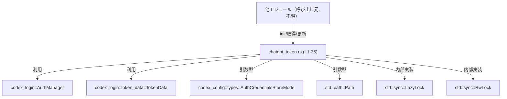
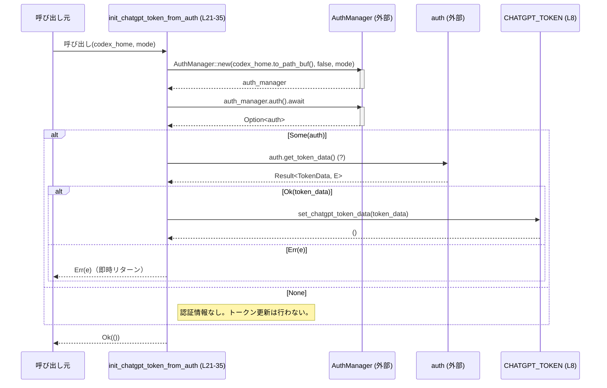
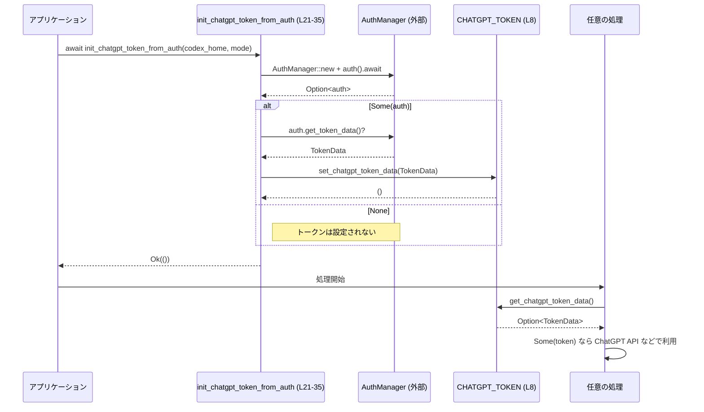

# chatgpt/src/chatgpt_token.rs コード解説

## 0. ざっくり一言

ChatGPT 用のアクセストークン（`TokenData`）をプロセス全体の共有状態として保持し、  
取得・更新と、`auth.json` からの非同期初期化を行うモジュールです（`chatgpt_token.rs:L8-35`）。

---

## 1. このモジュールの役割

### 1.1 概要

- このモジュールは **ChatGPT 用トークンの共有管理** を行うために存在し、  
  グローバルな `static` 変数で `TokenData` を保持します（`chatgpt_token.rs:L8`）。
- トークンへは、`RwLock` による排他制御を通じて読み書きし、  
  取得関数・更新関数・`auth.json` からの初期化関数を公開します（`chatgpt_token.rs:L10-18,L21-35`）。

### 1.2 アーキテクチャ内での位置づけ

このモジュールは、認証情報管理クレート `codex_login` と設定クレート `codex_config` を利用し、  
ChatGPT トークンを内部静的変数に格納する役割を担っています。



- 認証データの永続化やファイル I/O の詳細は `AuthManager` 側に委譲されています（`chatgpt_token.rs:L21-31`）。
- このモジュール側は、あくまで取得済み `TokenData` の **プロセス内キャッシュ** という位置づけです。

### 1.3 設計上のポイント

コードから読み取れる設計の特徴は次のとおりです。

- **グローバル状態の集中管理**
  - `static CHATGPT_TOKEN: LazyLock<RwLock<Option<TokenData>>>` で、プロセス全体で共有されるトークン状態を 1 箇所に集約しています（`chatgpt_token.rs:L8`）。

- **遅延初期化 + 同期的なロック**
  - `LazyLock` により初回アクセス時に `RwLock<Option<TokenData>>` が生成されます（`chatgpt_token.rs:L8`）。
  - `RwLock` によって、同時に複数スレッドからの読み取りと排他的な書き込みを安全に行います。

- **エラーハンドリング方針**
  - ロック取得失敗（ポイズン）時:
    - `get_chatgpt_token_data` は `None` を返して終了します（`chatgpt_token.rs:L10-12`）。
    - `set_chatgpt_token_data` は何もせず終了し、呼び出し側にはエラーを返しません（`chatgpt_token.rs:L14-18`）。
  - `init_chatgpt_token_from_auth` は、`auth.get_token_data()` のエラーのみを `std::io::Result` として呼び出し元に伝播します（`chatgpt_token.rs:L21-24,L31-34`）。
  - `auth_manager.auth().await` が `None` の場合も、エラーにはせず何もせず `Ok(())` を返します（`chatgpt_token.rs:L30-34`）。

- **非同期/同期の境界**
  - 外部 I/O を行うとみられる `AuthManager` との連携は `async fn init_chatgpt_token_from_auth` に閉じ込められており（`chatgpt_token.rs:L21-35`）、トークンの単純な取得・更新は同期関数で提供されています（`chatgpt_token.rs:L10-18`）。

---

## 2. 主要な機能一覧

- ChatGPT トークンのプロセス内キャッシュ
- 現在のトークンの取得（クローンを返す）
- トークンの更新（新しい `TokenData` をセット）
- `auth.json`（と思われる認証情報）からの ChatGPT トークンの非同期初期化

---

## 3. 公開 API と詳細解説

### 3.1 型・静的変数・関数一覧（コンポーネントインベントリー）

このモジュール内で定義されている主要コンポーネントを一覧にします。

| 名前 | 種別 | 公開 | 行番号 | 役割 / 用途 |
|------|------|------|--------|-------------|
| `CHATGPT_TOKEN` | `static LazyLock<RwLock<Option<TokenData>>>` | 非公開 | `chatgpt_token.rs:L8` | ChatGPT トークンを `Option<TokenData>` として保持するグローバル状態。遅延初期化され、`RwLock` によりスレッド安全に読み書きされます。 |
| `get_chatgpt_token_data` | 関数 | 公開 | `chatgpt_token.rs:L10-12` | 現在保持している `Option<TokenData>` のクローンを取得します。ロック取得失敗や未初期化の場合は `None` を返します。 |
| `set_chatgpt_token_data` | 関数 | 公開 | `chatgpt_token.rs:L14-18` | 渡された `TokenData` をグローバルな `CHATGPT_TOKEN` にセットします。ロック取得に失敗した場合は何も行いません。 |
| `init_chatgpt_token_from_auth` | 非同期関数 | 公開 | `chatgpt_token.rs:L21-35` | `AuthManager` を通じて認証情報から ChatGPT トークンを取得し、`CHATGPT_TOKEN` に初期設定します。I/O エラーを `std::io::Result<()>` として返します。 |

※ 外部型（このモジュール外に定義）:

- `AuthCredentialsStoreMode`（`codex_config::types`）: 認証情報の保存モード（推定）として使用されています（`chatgpt_token.rs:L1,L23`）。
- `AuthManager`（`codex_login`）: 認証情報の読み出しと `auth.get_token_data()` の提供元（`chatgpt_token.rs:L2,L25-31`）。
- `TokenData`（`codex_login::token_data`）: ChatGPT トークンを含む認証トークン情報（`chatgpt_token.rs:L3,L8,L10,L14,L31`）。

---

### 3.2 関数詳細

#### `get_chatgpt_token_data() -> Option<TokenData>`

**概要**

- グローバルな `CHATGPT_TOKEN` に格納されている `Option<TokenData>` のクローンを返します（`chatgpt_token.rs:L10-12`）。
- ロックのポイズンや未設定など、いずれかの理由で取得できない場合は `None` を返します。

**引数**

- なし。

**戻り値**

- `Option<TokenData>`  
  - `Some(token)` : `CHATGPT_TOKEN` に `Some(TokenData)` が格納されており、ロックも正常に取得できた場合。
  - `None` : 以下のいずれかの場合（コード上の挙動から読み取れます）:
    - `RwLock` の read ロック取得に失敗した場合（`read().ok()?` が `None` になる）（`chatgpt_token.rs:L11`）。
    - `CHATGPT_TOKEN` が `None` の場合（`Option::clone()` の結果）（`chatgpt_token.rs:L8,L11`）。

**内部処理の流れ**

```rust
pub fn get_chatgpt_token_data() -> Option<TokenData> {
    CHATGPT_TOKEN.read().ok()?.clone()
}
```

処理の段階:

1. `CHATGPT_TOKEN.read()` で読み取りロックを取得しようとする（`chatgpt_token.rs:L11`）。
2. `read()` が `Result` を返すため、`ok()` で `Option` に変換する（失敗時は `None`）（`chatgpt_token.rs:L11`）。
3. `?` 演算子により、`None` の場合はそのまま関数戻り値 `None` として早期リターンする（`chatgpt_token.rs:L11`）。
4. 正常に `RwLockReadGuard<Option<TokenData>>` が得られた場合、その中身の `Option<TokenData>` に対して `clone()` を呼び出し、複製した `Option<TokenData>` を返す（`chatgpt_token.rs:L11`）。

ここから、`TokenData` が `Clone` を実装していることが前提になっていると読み取れます（`Option<TokenData>` の `clone()` を呼び出しているため）。

**Examples（使用例）**

基本的な取得パターンの例です。

```rust
use std::path::Path;
use codex_config::types::AuthCredentialsStoreMode;
use crate::chatgpt_token::{init_chatgpt_token_from_auth, get_chatgpt_token_data};

// 非同期コンテキスト（例: tokio::main）の中で
async fn example() -> std::io::Result<()> {
    let codex_home = Path::new("/path/to/codex_home");           // Codex のホームディレクトリ
    let mode = AuthCredentialsStoreMode::File;                   // 具体的なバリアント名は仮（このチャンクからは不明）

    // 先にトークンを初期化する
    init_chatgpt_token_from_auth(codex_home, mode).await?;       // auth.json から TokenData を読み込む（chatgpt_token.rs:L21-35）

    // 初期化後にトークンを取得する
    if let Some(token) = get_chatgpt_token_data() {              // クローンされた TokenData を取得（chatgpt_token.rs:L10-12）
        // token を使って API クライアントなどを構築する
        println!("Got ChatGPT token: {:?}", token);
    } else {
        // トークンが設定されていない、またはロック取得に失敗した場合
        eprintln!("ChatGPT token is not available");
    }

    Ok(())
}
```

**Errors / Panics**

- この関数自体は `Result` を返さず、パニックも明示的には発生させていません。
- ロック取得失敗（ポイズン）は `None` に変換されるため、呼び出し側は **エラーとして区別できません**（`chatgpt_token.rs:L11`）。

**Edge cases（エッジケース）**

- トークン未初期化（`set_chatgpt_token_data`/`init_chatgpt_token_from_auth` がまだ呼ばれていない場合）:
  - `CHATGPT_TOKEN` の内部は `None` のままであり、`get_chatgpt_token_data` は `None` を返します（`chatgpt_token.rs:L8,L11`）。
- ロックポイズン（過去の書き込み中にパニックが発生したなど）:
  - `CHATGPT_TOKEN.read()` が `Err` になり、`ok()?` によって `None` で早期リターンされます（`chatgpt_token.rs:L11`）。

**使用上の注意点**

- 「トークンがない」の理由（未初期化 / ロックポイズン / その他）は区別できません。必要であれば、呼び出し側でログや状態管理を追加する必要があります。
- 返り値はクローンされた `TokenData` なので、呼び出し側で内容を書き換えてもグローバル状態には影響しません（`chatgpt_token.rs:L11`）。
- この関数は同期関数なので、非同期コンテキストからも通常の関数呼び出しとして使用できます。

---

#### `set_chatgpt_token_data(value: TokenData)`

**概要**

- 渡された `TokenData` をグローバルな `CHATGPT_TOKEN` に `Some(value)` として保存します（`chatgpt_token_token.rs:L14-18`）。
- ロック取得に失敗した場合は何もせず終了し、エラーは呼び出し側に通知されません。

**引数**

| 引数名 | 型 | 説明 |
|--------|----|------|
| `value` | `TokenData` | 新しく設定する ChatGPT トークン。所有権がこの関数にムーブされます（`chatgpt_token.rs:L14`）。 |

**戻り値**

- なし（`()`）。

**内部処理の流れ**

```rust
pub fn set_chatgpt_token_data(value: TokenData) {
    if let Ok(mut guard) = CHATGPT_TOKEN.write() {
        *guard = Some(value);
    }
}
```

1. `CHATGPT_TOKEN.write()` で書き込みロックを取得しようとします（`chatgpt_token.rs:L15`）。
2. ロック取得に成功した場合のみ `if let Ok(mut guard)` のブロック内に入り、`guard` 経由で `Option<TokenData>` を更新します（`chatgpt_token.rs:L15-16`）。
3. `*guard = Some(value);` により、以前の値（`Some` でも `None` でも）を上書きして新しいトークンを保存します（`chatgpt_token.rs:L16`）。
4. ロック取得に失敗した場合（ポイズンなど）は、ブロックに入らず関数は何もせず終了します（`chatgpt_token.rs:L15-17`）。

**Examples（使用例）**

手動でトークンをセットする例です。

```rust
use codex_login::token_data::TokenData;
use crate::chatgpt_token::{set_chatgpt_token_data, get_chatgpt_token_data};

fn manual_update_token() {
    // ここでは TokenData の生成方法は不明なため仮の構築コードです
    // 実際には codex_login 側の API に従う必要があります
    let token_data = TokenData { /* フィールドはこのチャンクからは不明 */ };

    // グローバルな ChatGPT トークンを更新する
    set_chatgpt_token_data(token_data);                        // chatgpt_token.rs:L14-18

    // 更新後に取得して確認する
    if let Some(current) = get_chatgpt_token_data() {          // chatgpt_token.rs:L10-12
        println!("Updated token: {:?}", current);
    }
}
```

※ `TokenData` の具体的なフィールド構造はこのチャンクには現れないため不明です。

**Errors / Panics**

- ロック取得失敗時もエラーは返されません。呼び出し側から見ると「成功したかどうか」は判別できません（`chatgpt_token.rs:L15-17`）。
- パニックを発生させるコードは含まれていません。

**Edge cases（エッジケース）**

- ロックポイズン:
  - `CHATGPT_TOKEN.write()` が `Err` になった場合、内部状態は変更されずに関数が終了します（`chatgpt_token.rs:L15-17`）。
- 既存値の上書き:
  - 前に設定されていたトークンがある場合も、新しい `value` で上書きされます（`chatgpt_token.rs:L16`）。

**使用上の注意点**

- ロック取得失敗時にサイレントに何も起きないため、「確実に設定したい」場合は別途仕組み（戻り値を追加するなど）の検討が必要です。
- トークンのライフサイクル管理（いつ更新するか、どのような条件でクリーンアップするか）は、この関数単体からは決まりません。呼び出し側の設計に依存します。

---

#### `init_chatgpt_token_from_auth(codex_home: &Path, auth_credentials_store_mode: AuthCredentialsStoreMode) -> std::io::Result<()>`

**概要**

- `AuthManager` を用いて認証情報（コメント上は `auth.json`）から ChatGPT トークンを読み出し、`CHATGPT_TOKEN` に設定する非同期関数です（`chatgpt_token.rs:L20-35`）。
- 読み出しやデシリアライズにかかわる I/O エラーを `std::io::Result<()>` で呼び出し元に報告します（`chatgpt_token.rs:L24,L31-34`）。

**引数**

| 引数名 | 型 | 説明 |
|--------|----|------|
| `codex_home` | `&Path` | 認証情報が格納されている Codex のホームディレクトリへのパス参照と見られます（`chatgpt_token.rs:L22,L25-26`）。 |
| `auth_credentials_store_mode` | `AuthCredentialsStoreMode` | 認証情報の保存・読み出しモードを指定する列挙体と推測されます（`chatgpt_token.rs:L1,L23,L28`）。 |

**戻り値**

- `std::io::Result<()>`
  - `Ok(())` : 初期化処理全体が I/O エラーなく終了した場合。
    - 認証情報が存在しなかったり、`auth_manager.auth().await` が `None` を返した場合でも、**エラーにはなりません**（`chatgpt_token.rs:L30-34`）。
    - ロックポイズン等で `set_chatgpt_token_data` による更新が失敗した場合も、エラーにはなりません（`chatgpt_token.rs:L31-32` と `set_chatgpt_token_data` の仕様より）。
  - `Err(e)` : `auth.get_token_data()?` の呼び出しで発生した I/O エラーなどが `?` を通じて伝播した場合（`chatgpt_token.rs:L31`）。

**内部処理の流れ（アルゴリズム）**

```rust
pub async fn init_chatgpt_token_from_auth(
    codex_home: &Path,
    auth_credentials_store_mode: AuthCredentialsStoreMode,
) -> std::io::Result<()> {
    let auth_manager = AuthManager::new(
        codex_home.to_path_buf(),
        /*enable_codex_api_key_env*/ false,
        auth_credentials_store_mode,
    );
    if let Some(auth) = auth_manager.auth().await {
        let token_data = auth.get_token_data()?;
        set_chatgpt_token_data(token_data);
    }
    Ok(())
}
```

1. `AuthManager::new` を呼び出し、`codex_home` から `PathBuf` を生成して渡します。第二引数には `false` が固定で渡されており、環境変数による API キー利用を無効にしていると読み取れます（`chatgpt_token.rs:L25-28`）。
2. `auth_manager.auth().await` を実行し、非同期に認証情報を取得します。戻り値は `Option<_>` で、`Some(auth)` のときのみ続行します（`chatgpt_token.rs:L30`）。
3. `auth.get_token_data()?` で、認証情報から `TokenData` を取得します（`chatgpt_token.rs:L31`）。
   - この呼び出しが `Err(e)` を返した場合、`?` により即座に `Err(e)`（あるいは `e` から変換された `std::io::Error`）として関数全体が終了します。
4. 正常に `TokenData` が得られた場合、`set_chatgpt_token_data(token_data);` によってグローバルな `CHATGPT_TOKEN` を更新します（`chatgpt_token.rs:L32`）。
5. 認証情報が存在しなかった場合（`auth_manager.auth().await` が `None`）、または更新に失敗した場合でも、`Ok(())` を返します（`chatgpt_token.rs:L30-35`）。

**Mermaid（処理フロー図, L21-35）**



**Examples（使用例）**

典型的な初期化フローの例です。

```rust
use std::path::Path;
use codex_config::types::AuthCredentialsStoreMode;
use crate::chatgpt_token::{init_chatgpt_token_from_auth, get_chatgpt_token_data};

#[tokio::main]                                      // tokio ランタイムを前提とした例
async fn main() -> std::io::Result<()> {
    let codex_home = Path::new("/path/to/codex_home");
    let mode = AuthCredentialsStoreMode::File;      // 実際のバリアント名はこのチャンクからは不明

    // 1. 起動時にトークンを auth.json 等からロード
    init_chatgpt_token_from_auth(codex_home, mode).await?;  // chatgpt_token.rs:L21-35

    // 2. あとでトークンを利用
    if let Some(token) = get_chatgpt_token_data() {         // chatgpt_token.rs:L10-12
        println!("ChatGPT token ready: {:?}", token);
    } else {
        eprintln!("ChatGPT token not initialized.");
    }

    Ok(())
}
```

**Errors / Panics**

- エラー条件（`Err` を返す場合）:
  - `auth.get_token_data()?` がエラーを返した場合（`chatgpt_token.rs:L31`）。
  - そのエラー型は `std::io::Error` か、`std::io::Error` に変換可能な型である必要があります（`-> std::io::Result<()>` と `?` から推測されます）。
- エラーにはならないが、期待通りのトークンが設定されない可能性がある条件:
  - `auth_manager.auth().await` が `None` を返した場合（`chatgpt_token.rs:L30`）。
  - `set_chatgpt_token_data` 内でロック取得に失敗した場合（`chatgpt_token.rs:L32` と `set_chatgpt_token_data` の仕様）。

**Edge cases（エッジケース）**

- `codex_home` が存在しない / 読み取り不能:
  - `AuthManager::new` や `auth.get_token_data()` が内部でエラーを発生させ、`Err` が返る可能性がありますが、具体的な挙動はこのチャンクには現れません。
- 認証情報が存在しない:
  - `auth_manager.auth().await` が `None` を返し、トークン更新は行われませんが、戻り値は `Ok(())` です（`chatgpt_token.rs:L30-35`）。
- 認証情報はあるが ChatGPT トークンのみ欠落:
  - `auth.get_token_data()` がエラーを返すかどうかは `AuthManager` 側の実装依存で、このチャンクからは分かりません。

**使用上の注意点**

- この関数が `Ok(())` を返しても、**必ずトークンが設定されているとは限りません**。  
  そのため、後続処理では必ず `get_chatgpt_token_data()` の結果が `Some` かどうかを確認する必要があります。
- 非同期関数なので、`tokio` などのランタイム上の `async` コンテキストから `await` して呼び出す必要があります（`chatgpt_token.rs:L21`）。
- 認証情報が存在しなかった場合をエラーとして扱いたいケースでは、呼び出し側で `get_chatgpt_token_data` の結果をチェックし、`None` であればエラー扱いするなどのロジックを追加する必要があります。

---

### 3.3 その他の関数

- このモジュールには、上記 3 関数以外の補助関数やプライベート関数は定義されていません（`chatgpt_token.rs:L1-35`）。

---

## 4. データフロー

### 4.1 代表的な処理シナリオ

代表的なシナリオとして、「アプリ起動時にトークンを初期化し、その後複数箇所からトークンを取得して利用する」流れを示します。

- `init_chatgpt_token_from_auth` が一度呼び出され、`CHATGPT_TOKEN` に `TokenData` が保存される（`chatgpt_token.rs:L21-35`）。
- その後、任意のスレッド / 非同期タスクが `get_chatgpt_token_data` を呼び出し、トークンのクローンを取得する（`chatgpt_token.rs:L10-12`）。



この図からわかるポイント:

- `CHATGPT_TOKEN` は **初期化関数と取得関数の両方** からアクセスされる共有リソースです（`chatgpt_token.rs:L8,L10-12,L14-18,L21-35`）。
- 初期化が必ず行われる保証はないため、`Worker` 側では `Option<TokenData>` を前提に処理を書く必要があります。

---

## 5. 使い方（How to Use）

### 5.1 基本的な使用方法

典型的な流れは次のようになります。

1. アプリケーション起動時に `init_chatgpt_token_from_auth` を呼び出してトークンをロードする。
2. 必要な場面で `get_chatgpt_token_data` からトークンを取得し、API クライアントなどに渡す。

```rust
use std::path::Path;
use codex_config::types::AuthCredentialsStoreMode;
use crate::chatgpt_token::{init_chatgpt_token_from_auth, get_chatgpt_token_data};

#[tokio::main]
async fn main() -> std::io::Result<()> {
    // 1. 初期設定
    let codex_home = Path::new("/path/to/codex_home");
    let mode = AuthCredentialsStoreMode::File;   // 実際のバリアント名はこのチャンクからは不明

    init_chatgpt_token_from_auth(codex_home, mode).await?;

    // 2. トークンを取得して利用
    if let Some(token) = get_chatgpt_token_data() {
        // ここで token を使って ChatGPT クライアントを構築するなどの処理を行う
        println!("Token ready: {:?}", token);
    } else {
        // トークンが取得できない場合のハンドリング
        eprintln!("ChatGPT token is unavailable");
        // 必要に応じてエラー終了などを行う
    }

    Ok(())
}
```

### 5.2 よくある使用パターン

1. **起動時に一度だけ初期化し、以降は読み取りのみ**

   - `init_chatgpt_token_from_auth` をアプリケーションの起動シーケンスで 1 回呼び、  
     以降は `get_chatgpt_token_data` のみを使用するパターンです。
   - トークンの更新頻度が低く、起動時に読み込めば十分なケースに向きます。

2. **認証情報変更後に手動で更新**

   - 設定 UI や CLI で認証情報を更新した後、`TokenData` を新たに生成して `set_chatgpt_token_data` を呼び出すパターンです。
   - 同時に永続化（ファイル書き込み）も行う場合は、`AuthManager` 側の API を併用する必要があります（このチャンクからは詳細不明）。

```rust
fn after_user_updates_auth(token_data: TokenData) {
    // 新しい認証情報に基づいて TokenData を構築し直した後
    set_chatgpt_token_data(token_data);                     // chatgpt_token.rs:L14-18
}
```

1. **トークンの存在を前提とする処理**

   - 特定の処理が「トークン必須」である場合、`Option` を `expect` やエラー型に変換して扱うパターンです。

```rust
fn do_sensitive_operation() -> Result<(), String> {
    let token = get_chatgpt_token_data()
        .ok_or_else(|| "ChatGPT token not initialized".to_string())?;  // None を明示的なエラーに変換

    // token を使った処理 ...
    Ok(())
}
```

### 5.3 よくある間違い

```rust
use crate::chatgpt_token::{get_chatgpt_token_data, init_chatgpt_token_from_auth};

// 間違い例 1: 初期化を呼んでいないのにトークンがある前提で使う
fn wrong_usage() {
    // init_chatgpt_token_from_auth をどこからも呼んでいない
    let token = get_chatgpt_token_data().unwrap();      // None の可能性が高く、panic する危険
}

// 正しい例: 初期化を済ませ、None を考慮する
async fn correct_usage(codex_home: &Path, mode: AuthCredentialsStoreMode) -> std::io::Result<()> {
    init_chatgpt_token_from_auth(codex_home, mode).await?; // chatgpt_token.rs:L21-35

    if let Some(token) = get_chatgpt_token_data() {
        // token を使う
    } else {
        // トークンが取得できなかった場合の処理
    }

    Ok(())
}
```

```rust
// 間違い例 2: init_chatgpt_token_from_auth の Result を無視する
async fn wrong_ignore_result(codex_home: &Path, mode: AuthCredentialsStoreMode) {
    // エラーを無視すると、トークンがセットされていない原因が分かりにくくなる
    let _ = init_chatgpt_token_from_auth(codex_home, mode).await;
}

// 正しい例: エラーをきちんと処理する
async fn correct_handle_result(codex_home: &Path, mode: AuthCredentialsStoreMode) {
    if let Err(e) = init_chatgpt_token_from_auth(codex_home, mode).await {
        eprintln!("Failed to initialize ChatGPT token: {e}");
        // 必要ならばアプリケーションを終了するなどの対応を行う
    }
}
```

### 5.4 使用上の注意点（まとめ）

- **グローバル可変状態**
  - `CHATGPT_TOKEN` はプロセス全体から共有される可変状態です（`chatgpt_token.rs:L8`）。  
    どの箇所がいつトークンを書き換えるのかを意識して設計する必要があります。

- **スレッド安全性**
  - `RwLock` により、データ競合（data race）は防がれていますが（`chatgpt_token.rs:L8`）、  
    「どのタイミングでどの値に変わるか」といった論理的な競合は呼び出し側の制御に依存します。

- **初期化の前提**
  - `get_chatgpt_token_data` はトークンが必ず存在することを前提としていません（`Option` を返します）。  
    トークン必須の処理では `None` を明示的なエラーとして扱う設計にする必要があります（`chatgpt_token.rs:L10-12`）。

- **ロックポイズンの扱い**
  - 読み取り・書き込みともにロックポイズン時のエラーは呼び出し側に通知されず、「トークンなし」と同等に扱われる、あるいは何も起こらない挙動になっています（`chatgpt_token.rs:L11,L15-17`）。
  - これにより、内部で発生したパニックがトークン状態に与える影響が表面化しにくい点に留意が必要です。

- **テスト・観測性**
  - このモジュール単体ではログやメトリクス出力は行っていません（`chatgpt_token.rs:L1-35`）。
  - テストを書く場合は、テスト前後で `set_chatgpt_token_data` を用いて状態を明示的に初期化・リセットする形が考えられます（このチャンクから読める範囲での一般論です）。

---

## 6. 変更の仕方（How to Modify）

### 6.1 新しい機能を追加する場合

ChatGPT トークンに関する新しい機能を追加したい場合、次のような観点でファイル構造を参照するのが自然です。

1. **トークンの読み取り専用ロジックを追加したい場合**
   - 例: 有効期限チェック、トークンの属性に基づく分岐など。
   - 変更対象:
     - 新しい関数をこのモジュールに追加し、内部で `get_chatgpt_token_data` を呼び出す形にすると、`RwLock` や `LazyLock` の扱いを再実装せずに済みます。

2. **トークンの更新ポリシーを変更したい場合**
   - 例: 複数種類のトークンを保持したい、トークンをクリアする機能を追加したい。
   - 変更対象:
     - `CHATGPT_TOKEN` の型（現在は `Option<TokenData>`）や `set_chatgpt_token_data` の挙動（上書きの仕方）を確認し、必要に応じて拡張します（`chatgpt_token.rs:L8,L14-18`）。
     - トークン削除用の関数を追加する場合も、この `static` と同じロックを利用すると一貫性を保てます。

3. **初期化手段を増やしたい場合**
   - 例: 環境変数や他の設定ファイルからの読み込み。
   - 変更対象:
     - `init_chatgpt_token_from_auth` と同様の初期化関数を追加し、`set_chatgpt_token_data` を通じて状態更新する形が再利用性の観点で適しています（`chatgpt_token.rs:L21-35`）。

### 6.2 既存の機能を変更する場合

既存関数の挙動を変更する際は、以下の点に注意する必要があります。

- **影響範囲の確認**
  - `get_chatgpt_token_data` と `set_chatgpt_token_data` は公開 API であり（`chatgpt_token.rs:L10-18`）、  
    クレート内の他のモジュールから利用されている可能性があります。  
    呼び出し元の期待する挙動（`Option` で返ってくること、サイレントな失敗など）を確認したうえで変更する必要があります。

- **契約（前提条件・返り値の意味）の維持**
  - たとえば、`get_chatgpt_token_data` を `Result` 戻り値に変更する場合、  
    「トークンなし」と「ロックポイズン」の区別が付くようになりますが、既存コードをすべて修正する必要が生じます。
  - `init_chatgpt_token_from_auth` が「認証情報なし」をエラーとみなしていない契約（`auth_manager.auth().await` が `None` でも `Ok(())` を返す）を変更する場合、  
    起動シーケンスでの扱いが変わるため、影響箇所を慎重に確認する必要があります（`chatgpt_token.rs:L30-35`）。

- **テスト・検証**
  - このチャンクにはテストコードは含まれていませんが（`chatgpt_token.rs:L1-35`）、  
    変更後は少なくとも以下のケースをカバーする単体テストを追加するのが望ましいです（一般的な観点）:
    - トークン未設定時に `get_chatgpt_token_data` が `None` を返す。
    - `set_chatgpt_token_data` で設定した後、`get_chatgpt_token_data` が `Some` を返し、内容が一致する。
    - 認証情報が存在しない場合の `init_chatgpt_token_from_auth` の挙動（`Ok(())` だがトークン未設定）を確認する。

---

## 7. 関連ファイル

このモジュールと密接に関係する外部モジュール（`use` からわかる範囲）を示します。

| パス / モジュール | 役割 / 関係 |
|-------------------|------------|
| `codex_config::types::AuthCredentialsStoreMode` | 認証情報の保存・取得モードを表す型として使用されています（`chatgpt_token.rs:L1,L23,L28`）。`init_chatgpt_token_from_auth` の引数に渡され、`AuthManager::new` にそのまま渡されています。 |
| `codex_login::AuthManager` | 認証情報を読み出すマネージャ型です（`chatgpt_token.rs:L2,L25-31`）。`init_chatgpt_token_from_auth` でインスタンス化され、`auth().await` と `auth.get_token_data()` を通じて `TokenData` を取得します。 |
| `codex_login::token_data::TokenData` | ChatGPT トークンを含む認証トークンデータを表す型です（`chatgpt_token.rs:L3,L8,L10,L14,L31`）。`CHATGPT_TOKEN` の中身、および関数の引数・戻り値として使用されます。 |
| `std::sync::LazyLock` | `CHATGPT_TOKEN` の遅延初期化に使用されています（`chatgpt_token.rs:L5,L8`）。初回アクセス時に `RwLock<Option<TokenData>>` を生成します。 |
| `std::sync::RwLock` | `CHATGPT_TOKEN` の内部で、トークンのスレッド安全な読み書きを提供します（`chatgpt_token.rs:L6,L8`）。 |
| `std::path::Path` | `init_chatgpt_token_from_auth` の `codex_home` 引数として使用され、`AuthManager::new` に `PathBuf` として渡されます（`chatgpt_token.rs:L4,L22,L25-26`）。 |

このチャンクにはテストコードやユーティリティ関数は含まれておらず、トークン管理に直接関係するのは上記のコンポーネントのみです（`chatgpt_token.rs:L1-35`）。
