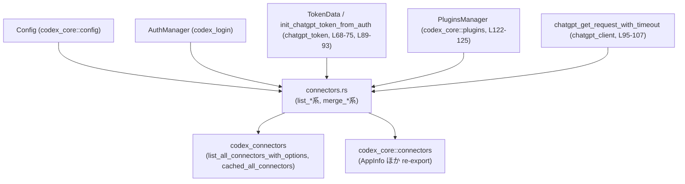
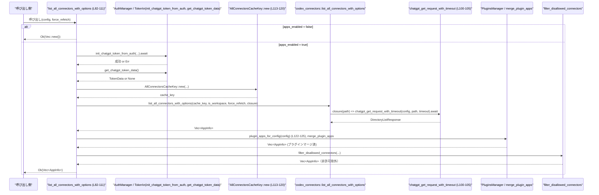

# chatgpt/src/connectors.rs コード解説

## 0. ざっくり一言

- ChatGPT アカウント／トークン情報とローカルのプラグイン設定を元に、「利用可能なコネクタ一覧」を取得・キャッシュ・フィルタリングするためのラッパーモジュールです。
- 外部クレート（`codex_core`, `codex_connectors`, `codex_login`）にあるコア機能を非同期で組み合わせ、アプリ有効状態やアクセス可否を反映した `AppInfo` の一覧を返します。

---

## 1. このモジュールの役割

### 1.1 概要

- このモジュールは **ChatGPT コネクタ／アプリ情報の一覧を取得・統合する問題** を解決するために存在し、次の機能を提供します。
  - ChatGPT 認証状態・機能フラグに応じてアプリ機能が有効か判定する（`apps_enabled`）[chatgpt/src/connectors.rs:L30-40]。
  - ChatGPT ディレクトリ API＋ローカルプラグイン設定から、利用可能なコネクタ一覧を取得する（`list_connectors`, `list_all_connectors[_with_options]`）[L41-61, L82-111]。
  - キャッシュ済みの全コネクタ一覧をトークン情報に基づくキーで取得する（`list_cached_all_connectors`, `all_connectors_cache_key`）[L63-80, L113-120]。
  - ローカルプラグイン由来のコネクタをマージしたり、特定プラグインだけを抽出する（`plugin_apps_for_config`, `connectors_for_plugin_apps`）[L122-141]。
  - 「全コネクタ」と「アクセス可能なコネクタ」を統合しつつ、非許可コネクタをフィルタする（`merge_connectors_with_accessible`）[L143-162]。

### 1.2 アーキテクチャ内での位置づけ

このファイルは「ChatGPT クライアント層」と「コネクタ管理層」をつなぐ役割を持ちます。外部クレートとの依存関係は以下の通りです。



- 呼び出し側は主にこのモジュールの `list_connectors`, `list_all_connectors_with_options` などを使用し、内部で `codex_connectors` や ChatGPT HTTP クライアントを経由して実データを取得します。

### 1.3 設計上のポイント

- **責務の分割**
  - 認証状態の確認（`apps_enabled`）[L30-40]、キャッシュキー生成（`all_connectors_cache_key`）[L113-120]、プラグインアプリ一覧の取得（`plugin_apps_for_config`）[L122-125] など、関心ごとごとにヘルパー関数に分割されています。
- **状態管理**
  - このモジュール自体は状態を持たず、すべての関数は引数（`&Config`、`TokenData` 等）から状態を受け取り、`Vec<AppInfo>` を返す純粋な処理になっています。
- **非同期・並行性**
  - `list_connectors` は `tokio::join!` で「全コネクタ一覧」と「アクセス可能コネクタ一覧」を並行取得します [L45-48]。
  - 外部 HTTP 呼び出しは `chatgpt_get_request_with_timeout` の async クロージャ経由で行われます [L95-107]。
- **エラーハンドリング**
  - ネットワークやトークン取得に起因するエラーは `anyhow::Result` で上位に伝播します（`list_connectors`, `list_all_connectors_with_options` など）。
  - キャッシュ取得系（`list_cached_all_connectors`）は「エラー」を `Option` の `None` として表現し、呼び出し側に「キャッシュが利用できない」ことを伝えます [L63-80]。
- **フィルタリングとセキュリティ**
  - `filter_disallowed_connectors` を経由して、特定のプレフィックス（`connector_openai_` など）や特定 ID のコネクタを除外する仕様がテストから読み取れます [L189-227]。

---

## 2. 主要な機能一覧

- コネクタ一覧取得: ChatGPT ディレクトリ＋MCPツール＋プラグインアプリを統合した `AppInfo` 一覧を返す（`list_connectors`）[L41-57]。
- 全コネクタ取得（キャッシュ考慮）: ChatGPT トークンに紐づく全コネクタ一覧を取得し、キャッシュ・再取得オプションを扱う（`list_all_connectors_with_options`, `list_all_connectors`, `list_cached_all_connectors`）[L59-61, L63-80, L82-111]。
- プラグインアプリの統合: ローカルプラグイン設定を読み取り、それに対応するアプリをコネクタ一覧にマージする（`plugin_apps_for_config`, `connectors_for_plugin_apps`）[L122-141]。
- アクセス可能コネクタとのマージ: 「全コネクタ」と「アクセス可能なコネクタ」を状況（全件ロード済みかどうか）に応じてマージし、非許可コネクタを除外する（`merge_connectors_with_accessible`）[L143-162]。
- 付随ユーティリティ／再エクスポート:
  - `AppInfo`, `connector_display_label`, `list_accessible_connectors_from_mcp_tools` などを再エクスポートし、呼び出し側から透過的に利用できるようにします [L15-24].

---

## 3. 公開 API と詳細解説

### 3.0 コンポーネントインベントリー（関数・定数一覧）

| 種別 | 名前 | 公開? | 概要 | 定義位置 |
|------|------|-------|------|----------|
| const | `DIRECTORY_CONNECTORS_TIMEOUT: Duration` | 非公開 | ChatGPT ディレクトリ API 呼び出しのタイムアウト（60秒） [L28] | chatgpt/src/connectors.rs:L28-28 |
| 関数 | `async fn apps_enabled(config: &Config) -> bool` | 非公開 | 認証情報と設定に基づき、アプリ機能が有効かどうかを判定 [L30-40] | chatgpt/src/connectors.rs:L30-40 |
| 関数 | `pub async fn list_connectors(config: &Config) -> anyhow::Result<Vec<AppInfo>>` | 公開 | 全コネクタ＋アクセス可能コネクタを並行取得し、マージして返す [L41-57] | chatgpt/src/connectors.rs:L41-57 |
| 関数 | `pub async fn list_all_connectors(config: &Config) -> anyhow::Result<Vec<AppInfo>>` | 公開 | `force_refetch=false` で `list_all_connectors_with_options` を呼ぶ薄いラッパー [L59-61] | chatgpt/src/connectors.rs:L59-61 |
| 関数 | `pub async fn list_cached_all_connectors(config: &Config) -> Option<Vec<AppInfo>>` | 公開 | トークンに紐づく全コネクタ一覧をキャッシュから取得し、プラグインアプリをマージ [L63-80] | chatgpt/src/connectors.rs:L63-80 |
| 関数 | `pub async fn list_all_connectors_with_options(config: &Config, force_refetch: bool) -> anyhow::Result<Vec<AppInfo>>` | 公開 | トークン初期化→キャッシュキー生成→HTTP 経由で全コネクタ一覧取得→プラグインマージ→フィルタ [L82-111] | chatgpt/src/connectors.rs:L82-111 |
| 関数 | `fn all_connectors_cache_key(config: &Config, token_data: &TokenData) -> AllConnectorsCacheKey` | 非公開 | ChatGPT ベースURL・アカウントIDなどからキャッシュキーを生成 [L113-120] | chatgpt/src/connectors.rs:L113-120 |
| 関数 | `fn plugin_apps_for_config(config: &Config) -> Vec<AppConnectorId>` | 非公開 | `PluginsManager` から設定に合致する「有効なアプリ」一覧を取得 [L122-125] | chatgpt/src/connectors.rs:L122-125 |
| 関数 | `pub fn connectors_for_plugin_apps(connectors: Vec<AppInfo>, plugin_apps: &[AppConnectorId]) -> Vec<AppInfo>` | 公開 | 全コネクタ＋プラグインアプリをマージし、「指定されたプラグインIDのみ」抽出 [L128-141] | chatgpt/src/connectors.rs:L128-141 |
| 関数 | `pub fn merge_connectors_with_accessible(connectors: Vec<AppInfo>, accessible_connectors: Vec<AppInfo>, all_connectors_loaded: bool) -> Vec<AppInfo>` | 公開 | 全コネクタとアクセス可能コネクタをマージし、非許可コネクタを削除 [L143-162] | chatgpt/src/connectors.rs:L143-162 |
| 再エクスポート | `pub use codex_core::connectors::AppInfo` | 公開 | コネクタ／アプリ情報を表す構造体（本ファイルでは定義なし） [L15] | chatgpt/src/connectors.rs:L15-15 |
| 再エクスポート | `pub use codex_core::connectors::connector_display_label` | 公開 | コネクタ表示ラベル生成ユーティリティ（実装は外部） [L16] | chatgpt/src/connectors.rs:L16-16 |
| 再エクスポート | `pub use codex_core::connectors::list_accessible_connectors_from_mcp_tools` | 公開 | MCP ツールからアクセス可能コネクタ一覧を取得（実装は外部） [L18] | chatgpt/src/connectors.rs:L18-18 |
| 再エクスポート | `pub use codex_core::connectors::list_accessible_connectors_from_mcp_tools_with_options` | 公開 | 上記のオプションつき版（実装は外部） [L19] | chatgpt/src/connectors.rs:L19-19 |
| 再エクスポート | `pub use codex_core::connectors::list_accessible_connectors_from_mcp_tools_with_options_and_status` | 公開 | 上記＋ステータス情報（実装は外部） [L20] | chatgpt/src/connectors.rs:L20-20 |
| 再エクスポート | `pub use codex_core::connectors::list_cached_accessible_connectors_from_mcp_tools` | 公開 | アクセス可能コネクタ一覧のキャッシュ取得（実装は外部） [L21] | chatgpt/src/connectors.rs:L21-21 |
| 再エクスポート | `pub use codex_core::connectors::with_app_enabled_state` | 公開 | `AppInfo` に「有効かどうか」の状態を付与するヘルパー（実装は外部） [L24] | chatgpt/src/connectors.rs:L24-24 |

以降では、この中から重要な関数をピックアップして詳細に解説します。

---

### 3.1 型一覧（構造体・列挙体など）

このファイルで新規定義されている公開型はありませんが、以下の外部型を主要な依存として利用します。

| 名前 | 種別 | 役割 / 用途 | 根拠 |
|------|------|-------------|------|
| `AppInfo` | 構造体（外部） | コネクタ／アプリの ID, 名前, アクセス可否 `is_accessible`, 有効状態 `is_enabled` などを保持。テストコードからフィールドが確認できます [L171-187, L229-245]。 | chatgpt/src/connectors.rs:L171-187, L229-245 |
| `AllConnectorsCacheKey` | 構造体（外部） | 全コネクタ一覧のキャッシュキー。ChatGPT ベースURL・account_id・user_id・workspace フラグで生成されています [L113-120]。 | chatgpt/src/connectors.rs:L113-120 |
| `TokenData` | 構造体（外部） | ChatGPT トークン関連情報。`account_id`, `id_token.chatgpt_user_id`, `id_token.is_workspace_account()` を保持 [L116-118, L97-98]。 | chatgpt/src/connectors.rs:L116-118, L97-98 |
| `AppConnectorId` | 構造体（外部） | プラグインアプリの識別子。`0` 番目のフィールドとして ID 文字列を持つ（`.0.as_str()` から判断）[L132-135, L168-168]。 | chatgpt/src/connectors.rs:L132-135, L168-168 |
| `Config` | 構造体（外部） | アプリ全体の設定。`codex_home`, `cli_auth_credentials_store_mode`, `chatgpt_base_url`, `features` を保持 [L31-35, L89-89, L115-115, L37-39]。 | chatgpt/src/connectors.rs:L31-35, L37-39, L89-89, L115-115 |

---

### 3.2 関数詳細（主要 7 件）

#### `async fn apps_enabled(config: &Config) -> bool`

**概要**

- 現在の認証情報と `Config` の機能フラグから、「アプリ機能が有効かどうか」を判定します [L30-40]。
- この判定結果は各種 `list_*` 関数の早期リターン条件として使われます [L42-44, L64-66, L86-88]。

**引数**

| 引数名 | 型 | 説明 |
|--------|----|------|
| `config` | `&Config` | 認証ストアモード・Codex ホームディレクトリ・機能フラグを含む設定 [L31-35, L37-39]。 |

**戻り値**

- `bool`  
  - `true`: アプリ機能が有効。`features.apps_enabled_for_auth(...)` が真を返した場合 [L37-39]。
  - `false`: 無効。ChatGPT 認証が無い、もしくは機能フラグが無効な場合。

**内部処理の流れ**

1. `AuthManager::shared` を用いて、共有の `AuthManager` インスタンスを取得します [L31-35]（認証ストアモードは `config.cli_auth_credentials_store_mode`）。
2. `auth_manager.auth().await` で現在の認証情報を取得します [L36]。
3. `auth.as_ref().is_some_and(CodexAuth::is_chatgpt_auth)` で「ChatGPT 認証であるか」を判定します [L39]。
4. `config.features.apps_enabled_for_auth(...)` に上記の判定結果を渡し、最終的な bool 値を返します [L37-39]。

**Examples（使用例）**

```rust
// config: &Config がすでに用意されている前提
let enabled = apps_enabled(config).await; // ChatGPT 認証と機能フラグに基づいて判定
if !enabled {
    // アプリ機能が無効なので何もしない、など
}
```

※ `apps_enabled` は非公開関数ですが、他の公開 API の挙動を理解する上で重要です。

**Errors / Panics**

- この関数自体は `Result` を返さず、エラーは発生しません。
- `AuthManager::shared` または `auth()` 内部でのエラー処理はこのチャンクからは分かりません（実装は `codex_login` 側）。

**Edge cases（エッジケース）**

- 認証情報が存在しない場合: `auth` は `None` となり、`apps_enabled` は `false` を返します [L36, L39]。
- ChatGPT 以外の認証の場合: `CodexAuth::is_chatgpt_auth` が `false` を返すため、`apps_enabled` は `false` となります [L39]。

**使用上の注意点**

- 非公開ですが、公開関数の `list_*` はすべてこの結果に依存して動作します。そのため、「アプリ機能が無効なときは空の一覧を返す（または `None`）」という振る舞いを前提に設計されています [L42-44, L64-66, L86-88]。

---

#### `pub async fn list_connectors(config: &Config) -> anyhow::Result<Vec<AppInfo>>`

**概要**

- アプリ機能が有効な場合に、全コネクタ一覧と「MCP ツール経由でアクセス可能なコネクタ」を並行して取得し、それらをマージした上で有効状態を付与して返します [L41-57]。

**引数**

| 引数名 | 型 | 説明 |
|--------|----|------|
| `config` | `&Config` | 認証や ChatGPT ベースURL、プラグイン設定などを含むアプリ設定。 |

**戻り値**

- `anyhow::Result<Vec<AppInfo>>`
  - `Ok(Vec<AppInfo>)`: マージ済みのコネクタ一覧。非許可コネクタは内部でフィルタされます（`merge_connectors_with_accessible` 内および `with_app_enabled_state` の前段）[L52-56, L143-162]。
  - `Err(_)`: 認証／HTTP 通信／外部関数呼び出しの失敗など。具体的なエラー種別は `anyhow` によるラップのためこのチャンクからは分かりません。

**内部処理の流れ**

1. `apps_enabled(config).await` を呼び出し、アプリ機能が無効な場合は空ベクタを返して終了します [L42-44]。
2. `tokio::join!` で以下の2つを並行に実行します [L45-48]。
   - `list_all_connectors(config)` [L46]（全コネクタ一覧）
   - `list_accessible_connectors_from_mcp_tools(config)` [L47]（MCPツールからアクセス可能なコネクタ一覧、外部実装）
3. それぞれの `Result` から `?` で中身を取り出し、エラーがあれば呼び出し元へ伝播します [L49-50]。
4. `merge_connectors_with_accessible(connectors, accessible, true)` を呼び出し、「全コネクタ」と「アクセス可能コネクタ」をマージしつつ非許可コネクタをフィルタします [L51-54, L143-162]。
5. `with_app_enabled_state(..., config)` を呼び出し、各 `AppInfo` に有効状態を付与した上で返します [L51-56]。

**Examples（使用例）**

```rust
// 非同期コンテキスト内（tokio ランタイム上など）
async fn show_connectors(config: &Config) -> anyhow::Result<()> {
    let connectors = list_connectors(config).await?; // 全＋アクセス可能コネクタを取得 [L41-57]
    for app in connectors {
        println!("id={} name={}", app.id, app.name); // AppInfo の利用（re-export, L15）
    }
    Ok(())
}
```

**Errors / Panics**

- `apps_enabled` が `false` の場合は、エラーではなく `Ok(Vec::new())` を返します [L42-44]。
- `list_all_connectors` または `list_accessible_connectors_from_mcp_tools` がエラーを返すと、そのまま `Err` として上位に伝播します [L49-50]。
- `panic` を起こしうるコードは、この関数内には見当たりません。

**Edge cases（エッジケース）**

- 認証がない／アプリ機能が無効: 常に空リストを返し、ネットワーク呼び出しも行いません [L42-44]。
- 片方のみエラー: `tokio::join!` で並行実行されますが、どちらか一方が `Err` になると `?` で即座に関数が `Err` で終了します [L45-50]。
- 「全コネクタ」には存在しないが「アクセス可能」には存在する ID:
  - `merge_connectors_with_accessible` に `all_connectors_loaded=true` を渡しており、その場合は「全コネクタに存在しないもの」は除外されます [L51-54, L148-157, L247-255]。

**使用上の注意点**

- 非同期関数なので、Tokio などの async ランタイム上で `.await` を付けて呼び出す必要があります。
- 返ってくる `AppInfo` は `filter_disallowed_connectors` を通過しており、特定 ID（`connector_openai_*` など）は除外されます。これはテストから確認できますが、フィルタの詳細実装は外部です [L189-227]。

---

#### `pub async fn list_all_connectors(config: &Config) -> anyhow::Result<Vec<AppInfo>>`

**概要**

- `list_all_connectors_with_options(config, false)` を呼び出すだけのラッパーで、デフォルトではキャッシュを尊重しつつ全コネクタ一覧を取得します [L59-61]。

**引数**

| 引数名 | 型 | 説明 |
|--------|----|------|
| `config` | `&Config` | アプリ設定。 |

**戻り値**

- `anyhow::Result<Vec<AppInfo>>`  
  `list_all_connectors_with_options` と同じです。

**内部処理の流れ**

1. `list_all_connectors_with_options(config, false)` をそのまま呼び出し、結果を返します [L60]。

**Examples（使用例）**

```rust
let all = list_all_connectors(config).await?; // キャッシュを使いつつ全コネクタを取得 [L59-61]
```

**Errors / Panics**

- エラー条件は `list_all_connectors_with_options` と同じです（そちらを参照）。

**Edge cases / 使用上の注意点**

- `force_refetch` を制御したい場合は、こちらではなく `list_all_connectors_with_options` を直接呼び出す必要があります [L82-111]。

---

#### `pub async fn list_cached_all_connectors(config: &Config) -> Option<Vec<AppInfo>>`

**概要**

- 認証および ChatGPT トークンが利用可能な場合に、キャッシュされた「全コネクタ一覧」を取得し、プラグインアプリをマージした上で返します [L63-80]。
- エラーやトークン未取得などでキャッシュが利用できない場合は `None` を返します。

**引数**

| 引数名 | 型 | 説明 |
|--------|----|------|
| `config` | `&Config` | アプリ設定。トークン初期化・プラグイン設定取得に利用されます。 |

**戻り値**

- `Option<Vec<AppInfo>>`
  - `Some(Vec::new())`: アプリ機能が無効な場合（空リスト）。※このケースは「キャッシュ利用不可」ではなく、「アプリ機能が無効」 [L64-66]。
  - `Some(connectors)`: キャッシュから取得したコネクタ一覧にプラグインアプリをマージし、フィルタを適用したもの [L74-79]。
  - `None`: トークン初期化失敗・トークンデータ取得失敗・キャッシュ未ヒットなどで、有効なキャッシュ結果が得られなかった場合 [L68-73, L74-75, L76-79]。

**内部処理の流れ**

1. `apps_enabled(config).await` が `false` の場合、`Some(Vec::new())` を返します [L64-66]。
2. `init_chatgpt_token_from_auth(&config.codex_home, config.cli_auth_credentials_store_mode).await` を実行し、トークン初期化を試みます [L68-70]。
   - ここで `Err` が返った場合、`None` を返して終了します [L68-73]。
3. `get_chatgpt_token_data()?` でトークンデータを取得します [L74]。
   - `get_chatgpt_token_data` は `Option<TokenData>` を返すと推測され、`?` により `None` の場合は `list_cached_all_connectors` 自体も `None` を返します（型からの推論; 実装は外部）。
4. `all_connectors_cache_key(config, &token_data)` からキャッシュキーを生成します [L75]。
5. `codex_connectors::cached_all_connectors(&cache_key)` を呼び出し、キャッシュされたコネクタ一覧を取得します [L76]。
   - `Option<Vec<AppInfo>>` が返ると推定されますが、実装は外部です。
6. `map` で `connectors` に対してプラグインアプリをマージし、`filter_disallowed_connectors` で非許可コネクタを除外した結果を `Some(...)` として返します [L76-79]。

**Examples（使用例）**

```rust
if let Some(connectors) = list_cached_all_connectors(config).await {
    // キャッシュがある（またはアプリ機能が無効で空リスト）ケース
    println!("cached connectors: {}", connectors.len());
} else {
    // キャッシュが使えないケース: トークン未取得や初期化エラーなど [L68-75]
}
```

**Errors / Panics**

- この関数は `Result` ではなく `Option` を返します。
  - トークン初期化失敗 (`init_chatgpt_token_from_auth` が `Err`) → `None` [L68-73]。
  - トークンデータ不在 (`get_chatgpt_token_data` が `None` を返すケース) → `None` [L74]。
- `panic` を起こしうるコードは見当たりません。

**Edge cases（エッジケース）**

- アプリ機能が無効 (`apps_enabled == false`): `Some(Vec::new())` を返すため、「キャッシュが使えない」のと `None` で区別されます [L64-66]。
- キャッシュミス: `cached_all_connectors` の戻り値が `None` の場合、そのまま `None` を返します [L76-79]。
- トークン初期化に失敗した場合: キャッシュの有無に関わらず `None` を返します [L68-73]。

**使用上の注意点**

- `None` は「アプリ機能が無効」ではなく、「キャッシュが利用できない / トークン未取得」を意味します。空リストかどうかは `Some(vec).is_empty()` で判断する必要があります。
- ネットワーク呼び出しは行わないため、低コストで「手元にある情報だけで」一覧を得たい場合に有用です。

---

#### `pub async fn list_all_connectors_with_options(config: &Config, force_refetch: bool) -> anyhow::Result<Vec<AppInfo>>`

**概要**

- ChatGPT トークンを初期化・取得し、`AllConnectorsCacheKey` に基づいたキャッシュと HTTP 呼び出しを組み合わせて全コネクタ一覧を取得します [L82-111]。
- プラグインアプリをマージし、非許可コネクタをフィルタした上で結果を返します。

**引数**

| 引数名 | 型 | 説明 |
|--------|----|------|
| `config` | `&Config` | ChatGPT ベースURL・ホームディレクトリ・認証ストアモードなどを含む設定。 |
| `force_refetch` | `bool` | `true` の場合、キャッシュを無視して再取得することを指示するフラグ（詳細挙動は `codex_connectors::list_all_connectors_with_options` 側の実装に依存） [L95-99]。 |

**戻り値**

- `anyhow::Result<Vec<AppInfo>>`
  - `Ok(Vec<AppInfo>)`: HTTP などの処理が成功し、プラグインアプリをマージした上で非許可コネクタを除外した一覧。
  - `Err(_)`: トークン初期化・トークン取得・HTTP 呼び出し・外部関数のエラー。

**内部処理の流れ**

1. `apps_enabled(config).await` が `false` のときは `Ok(Vec::new())` を返します [L86-88]。
2. `init_chatgpt_token_from_auth(&config.codex_home, config.cli_auth_credentials_store_mode).await?` でトークン初期化を行い、エラー時は `Err` を返します [L89-90]。
3. `get_chatgpt_token_data().ok_or_else(|| anyhow::anyhow!("ChatGPT token not available"))?` でトークンデータを取得します [L92-93]。
   - `None` の場合は `"ChatGPT token not available"` というメッセージ付きの `Err` を返します。
4. `all_connectors_cache_key(config, &token_data)` でキャッシュキーを生成します [L94]。
5. `codex_connectors::list_all_connectors_with_options(...)` を呼び出します [L95-107]。
   - 引数にはキャッシュキー [L95-97]、`token_data.id_token.is_workspace_account()` [L97-98]、`force_refetch` [L98] と、HTTP GET を行う async クロージャ [L99-106] を渡します。
   - クロージャ内部では `chatgpt_get_request_with_timeout::<DirectoryListResponse>(config, path, Some(DIRECTORY_CONNECTORS_TIMEOUT)).await` を呼び出し、ディレクトリ API からデータを取得します [L100-105]。
6. 取得した `connectors` に対してプラグインアプリをマージ (`merge_plugin_apps`) し [L109-109]、`filter_disallowed_connectors` で非許可コネクタを除外します [L110-110]。
7. 最終的な `Vec<AppInfo>` を `Ok(...)` として返します [L110-111]。

**Examples（使用例）**

```rust
// 強制リフレッシュ付きで全コネクタを取得
let connectors = list_all_connectors_with_options(config, true).await?;

// キャッシュを尊重
let cached_or_fetched = list_all_connectors_with_options(config, false).await?;
```

**Errors / Panics**

- アプリ機能が無効: `Ok(Vec::new())` を返します [L86-88]。
- トークン初期化失敗（`init_chatgpt_token_from_auth` が `Err`）: そのまま `Err` を返します [L89-90]。
- トークンデータ不在（`get_chatgpt_token_data` が `None`）: `"ChatGPT token not available"` の `anyhow::Error` を返します [L92-93]。
- `codex_connectors::list_all_connectors_with_options` 内部や `chatgpt_get_request_with_timeout` 内部で発生したエラーも `?` により上位に伝播します [L95-108]。
- `panic` を直接起こすコードはありません。

**Edge cases（エッジケース）**

- Workspace アカウントかどうかで挙動が変わる可能性があります（`token_data.id_token.is_workspace_account()` を引数に渡しているため）[L97-98]。
- ベースURL・account_id・user_id が異なるとキャッシュキーも変わるため、アカウント／ユーザー毎に異なるキャッシュが利用されます [L113-118]。

**使用上の注意点**

- ネットワークと I/O を伴うため、頻繁に（短い間隔で）呼び出すとパフォーマンスに影響する可能性があります。キャッシュを尊重したい場合は `force_refetch=false` を使用するか、`list_cached_all_connectors` と併用するのが適切です。
- 非同期関数なので async ランタイムが必要です。

---

#### `fn all_connectors_cache_key(config: &Config, token_data: &TokenData) -> AllConnectorsCacheKey`

**概要**

- ChatGPT ベース URL・アカウント ID・ユーザー ID・workspace フラグを組み合わせて、全コネクタ一覧用のキャッシュキーを生成します [L113-120]。

**引数**

| 引数名 | 型 | 説明 |
|--------|----|------|
| `config` | `&Config` | `chatgpt_base_url` を利用します [L115]。 |
| `token_data` | `&TokenData` | `account_id`, `id_token.chatgpt_user_id`, `id_token.is_workspace_account()` を利用します [L116-118]。 |

**戻り値**

- `AllConnectorsCacheKey`  
  ChatGPT の URL・アカウント・ユーザー・workspace 状態の組み合わせに固有のキー。

**内部処理の流れ**

1. `AllConnectorsCacheKey::new` に必要なフィールドを渡して新しいキーを構築します [L114-119]。

**使用上の注意点**

- この関数は非公開であり、キャッシュのスコープ（どの粒度で分かれるか）を理解するためにのみ重要です。

---

#### `fn plugin_apps_for_config(config: &Config) -> Vec<AppConnectorId>`

**概要**

- ローカルプラグイン設定（恐らく設定ファイルやディレクトリ）から、現在の `Config` に有効なアプリコネクタ ID 一覧を取得します [L122-125]。

**内部処理の流れ**

1. `PluginsManager::new(config.codex_home.clone())` でプラグインマネージャを初期化します [L123]。
2. `plugins_for_config(config)` を呼んで `Config` に適用されるプラグイン情報を取得します [L124]。
3. `effective_apps()` を呼び出し、有効なアプリコネクタ ID 一覧を返します [L125]。

**使用上の注意点**

- 実際のフィルタ条件や設定フォーマットはこのチャンクには現れません。`PluginsManager` の実装に依存します。

---

#### `pub fn connectors_for_plugin_apps(connectors: Vec<AppInfo>, plugin_apps: &[AppConnectorId]) -> Vec<AppInfo>`

**概要**

- 既存の `connectors` と追加の `plugin_apps` をマージし、さらに「`plugin_apps` に含まれる ID のみ」を残すフィルタ処理を行います [L128-141]。
- 結果は `filter_disallowed_connectors` によって非許可コネクタも除外されています [L137-140]。

**引数**

| 引数名 | 型 | 説明 |
|--------|----|------|
| `connectors` | `Vec<AppInfo>` | すでに取得済みのコネクタ一覧。 |
| `plugin_apps` | `&[AppConnectorId]` | プラグインアプリとして追加したいコネクタ ID 一覧。 |

**戻り値**

- `Vec<AppInfo>`  
  - `connectors` と `plugin_apps` を `merge_plugin_apps` でマージし、`plugin_apps` に含まれる ID かつ許可されたコネクタのみを抽出した一覧 [L132-140]。

**内部処理の流れ**

1. `plugin_apps` から ID 文字列の `HashSet<&str>` を構築します [L132-135]。
2. `merge_plugin_apps(connectors, plugin_apps.to_vec())` で、既存コネクタとプラグインアプリを統合した一覧を生成します [L137]。
3. `filter_disallowed_connectors` で非許可コネクタを除外します [L137]。
4. `.into_iter().filter(|connector| plugin_app_ids.contains(connector.id.as_str()))` で「`plugin_apps` に含まれる ID かどうか」でフィルタし、`collect()` して返します [L138-140]。

**Examples（使用例）**

```rust
let base_connectors: Vec<AppInfo> = /* どこかで取得 */;
let plugin_ids = vec![
    AppConnectorId("alpha".to_string()),
    AppConnectorId("gmail".to_string()),
];

let connectors = connectors_for_plugin_apps(base_connectors, &plugin_ids);
// テストから、"alpha" は既存コネクタから、"gmail" はプラグインアプリとして生成されることが分かります [L274-285]
```

**Errors / Panics**

- `Result` ではなく `Vec` を返し、エラーを返しません。
- `HashSet` への挿入や `to_vec()` による所有権移動など、標準的な操作のみで `panic` の可能性は低いです。

**Edge cases（エッジケース）**

- `plugin_apps` の中に非許可な ID が含まれている場合: `filter_disallowed_connectors` により結果から除外されます。テスト `connectors_for_plugin_apps_filters_disallowed_plugin_apps` でこの挙動が確認できます [L288-297]。
- `connectors` に存在しないプラグイン ID: `merge_plugin_apps` により新規 `AppInfo` として追加される可能性があり、テストでは `"gmail"` のようなケースが確認できます [L274-285]。

**使用上の注意点**

- `connectors` は消費される（ムーブされる）ため、呼び出し後に元のベクタは利用できません。
- 結果には `plugin_apps` に含まれる ID のみが含まれるため、「全コネクタ＋プラグインアプリ」という一覧が欲しい場合は別途 `merge_plugin_apps` を直接使う必要があります。

---

#### `pub fn merge_connectors_with_accessible(connectors: Vec<AppInfo>, accessible_connectors: Vec<AppInfo>, all_connectors_loaded: bool) -> Vec<AppInfo>`

**概要**

- `connectors`（全コネクタ一覧）と `accessible_connectors`（アクセス可能コネクタ一覧）を統合しつつ、`all_connectors_loaded` フラグに応じて「全コネクタに存在しないアクセス可能コネクタ」を含めるかどうかを制御します [L143-162]。
- 統合後は `filter_disallowed_connectors` で非許可コネクタを除外します [L160-161]。

**引数**

| 引数名 | 型 | 説明 |
|--------|----|------|
| `connectors` | `Vec<AppInfo>` | 全コネクタ一覧。 |
| `accessible_connectors` | `Vec<AppInfo>` | アクセス可能なコネクタ一覧。 |
| `all_connectors_loaded` | `bool` | 「全コネクタ一覧が完全にロードされているか」を示すフラグ。 |

**戻り値**

- `Vec<AppInfo>`  
  - 統合・フィルタ済みのコネクタ一覧。

**内部処理の流れ**

1. `all_connectors_loaded` に応じて `accessible_connectors` を加工します [L148-159]。
   - `true` の場合:
     1. `connectors` から ID の `HashSet<&str>` を構築 [L149-152]。
     2. `accessible_connectors` 側をフィルタし、「`connectors` にも存在する ID のみ」残します [L153-156]。
   - `false` の場合:
     - `accessible_connectors` をそのまま使用します [L157-159]。
2. `merge_connectors(connectors, accessible_connectors)` を呼び出し、「全コネクタ」と「アクセス可能コネクタ」をマージします [L160]。
3. `filter_disallowed_connectors(merged)` で非許可コネクタを除外し、結果を返します [L161]。

**Examples（使用例）**

テストから振る舞いが確認できます。

```rust
// all_connectors_loaded = true の場合: "beta" は無視される [L247-255]
let merged = merge_connectors_with_accessible(
    vec![app("alpha")],
    vec![app("alpha"), app("beta")],
    true,
);

// all_connectors_loaded = false の場合: "beta" も含まれる [L257-270]
let merged_loading = merge_connectors_with_accessible(
    vec![app("alpha")],
    vec![app("alpha"), app("beta")],
    false,
);
```

**Errors / Panics**

- `Result` を返さず、標準ライブラリのコレクション操作のみのため、明示的なエラーは発生しません。
- `panic` を起こしうる操作は見当たりません。

**Edge cases（エッジケース）**

- `connectors` が空で `all_connectors_loaded=true` の場合: すべての `accessible_connectors` がフィルタで除外され、空リストになる可能性があります [L149-156]。
- `all_connectors_loaded=false` の場合: 「全コネクタにはまだ現れていないが、アクセス可能なコネクタ」を一時的に含め続けることができます [L157-159, L257-270]。

**使用上の注意点**

- `all_connectors_loaded` の意味はテスト名から「全件ロードが完了しているか」を示していると解釈できますが、詳細なライフサイクルはこのチャンクからは分かりません。
- 結果は `filter_disallowed_connectors` を通るため、アクセス可能であっても非許可 ID は除外されます [L160-161, L189-227]。

---

### 3.3 その他の関数

| 関数名 | 役割（1 行） | 定義位置 |
|--------|--------------|----------|
| `fn app(id: &str) -> AppInfo` | テスト用ヘルパー。最小限のフィールドを埋めた `AppInfo` を生成 [L171-187]。 | chatgpt/src/connectors.rs:L171-187 |
| `fn merged_app(id: &str, is_accessible: bool) -> AppInfo` | テスト用ヘルパー。`install_url` や `is_accessible` を設定した `AppInfo` を生成 [L229-245]。 | chatgpt/src/connectors.rs:L229-245 |

---

## 4. データフロー

ここでは、`list_all_connectors_with_options` を呼び出して「全コネクタ一覧」を取得する典型的な処理フローを整理します。

### 4.1 処理の要点

1. 呼び出し側が `list_all_connectors_with_options` を async コンテキストで呼び出す [L82-111]。
2. 関数内部でアプリ機能の有効性と ChatGPT トークンを確認し、キャッシュキーを生成します [L86-94, L113-120]。
3. `codex_connectors::list_all_connectors_with_options` に対し、HTTP GET を行う async クロージャを渡します [L95-107]。
4. 取得した一覧にプラグインアプリをマージし、非許可コネクタを除外して返します [L109-110]。

### 4.2 シーケンス図



---

## 5. 使い方（How to Use）

### 5.1 基本的な使用方法

`Config` がある前提で、利用可能なコネクタ一覧を取得して表示する例です。

```rust
use chatgpt::connectors::{list_connectors, AppInfo}; // AppInfo は re-export [L15]

// 非同期エントリポイント（Tokio ランタイム）
#[tokio::main]
async fn main() -> anyhow::Result<()> {
    let config = load_config_somehow(); // Config を用意する（詳細は別モジュール）

    // アプリ機能が有効なら、全＋アクセス可能コネクタを取得 [L41-57]
    let connectors: Vec<AppInfo> = list_connectors(&config).await?;

    for app in connectors {
        println!("{} ({})", app.name, app.id);
    }

    Ok(())
}
```

### 5.2 よくある使用パターン

1. **キャッシュ優先で一覧を取得し、必要に応じて再取得**

```rust
async fn get_connectors_with_cache(config: &Config) -> anyhow::Result<Vec<AppInfo>> {
    if let Some(cached) = list_cached_all_connectors(config).await {
        if !cached.is_empty() {
            // キャッシュが利用できた＆少なくとも1件ある [L63-80]
            return Ok(cached);
        }
    }
    // キャッシュが無い or 空なので再取得 [L82-111]
    list_all_connectors_with_options(config, /*force_refetch*/ true).await
}
```

1. **特定プラグインアプリだけを抽出**

```rust
fn only_plugin_apps(
    all_connectors: Vec<AppInfo>,
    wanted: &[AppConnectorId],
) -> Vec<AppInfo> {
    connectors_for_plugin_apps(all_connectors, wanted) // [L128-141]
}
```

1. **アクセス可能状態を考慮した UI 向け一覧**

- `list_connectors` は「全コネクタ＋アクセス可能コネクタ」をマージし、`with_app_enabled_state` で有効状態を反映します [L41-56]。
- UI では、この一覧を元に「インストール済み」「インストール可能」などを表示できます。

### 5.3 よくある間違い

```rust
// 間違い例: list_cached_all_connectors の None を「空リスト」と誤解する
let connectors = list_cached_all_connectors(config).await.unwrap_or_default();
// これだと「キャッシュが利用できない（トークン未取得など）」ケースと
// 「アプリ機能が無効で空リスト」ケースを区別できない [L64-66, L68-75]

// 正しい例: None を明示的に扱い、意味を区別する
let connectors = match list_cached_all_connectors(config).await {
    Some(list) => list,         // キャッシュ利用成功 or アプリ無効
    None => {
        // キャッシュ利用不可 → ネットワークを伴う取得を行う [L63-80]
        list_all_connectors_with_options(config, false).await?
    }
};
```

```rust
// 間違い例: 非同期関数を同期コンテキストで直接呼び出す
// let connectors = list_connectors(&config); // .await が無くコンパイルエラー [L41-57]

// 正しい例: async コンテキストで .await をつけて呼ぶ
let connectors = list_connectors(&config).await?;
```

### 5.4 使用上の注意点（まとめ）

- **非同期処理**
  - `list_connectors`, `list_all_connectors`, `list_cached_all_connectors`, `list_all_connectors_with_options` はすべて async 関数です [L30-40, L41-61, L63-80, L82-111]。
  - Tokio などの async ランタイム上で `.await` する必要があります。
- **エラーと Option の使い分け**
  - 「機能無効／空一覧」は `Ok(Vec::new())` や `Some(Vec::new())` で表現されます [L42-44, L64-66, L86-88]。
  - 「トークン初期化失敗／キャッシュが利用できない」は `Err(...)` または `None` で表現されます [L68-75, L89-93]。
- **フィルタリング**
  - すべての統合処理の最後で `filter_disallowed_connectors` が呼び出され、特定 ID（`connector_openai_*` 等）やブラックリスト ID が除外されます [L76-79, L160-161, テスト L189-227]。
- **並行性**
  - `list_connectors` は `tokio::join!` を用いて2つの非同期処理を並行実行するため、`Config` は少なくともスレッドセーフに（少なくとも不変データとして）共有される前提になっています [L45-48]。

---

## 6. 変更の仕方（How to Modify）

### 6.1 新しい機能を追加する場合

例: 「特定のラベルやカテゴリでフィルタしたコネクタ一覧」を追加したい場合。

1. **入口関数の追加**
   - 本ファイルに `pub async fn list_connectors_with_label(config: &Config, label: &str) -> anyhow::Result<Vec<AppInfo>>` のような関数を追加します。
   - 既存の `list_connectors` もしくは `list_all_connectors_with_options` を内部で呼び出し、返ってきた `Vec<AppInfo>` をラベルでフィルタする形にすると影響範囲が限定されます。

2. **プラグイン/キャッシュとの整合**
   - 追加する関数でも、`apps_enabled` による機能フラグチェックを統一的に使うと、既存 API と挙動が揃います [L30-40]。
   - キャッシュを活用する場合は `all_connectors_cache_key` を用いるのが自然です [L113-120]。

3. **テストの追加**
   - `#[cfg(test)] mod tests` 内に、新しい挙動を確認するテスト関数を追加します。
   - 既存のテスト（`merge_connectors_with_accessible_*`, `connectors_for_plugin_apps_*`）のスタイルに倣うと一貫性が保てます [L189-227, L247-270, L274-297]。

### 6.2 既存の機能を変更する場合

- **影響範囲の確認**
  - `list_connectors` や `list_all_connectors_with_options` は外部から直接呼ばれる公開 API であり、変更は広範囲に影響する可能性があります [L41-57, L82-111]。
  - 再エクスポートしている `list_accessible_connectors_from_mcp_tools` などのシグネチャを変更すると、他モジュールからの呼び出しにも影響します [L18-21]。

- **契約（前提条件・返り値の意味）**
  - `apps_enabled == false` の場合に「空リスト／空の `Some` を返す」という契約は、複数関数で共通になっています [L42-44, L64-66, L86-88]。
  - これを変更する場合は、呼び出し側の期待もすべて確認する必要があります。

- **関連テストの確認**
  - `filter_disallowed_connectors` の挙動はテストで明示されているため（特定 ID の除外や許可）[L189-227]、この関数の呼び出し方や順序を変える場合はテストの期待値も見直す必要があります。
  - `merge_connectors_with_accessible` の `all_connectors_loaded` フラグの意味もテストに依存しているため [L247-270]、ロジック変更時はテストの修正 or 追加が必須です。

---

## 7. 関連ファイル

| パス | 役割 / 関係 |
|------|------------|
| `codex_core::config` | `Config` 型を提供し、本モジュールのすべての公開関数の入力として利用されます [L1, L30-40, L41-61, L63-80, L82-125]。 |
| `codex_core::connectors` | `AppInfo` や `connector_display_label` など、コネクタのコアデータ構造とユーティリティを提供し、一部は再エクスポートされています [L15-24]。 |
| `codex_core::plugins` | `AppConnectorId` および `PluginsManager` を提供し、プラグインアプリの一覧取得に使用されます [L25-26, L122-125]。 |
| `codex_login` | `AuthManager`, `CodexAuth`, `TokenData` を提供し、ChatGPT 認証状態やトークン情報の取得に利用されます [L2-4, L30-40, L113-118]。 |
| `codex_connectors` | キャッシュキー `AllConnectorsCacheKey` と、全コネクタ一覧のキャッシュ／取得ロジックを提供します [L12-13, L76, L95-95]。 |
| `crate::chatgpt_client` | ChatGPT ディレクトリ API に対する HTTP GET リクエストをラップする `chatgpt_get_request_with_timeout` を提供します [L8, L100-105]。 |
| `crate::chatgpt_token` | ChatGPT トークンの初期化 (`init_chatgpt_token_from_auth`) と取得 (`get_chatgpt_token_data`) を提供し、本モジュールのキャッシュキー生成と API 呼び出しに必須です [L9-10, L68-75, L89-93]。 |

このファイルは、これらの外部コンポーネントを組み合わせて「コネクタ一覧の高レベル API」を提供する統合ポイントとして設計されています。
