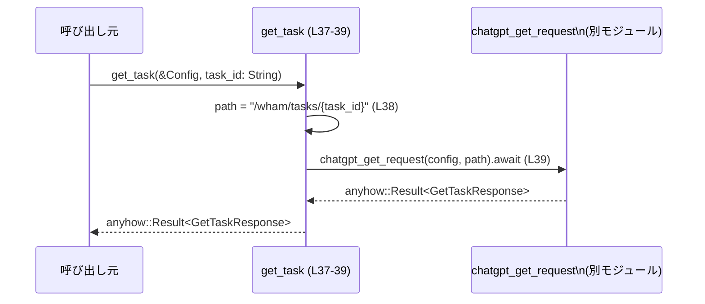

# chatgpt/src/get_task.rs コード解説

## 0. ざっくり一言

`/wham/tasks/{task_id}` というパスで外部サービスから「タスク」を取得し、そのレスポンスをデシリアライズするための最小限のデータ構造と、取得用の非同期関数 `get_task` を提供するモジュールです。

---

## 1. このモジュールの役割

### 1.1 概要

- このモジュールは、タスク取得 API のレスポンスを Rust の構造体にデシリアライズし、呼び出し側が扱いやすい形で返すことを目的としています。
- 具体的には、`GetTaskResponse` を含むいくつかの構造体／列挙体と、`chatgpt_get_request` に処理を委譲するラッパー関数 `get_task` を定義しています（`chatgpt/src/get_task.rs:L6-39`）。

### 1.2 アーキテクチャ内での位置づけ

- 設定情報 `Config`（`codex_core::config::Config`）を受け取り、同一クレート内の `chatgpt_client::chatgpt_get_request` に外部リクエスト処理を委譲しています（`chatgpt/src/get_task.rs:L1-4, L37-39`）。
- モジュール内で定義された型（`GetTaskResponse` など）は、`chatgpt_get_request` の戻り値として利用されると考えられます（`get_task` の戻り値型が `anyhow::Result<GetTaskResponse>` であることから、同じ型が内部でも使われると分かります）。

```mermaid
graph LR
    subgraph APIレスポンス型 (L6-35)
        Resp["GetTaskResponse\nAssistantTurn\nOutputItem\nPrOutputItem\nOutputDiff"]
    end

    Config["Config\n(codex_core::config)\n(L1)"]
    GetTaskFn["get_task (L37-39)"]
    ClientFn["chatgpt_get_request\n(crate::chatgpt_client)\n(定義は別ファイル)"]

    Config --> GetTaskFn
    GetTaskFn --> ClientFn
    ClientFn --> Resp
```

※ `chatgpt_get_request` の実装や、その内部でどのように `GetTaskResponse` が生成されるかは、このチャンクには現れません。

### 1.3 設計上のポイント

- **必要最小限のフィールド定義**  
  コメント `// Only relevant fields for our extraction` にある通り、レスポンスのうち「抽出に必要なフィールド」のみを構造体として定義しています（`chatgpt/src/get_task.rs:L11-15`）。
- **serde によるデシリアライズ前提**  
  すべてのレスポンス関連型に `Deserialize` が derive されており、JSON などのシリアライズ形式から自動的に変換される前提です（`chatgpt/src/get_task.rs:L6, L12, L17-18, L27, L32`）。
- **列挙体のタグ付き表現**  
  `OutputItem` は `#[serde(tag = "type")]` によりタグ付き enum として定義され、`"type"` フィールドの値に応じて `Pr` または `Other` にマッピングされます（`chatgpt/src/get_task.rs:L17-24`）。
- **エラー処理の委譲**  
  `get_task` は `anyhow::Result<GetTaskResponse>` を返しますが、内部では `chatgpt_get_request` の結果をそのまま返しており、独自のエラー処理・変換は行っていません（`chatgpt/src/get_task.rs:L37-39`）。
- **非同期／並行性**  
  `get_task` は `async fn` であり、非同期ランタイム（例: Tokio など）の中で `.await` されることを前提とした設計です（`chatgpt/src/get_task.rs:L37`）。

---

## 2. コンポーネントインベントリー（構造体・列挙体・関数）

このチャンクに含まれる型・関数の一覧です。定義位置は指定形式 `chatgpt/src/get_task.rs:L開始-終了` で示します。

| 名称               | 種別       | 公開範囲   | 役割 / 用途                                         | 定義位置 |
|--------------------|------------|------------|------------------------------------------------------|----------|
| `GetTaskResponse`  | 構造体     | `pub`      | タスク取得 API レスポンスのトップレベル表現         | `chatgpt/src/get_task.rs:L6-9` |
| `AssistantTurn`    | 構造体     | `pub`      | アシスタント側のターン情報（出力アイテム一覧）      | `chatgpt/src/get_task.rs:L12-15` |
| `OutputItem`       | 列挙体     | `pub`      | 出力アイテム（PR など）をタイプごとに表現           | `chatgpt/src/get_task.rs:L17-24` |
| `PrOutputItem`     | 構造体     | `pub`      | `"pr"` タイプの出力アイテムのペイロード              | `chatgpt/src/get_task.rs:L27-30` |
| `OutputDiff`       | 構造体     | `pub`      | 差分文字列 (`diff`) を保持する単純なコンテナ         | `chatgpt/src/get_task.rs:L32-35` |
| `get_task`         | 関数（async） | `pub(crate)` | `/wham/tasks/{task_id}` に対するタスク取得呼び出し | `chatgpt/src/get_task.rs:L37-39` |

---

## 3. 公開 API と詳細解説

### 3.1 型一覧（構造体・列挙体など）

| 名前              | 種別   | 主なフィールド                           | 役割 / 用途 | 定義位置 |
|-------------------|--------|------------------------------------------|-------------|----------|
| `GetTaskResponse` | 構造体 | `current_diff_task_turn: Option<AssistantTurn>` | 現在の差分タスクに対応するアシスタントターンをオプションで保持します。`None` の場合は現在の差分タスクが存在しない、あるいは返されていない状態を表現します。 | `chatgpt/src/get_task.rs:L6-9` |
| `AssistantTurn`   | 構造体 | `output_items: Vec<OutputItem>`         | アシスタントの出力を複数の `OutputItem` として保持します。 | `chatgpt/src/get_task.rs:L12-15` |
| `OutputItem`      | 列挙体 | `Pr(PrOutputItem)` / `Other`            | `"type"` フィールドの値によって分岐する出力アイテムです。`"pr"` の場合は `Pr` 変種に、その他の値は一括して `Other` にマップされます。 | `chatgpt/src/get_task.rs:L17-24` |
| `PrOutputItem`    | 構造体 | `output_diff: OutputDiff`               | PR タイプの出力のうち、差分情報を保持する部分を表現します。 | `chatgpt/src/get_task.rs:L27-30` |
| `OutputDiff`      | 構造体 | `diff: String`                          | 差分そのもの（おそらくパッチや unified diff 形式）を文字列として保持します。ただしフォーマット種別はコードからは分かりません。 | `chatgpt/src/get_task.rs:L32-35` |

**serde に関する仕様**

- いずれの型にも `#[derive(Deserialize)]` が付与されており、serde を用いて JSON などからデシリアライズされます（`chatgpt/src/get_task.rs:L6,12,17,27,32`）。
- `OutputItem` には `#[serde(tag = "type")]` と `#[serde(rename = "pr")]` / `#[serde(other)]` が指定されており、JSON 側の `"type"` フィールドの値が `"pr"` の場合に `OutputItem::Pr` が、それ以外の場合に `OutputItem::Other` が生成されます（`chatgpt/src/get_task.rs:L17-24`）。

### 3.2 関数詳細

#### `get_task(config: &Config, task_id: String) -> anyhow::Result<GetTaskResponse>` （L37-39）

**概要**

- アプリケーション設定 `Config` とタスク ID 文字列からリクエストパスを組み立て、`chatgpt_get_request` を通じてタスク情報を取得する非同期関数です（`chatgpt/src/get_task.rs:L37-39`）。
- エラー処理やレスポンスの後処理は行わず、`chatgpt_get_request` の結果をそのまま呼び出し元に返します。

**引数**

| 引数名   | 型                       | 説明 |
|---------|--------------------------|------|
| `config` | `&Config` (`codex_core::config::Config`) | 外部リクエストに必要な設定情報を保持する構造体への参照です。内容（API キーなど）はこのチャンクからは分かりませんが、少なくとも不変参照として渡され、`get_task` 内からは変更されません（`chatgpt/src/get_task.rs:L1, L37`）。 |
| `task_id` | `String`               | 取得対象タスクを識別する ID 文字列です。`format!("/wham/tasks/{task_id}")` により URL パスの一部としてそのまま埋め込まれます（`chatgpt/src/get_task.rs:L37-38`）。 |

**戻り値**

- 型: `anyhow::Result<GetTaskResponse>`  
  - 成功時: `Ok(GetTaskResponse)` を返します。
  - 失敗時: `Err(anyhow::Error)` を返します。
- どのような条件で `Err` になるかは、このチャンクでは `chatgpt_get_request` の実装が見えないため不明です。`get_task` 自身は追加のエラー条件を導入していません（`chatgpt/src/get_task.rs:L37-39`）。

**内部処理の流れ（アルゴリズム）**

1. リクエストパス文字列を組み立てる  
   `format!("/wham/tasks/{task_id}")` により、`task_id` を埋め込んだパスを生成します（`chatgpt/src/get_task.rs:L38`）。
2. 外部関数 `chatgpt_get_request` を呼び出す  
   `chatgpt_get_request(config, path).await` を実行し、その結果（`anyhow::Result<GetTaskResponse>`）をそのまま返します（`chatgpt/src/get_task.rs:L39`）。

処理フローは非常に単純で、追加の検証やログ出力などは行っていません。

**Examples（使用例）**

> 以下の例では、Tokio ランタイム上から `get_task` を呼び出す典型的な形を示します。  
> `Config` の生成方法やクレート名はこのチャンクからは分からないため、コメントで省略しています。

```rust
use codex_core::config::Config;
// use crate::get_task::get_task; // get_task.rs がクレートのモジュールとして公開されている場合の一例

#[tokio::main]
async fn main() -> anyhow::Result<()> {
    // Config の初期化（実際のフィールド構成は別モジュールに依存します）
    let config: Config = /* ... Config を構築 ... */;

    // 取得したいタスク ID
    let task_id = "task-123".to_string();

    // タスクを取得
    let response = get_task(&config, task_id).await?; // anyhow::Result なので ? で伝播可能

    // current_diff_task_turn が存在するか確認
    if let Some(turn) = response.current_diff_task_turn {
        for item in turn.output_items {
            match item {
                OutputItem::Pr(pr) => {
                    println!("PR diff:\n{}", pr.output_diff.diff);
                }
                OutputItem::Other => {
                    // ここではその他のタイプは特に処理しない
                }
            }
        }
    }

    Ok(())
}
```

**Errors / Panics**

- **エラー（Result::Err）**
  - `get_task` 自身は、`chatgpt_get_request` から返された `anyhow::Result<GetTaskResponse>` をそのまま返すだけです（`chatgpt/src/get_task.rs:L37-39`）。
  - したがって、どのような条件で `Err` になるかは `chatgpt_get_request` の実装に依存し、このチャンクからは特定できません。
- **パニック**
  - この関数内に明示的な `panic!` 呼び出しはありません。
  - `format!` はリテラルのフォーマット文字列を用いており、この使い方でパニックを起こすことは通常ありません（`chatgpt/src/get_task.rs:L38`）。
  - それ以外のパニックの可能性（たとえば `chatgpt_get_request` 内部）は、このチャンクからは分かりません。

**Edge cases（エッジケース）**

- `task_id` が空文字列  
  - パスは `"/wham/tasks/"` になります（`chatgpt/src/get_task.rs:L38`）。この結果がサーバ側で許容されるかは API 仕様に依存し、このチャンクからは分かりません。
- `task_id` に `/` や `?` などの URL 予約文字が含まれる場合  
  - エンコード処理は行っていないため、`task_id` の内容に応じて URL の構造が変化する可能性があります。  
    例: `task_id = "foo/bar"` の場合パスは `"/wham/tasks/foo/bar"` になります（`chatgpt/src/get_task.rs:L38`）。
  - これが許容かどうかは API の設計によりますが、本モジュール側では特別な防御や検査を行っていません。
- 複数回呼び出し・並行呼び出し  
  - 関数シグネチャのレベルでは `&Config` を共有しているだけであり、内部で `config` を変更していないため、`get_task` 自体は並行呼び出しに対して状態を持ちません（`chatgpt/src/get_task.rs:L37-39`）。
  - 実際に並行呼び出しが安全かどうかは `Config` 型と `chatgpt_get_request` の実装に依存します。

**使用上の注意点**

- **非同期コンテキストが必須**  
  - `async fn` であるため、`tokio` などの非同期ランタイム内で `.await` して呼び出す必要があります。
- **`task_id` のバリデーションをしない**  
  - `task_id` はそのまま URL の一部として使用されるため、アプリケーション側で妥当性やエンコーディングを検討する必要があります。
- **`GetTaskResponse` のオプション値の扱い**  
  - `current_diff_task_turn` が `Option` であるため、呼び出し側で `None` を考慮した分岐が必要です（`chatgpt/src/get_task.rs:L7-8`）。
- **セキュリティ上の観点**  
  - ユーザー入力など信頼できない文字列を `task_id` にそのまま渡す場合、意図しない URL を叩く可能性があります（例: 過剰に長いパス、予期しない `/` を含む ID）。  
    本モジュールはこれを制限していないため、上位レイヤーで必要に応じて制御する設計になっています。

### 3.3 その他の関数

- このファイルには `get_task` 以外の関数定義は存在しません（`chatgpt/src/get_task.rs:L1-40`）。

---

## 4. データフロー

ここでは、`get_task` 呼び出し時の代表的なデータフローを示します。

1. 呼び出し元は `Config` インスタンスと `task_id` を準備し、`get_task(&config, task_id)` を非同期に呼び出します。
2. `get_task` 内で `task_id` を埋め込んだパス文字列 `"/wham/tasks/{task_id}"` が生成されます（`chatgpt/src/get_task.rs:L38`）。
3. 生成されたパスと `config` が `chatgpt_get_request` に渡され、非同期処理が行われます（`chatgpt/src/get_task.rs:L39`）。
4. `chatgpt_get_request` が `anyhow::Result<GetTaskResponse>` を返し、それが `get_task` から呼び出し元へ返されます（`chatgpt/src/get_task.rs:L37-39`）。



※ `Client` ノード内部で何が行われるか（HTTP 通信・ログ出力など）は、このチャンクには現れません。

---

## 5. 使い方（How to Use）

### 5.1 基本的な使用方法

非同期ランタイム上で 1 つのタスクを取得する典型的な流れです。

```rust
use codex_core::config::Config;
// use crate::get_task::{get_task, GetTaskResponse}; // モジュール構成の一例（実際の公開パスはこのチャンクからは不明）

#[tokio::main]
async fn main() -> anyhow::Result<()> {
    // Config の構築（具体的なフィールドは codex_core::config に依存）
    let config: Config = /* ... */;

    let task_id = "task-001".to_string(); // 取得したいタスクの ID

    // タスク取得（非同期）
    let response = get_task(&config, task_id).await?; // エラーは anyhow::Error として返る

    // current_diff_task_turn が存在する場合のみ処理
    if let Some(turn) = response.current_diff_task_turn {
        for item in turn.output_items {
            match item {
                OutputItem::Pr(pr) => {
                    println!("diff:\n{}", pr.output_diff.diff);
                }
                OutputItem::Other => {
                    // 必要に応じてログなど
                }
            }
        }
    }

    Ok(())
}
```

### 5.2 よくある使用パターン

#### 5.2.1 タスクを連続して取得する（逐次）

```rust
async fn fetch_two_tasks(config: &Config) -> anyhow::Result<()> {
    let resp1 = get_task(config, "task-1".to_string()).await?;
    let resp2 = get_task(config, "task-2".to_string()).await?;
    // ここで resp1 / resp2 を処理
    Ok(())
}
```

- 特に工夫のない逐次実行です。ネットワーク待ち時間の分だけ全体の待ち時間が延びます。

#### 5.2.2 タスクを並行して取得する（非同期）

```rust
async fn fetch_tasks_concurrently(config: &Config) -> anyhow::Result<()> {
    let fut1 = get_task(config, "task-1".to_string());
    let fut2 = get_task(config, "task-2".to_string());

    // Tokio を前提とした join の例
    let (res1, res2) = tokio::join!(fut1, fut2);

    let resp1 = res1?;
    let resp2 = res2?;

    // ここで resp1 / resp2 を処理
    Ok(())
}
```

- `get_task` 自体は状態を持たないため、このように複数の Future を同時に進行させる呼び出し方に適しています。
- 実際にこのパターンが安全かどうかは `Config` と `chatgpt_get_request` のスレッド安全性に依存し、このチャンクからは判断できません。

### 5.3 よくある間違い

```rust
// 間違い例: async コンテキスト外で .await しようとする
fn wrong_usage(config: &Config) {
    let task_id = "task-1".to_string();

    // コンパイルエラー: 非 async 関数内で .await は使えない
    // let resp = get_task(config, task_id).await;
}

// 正しい例: async 関数か、非同期ランタイムのエントリポイントから .await する
async fn correct_usage(config: &Config) -> anyhow::Result<()> {
    let task_id = "task-1".to_string();
    let resp = get_task(config, task_id).await?;
    Ok(())
}
```

```rust
// 間違い例: Option を考慮せずに unwrap する
async fn wrong_unwrap(config: &Config) -> anyhow::Result<()> {
    let resp = get_task(config, "task-1".to_string()).await?;

    // current_diff_task_turn が None の場合に panic する可能性がある
    let turn = resp.current_diff_task_turn.unwrap();
    println!("{}", turn.output_items.len());
    Ok(())
}

// 正しい例: match / if let で None を考慮する
async fn correct_handling(config: &Config) -> anyhow::Result<()> {
    let resp = get_task(config, "task-1".to_string()).await?;

    if let Some(turn) = resp.current_diff_task_turn {
        println!("{}", turn.output_items.len());
    } else {
        // None の場合の処理（ログやスキップなど）
    }

    Ok(())
}
```

### 5.4 使用上の注意点（まとめ）

- `get_task` は非同期関数であるため、必ず async コンテキストから `.await` して呼び出す必要があります。
- `task_id` は URL エンコードされずにパスに埋め込まれるため、ID に使用する文字種や長さについては上位レイヤーで制御することが推奨されます。
- `GetTaskResponse.current_diff_task_turn` が `Option` であることから、呼び出し側は `None` を許容する設計にしておく必要があります。
- このファイルにはテストコード（`#[cfg(test)]` モジュールなど）は含まれていません（`chatgpt/src/get_task.rs:L1-40`）。テストは別ファイルに存在するか、まだ用意されていないと考えられますが、このチャンクからは不明です。

---

## 6. 変更の仕方（How to Modify）

### 6.1 新しい機能を追加する場合

**例: API レスポンスから追加のフィールドを扱いたい場合**

1. **レスポンス型の拡張**  
   - API で新たに必要になったフィールドがある場合、対応する構造体にフィールドを追加します。  
     例: `PrOutputItem` に `title: String` を追加するなど。
   - 追加フィールドが必須かオプションかは API 仕様に合わせて `String` / `Option<String>` などを選択します。
2. **`OutputItem` のバリアント追加**  
   - 新しい `"type"` に対応したい場合は、`OutputItem` に新たな変種と `#[serde(rename = "...")]` を追加します（`chatgpt/src/get_task.rs:L17-24` を拡張）。
3. **呼び出し側コードの更新**  
   - 新しいフィールドやバリアントを利用する処理を、`get_task` の呼び出し側に追加します。
4. **テスト追加**  
   - 現状このファイルにテストはないため、別ファイルで JSON サンプルを用いたデシリアライズテストを追加するのが自然です（テスト場所はこのチャンクからは不明です）。

### 6.2 既存の機能を変更する場合

**例: エンドポイントパスを変更したい場合**

- `get_task` の `format!` 呼び出しのみを変更すれば済みます（`chatgpt/src/get_task.rs:L38`）。  
  ただし、`chatgpt_get_request` 側の期待パスやサーバ側のルーティングも合わせて確認する必要があります。

**影響範囲の確認ポイント**

- `GetTaskResponse` 系の型は `pub` で公開されているため、他モジュールからも利用されている可能性があります（`chatgpt/src/get_task.rs:L6-35`）。
  - フィールド名の変更や削除は、クレート全体を grep して利用箇所を確認する必要があります。
- `OutputItem::Other` は「その他すべて」を受け止める用途のため、この設計を変更すると未知の `"type"` 値に対する挙動に影響します（`chatgpt/src/get_task.rs:L23-24`）。

**契約・前提条件に関する注意**

- `get_task` の戻り値が `anyhow::Result<GetTaskResponse>` であるという前提に依存するコードがある可能性があります。  
  これを別のエラー型に変更する場合は、呼び出し側のエラー処理もすべて見直す必要があります。
- 並行呼び出しに関する安全性は、`Config` と `chatgpt_get_request` の実装に依存しています。このファイルを変更するだけでは並行性の特性は大きく変わりませんが、`Config` の持つリソース（コネクションプールなど）に影響を与える変更がある場合は注意が必要です。

**観測性（ログなど）を高めたい場合**

- 現状 `get_task` はログ出力などを行っていません（`chatgpt/src/get_task.rs:L37-39`）。
- リクエスト開始・終了、エラー内容をログに残したい場合は、`chatgpt_get_request` の内部で行うか、この関数を拡張してログ出力を追加することになります。  
  ただし、このファイルの現状の役割は「薄いラッパー」にとどまっているため、ログをどの層に持たせるかはプロジェクト全体の方針次第です。

---

## 7. 関連ファイル

このモジュールと密接に関係するコンポーネントを、分かる範囲で整理します。

| パス / モジュール | 役割 / 関係 |
|-------------------|------------|
| `codex_core::config::Config` | 設定値を保持する型です。`get_task` の引数として使用されています（`chatgpt/src/get_task.rs:L1, L37`）。実際のファイルパス（例: `codex_core/src/config.rs` など）は、このチャンクには現れません。 |
| `crate::chatgpt_client::chatgpt_get_request` | タスク取得のための実際の外部リクエストを行う非同期関数です（`chatgpt/src/get_task.rs:L4, L39`）。署名や内部処理はこのチャンクには現れませんが、戻り値は `anyhow::Result<GetTaskResponse>` であると推測されます（`get_task` の戻り値型との一致から）。 |
| （不明）`GetTaskResponse` 利用箇所 | `GetTaskResponse` や `OutputItem` は `pub` で公開されているため、他モジュールからも利用されている可能性がありますが、このチャンクからは具体的なファイルパスやモジュールは分かりません。 |

以上が、`chatgpt/src/get_task.rs` に関する公開 API とコアロジックの整理、およびデータフローと使用上の注意点です。
