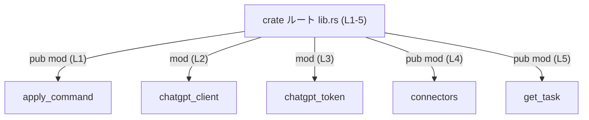

# chatgpt/src/lib.rs コード解説

## 0. ざっくり一言

- このファイルは `chatgpt` クレートのルート（エントリポイント）であり、サブモジュールを宣言し、どれを外部に公開するかを制御する役割を持っています（`lib.rs:L1-5`）。

---

## 1. このモジュールの役割

### 1.1 概要

- このモジュールは、`chatgpt` クレート内の各機能モジュールを **宣言** し、  
  そのうちどれを外部クレートから利用可能にするかを指定します。
- 実際の処理ロジックや関数本体はここには存在せず、すべて別ファイル（各モジュール）側に定義されます。

### 1.2 アーキテクチャ内での位置づけ

- `lib.rs` はクレートのトップレベルとして、以下のモジュールへのアクセスを提供します（`lib.rs:L1-5`）。
  - 公開モジュール: `apply_command`, `connectors`, `get_task`
  - 非公開モジュール: `chatgpt_client`, `chatgpt_token`



- 他クレートからは `chatgpt::apply_command`, `chatgpt::connectors`, `chatgpt::get_task` の3モジュールのみが直接参照可能です（`pub mod` で公開されているため）。
- `chatgpt_client` と `chatgpt_token` は `mod` のみで `pub` が付いていないため、クレート内部専用です。

### 1.3 設計上のポイント

コードから読み取れる設計上の特徴は次のとおりです。

- **責務の分割**
  - 実装はすべてサブモジュール側に分離されており、このファイルは名前空間と公開範囲の定義に専念しています（`lib.rs:L1-5`）。
- **状態を持たない**
  - グローバル変数や構造体定義・関数定義は存在せず、状態は一切保持していません（このチャンクには現れません）。
- **公開範囲の明確化**
  - 外部向け API を提供するモジュール（`apply_command`, `connectors`, `get_task`）と、内部実装専用のモジュール（`chatgpt_client`, `chatgpt_token`）が明確に分けられています。
- **安全性／エラー／並行性に関する情報**
  - このファイルにはロジックや関数が存在しないため、エラーハンドリングや並行性に関する具体的な情報はこのチャンクには現れません。

---

## 2. 主要な機能一覧

このファイル自体が提供する「機能」は、実行ロジックではなく **モジュール公開の制御** に関するものです。

- `apply_command` モジュールの公開（`pub mod apply_command;` `lib.rs:L1`）
- `chatgpt_client` モジュールのクレート内部向け宣言（`mod chatgpt_client;` `lib.rs:L2`）
- `chatgpt_token` モジュールのクレート内部向け宣言（`mod chatgpt_token;` `lib.rs:L3`）
- `connectors` モジュールの公開（`pub mod connectors;` `lib.rs:L4`）
- `get_task` モジュールの公開（`pub mod get_task;` `lib.rs:L5`）

各モジュール内でどのような関数・型が提供されているかは、このチャンクには現れません。

---

## 3. 公開 API と詳細解説

### 3.1 コンポーネント（モジュール）一覧

このファイルに現れるコンポーネントは「モジュール」のみです。  
関数・構造体・列挙体などの定義は含まれていません。

#### モジュール一覧

| 名前 | 種別 | 公開性 | 定義位置（根拠） | 役割 / 用途 |
|------|------|--------|------------------|-------------|
| `apply_command` | モジュール | 公開 (`pub`) | `lib.rs:L1` | `chatgpt::apply_command` として外部クレートから参照可能にする。内部の具体的な API はこのチャンクには現れません。 |
| `chatgpt_client` | モジュール | クレート内専用 | `lib.rs:L2` | `chatgpt` クレート内からのみ利用可能な内部モジュール。外部クレートから `chatgpt::chatgpt_client` としては参照できません。中身はこのチャンクには現れません。 |
| `chatgpt_token` | モジュール | クレート内専用 | `lib.rs:L3` | 同じく内部モジュール。トークン関連の処理を担う可能性は名前から推測できますが、コードからは断定できません。 |
| `connectors` | モジュール | 公開 (`pub`) | `lib.rs:L4` | `chatgpt::connectors` として外部に公開されるモジュール。具体的なコネクタ実装はこのチャンクには現れません。 |
| `get_task` | モジュール | 公開 (`pub`) | `lib.rs:L5` | `chatgpt::get_task` として外部に公開されるモジュール。どのような「タスク」を扱うかは、このチャンクには現れません。 |

> 補足: Rust のモジュールシステムの規約により、`pub mod apply_command;` は通常 `src/apply_command.rs` または `src/apply_command/mod.rs` のいずれかに対応しますが、このチャンクからどちらかを特定することはできません。

### 3.2 関数詳細

- このファイルには関数定義が一切存在しません（`lib.rs:L1-5` はすべてモジュール宣言行です）。
- そのため、「関数詳細」テンプレートに該当する対象はありません。

### 3.3 その他の関数

- 補助関数やラッパー関数も定義されていません。

---

## 4. データフロー

このファイルには実行時の処理ロジックやデータの変換処理が存在しないため、  
純粋な「データフロー」は定義されていません。

ただし、**モジュール公開という観点での「名前解決の流れ」** を示すと、以下のようになります。

```mermaid
sequenceDiagram
    participant Ext as "外部クレート (呼び出し元)"
    participant Lib as "chatgpt:: (lib.rs L1-5)"
    participant Apply as "apply_command モジュール"
    participant Conn as "connectors モジュール"
    participant Task as "get_task モジュール"

    Ext->>Lib: use chatgpt::apply_command;\nuse chatgpt::connectors;\nuse chatgpt::get_task;
    Note right of Lib: モジュール宣言のみが存在し、\n具体的な関数呼び出しはこのチャンクには現れない
    Lib-->>Apply: 名前空間を公開
    Lib-->>Conn: 名前空間を公開
    Lib-->>Task: 名前空間を公開
```

- 実際にどのデータがどのように流れるかは、各モジュール（`apply_command`, `connectors`, `get_task` など）の実装に依存し、このチャンクからは不明です。

---

## 5. 使い方（How to Use）

### 5.1 基本的な使用方法

外部クレート側からは、`chatgpt` クレートの公開モジュールを `use` して利用します。

```rust
use chatgpt::apply_command; // lib.rs:L1 で公開されているモジュールをインポート
use chatgpt::connectors;    // lib.rs:L4 で公開されているモジュールをインポート
use chatgpt::get_task;      // lib.rs:L5 で公開されているモジュールをインポート

fn main() {
    // ここで apply_command / connectors / get_task モジュール内の
    // 公開関数・公開構造体などを利用する。
    // 具体的な API 名は lib.rs からは分からないため、
    // 対応するモジュールファイルの定義を参照する必要があります。
}
```

- この例では、`chatgpt` クレートが `Cargo.toml` の依存として追加済みであることを前提としています。
- `lib.rs` の `pub mod` 宣言により、`chatgpt::apply_command` などとして名前解決されます。

### 5.2 よくある使用パターン

このファイルの観点で見える典型パターンは、「どのモジュールを直接外部から見せるか」を制御する使い方です。

- 外部に公開したい機能群をもつモジュールに対して `pub mod` を使う（`lib.rs:L1, L4, L5`）。
- 内部実装の詳細（HTTP クライアント、トークン管理などと思われる処理）をもつモジュールは `mod` のままにしておき、クレート外からは参照できないようにする（`lib.rs:L2-3`）。

### 5.3 よくある間違い

#### 1. 非公開モジュールを外部から参照しようとする

```rust
// 外部クレート側のコード（誤りの例）
use chatgpt::chatgpt_client; // エラー: chatgpt_client は pub ではない

fn main() {
    // ここで chatgpt_client の API を直接使おうとするとコンパイルエラーになります。
}
```

- `lib.rs:L2` の宣言は `mod chatgpt_client;` であり `pub` ではないため、クレート外からは参照できません。

**正しい例（公開モジュールを使う）:**

```rust
// 外部クレート側のコード（正しい基本形）
use chatgpt::apply_command; // lib.rs:L1 で pub mod として公開されている

fn main() {
    // apply_command モジュール内の公開 API を利用する。
    // どの関数・型が存在するかは apply_command モジュールの定義を確認する必要があります。
}
```

#### 2. モジュールファイルを作らずに `mod` だけ書く

- `lib.rs` に `pub mod new_module;` を追加したにもかかわらず、`src/new_module.rs` や `src/new_module/mod.rs` を用意しないと、コンパイルエラーになります。
- これは Rust のモジュール解決のルールによるもので、このファイルから見て「モジュール宣言と対応するファイルが一対になっている必要がある」という契約が存在します。

### 5.4 使用上の注意点（まとめ）

- **公開範囲の管理**  
  - `pub mod` を付けると、そのモジュール全体が外部クレートから参照可能になります。API 面での互換性やセキュリティの観点から、外に見せる必要があるモジュールだけを `pub` にすることが重要です。
- **内部モジュールの隠蔽**  
  - `mod` のみで宣言されたモジュール（`chatgpt_client`, `chatgpt_token`）は内部実装用とみなされます。これらの API の互換性は、外部利用を前提にしない前提で設計されている可能性があります。
- **安全性／バグ・セキュリティ面**  
  - このファイル自体はロジックを持たず、メモリアクセスやエラーハンドリング、並行処理などに関するバグ・脆弱性の直接の原因にはなりにくい構造です。
  - ただし誤って内部用モジュールを `pub mod` に変更すると、本来非公開とすべき API が外部に露出する可能性があり、セキュリティや API 安定性の観点で影響が出る点には注意が必要です。

---

## 6. 変更の仕方（How to Modify）

### 6.1 新しい機能を追加する場合

新しい機能用モジュールを追加する場合の典型的な手順は次のとおりです。

1. **モジュールファイルを作成する**
   - 例: `chatgpt/src/new_feature.rs` または `chatgpt/src/new_feature/mod.rs`
2. **`lib.rs` にモジュール宣言を追加する**
   - 外部に公開したい場合:

     ```rust
     pub mod new_feature; // 他クレートから chatgpt::new_feature として利用可能になる
     ```

   - クレート内部専用にしたい場合:

     ```rust
     mod new_feature; // chatgpt クレート内からのみ利用
     ```

3. **既存コードからの利用**
   - クレート内: `crate::new_feature::...`
   - 外部クレート: `use chatgpt::new_feature;`（`pub mod` の場合のみ）

このファイルの変更だけではロジックは追加されず、あくまで「名前空間と公開範囲」を接続する役割にとどまります。

### 6.2 既存の機能を変更する場合

- **公開・非公開の変更**
  - 例: `mod chatgpt_client;` → `pub mod chatgpt_client;` に変更すると、外部クレートから `chatgpt::chatgpt_client` が見えるようになります。
  - これは API の表面を変える変更であり、他クレートからの利用が始まると、後方互換性の維持が必要になります。
- **モジュール名の変更**
  - 例: `pub mod get_task;` を `pub mod tasks;` に変更すると、外部コード中の `chatgpt::get_task` への参照はすべて `chatgpt::tasks` に書き換える必要があります。
  - 対応するファイル名（`get_task.rs` / `tasks.rs` など）も合わせて変更する必要があります。
- **影響範囲の確認**
  - `lib.rs` でモジュール宣言を変更すると、以下を確認する必要があります。
    - クレート内のすべての `use crate::...` / `crate::...` の参照
    - 外部クレートからの `use chatgpt::...` の参照（公開モジュールの場合）

---

## 7. 関連ファイル

このファイルから推測できる、密接に関係するファイル・ディレクトリです。  
（Rust のモジュール解決ルールに基づく一般的な候補であり、実際にどちらの形が使われているかはこのチャンクからは断定できません。）

| パス候補 | 役割 / 関係 |
|---------|------------|
| `chatgpt/src/apply_command.rs` または `chatgpt/src/apply_command/mod.rs` | `lib.rs:L1` の `pub mod apply_command;` に対応するモジュール本体。`chatgpt::apply_command` 内の関数・型定義がここにあると考えられますが、具体的な中身はこのチャンクには現れません。 |
| `chatgpt/src/chatgpt_client.rs` または `chatgpt/src/chatgpt_client/mod.rs` | `lib.rs:L2` の `mod chatgpt_client;` に対応する内部モジュール本体。クレート内の他モジュールから利用されるクライアント実装が含まれる可能性がありますが、詳細は不明です。 |
| `chatgpt/src/chatgpt_token.rs` または `chatgpt/src/chatgpt_token/mod.rs` | `lib.rs:L3` の `mod chatgpt_token;` に対応する内部モジュール本体。トークン管理などを担う可能性がありますが、コードからは断定できません。 |
| `chatgpt/src/connectors.rs` または `chatgpt/src/connectors/mod.rs` | `lib.rs:L4` の `pub mod connectors;` に対応するモジュール本体。`chatgpt::connectors` の API が定義されていると考えられます。 |
| `chatgpt/src/get_task.rs` または `chatgpt/src/get_task/mod.rs` | `lib.rs:L5` の `pub mod get_task;` に対応するモジュール本体。タスク取得関連の API が定義されている可能性がありますが、このチャンクからは詳細不明です。 |

---

### このファイルから分かること・分からないことのまとめ

- **分かること**
  - クレートが 5 つのモジュールに分割されていること（`lib.rs:L1-5`）。
  - `apply_command`, `connectors`, `get_task` が外部公開 API の入口であること。
  - `chatgpt_client`, `chatgpt_token` は内部専用の実装モジュールであること。

- **分からないこと**
  - 各モジュール内にどのような関数・型・エラーハンドリング・非同期処理が存在するか。
  - 実行時の具体的なデータフローや、所有権・並行性に関する設計の詳細。

これ以上の詳細な解説には、各モジュールファイル（`apply_command`, `connectors`, `get_task`, `chatgpt_client`, `chatgpt_token`）のコードが必要になります。
