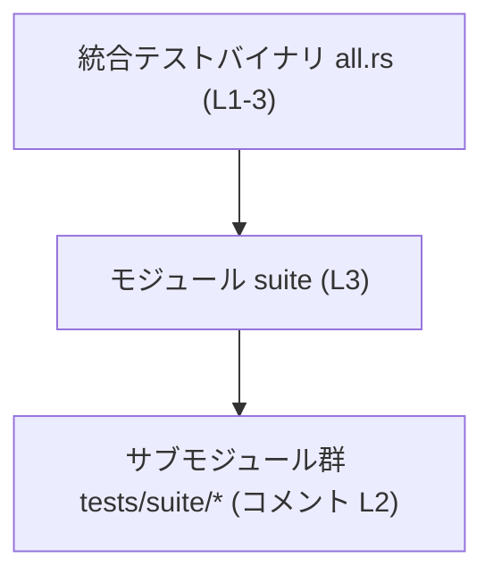
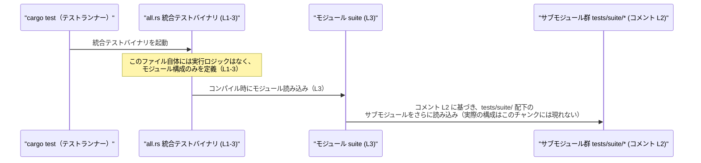

# chatgpt/tests/all.rs コード解説

## 0. ざっくり一言

- 統合テスト（integration test）用の **単一のテストバイナリ** であり、`suite` モジュールを通じて他のテストモジュールを集約する入口になっています。（`chatgpt/tests/all.rs:L1-3`）

---

## 1. このモジュールの役割

### 1.1 概要

- このファイルは「すべてのテストモジュールを集約する単一の統合テストバイナリ」であることがコメントから分かります。（`chatgpt/tests/all.rs:L1-1`）
- 実際のテストコード本体は `suite` モジュールおよびそのサブモジュール側に置かれ、このファイルはそれらを 1 つのテストバイナリにまとめるための **モジュール宣言だけ** を提供しています。（`chatgpt/tests/all.rs:L2-3`）

### 1.2 アーキテクチャ内での位置づけ

- `tests/` ディレクトリ配下の統合テストクレートの **ルートファイル** です。（パスとコメントより, `chatgpt/tests/all.rs:L1-3`）
- 内部モジュール `suite` を公開せずに読み込むことで、`tests/suite/` 以下にあるテストモジュール群をまとめて取り込む構成になっています。（`chatgpt/tests/all.rs:L2-3`）

依存関係を簡略化した図は次のとおりです。



- `C`（サブモジュール群）の具体的なファイル名や構成は、このチャンクには現れません。

### 1.3 設計上のポイント

- **最小限のエントリポイント**  
  - このファイル内にはコメントと `mod suite;` のみが定義されており（`chatgpt/tests/all.rs:L1-3`）、テストロジックは一切持ちません。
- **責務の分離**  
  - テストの集約方針や個別テストの実装は、`suite` モジュールとその配下に委ねられています。（`chatgpt/tests/all.rs:L2-3`）
- **状態・並行性なし**  
  - グローバル状態やスレッドを扱うコードは存在せず、このファイルが直接関与する安全性・エラーハンドリング・並行性の問題はありません。（`chatgpt/tests/all.rs:L1-3`）

---

## 2. 主要な機能一覧

このファイルが提供する機能は 1 つだけです。

- `suite` モジュールの読み込み:  
  - `tests/suite/` 以下のテストサブモジュール群を 1 つの統合テストバイナリに集約するためのモジュール宣言です。（`chatgpt/tests/all.rs:L2-3`）

---

## 3. 公開 API と詳細解説

### 3.1 コンポーネント一覧

このファイルに登場するコンポーネント（モジュール）をまとめます。

| 名前      | 種別     | 公開性 | 役割 / 用途                                                         | 定義箇所                              |
|-----------|----------|--------|---------------------------------------------------------------------|----------------------------------------|
| `suite`   | モジュール | 非公開 | 統合テスト用のサブモジュール群のルートモジュールとして読み込まれる | `chatgpt/tests/all.rs:L3-3`            |

- `suite` の中身（どのモジュールを再度 `mod` または `pub mod` しているか）は、このチャンクには現れません。

### 3.2 関数詳細

- このファイルには **関数定義（`fn`）は 1 つも存在しません**。（`chatgpt/tests/all.rs:L1-3`）
- したがって、詳細テンプレートで解説すべき公開関数もありません。

### 3.3 その他の関数

- 補助関数・テスト関数（`#[test]` 付き関数）も、このファイルには定義されていません。（`chatgpt/tests/all.rs:L1-3`）
- コメントから、テスト関数は `suite` モジュールおよびそのサブモジュール側に配置される構成であることが示唆されています。（`chatgpt/tests/all.rs:L1-2`）

---

## 4. データフロー

このファイルは実行時の処理ロジックを持ちませんが、コメントに基づき、テスト実行時の **構造的な流れ** を示します。

- 統合テスト実行時、テストランナー（例: `cargo test`）がこの統合テストバイナリを起動します。（コメントより `chatgpt/tests/all.rs:L1-1`）
- コンパイル段階で `mod suite;` が展開され、`suite` モジュールとそのサブモジュール群がテストバイナリに取り込まれます。（`chatgpt/tests/all.rs:L2-3`）



- `Suite -> Subs` の関係は、「サブモジュールは `tests/suite/` に置かれている」というコメント（`chatgpt/tests/all.rs:L2-2`）に基づく構造的な推定です。具体的な `mod` 宣言は本チャンクに含まれていません。

---

## 5. 使い方（How to Use）

### 5.1 基本的な使用方法

このファイル自体に関数はないため、「使う」とは主に **テストモジュールの追加方法** を指します。

1. 統合テストのエントリとして `all.rs` を用意しておきます。（すでに存在, `chatgpt/tests/all.rs:L1-3`）
2. 実際のテストコードは `suite` モジュールおよびそのサブモジュール側に追加します。（`chatgpt/tests/all.rs:L2-3`）

`all.rs` の内容は次のように非常に単純です。

```rust
// Single integration test binary that aggregates all test modules.   // すべてのテストモジュールを集約する統合テストバイナリ
// The submodules live in `tests/suite/`.                             // サブモジュールは tests/suite/ に配置される
mod suite;                                                            // suite モジュールを読み込む
```

- 上記は `chatgpt/tests/all.rs:L1-3` のそのままの内容です。

テストの実行方法（一般的な Cargo プロジェクトの場合の例）:

```bash
# プロジェクト全体のテストを実行（統合テスト all.rs も含まれる）
cargo test

# 統合テスト all（このファイルに対応するバイナリ）のみ実行する例
cargo test --test all
```

- `--test all` のバイナリ名対応は、Cargo の一般的な規約（`tests/all.rs` → `all`）に基づく情報です。  
  このリポジトリ固有の Cargo 設定ファイルは本チャンクには現れません。

### 5.2 よくある使用パターン

- **すべての統合テストを 1 つのバイナリに集約する**  
  - 個別のテストケースやテストグループは `tests/suite/` 以下にモジュールとして配置し、`suite` モジュールからまとめて読み込む構成が想定されています。（`chatgpt/tests/all.rs:L1-2`）
  - このファイル自体は変更せず、`suite` 側でモジュールの追加・削除を行う運用が考えられます。

### 5.3 よくある間違い（想定されるもの）

このファイルの内容と Rust のモジュール規則に基づき、起こりやすい誤りを挙げます。  
（`suite` の具体的な実装はこのチャンクには現れないため、一般的な注意として記述します。）

```rust
// 想定される誤り例（イメージ）:
// tests/suite/new_case.rs を作成しただけで、suite モジュールから読み込んでいない

// 正しい例（イメージ）:
// tests/suite/mod.rs 側で new_case を明示的にモジュールとして読み込む必要がある場合が多い
mod new_case;  // この行は実際のリポジトリには存在せず、説明用の例です
```

- Rust では、単にファイルを置くだけではモジュールとして認識されず、通常は親モジュール側から `mod xxx;` を記述する必要があります。
- このリポジトリの `suite` モジュールがどのようにサブモジュールを読み込んでいるかは、このチャンクには現れません。

### 5.4 使用上の注意点（まとめ）

- このファイルは **構造定義専用** であり、テストロジックの追加・変更は `suite` モジュール側で行う設計になっています。（`chatgpt/tests/all.rs:L1-3`）
- `mod suite;` 行を削除すると、`suite` モジュールおよびその配下のテストが **テストバイナリに含まれなくなる** ため、テストが実行されなくなります。（`chatgpt/tests/all.rs:L3-3`）
- 並行性・エラー処理・安全性に関する注意点は、このファイル単体ではほぼ存在せず、それらは `suite` およびそのサブモジュール側の実装に依存します。このチャンクにはそれらのコードは現れません。

---

## 6. 変更の仕方（How to Modify）

### 6.1 新しい機能（テスト）を追加する場合

コメントから、「サブモジュールは `tests/suite/` に配置される」という方針が読み取れます。（`chatgpt/tests/all.rs:L2-2`）  
この前提に基づく、一般的な追加手順の例を示します。

1. **新しいテストモジュールファイルを追加**  
   - 例: `tests/suite/new_feature.rs` を作成し、その中に `#[test]` 関数を定義する。
   - 実際にどのようなファイル名にするかは、このチャンクからは分かりません。

2. **`suite` モジュールから新ファイルを読み込む**  
   - 一般的には、`tests/suite/mod.rs` などの親モジュールに `mod new_feature;` を追加する必要があります。
   - ただし、このリポジトリの `suite` 実装がどうなっているかは本チャンクには現れないため、実際には既存の `suite` の定義を確認する必要があります。

3. `all.rs` 側は通常変更不要  
   - このファイルは常に `mod suite;` の 1 行だけで、統合テストの入口として機能させる構成が意図されています。（`chatgpt/tests/all.rs:L1-3`）

### 6.2 既存の機能を変更する場合

このファイルで変更しうる箇所は事実上 1 箇所（`mod suite;`）だけです。（`chatgpt/tests/all.rs:L3-3`）

- **モジュール名を変更する場合**  
  - `mod suite;` を別名に変更すると、対応するモジュールファイル（例: `tests/new_name.rs` や `tests/new_name/mod.rs`）を用意する必要があります。
  - 適切なパス・ファイル構成が存在しない場合、コンパイルエラーになります。

- **コメントの変更**  
  - コメント（`chatgpt/tests/all.rs:L1-2`）は設計意図・テスト配置方針を説明しているため、実際の構成と乖離しないよう注意する必要があります。

変更時の共通注意点:

- `mod` 宣言はコンパイル時に評価されるため、誤ったモジュールパスにすると **コンパイルエラー** が発生し、テストが実行できなくなります。
- このファイルを複雑にすると、テストエントリの役割が不明瞭になるため、現状のように最小限に保つ方針がコメントから読み取れます。（`chatgpt/tests/all.rs:L1-2`）

---

## 7. 関連ファイル

コメントおよび Rust の一般的なテスト構成に基づき、このファイルと密接に関係する可能性が高いパスをまとめます。

| パス                       | 役割 / 関係                                                                 | 根拠 |
|----------------------------|------------------------------------------------------------------------------|------|
| `chatgpt/tests/suite/`     | サブモジュールが置かれているディレクトリとしてコメントで言及されています。 | `chatgpt/tests/all.rs:L2-2` |
| `chatgpt/tests/suite/*`    | 実際のテストコード（`#[test]` 関数など）が存在することが想定されるファイル群。内容はこのチャンクには現れません。 | コメントとモジュール宣言からの推定（`chatgpt/tests/all.rs:L2-3`） |

- `suite` モジュールの具体的な実装ファイル（`suite.rs` or `suite/mod.rs` など）の正確なパスや構成は、このチャンクには現れません。  
  Rust のモジュール規則からは両方の可能性がありますが、どちらが使われているかはコードからは判断できません。

---

### まとめ（このファイルに固有のポイント）

- `chatgpt/tests/all.rs` は、**統合テストバイナリの最小限のエントリポイント** として、「コメント + `mod suite;`」のみを持つ構成になっています。（`chatgpt/tests/all.rs:L1-3`）
- 公開 API・エラーハンドリング・並行性などのコアロジックは一切なく、それらは `suite` モジュールおよびそのサブモジュール群の実装に委ねられています。このチャンクからはその詳細は分かりません。
- 実務上は、このファイルをほとんど変更せず、`tests/suite/` 配下でテストの追加・変更を行う前提の構造であると解釈できます（コメントを根拠とした設計意図）。
