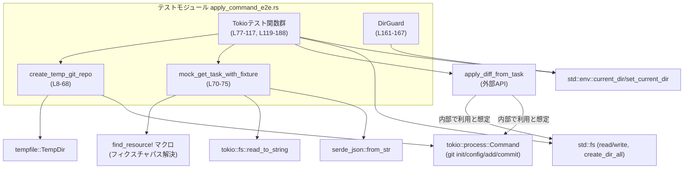
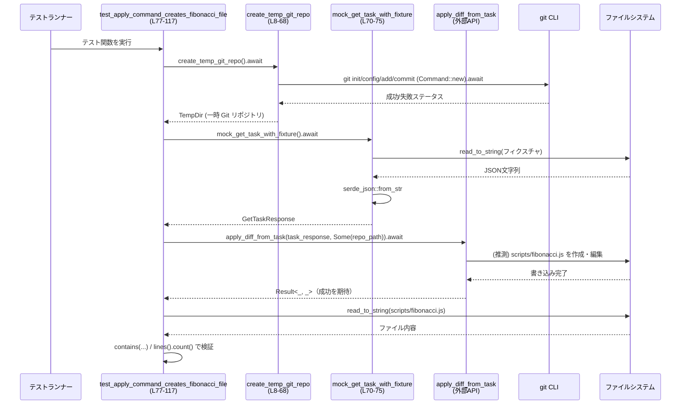

# chatgpt/tests/suite/apply_command_e2e.rs コード解説

---

## 0. ざっくり一言

`apply_diff_from_task` が Git リポジトリに対してどのように変更を適用するかを、  
実際の Git リポジトリとタスク JSON フィクスチャを使って **エンドツーエンドで検証する Tokio 非同期テスト**です（`apply_command_e2e.rs:L7-188`）。

---

## 1. このモジュールの役割

### 1.1 概要

- このテストモジュールは、ChatGPT タスクから取得した差分を Git リポジトリに適用する関数 `apply_diff_from_task` の振る舞いを検証します（`apply_command_e2e.rs:L1-5,L70-75,L78-188`）。
- 正常系として **`scripts/fibonacci.js` が期待どおり生成されるケース**（`test_apply_command_creates_fibonacci_file`）と、  
  既存ファイルとの競合により **マージコンフリクトが発生するケース**（`test_apply_command_with_merge_conflicts`）の 2 パターンをカバーします（`apply_command_e2e.rs:L78-117,L119-188`）。

### 1.2 アーキテクチャ内での位置づけ

このモジュールは「テスト層」に属し、本体ロジックの公開 API を直接呼び出して、  
Git + ファイルシステム + タスク JSON の組み合わせをまとめて検証する役割を持ちます。

主な依存関係は以下です（すべてこのファイルから直接利用されます）:

- `codex_chatgpt::apply_command::apply_diff_from_task`（変更適用の本体）`apply_command_e2e.rs:L1,L88,L173`
- `codex_chatgpt::get_task::GetTaskResponse`（タスク API レスポンスの型）`apply_command_e2e.rs:L2,L70-75`
- `codex_utils_cargo_bin::find_resource!` マクロ（テスト用フィクスチャのパス解決）`apply_command_e2e.rs:L3,L71`
- `tempfile::TempDir`（一時 Git リポジトリ）`apply_command_e2e.rs:L4,L8-9,L67`
- `tokio::process::Command`（非同期に `git` コマンドを実行）`apply_command_e2e.rs:L5,L16-21,L30-42,L46-58,L145-157`
- `tokio::fs::read_to_string` と `serde_json`（タスクフィクスチャ JSON の読み込み）`apply_command_e2e.rs:L72-73`
- `std::fs` と `std::env`（ファイル操作・カレントディレクトリ変更）`apply_command_e2e.rs:L44,L97,L128,L143,L159-160,L180`
- 生の `git` CLI（`git init`, `git config`, `git add`, `git commit`）`apply_command_e2e.rs:L16-21,L30-42,L46-58,L145-157`

依存関係の関係性を単純化した図です：



※ `apply_diff_from_task` の内部実装はこのチャンクには無いため、「ファイル操作」「git 実行」は関数名からの推測であり、コードからは断定できません。

### 1.3 設計上のポイント

コードから読み取れる設計上の特徴です。

- **テスト用ヘルパの分離**  
  - Git リポジトリの初期化は `create_temp_git_repo` に切り出されています（`apply_command_e2e.rs:L7-8`）。
  - タスク API レスポンスの読み込みは `mock_get_task_with_fixture` に切り出されています（`apply_command_e2e.rs:L70-75`）。
- **非同期 I/O とエラー伝播**  
  - `tokio::process::Command` と `tokio::fs::read_to_string` を `async fn` から `await` し、`?` で `anyhow::Result` にエラーを伝播します（`apply_command_e2e.rs:L8-9,L16-21,L30-35,L37-42,L46-51,L53-58,L70-73`）。
  - コマンド終了ステータスのチェックは `git init` と `git commit` に対してのみ `output.status.success()` を判定しています（`apply_command_e2e.rs:L23-28,L60-65`）。
- **RAII によるカレントディレクトリの復元**  
  - 一時的に `std::env::set_current_dir` で作業ディレクトリをリポジトリに切り替え、`DirGuard` 構造体の `Drop` 実装でテスト終了時に元に戻しています（`apply_command_e2e.rs:L159-167`）。
- **失敗時はパニックさせるテストスタイル**  
  - テスト本体では `expect` と `assert!` / `assert_eq!` を多用し、条件を満たさない場合はパニック→テスト失敗としています（`apply_command_e2e.rs:L79-81,L84-86,L88-90,L94,L97-116,L121-123,L128,L143,L145-157,L159-160,L169-171,L175-178,L180-187`）。
- **Git グローバル設定の隔離**  
  - テスト環境の Git 設定に依存しないよう、`GIT_CONFIG_GLOBAL` と `GIT_CONFIG_NOSYSTEM` 環境変数を設定して `git init/config/add/commit` を実行しています（`apply_command_e2e.rs:L11-14,L16-21,L30-42,L46-58`）。

---

## 2. 主要な機能・コンポーネント一覧（インベントリー）

このファイル内で定義されている主な関数・型の一覧です。

### 2.1 関数一覧

| 名前 | 種別 | 役割 / 用途 | 定義位置 |
|------|------|-------------|----------|
| `create_temp_git_repo` | `async fn` | 一時ディレクトリに Git リポジトリを作成し、初期コミットまで行うヘルパー | `apply_command_e2e.rs:L8-68` |
| `mock_get_task_with_fixture` | `async fn` | JSON フィクスチャから `GetTaskResponse` を読み込むヘルパー | `apply_command_e2e.rs:L70-75` |
| `test_apply_command_creates_fibonacci_file` | `#[tokio::test] async fn` | 差分適用により `scripts/fibonacci.js` が正しく生成されることを検証する E2E テスト | `apply_command_e2e.rs:L77-117` |
| `test_apply_command_with_merge_conflicts` | `#[tokio::test] async fn` | 既存の `scripts/fibonacci.js` と差分が競合し、適用が失敗しコンフリクトマーカーが残ることを検証する E2E テスト | `apply_command_e2e.rs:L119-188` |
| `<DirGuard as Drop>::drop` | `fn` | スコープ終了時に元のカレントディレクトリへ戻すための RAII 実装 | `apply_command_e2e.rs:L161-165` |

### 2.2 ローカル型一覧

| 名前 | 種別 | 役割 / 用途 | 定義位置 |
|------|------|-------------|----------|
| `DirGuard` | タプル構造体 | 生成時に記録したパスへ、`Drop` 時にカレントディレクトリを戻すガード | `apply_command_e2e.rs:L161-167` |

---

## 3. 公開 API と詳細解説

このファイル自体はテストモジュールであり、外部クレートに公開される API は定義していません。  
ここでは「テストヘルパー」と「テスト関数」を対象に詳細を整理します。

### 3.1 型一覧（構造体・列挙体など）

| 名前 | 種別 | フィールド / 中身 | 役割 / 用途 | 定義位置 |
|------|------|-------------------|-------------|----------|
| `DirGuard` | タプル構造体 | `0: std::path::PathBuf` | `Drop` 時にこのパスを `std::env::set_current_dir` で復元する | `apply_command_e2e.rs:L161-167` |
| `GetTaskResponse` | 構造体（外部定義） | 不明（このチャンクには定義なし） | タスク API 応答を表すドメイン型。テストでは JSON フィクスチャをパースする型として使用 | `apply_command_e2e.rs:L2,L70-75` |

`GetTaskResponse` の詳細構造はこのファイルには含まれていないため不明です。

---

### 3.2 関数詳細

#### `create_temp_git_repo() -> anyhow::Result<TempDir>`

**概要**

- 一時ディレクトリに Git リポジトリを初期化し、`README.md` を作成して初期コミットまで行った上で、そのディレクトリを表す `TempDir` を返します（`apply_command_e2e.rs:L7-68`）。
- テスト間で干渉しないクリーンな Git リポジトリを毎回用意する目的です。

**引数**

| 引数名 | 型 | 説明 |
|--------|----|------|
| （なし） | - | 呼び出しごとに新しい一時リポジトリを生成します |

**戻り値**

- `anyhow::Result<TempDir>`  
  - `Ok(TempDir)`：初期化と初期コミットが成功した一時リポジトリ。
  - `Err(anyhow::Error)`：一時ディレクトリ作成、`git` コマンド実行、ファイル書き込みのいずれかでエラーが発生した場合。

**内部処理の流れ**

1. `TempDir::new()` で一時ディレクトリを作成し、そのパスを `repo_path` として取得します（`apply_command_e2e.rs:L8-10`）。
2. Git グローバル／システム設定を無効化する環境変数 `GIT_CONFIG_GLOBAL=/dev/null`, `GIT_CONFIG_NOSYSTEM=1` を定義します（`apply_command_e2e.rs:L11-14`）。
3. `git init` を `tokio::process::Command` で実行し、終了ステータスが成功かチェックします。失敗時は `anyhow::bail!` で早期リターンします（`apply_command_e2e.rs:L16-28`）。
4. `git config user.email ...` と `git config user.name ...` を同様に実行しますが、これらについては終了ステータスはチェックせず、I/O エラーのみ `?` で伝播します（`apply_command_e2e.rs:L30-42`）。
5. `README.md` に `# Test Repo\n` を書き込みます（`apply_command_e2e.rs:L44`）。
6. `git add README.md` を実行し、I/O エラーを `?` で伝播します（終了ステータスは確認しません）（`apply_command_e2e.rs:L46-51`）。
7. `git commit -m "Initial commit"` を実行し、終了ステータスが失敗なら `anyhow::bail!` します（`apply_command_e2e.rs:L53-65`）。
8. 最後に `Ok(temp_dir)` を返します（`apply_command_e2e.rs:L67`）。

**Examples（使用例）**

テスト以外の非同期コンテキストから利用する場合の例です：

```rust
// Tokio ランタイム上の async コンテキストを想定
let temp_repo = create_temp_git_repo().await?;            // 一時 Git リポジトリを作成
let repo_path = temp_repo.path();                         // &Path としてパスを取得
println!("created temp git repo at {:?}", repo_path);     // デバッグ出力
```

**Errors / Panics**

- `Err` になる主な条件（いずれも `anyhow::Error` にラップされます）:
  - 一時ディレクトリ作成失敗（`TempDir::new()`）（`apply_command_e2e.rs:L9`）。
  - `git` コマンドの起動・完了待ち I/O エラー（`.output().await?` の `?`）（`apply_command_e2e.rs:L16-21,L30-35,L37-42,L46-51,L53-58`）。
  - `git init` または `git commit` の終了ステータスが非ゼロ（`apply_command_e2e.rs:L23-28,L60-65`）。
  - `README.md` の書き込み失敗（`apply_command_e2e.rs:L44`）。
- Panic はこの関数内では使用していません。全て `Result` で返されます。

**Edge cases（エッジケース）**

- `git` コマンド自体が存在しない場合や PATH にない場合は、`Command::new("git").output().await?` の段階で I/O エラーとなり `Err` になります（`apply_command_e2e.rs:L16-21`）。
- `git config` や `git add` が終了ステータス非ゼロで失敗しても、そのステータスはチェックしていないため、この関数としては成功扱いになります（`apply_command_e2e.rs:L30-42,L46-51`）。  
  後続の `git commit` などが失敗して初めてエラーとなる可能性があります。
- 環境変数 `GIT_CONFIG_GLOBAL` と `GIT_CONFIG_NOSYSTEM` はこの関数内で `git` コマンドに対してのみ設定され、プロセス全体の環境変数は変更していません（`apply_command_e2e.rs:L11-18,L30-39,L46-55`）。

**使用上の注意点**

- この関数は非同期関数のため、Tokio などの非同期ランタイム内で `await` する必要があります（`apply_command_e2e.rs:L8`）。
- 返される `TempDir` はスコープを抜けると自動で削除されます。テスト中のみ有効な一時リポジトリとして設計されています。
- `git config` と `git add` の終了ステータスはチェックしていないため、これらのコマンドの失敗を検出したい場合は関数の拡張が必要になります（`apply_command_e2e.rs:L30-42,L46-51`）。

---

#### `mock_get_task_with_fixture() -> anyhow::Result<GetTaskResponse>`

**概要**

- `tests/task_turn_fixture.json` という JSON フィクスチャファイルを読み込み、それを `GetTaskResponse` 型にデシリアライズして返します（`apply_command_e2e.rs:L70-75`）。
- 実際の API 呼び出しを行わずに、固定のタスクレスポンスを用いてテストを行うためのヘルパーです。

**引数**

| 引数名 | 型 | 説明 |
|--------|----|------|
| （なし） | - | 固定のフィクスチャパス (`tests/task_turn_fixture.json`) を内部で使用します |

**戻り値**

- `anyhow::Result<GetTaskResponse>`  
  - `Ok(GetTaskResponse)`：フィクスチャファイルが存在し、JSON として正しくパースできた場合。
  - `Err(anyhow::Error)`：パス解決・ファイル読み込み・JSON パースのいずれかが失敗した場合。

**内部処理の流れ**

1. `find_resource!("tests/task_turn_fixture.json")` マクロでフィクスチャファイルのパスを取得します（`apply_command_e2e.rs:L71`）。
2. `tokio::fs::read_to_string` により非同期でファイル内容を文字列として読み込みます（`apply_command_e2e.rs:L72`）。
3. `serde_json::from_str` で `GetTaskResponse` 型にデシリアライズします（`apply_command_e2e.rs:L73`）。
4. `Ok(response)` で返却します（`apply_command_e2e.rs:L74`）。

**Examples（使用例）**

```rust
let task_response = mock_get_task_with_fixture().await?;  // JSON フィクスチャを読み込み
// task_response を apply_diff_from_task などに渡して利用する
```

**Errors / Panics**

- `Err` になる条件:
  - `find_resource!` が対象ファイルを見つけられなかった場合（`apply_command_e2e.rs:L71`）。
  - ファイル読み込み時の I/O エラー（`apply_command_e2e.rs:L72`）。
  - JSON の構造が `GetTaskResponse` に合致せず、デシリアライズが失敗した場合（`apply_command_e2e.rs:L73`）。
- Panic はこの関数内にはありません。

**Edge cases（エッジケース）**

- フィクスチャファイルが空、または不正な JSON の場合、`serde_json::from_str` により即座に `Err` になります（`apply_command_e2e.rs:L73`）。
- フィクスチャのスキーマが `GetTaskResponse` の定義と変わった場合、コンパイルは通りますが実行時にデシリアライズエラーになる可能性があります。

**使用上の注意点**

- ファイルパスがハードコードされているため、異なるフィクスチャを使いたい場合は関数を別途定義するか、この関数を拡張する必要があります（`apply_command_e2e.rs:L71`）。
- 非同期関数であるため、利用側も async コンテキストである必要があります（`apply_command_e2e.rs:L70`）。

---

#### `test_apply_command_creates_fibonacci_file()`

**概要**

- `apply_diff_from_task` を実際に実行し、`scripts/fibonacci.js` が作成されて、内容と行数がフィクスチャの指定どおりになっていることを検証する E2E テストです（`apply_command_e2e.rs:L77-117`）。

**引数**

- テスト関数のため引数はありません。`#[tokio::test]` により、Tokio ランタイムで実行されます（`apply_command_e2e.rs:L77-78`）。

**戻り値**

- テスト関数なので戻り値は `()` です。失敗条件では Panic によりテストが失敗します。

**内部処理の流れ**

1. `create_temp_git_repo().await.expect(...)` で初期コミット済みの一時 Git リポジトリを作成し、そのパスを `repo_path` に保存します（`apply_command_e2e.rs:L79-82`）。
2. `mock_get_task_with_fixture().await.expect(...)` でタスクフィクスチャを読み込みます（`apply_command_e2e.rs:L84-86`）。
3. `apply_diff_from_task(task_response, Some(repo_path.to_path_buf())).await.expect(...)` を呼び出し、差分適用が成功することを前提とします（`apply_command_e2e.rs:L88-90`）。
4. `repo_path.join("scripts/fibonacci.js")` でファイルパスを組み立て、`exists()` によりファイルが作成されていることを `assert!` で検証します（`apply_command_e2e.rs:L92-95`）。
5. `std::fs::read_to_string` でファイル内容を読み込み、以下を確認します（`apply_command_e2e.rs:L97-116`）:
   - `function fibonacci(n)` という関数定義が含まれていること（`apply_command_e2e.rs:L98-101`）。
   - シェバン `#!/usr/bin/env node` が含まれていること（`apply_command_e2e.rs:L102-105`）。
   - `module.exports = fibonacci;` が含まれていること（`apply_command_e2e.rs:L106-109`）。
   - 行数が 31 行であること（`contents.lines().count()` の結果と `assert_eq!`）（`apply_command_e2e.rs:L111-116`）。

**Examples（使用例）**

この関数自体はテストエントリポイントのため、外部から呼び出すことは想定されていません。  
ただし流れとしては以下のようになります：

```rust
// テストランナーによって呼び出される擬似コードイメージ
#[tokio::test]
async fn test_apply_command_creates_fibonacci_file() {
    let temp_repo = create_temp_git_repo().await.expect("...");
    let task_response = mock_get_task_with_fixture().await.expect("...");
    apply_diff_from_task(task_response, Some(temp_repo.path().to_path_buf()))
        .await
        .expect("...");

    // 以降、生成されたファイルの存在と中身を検証
}
```

**Errors / Panics**

- 以下のいずれかが起きると Panic → テスト失敗となります：
  - 一時 Git リポジトリの作成失敗（`expect("Failed to create temp git repo")`）（`apply_command_e2e.rs:L79-81`）。
  - タスクフィクスチャの読み込み失敗（`expect("Failed to load fixture")`）（`apply_command_e2e.rs:L84-86`）。
  - 差分適用処理の失敗（`expect("Failed to apply diff from task")`）（`apply_command_e2e.rs:L88-90`）。
  - `scripts/fibonacci.js` が存在しない（`assert!(fibonacci_path.exists(), ...)`）（`apply_command_e2e.rs:L93-95`）。
  - ファイル読み込み失敗（`expect("Failed to read fibonacci.js")`）（`apply_command_e2e.rs:L97`）。
  - 期待する文字列がファイル内に含まれていない（`assert!` の失敗）（`apply_command_e2e.rs:L98-109`）。
  - 行数が 31 行でない（`assert_eq!` の失敗）（`apply_command_e2e.rs:L111-116`）。

**Edge cases（エッジケース）**

- `apply_diff_from_task` が `scripts/fibonacci.js` 以外のパスにファイルを生成した場合、`fibonacci_path.exists()` が `false` になりテストが失敗します（`apply_command_e2e.rs:L93-95`）。
- ファイル内容は部分一致（`contains`) でのみ検証しているため、余分なコードが追加されていてもテストは成功します（`apply_command_e2e.rs:L98-109`）。
- 行数のチェックは `contents.lines().count()` に基づくため、末尾の改行の有無や OS ごとの改行コードの扱いに依存します（`apply_command_e2e.rs:L111-113`）。

**使用上の注意点**

- テストが非同期であるため、Tokio ランタイムの設定（シングルスレッド/マルチスレッド）によっては、他の非同期テストと並行実行される可能性があります。  
  ただしこのテストはプロセスグローバルな状態（カレントディレクトリなど）を変更していないため、並行性による干渉は比較的小さいです。

---

#### `test_apply_command_with_merge_conflicts()`

**概要**

- 既存の `scripts/fibonacci.js` に「別の実装」をコミットしておき、その後 `apply_diff_from_task` を実行したときに、適用が失敗して `Err` になり、ファイル内に Git のマージコンフリクトマーカーが残ることを検証する E2E テストです（`apply_command_e2e.rs:L119-188`）。

**引数 / 戻り値**

- `test_apply_command_creates_fibonacci_file` 同様、引数・戻り値はありません。Panic によってテストの成功/失敗が決まります。

**内部処理の流れ**

1. `create_temp_git_repo` で初期コミット済み Git リポジトリを用意し、そのパスを `repo_path` に保存します（`apply_command_e2e.rs:L121-124`）。
2. `scripts` ディレクトリを作成し（`std::fs::create_dir_all`）、そこに「別実装」の `fibonacci.js` を書き込みます（`apply_command_e2e.rs:L127-143`）。
3. `git add scripts/fibonacci.js` と `git commit -m "Add conflicting fibonacci implementation"` を実行し、競合の原因となるファイル変更をコミットします（`apply_command_e2e.rs:L145-157`）。
4. 現在のカレントディレクトリを `original_dir` として保存し（`std::env::current_dir()`）、`repo_path` に変更した後、`DirGuard` に元のパスを渡して `_guard` に保持します（`apply_command_e2e.rs:L159-167`）。  
   テスト終了時に `Drop` によりカレントディレクトリが元に戻されます（`apply_command_e2e.rs:L161-165`）。
5. `mock_get_task_with_fixture` でタスクフィクスチャを読み込みます（`apply_command_e2e.rs:L169-171`）。
6. `apply_diff_from_task(task_response, Some(repo_path.to_path_buf())).await` を実行し、結果を `apply_result` として受け取ります（`apply_command_e2e.rs:L173`）。
7. `assert!(apply_result.is_err(), ...)` により、この呼び出しがエラー（`Err`）を返すことを確認します（`apply_command_e2e.rs:L175-178`）。
8. 最後に `scripts/fibonacci.js` の内容を読み込み、`<<<<<<< HEAD`・`=======`・`>>>>>>>` のいずれかのマージコンフリクトマーカーが含まれていることを `assert!` で確認します（`apply_command_e2e.rs:L180-187`）。

**Examples（使用例）**

テストの流れの擬似コード：

```rust
#[tokio::test]
async fn test_apply_command_with_merge_conflicts() {
    let temp_repo = create_temp_git_repo().await.expect("...");
    let repo_path = temp_repo.path();

    // 競合を起こす既存ファイルを用意
    std::fs::create_dir_all(repo_path.join("scripts")).expect("...");
    std::fs::write(repo_path.join("scripts/fibonacci.js"), CONFLICTING_CONTENT).expect("...");

    // 競合のもとになるコミットを作成
    Command::new("git").args(["add", "scripts/fibonacci.js"]).current_dir(repo_path).output().await.expect("...");
    Command::new("git").args(["commit", "-m", "Add conflicting fibonacci implementation"]).current_dir(repo_path).output().await.expect("...");

    // カレントディレクトリをリポジトリに変更し、スコープ終了時に戻す
    let original_dir = std::env::current_dir().expect("...");
    std::env::set_current_dir(repo_path).expect("...");
    let _guard = DirGuard(original_dir);

    let task_response = mock_get_task_with_fixture().await.expect("...");
    let apply_result = apply_diff_from_task(task_response, Some(repo_path.to_path_buf())).await;

    assert!(apply_result.is_err(), "Expected apply to fail due to merge conflicts");
    let contents = std::fs::read_to_string(repo_path.join("scripts/fibonacci.js")).expect("...");
    assert!(contents.contains("<<<<<<< HEAD") || contents.contains("=======") || contents.contains(">>>>>>> "));
}
```

**Errors / Panics**

- Panic を引き起こす条件：
  - テストの前準備（ディレクトリ作成・ファイル書き込み・git add/commit・カレントディレクトリ取得/変更）が失敗した場合（`expect(...)`）（`apply_command_e2e.rs:L121-123,L128,L143,L145-157,L159-160`）。
  - `mock_get_task_with_fixture` の失敗（`expect("Failed to load fixture")`）（`apply_command_e2e.rs:L169-171`）。
  - `apply_diff_from_task` が `Ok` を返してしまい、`apply_result.is_err()` が `false` だった場合（`apply_command_e2e.rs:L175-178`）。
  - `scripts/fibonacci.js` にマージコンフリクトマーカーが含まれていない場合（`apply_command_e2e.rs:L182-187`）。
- `apply_diff_from_task` が返す `Err` の具体的な内容は、このファイルからは分かりません（`apply_command_e2e.rs:L173-177`）。

**Edge cases（エッジケース）**

- `git add`/`git commit` の終了ステータスをチェックしていないため、コマンドが非ゼロステータスで終了した場合でもテストは前進し、リポジトリが期待どおりの状態でない可能性があります（`apply_command_e2e.rs:L145-157`）。
- マージコンフリクトマーカーの検出は文字列の単純包含で行っているため、`apply_diff_from_task` が別の形式でコンフリクトを表現するように変更された場合、このテストは意図せず失敗します（`apply_command_e2e.rs:L182-187`）。
- `std::env::set_current_dir` はプロセス全体の状態を変更するため、テストが並行実行されている場合、他のテストに影響を与える可能性があります（`apply_command_e2e.rs:L159-167`）。  
  ただし `DirGuard` によりスコープ終了時に元に戻される設計にはなっています。

**使用上の注意点**

- カレントディレクトリを一時的に変更するため、他のテストと共有されるプロセスでこのパターンを使う場合は、テストの並行実行設定に注意が必要です（`apply_command_e2e.rs:L159-167`）。
- ファイルの中身の検証がコンフリクトマーカーの有無だけに限定されているため、より詳細な挙動（どの行がどう競合しているか）を検証したい場合は追加のアサーションが必要です。

---

#### `<DirGuard as Drop>::drop(&mut self)`

**概要**

- `DirGuard` がスコープを抜けて破棄される際に `Drop` トレイトが呼ばれ、保持していたパスを `std::env::set_current_dir` で復元します（`apply_command_e2e.rs:L161-165`）。
- 失敗してもエラーは無視されます。

**引数**

| 引数名 | 型 | 説明 |
|--------|----|------|
| `&mut self` | `&mut DirGuard` | 内部に保持している元のパスを参照します |

**戻り値**

- 戻り値はありません（`Drop` トレイトの規約）。

**内部処理の流れ**

1. `std::env::set_current_dir(&self.0)` を実行して、元のパスにカレントディレクトリを戻します（`apply_command_e2e.rs:L164`）。
2. 戻り値の `Result` は無視され、`let _ = ...;` で破棄されます（`apply_command_e2e.rs:L164`）。

**Errors / Panics**

- `std::env::set_current_dir` が失敗した場合でも、`Result` を無視しているため、Panic にはなりません（`apply_command_e2e.rs:L164`）。
- このメソッド内に Panic を発生させるコードはありません。

**Edge cases（エッジケース）**

- 元のパスが既に削除されている、またはアクセス権が失われている場合、`set_current_dir` は失敗しますが、この失敗はログにも残らず無視されます（`apply_command_e2e.rs:L164`）。

**使用上の注意点**

- `Drop` 内でエラーを無視しているため、カレントディレクトリ復元の失敗を検出したい場合は、テストコード側で明示的にチェックするような拡張が必要です。

---

### 3.3 その他の関数

このファイルには上記以外のユーザー定義関数はありません。

---

## 4. データフロー

ここでは、正常系テスト `test_apply_command_creates_fibonacci_file` を例に、処理の流れを整理します。

### 4.1 正常系（ファイル生成）のシーケンス

テスト内での主な呼び出し関係：



※ `apply_diff_from_task` の内部でファイルシステムや Git をどう使うかはこのチャンクには無いため、図中のその部分は関数名からの推測です。

### 4.2 競合系（マージコンフリクト）のシーケンス

マージコンフリクトテストでは、上記に加えて以下の前処理があります（`apply_command_e2e.rs:L127-157`）。

1. `scripts/fibonacci.js` に既存の実装を保存（`std::fs::write`）。
2. `git add scripts/fibonacci.js` と `git commit` で変更をコミット。
3. `std::env::set_current_dir(repo_path)` でカレントディレクトリをリポジトリに変更し、`DirGuard` で復元を保証。

その後の `apply_diff_from_task` 呼び出しで `Err` を期待し、ファイルにコンフリクトマーカーが残っているかを確認するフローです（`apply_command_e2e.rs:L173-187`）。

---

## 5. 使い方（How to Use）

このファイルはテスト用ですが、ヘルパー関数は他のテストでも再利用可能です。

### 5.1 基本的な使用方法

`create_temp_git_repo` と `mock_get_task_with_fixture` を利用して新しい E2E テストを書くパターンの例です：

```rust
#[tokio::test] // Tokio ランタイム上でテストを実行
async fn test_apply_command_custom_case() -> anyhow::Result<()> {
    // 1. 一時 Git リポジトリを作成
    let temp_repo = create_temp_git_repo().await?;            // apply_command_e2e.rs:L8-68
    let repo_path = temp_repo.path();

    // 2. タスクレスポンスをフィクスチャから読み込み
    let task_response = mock_get_task_with_fixture().await?; // apply_command_e2e.rs:L70-75

    // 3. 対象の関数を呼び出し
    let result = apply_diff_from_task(task_response, Some(repo_path.to_path_buf())).await;

    // 4. 必要に応じて Result の中身や副作用を検証
    assert!(result.is_ok());
    Ok(())
}
```

### 5.2 よくある使用パターン

- **成功パスの検証**  
  - `create_temp_git_repo` → `mock_get_task_with_fixture` → `apply_diff_from_task` → ファイル存在と内容チェックという流れ（`apply_command_e2e.rs:L79-116`）。
- **失敗パス（競合やエラー）の検証**  
  - 事前に `std::fs::write` と `git add/commit` で状態を作り、`apply_diff_from_task` が `Err` を返すことを確認するパターン（`apply_command_e2e.rs:L127-178`）。

### 5.3 よくある間違い

コードから推測される誤用例と正しい使い方です。

```rust
// 誤りの可能性: カレントディレクトリを変更して元に戻さない
let original_dir = std::env::current_dir().unwrap();
std::env::set_current_dir(repo_path).unwrap();
// ... テスト処理 ...
// Drop ガードがないため、ここでテストが終わっても current_dir が元に戻らない

// 正しい例: DirGuard を使って RAII で復元
let original_dir = std::env::current_dir().unwrap();
std::env::set_current_dir(repo_path).unwrap();
struct DirGuard(std::path::PathBuf);
impl Drop for DirGuard {
    fn drop(&mut self) {
        let _ = std::env::set_current_dir(&self.0);
    }
}
let _guard = DirGuard(original_dir);
// ... ここでテスト処理を行うと、スコープ終了時に current_dir が自動で復元される
```

```rust
// 誤りの可能性: 非同期関数を同期コンテキストから直接呼ぶ
let repo = create_temp_git_repo(); // コンパイルエラー: async fn の戻り値は Future

// 正しい例: async コンテキストで .await する
let repo = create_temp_git_repo().await?;
```

### 5.4 使用上の注意点（まとめ）

- **非同期性**  
  - `create_temp_git_repo` と `mock_get_task_with_fixture` は `async fn` のため、Tokio などの非同期ランタイム内で `await` する必要があります（`apply_command_e2e.rs:L8,L70`）。
- **外部コマンド依存**  
  - テストは `git` コマンドの存在と挙動に依存します（`apply_command_e2e.rs:L16-21,L30-42,L46-58,L145-157`）。CI 環境などで `git` が存在しない場合は失敗します。
- **グローバル状態（カレントディレクトリ）**  
  - `test_apply_command_with_merge_conflicts` は `std::env::set_current_dir` を使用しています（`apply_command_e2e.rs:L159-160`）。  
    `DirGuard` により復元はされますが、テストを並行実行する場合は他のテストとの干渉に注意が必要です。
- **終了ステータス未チェックのコマンド**  
  - `git config`・`git add`・マージコンフリクトテスト内の `git add/commit` では、終了ステータスがチェックされていません（I/O エラーのみ検出）。  
    Git の設定やフックによりコマンドが非ゼロで終了しても検出されない点に留意する必要があります（`apply_command_e2e.rs:L30-42,L46-51,L145-157`）。

---

## 6. 変更の仕方（How to Modify）

### 6.1 新しい機能を追加する場合（テストケース追加）

- **別の差分適用パターンのテストを追加**  
  1. 新しい `#[tokio::test] async fn` を定義します（`apply_command_e2e.rs:L77-78,L119-120` を参考）。
  2. `create_temp_git_repo` で初期状態のリポジトリを用意します（`apply_command_e2e.rs:L79-82,L121-124`）。
  3. 必要に応じて `scripts` ディレクトリやその他ファイルを事前に作成し、`git add/commit` で状態を作ります（`apply_command_e2e.rs:L127-157`）。
  4. `mock_get_task_with_fixture` か、別のフィクスチャ読み込み関数を利用してタスクレスポンスを準備します（`apply_command_e2e.rs:L84-86,L169-171`）。
  5. `apply_diff_from_task` を呼び出し、期待する結果（成功・失敗やファイルの状態）を `assert!` で検証します（`apply_command_e2e.rs:L88-116,L173-187`）。

- **別フィクスチャでのテスト**  
  - 異なる JSON フィクスチャを使う場合は、新しい `mock_get_task_with_<name>` 関数を `mock_get_task_with_fixture` と同様の構造で追加し、`find_resource!` のパスだけ変えるのが自然です（`apply_command_e2e.rs:L70-75`）。

### 6.2 既存の機能を変更する場合

- **`create_temp_git_repo` の変更**  
  - 追加の初期ファイルやブランチ設定が必要な場合、この関数に `git` コマンドを追加します（`apply_command_e2e.rs:L16-21,L30-42,L46-58`）。
  - 終了ステータスを正確に扱いたい場合は、`git config` や `git add` 後にも `output.status.success()` をチェックするロジックを追加します（現在はチェックしていないことがコードから分かります）。
- **カレントディレクトリ操作の見直し**  
  - 並行テストの安全性を高めるために、`test_apply_command_with_merge_conflicts` の `std::env::set_current_dir` 依存を減らす、あるいはテストを `#[serial]` のようなシリアル実行に変更することが考えられます（ただし、これらの属性やクレートはこのチャンクには現れていません）。
- **テストの検証範囲の拡大**  
  - 例えば `fibonacci.js` の中身をより厳密にチェックしたい場合、現在の `contains` ベースの検証（`apply_command_e2e.rs:L98-109`）を、例えばスナップショットテストや AST ベースの検証に置き換えることができますが、そのためには追加のライブラリやロジックが必要です。

変更時はいずれも以下を確認する必要があります：

- `apply_diff_from_task` 側の契約（どのような入力で `Ok` / `Err` を返すか）に反していないか。
- 新旧テストケースが両立し、CI 環境の Git/ファイルシステム環境でも安定して動くか。

---

## 7. 関連ファイル

このモジュールと密接に関係する他のファイル・モジュール（名前はコードから読み取れる範囲）です。

| パス / モジュール | 役割 / 関係 |
|-------------------|------------|
| `codex_chatgpt::apply_command::apply_diff_from_task` | このテストが直接呼び出しているコマンド適用ロジックの本体関数。成功・失敗や副作用（ファイル生成/コンフリクト）を検証対象としています（`apply_command_e2e.rs:L1,L88,L173`）。実装はこのチャンクには含まれていません。 |
| `codex_chatgpt::get_task::GetTaskResponse` | タスク API レスポンスを表す型。フィクスチャ JSON から構築され、`apply_diff_from_task` への入力として使用されます（`apply_command_e2e.rs:L2,L70-75`）。 |
| `codex_utils_cargo_bin::find_resource!` | テスト用リソースファイル（`tests/task_turn_fixture.json`）のパスを解決するマクロです（`apply_command_e2e.rs:L3,L71`）。 |
| `tests/task_turn_fixture.json` | タスクレスポンスの JSON フィクスチャ。内容はこのチャンクには含まれていませんが、`mock_get_task_with_fixture` で読み込まれています（`apply_command_e2e.rs:L71-73`）。 |
| `tempfile` クレート | 一時ディレクトリを提供し、テスト終了時に自動削除します。Git リポジトリの作成場所として使用されています（`apply_command_e2e.rs:L4,L8-9,L67`）。 |
| `tokio` クレート | 非同期ランタイムおよび `tokio::process::Command` / `tokio::fs` を提供し、すべての非同期 I/O を支えています（`apply_command_e2e.rs:L5,L72,L77,L119`）。 |

このファイルは主にテストの「入口」として機能し、本体ロジックへの E2E 検証を行うレイヤーであると言えます。
