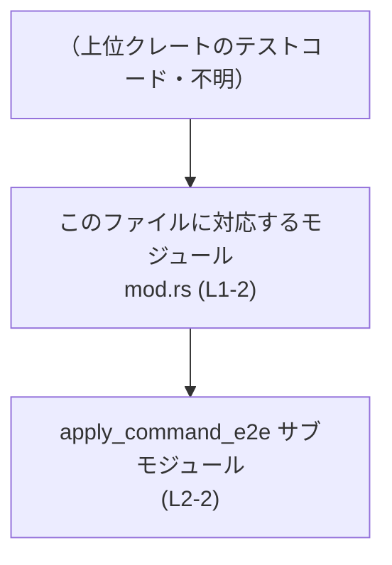

# chatgpt/tests/suite/mod.rs コード解説

## 0. ざっくり一言

- 統合テストをサブモジュールとしてまとめる「テストスイート入口」モジュールです（コメントより判断）  
  （根拠: `chatgpt/tests/suite/mod.rs:L1-1`）

---

## 1. このモジュールの役割

### 1.1 概要

- このファイルは、以前は独立していた統合テストをモジュールとして集約する役割を持ちます。  
  （根拠: 「Aggregates all former standalone integration tests as modules.」というコメント  
   `chatgpt/tests/suite/mod.rs:L1-1`）
- 実際のテストロジックは `apply_command_e2e` モジュール側にあり、このファイル自体にはテスト関数やロジックは定義されていません。  
  （根拠: コメント行と `mod` 宣言のみで構成されていること  
   `chatgpt/tests/suite/mod.rs:L1-2`）

### 1.2 アーキテクチャ内での位置づけ

このファイルは「テストスイート・モジュール」から、個々の統合テストモジュールを参照する中継地点になっています。



- `mod apply_command_e2e;` により、このモジュールから `apply_command_e2e` サブモジュールが参照されます。  
  （根拠: `chatgpt/tests/suite/mod.rs:L2-2`）
- `mod` に `pub` が付いていないため、`apply_command_e2e` はこのモジュールの内部モジュールとして扱われ、外部モジュールからは直接利用されません。  
  （根拠: `pub mod` ではなく `mod` のみで宣言されていること  
   `chatgpt/tests/suite/mod.rs:L2-2`）

※ 上位のモジュール名（`tests::suite` など）はファイルパスと Rust の一般的な規約から推測できますが、このチャンクだけからは確定できないため「不明」としています。

### 1.3 設計上のポイント

- **集約専用モジュール**  
  - コメントが「統合テストをモジュールとして集約する」と明示しており、このファイル自身はロジックを持たず、サブモジュールの束ね役に限定されています。  
    （根拠: `chatgpt/tests/suite/mod.rs:L1-1`）
- **状態・データを持たない**  
  - 構造体・列挙体・定数・静的変数などの定義がなく、状態を保持する要素はありません。  
    （根拠: コードはコメント行と `mod` 宣言のみ  
     `chatgpt/tests/suite/mod.rs:L1-2`）
- **エラーハンドリング・並行性ロジックなし**  
  - `fn` や `async fn` といった関数定義が存在せず、実行時に呼び出されるロジックもないため、このファイル単体ではエラーハンドリングや並行処理に関するコードは現れません。  
    （根拠: `chatgpt/tests/suite/mod.rs:L1-2`）
- **内部向けモジュール構成**  
  - `mod apply_command_e2e;` が非公開（`pub` なし）で宣言されており、テストスイート内部でのみ `apply_command_e2e` が使われる構造になっています。  
    （根拠: `chatgpt/tests/suite/mod.rs:L2-2`）

### 1.4 コンポーネント一覧（このチャンク）

このチャンクに現れるコンポーネントを一覧にまとめます。

#### モジュール

| 名前                | 種別     | 役割 / 用途                                      | 定義位置 |
|---------------------|----------|--------------------------------------------------|----------|
| `apply_command_e2e` | モジュール宣言 | 旧来の統合テストを格納するサブモジュールへの入り口 | `chatgpt/tests/suite/mod.rs:L2-2` |

- このファイル自体も 1 つのモジュールに対応しますが、モジュール名（例: `suite`）はファイルパスから推測できるのみで、このチャンクには明示されていません。

#### 関数・型

- このファイルには関数・構造体・列挙体などの定義は一切現れません。  
  （根拠: `fn` / `struct` / `enum` などのキーワードが存在しない  
   `chatgpt/tests/suite/mod.rs:L1-2`）

---

## 2. 主要な機能一覧

このファイル単体の「機能」はモジュール構成のみです。

- 統合テストモジュールの集約: 旧来のスタンドアロン統合テストを `apply_command_e2e` サブモジュールとして取り込む。  
  （根拠: コメントと `mod` 宣言  
   `chatgpt/tests/suite/mod.rs:L1-2`）

---

## 3. 公開 API と詳細解説

### 3.1 型一覧（構造体・列挙体など）

このファイルには型定義がありません。

| 名前 | 種別 | 役割 / 用途                         | 定義位置 |
|------|------|-------------------------------------|----------|
| （なし） | -  | このファイルには型定義がありません | -        |

（根拠: `chatgpt/tests/suite/mod.rs:L1-2`）

### 3.2 関数詳細（最大 7 件）

- このファイルには関数定義（`fn` や `async fn`）が存在しないため、詳細解説すべき関数はありません。  
  （根拠: `chatgpt/tests/suite/mod.rs:L1-2`）

### 3.3 その他の関数

- 補助関数やラッパー関数も含め、関数は 1 つも定義されていません。  
  （根拠: `chatgpt/tests/suite/mod.rs:L1-2`）

---

## 4. データフロー

### 4.1 このファイルにおける「フロー」の性質

実行時データを扱う処理はありませんが、コンパイル時のモジュール解決という意味で次のようなフローが存在します。

1. Rust コンパイラがこの `mod.rs` を読み込む。  
   （根拠: Rust のモジュールルールとファイル名）
2. ソース中の `mod apply_command_e2e;` 宣言を検出し、対応するサブモジュールを探す。  
   （根拠: `chatgpt/tests/suite/mod.rs:L2-2`）
3. 見つかった `apply_command_e2e` モジュールをコンパイル対象に含める。

### 4.2 コンパイル時モジュール解決フロー

```mermaid
sequenceDiagram
    participant C as Rustコンパイラ
    participant M as このモジュール<br/>mod.rs (L1-2)
    participant A as apply_command_e2e<br/>(mod 宣言 L2-2)

    C->>M: mod.rs を読み込む
    M-->>C: コメントと<br/>mod apply_command_e2e; を提供 (L1-2)
    C->>A: mod apply_command_e2e; に対応する<br/>ソースを読み込む (L2-2)
    A-->>C: サブモジュールのテストコードを提供
```

- この図は、`mod apply_command_e2e;` 宣言（L2）により、コンパイラが `apply_command_e2e` サブモジュールを読み込む流れを示しています。  
  （根拠: `chatgpt/tests/suite/mod.rs:L2-2`）

### 4.3 安全性 / エラー / 並行性の観点

- **安全性**: 実行時ロジックが存在しないため、このファイル固有のメモリ安全性やスレッド安全性の問題は読み取れません。  
  （根拠: `chatgpt/tests/suite/mod.rs:L1-2`）
- **エラー要因（コンパイル時）**:
  - `mod apply_command_e2e;` に対応するソースファイル（通常は `apply_command_e2e.rs` または `apply_command_e2e/mod.rs`）が存在しない場合、コンパイルエラーになります。  
    （根拠: `mod` 宣言の一般的な仕様と `chatgpt/tests/suite/mod.rs:L2-2`）
- **並行性**: 並行処理（`std::thread`、`async` 等）に関するコードは含まれていません。  
  （根拠: 該当キーワードがない  
   `chatgpt/tests/suite/mod.rs:L1-2`）

---

## 5. 使い方（How to Use）

### 5.1 基本的な使用方法

このモジュールは、テスト実行時に Rust のテストランナーから自動的に読み込まれる位置に置かれることが想定されます。通常の利用者が明示的に呼び出すことはありません。

このファイルを編集する典型的な操作は、「新しい統合テストモジュールを追加する」ことです。

```rust
// chatgpt/tests/suite/mod.rs
// 既存の集約コメント
// Aggregates all former standalone integration tests as modules.
mod apply_command_e2e;      // 既存の統合テストモジュール (L2)

// 新しい統合テストモジュールを追加する場合の例（この行は変更案）
mod new_feature_e2e;        // 新たな E2E テストモジュール（例）
```

- 新しい統合テストを追加する場合、`mod apply_command_e2e;` と同様の形で `mod new_feature_e2e;` のような行を追加します。  
  （根拠: 既存の `mod apply_command_e2e;` のパターン  
   `chatgpt/tests/suite/mod.rs:L2-2`）

### 5.2 よくある使用パターン

- **テストモジュールの追加**  
  - 新しい統合テストを別ファイルに実装し、そのファイル名に対応する `mod` 宣言をこのファイルに 1 行追加する、というパターンが想定されます（`mod apply_command_e2e;` を雛形として使用）。  
    （根拠: `chatgpt/tests/suite/mod.rs:L2-2`）

### 5.3 よくある間違い（想定されるもの）

このチャンクだけから頻出ミスを断定することはできませんが、`mod` 宣言の性質から、次のような誤りが起こりやすいと考えられます。

```rust
// 間違い例: ファイル名と一致しないモジュール名
mod apply_command_e2e_tests; // 実際のファイル名が apply_command_e2e.rs なら不一致

// 正しい例（既存の行と同じパターン）
mod apply_command_e2e;       // ファイル名 apply_command_e2e.rs / apply_command_e2e/mod.rs に対応
```

- **誤りの内容**: `mod` で宣言した名前と実際のファイルパスが一致しないとコンパイルエラーになります。  
  （根拠: `mod apply_command_e2e;` によりファイル名とモジュール名の対応が必要になること  
   `chatgpt/tests/suite/mod.rs:L2-2`）

### 5.4 使用上の注意点（まとめ）

- **前提条件（契約）**
  - `mod apply_command_e2e;` に対応するサブモジュール定義が、プロジェクト内のどこかに存在している必要があります。  
    （根拠: `chatgpt/tests/suite/mod.rs:L2-2` と Rust の `mod` 仕様）
- **公開範囲**
  - `mod` に `pub` が付いていないため、`apply_command_e2e` モジュールは、このモジュールの外側からは直接 `use` できません。テストスイートの内部構造として扱われます。  
    （根拠: `chatgpt/tests/suite/mod.rs:L2-2`）
- **セキュリティ**
  - 実行時ロジックがないため、このファイル単独でセキュリティ上のリスクが生じることはありません。セキュリティ上の論点は、サブモジュール側（例: `apply_command_e2e` 内のテストコード）に依存します。  
    （根拠: `chatgpt/tests/suite/mod.rs:L1-2`）
- **パフォーマンス**
  - コンパイル時のモジュール解決のみを行っているため、このファイル自体がランタイムパフォーマンスのボトルネックになることはありません。  
    （根拠: 実行時処理が存在しない  
     `chatgpt/tests/suite/mod.rs:L1-2`）

---

## 6. 変更の仕方（How to Modify）

### 6.1 新しい機能（テストモジュール）を追加する場合

1. 新しい統合テストを、`apply_command_e2e` と同様に別モジュールとして実装する。  
   （対応するファイルパスは、このチャンクからは不明）
2. `chatgpt/tests/suite/mod.rs` に、新モジュール名に対応する `mod` 宣言を追加する。

```rust
// 例: 既存行 (L2) に倣って追加
mod apply_command_e2e; // 既存
mod new_feature_e2e;   // 追加する新しいモジュール
```

- 追加する `mod new_feature_e2e;` の名前とファイル名を一致させる必要があります（一般的な Rust のルール）。  
  （根拠: 既存の `mod apply_command_e2e;`  
   `chatgpt/tests/suite/mod.rs:L2-2`）

### 6.2 既存の機能（集約方法）を変更する場合

- **影響範囲の確認**
  - `mod apply_command_e2e;` の名前を変更すると、それに対応するサブモジュールのファイル名や他の `mod` / `use` 宣言も変更する必要があります。  
    （根拠: `chatgpt/tests/suite/mod.rs:L2-2`）
- **契約の維持**
  - 「コメントで示された役割（統合テストを集約する）」という意味を保ちたい場合は、同様のコメントや構造を維持する必要があります。  
    （根拠: `chatgpt/tests/suite/mod.rs:L1-1`）
- **テストの再実行**
  - 集約モジュールの変更はテストスイート全体の構成に影響するため、変更後は関連するテストを再実行して、テストが正しく読み込まれているか確認する必要があります。  
    （このチャンクにはテストランナーのコードは現れませんが、一般的な注意）

---

## 7. 関連ファイル

このチャンクから直接参照されるのは `apply_command_e2e` サブモジュールのみです。

| パス候補                                      | 役割 / 関係                                                                 | 状態 |
|----------------------------------------------|-------------------------------------------------------------------------------|------|
| `chatgpt/tests/suite/apply_command_e2e.rs`   | `mod apply_command_e2e;` に対応している可能性が高いサブモジュールファイル候補 | このチャンクには存在の有無が現れない |
| `chatgpt/tests/suite/apply_command_e2e/mod.rs` | 同上。ディレクトリモジュールとして構成されている場合の候補                    | このチャンクには存在の有無が現れない |

- いずれのパスも、Rust の一般的なモジュール規約から推測される候補であり、「このチャンクにファイル内容が含まれていない」ため、実際に存在するかどうかは不明です。  
  （根拠: `mod apply_command_e2e;` 宣言  
   `chatgpt/tests/suite/mod.rs:L2-2`）

---

### まとめ（Bugs / Security / Edge Cases の観点）

- **Bugs（潜在的な問題）**
  - `mod apply_command_e2e;` に対応するソースが存在しない、またはファイル名が不一致な場合、コンパイルエラーとなる可能性があります。これはコード上の一般的な注意点であり、このチャンクから実際に問題が発生しているかどうかは分かりません。  
    （根拠: `chatgpt/tests/suite/mod.rs:L2-2`）
- **Security**
  - 実行時ロジックや外部 I/O がないため、本ファイルに起因する直接的なセキュリティリスクは読み取れません。セキュリティ検討はサブモジュール側の実装に依存します。  
    （根拠: `chatgpt/tests/suite/mod.rs:L1-2`）
- **Contracts / Edge Cases**
  - 「`mod` 名とサブモジュールのファイル構成を一致させる」「`pub` ではないため外部モジュールからは見えない」といった点が、このファイルにおける主な契約です。  
    （根拠: コメントと `mod` 宣言  
     `chatgpt/tests/suite/mod.rs:L1-2`）

このチャンクにはコアロジックや公開 API は登場せず、「テストコードをサブモジュールとしてまとめるための最小限のモジュール定義」が行われていることが確認できます。
