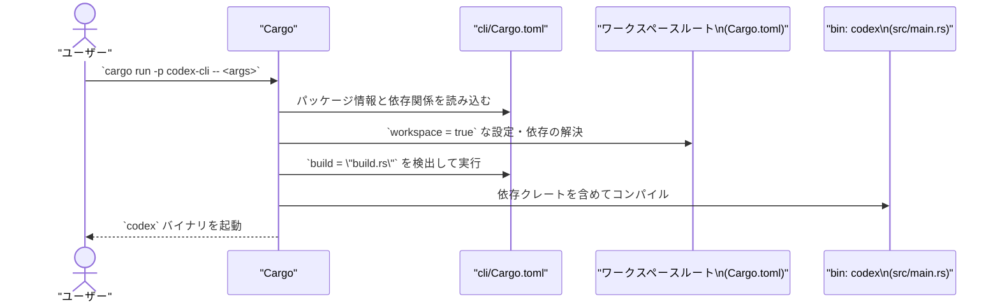

# cli/Cargo.toml コード解説

## 0. ざっくり一言

`cli/Cargo.toml` は、ワークスペース内の `codex-cli` クレートの **Cargo マニフェスト** であり、`codex` という CLI バイナリと `codex_cli` というライブラリターゲット、そしてそれらが利用できる依存クレート群を定義しています（cli/Cargo.toml:L1-12, L15-60, L63-69）。

---

## 1. このモジュールの役割

### 1.1 概要

- このファイルは、Rust/Cargo における **パッケージ定義ファイル（マニフェスト）** です（cli/Cargo.toml:L1）。
- `codex-cli` パッケージ名の下で、  
  - バイナリターゲット `codex`（cli/Cargo.toml:L7-9）  
  - ライブラリターゲット `codex_cli`（cli/Cargo.toml:L10-12）  
  をビルドするように定義しています。
- また、ワークスペース共通の設定や多数の `codex-*` 内部クレート、および標準的なユーティリティクレート（`anyhow`, `clap`, `tokio`, `tracing` など）への依存関係をまとめています（cli/Cargo.toml:L3-5, L15-60, L63-69）。

### 1.2 アーキテクチャ内での位置づけ

このファイルから読み取れる範囲では、`codex-cli` は **ワークスペース内の CLI フロントエンド** として、多数の内部クレートに依存する最上位レイヤの 1 つになっています。

主な関係:

- `codex-cli` パッケージ  
  - バイナリターゲット `codex`（cli/Cargo.toml:L7-9）
  - ライブラリターゲット `codex_cli`（cli/Cargo.toml:L10-12）
- 依存クレート群
  - `codex-*` プレフィクスの内部クレート多数（cli/Cargo.toml:L19-47）
  - 汎用ライブラリ（`anyhow`, `clap`, `tokio`, `tracing` など）（cli/Cargo.toml:L16-18, L48-60）
- Windows 向けビルドでのみ使われる `codex-windows-sandbox`（cli/Cargo.toml:L61-62）
- テスト時にのみ使われる `dev-dependencies`（cli/Cargo.toml:L63-69）

これを簡略化した依存関係図は次のようになります。

```mermaid
%% cli/Cargo.toml:L1-69
graph LR
    A["codex-cli パッケージ\n(cli/Cargo.toml)"]
    B["bin: codex\n(src/main.rs)"]
    C["lib: codex_cli\n(src/lib.rs)"]
    D["codex-* 内部クレート群\n(ワークスペース依存)"]
    E["汎用クレート群\n(anyhow, clap, tokio, tracing, ...)"]
    F["Windows 専用: codex-windows-sandbox\n(../windows-sandbox-rs)"]
    G["テスト用 dev-dependencies"]

    A --> B
    A --> C
    A --> D
    A --> E
    A --> G
    A -->|target_os = \"windows\"| F
```

> 注: `src/main.rs` / `src/lib.rs` の中身や、`codex-*` クレートの詳細な機能はこのチャンクには現れません。

### 1.3 設計上のポイント

この Cargo マニフェストから読み取れる設計上の特徴は次の通りです。

- **単一パッケージで bin + lib を提供**  
  - [[bin]] と [lib] を両方定義し、CLI 実行ファイルと再利用可能なライブラリの両方を持つ構成になっています（cli/Cargo.toml:L7-12）。
- **ワークスペース中心の構成**  
  - `version.workspace = true`, `edition.workspace = true`, `license.workspace = true` などにより、バージョン・Edition・ライセンスはワークスペースのルート設定に委譲されています（cli/Cargo.toml:L3-5）。
  - 依存クレート・開発用依存の多くも `workspace = true` によってバージョンやフラグがワークスペース側で一括管理されています（cli/Cargo.toml:L16-47, L48-60, L64-69）。
- **ビルドスクリプトの利用**  
  - `build = "build.rs"` により、ビルド時に `cli/build.rs` が実行される構成です（cli/Cargo.toml:L6）。  
    ビルドスクリプト内部の処理内容は、このチャンクには現れません。
- **Tokio のマルチスレッドランタイム機能が利用可能な設定**  
  - `tokio` 依存に `rt-multi-thread`, `signal`, `process` などの feature を有効にしており（cli/Cargo.toml:L50-56）、このパッケージ内のコードからは **マルチスレッド非同期ランタイム** を利用できる構成になっています。
- **構造化ロギング／トレース向けの依存**  
  - `tracing`, `tracing-appender`, `tracing-subscriber` が依存として追加されており（cli/Cargo.toml:L58-60）、高度なログ・トレース出力が可能な前提になっています。
- **Windows 専用のサンドボックス依存**  
  - Windows ターゲットビルド時のみ `codex-windows-sandbox`（パッケージ名は `codex_windows_sandbox`）を利用する設定になっています（cli/Cargo.toml:L61-62）。

---

## 2. 主要な機能一覧（このマニフェストが定義するコンポーネント）

このファイル自身はロジックや関数を含まず、**ビルド対象と依存関係** を定義する役割のみを持ちます。ここでは「機能」を、「ビルドされるコンポーネント」や「利用可能な技術スタック」として整理します。

- `codex` バイナリ: `src/main.rs` からビルドされる CLI 実行ファイル（cli/Cargo.toml:L7-9）。
- `codex_cli` ライブラリ: `src/lib.rs` からビルドされるライブラリターゲット（cli/Cargo.toml:L10-12）。
- ビルドスクリプト `build.rs`: ビルド時に実行される追加処理のエントリポイント（cli/Cargo.toml:L6）。
- 内部クレート群 (`codex-*`): CLI が利用可能な多数の内部機能（アプリサーバ、プロトコル、実行環境、TUI などと名前から推測されますが、詳細はこのチャンクには現れません）（cli/Cargo.toml:L19-47）。
- CLI・エラー・シリアライズ関連のユーティリティ:
  - `clap`, `clap_complete` による CLI 引数パースおよび補完スクリプト生成機能（cli/Cargo.toml:L17-18）。
  - `anyhow` によるエラー集約とコンテキスト付与（cli/Cargo.toml:L16）。
  - `serde_json`, `toml` による JSON/TOML シリアライズ・デシリアライズ（cli/Cargo.toml:L47, L57）。
- 非同期・並行処理基盤:
  - `tokio` のマルチスレッドランタイムとプロセス・シグナル機能が利用可能（cli/Cargo.toml:L50-56）。
- ロギング・トレース:
  - `tracing`, `tracing-subscriber`, `tracing-appender` による構造化ログ／トレース出力の利用可能性（cli/Cargo.toml:L58-60）。
- Windows サンドボックス連携（Windows ターゲットのみ）:
  - `codex-windows-sandbox` への依存（cli/Cargo.toml:L61-62）。
- テスト支援:
  - `assert_cmd`, `assert_matches`, `predicates`, `pretty_assertions`, `sqlx`, `codex-utils-cargo-bin` など、テスト・検証向けの dev-dependencies（cli/Cargo.toml:L63-69）。

---

## 3. 公開 API と詳細解説

このファイルには Rust の型や関数定義は含まれません。そのため、公開 API（関数・メソッド）そのものの詳細解説はできませんが、「ビルドターゲット」と「依存コンポーネント」を API 境界の単位として整理します。

### 3.1 型・コンポーネント一覧

> 注: このマニフェストには構造体や列挙体などの Rust 型定義はありません。そのため、ここでは「ビルドターゲット」「依存クレート群」をコンポーネントとして整理します。

| 名前 | 種別 | 役割 / 用途 | 定義根拠 |
|------|------|-------------|----------|
| `codex-cli` | パッケージ | この CLI クレート全体を表す Cargo パッケージ。バージョン・edition・ライセンスはワークスペース設定を継承する構成です。 | cli/Cargo.toml:L1-6 |
| `codex` | バイナリターゲット | `src/main.rs` をエントリポイントとする CLI 実行ファイル。実際のエントリ関数やロジックはこのチャンクには現れません。 | cli/Cargo.toml:L7-9 |
| `codex_cli` | ライブラリターゲット | `src/lib.rs` をルートとするライブラリ。CLI ロジックの共通部分や他クレートから再利用される処理を含む可能性がありますが、内容はこのチャンクには現れません。 | cli/Cargo.toml:L10-12 |
| `build.rs` | ビルドスクリプト | ビルド時に Cargo から呼び出されるカスタム処理のエントリポイント。コンパイル前に環境検出やコード生成などを行うために利用されることが一般的ですが、具体的な処理は不明です。 | cli/Cargo.toml:L6 |
| `codex-*` 内部クレート群 | 依存クレート（ワークスペース内） | `codex-app-server`, `codex-core`, `codex-tui` など、`codex-` プレフィクスのクレート群。名前から CLI がさまざまなアプリサーバ・実行環境・UI 機能にアクセスできるようになっていると推測されますが、具体的 API はこのチャンクには現れません。 | cli/Cargo.toml:L19-47 |
| 汎用ユーティリティクレート群 | 外部依存クレート | `anyhow`, `clap`, `clap_complete`, `libc`, `owo-colors`, `regex-lite`, `serde_json`, `supports-color`, `tempfile`, `toml`, `tokio`, `tracing*` など。CLI 実装でエラー処理、引数パース、色付き出力、正規表現、（非）同期 I/O、ロギングなどを行うために利用可能なクレート群です。 | cli/Cargo.toml:L16-18, L48-60 |
| Windows 専用 `codex-windows-sandbox` | 依存クレート（ターゲット条件付き） | `target_os = "windows"` のときにのみ有効になる依存。Windows 上でのサンドボックス実行などの OS 固有機能を提供すると想定されますが、API の詳細はこのチャンクには現れません。 | cli/Cargo.toml:L61-62 |
| テスト用 dev-dependencies | 開発用依存クレート | `assert_cmd`, `assert_matches`, `codex-utils-cargo-bin`, `predicates`, `pretty_assertions`, `sqlx` など。通常は `tests/` や `src/*` のテストコードから利用されますが、このチャンクにはテストコードは現れません。 | cli/Cargo.toml:L63-69 |

### 3.2 関数詳細（最大 7 件）

このファイルは **Cargo の設定ファイル** であり、関数やメソッドの定義を含みません。そのため、関数レベルの API についてテンプレートに沿った詳細解説は行えません。

- `src/main.rs` や `src/lib.rs` に定義されている関数・メソッドの内容は、このチャンクには現れないため不明です。
- 非同期ランタイム (`tokio`) やエラー処理 (`anyhow`) などの利用可否は分かりますが、実際にどのようなシグネチャの関数が公開されているかは読み取れません。

### 3.3 その他の関数

- このファイル内には補助関数やラッパー関数も存在しません。

---

## 4. データフロー

このファイル自体は実行時ロジックを持ちませんが、**ビルド〜実行までのフロー** において重要な役割を果たします。代表的なシナリオとして、ユーザーが `codex` CLI を実行する場合の流れを、Cargo の動作に基づいて概説します。

### 4.1 ビルド・実行までのフロー概要

1. ユーザーがワークスペースルートから `cargo run -p codex-cli -- ...` のようにコマンドを実行する。
2. Cargo は `cli/Cargo.toml` を読み取り、`codex-cli` パッケージの情報・依存関係を解決する（cli/Cargo.toml:L1-6, L15-60）。
3. ワークスペース共通設定（`workspace = true`）に基づいて、各依存クレートのバージョンや feature を決定する（cli/Cargo.toml:L3-5, L16-60, L64-69）。
4. Cargo は `build.rs` を含めてコンパイルを実行し、`src/main.rs` から `codex` バイナリを生成する（cli/Cargo.toml:L6-9）。
5. 生成された `codex` バイナリが起動し、その中で `tokio` や各 `codex-*` クレートから提供される機能が実行時に利用されます（依存関係の列挙から利用「可能」であることは分かりますが、具体的な呼び出し関係はこのチャンクには現れません）。

### 4.2 ビルド〜実行のシーケンス図



> 実行時に `Binary` からどの依存クレートのどの関数が呼ばれるかは、このファイルからは分かりません。

---

## 5. 使い方（How to Use）

### 5.1 基本的な使用方法（ビルド・実行）

このマニフェストから分かる範囲で、`codex-cli` パッケージをビルド・実行する典型的な手順を示します。

```bash
# ワークスペースルートから CLI バイナリを実行する例         # cargo ワークスペースのルートディレクトリにいる想定
cargo run -p codex-cli -- --help                             # パッケージ名 codex-cli（cli/Cargo.toml:L2）を指定し、codex バイナリを --help 付きで起動

# 単にビルドだけを行う場合                                   # 実行はせずにコンパイルだけ行いたい場合
cargo build -p codex-cli                                     # 同様にパッケージ名を指定してビルド

# Windows ターゲット用のビルド（例）                         # target_os = "windows" 用依存（cli/Cargo.toml:L61-62）が有効になるターゲット
cargo build -p codex-cli --target x86_64-pc-windows-msvc     # Windows 向けターゲットトリプルを指定
```

- 上記コマンドは Cargo の一般的な挙動に基づくもので、`cli/Cargo.toml` に記述された `name = "codex-cli"`（cli/Cargo.toml:L2）と [[bin]] セクション（cli/Cargo.toml:L7-9）を前提とします。
- `--` 以降の引数は `codex` バイナリに渡されますが、その解釈は `src/main.rs` の実装に依存します（このチャンクには現れません）。

### 5.2 よくある使用パターン

このマニフェストを前提にした典型的な利用パターンをいくつか挙げます。

1. **CLI としての利用**
   - 上記の `cargo run -p codex-cli -- ...` で `codex` コマンドを直接実行。
   - システムにインストールする場合は `cargo install --path cli` のようなコマンドが想定されますが、インストール方法はワークスペース構成によって異なり、このチャンクだけでは断定できません。

2. **ライブラリとしての利用**
   - 同一ワークスペース内の別クレートから `codex_cli` を依存として利用できる構成です（cli/Cargo.toml:L10-12）。
   - 具体的な公開関数やモジュール構成は `src/lib.rs` 以降に定義されており、このチャンクには現れません。

3. **テストの実行**
   - dev-dependencies が多数定義されていることから（cli/Cargo.toml:L63-69）、`cargo test -p codex-cli` で CLI の挙動や関連機能をテストする構成になっていると考えられます。
   - テスト内容や SQL 接続設定（`sqlx` 利用など）は、このチャンクには現れません。

### 5.3 よくある間違い（このファイル編集時に起こりうること）

この Cargo マニフェストを変更する際に起こりそうな誤用例と、その影響を整理します。

```toml
# 誤り例: bin 名を変更したのに、外部ドキュメントやスクリプトも更新しない
[[bin]]
name = "codex-cli"  # 元は "codex"（cli/Cargo.toml:L8）だが、ここを勝手に変更
path = "src/main.rs"

# 結果:
# - 生成される実行ファイル名が "codex" から "codex-cli" に変わる
# - "codex" コマンドを前提とした既存スクリプトやドキュメントが動かなくなる
```

```toml
# 誤り例: workspace = true を外して単独でバージョンを指定する
[dependencies]
anyhow = "1.0"               # 元は { workspace = true }（cli/Cargo.toml:L16）

# 結果:
# - ワークスペース内の他クレートとバージョンがずれ、コンパイルエラーや型不一致が発生する可能性がある
# - ワークスペースのポリシー（lint 設定や依存バージョン統一）から外れる
```

> いずれも、「何をすると危険か／うまく動かないか」の例であり、変更前に影響範囲（他クレート・スクリプト・CI 設定など）を確認する必要があります。

### 5.4 使用上の注意点（まとめ）

- **ワークスペース依存に強く結びついている**  
  - 多数の項目が `workspace = true` になっているため（cli/Cargo.toml:L3-5, L16-47, L48-60, L64-69）、このパッケージを単体で別のプロジェクトに持ち出してビルドすることは難しい構成です。
- **ビルドスクリプトの存在**  
  - `build.rs` が実行されるため（cli/Cargo.toml:L6）、ビルド時に任意の処理が走ることになります。セキュリティ監査やビルド再現性の観点から、`build.rs` の内容を確認する必要があります（このチャンクには内容は現れません）。
- **並行性と安全性（Tokio 利用前提）**  
  - `tokio` の `rt-multi-thread` feature が有効であるため（cli/Cargo.toml:L50-56）、コード側で Tokio ランタイムを用いると複数スレッド上で `Send` / `Sync` 制約を満たす必要があります。  
    ただし、実際にどのようなタスクが spawn されているかはこのチャンクには現れません。
- **ロギング／トレース依存**  
  - `tracing` 系クレートに依存しており（cli/Cargo.toml:L58-60）、コード変更時には `tracing` のスパンやイベントの整合性に注意すると、デバッグや運用時の可観測性が保たれます。
- **Windows 専用依存の存在**  
  - Windows ターゲットのみ有効な依存があるため（cli/Cargo.toml:L61-62）、Windows 向けビルドやテストでは、他 OS では発見できない挙動（特にサンドボックス周り）が存在しうる点に留意が必要です。

---

## 6. 変更の仕方（How to Modify）

### 6.1 新しい機能を追加する場合（CLI 側の実装を拡張する前提）

新しい CLI 機能を追加する際に、このファイルに対してどのような変更が発生しうるかを整理します。

1. **コードの追加場所**
   - 新しいサブコマンドや CLI ロジックは通常 `src/main.rs` または `src/lib.rs`（cli/Cargo.toml:L9, L12）側に追加します。
   - どちらに配置するかは、他クレートから再利用したいかどうかで決まります（このチャンクからはどちらがどう使われているかは不明です）。

2. **依存クレートの追加**
   - 新機能で外部の機能が必要になった場合、この `Cargo.toml` の `[dependencies]` にクレートを追記します（cli/Cargo.toml:L15-60）。
   - 既にワークスペースルートの `[workspace.dependencies]` に登録されているクレートであれば、`{ workspace = true }` の形で参照するのが現状の方針に合致します（cli/Cargo.toml:L16-47, L48-60）。

3. **非同期・並行処理の利用**
   - Tokio を利用した非同期タスクを追加する場合、`tokio` 依存は既に定義されているため（cli/Cargo.toml:L50-56）、基本的にはこのファイルを変更する必要はありません。
   - 追加で Tokio の別 feature が必要な場合は `features = [...]` の配列に追記する形になります。

4. **OS 固有機能の追加**
   - Windows 専用の処理をさらに追加する場合は、既存の Windows 用依存セクション（cli/Cargo.toml:L61-62）に追加するか、同様の `target.'cfg(...)'.dependencies` セクションを増やします。

### 6.2 既存の機能を変更する場合

既存 CLI の動作や構成を変更する場合、このファイルのどの部分に影響が出るかを整理します。

- **バイナリ名・ライブラリ名**
  - `[[bin]] name = "codex"` を変更すると（cli/Cargo.toml:L7-9）、生成されるコマンド名が変わります。  
    - 影響範囲: 外部スクリプトやドキュメント、ユーザーの運用手順。
  - `[lib] name = "codex_cli"` を変更すると（cli/Cargo.toml:L10-12）、他クレートからの `extern crate` / `use` の記述が変わる可能性があります。
- **依存バージョン・workspace 設定**
  - `workspace = true` をやめて個別バージョンに切り替えると（cli/Cargo.toml:L16-47, L48-60, L64-69）、ワークスペース全体の依存バージョン整合性に影響します。  
    変更前に、他クレートの依存関係も含めて再確認する必要があります。
- **ビルドスクリプトの有無**
  - `build = "build.rs"` を削除または変更すると（cli/Cargo.toml:L6）、ビルド時に行われている前処理が実行されなくなったり、エラーの原因になることがあります。  
    影響範囲を知るには、`build.rs` の実装とその出力（生成ファイルや環境変数）を確認する必要があります。
- **テスト用依存**
  - `dev-dependencies` に定義されているクレートを削除・変更する場合（cli/Cargo.toml:L63-69）、テストコードのビルド・実行が失敗する可能性があります。  
    実際にどのテストがどの依存を使っているかは、このチャンクには現れないため、テストコード側の参照を確認することが前提になります。

---

## 7. 関連ファイル

このマニフェストと密接に関係するファイル・ディレクトリを、コードから分かる範囲で示します。

| パス | 役割 / 関係 | 根拠 |
|------|-------------|------|
| `cli/src/main.rs` | バイナリターゲット `codex` のエントリポイント。CLI の `main` 関数などが定義されていると考えられます。 | cli/Cargo.toml:L7-9 |
| `cli/src/lib.rs` | ライブラリターゲット `codex_cli` のルートファイル。他クレートから再利用されるロジックや CLI 共通処理が定義されている可能性があります。 | cli/Cargo.toml:L10-12 |
| `cli/build.rs` | ビルドスクリプト。コンパイル前のコード生成や環境検出等を行う処理が記述されます。 | cli/Cargo.toml:L6 |
| `cloud-tasks/`（正確なパスは `../cloud-tasks`） | `codex-cloud-tasks` のソースディレクトリ。CLI から利用可能な内部クレートです。 | cli/Cargo.toml:L24 |
| `windows-sandbox-rs/`（正確なパスは `../windows-sandbox-rs`） | Windows 専用依存 `codex-windows-sandbox` のソースディレクトリ。Windows ターゲット時にビルドされます。 | cli/Cargo.toml:L61-62 |
| ワークスペースルート `Cargo.toml` | `version.workspace = true` や `dependencies` の `workspace = true` の実体を定義するファイル。依存クレートのバージョンや lint 設定の共通部分がここにあります。 | cli/Cargo.toml:L3-5, L16-47, L48-60, L64-69 |

> テストコード（`tests/` や `src/*` 内の `#[cfg(test)]` モジュールなど）の具体的なパス・内容は、このチャンクには現れませんが、`dev-dependencies` の存在から、そうしたテストコードが存在することが示唆されます（cli/Cargo.toml:L63-69）。
