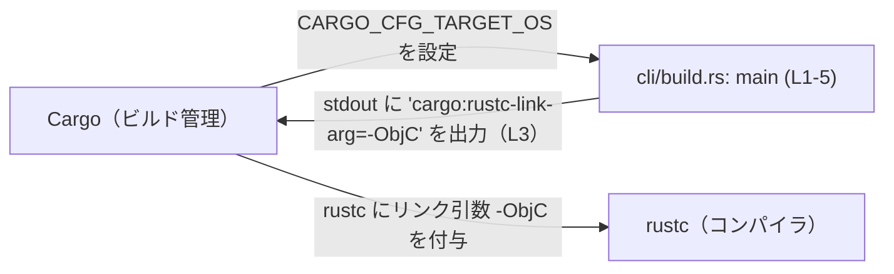
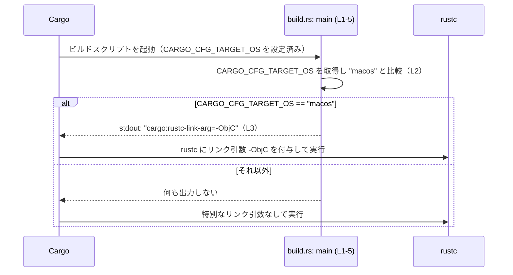

# cli/build.rs コード解説

## 0. ざっくり一言

- Cargo のビルドスクリプトとして、**ターゲット OS が macOS のときだけ Rust コンパイラに `-ObjC` というリンク引数を追加する**処理を行うファイルです（`cli/build.rs:L1-5`）。

---

## 1. このモジュールの役割

### 1.1 概要

- ファイル名が `build.rs` であることから、Cargo の規約に従うとこのファイルはクレートのビルド時に実行される「ビルドスクリプト」です。
- コード本体は、環境変数 `CARGO_CFG_TARGET_OS` を取得し、その値が `"macos"` の場合に限って **リンク引数 `-ObjC` を Rust コンパイラに指示する**行を出力します（`cli/build.rs:L2-3`）。

### 1.2 アーキテクチャ内での位置づけ

このファイルは、Cargo のビルドプロセスの中でコンパイル前に一度だけ実行され、コンパイルに使われるリンクオプションを調整する役割を持ちます。



- 他の自作モジュールやファイル名はこのチャンクには出てこないため、`cli/build.rs` がどのクレートに属するかなどの詳細な構造は不明です。

### 1.3 設計上のポイント

- **条件付き設定**  
  - ターゲット OS に応じて挙動を切り替える設計になっています（`cli/build.rs:L2`）。
- **副作用ベースの API**  
  - `println!` で Cargo 向けの特殊な文字列を標準出力に出し、その副作用によってコンパイラの挙動を変えています（`cli/build.rs:L3`）。
- **エラー処理の簡略化**  
  - `std::env::var` の失敗（環境変数未設定・非 Unicode など）は `Result` の比較で単に「macOS ではない」と同じ扱いになり、特別なエラー処理は行っていません（`cli/build.rs:L2`）。
- **状態・並行性**  
  - グローバル状態やスレッドは使用しておらず、関数内ローカルな処理のみです（`cli/build.rs:L1-5`）。

---

## 2. 主要な機能一覧

- ターゲット OS 判定: 環境変数 `CARGO_CFG_TARGET_OS` が `"macos"` かどうかを判定する（`cli/build.rs:L2`）。
- macOS 向けリンクオプション設定: macOS ターゲットの場合に、Cargo を通じて Rust コンパイラに `-ObjC` をリンク引数として渡す（`cli/build.rs:L2-3`）。

---

## 3. 公開 API と詳細解説

### 3.1 型・関数一覧（コンポーネントインベントリー）

このファイルにはユーザー定義の型（構造体・列挙体など）は登場しません。

**関数一覧（このチャンク）**

| 名前   | 種別 | 役割 / 用途                                         | 定義位置                 |
|--------|------|------------------------------------------------------|--------------------------|
| `main` | 関数 | ビルドスクリプトのエントリーポイント。OS を判定し、macOS ならリンク引数を追加する | `cli/build.rs:L1-5` |

### 3.2 `main()`

```rust
fn main() {
    if std::env::var("CARGO_CFG_TARGET_OS").as_deref() == Ok("macos") {
        println!("cargo:rustc-link-arg=-ObjC");
    }
}
```

#### 概要

- Cargo からビルドスクリプトとして呼び出されるエントリーポイントです（`cli/build.rs:L1`）。
- 環境変数 `CARGO_CFG_TARGET_OS` の値が `"macos"` であるときのみ、Cargo に対して「Rust コンパイラにリンク引数 `-ObjC` を渡す」指示を行います（`cli/build.rs:L2-3`）。

#### 引数

- 引数はありません（`fn main()` の形なので、標準的な引数なしのエントリーポイントです：`cli/build.rs:L1`）。

#### 戻り値

- 戻り値型は明示されていませんが、Rust の規約により `()`（ユニット型）になります（`cli/build.rs:L1`）。
- 戻り値は使われず、副作用（標準出力への出力）のみが目的の関数です。

#### 内部処理の流れ（アルゴリズム）

1. **ターゲット OS の環境変数取得**  
   `std::env::var("CARGO_CFG_TARGET_OS")` を呼び出し、ターゲット OS を表す文字列を `Result<String, VarError>` として取得します（`cli/build.rs:L2`）。  
   - この環境変数は、Cargo / rustc がターゲット毎に自動で設定するものです（一般的な Cargo の仕様）。
2. **参照への変換**  
   取得した `Result<String, VarError>` に対して `.as_deref()` を呼び出し、`Result<&str, VarError>` に変換します（`cli/build.rs:L2`）。  
   - これにより、所有権を移動せずに `&str` として中身を比較できます。
3. **macOS かどうかの判定**  
   `== Ok("macos")` によって、  
   - 成功していて (`Ok`) かつ  
   - その文字列が `"macos"` であるか  
   を判定します（`cli/build.rs:L2`）。  
   - それ以外（環境変数未設定や別の文字列）はすべて `false` となります。
4. **リンク引数指示の出力**  
   条件が `true` だった場合のみ、`println!("cargo:rustc-link-arg=-ObjC");` を実行します（`cli/build.rs:L2-3`）。  
   - この形式の出力は Cargo の仕様で特別扱いされ、Rust コンパイラに `-C link-arg=-ObjC` を付与する効果があります。

#### Examples（使用例）

この関数は Cargo から自動的に呼び出される前提の関数であり、通常ユーザーコードから直接呼び出すことはありません。挙動のイメージを示すための「擬似的な」例を示します。

```bash
# （概念的な例）ターゲット OS が macOS の場合
# CARGO_CFG_TARGET_OS 環境変数が "macos" に設定されている状況で build.rs が実行される
CARGO_CFG_TARGET_OS=macos cargo build
# → main が実行され、標準出力に
#    cargo:rustc-link-arg=-ObjC
#   が出力される
```

```bash
# （概念的な例）ターゲット OS が macOS 以外の場合（例: linux）
CARGO_CFG_TARGET_OS=linux cargo build
# → main は実行されるが、条件が偽になるため何も出力されない
```

#### Errors / Panics

- `std::env::var("CARGO_CFG_TARGET_OS")`  
  - 環境変数が存在しない/Unicode でない場合でも `Result` が `Err` になるだけで、panic にはなりません（`cli/build.rs:L2`）。  
  - このコードでは `Err` の場合は `"macos"` ではない扱いになるだけです。
- `println!`  
  - 標準出力の書き込みに失敗した場合に panic しうることが Rust 標準ライブラリの一般的な挙動としてありますが、このコード内で特別な対策はしていません（`cli/build.rs:L3`）。
- 明示的な `unwrap` やインデックスアクセスなどは存在しないため、エラー入力に起因する panic の可能性は低い構造です（`cli/build.rs:L1-5`）。

#### Edge cases（エッジケース）

- **`CARGO_CFG_TARGET_OS` が未設定の場合**  
  - `std::env::var` が `Err` を返し、比較結果は `false` になるため、`println!` は実行されません（`cli/build.rs:L2-3`）。
- **`CARGO_CFG_TARGET_OS` が `"macOS"`（大文字混じり）などの場合**  
  - 比較は `"macos"` と完全一致を要求するため、大小文字が異なる場合は条件が成立せず `-ObjC` は渡されません（`cli/build.rs:L2`）。
- **`CARGO_CFG_TARGET_OS` が `"ios"` や `"tvos"` など別の Apple 系 OS の場合**  
  - これらも `"macos"` とは異なるため、条件は偽になり `-ObjC` は設定されません（`cli/build.rs:L2`）。
- **環境変数が非 Unicode の場合**  
  - `std::env::var` は `Err(VarError::NotUnicode)` を返し、macOS 判定は成立しません（`cli/build.rs:L2`）。

#### 使用上の注意点

- この関数はビルドスクリプトの `main` であり、通常のアプリケーションコードから呼び出す想定ではありません。
- 標準出力に出力される行は Cargo の仕様上、**`cargo:` で始まる特殊な命令として解釈されます**。  
  - 本コードでは `cargo:rustc-link-arg=-ObjC` のみを出力しており、他の文字列は出力していません（`cli/build.rs:L3`）。
- 実行結果として付与される `-ObjC` は、macOS 用バイナリにおいて Objective-C 関連のシンボルをリンクする際によく使われるオプションです。  
  - どのライブラリのためかは、このチャンクからは分かりません。
- 他 OS 向けの挙動（Windows / Linux / iOS など）を変更したい場合は、`if` 条件を拡張する必要があります（現状は macOS のみ特別扱い：`cli/build.rs:L2-3`）。

### 3.3 その他の関数

- このファイルには `main` 以外の関数は存在しません（`cli/build.rs:L1-5`）。

---

## 4. データフロー

このセクションでは、ビルドスクリプト実行時のデータ／制御の流れをまとめます。

1. Cargo がビルド対象のターゲット OS に応じて `CARGO_CFG_TARGET_OS` 環境変数を設定します（Cargo の一般的な動作）。
2. `cli/build.rs` の `main` 関数が実行され、`CARGO_CFG_TARGET_OS` の値を取得して `"macos"` かどうかを判定します（`cli/build.rs:L1-2`）。
3. `"macos"` であれば、標準出力に `cargo:rustc-link-arg=-ObjC` が出力されます（`cli/build.rs:L3`）。
4. Cargo はこの出力を解析し、Rust コンパイラ (`rustc`) にリンク引数 `-ObjC` を付与してビルドを実行します。



---

## 5. 使い方（How to Use）

### 5.1 基本的な使用方法

- 開発者は通常、この `build.rs` を直接呼び出す必要はありません。
- Cargo の規約に従って、該当クレートを `cargo build` や `cargo run` などでビルドすると、この `main` 関数が自動的に実行されます（`cli/build.rs:L1`）。

ビルド時の全体イメージ（概念的な例）:

```bash
# ターゲット OS が macOS の場合のビルド
cargo build --target x86_64-apple-darwin
# → Cargo が CARGO_CFG_TARGET_OS=macos を設定
# → cli/build.rs の main() が実行され、-ObjC が rustc に渡される可能性がある
```

### 5.2 よくある使用パターン

このファイル単体から読み取れるのは macOS 向けのリンク引数追加のみですが、一般的な拡張パターンの例を挙げます（現在のコードには含まれていません）。

```rust
// 例: 他の OS に対しても異なるリンク引数を付けたい場合（概念例）
fn main() {
    if std::env::var("CARGO_CFG_TARGET_OS").as_deref() == Ok("macos") {
        println!("cargo:rustc-link-arg=-ObjC");
    }
    // ここに他 OS 向けの分岐を追加していくイメージ
}
```

- 実際のプロジェクトでこうした変更を行うかどうかは、このチャンクからは判断できません。

### 5.3 よくある間違い（想定される誤用）

このコード自体には誤用は含まれていませんが、同様のビルドスクリプトを書く際に起こりがちな点を、このコードと対比して説明します。

```rust
// 誤りやすい例（概念的な例）:
// stdout に人間向けメッセージを println! してしまう
println!("ビルド開始"); // Cargo による解析対象になりうる

// 本ファイルはこうなっている（cli/build.rs:L3）
println!("cargo:rustc-link-arg=-ObjC"); // Cargo 命令のみを出力
```

- Cargo は `cargo:` で始まる行を特別に扱います。人間向けメッセージは `eprintln!` で stderr に出すのが一般的ですが、このファイルにはそうしたメッセージは存在しません（`cli/build.rs:L3`）。

### 5.4 使用上の注意点（まとめ）

- **ビルドスクリプト専用**: `main` はビルドスクリプト用であり、アプリケーションのエントリーポイントではありません。
- **環境依存**: 挙動は `CARGO_CFG_TARGET_OS` の値に依存します。この環境変数が正しく設定されない特殊なビルド環境では、macOS でも `-ObjC` が付与されない可能性があります（`cli/build.rs:L2-3`）。
- **副作用のみに依存**: 関数の結果ではなく、標準出力への出力がすべての効果を持つため、変更時には `println!` の出力内容やタイミングに注意が必要です（`cli/build.rs:L3`）。

---

## 6. 変更の仕方（How to Modify）

### 6.1 新しい機能を追加する場合

このファイルに機能を追加するときの典型的な入口は `main` 関数です（`cli/build.rs:L1-5`）。

- **他 OS 向けのリンク引数追加**  
  - 例: Windows や Linux のときに別の引数を渡したい場合  
    - `if` 文を拡張し、`CARGO_CFG_TARGET_OS` の値に応じて複数の分岐を追加することが考えられます。
- **環境による挙動切り替え**  
  - 追加で独自の環境変数を読む場合は、`std::env::var` 呼び出しを増やす形になります。  
  - その際、`Err` の扱い（未設定・非 Unicode）をどうするかを明示的に決めておくと安全です。

### 6.2 既存の機能を変更する場合

- **`"macos"` 以外の判定に変更したい場合**  
  - `Ok("macos")` の文字列を変更することになりますが（`cli/build.rs:L2`）、`CARGO_CFG_TARGET_OS` の仕様に合わせる必要があります。
- **リンク引数を変更したい場合**  
  - `println!("cargo:rustc-link-arg=-ObjC");` の文字列を変更します（`cli/build.rs:L3`）。  
  - `cargo:rustc-link-arg=` のプレフィックスは Cargo が解釈するキーなので、ここを変えると挙動が変わります。
- **影響範囲の確認**  
  - このファイルから直接参照しているのは標準ライブラリ (`std::env::var`, `println!`) のみであり、プロジェクト固有の型や関数は登場しません（`cli/build.rs:L2-3`）。  
  - そのため、変更の影響は主に「ビルド時のリンクオプションが変わること」に集約されます。

---

## 7. 関連ファイル

このチャンクだけではプロジェクト全体の構造は分かりませんが、一般的な関連のされ方を示します。

| パス           | 役割 / 関係 |
|----------------|------------|
| `cli/build.rs` | 本レポートの対象ファイル。macOS 向けに `-ObjC` をリンク引数として追加するビルドスクリプト（`cli/build.rs:L1-5`）。 |
| `cli/Cargo.toml` | 一般的な Cargo プロジェクト構成では、このファイルが同じディレクトリの `build.rs` をビルドスクリプトとして認識します。ただし、このチャンクには `Cargo.toml` 自体は含まれておらず、実際に存在するかどうかは分かりません。 |

- このチャンクにはテストコードや他のモジュールへの参照は登場しないため、テストファイルやアプリケーション本体との具体的な関係は不明です。
