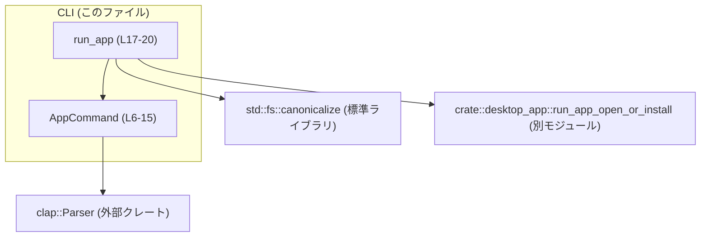
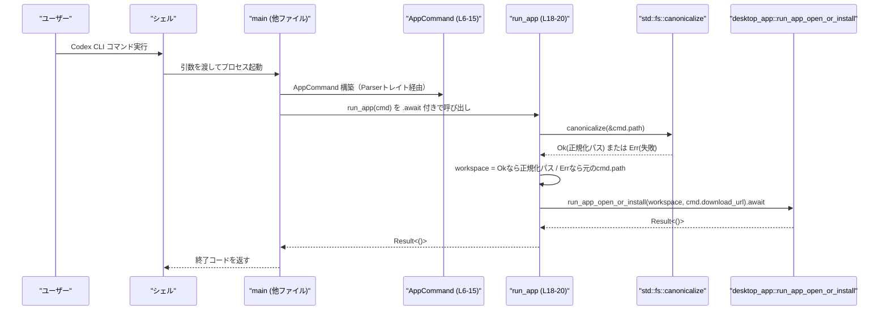

# cli/src/app_cmd.rs

## 0. ざっくり一言

Codex Desktop 用の CLI サブコマンド引数を定義し、macOS 上でワークスペースを開く／インストールを起動する非同期関数 `run_app` を提供するモジュールです（`cli/src/app_cmd.rs:L4-15`, `L17-20`）。

---

## 1. このモジュールの役割

### 1.1 概要

- このモジュールは **Codex Desktop アプリを CLI から起動するためのコマンド定義** を行い、  
  コマンドライン引数を表す `AppCommand` 構造体と、その引数に基づいてアプリを起動する **macOS 専用の非同期関数 `run_app`** を提供します（`cli/src/app_cmd.rs:L6-15`, `L17-20`）。

### 1.2 アーキテクチャ内での位置づけ

このモジュールは CLI 層に属し、以下のコンポーネントと関係します。



- `AppCommand` は `clap::Parser` を derive しており、コマンドライン引数の定義を担います（`cli/src/app_cmd.rs:L1`, `L6`）。
- `run_app` は `AppCommand` を入力に取り、`std::fs::canonicalize` でパスを正規化した上で `crate::desktop_app::run_app_open_or_install` に処理を委譲します（`cli/src/app_cmd.rs:L18-20`）。

### 1.3 設計上のポイント

- **責務**  
  - `AppCommand`: CLI 引数のスキーマ定義のみを担当（`cli/src/app_cmd.rs:L6-15`）。
  - `run_app`: パスの正規化と下位層（`desktop_app` モジュール）の起動関数呼び出しのみを担当（`cli/src/app_cmd.rs:L18-20`）。
- **状態管理**  
  - どちらも永続的な内部状態は持たず、`AppCommand` は単なるデータコンテナ、`run_app` は純粋な処理関数として設計されています。
- **エラーハンドリング**  
  - パス正規化でのエラーは `unwrap_or` により握りつぶし、元のパスを利用する方針です（`cli/src/app_cmd.rs:L19`）。
  - それ以外のエラーは `run_app_open_or_install` からの `anyhow::Result<()>` として呼び出し元へ伝播します（`cli/src/app_cmd.rs:L18-20`）。
- **並行性**  
  - `run_app` は `async fn` であり、非同期ランタイム上で実行されることを前提としています（`cli/src/app_cmd.rs:L18`）。
- **プラットフォーム依存**  
  - `run_app` は `#[cfg(target_os = "macos")]` により **macOS 限定でコンパイル** されます（`cli/src/app_cmd.rs:L17`）。

---

## 2. 主要な機能一覧

- `AppCommand`: Codex Desktop を開く際の **ワークスペースパス** と **DMG ダウンロード URL** を保持する CLI 引数定義。
- `run_app`: `AppCommand` に基づき、ワークスペースパスを正規化して **Codex Desktop を起動／インストール処理に委譲する非同期関数**（macOS 限定）。

---

## 3. 公開 API と詳細解説

### 3.1 コンポーネント一覧（構造体・関数・定数）

#### 型一覧

| 名前         | 種別     | 役割 / 用途                                                                 | 定義位置 |
|--------------|----------|-------------------------------------------------------------------------------|----------|
| `AppCommand` | 構造体   | CLI から渡されるワークスペースパスと DMG URL を保持するデータコンテナ。      | `cli/src/app_cmd.rs:L6-15` |

#### 関数一覧

| 名前       | 種別     | 役割 / 用途                                                                                   | 定義位置 |
|------------|----------|-----------------------------------------------------------------------------------------------|----------|
| `run_app`  | 関数(非同期) | `AppCommand` からワークスペースパスを正規化し、Codex Desktop の起動／インストール処理に委譲する。 | `cli/src/app_cmd.rs:L17-20` |

#### 定数一覧

| 名前                     | 種別   | 役割 / 用途                                                 | 定義位置 |
|--------------------------|--------|-------------------------------------------------------------|----------|
| `DEFAULT_CODEX_DMG_URL` | 定数   | DMG のデフォルトダウンロード URL を表す文字列。            | `cli/src/app_cmd.rs:L4` |

---

### 3.2 関数詳細

#### `run_app(cmd: AppCommand) -> anyhow::Result<()>`

**概要**

- Codex Desktop を開くための **メイン処理エントリポイント（macOS 限定）** です。
- `AppCommand` から渡されたパスを正規化し、そのパスとダウンロード URL を用いて `desktop_app` モジュールの関数を呼び出します（`cli/src/app_cmd.rs:L18-20`）。

**引数**

| 引数名 | 型           | 説明 |
|--------|--------------|------|
| `cmd`  | `AppCommand` | CLI からパースされたワークスペースパスと DMG ダウンロード URL を含む構造体（`cli/src/app_cmd.rs:L6-15`）。 |

**戻り値**

- 型: `anyhow::Result<()>`（`cli/src/app_cmd.rs:L18`）
  - 成功時: `Ok(())`
  - 失敗時: `Err(anyhow::Error)` — 失敗の原因は `crate::desktop_app::run_app_open_or_install` から伝播されると考えられます（`cli/src/app_cmd.rs:L20`）。この関数自体の内部では `canonicalize` のエラーは `Err` になりません（`unwrap_or` を使用）。

**内部処理の流れ（アルゴリズム）**

1. `cmd.path` への参照を `std::fs::canonicalize` に渡し、絶対パスなどへ正規化を試みます（`cli/src/app_cmd.rs:L19`）。
2. 正規化が成功した場合は、その結果の `PathBuf` を `workspace` として使用します。
3. 正規化が失敗した場合は、`unwrap_or(cmd.path)` により、元の `cmd.path` を `workspace` として使用します（`cli/src/app_cmd.rs:L19`）。
   - この時点で `cmd.path` の所有権は消費されます。
4. `crate::desktop_app::run_app_open_or_install(workspace, cmd.download_url)` を `await` し、  
   実際のアプリ起動またはインストール処理を実行します（`cli/src/app_cmd.rs:L20`）。
   - `workspace` と `cmd.download_url` はムーブされ、以降 `cmd` は使用されません。
5. `run_app_open_or_install` の戻り値 `anyhow::Result<()>` をそのまま呼び出し元に返します（`cli/src/app_cmd.rs:L20`）。

**Mermaid フローチャート**

```mermaid
flowchart TD
    A["run_app (L18-20) 呼び出し"] --> B["canonicalize(&cmd.path) (L19)"]
    B -->|成功 Ok(path)| C["workspace = 正規化された path (L19)"]
    B -->|失敗 Err(e)| D["workspace = cmd.path (L19)"]
    C --> E["run_app_open_or_install(workspace, cmd.download_url).await (L20)"]
    D --> E
    E --> F["Result<()> を呼び出し元へ返す (L20)"]
```

**Examples（使用例）**

この関数を利用する典型的な例として、`tokio` を用いた非同期 `main` 関数内から呼び出すコードを示します（この `main` 関数自体はこのファイルには含まれていません）。

```rust
use clap::Parser;                                      // Parserトレイトをインポート（cli/src/app_cmd.rs:L1 と同様）
use cli::app_cmd::{AppCommand, run_app};               // このモジュールの公開APIをインポート

#[tokio::main]                                         // tokioランタイム上でmainを実行
async fn main() -> anyhow::Result<()> {                // anyhow::Resultでエラーを伝播
    let cmd = AppCommand::parse();                     // clap::Parserを使ってCLI引数を構造体に変換
    run_app(cmd).await                                  // run_appをawaitしてCodex Desktopを起動
}
```

※ `AppCommand::parse()` は `clap::Parser` トレイトに由来する一般的な使い方です。

**Errors / Panics**

- `Err` になる条件（このファイルから読み取れる範囲）:
  - `crate::desktop_app::run_app_open_or_install` が `Err(anyhow::Error)` を返した場合（`cli/src/app_cmd.rs:L20`）。
- `canonicalize` によるエラー:
  - `std::fs::canonicalize(&cmd.path)` が `Err` を返しても `unwrap_or` により元の `cmd.path` が使用されるため、`run_app` の戻り値としてはエラーになりません（`cli/src/app_cmd.rs:L19`）。
- `panic` の可能性:
  - この関数内で `unwrap` や明示的な `panic!` 呼び出しは使用されていません（`cli/src/app_cmd.rs` 全体）ため、標準ライブラリや `run_app_open_or_install` 内部での `panic` を除けば、`run_app` 自身から直接 `panic` する要素はありません。

**Edge cases（エッジケース）**

- **存在しないパスが指定された場合**  
  - `canonicalize` が失敗し、`workspace` として元の `cmd.path` が使われます（`cli/src/app_cmd.rs:L19`）。その後の挙動は `run_app_open_or_install` の実装に依存します（このチャンクには現れません）。
- **パスが相対パスの場合**  
  - 正規化に成功すれば絶対パスに変換されたものが `workspace` として渡されます（`canonicalize` の一般的な挙動、`cli/src/app_cmd.rs:L19`）。
- **パスがすでに絶対パスの場合**  
  - `canonicalize` によって正規化された絶対パスが返ります。`workspace` はその値になります。
- **ダウンロード URL が未指定の場合**  
  - `AppCommand` の `download_url` フィールドに `DEFAULT_CODEX_DMG_URL` がセットされます（`cli/src/app_cmd.rs:L4`, `L12-14`）。

**使用上の注意点**

- **OS 依存**  
  - `#[cfg(target_os = "macos")]` により、この関数は macOS でのみ利用可能です。他 OS ではこのシンボルは存在しないため、条件付きコンパイルが必要になる場合があります（`cli/src/app_cmd.rs:L17`）。
- **非同期コンテキスト必須**  
  - `async fn` で定義されているため、`tokio` などの非同期ランタイム上から `.await` 付きで呼び出す必要があります（`cli/src/app_cmd.rs:L18`）。
- **パスの正規化に失敗してもエラーを返さない**  
  - `canonicalize` の失敗を無視して元パスを利用するため、ファイルシステム上で意図しないパスが渡される可能性があります。  
    例: シンボリックリンク解決や実在確認を厳密に行いたい場合はこの挙動に注意が必要です（`cli/src/app_cmd.rs:L19`）。
- **ダウンロード URL の上書き**  
  - `AppCommand` によってユーザーが任意の URL を指定できるため、信頼できない URL を渡した場合のセキュリティリスクは `run_app_open_or_install` 側で考慮する必要があります（`cli/src/app_cmd.rs:L12-14`）。

### 3.3 その他の関数

- このファイルには `run_app` 以外の関数は存在しません（`cli/src/app_cmd.rs` 全体）。

---

## 4. データフロー

ここでは、CLI から Codex Desktop を起動する際の代表的なデータフローを示します。

1. CLI ランタイムがコマンドライン引数を解析し、`AppCommand` インスタンスを構築します（`AppCommand` はこのファイルで定義、`cli/src/app_cmd.rs:L6-15`）。
2. 上位層（例: `main` 関数）から `run_app` が呼び出されます（`cli/src/app_cmd.rs:L18`）。
3. `run_app` 内で `cmd.path` が正規化され、`workspace` として `desktop_app` モジュールへ渡されます（`cli/src/app_cmd.rs:L19-20`）。
4. `desktop_app::run_app_open_or_install` が実際のアプリ起動／インストール処理を行います（このチャンクには実装は現れません）。

### Mermaid シーケンス図



---

## 5. 使い方（How to Use）

### 5.1 基本的な使用方法

このモジュールを利用した典型的なコードフローは次の通りです。

1. `AppCommand` を `clap::Parser` によって CLI 引数から構築する。
2. `run_app` に `AppCommand` を渡して `.await` する。

```rust
use clap::Parser;                                      // Parserトレイトを利用する
use cli::app_cmd::{AppCommand, run_app};               // このモジュールの型と関数をインポート

#[tokio::main]                                         // tokioランタイムで非同期mainを実行
async fn main() -> anyhow::Result<()> {                // エラーはanyhow::Resultで上位へ返す
    let cmd = AppCommand::parse();                     // CLI引数をAppCommandにパース
    run_app(cmd).await                                 // Codex Desktopを起動／インストール
}
```

### 5.2 よくある使用パターン

1. **デフォルトのワークスペース（カレントディレクトリ）を開く**

   - 引数を指定せずに CLI を実行した場合、`path` のデフォルト値 `"."` が使用されます（`cli/src/app_cmd.rs:L8-10`）。

   ```bash
   codex-cli app                                            # "." がワークスペースパスとして使用される想定
   ```

2. **特定のディレクトリをワークスペースとして開く**

   ```bash
   codex-cli app /path/to/workspace                         # path引数に絶対パス／相対パスを指定
   ```

3. **DMG ダウンロード URL を上書きして開く**

   - 上級者向けに、`--download-url` オプションで DMG ダウンロード URL を変更できます（`cli/src/app_cmd.rs:L12-14`）。

   ```bash
   codex-cli app --download-url https://example.com/Codex.dmg /path/to/workspace
   ```

### 5.3 よくある間違い

```rust
use cli::app_cmd::{AppCommand, run_app};

// 間違い例: 非同期関数をawaitせずに呼び出す
fn main() {
    let cmd = AppCommand::parse();
    run_app(cmd);                                        // ❌ コンパイルエラー: Futureを返すだけで未使用
}

// 正しい例: 非同期ランタイム上でawaitする
#[tokio::main]
async fn main() -> anyhow::Result<()> {
    let cmd = AppCommand::parse();                       // CLI引数を取得
    run_app(cmd).await                                   // ✅ 非同期に処理を完了させる
}
```

---

### 5.4 使用上の注意点（まとめ）

- `run_app` は macOS 専用であり、他の OS では利用できません（`cli/src/app_cmd.rs:L17`）。
- パス正規化に失敗してもエラーにならず、元のパスがそのまま使われます（`cli/src/app_cmd.rs:L19`）。
- `download_url` は任意の URL に変更可能なため、信頼できる URL だけを指定する前提で利用する必要があります（`cli/src/app_cmd.rs:L12-14`）。
- 非同期関数 `run_app` を呼び出すには、`tokio` などのランタイムが前提となります（`cli/src/app_cmd.rs:L18`）。

---

## 6. 変更の仕方（How to Modify）

### 6.1 新しい機能を追加する場合

例: 追加の CLI オプション（例: 起動モード）を導入する場合。

1. **`AppCommand` にフィールド追加**  
   - `pub struct AppCommand` に新しいフィールドと `#[arg(...)]` 属性を追加します（`cli/src/app_cmd.rs:L6-15`）。
2. **`run_app` の引数処理に反映**  
   - 新フィールドを `run_app` 内で利用する場合は、`cmd.フィールド名` を読み取って `run_app_open_or_install` に渡す、または別の下位関数に渡す処理を追加します（`cli/src/app_cmd.rs:L18-20`）。
3. **`desktop_app` 側のAPI変更**  
   - 新しい情報を渡す必要がある場合、`crate::desktop_app::run_app_open_or_install` のシグネチャと実装も合わせて変更する必要があります（このチャンクには実装は現れません）。

### 6.2 既存の機能を変更する場合

- **ワークスペースパスの扱いを変更する場合**
  - パスの正規化ポリシー（エラー時に `Err` を返したいなど）を変えたいときは、`canonicalize` + `unwrap_or` 部分（`cli/src/app_cmd.rs:L19`）を修正します。
    - 例えば、`?` 演算子でエラーを伝播する実装に置き換えることが考えられます。
- **デフォルト DMG URL を変更する場合**
  - `DEFAULT_CODEX_DMG_URL` の値を変更するだけで、`download_url` のデフォルトも連動して変わります（`cli/src/app_cmd.rs:L4`, `L12-14`）。
- 変更時に確認すべき点:
  - `AppCommand` を参照している箇所（他ファイル）でコンパイルエラーが発生していないか。
  - `run_app` のシグネチャを変更した場合、それを呼び出す `main` や他モジュールでの呼び出し側の修正が必要です。
  - プラットフォーム条件（`#[cfg(target_os = "macos")]`）が期待通りかを再確認します（`cli/src/app_cmd.rs:L17`）。

---

## 7. 関連ファイル・モジュール

このモジュールと密接に関係するモジュールは次の通りです（ファイルパス自体はこのチャンクには現れません）。

| パス / モジュール          | 役割 / 関係 |
|---------------------------|------------|
| `crate::desktop_app`      | `run_app_open_or_install(workspace, download_url)` を提供し、実際の Codex Desktop の起動またはインストール処理を担当します（`cli/src/app_cmd.rs:L20`）。 |
| （未特定: main 関数を含むモジュール） | `AppCommand` のパースと `run_app` の呼び出しを行うエントリポイント。具体的なファイル名やモジュール名はこのチャンクには現れません。 |

---

### Bugs / Security / Tests / パフォーマンスに関する補足（このファイルから読み取れる範囲）

- **潜在的なバグ要因**  
  - `canonicalize` のエラーを無視しているため、存在しないパスやアクセス権のないパスが指定されても `run_app` は成功する可能性があり、その後の処理で失敗するかどうかは `run_app_open_or_install` に依存します（`cli/src/app_cmd.rs:L19-20`）。
- **セキュリティ**  
  - 任意の `download_url` を受け付ける設計であり、この URL に対する検証は本モジュールでは行っていません（`cli/src/app_cmd.rs:L12-14`）。URL の妥当性・安全性チェックは下位モジュールまたはネットワーク層で行う必要があります。
- **テスト**  
  - このファイル内にテストコード（`#[test]` や `#[cfg(test)]` モジュール）は存在しません（`cli/src/app_cmd.rs` 全体）。
- **パフォーマンス / スケーラビリティ**  
  - この関数はファイルシステムへの 1 回の `canonicalize` 呼び出しと 1 回の下位API呼び出しのみであり、単体では高負荷な処理を含みません（`cli/src/app_cmd.rs:L19-20`）。  
    実際のパフォーマンスは `run_app_open_or_install` の実装に依存します。
