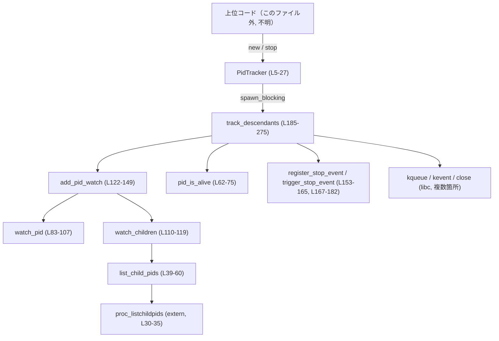
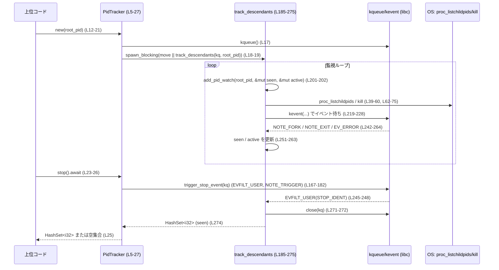

# cli/src/debug_sandbox/pid_tracker.rs

## 0. ざっくり一言

`PidTracker` は、`kqueue` と `proc_listchildpids` を使って、あるプロセス ID（PID）の「子孫プロセス」をバックグラウンドスレッドで監視し、その PID 集合を取得するためのモジュールです（`pid_tracker.rs:L5-27, L184-275`）。

---

## 1. このモジュールの役割

### 1.1 概要

- このモジュールは **あるルート PID の子プロセス・孫プロセスなどの子孫プロセスを列挙・追跡する** ために存在し、`PidTracker` 型を通じてその機能を提供します（`pid_tracker.rs:L5-10, L12-27, L184-275`）。
- バックグラウンドで `kqueue` ベースの監視ループを `tokio::task::spawn_blocking` で起動し、`NOTE_FORK` / `NOTE_EXIT` イベントや `proc_listchildpids` を利用して `HashSet<i32>`（観測した PID の集合）を構築します（`pid_tracker.rs:L18-19, L204-206, L243-264`）。
- フロント側は `PidTracker::new` と `PidTracker::stop` というシンプルな API だけで、監視の開始と終了・結果取得を行います（`pid_tracker.rs:L12-27`）。

### 1.2 アーキテクチャ内での位置づけ

このファイル内だけを見た依存関係を示します。上位からの呼び出し元はコード上には現れないため「上位コード（不明）」として表現します。



- 上位コードは `PidTracker::new` で監視を開始し、`PidTracker::stop` で監視を終了して PID 集合を取得します（`pid_tracker.rs:L12-27`）。
- 監視自体は `track_descendants` が行い、その内部で `add_pid_watch` / `watch_pid` / `watch_children` / `list_child_pids` を使って `seen` / `active` セットを更新します（`pid_tracker.rs:L184-275, L121-149, L83-107, L110-119, L39-60`）。
- 停止指示は `EVFILT_USER` イベントを送る `trigger_stop_event` 経由でバックグラウンドスレッドに通知されます（`pid_tracker.rs:L24-26, L167-182, L245-248`）。

### 1.3 設計上のポイント

- **責務の分割**（`pid_tracker.rs:L12-27, L184-275`）
  - フロントエンド: `PidTracker` が `kqueue` FD と `JoinHandle` を保持し、`new` / `stop` で監視の開始・終了を提供。
  - バックエンド: `track_descendants` が `kqueue` ループと PID 集合の構築を担う。
- **状態管理**
  - `seen: HashSet<i32>`: 一度でも観測したすべての PID（戻り値として返す集合）（`pid_tracker.rs:L198-199, L274`）。
  - `active: HashSet<i32>`: 現在 `kqueue` に watch 登録されていて、存在しているとみなす PID（`pid_tracker.rs:L199-200, L129-145, L251-253, L261-263`）。
- **エラーハンドリング方針**
  - `kqueue` の作成や `EVFILT_USER` 登録に失敗した場合は、監視を諦めて「ルート PID だけを含む集合」を返す（`pid_tracker.rs:L185-195`）。
  - `kevent` 呼び出しで `EINTR`（割り込み）なら再試行し、それ以外のエラーではループを終了する（`pid_tracker.rs:L231-236`）。
  - `watch_pid` では `ESRCH`（プロセスが存在しない）は「プロセス消滅」として扱い、それ以外のエラーは `WatchPidError::Other` としてログを出して対象 PID の監視を中止する（`pid_tracker.rs:L97-107, L135-142`）。
- **並行性**
  - 監視処理は `tokio::task::spawn_blocking` で別スレッドに載せ、非同期ランタイムのワーカースレッドをブロックしない設計です（`pid_tracker.rs:L18-19`）。
  - スレッド間の連携は `kqueue` の `EVFILT_USER` イベント経由のみで行われ、Rust の共有メモリ同期は使っていません（`pid_tracker.rs:L24-26, L167-182, L245-248`）。
- **unsafe / FFI の境界**
  - OS の C API（`proc_listchildpids`, `kqueue`, `kevent`, `kill`, `close`）へのアクセスはすべて `unsafe` ブロック内に限定されており、その周囲で結果を検査し Rust 側の型・ロジックに落とし込む構造になっています（`pid_tracker.rs:L17-19, L39-58, L65-66, L96-97, L162-163, L180-181, L205-206, L220-228, L271-272`）。

---

## 2. 主要な機能一覧

- PID 監視トラッカーの生成: `PidTracker::new` でルート PID を指定して監視を開始する（`pid_tracker.rs:L12-21`）。
- 監視の終了と結果取得: `PidTracker::stop` で停止イベントを送り、監視済み PID 集合を取得する（`pid_tracker.rs:L23-26`）。
- 子プロセス列挙: `list_child_pids` で `proc_listchildpids` をラップし、指定 PID の子プロセスを列挙する（`pid_tracker.rs:L38-60`）。
- プロセス生存確認: `pid_is_alive` で `kill(pid, 0)` を用いて PID の生死を確認する（`pid_tracker.rs:L61-75`）。
- 個々の PID 監視登録: `watch_pid` で指定 PID に対する `EVFILT_PROC` watcher を `kqueue` に追加する（`pid_tracker.rs:L82-107`）。
- 再帰的な子孫監視: `add_pid_watch` / `watch_children` で PID の子孫を辿りつつ重複を排除しながら監視対象を増やす（`pid_tracker.rs:L110-119, L121-149`）。
- 停止イベント管理: `register_stop_event` / `trigger_stop_event` で `EVFILT_USER` を使った監視ループの停止制御を行う（`pid_tracker.rs:L151-165, L167-182`）。
- 全体トラッキングループ: `track_descendants` で上述の機能を組み合わせ、`HashSet<i32>` を構築する（`pid_tracker.rs:L184-275`）。

---

## 3. 公開 API と詳細解説

### 3.1 型一覧（構造体・列挙体など）

| 名前 | 種別 | 可視性 | 役割 / 用途 | 定義位置 |
|------|------|--------|------------|----------|
| `PidTracker` | 構造体 | `pub(crate)` | ルート PID の子孫プロセスを追跡するハンドル。`kqueue` FD とバックグラウンドタスクの `JoinHandle` を保持する。 | `pid_tracker.rs:L5-10` |
| `WatchPidError` | 列挙体 | モジュール内 | `watch_pid` が PID 監視登録に失敗した際のエラー種別を表す。`ProcessGone` / `Other(io::Error)` の 2 パターン。 | `pid_tracker.rs:L77-80` |
| `STOP_IDENT` | 定数 | モジュール内 | `EVFILT_USER` 用の識別子。停止イベントを区別するために使用。 | `pid_tracker.rs:L151` |
| `tests` | モジュール | `#[cfg(test)]` | 単体テスト群。`pid_is_alive`・`list_child_pids`・`PidTracker` の動作を検証する。 | `pid_tracker.rs:L277-371` |
| `proc_listchildpids` | `extern "C"` 関数宣言 | FFI | macOS 系 OS の `proc_listchildpids` 関数への FFI 宣言。子プロセスの PID を取得する。実体は OS ライブラリ。 | `pid_tracker.rs:L30-35` |

### 3.2 関数詳細（主要 7 件）

#### `PidTracker::new(root_pid: i32) -> Option<PidTracker>`

**概要**

- 指定された `root_pid` の子孫プロセスを追跡するための `PidTracker` を生成します（`pid_tracker.rs:L12-21`）。
- 内部で `libc::kqueue()` を呼び出し、その FD と `spawn_blocking` で起動する監視タスクの `JoinHandle` を保持します（`pid_tracker.rs:L17-19`）。

**引数**

| 引数名 | 型 | 説明 |
|--------|----|------|
| `root_pid` | `i32` | 監視対象とするルートプロセスの PID。正の値のみを受け付ける（`pid_tracker.rs:L13-16`）。 |

**戻り値**

- `Some(PidTracker)`：`root_pid > 0` の場合に返される。監視タスクはこの時点で起動されている（`pid_tracker.rs:L17-21`）。
- `None`：`root_pid <= 0` の場合に返される（`pid_tracker.rs:L13-16`）。

`kqueue()` の失敗（例: FD = -1）はここでは判別せず、その値のまま `track_descendants` に渡されますが、`track_descendants` 側で `kq < 0` を検出して「root_pid のみ」を返す挙動になります（`pid_tracker.rs:L185-189`）。

**内部処理の流れ**

1. `root_pid <= 0` の場合はすぐに `None` を返す（`pid_tracker.rs:L13-16`）。
2. `unsafe { libc::kqueue() }` で `kqueue` FD を取得する（`pid_tracker.rs:L17`）。
3. `tokio::task::spawn_blocking` で `track_descendants(kq, root_pid)` を別スレッドで実行するタスクを起動する（`pid_tracker.rs:L18-19`）。
4. `PidTracker { kq, handle }` を作成し、`Some(..)` で返す（`pid_tracker.rs:L20-21`）。

**Examples（使用例）**

```rust
use cli::debug_sandbox::pid_tracker::PidTracker; // 仮のパス。実際のクレート名はこのチャンクには現れません。

#[tokio::main] // tokio ランタイム上で実行
async fn main() {
    // 現在のプロセスをルートとして監視トラッカーを生成
    let root_pid = std::process::id() as i32;          // 自プロセスの PID を取得
    let tracker = PidTracker::new(root_pid).expect("invalid root pid"); // root_pid > 0 なので Some

    // （ここで子プロセスを spawn するなど何らかの処理を行う）

    // 監視を停止して、観測された PID 集合を取得
    let seen = tracker.stop().await;                   // HashSet<i32> が返る
    println!("seen pids: {:?}", seen);                 // 観測された PID を表示
}
```

**Errors / Panics**

- 関数自体は `Result` を返さず、`panic` もしません。
- `kqueue()` が失敗してもこの関数ではエラー扱いにせず、その後 `track_descendants` が `kq < 0` を検出してフォールバック動作（root PID のみ）を行います（`pid_tracker.rs:L185-189`）。

**Edge cases（エッジケース）**

- `root_pid <= 0` の場合に `None` を返す（`pid_tracker.rs:L13-16`）。
- `kqueue()` 失敗により `kq` が負の場合でも `Some(PidTracker)` を返すが、バックグラウンドタスク内で即座に終了し、結果は `{root_pid}` のみとなる（`pid_tracker.rs:L185-189`）。

**使用上の注意点**

- `PidTracker::new` の戻り値は `Option` であり、必ず `None` ケースを処理する必要があります。
- 監視終了とリソース解放のためには、`PidTracker` に対して必ず `stop().await` を呼び出す前提で設計されています。`PidTracker` を単にドロップした場合、`kqueue` FD とバックグラウンドタスクが残り続ける可能性があります（`pid_tracker.rs:L23-26, L184-275`）。

---

#### `PidTracker::stop(self) -> HashSet<i32>`

**概要**

- `PidTracker` に紐づく監視タスクに停止イベントを送信し、その結果として観測されたすべての PID 集合を返します（`pid_tracker.rs:L23-26`）。
- このメソッドは `async fn` であり、`JoinHandle<HashSet<i32>>` の完了を `await` します。

**引数**

| 引数名 | 型 | 説明 |
|--------|----|------|
| `self` | `PidTracker`（所有権） | 自身の所有権を消費する。`stop` 後に同じトラッカーを再利用することはできない。 |

**戻り値**

- `HashSet<i32>`：監視タスクが構築した `seen` セット。ルート PID を必ず含み、観測された子孫 PID を含む場合があります（`pid_tracker.rs:L186-188, L192-195, L274`）。

`JoinHandle::await` の結果がエラー（例えばタスクパニック）だった場合は `HashSet::<i32>::default()`（空集合）を返します（`pid_tracker.rs:L25`）。

**内部処理の流れ**

1. `trigger_stop_event(self.kq)` を呼び出し、`EVFILT_USER` / `NOTE_TRIGGER` イベントを `kqueue` に投げる（`pid_tracker.rs:L24, L167-182`）。
2. バックグラウンドの `track_descendants` ループはこのイベントを受け取ると `stop_requested = true` に設定し、ループを抜ける（`pid_tracker.rs:L245-248, L266-268`）。
3. `self.handle.await` でタスクの終了を待つ（`pid_tracker.rs:L25`）。
4. `await` の結果が `Ok(HashSet<i32>)` ならその値を、`Err(_)` なら空の `HashSet` を返す（`unwrap_or_default`）（`pid_tracker.rs:L25`）。

**Examples（使用例）**

```rust
#[tokio::test]
async fn example_stop_usage() {
    let root_pid = std::process::id() as i32;                    // ルート PID を現在のプロセスにする
    let tracker = PidTracker::new(root_pid).expect("tracker");   // トラッカーを作成

    // 子プロセスを一つだけ起動する例
    let mut child = std::process::Command::new("/bin/sleep")     // /bin/sleep を実行
        .arg("0.1")                                              // 0.1 秒スリープ
        .spawn()
        .expect("spawn");

    let child_pid = child.id() as i32;                           // 子プロセスの PID を取得
    let _ = child.wait();                                        // 子プロセスの終了を待つ

    // 監視停止と結果取得
    let seen = tracker.stop().await;                             // バックグラウンドタスクが終了し、PID 集合を返す
    assert!(seen.contains(&root_pid));                           // 親 PID は含まれる想定
    assert!(seen.contains(&child_pid));                          // 子 PID も含まれている可能性が高い
}
```

**Errors / Panics**

- `trigger_stop_event` 内の `kevent` 呼び出し結果は無視されており、エラーでも panic しません（`pid_tracker.rs:L180-181`）。
- `self.handle.await.unwrap_or_default()` により、タスクが panic したりキャンセルされた場合でも空セットを返し、panic はしません（`pid_tracker.rs:L25`）。

**Edge cases（エッジケース）**

- 監視開始直後に `stop()` を呼ぶと、`track_descendants` がまだ多くの PID を観測していない可能性があり、結果セットがルート PID のみ、あるいは一部の子孫 PID のみとなることがあります（`pid_tracker.rs:L184-275`）。
- 非常に短命な子孫プロセスは、`NOTE_FORK` イベントが届く前に終了してしまうと `seen` に含まれない可能性があります（コードから観測ロジックがすべて `NOTE_FORK` / `proc_listchildpids` 依存であるため, `pid_tracker.rs:L115-117, L257-259`）。

**使用上の注意点**

- `stop` は `self` を消費してしまうため、1 つの `PidTracker` に対して複数回呼ぶことはできません。
- `stop` を呼ばずに `PidTracker` をドロップすると、バックグラウンドタスクが存続し、FD が閉じられない可能性があります。その場合の振る舞いはこのファイルからは明確に読み取れませんが、少なくとも `track_descendants` 内の `close(kq)` は呼ばれません（`pid_tracker.rs:L271-272`）。

---

#### `fn list_child_pids(parent: i32) -> Vec<i32>`

**概要**

- `proc_listchildpids` をラップし、指定親 PID の直下の子プロセス PID 一覧を `Vec<i32>` として返します（`pid_tracker.rs:L37-60`）。
- バッファサイズが足りない場合に自動的にリトライし、全ての子 PID を取得しようとします。

**引数**

| 引数名 | 型 | 説明 |
|--------|----|------|
| `parent` | `i32` | 親プロセスの PID。`proc_listchildpids` にそのまま渡される（`pid_tracker.rs:L43-47`）。 |

**戻り値**

- `Vec<i32>`：子プロセス PID のベクタ。
  - 子プロセスがいない、あるいは `proc_listchildpids` が 0 以下を返した場合は空ベクタ（`pid_tracker.rs:L48-50`）。

**内部処理の流れ**

1. 初期 `capacity` を 16 に設定する（`pid_tracker.rs:L40-41`）。
2. ループ内で `capacity` 要素分の `Vec<i32>` を確保する（`pid_tracker.rs:L42`）。
3. `proc_listchildpids` にバッファを渡し、子 PID を取得する（`pid_tracker.rs:L43-47`）。
4. `count <= 0` なら空の `Vec` を返して終了（`pid_tracker.rs:L48-50`）。
5. それ以外の場合 `returned = count as usize` とし、`returned < capacity` であれば `buf.truncate(returned)` の上で `buf` を返す（`pid_tracker.rs:L51-55`）。
6. まだバッファが足りない場合は、`capacity = capacity.saturating_mul(2).max(returned + 16)` で容量を増やしてループを継続する（`pid_tracker.rs:L56-57`）。

**Examples（使用例）**

```rust
fn example_list_children_current_process() {
    let parent_pid = std::process::id() as i32;  // 現在のプロセスを親とみなす
    let children = list_child_pids(parent_pid); // 子プロセス一覧を取得
    println!("child pids: {:?}", children);     // PID の一覧を表示
}
```

**Errors / Panics**

- FFI 呼び出し `proc_listchildpids` が失敗した場合も `count <= 0` とみなされ、空ベクタが返るだけで panic しません（`pid_tracker.rs:L48-50`）。
- この関数自体は `unsafe` な操作を内部に閉じ込めており、呼び出し側は `safe` に利用できます（`pid_tracker.rs:L39`）。

**Edge cases（エッジケース）**

- `parent` が存在しない PID の場合：`proc_listchildpids` は 0 以下を返すと想定され、結果は空ベクタとなります（`pid_tracker.rs:L48-50`）。
- 子プロセス数が非常に多い場合：`capacity` が都度倍増（ただし `saturating_mul`）しながら再試行されます（`pid_tracker.rs:L40-41, L56-57`）。
- 容量が増え続け、`usize` の最大値近くになった場合でも `saturating_mul` によってオーバーフローは発生しませんが、メモリ確保に失敗する可能性はあります。この場合の挙動（`Vec` のアロケーション失敗）はこのコードからは読み取れません。

**使用上の注意点**

- 返り値が空であっても「必ず子がいない」とは限らず、「列挙に失敗した」場合も空となる点に注意が必要です（`pid_tracker.rs:L48-50`）。
- プロセス数が多い環境では、複数回の FFI 呼び出しとメモリ再確保が行われるため、頻繁な呼び出しはコストが高くなり得ます。

---

#### `fn pid_is_alive(pid: i32) -> bool`

**概要**

- `kill(pid, 0)` を利用して、指定 PID が現在存在しているかどうかを確認します（`pid_tracker.rs:L61-75`）。

**引数**

| 引数名 | 型 | 説明 |
|--------|----|------|
| `pid` | `i32` | チェック対象の PID。非正の値は即座に「存在しない」と判定される。 |

**戻り値**

- `true`：PID が存在すると判断される場合。
  - `kill(pid, 0)` が 0 を返した場合。
  - または `kill` がエラーで `errno == EPERM`（信号送信権限がないが存在はする）と判定された場合（`pid_tracker.rs:L66-72`）。
- `false`：それ以外の場合、または `pid <= 0` の場合（`pid_tracker.rs:L62-63, L69-73`）。

**内部処理の流れ**

1. `pid <= 0` のときは `false` を返す（`pid_tracker.rs:L62-63`）。
2. `unsafe { libc::kill(pid as libc::pid_t, 0) }` を呼び出し、戻り値 `res` を取得（`pid_tracker.rs:L65-66`）。
3. `res == 0` の場合は `true` を返す（`pid_tracker.rs:L66-67`）。
4. それ以外の場合、`std::io::Error::last_os_error().raw_os_error()` が `Some(libc::EPERM)` であれば `true`、それ以外は `false` を返す（`pid_tracker.rs:L69-73`）。

**Examples（使用例）**

```rust
fn example_pid_is_alive() {
    let current = std::process::id() as i32;         // 現在の PID
    assert!(pid_is_alive(current));                  // 現在のプロセスは生存しているはず

    let invalid_pid = -1;
    assert!(!pid_is_alive(invalid_pid));             // 負の PID は常に false
}
```

**Errors / Panics**

- `pid_is_alive` 自体は panic しません。
- `kill` のエラーは `last_os_error()` で調べますが、その他のエラー種別（例: `ESRCH`）は単に `false` 判定として扱われます（`pid_tracker.rs:L69-73`）。

**Edge cases（エッジケース）**

- `pid` が現在のプロセスだが権限の問題で `EPERM` が返るケースは一般的ではありませんが、そのような場合でも `true` になります。
- `pid` がすぐに終了する短命プロセスの場合、呼び出しタイミングによって結果が変わります。この関数は「瞬間的な生存判定」であり、将来の存在を保証しません。

**使用上の注意点**

- `track_descendants` では、監視対象の `active` セットが空になった際に、ルート PID がまだ生きているかどうかの判定に使用されます（`pid_tracker.rs:L209-217`）。
- 「生存している」判定は OS とタイミングに依存するため、ロジック上はあくまで heuristics である点を前提に利用する必要があります。

---

#### `fn watch_pid(kq: libc::c_int, pid: i32) -> Result<(), WatchPidError>`

**概要**

- 指定した PID に対して `kqueue` に `EVFILT_PROC` の監視イベントを登録します（`pid_tracker.rs:L82-107`）。
- PID のフォーク・実行・終了イベントを監視するための設定を行います。

**引数**

| 引数名 | 型 | 説明 |
|--------|----|------|
| `kq` | `libc::c_int` | `kqueue` のファイルディスクリプタ。`libc::kqueue()` の戻り値（`pid_tracker.rs:L17, L184-185`）。 |
| `pid` | `i32` | 監視対象の PID。`pid <= 0` の場合は即座に `ProcessGone` エラー。 |

**戻り値**

- `Ok(())`：`kevent` による監視登録が成功した場合（`pid_tracker.rs:L96-107`）。
- `Err(WatchPidError::ProcessGone)`：
  - `pid <= 0` の場合（`pid_tracker.rs:L83-85`）。
  - または `kevent` で `errno == ESRCH`（対象 PID が存在しない）だった場合（`pid_tracker.rs:L99-101`）。
- `Err(WatchPidError::Other(err))`：その他の OS エラーの場合（`pid_tracker.rs:L101-103`）。

**内部処理の流れ**

1. `pid <= 0` なら `Err(ProcessGone)`（`pid_tracker.rs:L83-85`）。
2. `libc::kevent` 用の `kevent` 構造体を準備：
   - `ident = pid as uintptr_t`
   - `filter = EVFILT_PROC`
   - `flags = EV_ADD | EV_CLEAR`
   - `fflags = NOTE_FORK | NOTE_EXEC | NOTE_EXIT`
   （`pid_tracker.rs:L88-94`）
3. `unsafe { libc::kevent(kq, &kev, 1, null_mut(), 0, null()) }` を呼び出す（`pid_tracker.rs:L96-97`）。
4. `res < 0` の場合は `last_os_error` から `errno` を取得し、`ESRCH` なら `ProcessGone`、それ以外は `Other(err)` を返す（`pid_tracker.rs:L97-103`）。

**Examples（使用例）**

モジュール内部での典型的な呼び出し例（実際には `add_pid_watch` から呼ばれています）。

```rust
fn example_watch_pid(kq: libc::c_int, pid: i32) {
    match watch_pid(kq, pid) {
        Ok(()) => {
            // pid のフォーク・終了などが kqueue で監視されるようになった
        }
        Err(WatchPidError::ProcessGone) => {
            // プロセスが既に存在しない
        }
        Err(WatchPidError::Other(e)) => {
            eprintln!("failed to watch pid {pid}: {e}");
        }
    }
}
```

**Errors / Panics**

- `Result` を返すため、呼び出し側で明示的にエラー処理を行う必要があります。
- panic はしません。

**Edge cases（エッジケース）**

- 複数回同じ PID に対して `watch_pid` を呼んだ場合の OS 側挙動は `kqueue` の仕様に依存しますが、本モジュールでは `active` セットにより重複呼び出しを抑制しています（`pid_tracker.rs:L129-131`）。
- `kq` が無効（負値）の場合でも、`kevent` がエラーを返し、そのエラー内容に応じて `WatchPidError::Other` 等が返されます。

**使用上の注意点**

- 呼び出し側（`add_pid_watch`）では、`ProcessGone` の場合には `active` セットから PID を削除し、それ以上の処理を行いません（`pid_tracker.rs:L135-137`）。
- `Other` エラーの場合は `tracing::warn!` でログを出力しつつ、同様に対象 PID を `active` から削除します（`pid_tracker.rs:L138-142`）。

---

#### `fn add_pid_watch(kq: libc::c_int, pid: i32, seen: &mut HashSet<i32>, active: &mut HashSet<i32>)`

**概要**

- 指定 PID を監視対象に追加し、その PID の子孫も再帰的に監視対象に加えます（`pid_tracker.rs:L121-149`）。
- `seen` セットで「既に見た PID」を記録し、`active` セットで「現在監視中の PID」を管理します。

**引数**

| 引数名 | 型 | 説明 |
|--------|----|------|
| `kq` | `libc::c_int` | `kqueue` FD。 |
| `pid` | `i32` | 監視対象 PID。`pid <= 0` の場合は何もせずに return（`pid_tracker.rs:L122-124`）。 |
| `seen` | `&mut HashSet<i32>` | これまでに観測した PID の集合。 |
| `active` | `&mut HashSet<i32>` | 現在 `kqueue` で監視中の PID の集合。 |

**戻り値**

- `()`（戻り値なし）。`seen` / `active` を破壊的に更新します。

**内部処理の流れ**

1. `pid <= 0` の場合は何もせず return（`pid_tracker.rs:L122-124`）。
2. `let newly_seen = seen.insert(pid);` で、PID が初めてであれば `newly_seen = true` となる（`pid_tracker.rs:L126-127`）。
3. `let mut should_recurse = newly_seen;` として「子孫を辿るかどうか」に初期値を設定（`pid_tracker.rs:L127-128`）。
4. `if active.insert(pid)` が `true`（まだ監視していない PID）の場合：
   - `watch_pid(kq, pid)` を呼び出す（`pid_tracker.rs:L129-131`）。
   - 成功した場合は `should_recurse = true` とする（`pid_tracker.rs:L131-133`）。
   - `ProcessGone` の場合は `active` から PID を削除して return（`pid_tracker.rs:L135-137`）。
   - `Other(err)` の場合は `warn!` ログを出し、`active` から削除して return（`pid_tracker.rs:L138-142`）。
5. `should_recurse` が `true` の場合は `watch_children(kq, pid, seen, active)` を呼んで子孫に対して同じ処理を適用（`pid_tracker.rs:L146-148`）。

**Examples（使用例）**

```rust
fn example_add_pid_watch(kq: libc::c_int, root_pid: i32) {
    let mut seen = std::collections::HashSet::new();   // これまでに見た PID
    let mut active = std::collections::HashSet::new(); // 現在監視中の PID

    add_pid_watch(kq, root_pid, &mut seen, &mut active); // root_pid とその子・孫を監視登録
    println!("seen after initial watch: {:?}", seen);    // 監視登録時に発見された PID が入る
}
```

**Errors / Panics**

- `watch_pid` のエラーはすべて `WatchPidError` として処理され、panic にはなりません（`pid_tracker.rs:L129-143`）。

**Edge cases（エッジケース）**

- `seen` に既に含まれている PID に対し、かつ `active` にも含まれている場合は、`watch_pid` を再度呼ばず、`should_recurse` も `false` なので子孫探索も行われません（`pid_tracker.rs:L126-131, L146-148`）。
- 以前に監視していたが `NOTE_EXIT` により `active` から除外された PID に対して再度 `add_pid_watch` を呼ぶと、`active.insert(pid)` が `true` となり、再監視が行われます（`pid_tracker.rs:L129-131, L261-263`）。

**使用上の注意点**

- 再帰的に `watch_children` を呼ぶため、プロセスツリーが非常に深い場合には深い再帰になる可能性があります。ただし各レベルで `HashSet` による重複排除が行われます（`pid_tracker.rs:L121-149, L110-119`）。
- この関数自体はモジュール内専用であり、外部から直接呼び出す API としては想定されていません。実際の利用は `track_descendants` 経由のみです（`pid_tracker.rs:L201-202`）。

---

#### `fn track_descendants(kq: libc::c_int, root_pid: i32) -> HashSet<i32>`

**概要**

- ルート PID を起点として、その子孫プロセスを `kqueue` と `proc_listchildpids` を使って監視し、観測した PID の集合を返します（`pid_tracker.rs:L184-275`）。
- バックグラウンドスレッド上で動作し、`EVFILT_USER` による停止指示またはルート PID の終了でループを終了します。

**引数**

| 引数名 | 型 | 説明 |
|--------|----|------|
| `kq` | `libc::c_int` | `kqueue` FD。負値の場合は監視を行わずに root PID だけ返す（`pid_tracker.rs:L185-189`）。 |
| `root_pid` | `i32` | 監視の起点となる PID。 |

**戻り値**

- `HashSet<i32>`：
  - `kq < 0` または `register_stop_event` 失敗時は `{root_pid}` のみを含む集合（`pid_tracker.rs:L185-195`）。
  - 通常は、ルート PID とそこから辿れたすべての子孫 PID を含む集合（`pid_tracker.rs:L198-203, L243-264, L274`）。

**内部処理の流れ（アルゴリズム）**

1. **kqueue FD の検証と初期フォールバック**
   - `kq < 0` の場合：
     - `seen` セットを作り `root_pid` を挿入してそのまま返す（`pid_tracker.rs:L185-189`）。
2. **停止イベント登録**
   - `register_stop_event(kq)` が `false` を返した場合：
     - `seen` に `root_pid` を挿入し、`close(kq)` した上で `seen` を返す（`pid_tracker.rs:L191-196`）。
3. **状態の初期化**
   - 空の `seen` / `active` セットを作成（`pid_tracker.rs:L198-200`）。
   - `add_pid_watch(kq, root_pid, &mut seen, &mut active)` を呼び、ルート PID とその子孫を監視登録（`pid_tracker.rs:L201-202`）。
   - `EVENTS_CAP = 32` の `events: [kevent; 32]` を `MaybeUninit::zeroed` で確保（`pid_tracker.rs:L203-206`）。
4. **監視ループ**
   - `stop_requested = false` としてループ開始（`pid_tracker.rs:L208-209`）。

   4-1. **active が空の場合の処理**（`pid_tracker.rs:L209-217`）
   - `active.is_empty()` なら：
     - `!pid_is_alive(root_pid)` ならループ終了（`pid_tracker.rs:L210-212`）。
     - そうでなければ、再度 `add_pid_watch` でルート PID からの子孫監視を試みる。
     - それでも `active` が空なら `continue`。

   4-2. **kevent 呼び出し**（`pid_tracker.rs:L219-228`）
   - `kevent(kq, null, 0, events.as_mut_ptr(), EVENTS_CAP, null)` を呼び出す。
   - `nev < 0` の場合：
     - `last_os_error().kind() == Interrupted` なら `continue`（`pid_tracker.rs:L231-233`）。
     - それ以外はループを `break`（`pid_tracker.rs:L235-236`）。
   - `nev == 0` 場合は `continue`（`pid_tracker.rs:L238-240`）。

   4-3. **イベント処理**（`pid_tracker.rs:L242-264`）
   - `events.iter().take(nev as usize)` で各イベント `ev` を処理。
   - `pid = ev.ident as i32`。
   - 停止イベント判定：
     - `ev.filter == EVFILT_USER && ev.ident == STOP_IDENT` なら `stop_requested = true` にして `for` ループを `break`（`pid_tracker.rs:L245-248`）。
   - エラーイベント判定：
     - `ev.flags & EV_ERROR != 0` なら：
       - `ev.data == ESRCH` の場合は `active.remove(&pid)` して `continue`。
       - それ以外も `continue`（`pid_tracker.rs:L250-255`）。
   - フォークイベント：
     - `ev.fflags & NOTE_FORK != 0` なら `watch_children(kq, pid, &mut seen, &mut active)`（`pid_tracker.rs:L257-259`）。
   - 終了イベント：
     - `ev.fflags & NOTE_EXIT != 0` なら `active.remove(&pid)`（`pid_tracker.rs:L261-263`）。

   4-4. **停止判定**（`pid_tracker.rs:L266-268`）
   - `stop_requested` が `true` ならループを `break`。

5. **後始末と返却**
   - `close(kq)` を呼び、`seen` セットを返す（`pid_tracker.rs:L271-275`）。

**Examples（使用例）**

`track_descendants` 自体はモジュール内で `spawn_blocking` からのみ呼び出される内部関数です（`pid_tracker.rs:L18-19`）。

```rust
// モジュール内部の利用イメージ（実際のコードそのもの）
let kq = unsafe { libc::kqueue() };                     // kqueue を作成
let root_pid = std::process::id() as i32;               // ルート PID
let handle = tokio::task::spawn_blocking(move || {
    track_descendants(kq, root_pid)                     // バックグラウンドで監視ループ
});
// 後は handle.await で HashSet<i32> を受け取る
```

**Errors / Panics**

- `kevent` のエラー：
  - `EINTR` の場合はループ継続（`pid_tracker.rs:L231-233`）。
  - その他のエラーはモジュール内でログを取らず、その場でループを終了する（`pid_tracker.rs:L235-236`）。
- `MaybeUninit::zeroed().assume_init()` は `kevent` 構造体配列に対して行われていますが、その直後に `kevent` に渡して書き込ませ、読み出しは `nev` 件に限定しているため、安全な使い方になっています（`pid_tracker.rs:L203-206, L242-244`）。
- この関数自体は panic を起こすコードを含みません。

**Edge cases（エッジケース）**

- `kq < 0` または `register_stop_event` 失敗時は、監視を行わず常に `{root_pid}` のみを返す点に注意が必要です（`pid_tracker.rs:L185-195`）。
- 監視ループ中に `kevent` が継続的にエラーを返すと、早期にループが終了し、観測されていない子孫 PID が結果に含まれない可能性があります（`pid_tracker.rs:L231-236`）。
- 停止イベント (`EVFILT_USER`) を受け取った後は、それ以降の `NOTE_FORK` 等のイベントは処理されません。そのため、停止指示の直前にフォークされた子孫 PID が `seen` に含まれない場合があります（`pid_tracker.rs:L245-248, L266-268`）。

**使用上の注意点**

- 長時間実行されるループであり、`spawn_blocking` スレッド上で動く前提です。メインスレッドや tokio の非同期ワーカースレッドで直接呼び出すとブロッキングを引き起こします。
- 戻り値の `HashSet<i32>` は「その時点までに観測された PID」であり、「全ての子孫 PID を完全に列挙した結果」であることは OS レベルの制約上保証できません。

---

### 3.3 その他の関数

#### ランタイム補助関数

| 関数名 | 役割（1 行） | 定義位置 |
|--------|--------------|----------|
| `watch_children(kq, parent, seen, active)` | `list_child_pids(parent)` で列挙した子 PID を `add_pid_watch` に渡し、再帰的監視の入口とする。 | `pid_tracker.rs:L110-119` |
| `register_stop_event(kq) -> bool` | `EVFILT_USER` 用の `kevent` エントリを追加し、停止通知用イベントを登録する。成功で `true`。 | `pid_tracker.rs:L153-165` |
| `trigger_stop_event(kq)` | `EVFILT_USER` に対して `NOTE_TRIGGER` を送信し、監視ループに停止を通知する。 | `pid_tracker.rs:L167-182` |

#### テスト関数

| 関数名 | 役割（1 行） | 定義位置 |
|--------|--------------|----------|
| `pid_is_alive_detects_current_process` | 現在のプロセス PID に対して `pid_is_alive` が `true` を返すことを確認する単体テスト。 | `pid_tracker.rs:L284-287` |
| `list_child_pids_includes_spawned_child` (macOS) | 親プロセスが `sleep` 子プロセスを spawn した際に、その PID が `list_child_pids` の結果に含まれることを検証。 | `pid_tracker.rs:L291-315` |
| `pid_tracker_collects_spawned_children` (macOS, tokio) | 親プロセスが `sleep` を spawn した場合に、`PidTracker` の `seen` に親・子 PID が含まれることを検証。 | `pid_tracker.rs:L317-343` |
| `pid_tracker_collects_bash_subshell_descendants` (macOS, tokio) | `bash` のサブシェルで起動したプロセスの PID がトラッカーの `seen` に含まれることを検証。 | `pid_tracker.rs:L345-371` |

---

## 4. データフロー

### 4.1 代表的な処理シナリオ

「現在のプロセスをルートとし、子プロセスを spawn → 監視 → `stop` で結果取得」というシナリオにおけるデータと制御の流れを示します。



- `seen` と `active` の管理はバックグラウンドスレッド内（`track_descendants`）に閉じ込められており、上位コードとの間では `HashSet<i32>` のみがやり取りされます（`pid_tracker.rs:L198-200, L274`）。
- 上位コードとバックグラウンドスレッドの唯一の同期メカニズムは `EVFILT_USER` 停止イベントです（`pid_tracker.rs:L24, L245-248`）。

---

## 5. 使い方（How to Use）

### 5.1 基本的な使用方法

現在のプロセスをルートとして、子プロセスを 1 つ起動し、その PID がトラッカーに記録される基本的な例です。

```rust
use std::process::Command;               // 外部コマンド起動に使用
use std::process::Stdio;                // 標準入出力制御
use cli::debug_sandbox::pid_tracker::PidTracker; // 実際のパスはこのチャンクには現れません

#[tokio::main]                          // tokio ランタイムを起動
async fn main() -> std::io::Result<()> {
    let parent_pid = std::process::id() as i32;         // 親 PID として現在のプロセスを取得
    let tracker = PidTracker::new(parent_pid)           // トラッカーを生成
        .expect("failed to create tracker");            // root_pid <= 0 の場合は None になる

    let mut child = Command::new("/bin/sleep")          // 子プロセスとして /bin/sleep を実行
        .arg("0.1")                                     // 0.1 秒だけスリープ
        .stdin(Stdio::null())                           // 標準入力を切る
        .spawn()?;                                      // プロセスを起動

    let child_pid = child.id() as i32;                  // 子プロセス PID を取得
    let _ = child.wait()?;                              // 子プロセスの終了を待つ

    let seen = tracker.stop().await;                    // 監視を停止し、観測された PID 集合を取得

    println!("seen pids: {:?}", seen);                  // 結果表示
    assert!(seen.contains(&parent_pid));                // 親 PID が含まれていることを確認
    assert!(seen.contains(&child_pid));                 // 子 PID が含まれていることを確認

    Ok(())
}
```

### 5.2 よくある使用パターン

1. **自プロセスのサンドボックス監視**

   - 目的: CLI ツールなどが自プロセスから spawn した子・孫プロセスがどこまで派生したかを調べる。
   - パターン:
     - `root_pid = std::process::id() as i32` で `PidTracker::new`。
     - 任意の処理（子プロセス生成など）を行う。
     - 終了時に `stop().await` して `HashSet<i32>` をログなどに出力する。

2. **外部プロセスのツリー監視**

   - 目的: すでに起動している別プロセス（例えばデバッガで起動されたアプリケーション）のプロセスツリーを追跡する。
   - パターン:
     - 監視対象プロセスの PID を何らかの方法で取得し、それを `root_pid` として `PidTracker::new` に渡す。
     - プロセスが終了した後に `stop().await` で子孫 PID を取得する。
   - ただし、このモジュールが実際に外部プロセスに対して使われているかどうかは、このファイルからは分かりません。

### 5.3 よくある間違い

```rust
// 間違い例: tokio ランタイム外で async fn stop を呼ぶ
fn main() {
    let pid = std::process::id() as i32;
    let tracker = PidTracker::new(pid).unwrap();

    // let seen = tracker.stop(); // コンパイルエラー: async fn を同期コンテキストで呼んでいる
}

// 正しい例: tokio ランタイム内で .await する
#[tokio::main]
async fn main() {
    let pid = std::process::id() as i32;
    let tracker = PidTracker::new(pid).unwrap();
    let seen = tracker.stop().await; // OK
    println!("{:?}", seen);
}
```

```rust
// 間違い例: root_pid に 0 や負の値を渡す
let tracker = PidTracker::new(0);
// tracker は None になり、以後の使用はコンパイル上不可能

// 正しい例: 正の PID を渡す
let pid = std::process::id() as i32;
let tracker = PidTracker::new(pid).expect("valid pid");
```

### 5.4 使用上の注意点（まとめ）

- **非同期ランタイムの前提**
  - `PidTracker::stop` は `async fn` なので、tokio などの非同期ランタイム上で `.await` する必要があります（`pid_tracker.rs:L23-26`）。

- **リソースリークの可能性**
  - `PidTracker` を `stop()` せずにドロップした場合、`track_descendants` 内部の `close(kq)` が呼ばれず、`kqueue` FD 及びバックグラウンドタスクが存続し続ける挙動になる可能性があります（`pid_tracker.rs:L271-272`）。  
    この場合の実際の挙動は tokio の `spawn_blocking` 実装に依存し、このファイルだけからは完全には分かりません。

- **完全性の保証なし**
  - OS のタイミングやイベントロストなどにより、全ての子孫 PID を漏れなく取得できる保証はありません。`track_descendants` は `NOTE_FORK` と `proc_listchildpids` に基づくベストエフォートな集合を返していると解釈できます（`pid_tracker.rs:L115-117, L257-259`）。

- **プラットフォーム依存**
  - `kqueue`・`EVFILT_PROC`・`proc_listchildpids` は主に macOS / BSD 系の API であり、このモジュールは実質的にそれらの環境を前提にしています（`pid_tracker.rs:L30-35, L82-94`）。他 OS 向けの動作については、このファイルだけでは判断できません。

- **権限**
  - 一部の PID については、権限の制約により `kill(pid, 0)` や `proc_listchildpids` が期待通りの情報を返さない可能性があります（`pid_tracker.rs:L69-73`）。その場合、`pid_is_alive` や `list_child_pids` の結果は OS の権限設定に依存します。

---

## 6. 変更の仕方（How to Modify）

### 6.1 新しい機能を追加する場合

例として「特定の条件に合致する PID だけを `seen` に含めたい」ような機能追加を考えると、変更点の入口は以下のようになります。

1. **フィルタロジックの追加場所**
   - 子孫 PID を最初に検出するのは `list_child_pids` と `watch_children` / `add_pid_watch` です（`pid_tracker.rs:L38-60, L110-119, L121-149`）。
   - 条件に応じて `seen.insert(pid)` を行うかどうかを制御したい場合は、`add_pid_watch` の `seen.insert(pid)` 周辺を変更するのが自然です（`pid_tracker.rs:L126-128`）。

2. **停止条件の変更**
   - 監視をルート PID の終了ではなく、特定の時間経過や観測 PID 数に基づいて終了させたい場合は、`track_descendants` のメインループ終了条件を拡張する必要があります（`pid_tracker.rs:L208-269`）。

3. **API 拡張**
   - `PidTracker::new` に設定オプションを渡せるようにしたい場合、構造体に追加フィールドを設ける、もしくは別の設定型を導入して `PidTracker::with_config(config)` のようなコンストラクタを追加することになります。  
     これに伴い、`spawn_blocking` に渡すクロージャ引数も変更する必要があります（`pid_tracker.rs:L17-21`）。

### 6.2 既存の機能を変更する場合

- **契約の確認ポイント**
  - `PidTracker::new` は「`root_pid <= 0` のとき `None` を返す」という契約を持ち、それに依存した呼び出しコードやテストが存在します（`pid_tracker.rs:L13-16, L317-320, L347-348`）。この挙動を変える場合は、全呼び出し側の見直しが必要です。
  - `track_descendants` が `kq < 0` / `register_stop_event` 失敗時に `{root_pid}` を返す挙動もテストから暗黙に期待されている可能性があります（`pid_tracker.rs:L185-195`）。

- **影響範囲の確認方法**
  - このファイル内では `track_descendants` は `PidTracker::new` の `spawn_blocking` からのみ呼び出されます（`pid_tracker.rs:L18-19`）。
  - 他ファイルからの参照はこのチャンクには現れないため、実際の影響範囲はリポジトリ全体で `PidTracker` や `pid_tracker` モジュールがどこで使われているかを検索する必要があります。  

- **テストの更新**
  - 動作を変更した場合、`#[cfg(test)] mod tests` 内のテストが失敗する可能性があります。  
    - 例: 子孫 PID の含まれ方を変える場合は `pid_tracker_collects_spawned_children` / `pid_tracker_collects_bash_subshell_descendants` の期待結果を更新する必要があります（`pid_tracker.rs:L317-343, L345-371`）。

---

## 7. 関連ファイル

このチャンクから確実に分かる関連は以下の通りです。

| パス / 要素 | 役割 / 関係 |
|------------|------------|
| `cli/src/debug_sandbox/pid_tracker.rs` | 本レポート対象ファイル。`PidTracker` 実装と関連ユーティリティ・テストを含む。 |
| OS ライブラリ内 `proc_listchildpids` | 子プロセス PID 列挙 API。`unsafe extern "C"` 宣言を通じて呼び出される（`pid_tracker.rs:L30-35`）。 |
| OS カーネル `kqueue` / `kevent` | イベント通知機構。`EVFILT_PROC` / `EVFILT_USER` を用いたプロセス監視・停止通知に使用される（`pid_tracker.rs:L17, L82-94, L96-97, L153-163, L167-182, L219-228`）。 |

このチャンクには、`PidTracker` モジュールを直接インポートしている他ファイル（例えば `mod debug_sandbox;` 側）の記述は現れません。そのため、上位モジュールや CLI 全体との関係はこのファイルだけからは分かりません。
