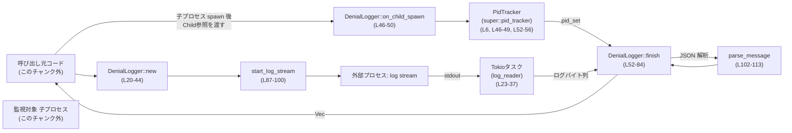
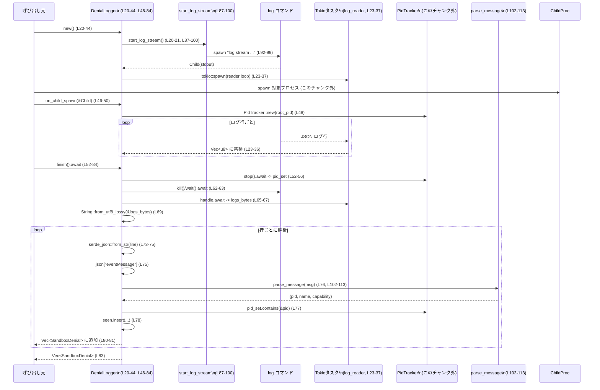

cli/src/debug_sandbox/seatbelt.rs

---

## 0. ざっくり一言

macOS の `log stream` コマンドをバックグラウンドで起動し、その出力から sandbox の deny イベントを抽出して、対象プロセスごとに一意な拒否 Capability 一覧を返すユーティリティです（`DenialLogger` と `SandboxDenial` を提供, seatbelt.rs:L8-16, L19-84）。

---

## 1. このモジュールの役割

### 1.1 概要

- このモジュールは、macOS のシステムログから sandbox 由来の拒否イベントを監視し、対象プロセスに関連するものだけを抽出するために存在します（seatbelt.rs:L87-100, L52-83）。
- `DenialLogger` が外部プロセスの PID を `PidTracker` 経由で追跡し、その PID に紐づく sandbox deny ログを JSON からパースして `SandboxDenial` 構造体として返します（seatbelt.rs:L13-17, L46-49, L52-83）。

### 1.2 アーキテクチャ内での位置づけ

- 依存関係（このファイルから見える範囲）:
  - 外部: `tokio`（非同期 I/O / 子プロセス / タスク）, `serde_json`, `regex_lite`, 標準ライブラリ, macOS の `log` コマンド。
  - 自前モジュール: `super::pid_tracker::PidTracker`（PID 集合の管理, seatbelt.rs:L6, L46-49, L52-56）。



### 1.3 設計上のポイント

- **非同期・プロセス分離**  
  - macOS の `log` コマンドを子プロセスとして起動し、その stdout を Tokio の非同期タスクで読み続けます（seatbelt.rs:L87-100, L23-37）。
- **PID ベースのフィルタリング**  
  - `PidTracker` が収集した PID 集合に含まれるものだけを sandbox deny イベントとして採用し、それ以外のログは無視します（seatbelt.rs:L52-56, L73-78）。
- **メッセージレベルのパース**  
  - システムログ行を JSON としてデコードし、その中の `"eventMessage"` フィールドから sandbox 文字列を抽出・正規表現パースする二段構えになっています（seatbelt.rs:L73-77, L102-113）。
- **一意性の担保**  
  - プロセス名と Capability の組み合わせごとに一回だけ `SandboxDenial` を生成するために `HashSet<(String, String)>` で重複排除を行っています（seatbelt.rs:L71-72, L78-81）。
- **エラー耐性重視**  
  - 外部コマンド起動やログ読み込み・パースに失敗しても panic せず、`Option` やデフォルト値でフェイルセーフに動く設計です（seatbelt.rs:L20-22, L65-67, L87-100, L102-113）。

---

## 2. 主要な機能一覧

- macOS `log stream` コマンドの起動と停止（seatbelt.rs:L87-100, L62-63）。
- `PidTracker` による監視対象プロセスの PID 収集（seatbelt.rs:L46-49, L52-56）。
- JSON ログから `"eventMessage"` を取り出し、sandbox deny メッセージを正規表現で解析（seatbelt.rs:L73-77, L102-113）。
- 対象プロセスに紐づく sandbox deny イベントを `SandboxDenial { name, capability }` として一意に収集して返却（seatbelt.rs:L8-11, L71-83）。

### 2.1 コンポーネント一覧（インベントリー）

| 名前 | 種別 | 公開範囲 | 定義位置 | 役割 / 用途 |
|------|------|----------|----------|-------------|
| `SandboxDenial` | 構造体 | `pub` | `seatbelt.rs:L8-11` | sandbox の deny イベント 1 件を表すデータ構造（プロセス名と capability）。 |
| `DenialLogger` | 構造体 | `pub` | `seatbelt.rs:L13-17` | 外部 `log` プロセスとログ読みタスク、`PidTracker` をまとめて管理し、最終的な deny 一覧を返す。 |
| `DenialLogger::new` | 関数（関連関数） | `pub(crate)` | `seatbelt.rs:L20-44` | `log stream` プロセスとログ読みタスクを起動し、`DenialLogger` を初期化する。 |
| `DenialLogger::on_child_spawn` | メソッド | `pub(crate)` | `seatbelt.rs:L46-50` | 監視対象の子プロセスの PID を `PidTracker` に登録する。 |
| `DenialLogger::finish` | 非同期メソッド | `pub(crate)` | `seatbelt.rs:L52-84` | PID セットとログを突き合わせて sandbox deny イベント一覧を構築し、`Vec<SandboxDenial>` として返す。 |
| `start_log_stream` | 関数（非公開） | `fn` | `seatbelt.rs:L87-100` | macOS `log` コマンドを `ndjson` 出力モードで起動し、`Child` を返す。 |
| `parse_message` | 関数（非公開） | `fn` | `seatbelt.rs:L102-113` | sandbox メッセージ文字列から `(pid, name, capability)` を正規表現で抽出する。 |
| `RE` | `static OnceLock<Regex>` | 非公開 | `seatbelt.rs:L105-109` | `parse_message` 用のコンパイル済み正規表現を 1 度だけ初期化して再利用する。 |

---

## 3. 公開 API と詳細解説

### 3.1 型一覧（構造体）

| 名前 | 種別 | フィールド | 定義位置 | 役割 / 用途 |
|------|------|-----------|----------|-------------|
| `SandboxDenial` | 構造体 | `name: String`, `capability: String` | `seatbelt.rs:L8-11` | sandbox により deny されたイベントのうち、プロセス名と capability 名だけを保持する軽量なデータ。 |
| `DenialLogger` | 構造体 | `log_stream: Child`, `pid_tracker: Option<PidTracker>`, `log_reader: Option<JoinHandle<Vec<u8>>>` | `seatbelt.rs:L13-17` | ログ収集のための子プロセスと、その stdout を読む Tokio タスク、および PID 管理をまとめるコンテナ。 |

> 補足: `PidTracker` の正確な型や返り値の型は、このチャンク内に定義がないため不明ですが、`stop().await` の結果が `is_empty` と `contains(&pid)` を持つ集合的な型であることは読み取れます（seatbelt.rs:L52-56, L77）。

---

### 3.2 重要関数の詳細

#### `DenialLogger::new() -> Option<Self>`

**概要**

- macOS の `log` コマンドを `ndjson` モードで起動し、その stdout を読み続ける Tokio タスクをスパンして `DenialLogger` を構築します（seatbelt.rs:L20-44, L87-100）。
- 何らかの理由でログストリームを開始できない場合は `None` を返します。

**引数**

- 引数なし。

**戻り値**

- `Option<DenialLogger>`  
  - `Some(DenialLogger)`: ログストリーム・タスクともに正常に開始できた場合。  
  - `None`: `log` プロセスの起動失敗、あるいは stdout のハンドル取得失敗などで初期化に失敗した場合（`?` / `.ok()` による早期リターン, seatbelt.rs:L20-22, L87-100）。

**内部処理の流れ**

1. `start_log_stream()` を呼び出し、`Child` を取得します（seatbelt.rs:L20-21, L87-100）。
2. その `Child` の `stdout` を `take()` し、所有権を `Tokio` タスク側に移します（seatbelt.rs:L22-23）。
3. `tokio::spawn` で非同期タスクを起動し、`BufReader` で改行ごとに `read_until(b'\n', &mut chunk)` しながらバイト列を `logs` に蓄積します（seatbelt.rs:L23-36）。
4. 終了時に `logs`（`Vec<u8>`）をタスクの戻り値として返します（seatbelt.rs:L36-37）。
5. `DenialLogger { log_stream, pid_tracker: None, log_reader: Some(log_reader) }` を構築して `Some` で包んで返します（seatbelt.rs:L39-43）。

**Examples（使用例）**

```rust
// DenialLogger を初期化し、失敗したら sandbox ログ監視を無効化する例
use cli::debug_sandbox::seatbelt::DenialLogger; // 実際のモジュールパスは crate 構成に依存します

fn setup_logger_if_available() -> Option<DenialLogger> {
    DenialLogger::new()  // seatbelt.rs:L20-44
}
```

**Errors / Panics**

- `Result` ではなく `Option` を返すため、詳細なエラー内容は失われますが、panic にはなりません。
  - `start_log_stream()` 内の `spawn().ok()` により、プロセス起動失敗時は `None`（seatbelt.rs:L98-99）。
  - `log_stream.stdout.take()?` により、stdout が存在しない場合も `None`（seatbelt.rs:L22）。
- `tokio::spawn` 内で実行される処理は、`read_until` の `Err(_)` でも panic せずループを抜けます（seatbelt.rs:L28-30）。

**Edge cases（エッジケース）**

- `log` コマンドが存在しない OS / 環境: `start_log_stream()` が `None` を返し、`DenialLogger::new()` も `None` になります（seatbelt.rs:L87-100, L20-22）。
- `log` コマンドの stdout がパイプされない場合: `stdout.take()?` が `None` になり、新規生成に失敗（seatbelt.rs:L22）。
- `Tokio` ランタイム外で `tokio::spawn` を呼び出した場合の挙動は、ランタイムの種類に依存しますが、通常はエラーになります。この点はコードからは明示されません。

**使用上の注意点**

- `DenialLogger::new()` は `Option` なので、呼び出し側で `if let Some(logger)` / `match` などでハンドリングする必要があります。
- `tokio::spawn` を使うため、Tokio ランタイム上で `DenialLogger::new()` を呼ぶことが前提です（非同期コンテキストでなくても `spawn` 自体は呼べますが、ランタイムが起動している必要があります）。
- 生成した `DenialLogger` に対して、最終的に `finish().await` を呼ばない場合、収集したログは利用されません（seatbelt.rs:L52-83）。

---

#### `DenialLogger::on_child_spawn(&mut self, child: &Child)`

**概要**

- 監視対象の子プロセスを紐づける際に呼ばれ、プロセス ID を基に `PidTracker` を初期化します（seatbelt.rs:L46-49）。

**引数**

| 引数名 | 型 | 説明 |
|--------|----|------|
| `self` | `&mut DenialLogger` | ロガー本体。内部フィールド `pid_tracker` を更新します。 |
| `child` | `&Child` | 監視したい子プロセス。`tokio::process::Child` 型（seatbelt.rs:L46）。 |

**戻り値**

- なし（`()`）。

**内部処理の流れ**

1. `child.id()` で OS のプロセス ID を `Option<u32>` として取得します（seatbelt.rs:L47）。
2. `Some(root_pid)` の場合のみ `PidTracker::new(root_pid as i32)` を呼び、その戻り値で `self.pid_tracker` を上書きします（seatbelt.rs:L47-49）。
3. `child.id()` が `None` の場合は何もせずに戻ります（seatbelt.rs:L47-49）。

**Examples（使用例）**

```rust
use tokio::process::Command;
use cli::debug_sandbox::seatbelt::DenialLogger;

async fn run_with_logging() {
    if let Some(mut logger) = DenialLogger::new() {           // seatbelt.rs:L20-44
        let mut child = Command::new("some-program")
            .spawn()
            .expect("failed to spawn");

        logger.on_child_spawn(&child);                        // seatbelt.rs:L46-50

        // 子プロセスの完了を待つ
        let _ = child.wait().await;

        let denials = logger.finish().await;                  // seatbelt.rs:L52-84
        // denials を利用する…
    }
}
```

**Errors / Panics**

- `PidTracker::new` がどのような失敗パターンを持つかは、このチャンクには定義がないため不明です（seatbelt.rs:L6, L48）。
- `child.id()` が `None` でも panic はせず、単に何もしません（seatbelt.rs:L47-49）。

**Edge cases（エッジケース）**

- `child.id()` が `None` の場合  
  → `pid_tracker` は `None` のままです。後続の `finish()` では空の PID セットを扱い、結果として空の `Vec<SandboxDenial>` を返します（seatbelt.rs:L52-56, L58-60）。
- `on_child_spawn` を複数回呼び出した場合  
  → 最後に呼び出した `child` の PID で `pid_tracker` が上書きされる挙動になります（seatbelt.rs:L48）。

**使用上の注意点**

- 監視したい子プロセスを spawn した直後に、必ず `on_child_spawn` を呼ぶ必要があります。呼ばない場合、`finish()` は常に空の結果になります（seatbelt.rs:L52-60）。
- マルチプロセスを同時に監視したい場合のサポート有無は、このチャンクだけでは分かりません（`PidTracker` の仕様による）。

---

#### `DenialLogger::finish(self) -> Vec<SandboxDenial>`（`async`）

**概要**

- ログ収集と PID 追跡を終了し、対象プロセス群の sandbox deny イベントを解析して返します（seatbelt.rs:L52-84）。
- `pid_tracker` が未設定、または PID セットが空の場合は空のベクタを返します（seatbelt.rs:L52-60）。

**引数**

| 引数名 | 型 | 説明 |
|--------|----|------|
| `self` | `mut self`（値の所有権） | `DenialLogger` の所有権をムーブし、内部リソース（子プロセス・タスク）をクリーンアップしながら結果を生成します。 |

**戻り値**

- `Vec<SandboxDenial>`  
  - 対象の PID セットに含まれるプロセスについて、一意な `(name, capability)` 組を 1 件ずつ格納したリスト（seatbelt.rs:L71-83）。

**内部処理の流れ（アルゴリズム）**

1. `self.pid_tracker` を `match` で取り出し、存在すれば `tracker.stop().await` の結果を `pid_set` に受け取ります（seatbelt.rs:L52-55）。  
   - ない場合は `Default::default()` で空集合を作成（seatbelt.rs:L55）。
2. `pid_set.is_empty()` の場合は、以降の処理を行わずに `Vec::new()` を返します（seatbelt.rs:L58-60）。
3. `self.log_stream.kill().await` と `self.log_stream.wait().await` を呼び出してログ収集用プロセスを停止し、エラーは無視します（seatbelt.rs:L62-63）。
4. `self.log_reader.take()` で `JoinHandle<Vec<u8>>` の所有権を取り出し、`.await.unwrap_or_default()` でログバイト列を取得します。無い場合は空ベクタを用います（seatbelt.rs:L65-67）。
5. `String::from_utf8_lossy(&logs_bytes)` で UTF-8 文字列に変換し、改行ごとに `logs.lines()` をループします（seatbelt.rs:L69, L73）。
6. 各行について、次を順に試みます（seatbelt.rs:L73-79）:
   - `serde_json::from_str::<serde_json::Value>(line)` に成功するか。
   - `json.get("eventMessage").and_then(|v| v.as_str())` でメッセージ文字列 `msg` を取得できるか。
   - `parse_message(msg)` で `(pid, name, capability)` を得られるか。
   - `pid_set.contains(&pid)` で PID が対象か。
   - `seen.insert((name.clone(), capability.clone()))` で、まだ同じ `(name, capability)` を見ていないか。
7. 上記をすべて満たした行に対して `SandboxDenial { name, capability }` を `denials` にプッシュします（seatbelt.rs:L80-81）。
8. 最後に `denials` を返します（seatbelt.rs:L83）。

**Examples（使用例）**

```rust
async fn collect_sandbox_denials(mut logger: DenialLogger) -> Vec<SandboxDenial> {
    // on_child_spawn により pid_tracker が設定済みである前提
    logger.finish().await  // seatbelt.rs:L52-84
}
```

**Errors / Panics**

- `log_stream.kill().await` と `log_stream.wait().await` の失敗は無視されます（戻り値を `_` に束縛, seatbelt.rs:L62-63）。
- `self.log_reader.take()` の結果が `Some` の場合でも、`handle.await` が `JoinError` を返したときには `unwrap_or_default()` により空のログ扱いとし、panic しません（seatbelt.rs:L65-67）。
- `serde_json::from_str` や `parse_message` の失敗も単にその行をスキップするだけで、エラーにはなりません（seatbelt.rs:L73-79）。

**Edge cases（エッジケース）**

- `pid_tracker` が `None` のまま `finish()` した場合  
  → `pid_set` は空集合となり、即座に空の `Vec` を返します（seatbelt.rs:L52-56, L58-60）。
- 対象 PID の sandbox deny が一度も発生しなかった場合  
  → `pid_set` は空でないが、`denials` は最終的に空のまま返されます。
- 同一プロセスから同じ capability の deny が複数回記録された場合  
  → `seen` による重複排除で 1 件だけ `SandboxDenial` が生成されます（seatbelt.rs:L71-72, L78-81）。
- ログの一部が非 UTF-8 バイト列だった場合  
  → `from_utf8_lossy` により代替文字に置き換えられ、パースに失敗した行はスキップされます（seatbelt.rs:L69, L73-79）。

**使用上の注意点**

- `finish` は `async` なので、Tokio ランタイム上で `.await` する必要があります（seatbelt.rs:L52）。
- このメソッドを呼ぶと内部の `Child` と `JoinHandle` を消費し、再利用はできません（`self` の所有権を奪う, seatbelt.rs:L52, L65）。
- `pid_set` が空の場合は早期リターンするため、ログは収集されても結果に反映されません。`on_child_spawn` の呼び忘れに注意が必要です（seatbelt.rs:L52-60）。
- `serde_json::Value` を使った柔軟なパースのため、ログフォーマット変更にある程度耐性がありますが、`eventMessage` の有無に依存しています（seatbelt.rs:L73-76）。

---

### 3.3 その他の関数

| 関数名 | シグネチャ | 役割（1行） | 定義位置 |
|--------|-----------|-------------|----------|
| `start_log_stream` | `fn start_log_stream() -> Option<Child>` | `log stream --style ndjson --predicate PREDICATE` を起動し、stdout をパイプした `Child` を返す（失敗時は `None`）（seatbelt.rs:L87-100）。 | `seatbelt.rs:L87-100` |
| `parse_message` | `fn parse_message(msg: &str) -> Option<(i32, String, String)>` | sandbox メッセージ（例: `"Sandbox: processname(1234) deny(1) capability args..."`）から `(pid, name, capability)` を正規表現で抽出する（seatbelt.rs:L102-113）。 | `seatbelt.rs:L102-113` |

`parse_message` の正規表現は `OnceLock` により 1 回だけコンパイルされ、以降は再利用されます（seatbelt.rs:L105-109）。

---

## 4. データフロー

### 4.1 代表的な処理シナリオ

対象プロセスを 1 つ spawn し、そのプロセスの sandbox deny イベントを収集する流れです。

1. 呼び出し元が `DenialLogger::new()` でロガーを作る（seatbelt.rs:L20-44）。
2. 対象プロセスを `tokio::process::Command` で spawn し、その `Child` を `on_child_spawn` に渡す（seatbelt.rs:L46-50）。
3. 別スレッド（Tokio タスク）で `log stream` の stdout が読み続けられ、バイト列として蓄積される（seatbelt.rs:L23-37, L87-100）。
4. 呼び出し元が処理の最後に `finish().await` を呼ぶと、PID セットとログを照合し、`SandboxDenial` のベクタが返る（seatbelt.rs:L52-84）。



---

## 5. 使い方（How to Use）

### 5.1 基本的な使用方法

このモジュールは crate 内部（`pub(crate)`）向けですが、典型的な利用フローは以下のようになります。

```rust
use tokio::process::Command;
use cli::debug_sandbox::seatbelt::{DenialLogger, SandboxDenial};

async fn run_with_sandbox_logging() -> std::io::Result<Vec<SandboxDenial>> {
    // 1. ロガーを初期化（失敗したら sandbox ログ監視を諦める）
    let mut logger = match DenialLogger::new() {                 // seatbelt.rs:L20-44
        Some(l) => l,
        None => {
            eprintln!("sandbox log stream unavailable");
            // 監視なしで処理を継続する設計が想定されます
            let empty: Vec<SandboxDenial> = Vec::new();
            return Ok(empty);
        }
    };

    // 2. 監視対象プロセスを起動
    let mut child = Command::new("some-sandboxed-program")
        .spawn()?;                                               // このチャンクには定義なし

    // 3. 子プロセスの PID をロガーに登録
    logger.on_child_spawn(&child);                               // seatbelt.rs:L46-50

    // 4. 子プロセス終了を待つ
    let _status = child.wait().await?;

    // 5. sandbox deny イベント一覧を取得
    let denials = logger.finish().await;                         // seatbelt.rs:L52-84

    Ok(denials)
}
```

### 5.2 よくある使用パターン

1. **監視機能が使えない場合は静かにフォールバック**

```rust
if let Some(mut logger) = DenialLogger::new() {                  // seatbelt.rs:L20-44
    // ロガーが利用可能なときだけ sandbox deny を収集する
    // ...
    let denials = logger.finish().await;                         // seatbelt.rs:L52-84
    // denials をログに出すなど
} else {
    // 何もせず続行：環境によっては sandbox ログにアクセスできないことを許容
}
```

1. **複数の処理で同じロガーを使う**

- このチャンクには具体例はありませんが、`DenialLogger` は `on_child_spawn` を呼び替えることで異なる子プロセスの PID を監視対象に切り替えることができます（ただし最後にセットされた PID に上書きされる点に注意, seatbelt.rs:L48）。

### 5.3 よくある間違い

```rust
// 間違い例: new の戻り値を無条件に unwrap してしまう
let mut logger = DenialLogger::new().unwrap();  // 環境によっては None になり得る

// 正しい例: None の可能性を考慮する
let mut logger = match DenialLogger::new() {    // seatbelt.rs:L20-44
    Some(l) => l,
    None => {
        // 監視なしで続ける、エラーを返すなど、ポリシーに応じた処理を行う
        return;
    }
};
```

```rust
// 間違い例: on_child_spawn を呼ばずに finish だけ呼ぶ
if let Some(logger) = DenialLogger::new() {   // pid_tracker が None のまま
    let denials = logger.finish().await;      // 常に空の Vec になる（seatbelt.rs:L52-60）
}

// 正しい例: spawn 後に on_child_spawn を呼び、PID を登録してから finish する
if let Some(mut logger) = DenialLogger::new() {
    let mut child = Command::new("some-program").spawn()?;
    logger.on_child_spawn(&child);
    let _ = child.wait().await;
    let denials = logger.finish().await;
}
```

### 5.4 使用上の注意点（まとめ）

- **Tokio ランタイム依存**  
  - `tokio::spawn` や `tokio::process::Child` を使用しているため、Tokio ランタイム環境での実行が前提です（seatbelt.rs:L2-4, L23, L87-100）。
- **OS 依存**  
  - `"log"` コマンドおよび `com.apple.sandbox.reporting` という predicate から、macOS 専用であることが示唆されますが、条件分岐はありません（seatbelt.rs:L90-93）。他 OS では `DenialLogger::new()` が `None` を返す可能性があります。
- **リソースクリーンアップ**  
  - `finish()` は `log` プロセスに対して `kill()` と `wait()` を呼びますが、エラーは無視されます（seatbelt.rs:L62-63）。実運用では、必要に応じて外側で追加のロギングを検討できます。
- **パース依存**  
  - ログ行が JSON でない / `eventMessage` がない / メッセージ書式が正規表現に一致しないなどの場合、その行は単にスキップされます（seatbelt.rs:L73-79, L102-113）。

---

## 6. 変更の仕方（How to Modify）

### 6.1 新しい機能を追加する場合

例: `SandboxDenial` にタイムスタンプなど追加情報を持たせたい場合。

1. **データ構造の拡張**
   - `SandboxDenial` に新しいフィールドを追加する（seatbelt.rs:L8-11）。
2. **パースロジックの変更**
   - JSON からタイムスタンプに相当するフィールドを取り出す処理を `finish()` のループ内に追加する（seatbelt.rs:L73-81）。
   - 必要に応じて `parse_message` の返り値に情報を追加する場合は、正規表現と戻り値タプルを合わせて変更する（seatbelt.rs:L102-113）。
3. **重複排除ポリシーの見直し**
   - 一意性の単位を変えたい場合、`seen: HashSet<(String, String)>` のキー構造を変更する（seatbelt.rs:L71-72, L78）。

### 6.2 既存の機能を変更する場合

- **Predicate やコマンドラインオプションを変える**
  - macOS `log` コマンドのフィルタを変更したい場合は、`PREDICATE` 定数と `.args([...])` を修正します（seatbelt.rs:L90, L92-93）。
  - 変更した predicate に対応する形で JSON の構造・`eventMessage` の書式を確認する必要があります。
- **PID セットの扱いを変更する**
  - 対象とする PID の条件（子プロセスのみ、子孫プロセスも含めるなど）は `PidTracker` 側の実装に依存します。このファイルからは挙動が分からないため、`pid_tracker.rs` 側を確認する必要があります（seatbelt.rs:L6, L46-49, L52-56）。
- **エラーハンドリング強化**
  - 現状は `Option` やデフォルト値で曖昧に失敗を扱っていますが、詳細なエラー原因を呼び出し元に返したい場合は、戻り値を `Result<_, Error>` 型に変更する必要があります（`new`, `start_log_stream`, `finish` など）。

変更時には、`DenialLogger` を利用している他モジュール（このチャンクには現れない）での呼び出し箇所とエラーハンドリングの契約が崩れないかを確認することが重要です。

---

## 7. 関連ファイル

| パス | 役割 / 関係 |
|------|------------|
| `cli/src/debug_sandbox/pid_tracker.rs` | `PidTracker` 型を提供し、監視対象プロセスの PID 集合を管理します。本モジュールの `pid_tracker` フィールドと `stop().await` 呼び出しで利用されています（seatbelt.rs:L6, L46-49, L52-56）。 |
| `tokio` クレート | 非同期 I/O (`AsyncBufReadExt`), 子プロセス (`tokio::process::Child`), タスク (`tokio::task::JoinHandle`) を提供し、本モジュールのすべての非同期処理の基盤になっています（seatbelt.rs:L2-4, L23-37, L62-67, L87-100）。 |
| `serde_json` クレート | `log stream --style ndjson` の出力行を JSON としてパースするために使用されます（seatbelt.rs:L73-75）。 |
| `regex_lite` クレート | sandbox メッセージ文字列から PID・プロセス名・capability を抽出するための正規表現エンジンとして利用されています（seatbelt.rs:L102-109）。 |

このチャンクには、`DenialLogger` を実際に呼び出している上位の CLI コマンドや debug サブコマンドの実装は現れません。そのため、どのタイミングで `finish()` が呼ばれるか等のライフサイクルは、別ファイル側の設計に依存します。
