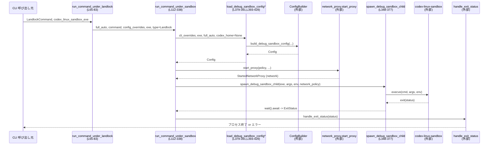

# cli/src/debug_sandbox.rs コード解説

---

## 0. ざっくり一言

このモジュールは、Codex CLI の「デバッグ用サンドボックス」機能として、**macOS (Seatbelt)**・**Linux (Landlock)**・**Windows サンドボックス**のいずれかの環境で任意コマンドを実行するためのラッパーです。  
設定 (`Config`) の読み込み、ネットワークプロキシの起動、OS ごとのサンドボックスプロセス起動までを非同期に管理します（`debug_sandbox.rs:L35-377`）。

---

## 1. このモジュールの役割

### 1.1 概要

- このモジュールは **「ユーザー指定のコマンドを、OS ごとのサンドボックスに載せて安全に実行する」** 問題を解決するために存在します。
- CLI サブコマンドから渡される `SeatbeltCommand` / `LandlockCommand` / `WindowsCommand` を受け取り、共通の処理関数 `run_command_under_sandbox` によってサンドボックスを構成・実行します（`debug_sandbox.rs:L35-103, L112-338`）。
- サンドボックス設定は `ConfigBuilder` を通じて構築され、レガシーな `sandbox_mode` と新しい **permission profiles (`default_permissions`)** の両方に対応します（`debug_sandbox.rs:L379-429, L447-453`）。

### 1.2 アーキテクチャ内での位置づけ

このモジュールは「CLI コマンド」層と「サンドボックス実装」層の間の **オーケストレーション層**に相当します。

```mermaid
graph TD
  subgraph CLI 層
    A1[SeatbeltCommand<br/>(外部定義)]
    A2[LandlockCommand<br/>(外部定義)]
    A3[WindowsCommand<br/>(外部定義)]
  end

  subgraph 本モジュール
    B1[run_command_under_seatbelt<br/>(L35-55,57-63)]
    B2[run_command_under_landlock<br/>(L65-83)]
    B3[run_command_under_windows<br/>(L85-103)]
    B4[run_command_under_sandbox<br/>(L112-338)]
    B5[load_debug_sandbox_config*\n(L379-391,L393-429)]
    B6[spawn_debug_sandbox_child<br/>(L348-377)]
  end

  subgraph 設定・ポリシー層
    C1[ConfigBuilder<br/>(codex_core)]
    C2[Config / permissions<br/>(codex_core)]
  end

  subgraph サンドボックス実装層
    D1[seatbelt / sandbox-exec<br/>(codex_sandboxing, macOS)]
    D2[codex-linux-sandbox<br/>(codex_sandboxing, Linux)]
    D3[Windows Sandbox<br/>(codex_windows_sandbox)]
  end

  A1 --> B1 --> B4
  A2 --> B2 --> B4
  A3 --> B3 --> B4

  B4 --> B5 --> C1 --> C2
  B4 --> B6 --> D1
  B4 --> B6 --> D2
  B4 --> D3
```

### 1.3 設計上のポイント

- **プラットフォームごとの差異吸収**
  - 公開関数は OS ごとに `cfg(target_os)` で切り替えつつ、内部では `SandboxType` 列挙体で統一的に扱います（`debug_sandbox.rs:L105-110`）。
  - Seatbelt / Landlock / Windows で共通化可能な部分は `run_command_under_sandbox` に集約されています（`L112-338`）。

- **非同期実行とブロッキング処理の分離**
  - サンドボックスプロセスは `tokio::process::Command` で非同期に起動・待機します（`L348-377`）。
  - Windows サンドボックスの実行は `tokio::task::spawn_blocking` でスレッドプールにオフロードし、`std::process::exit` でプロセスを終了します（`L164-195, L197-218`）。

- **設定レイヤと permission profiles 対応**
  - `ConfigBuilder` + `ConfigOverrides` で CLI オーバーライドや `sandbox_mode` を合成します（`L431-445`）。
  - `default_permissions` が設定されている場合は「permission profiles モード」とみなし、`--full-auto`（= `sandbox_mode` の自動設定）を明示的に拒否します（`L409-415`）。

- **ネットワーク制御**
  - `config.permissions.network` が存在する場合のみ、短命な **managed network proxy** を起動し、その環境変数を子プロセスに注入します（`L233-245, L248-250, L271-276, L304-307`）。
  - ネットワークサンドボックスが無効なら `CODEX_SANDBOX_NETWORK_DISABLED_ENV_VAR=1` を子プロセスに設定します（`L368-370`）。

- **安全性とリソース管理**
  - 子プロセスは `kill_on_drop(true)` により、`Child` ハンドルが drop された際に自動的に kill されます（`L372-376`）。
  - Windows 以外の OS で Windows サンドボックスを呼び出した場合は `anyhow::bail!` で早期エラーとします（`L220-223`）。
  - Landlock 用バイナリが設定されていない場合には `expect` により明示的な panic を発生させます（`L281-285`）。

---

## 2. 主要な機能一覧

- macOS Seatbelt サンドボックスでコマンドを実行（`run_command_under_seatbelt`、`debug_sandbox.rs:L35-55,57-63`）
- Linux Landlock サンドボックスでコマンドを実行（`run_command_under_landlock`、`L65-83`）
- Windows サンドボックスでコマンドを実行（`run_command_under_windows`、`L85-103`）
- 共通コアロジックによるサンドボックス実行制御（`run_command_under_sandbox`、`L112-338`）
- サンドボックス用子プロセスの生成と環境変数管理（`spawn_debug_sandbox_child`、`L348-377`）
- デバッグサンドボックス用 `Config` の構築・読み込み（`load_debug_sandbox_config*`、`L379-391, L393-429`）
- `sandbox_mode` と permission profiles の切り替えロジック（`config_uses_permission_profiles` + `load_debug_sandbox_config_with_codex_home`、`L393-429, L447-453`）
- `SandboxMode` の自動決定（`create_sandbox_mode`、`L340-346`）

---

## 3. 公開 API と詳細解説

### 3.1 型一覧

| 名前 | 種別 | 可視性 | 役割 / 用途 | 定義位置 |
|------|------|--------|-------------|----------|
| `SandboxType` | enum | モジュール内 private | どのサンドボックス実装を使うかを表す内部判別用の列挙体です。Seatbelt / Landlock / Windows を区別します。 | `debug_sandbox.rs:L105-110` |

※ `LandlockCommand` / `SeatbeltCommand` / `WindowsCommand` は他ファイルで定義され、本モジュールでは destructuring からフィールド `full_auto`, `config_overrides`, `command` を持つことだけが分かります（`L40-45, L69-73, L89-93`）。

### 3.2 関数詳細（重要な 7 件）

#### `run_command_under_seatbelt(command: SeatbeltCommand, codex_linux_sandbox_exe: Option<PathBuf>) -> anyhow::Result<()>`

**概要**

- macOS では Seatbelt サンドボックス (`sandbox-exec`) の下でコマンドを実行する入口関数です（`L35-55`）。
- macOS 以外ではサンドボックスが存在しないため、エラーとして終了します（`L57-63`）。

**引数**

| 引数名 | 型 | 説明 |
|--------|----|------|
| `command` | `SeatbeltCommand` | CLI から渡される Seatbelt 用コマンド定義。フィールドとして `full_auto`, `log_denials`, `config_overrides`, `command: Vec<String>` を持ちます（`L40-45`）。|
| `codex_linux_sandbox_exe` | `Option<PathBuf>` | Linux 用サンドボックスバイナリへのパス。Seatbelt 実行時にはほとんど意味を持たず、そのままコア関数に渡されます。|

**戻り値**

- 成功時：`Ok(())` — サンドボックス内のコマンドが終了し、`handle_exit_status` 処理まで完了したことを示します（`L337-338`）。
- 失敗時：`Err(anyhow::Error)` — 設定読み込み、サンドボックス起動、子プロセス待機などのどこかで失敗した場合です。

**内部処理の流れ**

- `SeatbeltCommand` を分解して `full_auto`, `log_denials`, `config_overrides`, `command` を取り出す（`L40-45`）。
- `run_command_under_sandbox` に
  - `sandbox_type = SandboxType::Seatbelt`
  - `log_denials` フラグ
  を渡して委譲し、その `Future` を `.await` します（`L46-55`）。
- macOS 以外では別定義により `anyhow::bail!` でエラーを返します（`L57-63`）。

**Examples（使用例）**

```rust
// SeatbeltCommand は他モジュールで構築されると仮定
async fn run() -> anyhow::Result<()> {
    let cmd: SeatbeltCommand = obtain_seatbelt_command_somehow();
    // Linux バイナリは macOS では通常不要なので None
    cli::debug_sandbox::run_command_under_seatbelt(cmd, None).await
}
```

※ `obtain_seatbelt_command_somehow` はこのチャンクには現れないヘルパーであり、実際の CLI パーサに相当します。

**Errors / Panics**

- macOS 以外の OS では、`anyhow::bail!("Seatbelt sandbox is only available on macOS")` により必ず `Err` が返ります（`L57-63`）。
- macOS の場合の具体的なエラー要因は `run_command_under_sandbox` に依存します（設定エラー、プロセス起動エラー等）。

**Edge cases**

- `command.command` が空の `Vec<String>` の場合の挙動は、このチャンクからは分かりません（サンドボックス側の実装に依存します）。
- `codex_linux_sandbox_exe` に値を渡しても、Seatbelt 経路では特に利用されていません（ただし `run_command_under_sandbox` に透過的に渡されます）。

**使用上の注意点**

- macOS 以外でこの関数を呼び出すと必ずエラーになります。プラットフォームごとに適切な関数を選択する必要があります。
- `anyhow::Result` を返す非同期関数なので、Tokio ランタイム（などの async ランタイム）上で `await` する必要があります。

---

#### `run_command_under_landlock(command: LandlockCommand, codex_linux_sandbox_exe: Option<PathBuf>) -> anyhow::Result<()>`

**概要**

- Linux 上で Landlock によるファイルシステムサンドボックスを使ってコマンドを実行する入口関数です（`L65-83`）。
- 内部では `SandboxType::Landlock` を指定して `run_command_under_sandbox` に処理を委譲します。

**引数**

| 引数名 | 型 | 説明 |
|--------|----|------|
| `command` | `LandlockCommand` | CLI から渡される Landlock 用コマンド定義。`full_auto`, `config_overrides`, `command: Vec<String>` を持ちます（`L69-73`）。|
| `codex_linux_sandbox_exe` | `Option<PathBuf>` | `codex-linux-sandbox` 実行ファイルのパス。`None` の場合は設定ファイルや環境から解決される想定です。|

**戻り値**

- 成功時：`Ok(())`
- 失敗時：`Err(anyhow::Error)`

**内部処理の流れ**

- `LandlockCommand` を分解して `full_auto`, `config_overrides`, `command` を取り出す（`L69-73`）。
- `run_command_under_sandbox` に対して
  - `sandbox_type = SandboxType::Landlock`
  - `log_denials = false`
  を指定して呼び出し、その `Future` を `.await` します（`L74-82`）。

**Errors / Panics**

- `run_command_under_sandbox` 内で、`config.codex_linux_sandbox_exe` が `None` の場合、`expect("codex-linux-sandbox executable not found")` により panic します（`L281-285`）。
- 設定構築失敗、子プロセス起動失敗、ネットワークプロキシ起動失敗などは `Err(anyhow::Error)` として伝播します（`L120-127, L233-245, L322-323`）。

**Edge cases**

- `codex_linux_sandbox_exe` を `None` にしたまま、設定側でもパスが未設定のケースでは panic になります（`L281-285`）。
- `full_auto = true` かつ permission profiles が有効 (`default_permissions` 定義あり) の場合、`load_debug_sandbox_config_with_codex_home` で `anyhow::bail!` が返り、実行前にエラーとなります（`L409-415`）。

**使用上の注意点**

- Landlock 対応は Linux を前提としており、他 OS での挙動はこのチャンクからは分かりません（ビルド時に `cfg` で分岐している可能性があります）。
- `codex-linux-sandbox` バイナリの配置・設定が正しく行われていることが前提条件です（`L281-285`）。

---

#### `run_command_under_windows(command: WindowsCommand, codex_linux_sandbox_exe: Option<PathBuf>) -> anyhow::Result<()>`

**概要**

- Windows のサンドボックス環境（`codex_windows_sandbox`）でコマンドを実行する入口関数です（`L85-103`）。
- 内部で `SandboxType::Windows` を指定して `run_command_under_sandbox` に処理を委譲します。

**引数**

| 引数名 | 型 | 説明 |
|--------|----|------|
| `command` | `WindowsCommand` | Windows サンドボックス用コマンド定義。`full_auto`, `config_overrides`, `command: Vec<String>` を持ちます（`L89-93`）。|
| `codex_linux_sandbox_exe` | `Option<PathBuf>` | Windows 経路では使用されませんが、インターフェースを揃えるために存在します。|

**戻り値**

- 成功時：`Ok(())`（ただし Windows 経路では内部で `std::process::exit` が呼ばれるため、実際に呼び出し元には戻りません、`L218`）
- 失敗時：`Err(anyhow::Error)`（Windows 以外の OS で呼び出した場合など）

**内部処理の流れ**

- `WindowsCommand` を分解し、`run_command_under_sandbox` に `SandboxType::Windows` を指定して呼び出します（`L89-103`）。
- 実際の Windows サンドボックス処理は `run_command_under_sandbox` 内の特別分岐で行われます（`L142-224`）。

**Errors / Panics**

- 非 Windows OS でビルドしたバイナリでは、`cfg(not(target_os = "windows"))` 分岐で `anyhow::bail!("Windows sandbox is only available on Windows")` が実行され、`Err` が返ります（`L220-223`）。
- Windows 上では、サンドボックス処理中のエラーは標準エラー出力にメッセージを出した後、`std::process::exit(1)` でプロセスが終了します（`L197-206`）。

**Edge cases**

- Windows 経路では、`run_command_under_sandbox` からは戻らず `std::process::exit` によってプロセスが終了するため、「呼び出し元で後処理を実行する」ことはできません（`L218`）。
- Windows サンドボックスの Elevation レベルは `WindowsSandboxLevel::from_config(&config)` から決定され、`Elevated` の場合は `run_windows_sandbox_capture_elevated` が使われます（`L151-161, L165-181`）。

**使用上の注意点**

- Windows 上では、この関数を呼ぶと現在プロセスが終了する設計になっています。CLI エントリポイントなどから直接呼び出すことが前提です。
- 非同期関数ですが、Windows パスでは `std::process::exit` により関数から戻りません。`await` の有無にかかわらずプロセス終了する点に留意が必要です。

---

#### `run_command_under_sandbox(...) -> anyhow::Result<()>`

```rust
async fn run_command_under_sandbox(
    full_auto: bool,
    command: Vec<String>,
    config_overrides: CliConfigOverrides,
    codex_linux_sandbox_exe: Option<PathBuf>,
    sandbox_type: SandboxType,
    log_denials: bool,
) -> anyhow::Result<()>  // debug_sandbox.rs:L112-119
```

**概要**

- 3 種類のサンドボックス（Seatbelt / Landlock / Windows）に共通するコア処理です（`L112-338`）。
- 設定の読み込み、環境変数の構築、ネットワークプロキシの起動、サンドボックスプロセスの起動・待機、終了コード処理までを一括して行います。

**引数**

| 引数名 | 型 | 説明 |
|--------|----|------|
| `full_auto` | `bool` | レガシー `sandbox_mode` を自動選択するかどうか（`create_sandbox_mode` 参照、`L340-346`）。|
| `command` | `Vec<String>` | 実行する子プロセスのコマンドライン（プログラム名＋引数）です（`L114`）。|
| `config_overrides` | `CliConfigOverrides` | CLI からの設定オーバーライド。`parse_overrides` で内部 TOML 形式に変換されます（`L115, L121-123`）。|
| `codex_linux_sandbox_exe` | `Option<PathBuf>` | Landlock 用 `codex-linux-sandbox` 実行ファイルのパス（`L116`）。|
| `sandbox_type` | `SandboxType` | どのサンドボックス実装を使うか（Seatbelt / Landlock / Windows）（`L117`）。|
| `log_denials` | `bool` | macOS で Seatbelt の deny ログを収集するかどうか（`L118, L226-229, L324-335`）。|

**戻り値**

- 成功時：`Ok(())`
- 失敗時：`Err(anyhow::Error)`

**内部処理の流れ（要約）**

1. **Config の読み込み**  
   `config_overrides.parse_overrides()` を実行し、CLI オーバーライドを TOML 値に変換、`load_debug_sandbox_config` に渡して `Config` を非同期に構築します（`L120-127`）。

2. **カレントディレクトリ関連の決定**  
   - 実行用 `cwd = config.cwd.clone()`（`L131`）。
   - サンドボックスポリシーに用いる `sandbox_policy_cwd = cwd.clone()` を同一に設定（`L135`）。

3. **環境変数マップの作成**  
   - `create_env(&config.permissions.shell_environment_policy, None)` によりサンドボックスで使う環境変数を生成します（`L137-140`）。

4. **Windows サンドボックスの特別扱い**  
   - `if let SandboxType::Windows = sandbox_type` 分岐（`L143-224`）。
   - Windows のみ `tokio::task::spawn_blocking` で `run_windows_sandbox_capture` または `run_windows_sandbox_capture_elevated` を実行し、標準出力・標準エラーを親プロセスに書き戻した後、`std::process::exit` で終了（`L164-218`）。
   - 非 Windows OS ではこの経路を取ると `anyhow::bail!`（`L220-223`）。

5. **macOS の deny ログ準備**  
   - macOS の場合のみ `log_denials` に応じて `DenialLogger` を初期化（`L226-229`）。

6. **ネットワークプロキシの起動（必要な場合）**  
   - `config.permissions.network` が `Some` のとき `spec.start_proxy(...)` を `await` で起動し、エラー時には `anyhow::anyhow!` でラップして返します（`L233-245`）。
   - `StartedNetworkProxy::proxy` を使って子プロセスに適用するためのハンドルを取得（`L248-250`）。

7. **サンドボックスプロセスの構築・起動**
   - `match sandbox_type` で Seatbelt / Landlock / Windows に分岐（`L252-315`）。
   - Seatbelt:
     - `create_seatbelt_command_args_for_policies(...)` で引数を構築（`L255-262`）。
     - `spawn_debug_sandbox_child("/usr/bin/sandbox-exec", ...)` により子プロセスを起動。`CODEX_SANDBOX_ENV_VAR="seatbelt"` やネットワーク環境変数を注入（`L263-278`）。
   - Landlock:
     - `config.codex_linux_sandbox_exe.expect(...)` でバイナリパスを取得（`L281-285`）。
     - `create_linux_sandbox_command_args_for_policies(...)` で引数を構築（`L286-295`）。
     - `spawn_debug_sandbox_child(codex_linux_sandbox_exe, ...)` により子プロセスを起動し、ネットワーク環境変数を注入（`L296-310`）。
   - Windows:
     - `unreachable!` — この時点までに Windows 分岐は終了している前提（`L312-314`）。

8. **子プロセス完了待ちと deny ログ出力**
   - macOS: `DenialLogger::on_child_spawn(&child)` で PID を登録（`L317-320`）。
   - `child.wait().await?` で子プロセスの終了を非同期に待機（`L322`）。
   - macOS: `denial_logger.finish().await` で deny ログを収集し、標準エラーに整形出力（`L324-335`）。

9. **終了ステータス処理**
   - `handle_exit_status(status)` を呼び出し、終了コード等に応じた共通処理を行います（`L337-338`）。

**Errors / Panics**

- `load_debug_sandbox_config` や `spec.start_proxy` でエラーが発生すると `Err(anyhow::Error)` が返ります（`L120-127, L233-245`）。
- Landlock 用バイナリ未設定時には `expect("codex-linux-sandbox executable not found")` により panic します（`L281-285`）。
- Windows 以外の OS で Windows 経路が選ばれた場合は `anyhow::bail!` で `Err` が返ります（`L220-223`）。

**Edge cases**

- `command` が空の `Vec<String>` であっても、そのままサンドボックスに渡されます。サンドボックス側の挙動はこのチャンクには現れません。
- `config.permissions.network` が `None` の場合、ネットワークプロキシは起動せず、環境変数も注入されません（`L233-247, L248-250`）。
- ネットワークサンドボックスが **無効** (`!network_sandbox_policy.is_enabled()`) の場合、`CODEX_SANDBOX_NETWORK_DISABLED_ENV_VAR=1` が子プロセスに設定されます（`L353-370`）。

**使用上の注意点**

- `run_command_under_sandbox` 自体は非公開関数であり、通常は `run_command_under_*` 系の公開関数経由で呼び出されます。
- Windows 経路では現在プロセスが終了するため、「関数が `Ok(())` を返した後に後続処理を行う」という前提は置けません。
- Landlock 経路で `codex_linux_sandbox_exe` が確実に設定されるよう、設定ファイルや CLI オプションを確認する必要があります。

---

#### `spawn_debug_sandbox_child(...) -> std::io::Result<Child>`

```rust
async fn spawn_debug_sandbox_child(
    program: PathBuf,
    args: Vec<String>,
    arg0: Option<&str>,
    cwd: PathBuf,
    network_sandbox_policy: NetworkSandboxPolicy,
    mut env: std::collections::HashMap<String, String>,
    apply_env: impl FnOnce(&mut std::collections::HashMap<String, String>),
) -> std::io::Result<Child>  // debug_sandbox.rs:L348-356
```

**概要**

- サンドボックス用の子プロセス（`TokioCommand`）をセットアップし、環境変数・カレントディレクトリ・標準入出力を適切に設定した上で起動します（`L348-377`）。
- 非同期に `Child` ハンドルを返し、呼び出し側で `.wait().await` できます。

**引数**

| 引数名 | 型 | 説明 |
|--------|----|------|
| `program` | `PathBuf` | 実行するバイナリ（例: `/usr/bin/sandbox-exec`, `codex-linux-sandbox`）（`L348-349`）。|
| `args` | `Vec<String>` | 子プロセスに渡す引数（`L350, L362`）。|
| `arg0` | `Option<&str>` | Unix 系 OS での `argv[0]` の上書き用（`L351, L358-359`）。|
| `cwd` | `PathBuf` | 子プロセスのカレントディレクトリ（`L352, L363`）。|
| `network_sandbox_policy` | `NetworkSandboxPolicy` | ネットワークサンドボックスの有効/無効を判断するためのポリシー（`L353, L368-370`）。|
| `env` | `HashMap<String, String>` | ベースとなる環境変数マップ（`L354, L364-366`）。|
| `apply_env` | `impl FnOnce(&mut HashMap<String, String>)` | サンドボックス種別やネットワークプロキシに応じた追加環境変数を注入するためのコールバック（`L355, L364`）。|

**戻り値**

- 成功時：`Ok(Child)` — `tokio::process::Child` ハンドル。`wait().await` で終了を待機できます。
- 失敗時：`Err(std::io::Error)` — 実行ファイルが存在しない、起動権限がないなどの OS レベルのエラー。

**内部処理の流れ**

- `TokioCommand::new(&program)` でコマンドを生成（`L357`）。
- Unix では `arg0` が `Some` の場合、`cmd.arg0(...)` で `argv[0]` を上書きし、`None` の場合は `program` のパス文字列を利用（`L358-359`）。
- 引数 `args` をセットし、`cwd` を設定（`L362-363`）。
- `apply_env` コールバックで環境変数マップに追加設定を行い、`env_clear()` で既存環境をクリアした後、`envs(env)` で新しい環境を設定（`L364-366`）。
- ネットワークサンドボックスが無効 (`!network_sandbox_policy.is_enabled()`) の場合、`CODEX_SANDBOX_NETWORK_DISABLED_ENV_VAR=1` を追加（`L368-370`）。
- 標準入力/出力/エラーを親プロセスから継承（`Stdio::inherit`）、`kill_on_drop(true)` を設定し、`spawn()` で非同期に起動（`L372-376`）。

**Errors / Panics**

- `spawn()` が OS エラー（ファイル見つからない等）を返す場合、`Err(std::io::Error)` として上位に伝播します（`L372-376`）。
- 本関数内で panic を起こすコードはありません。

**Edge cases**

- `env` が空でも問題なく動作しますが、その場合 OS デフォルトの環境変数は消去されます（`cmd.env_clear()` による、`L365`）。
- `arg0` が `None` かつ Windows では無視されます（`L360-361`）。
- ネットワークサンドボックスが無効な場合のみ `CODEX_SANDBOX_NETWORK_DISABLED_ENV_VAR` が設定されるため、サンドボックス側で条件に応じた挙動を分岐できます。

**使用上の注意点**

- 親プロセスの環境を引き継ぐ必要がある場合は、`create_env` 側で適切に環境を構成する必要があります。`env_clear()` のため、暗黙の引き継ぎは行われません。
- `kill_on_drop(true)` により、`Child` が drop されるとプロセスが kill されます。`Child` をスコープ外に出して保持しない場合は、早期終了に注意が必要です。

---

#### `load_debug_sandbox_config_with_codex_home(...) -> anyhow::Result<Config>`

```rust
async fn load_debug_sandbox_config_with_codex_home(
    cli_overrides: Vec<(String, TomlValue)>,
    codex_linux_sandbox_exe: Option<PathBuf>,
    full_auto: bool,
    codex_home: Option<PathBuf>,
) -> anyhow::Result<Config>  // debug_sandbox.rs:L393-398
```

**概要**

- デバッグサンドボックス用の `Config` を構築する中心的な関数です（`L393-429`）。
- permission profiles (`default_permissions`) が有効かどうかを判定し、場合によってはレガシー `sandbox_mode` の設定を無効化します。

**引数**

| 引数名 | 型 | 説明 |
|--------|----|------|
| `cli_overrides` | `Vec<(String, TomlValue)>` | CLI から渡された設定オーバーライド（キー文字列と TOML 値のペア）（`L393-395`）。|
| `codex_linux_sandbox_exe` | `Option<PathBuf>` | `codex-linux-sandbox` 実行ファイルのパス（`L395`）。|
| `full_auto` | `bool` | レガシー `sandbox_mode` を自動設定するかどうか（`L396`）。|
| `codex_home` | `Option<PathBuf>` | `ConfigBuilder` の `codex_home` / `fallback_cwd` に反映される基準ディレクトリ（`L397, L431-445`）。|

**戻り値**

- 成功時：`Ok(Config)` — デバッグサンドボックス用に構築された設定。
- 失敗時：`Err(anyhow::Error)` — IO エラーや permission profiles と `full_auto` の不整合など。

**内部処理の流れ**

1. **基底 Config の構築**
   - `build_debug_sandbox_config` を `ConfigOverrides{ codex_linux_sandbox_exe, ..Default::default() }` で呼び出し、一度 `Config` を構築（`L399-407`）。

2. **permission profiles の使用有無を判定**
   - `config_uses_permission_profiles(&config)` を呼び出し、`default_permissions` キーが存在するか判定（`L409, L447-453`）。

3. **permission profiles 有効時の扱い**
   - `full_auto == true` の場合：  
     `anyhow::bail!("`codex sandbox --full-auto`is only supported ...")` でエラー終了（`L410-413`）。
   - `full_auto == false` の場合：  
     そのまま `config` を返却（`L415`）。

4. **permission profiles 無効時（レガシー sandbox_mode 利用）**
   - 再度 `build_debug_sandbox_config` を呼び出し、今度は
     - `sandbox_mode: Some(create_sandbox_mode(full_auto))`
     - `codex_linux_sandbox_exe`
     を `ConfigOverrides` に含めて `Config` を構築（`L418-425`）。
   - 結果を `await` して `std::io::Error` から `anyhow::Error` に変換して返します（`L427-428`）。

**Errors / Panics**

- permission profiles 有効 (`default_permissions` あり) かつ `full_auto` が `true` の場合、メッセージ付きで `anyhow::Error` が返されます（`L410-413`）。
- `build_debug_sandbox_config` 内での IO エラーは `std::io::Error` から `anyhow::Error` に変換されます（`L427-428`）。

**Edge cases**

- `cli_overrides` が空でも構築可能です（テスト内で `Vec::new()` を渡して利用していることから分かります、`L495-499`）。
- `codex_home` が `None` の場合、`ConfigBuilder` への `codex_home` / `fallback_cwd` 設定はスキップされます（`L431-445`）。

**使用上の注意点**

- この関数はモジュール内 private であり、外部からは `load_debug_sandbox_config` 経由で利用されます（`L379-391`）。
- permission profiles 構成時には `--full-auto` を CLI レベルで禁止することが期待されており、その検証ロジックをテストで保証しています（`L537-560`）。

---

#### `build_debug_sandbox_config(...) -> std::io::Result<Config>`

```rust
async fn build_debug_sandbox_config(
    cli_overrides: Vec<(String, TomlValue)>,
    harness_overrides: ConfigOverrides,
    codex_home: Option<PathBuf>,
) -> std::io::Result<Config>  // debug_sandbox.rs:L431-435
```

**概要**

- `ConfigBuilder` を用いて、CLI オーバーライドとハーネスオーバーライド（`ConfigOverrides`）を組み合わせた `Config` を非同期に構築します（`L431-445`）。

**引数**

| 引数名 | 型 | 説明 |
|--------|----|------|
| `cli_overrides` | `Vec<(String, TomlValue)>` | CLI 上で指定された設定オーバーライドです。`ConfigBuilder::cli_overrides` に渡されます（`L431-432, L436-438`）。|
| `harness_overrides` | `ConfigOverrides` | テストやサンドボックス実行用のオーバーライド。`sandbox_mode` や `codex_linux_sandbox_exe` などを含みます（`L433, L399-405`）。|
| `codex_home` | `Option<PathBuf>` | `ConfigBuilder` の `codex_home` および `fallback_cwd` に使用されるベースディレクトリ（`L434, L439-443`）。|

**戻り値**

- 成功時：`Ok(Config)`
- 失敗時：`Err(std::io::Error)` — 設定ファイルの読み込みなどで IO エラーが発生した場合。

**内部処理の流れ**

- `ConfigBuilder::default()` からビルダーを作成し、`cli_overrides` と `harness_overrides` を適用（`L436-438`）。
- `codex_home` が `Some` の場合、`codex_home()` と `fallback_cwd(Some(codex_home))` を設定（`L439-443`）。
- 最後に `builder.build().await` を実行し、`Config` を構築（`L444`）。

**Errors / Panics**

- `ConfigBuilder::build().await` が `std::io::Error` を返しうるため、そのまま上位に伝播します（`L444-445`）。
- panic を起こすコードは含まれていません。

**Edge cases**

- `codex_home` が `None` の場合、`ConfigBuilder` はデフォルトの `codex_home` / `cwd` 解決ロジックを使用することになります（具体的な挙動はこのチャンクには現れません）。
- `cli_overrides` / `harness_overrides` の内容が空でも構築可能です（テストで `ConfigOverrides::default()` を渡している、`L495-500`）。

**使用上の注意点**

- `load_debug_sandbox_config_with_codex_home` からのみ呼び出されます。`ConfigOverrides` の意味付け（どの値が優先されるか）は `ConfigBuilder` 側の仕様に依存します。

---

#### `create_sandbox_mode(full_auto: bool) -> SandboxMode`

**概要**

- レガシーな `sandbox_mode` 設定を、`full_auto` フラグから決定する小さなヘルパー関数です（`L340-346`）。

**引数 / 戻り値**

- `full_auto = true` → `SandboxMode::WorkspaceWrite`（書き込み許可モード）
- `full_auto = false` → `SandboxMode::ReadOnly`（読み取り専用モード）

**使用上の注意点**

- permission profiles (`default_permissions`) を使う構成では、この値は最終的に利用されません（`L409-416`）。

---

### 3.3 その他の関数・ヘルパー

| 関数名 | 役割（1 行） | 定義位置 |
|--------|--------------|----------|
| `run_command_under_seatbelt`（非 macOS 版） | Seatbelt が macOS 専用であることをエラーとして報告します。 | `debug_sandbox.rs:L57-63` |
| `load_debug_sandbox_config` | `codex_home = None` で `load_debug_sandbox_config_with_codex_home` を呼ぶ薄いラッパーです。 | `debug_sandbox.rs:L379-391` |
| `config_uses_permission_profiles` | `Config` に `default_permissions` キーが存在するかを調べ、permission profiles の使用有無を判定します。 | `debug_sandbox.rs:L447-453` |
| `escape_toml_path`（テスト用） | Windows でも TOML パスが崩れないよう、`'\\'` をエスケープした文字列に変換します。 | `debug_sandbox.rs:L460-462` |
| `write_permissions_profile_config`（テスト用） | `default_permissions` と `[permissions.*]` セクションを含むテスト用 `config.toml` を書き出します。 | `debug_sandbox.rs:L464-484` |
| `debug_sandbox_honors_active_permission_profiles`（テスト） | permission profiles 使用時に、`load_debug_sandbox_config_with_codex_home` がレガシー `sandbox_mode` 設定を上書きしないことを検証します。 | `debug_sandbox.rs:L486-535` |
| `debug_sandbox_rejects_full_auto_for_permission_profiles`（テスト） | permission profiles 有効時に `full_auto = true` がエラーになることを検証します。 | `debug_sandbox.rs:L537-560` |

---

## 4. データフロー

ここでは、Linux で `LandlockCommand` を用いてコマンドをサンドボックス実行する典型的なフローを示します。

### 4.1 処理の要点

- CLI で `codex sandbox --landlock` のようなサブコマンドがパースされ、`LandlockCommand` が構築されます（定義は他ファイル）。
- `run_command_under_landlock` → `run_command_under_sandbox` の順に呼び出され、設定構築 → ネットワークプロキシ起動 → `codex-linux-sandbox` 起動 → 子プロセス終了待ち → 終了コード処理、という順に進みます。

### 4.2 シーケンス図



※ Windows・Seatbelt 経路も同様に `Core` を通りますが、Windows の場合は `spawn_debug_sandbox_child` を使わず、専用の `run_windows_sandbox_capture*` が呼ばれます（`L142-224`）。

---

## 5. 使い方（How to Use）

### 5.1 基本的な使用方法

CLI バイナリ側から、このモジュールの公開関数を呼び出す想定です。以下は Landlock 経路の例です。

```rust
use cli::debug_sandbox::run_command_under_landlock;
use crate::LandlockCommand; // この型の定義は他モジュール

#[tokio::main]
async fn main() -> anyhow::Result<()> {
    // 実際には clap などで CLI からパースされる
    let cmd: LandlockCommand = parse_landlock_subcommand_from_cli();

    // codex-linux-sandbox のパス指定が不要なら None
    run_command_under_landlock(cmd, None).await
}
```

- いずれの経路も **Tokio などの非同期ランタイムが必須** です（すべて `async fn`）。
- macOS / Windows 向けも同様に `run_command_under_seatbelt` / `run_command_under_windows` を呼び出します。

### 5.2 よくある使用パターン

1. **full_auto を使ったレガシー sandbox_mode の選択**

```rust
// full_auto = true の Landlock 実行例（permission profiles が無効な構成のみ）
let cmd: LandlockCommand = parse_cmd();
run_command_under_landlock(cmd, Some("/usr/local/bin/codex-linux-sandbox".into())).await?;
```

- 内部で `create_sandbox_mode(true)` → `SandboxMode::WorkspaceWrite` が設定されます（`L340-343, L418-423`）。

1. **permission profiles ベースの構成**

- `config.toml` に `default_permissions = "limited-read-test"` のような設定を書き（`L470-478`）、`sandbox_mode` を使わない構成にすることで、permission profiles を利用できます。
- この場合 `full_auto` は **常に `false` にする必要** があり、`true` の場合はエラーになります（`L409-415, L537-552`）。

1. **ネットワークサンドボックスの有効/無効**

- `Config` 上で `permissions.network.enabled = true/false` を切り替えると、`NetworkSandboxPolicy` および `CODEX_SANDBOX_NETWORK_DISABLED_ENV_VAR` の設定が変わります（`L233-247, L368-370`）。

### 5.3 よくある間違い

```rust
// 間違い例: permission profiles 有効なのに full_auto = true をセットしている
let cmd: LandlockCommand = parse_cmd_with_full_auto_true();
let result = run_command_under_landlock(cmd, None).await;
// ↑ load_debug_sandbox_config_with_codex_home 内で anyhow::bail! になる
```

```rust
// 正しい例: permission profiles 有効時は full_auto = false の設定のみを許可する
let cmd: LandlockCommand = parse_cmd_with_full_auto_false();
run_command_under_landlock(cmd, None).await?;
```

```rust
// 間違い例: codex-linux-sandbox バイナリが存在しない状態で Landlock を起動
let cmd: LandlockCommand = parse_cmd();
run_command_under_landlock(cmd, None).await?;
// ↑ config.codex_linux_sandbox_exe が None のままだと expect で panic する可能性
```

**注意点**

- Windows 以外の OS で `run_command_under_windows` を呼ぶと必ずエラー (`anyhow::bail!`) になります（`L220-223`）。
- Windows 経路は `std::process::exit` を呼び出すため、「関数から戻る前提」で後続処理を書くと期待通りに動作しません（`L197-218`）。

### 5.4 使用上の注意点（まとめ）

- **非同期ランタイム必須**：すべて `async fn` であり、Tokio などのランタイム上で実行する必要があります。
- **プラットフォーム依存**：
  - Seatbelt は macOS 限定（`L57-63`）。
  - Windows サンドボックスは Windows 限定（`L220-223`）。
- **設定の整合性**：
  - permission profiles (`default_permissions`) 使用時には `full_auto` を `false` にする必要があります（`L409-415`）。
  - Landlock では `codex-linux-sandbox` バイナリの存在が前提です（`L281-285`）。
- **ネットワーク制御**：
  - ネットワークプロキシ起動に失敗すると `Err(anyhow::Error)` で失敗します（`L233-245`）。
  - ネットワークサンドボックスが無効な場合は `CODEX_SANDBOX_NETWORK_DISABLED_ENV_VAR` が `1` に設定されます（`L368-370`）。
- **リソース管理**：
  - 子プロセスは `kill_on_drop(true)` により、`Child` が drop されると kill されます（`L372-376`）。

---

## 6. 変更の仕方（How to Modify）

### 6.1 新しいサンドボックス種別を追加する場合

想定例：新しい OS や別のサンドボックス実装を追加したい場合。

1. **列挙体の拡張**
   - `SandboxType` に新しいバリアントを追加（`debug_sandbox.rs:L105-110`）。

2. **公開入口関数の追加**
   - `run_command_under_*` に倣って新しい公開関数を追加し、適切な `SandboxType` を指定して `run_command_under_sandbox` を呼び出します（`L65-83, L85-103` を参考）。

3. **`run_command_under_sandbox` の `match` に分岐を追加**
   - `match sandbox_type`（`L252-315`）内に新しいサンドボックス種別の起動ロジックを追加します。
   - 必要に応じて `create_*_command_args_for_policies` に相当する関数や環境変数注入ロジックを実装します。

4. **テストの追加**
   - permission profiles や `sandbox_mode` との組み合わせで想定通りの `Config` が構築されるかを、テストモジュールにならって検証します（`L486-535, L537-560`）。

### 6.2 既存の機能を変更する場合

- **Config 読み込みロジックを変えたい場合**
  - `load_debug_sandbox_config_with_codex_home` と `build_debug_sandbox_config` の呼び出し関係を確認します（`L393-429, L431-445`）。
  - `config_uses_permission_profiles` の判定条件 (`default_permissions`) を変更する場合は、テスト2本の期待値も更新が必要です（`L447-453, L486-535, L537-560`）。

- **ネットワーク周りを変更する場合**
  - ネットワークプロキシ起動部分（`L233-247`）と `spawn_debug_sandbox_child` の `CODEX_SANDBOX_NETWORK_DISABLED_ENV_VAR` 設定（`L368-370`）の両方を確認します。
  - `NetworkSandboxPolicy` の `is_enabled` の意味を変える場合は、このモジュールが前提としている「無効なら環境変数に 1 をセットする」という仕様との整合性を考慮する必要があります。

- **Windows サンドボックスの挙動を変える場合**
  - `run_command_under_sandbox` 内の Windows 分岐（`L142-224`）を中心に検討します。
  - `std::process::exit` をやめて `handle_exit_status` 経由にしたい場合、戻り値とプロセス制御の扱いを CLI 全体で見直す必要があります。

---

## 7. 関連ファイル

| パス | 役割 / 関係 |
|------|------------|
| `cli/src/debug_sandbox.rs` | 本ファイル。CLI から OS ごとのサンドボックス上でコマンドを実行するオーケストレーションを提供します。 |
| `cli/src/*` 内の `LandlockCommand` / `SeatbeltCommand` / `WindowsCommand` 定義ファイル | 本モジュールが利用するコマンド定義型（`use crate::LandlockCommand;` など、`debug_sandbox.rs:L27-29`）。定義内容はこのチャンクには現れません。 |
| `codex_core::config` 関連ファイル | `Config`, `ConfigBuilder`, `ConfigOverrides`, `NetworkProxyAuditMetadata` 等の実装。設定の構築とネットワークプロキシ構成に利用されています（`L9-13, L431-445`）。 |
| `codex_core::exec_env` | `create_env` の実装。サンドボックスで使う環境変数マップを生成します（`L13, L137-140`）。 |
| `codex_sandboxing::landlock` | `create_linux_sandbox_command_args_for_policies` の実装。Landlock サンドボックスの引数構築を担います（`L19, L286-295`）。 |
| `codex_sandboxing::seatbelt` | `create_seatbelt_command_args_for_policies` と `DenialLogger` の実装。Seatbelt サンドボックスの引数と deny ログ収集を行います（`L20-21, L32-33, L255-262, L317-335`）。 |
| `codex_windows_sandbox` | `run_windows_sandbox_capture` / `run_windows_sandbox_capture_elevated` の実装。Windows サンドボックス内でコマンドを実行し、出力と終了コードを収集します（`L148-149, L164-195`）。 |
| `crate::exit_status` | `handle_exit_status` の実装。サンドボックス内コマンドの終了ステータスに応じた処理を行います（`L30, L337-338`）。 |

このチャンクには、各外部クレート・モジュールの内部実装は現れません。そのため、サンドボックスの具体的なポリシー内容やネットワークプロキシの詳細挙動は、該当クレートのコードやドキュメントを参照する必要があります。
